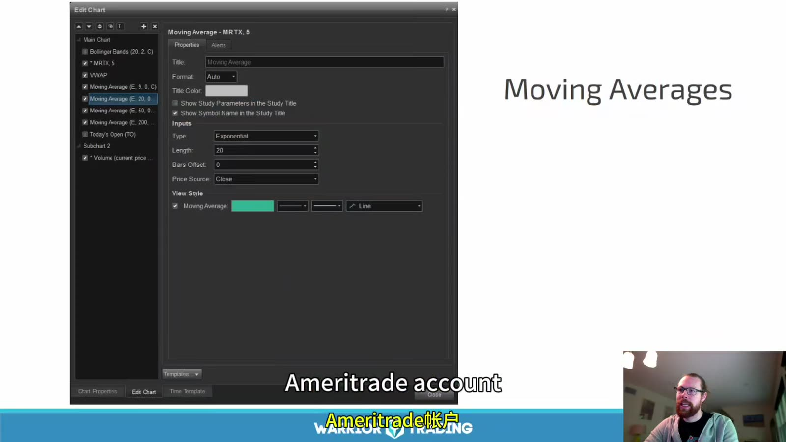
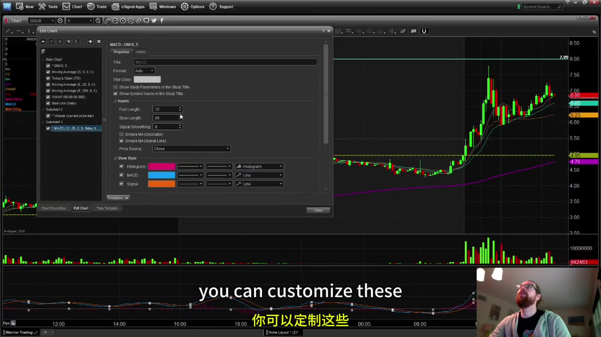
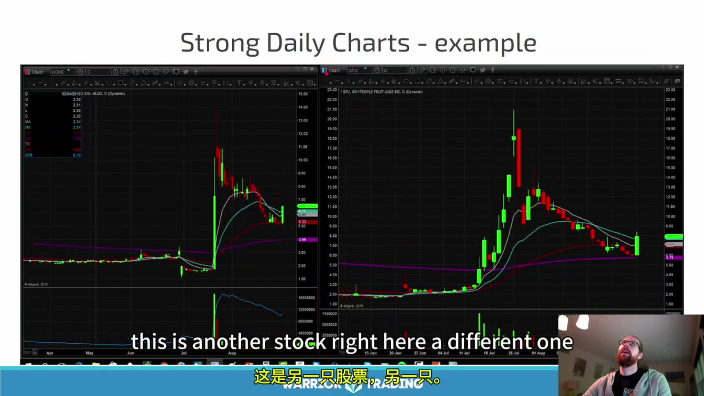
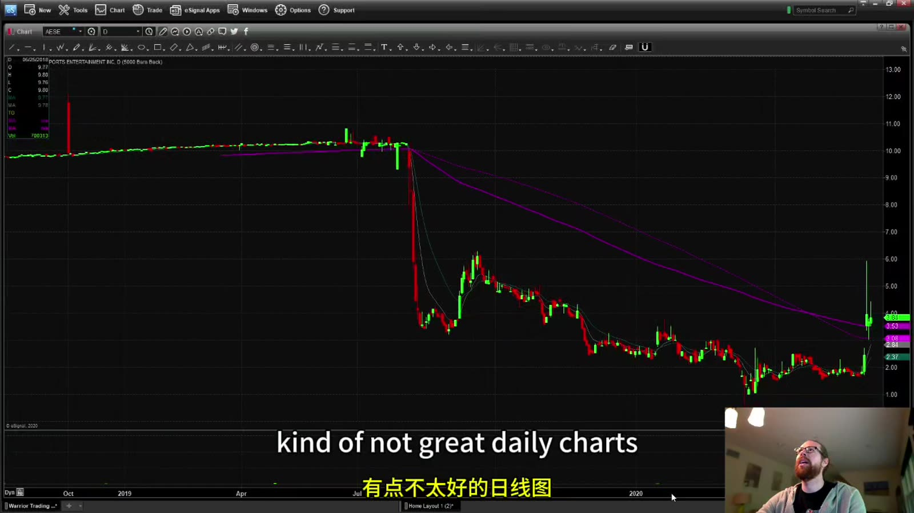
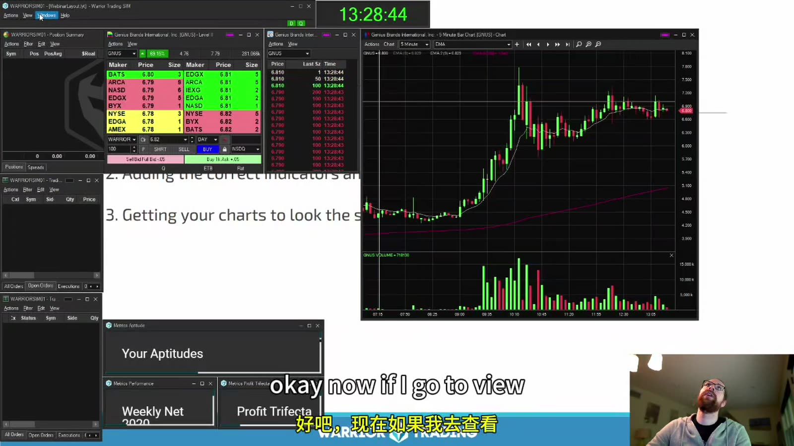
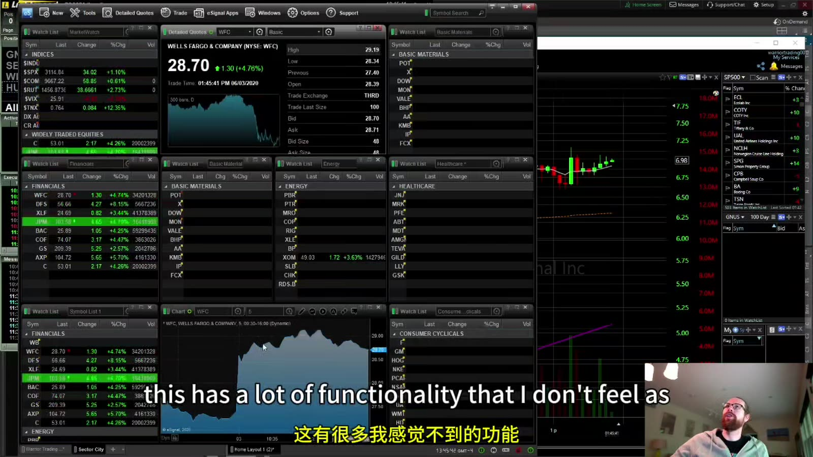

# Starter 07：指标、日线质量与图表工作区

> 对应视频：Chapter 5 Part 6–8（38:33、21:28、44:36）
> 本节重点：知道 EMA、VWAP、RSI、MACD 和成交量实际计算什么，筛选更干净的日线，并建立不会拖慢决策的工作区。

## 1. 指标是价格数据的变换，不是额外的真相

课程展示了同时添加 RSI、RMI、Bollinger Bands、MACD 和 Stochastic 后的复杂图。问题不是指标“无效”，而是多个指标常用相同 OHLC 数据计算，容易重复计票：

- 价格上涨使短均线向上；
- 同一上涨又使 MACD 变强；
- RSI 同时进入高位；
- 三个提示看似独立，实际来自同一个价格动作。

使用指标前先写清：

- 输入数据与时段；
- 参数；
- 信号发生在盘中还是收盘；
- 是过滤器、触发器还是退出参考；
- 对实际结果增加了什么信息。

## 2. SMA 与 EMA

简单移动平均：

`SMA(n) = 最近 n 个周期收盘价之和 ÷ n`

指数移动平均给近期价格更高权重，递推形式为：

`EMA(today) = α × Price(today) + (1 - α) × EMA(previous)`

其中 `α = 2 / (n + 1)`。

同一个 `9 EMA` 在 1 分钟、5 分钟和日线上完全不同，因为每个周期的输入 K 线不同。EMA 也会随着当前未收盘 K 线变化。



**图怎么看：**

- 设置窗口显示 Type 为 Exponential、Length 为 20，表示 20 周期 EMA。
- `Price Source = Close` 说明使用每根 K 线收盘价；改成 typical price 等输入会得到不同数值。
- `Bars Offset` 应保持明确，正负偏移可能把线视觉上挪到未来或过去，造成误读。
- 视频中的 Ameritrade 界面属于历史软件环境；应理解参数含义，而不是照着旧菜单位置操作。

课程主要使用：

- 9 EMA：很短的盘中动量参考；
- 20 EMA：稍慢的短期趋势；
- 200 EMA：更长周期的位置参考。

这些参数受欢迎不等于自然法则。不要在事后轮流尝试 8、9、10、20、21、50，直到找到“刚好托住”的那条线。

## 3. VWAP

日内 VWAP 的概念计算：

`VWAP = Σ(价格 × 成交量) ÷ Σ成交量`

价格输入可能是成交价或 K 线 typical price，取决于平台。它近似表示当天按成交量加权的平均交易价格。



**图怎么看：**

- 图中价格大幅上行后，9/20 EMA 紧跟短期价格，200 EMA 离得更远；各线反应速度不同。
- VWAP 若包含盘前成交，会与只从 9:30 开始计算的版本不同。
- 调色和线宽只是可读性设置；线越醒目不代表重要性越高。
- 平台间出现几分钱差异时，先核对 session、数据源、复权和计算输入，不要假定某一家“算错”。

常见解释：

- 价格在 VWAP 上方：当前价高于当日量加权均价；
- 在下方：当前价低于均价；
- 来回穿越：市场可能没有明确方向。

“上方就是强、下方就是弱”是描述，不是买卖规则。高位价格可远离 VWAP 后继续上涨，也可能均值回归；低位同理。

## 4. Volume

成交量回答“有多少股成交”，不直接回答：

- 有多少独立交易者；
- 买方是否比卖方多——每笔成交同时有买卖双方；
- 主动买/卖的完整比例；
- 可见挂单是否真实；
- 未来是否继续有流动性。

比较成交量时使用一致基准：

- 同一股票历史同期；
- 同一日内时间；
- 突破与回撤；
- 成交量增加后，价格是否有相应 progress。

高量但价格不再上涨可能是吸收或分配，不能只把高量视作确认。

## 5. RSI

经典 RSI 以一段周期内平均涨幅与平均跌幅计算，常见默认参数为 14，范围 0–100。70/30 常被标为 overbought/oversold。

注意：

- overbought 不等于立即做空；
- 强趋势中 RSI 可长时间处于高位；
- 参数和周期改变会显著改变信号；
- RSI 低可能来自持续弱势，而非“便宜”；
- 背离只有在事先定义 swing 后才能客观测试。

课程讲者介绍但不使用 RSI。正确做法不是因此排除 RSI，而是只有在它对明确策略带来可测的增量后才保留。

## 6. MACD

经典 MACD：

`MACD line = EMA(12) - EMA(26)`

`Signal line = MACD line 的 EMA(9)`

`Histogram = MACD line - Signal line`

它反映两条均线之差及其变化，必然落后于快速价格动作。交叉信号在横盘中可能频繁来回；需要趋势、波动和位置过滤。

## 7. Strong Daily Chart 的含义

课程偏好的“强日线”不是公司质量评级，而是适合其小盘动量策略的结构：

- 当前价在 200 EMA 上方，或到 200 EMA 仍有足够空间；
- 上方历史阻力较少、间距清晰；
- 有较大的 gap / window；
- 过去曾在高量下持续上涨，即 former runner；
- 最近不是连续“冲高长上影后回落”；
- 当前触发位到第一阻力仍有合理 reward。



**图怎么看：**

- 两张图都显示过快速扩张和高成交量，说明这些股票曾能吸引集中注意力。
- 右图随后逐步回落；“former runner”只能说明历史上跑过，不能保证下次重复。
- 历史高位留下的持仓者可能在反弹时卖出，形成 overhead supply。
- 比较时要核对拆股复权；低价股多次 reverse split 后的旧价格不能直接当自然阻力。

Former runner 是筛选变量，不应成为结果标签。要避免只记得后来大涨的股票而忽略大量“以前跑过、后来没跑”的样本。

## 8. 弱或杂乱的日线



**图怎么看：**

- 价格长期处在下倾的长周期均线下方，历史反弹多次失败。
- 图上有许多重叠 K 线和长上影，上方潜在供应难以简化成一个清晰目标。
- 最右侧突然放量上涨仍可能形成日内机会，但日线背景要求更保守的目标和仓位。
- “图不好看”要翻译成具体原因：上方阻力近、reward 小、假突破历史多，而不是凭审美否决。

警惕这些结构：

- 当前价正顶在 200 EMA；
- 每次 spike 都收成长上影；
- 最近刚有大批买家在更高价被套；
- 历史价格因反向拆股而失真；
- 上方每几分钱都有转折；
- gap 已几乎填完，第一目标就在眼前。

## 9. 日线筛选打分

可以用简单记录代替主观“强/弱”：

| 项目 | 0 | 1 | 2 |
|---|---|---|---|
| 到第一阻力空间 | 小于风险 | 约 1–2R | 大于 2R |
| 200 MA | 正在压制 | 仍有空间 | 已站上且确认 |
| 历史延续 | 多次失败 | 混合 | 多次有量延续 |
| Overhead supply | 密集 | 中等 | 稀少 |
| 当前成交量 | 弱 | 一般 | 明显异常 |

这个分数只是保持一致性的工具；真正结果仍需统计，不要随意调权重。

## 10. 工作区只保留决策必需信息

课程在多个历史平台上演示设置。软件名称、价格和功能已经可能变化，因此保留的是结构：

- 1 分钟图；
- 5 分钟图；
- 日线；
- volume；
- VWAP；
- 少量固定均线；
- Level 2 / order entry；
- Time & Sales；
- 新闻和 scanner；
- positions / open orders / risk controls。



**图怎么看：**

- 图中多个浮动窗口互相遮挡，正体现“功能齐全”不等于工作流清晰。
- 中间图表显示 K 线、均线和 volume；左侧 Level 2 与订单区域应和正确 symbol 联动。
- 任何 linked window 都应在模拟环境测试，避免图表已切换但订单窗口仍停留在另一股票。
- 字体、颜色和窗口大小应优先保证 symbol、side、size、price 和 order status 可见。



**图怎么看：**

- 画面包含 watchlists、板块、报价、图表和基本面等大量模块。
- 与当前策略无关的面板会占用屏幕和注意力，也可能增加 CPU、内存和数据带宽。
- 日内执行的目标不是展示更多信息，而是在几秒内确认标的、触发、仓位、订单与风险。
- 课程讲者自己的软件操作也有找不到设置、误删指标等情况，所以模板保存和开盘前检查很重要。

## 11. 平台无关的设置步骤

1. 选择行情时区和 regular / extended-hours；
2. 确认 K 线复权方式；
3. 建立 1 分钟、5 分钟、日线模板；
4. 统一颜色：9、20、200 EMA 与 VWAP 不冲突；
5. 把 volume 独立显示，避免遮挡价格；
6. 链接 symbol，但保留明显的订单窗口 symbol；
7. 保存模板并重启验证；
8. 用模拟账户测试 market/limit、cancel、flatten；
9. 人为断网或关闭一个模块，验证备用退出流程；
10. 开盘前检查时间、行情延迟和账户环境。

## 12. 性能和故障风险

视频同时运行多套图表后出现卡顿。真实交易前要测：

- CPU / memory 峰值；
- 多屏和高频刷新下的延迟；
- 行情断线如何提示；
- 软件是否自动重连；
- open orders 是否仍在券商端；
- 快捷键焦点落错窗口时会发生什么；
- 备用网页或电话平仓渠道。

10 秒或 tick 图的更新量很大；如果它不改善已验证的决策，就不值得为了“看得更细”牺牲稳定性。

## 13. 最小模板

```text
左：1-minute + volume + VWAP + 9/20 EMA
中：5-minute + volume + VWAP + 9/20/200 EMA
右上：daily + volume + 200 MA + 手工水平
右中：Level 2 + Time & Sales
右下：order entry + positions + open orders
侧边：scanner + verified news
```

指标越少，越需要清楚每一条线为什么存在。最终保留标准是：**删掉它以后，是否会让预先定义的决策明显变差？如果不会，就删。**
