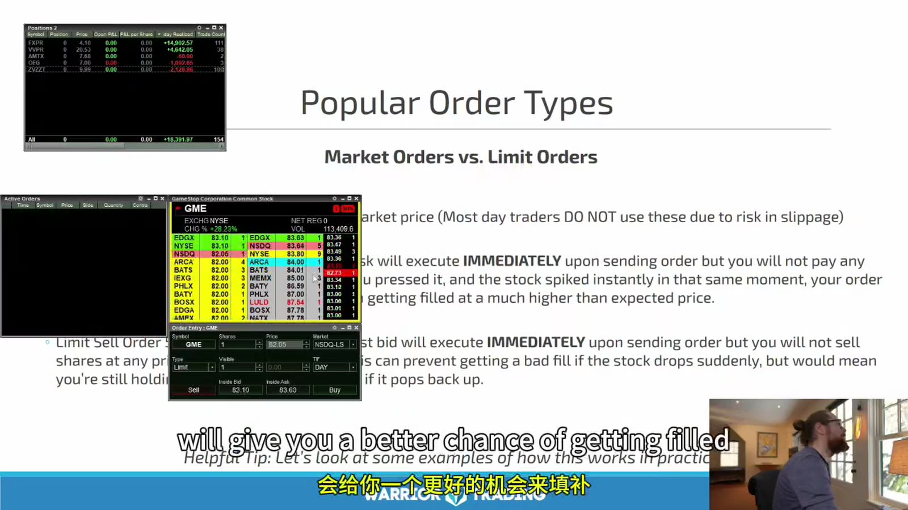
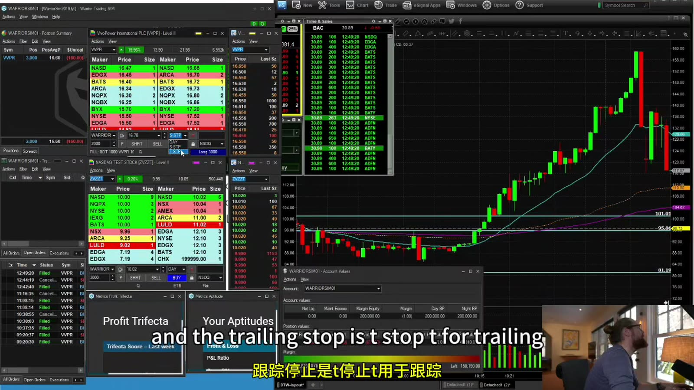
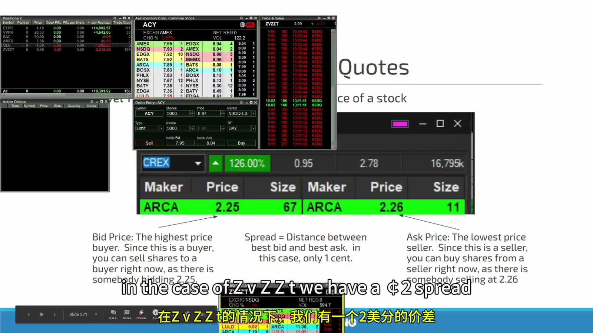
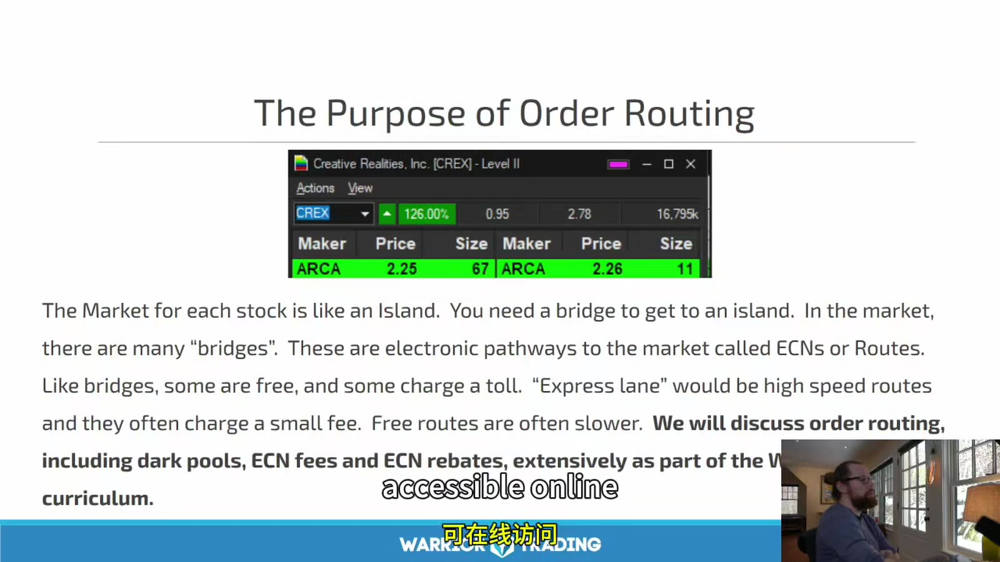

# Starter 08：订单类型、Level 1 报价与路由

> 对应视频：Chapter 7、Chapter 8（43:09、24:05）
> 本节重点：理解 market、limit、stop 的成交约束，读懂 bid/ask/spread，并把未成交和滑点当成策略风险。

## 1. 下单不是“按买入键”，而是提交一组约束

订单至少包含：

- symbol；
- side；
- quantity；
- order type；
- limit / stop price；
- route / destination；
- time in force；
- regular 或 extended hours；
- account。

任何一个字段错误都可能比方向判断错误更危险。熟练度应先在模拟环境中形成，不能用真钱订单来测试按钮。

## 2. Market Order

市价单的核心是优先成交，而不是保证价格。它会和当时可用的对手盘依次成交，因此实际平均价取决于：

- 点差；
- 每档可成交数量；
- 市场移动速度；
- 路由和延迟；
- 是否处于停复牌或开盘；
- 订单大小相对深度。

**图怎么看：**

- 画面强调 market order 可能立即执行，但没有价格上限或下限保护。
- “立即”不等于零延迟，也不等于整笔同价成交；大订单可能扫过多个价位。
- Limit order 控制最差价格，却不保证成交。
- Stop order 是触发机制；触发后究竟变成 market 还是 limit，要看具体类型。

课程说“多数日内交易者不用 market order”不能泛化。高流动性产品、紧急减仓或某些自动策略仍会使用；关键是预估市场冲击，而不是按身份决定。

## 3. Limit Order

买入限价单：成交价不能高于 limit。
卖出限价单：成交价不能低于 limit。

### Marketable limit

若 ask 为 10.02：

- buy limit 10.10 通常会立即与 10.02 及更高、但不超过 10.10 的卖单撮合；
- 它不是“等价格涨到 10.10 才买”；
- 如果只有 600 股在 10.02，而订单是 3,000 股，剩余部分可能在更高档成交或留在簿上。

使用 offset 的作用是容许一定价格范围，不是保证全成。固定 0.05 或 0.10 美元会随股价、spread 和波动变化，不能用于所有标的。

### Non-marketable limit

若 bid/ask 为 9.99/10.02，buy limit 9.95 会等待市场回落或卖方主动打到该价。排队位置、隐藏订单和其他场所会影响是否成交；“价格打印过 9.95”也不保证你的订单得到 fill。

## 4. 退出时未成交也是风险

卖出 limit 设置在 bid 下方，可以成为 marketable limit，给价格保留一个下界。但快速下跌越过 limit 后：

- 订单可能完全未成交；
- 只成交一部分；
- 剩余持仓继续暴露；
- 交易者需要 cancel/replace 或使用其他退出方式。

风险计划不能只写 stop price，还要写：

- stop 触发后的订单类型；
- 可接受最大 slippage；
- partial fill 怎么办；
- halt 后如何处理；
- 平台失效时的备用渠道。

## 5. Stop Market 与 Stop Limit

假设多头持仓，触发价 9.90：

- **Sell stop market**：触发后成为市价单，优先退出，价格不保证；
- **Sell stop limit**：触发后成为限价单，例如最低 9.80，价格受保护，但跌穿后可能仍持仓。

跳空时两者差异最大。如果下一笔可成交价直接是 9.20：

- stop market 可能接近 9.20 成交；
- stop limit 9.80 可能完全不成交。

不存在同时保证退出和保证价格的订单。

## 6. Mental Stop 的真实含义

Mental stop 不是订单，只是交易者计划在某价手动操作。它增加：

- 反应延迟；
- 犹豫和改变规则；
- 网络或软件故障；
- 订单录入错误；
- 突发跳空；
- 同时管理多标的时漏看。

课程讲者因盯住单一标的而偏好 mental stop，这是个人执行方式，不应被当成普遍更优。新系统应分别统计真实 stop order 和人工退出的滑点与违约率。

课程对“市场参与者能看到个人 stop 并刻意把价格推过去”的说法过度简化。普通 stop 在触发前是否以及如何被显示，取决于券商和场所；从图上看到价格扫过集中止损区，也不能证明有人针对某个账户。可以讨论流动性聚集，不要用无法验证的意图解释亏损。

## 7. Trailing Stop

Trailing stop 会随有利方向移动触发价，但通常不会在价格回落时放宽：

- 按固定金额：例如始终落后最高价 0.20；
- 按百分比：例如落后最高价 3%。

需要确认：

- 参考 last、bid、ask 还是其他价格；
- 是否在盘前盘后有效；
- 触发后成为 market 还是 limit；
- 券商端还是本地软件维护；
- halt 或断线期间如何处理。

高波动股票的正常噪声可能轻易触发过紧 trailing stop。

**图怎么看：**

- 左侧 Level 2、订单和持仓与右侧图表同时显示，说明订单类型必须结合实时 spread 使用。
- Trailing stop 不是图上一条静态线，它会按规则重新计算触发价。
- 顶部还显示不同账户或平台窗口；下单前必须确认 active account。
- 视频软件和菜单属于历史版本，任何参数都应在当前券商模拟环境重新验证。

## 8. Level 1：先读最优价

Level 1 通常显示：

- best bid；
- bid size；
- best ask / offer；
- ask size；
- last trade；
- day high/low、volume 等附加字段。

**图怎么看：**

- 示例最优 bid 为 2.25、ask 为 2.26，quoted spread 是 0.01。
- Size 往往以 round lots 或平台规定单位显示；图中 `67` 是否等于 6,700 股必须按该平台解释。
- Bid size 不是“所有想买的人”，ask size 也不是市场总供应；它们只是可见最优档的一部分。
- Last price 可能落后于快速变化的 bid/ask，不能只按 last 决定 limit。

基本关系：

`Quoted spread = Best ask - Best bid`

若买在 ask、立刻卖在 bid，即使市场不动，也先承担一个 spread。仓位越大，还可能扫到下一档，实际成本更高。

## 9. Level 1 看不到什么

它看不到或不能完整体现：

- 最优价之后的深度；
- 其他场所未汇总的细节；
- hidden / reserve liquidity；
- 即将取消的订单；
- 你的队列位置；
- 未来成交意愿。

所以 Level 1 适合快速知道当前 inside market，但不足以证明某价位“有墙”。

## 10. Order Routing

订单从券商到交易所、ECN、做市商或其他执行场所，需要 route。常见选择包括：

- smart router；
- direct route；
- venue-specific route；
- 某些暗池或流动性提供方；
- broker internalization。

**图怎么看：**

- 课件把不同电子场所比作通往市场的桥，表达 route 会影响订单去哪里寻找对手盘。
- “贵的 route 一定快、免费的 route 一定慢”过度简化；执行质量取决于标的、订单和当时流动性。
- ECN fee/rebate 可能影响净成本，但不能为了 rebate 牺牲 fill quality。
- Smart router 的逻辑由券商实现，名字相同不代表行为相同。

评估路由不能只看一次速度。至少记录：

- fill rate；
- time to first/complete fill；
- price improvement；
- average slippage；
- partial fills；
- add/remove liquidity fees；
- reject/cancel rate；
- 不同交易时段的差异。

## 11. Time in Force

常见：

- `DAY`：当日有效；
- `GTC`：取消前持续有效；
- `IOC`：立即能成交的部分成交，剩余取消；
- `FOK`：要求立即全部成交，否则取消；
- extended-hours 选项：是否参与盘前盘后。

具体支持和定义由券商决定。GTC 遇到拆股、分红等公司行动可能被调整或取消；不能“设完忘掉”。

## 12. 一笔订单的成本账

完整成本近似：

`总成本 = 佣金 + 路由/场所费用 - rebate + spread + slippage + market impact + borrow`

零佣金只把其中一项降为零。比较策略时应使用成交报告里的实际均价与费用，不使用图上的理想价。

## 13. 模拟环境必须完成的测试

- market、marketable limit、non-marketable limit；
- partial fill 后修改和取消；
- stop market 与 stop limit 的跳空差异；
- trailing stop 的参考价；
- IOC / DAY / extended-hours；
- cancel all 与 cancel symbol；
- 长仓、空仓下的 flatten；
- 断网、重启和备用退出；
- 错 symbol、错账户、错股数的防护。

本节的核心是一个不可消除的取舍：**价格保护越强，越可能不成交；越要求马上成交，越无法保证价格。**
