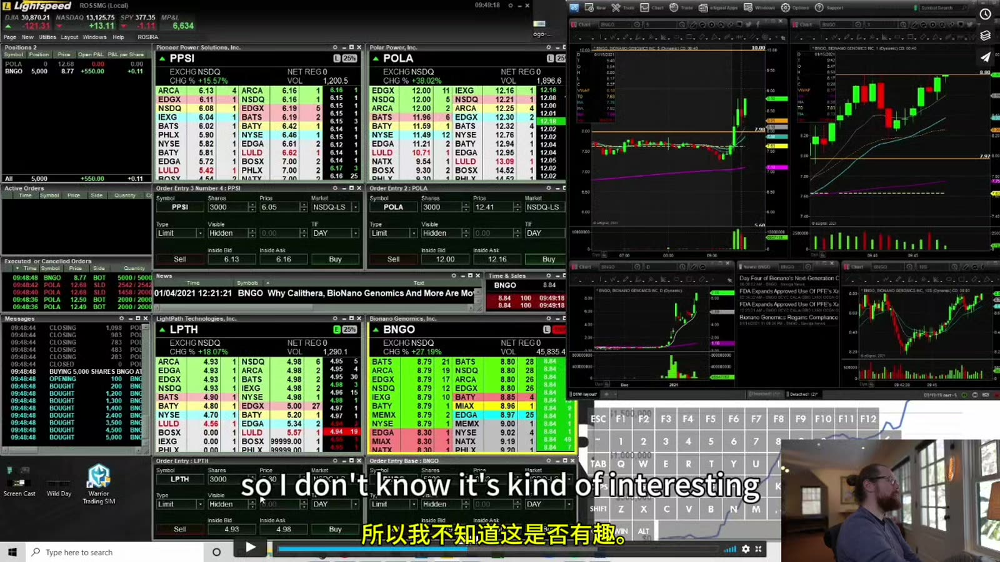
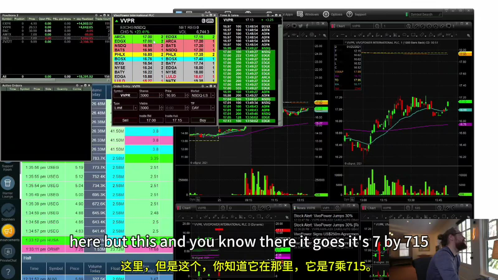
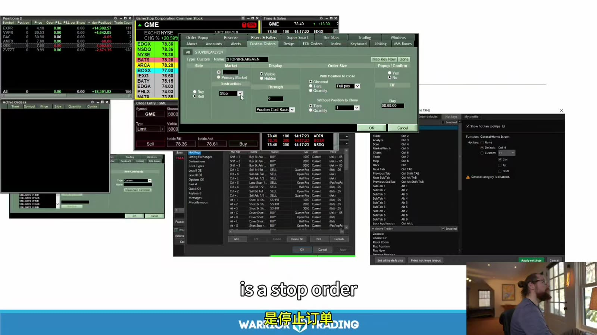
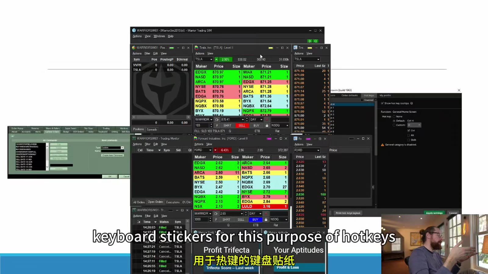

# Starter 09：Level 2、盘口语境与热键

> 对应视频：Chapter 9 Part 1–2（29:22、29:35）
> 本节重点：把 Level 2 当作当前可见意图的快照，而不是预测工具；热键则按生产系统管理，任何修改都先经过模拟和复核。

## 1. Level 2 比 Level 1 多了什么

Level 1 只给最优 bid/ask；Level 2 展示多个价位、场所和可见 size。常见列：

- Market maker / ECN；
- Bid price / bid size；
- Ask price / ask size；
- 不同价格档；
- 有时按颜色区分价位。

它帮助回答：

- 最优价后面还有多少可见深度；
- spread 是否突然扩大；
- 某价位是否反复补单；
- 订单簿在突破前后如何变化。

它不能直接回答：

- 挂单是否会在成交前撤走；
- 是否有 hidden / reserve order；
- 其他场所全部流动性；
- 某个大单属于谁；
- 价格下一步必然方向。

## 2. Size 先确认单位

有的平台把 `1` 显示为 100 shares，有的显示实际 shares，也可能因 odd-lot 展示规则不同。课程画面中的数字不能脱离平台解释。

实际使用前：

1. 查平台字段文档；
2. 用模拟或小额订单观察自己的单如何显示；
3. 分清 aggregated size 和 venue-specific size；
4. 确认刷新速度和行情订阅等级。

## 3. 盘口只是“此刻愿意展示”

公开限价单可以：

- 立即取消；
- 改价；
- 只显示一部分；
- 被其他订单抢先成交；
- 在不同场所重复或聚合显示。

所以“ask 有 50,000 股，因此绝不可能突破”不成立；同样，“bid 有大墙，因此安全”也不成立。更有信息量的是互动过程：

- 成交不断打在 ask，大单 size 是否减少；
- size 减少后是否在同价补回；
- 打穿后 bid 是否抬高；
- 突破后价格是否接受新区域；
- 大 size 是被成交，还是突然撤走。

## 4. Level 2 与图表必须看同一标的



**图怎么看：**

- 画面同时监控多只股票，每只股票都有独立 Level 2、图表或订单区。
- 多窗口增加切错 symbol 的风险；颜色链接不能替代订单窗口中醒目的 symbol。
- 左下还显示当日成交记录；盘中复盘信息不应遮挡 open orders 和 positions。
- 历史界面布局只说明信息关系，不代表应该复制相同窗口数量。

最小安全联动检查：

- 点击 watchlist 后，图表、Level 2、Time & Sales 是否同步；
- order entry 是否同步，还是保持原 symbol；
- hotkey 使用当前焦点、鼠标所在窗口，还是固定窗口；
- 多账户时 account 是否一起改变；
- symbol 字段能否在发送前被风险弹窗复核。

## 5. 盘口颜色不等于买卖信号

绿色、红色、黄色通常只是平台对 bid、ask、成交方向或相同价位的视觉编码。不同平台规则不同。尤其 Time & Sales 中：

- 成交在 ask 附近常被标为主动买；
- 在 bid 附近常被标为主动卖；
- spread 内成交可能用中性色；
- 报价变化和数据延迟会造成分类误差。

颜色不是交易者真实意图标签。

## 6. “大卖单突破”怎么观察

假设 ask 7.00 显示 20,000 shares：

1. 记录显示 size；
2. 观察成交是否连续发生在 7.00；
3. 区分 size 被成交减少，还是未成交就撤走；
4. 突破后检查 7.00 是否转为 bid；
5. 查看 7.01–7.10 是否有新供应；
6. 若价格立刻跌回 7.00 下，按 failed breakout 处理。

不能因为看见一次 7.00 打穿就推断全部 20,000 股被同一买方吃掉。



**图怎么看：**

- 左侧 WPR 的盘口显示多个价位和场所，右侧 1 分钟、5 分钟图展示不同粒度。
- 盘口适合观察触发附近的秒级变化，图表负责更大的结构和 invalidation。
- 画面口述某个价位，但截图本身不能证明随后结果；应记录实时决策而不是只保存成功后的图。
- 多个 Level 2 同屏可能分散注意力，新手应先只管理一只股票。

## 7. Spoofing 与无法验证的故事

有些订单可能在影响市场观感后被快速取消，操纵性 spoofing 是受禁止的行为。但从个人 Level 2 看到大单撤走，不能直接断言违法：

- 正常交易者也会因市场变化取消；
- 订单可能在另一场所成交；
- 数据聚合和延迟会改变显示；
- 需要更完整的消息级数据才能重建行为。

操作上只需要接受：可见 size 可以消失，因此止损不能建立在“大墙会保护我”的假设上。

## 8. Hotkey 是预先编程的订单

热键可能把以下字段一次性发送：

- buy / sell / short / cover；
- 固定股数或按购买力计算；
- bid/ask 加 offset；
- limit / market / stop；
- route；
- time in force；
- sell full / half / quarter；
- cancel 或 flatten。

速度来自省略人工输入，也同时省略了人工复核。



**图怎么看：**

- 多个设置窗口展示 price source、order side、position size、stop 等字段；一个小选项就能改变真实订单。
- 画面中的 `stop order` 需要继续确认触发后是 market 还是 limit。
- 配置窗口背后仍有真实 Level 2 和持仓，因此不应在开盘或持仓中临时修改。
- 不同平台同名字段可能语义不同，不能照抄课程快捷键文件。

## 9. 固定股数热键的风险

课程示例用 Shift+1 买 1,000 shares、Shift+2 买 2,000 shares。固定股数会让美元风险随 stop distance 改变：

| 每股风险 | 1,000 股理论风险 |
|---:|---:|
| $0.05 | $50 |
| $0.20 | $200 |
| $0.80 | $800 |

更稳妥的逻辑：

`shares = 向下取整(max dollar risk ÷ per-share risk)`

还需受以下上限约束：

- 最大名义仓位；
- 可用购买力；
- 日均成交与 Level 2 深度；
- 券商的最大订单；
- 单只股票集中度。

课程展示“使用 90% 购买力”的小账户挑战，并明确说不适合初学者。资料中不把这种挑战模式作为建议；高杠杆全仓会把滑点、停牌和平台错误放大到不可恢复。

## 10. Offset 的方向必须逐一验证

例如多头：

- buy limit：ask + offset；
- sell marketable limit：bid - offset。

空头和 cover 的符号关系不同。若平台把 `offset` 定义成绝对值、tick 或百分比，照抄 `0.10` 会产生完全不同订单。

每个热键都应在模拟器用人工计算复核：

```text
当前 bid/ask:
期望 side:
期望 quantity:
期望 limit:
期望 route:
实际 order ticket:
实际 fill:
```

## 11. Sell Full / Half / Quarter

部分退出可以：

- 降低风险；
- 锁定部分盈利；
- 让剩余仓位参与延续。

但 half/quarter 热键要处理：

- 奇数股的舍入；
- partial fill 后当前仓位变化；
- 多次快速按键；
- pending sell orders 尚未取消；
- 空仓时是否意外开出 short；
- 跨 symbol 焦点错误。

优先使用 `reduce-only` 或平台等效保护（若支持），并设置最大订单量。

## 12. Cancel 与 Flatten 不一样

- Cancel all：取消未成交订单，不一定平仓；
- Flatten：通常平掉当前持仓，并可能取消关联订单；
- Reverse：平掉后建立相反方向，风险很高；
- Cancel symbol：只处理当前标的；
- Cancel buys/sells：只处理一侧。

必须人为测试平台具体行为。不要把 `cancel all` 当作紧急平仓键。

## 13. Stop at Breakeven 不是无风险

把 stop 放在 average cost：

- 触发后仍可能滑点；
- 佣金和费用使净结果为负；
- spread 可能让触发价与成交价不同；
- average cost 在加减仓后会改变；
- 过早移动 stop 可能让正常回撤退出。

所以称 `breakeven stop` 只是价格参考，不是结果保证。

## 14. 键盘贴纸与防误触



**图怎么看：**

- 画面同时展示多个平台的 hotkey 菜单，说明不同软件可用功能和语义差异很大。
- 键盘贴纸能减少记忆错误，但不能防止焦点、账户和 symbol 错误。
- Buy 与 sell-full 不应安排在容易同时或相邻误触的位置。
- 修改后应导出带日期版本；不能只依赖平台里一份未记录配置。

安全设计：

- 危险动作使用组合键；
- buy 与 short 明显分开；
- `flatten` 与 `reverse` 远离；
- 限制单笔 shares / notional；
- 打开 audible fill / reject；
- 保留 order confirmation，直到模拟熟练且风控可靠；
- 每天用 test symbol 或模拟账户做开盘前检查。

## 15. 热键变更流程

1. 记录变更原因；
2. 导出旧配置；
3. 在收盘后修改；
4. 静态检查 side、size、price、route、TIF、account；
5. 模拟环境测试正常、partial、reject、halt 场景；
6. 重启软件再次测试；
7. 小规模实盘验证；
8. 观察至少数日错误率，再扩大使用。

本节结论：**Level 2 可以改善执行语境，但不能预言；热键可以缩短动作时间，但必须用更强的测试和限制换取这份速度。**
