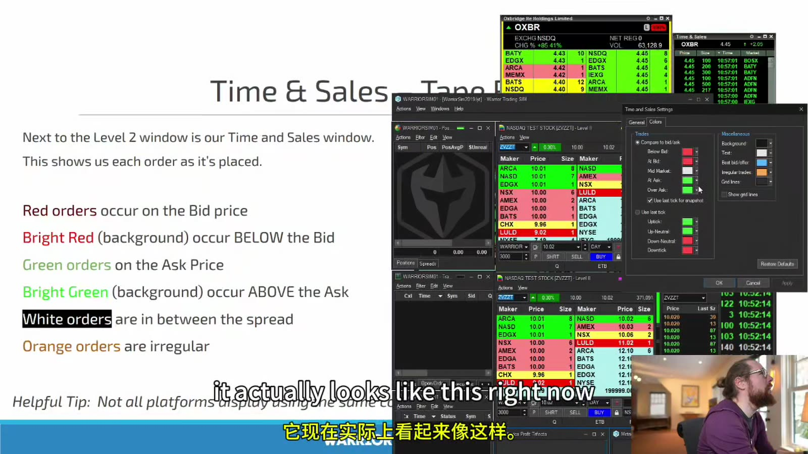
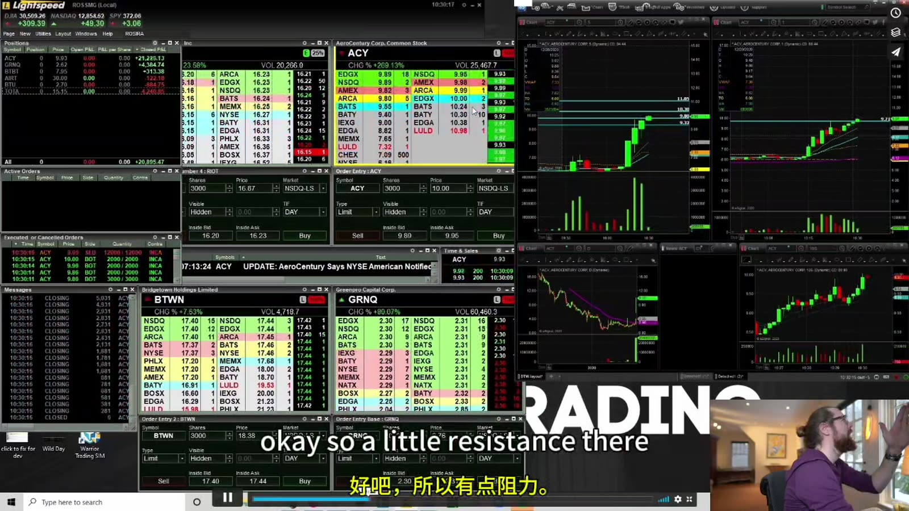

# Starter 10：Time & Sales 与成交节奏

> 对应视频：Chapter 10（1:05:41）
> 本节重点：分清“已成交”与“正在挂单”，从成交速度、价位和价格进展观察 tape，而不是凭红绿颜色猜方向。

## 1. Time & Sales 显示的是成交，不是每一张订单

课程幻灯片写 “shows us each order as it’s placed”，这不准确。Time & Sales 通常显示已经发生的 trades：

- 成交时间；
- 成交价格；
- 成交数量；
- 交易场所或条件代码；
- 平台推断的颜色。

未成交的限价订单属于 order book / Level 2；已取消的挂单通常不会成为 Time & Sales print。

## 2. 一笔成交同时有买方和卖方

所谓：

- green print；
- red print；
- buyer/seller initiated；

是根据成交价相对当时 bid/ask 的位置推断哪一侧更主动，不是说绿色成交“只有买没有卖”。

常见分类：

- at/near ask：可能标绿；
- at/near bid：可能标红；
- spread 内：可能白色或其他颜色；
- above ask / below bid：亮色或背景高亮；
- irregular condition：橙色等。

数据延迟、报价更新顺序、跨场所和特殊成交条件都可能使颜色分类不完美。



**图怎么看：**

- 左侧文字把红色解释为 bid 成交、绿色解释为 ask 成交，白色为 spread 内。
- “Bright red below bid / bright green above ask”可能来自报价更新与成交报告时序，也可能是特殊快速行情，不能自动视为异常机会。
- 右侧设置窗口说明颜色是软件规则，可以被用户修改；记颜色前先读平台定义。
- 画面中 Level 2 与 tape 并列：一个是可见意图，一个是已经成交的事实。

## 3. 看 Tape 的四个维度

### Price

成交是否：

- 持续抬高；
- 在同一阻力重复；
- 突破后回落；
- 在 bid/ask 两侧来回。

### Size

观察相对值，不只盯单笔大单：

- 大 prints 是否连续；
- 总成交量增加后价格是否推进；
- 大单是否都发生在同一价；
- 是否有很多小单共同产生同样效果。

### Speed

成交从零散变密集，说明参与度和紧迫性上升。但速度快也可能是卖出恐慌；必须结合价格方向。

### Response

最重要的是成交之后价格做什么：

- ask 被持续成交，报价是否上移；
- 大量 green prints 后仍不涨，可能存在吸收；
- bid 被持续击穿，是否出现新低；
- 突破价是否能成为新 bid。

## 4. Tape Reading 的最小序列

假设阻力 5.00：

1. Level 2 显示 5.00 ask；
2. Tape 开始连续在 5.00 成交；
3. 可见 ask size 降低或补回；
4. prints 出现在 5.01、5.02；
5. bid 抬到 5.00；
6. 回踩时 5.00 是否继续成交并守住。

只有第 2 步不能叫“突破确认”。完整序列要看到 price progress 和 acceptance。

## 5. Absorption

当大量主动成交打在某价，但价格无法继续：

- 许多 ask-side 成交却不涨：上方可能有隐藏或补充供应；
- 许多 bid-side 成交却不跌：下方可能有吸收需求。

这只是可检验的订单流解释，不能从零售数据确定是谁在吸收。操作上把“高成交但无进展”视作警告，并定义价格失效点。

## 6. 大单不一定领先

单笔 50,000 shares 可能是：

- 普通大宗成交；
- 多笔聚合报告；
- 延迟或特殊条件打印；
- 已经发生的机构交叉；
- 在另一个场所完成；
- 对当前可交易价格没有持续影响。

因此不因单笔 size 追价。先看之后若干秒：

- bid/ask 是否改变；
- 后续成交是否跟随；
- 图表是否突破；
- spread 是否收窄或扩大。

## 7. Tape 与图表的职责不同



**图怎么看：**

- 左侧多个 Level 2 / Time & Sales 窗口用于读取秒级成交，右侧图表用于看 1 分钟、5 分钟和日线位置。
- 图上横线提示历史阻力，tape 用于观察价格到达该区时是否有真实成交支持。
- 单帧截图只能看到一个时点，无法展现“速度”；复盘时需要成交导出或逐段视频，而不能凭静态颜色总结。
- 画面窗口很多，新手先只观察一个阻力位和一只股票，避免把噪声当信号。

图表用于：

- context；
- setup；
- trigger level；
- invalidation。

Tape 用于：

- 触发附近是否加速；
- limit 是否可能成交；
- 突破是否被接受；
- 退出时流动性是否恶化。

Tape 不能把一个坏的日线或不合理 reward/risk 变成好交易。

## 8. Spread 内成交怎么处理

若 bid/ask 为 10.00/10.05，10.03 的成交可能来自 midpoint、价格改善或其他订单机制。它不适合简单归类为买方或卖方。

观察重点：

- 后续 quote 是否向 10.03 靠拢；
- 同类成交是否持续；
- NBBO 是否在报告前已经变化；
- 数据源是否完整。

不确定就归为 neutral，不强行讲故事。

## 9. 开盘、Halt Resume 与普通时段不同

开盘或停牌复牌时可能出现：

- auction print；
- 大量积累订单一次撮合；
- spread 突然很宽；
- quotes 快速重置；
- 成交速度远高于平时。

这些 prints 不应与连续交易中的普通单笔一一类比。先确认 condition code 和交易状态，再解释颜色。

## 10. Tape 训练方法

每次只选一个明确水平：

```text
symbol:
time:
level:
pre-level spread:
visible size:
prints at level:
speed change:
price progress:
held above/below:
actual fill:
result after 10s/30s/1m:
```

训练分三步：

1. 只看录像，暂停前先写判断；
2. 隐藏后续结果，防止 hindsight；
3. 用成交数据统计，不只收藏“看起来很明显”的案例。

## 11. 常见错误

- 把 Time & Sales 当成挂单列表；
- 看到 green 就买；
- 看到一个大 print 就猜机构方向；
- 忽略 spread；
- 只看成交速度、不看价格进展；
- 盘后用慢放能看懂，就以为实盘也能稳定执行；
- 把课程讲者口述的意图当作 tape 本身可证明的事实。

本节核心：**Tape 的价值不在颜色，而在“多少成交发生以后，价格有没有真正向前走”。**
