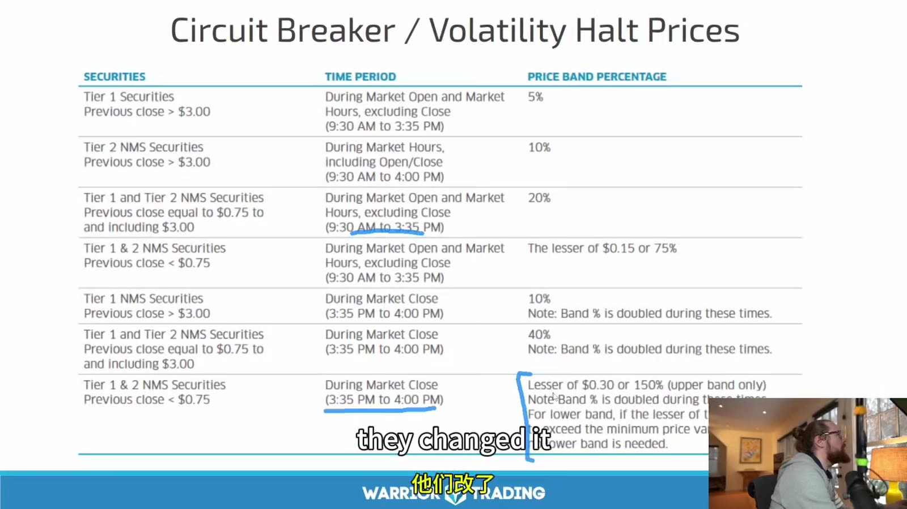
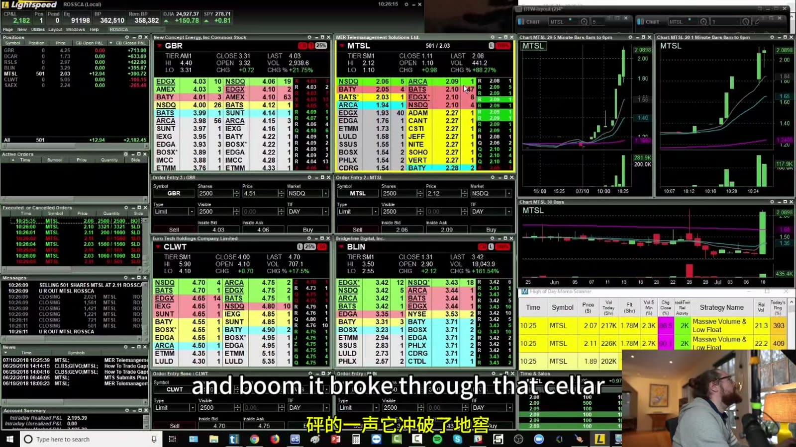

# Starter 11：交易停牌、LULD 与复牌风险

> 对应视频：Chapter 11（49:52）
> 本节重点：区分新闻停牌、监管停牌和波动暂停；停止使用课程里的旧静态表，按交易所当前状态和官方代码判断。

## 1. Halt 期间最重要的事实：不能正常成交

股票进入跨市场交易停牌或 LULD pause 后：

- 已有持仓通常无法在连续市场卖出；
- 新订单可能被拒绝、排队或参与复牌流程，取决于场所和券商；
- 显示的 indicative price 不等于保证复牌价；
- stop order 也无法在没有交易时提供退出；
- 复牌可能明显高于或低于停牌前价格。

因此 halt risk 不是普通 stop-distance 能完整覆盖的风险。

## 2. 先看 Reason Code

常见 Nasdaq halt codes 包括：

| Code | 含义 |
|---|---|
| T1 | News pending |
| T2 | News released / dissemination |
| T12 | 交易所请求更多信息 |
| LUDP | Volatility trading pause |
| LUDS | Volatility pause — straddle condition |
| M1 | Corporate action |
| M2 | Quotation not available |
| H10 | SEC trading suspension |
| MWC1/2/3 | 市场级熔断 |

列表会更新，且不同市场显示方式可能不同。当前代码以官方页面为准：
[Nasdaq Trader — Trading Halt Codes](https://www.nasdaqtrader.com/Trader.aspx?id=TradeHaltCodes)

## 3. News Pending 与 News Dissemination

`T1` 表示等待重大消息。消息发布后仍不代表马上恢复交易，可能经历：

1. 新闻发布；
2. 市场消化；
3. 报价恢复；
4. 交易所公布预计复牌时间；
5. 复牌撮合。

不要根据“通常 T1 是坏消息”建立仓位。方向取决于新闻内容和预期差，而且消息可能需要较长时间才能完整获得。

## 4. Regulatory / Information Halt

交易所可能因异常活动、合规、文件或信息请求暂停交易。此类 halt 可能远长于几分钟，不能按“下一档 5 分钟”猜复牌。

课程用历史案例说明：无新闻暴涨后，交易所向公司询问，股票长时间暂停并在复牌后下跌。案例可以提示尾部风险，但不能归纳成：

- 某个上市市场的股票必然这样；
- 公司说“无未披露重大信息”就一定跌 50%；
- Nasdaq 股票更安全；
- 所有无新闻上涨都是操纵。

唯一可靠做法是读取实时 reason code、交易所公告和公司原文。

## 5. LULD 的工作原理

Limit Up-Limit Down 计划旨在防止 NMS stocks 在动态价格带外成交。价格带通常围绕此前五分钟的平均参考价连续更新，Tier 1 / Tier 2 和交易时段会影响百分比。LULD 适用于常规交易时段。

官方概览：[NYSE — Limit Up / Limit Down](https://www.nyse.com/trade/trading-information)

**图怎么看：**

- 表格按 Tier、价格和时段列出不同 band percentage，说明阈值不是所有股票统一“5 分钟涨跌 10%”。
- 这张表来自课程录制时期，不应复制成 2026 年静态规则；计划修订、证券分类和边界条件都可能变化。
- Band 是围绕动态 reference price 计算，不是简单从上一根 K 线 high/low 计算。
- 平台显示的 LULD price 只是当前 band，后续可继续更新。

当前执行时读取：

- 实时 upper/lower band；
- security tier；
- 是否在 regular hours；
- exchange status；
- 官方 halt feed。

## 6. Limit State 不等于已经 Halt

价格到达 band 附近后，市场可能进入 limit state；若状态持续到规则条件满足，才发生 trading pause。期间 band、bid/ask 和订单可能变化。

课程把这一过程口语化为“在 halt price 堆 15 秒”。这有助于识别视觉现象，但不能用人工倒计时替代状态消息：

- 数据可能延迟；
- band 可能重算；
- bid/ask 可能短暂离开；
- 不同数据产品显示不同；
- 规则的精确条件应以当前 LULD Plan 和交易所信息为准。

所谓 false halt 通常指价格接近 band 后又离开、最终未暂停，并不是交易所发生了错误。

## 7. “最少五分钟”不是复牌承诺

许多 LULD pauses 的首个预计窗口约为五分钟，但可能延长。课程里“5、10、15 分钟逐级增加，超过 15 分钟也通常按五分钟”是经验观察，不是可以下注的时钟规则。

复牌前看：

- official resumption quote time；
- official resumption trade time；
- imbalance / indicative price（如数据提供）；
- 是否从 LULD 转为其他 regulatory halt；
- 交易所是否延长 auction。

不要在预计秒数到达前抢按 market order。

## 8. Halt 中的 Indicative Price

某些平台在暂停期间显示潜在撮合价或订单不平衡。它会随新增、取消订单变化：

- 不是最后成交价；
- 不是确定复牌价；
- 跨市场与主上市市场显示可能不同；
- 越靠近 auction 才通常更有参考价值；
- 大订单可以显著改变轻量标的的指示值。

课程说某类上市市场“什么都不显示”、另一类“显示当前价格”，属于当时具体平台体验，不能泛化到当前所有数据源。

## 9. 复牌是价格发现，不是免费 Gap

**图怎么看：**

- 左侧多个 Level 2 显示停牌标的，右侧图表出现快速拉升与空白/断点。
- 下方订单窗口和成交记录表明讲者在复牌附近主动交易；这是高技能、高尾部风险操作，不属于机械 setup。
- 复牌后可能立刻再次触及新 band，也可能反向暂停；图中的连续上涨只是一个选择性案例。
- 单帧看不到 auction imbalance 的全过程，不能据此断言“halt up 大多数一定高开”。

复牌风险：

- opening print 与可成交价差很大；
- spread 极宽；
- 一次成交后立即再次暂停；
- 订单部分成交；
- 排队优先级不明；
- 新闻内容仍未完全读取；
- 多头和空头同时被迫退出。

## 10. 买入 “halting up” 的隐藏风险

课程展示在 upper band 附近买入、期待复牌 gap higher。这本质上承担：

- 暂停期间无法退出；
- indicative price 反转；
- halt reason 改变；
- 复牌低开；
- 连续 halt down；
- marketable order 在意外价格成交；
- 第三、第四次延伸后的 exhaustion。

止损不能保护 halt gap。仓位必须按“复牌可能远低于计划 stop”估算，而不是按 band 前几分钱计算。

## 11. Halt Up / Halt Down 的样本偏差

课程说 halt up 通常高开、halt down 通常低开，并把大盈利与多次 halt 联系起来。这些是讲者的经验，不是资料中已经证明的统计结论。

验证需要：

- 所有 LUDP 样本，而非只看交易过的；
- 区分首次、第二次、后续 pause；
- 区分 price tier、float、新闻和时段；
- 记录复牌开价、可成交价、最大不利变化；
- 加入未成交和费用；
- 统计 survive bias。

## 12. 持仓进入 Halt 后的操作清单

1. 不反复发送未知状态的订单；
2. 确认持仓、open orders 与 side；
3. 查看官方 halt feed 和 reason code；
4. 找原始新闻或交易所公告；
5. 确认订单在 halt 中能否取消；
6. 查看正式 resumption times；
7. 为高开、平开、低开分别预设订单；
8. 用最坏情况决定是否在复牌第一笔退出；
9. 记录实际成交，不用 indicative price 记账。

## 13. 开仓前 Halt 风险检查

- 当前 upper/lower LULD bands；
- 到 band 的距离；
- 最近是否已多次 pause；
- 是否没有可核验新闻；
- spread 和深度；
- 账户是否能承受跳过 stop 的损失；
- 当前 route / TIF 在 halt 中如何处理；
- 是否有必要在这种结构中交易。

最重要的结论：**停牌不是价格暂停、风险也暂停；恰恰相反，风险在无法成交时继续积累。**
