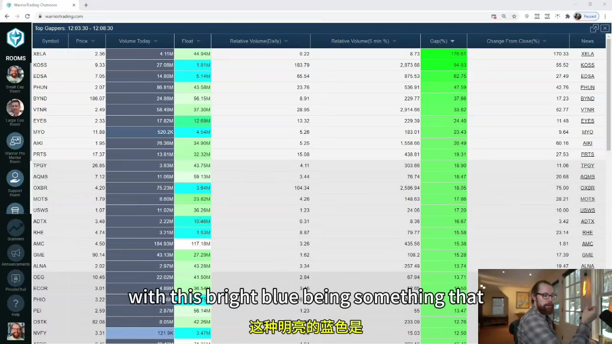
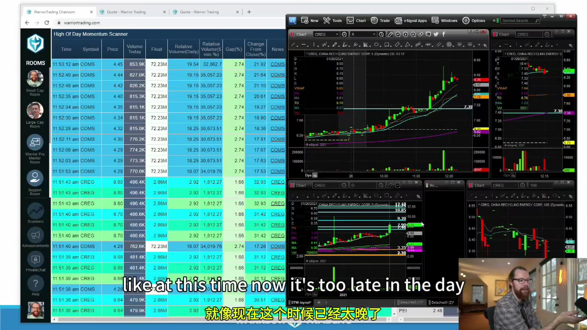

# Starter 12：扫描器与每日 Watchlist

> 对应视频：Chapter 12（20:20）
> 本节重点：把全市场压缩成少量可验证候选；扫描器只负责发现，不负责替你判断 catalyst、流动性和 reward/risk。

## 1. Scanner 是条件查询，不是推荐列表

一个扫描器根据输入字段筛选证券，例如：

- gap percentage；
- current price；
- volume / relative volume；
- float；
- change from close；
- new high；
- 五分钟动量；
- trading halt status。

结果表示“满足条件”，不表示：

- 消息可靠；
- 现在是好入场；
- 数据无误；
- 一定有足够流动性；
- 风险收益合理。

课程的 scanner 是特定商业产品，界面和访问权限不是需要保留的知识。真正要学的是条件、数据定义和处理顺序。

## 2. Premarket Gap Scanner

基本 gap：

`Gap % = (当前盘前价 - 前一常规时段收盘价) ÷ 前收盘价 × 100%`

需要确认：

- 当前价用 last、bid/ask midpoint 还是其他值；
- 前收盘是否复权；
- 极低盘前成交量是否足以形成可靠 gap；
- 昨日盘后新闻是否已在 after-hours 反应；
- 是否有拆股或 symbol change。



**图怎么看：**

- 表格按 gap / change 等字段高亮，方便快速找领先异动。
- Float 列的蓝色只是软件配色，不代表低 float 自动更好；它同时意味着更高滑点和 halt risk。
- Relative volume 必须查定义；图上的数值可能用整日平均、同一时刻平均或自定义窗口。
- 扫描结果是实时快照，会随价格和成交量改变，截图不能还原早晨当时的排序。

## 3. Relative Volume 的多个口径

课程把日 RVOL 近似描述为当前成交量相对过去 30 天平均量：

`RVOL_daily ≈ 当前累计成交量 ÷ 过去 N 日平均整日成交量`

这个口径在上午天然偏低或偏高，取决于平台处理方式。更公平的是 time-of-day RVOL：

`RVOL_tod = 今天截至当前时刻成交量 ÷ 过去 N 日同一时刻平均累计量`

另有五分钟相对量：

`RVOL_5m = 最近五分钟成交量 ÷ 历史可比五分钟平均量`

必须记录：

- lookback N；
- 是否包含盘前盘后；
- 是否排除异常日；
- 分母用整日还是同一时段；
- 拆股后 volume 是否调整。

不同扫描器的 `RVOL 10` 可能不是同一含义。

## 4. Float 数据需要核验

第三方 float 可能：

- 更新时间不同；
- 把 shares outstanding 当 float；
- 尚未计入发行、行权或转换；
- 没处理 reverse split；
- 对 foreign issuer / ADS 口径不同。

扫描阶段可以使用近似值；决定大仓位前，回到最新 SEC 文件和公司行动核对。把 float 写成区间也比假装精确到一股更诚实。

## 5. Short Interest 也有时间差

Short interest 通常不是实时数据。课程案例引用 43% short interest，并将其视为 squeeze 条件。使用时先问：

- 数据对应哪一个 settlement date；
- 分母是 float 还是 shares outstanding；
- 之后是否拆股或发行；
- short volume 是否被误当 short interest；
- days to cover 使用何种平均量。

高 short interest 可以提供潜在回补需求，也可能反映真实基本面风险；不能单独做多。

## 6. Premarket Watchlist 流程

按顺序处理前 5–10 个，而不是只看排名第一：

1. 核对 symbol、上市市场和公司行动；
2. 找原始催化和发布时间；
3. 检查 price、float、volume、RVOL；
4. 画 premarket high/low、前日 high/close；
5. 查日线阻力、200 MA、gap/window；
6. 查 shelf、recent offering、warrants；
7. 观察 spread 与可见深度；
8. 写 trigger、invalidation 和第一目标；
9. reward 不足或无法核验就删除。

最终 watchlist 可以只有一到三只。扫描器的作用是减少候选，不是制造必须交易的感觉。

## 7. 开盘后切换到 Momentum Scanner

开盘后，gap list 已经基本已知。实时 momentum scanner 用来捕捉：

- 新高；
- 短时间涨幅；
- 五分钟成交量异常；
- former runner；
- 新出现的催化；
- halt / resume。



**图怎么看：**

- 左侧扫描结果列出时间、symbol、price、volume、float、RVOL 等，右侧马上打开日线和盘中图。
- 扫描器命中只是提醒；右侧图可能显示已经远离支撑、时间过晚或正顶在阻力。
- 多个候选同时 alert 时，先按流动性、催化和可定义风险排序，不追最新一声提示。
- 图中平台属于课程环境；当前实践可以用任何能导出字段和保存筛选条件的工具。

## 8. Alert 后的 15 秒检查

看到新 symbol 后：

1. 它为什么 alert？
2. 当前是 fresh breakout，还是已经涨完一段？
3. 新闻是否当日、是否原始来源？
4. spread 多宽？
5. 日线第一阻力在哪里？
6. 最近结构 low 到入场有多远？
7. 以现实 fill 计算是否至少满足计划 R/R？
8. 是否接近 LULD band？

无法在短时间确认，就加入观察而不是先买再查。

## 9. “最明显”有优势，也会更拥挤

领先 gapper 和 momentum alert 往往被许多人同时看到：

优势：

- 注意力集中；
- 成交量增加；
- 共同水平更明显。

风险：

- 大量追价；
- 假突破和抢跑；
- halt；
- 早期持仓者借流动性退出；
- 同样的 scanner 造成同步止损。

明显只解决“有人看”，不解决“当前价格是否值得参与”。

## 10. Hot / Cold Market 要量化

课程根据当日是否有大涨股、halt 数量来判断市场冷热。可以记录成可复核指标：

- 盘前达到筛选条件的数量；
- 当日超过 20% / 50% 的股票数；
- LULD pause 数；
- leading gappers 的 median follow-through；
- 首次突破成功率；
- median spread；
- 同 setup 最近 20 笔 expectancy。

按预先区间调整风险，而不是亏损后说“今天市场冷”、盈利后说“市场热”。

## 11. 时间过滤

开盘后流动性与波动通常最高，但风险也最高。午后 alert 可能：

- 真实新闻刚发布；
- 低量随机波动；
- 二次拉升；
- 收盘前资金流。

不要用固定“晚了就不做”替代分析；为每个时段单独统计 fill、胜率和 expectancy。样本不够时，保守限制到已验证时段。

## 12. 扫描器回测的常见偏差

- 用今天的 float 回测旧日期；
- 只保留后来大涨的 alerts；
- 不记录 alert 当时价格；
- 以 K 线 high 作为可成交 entry；
- 忽略已退市证券；
- 参数由成功图反推；
- 不记录 scanner 当时延迟；
- 把同一股票连续 alerts 当独立样本。

需要保存原始 alert timestamp 和当时可见字段，才能真正复现。

## 13. 自己的最小扫描器字段

```text
timestamp
symbol
last / bid / ask
gap %
change %
cumulative volume
time-of-day RVOL
5m volume / RVOL
float source + date
halt status
news link + publish time
strategy/condition name
```

同时保存 scanner version 和参数。筛选条件一改，前后结果就不能直接混在一起。

## 14. Watchlist 模板

```text
Symbol:
Catalyst:
Gap / RVOL / Float:
Premarket high / low:
Daily resistance:
Offering / warrant risk:
Spread / depth:
Primary setup:
Trigger:
Invalidation:
First target:
Skip if:
```

本节结论：**Scanner 找的是“值得打开图表的股票”，不是“应该马上买的股票”。**
