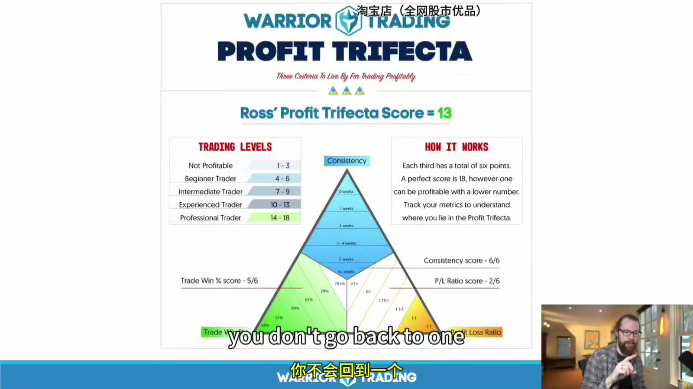
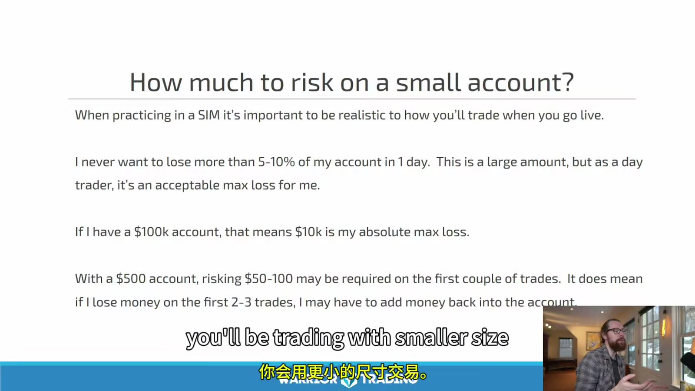
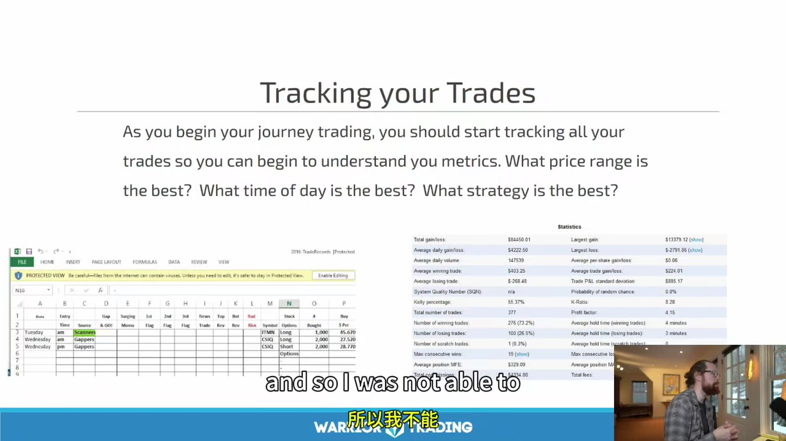
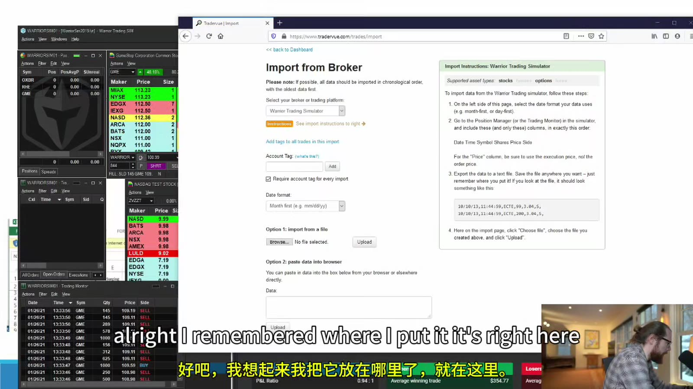

# Starter 13：风险、仓位、统计与交易复盘

> 对应视频：Chapter 13 Part 1–2（58:45、18:28）
> 本节重点：用 expectancy、最大损失和真实成交评价策略；对课程中的小账户高风险示例作明确降级，不把挑战模式当作学习路径。

## 1. 模拟先解决操作，不能证明实盘可复制

模拟环境适合练习：

- 平台和热键；
- setup 识别；
- 订单状态；
- 风险计算；
- 日志流程；
- 规则一致性。

它通常无法完整复制：

- queue position；
- partial fills；
- market impact；
- fast-market slippage；
- 借股可用性与费用；
- halt auction；
- 真钱导致的行为变化。

因此从 sim 到 live 不是一次“毕业”，而是逐级验证。

## 2. Profitability 的核心是 Expectancy

每笔期望值：

`EV = 胜率 × 平均盈利 - 败率 × 平均亏损 - 平均成本`

若平均盈利与平均亏损相同，成本前 breakeven win rate 是 50%。若平均盈利是平均亏损的两倍：

`Breakeven win rate = 1 ÷ (1 + 2) = 33.3%`

但课程举例常省略费用、滑点和 rejected orders，实际 breakeven 会更高。

只看 win rate 会鼓励过早止盈、拖延止损；只看 reward/risk 会忽略低命中率和目标无法成交。两者必须一起看。

## 3. 不把 Green Days 当作独立策略指标

课程的 “profit trifecta” 综合：

- consistency；
- accuracy；
- profit/loss ratio。



**图怎么看：**

- 三角图把周度盈利、胜率和盈亏比转成分数，适合快速反馈。
- Score 是课程产品自定义刻度，不是行业标准，也不能比较不同风险规模的交易者。
- “一周绿色”可能来自一笔超大风险交易；“每天绿色”也可能掩盖偶发灾难性亏损。
- 评价时应同时看最大回撤、尾部亏损、样本量和规则违约。

更可靠的 dashboard：

- net expectancy per trade；
- profit factor；
- max drawdown；
- average / max adverse excursion；
- average slippage；
- rule adherence；
- 按 setup、时段、price、liquidity 分组；
- 置信区间和样本量。

## 4. 课程的小账户风险示例不应照做



**图怎么看：**

- 画面提出单日不超过账户 5%–10%，并以 500 美元账户单次冒 50–100 美元风险为例。
- 这意味着一次或一天损失 10%–20% 的小账户资金，连续几次失败就会造成巨大回撤。
- “账户小所以必须冒更高比例风险”逻辑错误；账户太小无法安全执行某策略时，正确选择是继续模拟、减少规模或暂不交易。
- 资料不把该挑战式风险容忍度作为实盘建议。

回撤后的回本要求：

| 亏损 | 回到原点所需涨幅 |
|---:|---:|
| 10% | 11.1% |
| 20% | 25% |
| 50% | 100% |
| 80% | 400% |

风险比例应先保证能承受正常 losing streak，再考虑收益目标。没有统一正确百分比；对高波动、可停牌的小盘股，需要额外预留 gap beyond stop。

## 5. 仓位计算

先确定单笔最大美元风险 `R`：

`per-share risk = expected entry - stop/invalidation + estimated slippage`

`shares = floor(R ÷ per-share risk)`

例如：

- max risk：$50；
- expected entry：5.10；
- structural stop：4.98；
- slippage reserve：0.03；
- per-share risk：0.15；
- shares：`floor(50 / 0.15) = 333`。

再受以下上限约束：

- account buying power；
- max notional；
- Level 2 depth；
- average volume；
- halt risk；
- broker minimum/maximum；
- current correlated exposure。

固定 1,000 shares 不叫固定风险。

## 6. Stop Distance 应来自失效，不来自目标

课程有“每天抓 10 cents、亏损也控制在 5–10 cents”的训练思路。只有当结构止损恰好在这个距离内才成立。

错误顺序：

1. 想赚 0.10；
2. 因此 stop 设 0.05；
3. 再寻找图形解释。

正确顺序：

1. 找结构失效点；
2. 估算现实入场和滑点；
3. 计算每股风险；
4. 看第一目标是否提供足够 reward；
5. 不够就跳过。

高价、高波动股票不可能因为热键固定 0.10 就变成低风险。

## 7. Daily Max Loss 的作用

Daily max loss 用来阻断：

- revenge trading；
- 状态不佳仍扩大频率；
- 平台或行情异常；
- market regime 与策略不匹配；
- 连续执行错误。

触发后应：

1. 平掉风险；
2. 取消 open orders；
3. 禁用热键或启用 broker lockout；
4. 不通过换账户继续；
5. 当天只复盘，不“赚回来”。

限额要包含 realized、unrealized、fees 和 open-order risk。

## 8. Scaling 不是按股数等比例放大利润

从 100 到 200、400、800 shares，结果可能接近线性；再往上会出现：

- 更差的平均入场；
- partial fills；
- 自己推动价格；
- 出场困难；
- 心理压力改变决策；
- broker/risk limits；
- 更高 borrow cost。

扩大一级后重新统计：

- per-share P&L；
- slippage；
- fill rate；
- max adverse excursion；
- rule adherence。

只有在新规模仍保持正期望时再升级。一次大盈利不是扩仓证据。

## 9. 交易日志要保存原始成交



**图怎么看：**

- 表格记录日期、symbol、entry/exit 以及 Gap and Go、first/second flag、news、bad risk 等标签。
- 标签让交易可以按 setup 分组，而不是只看总 P&L。
- “Bad risk”应在入场时有客观定义；如果只给亏损交易补标，会产生 hindsight bias。
- 手工记录能强迫复盘，但原始 fills 仍应从券商导出，避免凭记忆估算平均价。

最低字段：

```text
trade_id
all fills + timestamps
fees / borrow
symbol / side
setup / trigger
planned entry / stop / target / size
actual average entry / exit
MAE / MFE
market context
catalyst source
rule violations
screenshots before and after
notes
```

## 10. 聚合 Fill 为 Trade 时要固定规则

一笔策略交易可能包含：

- 分批买入；
- 卖一半；
- add back；
- 再卖 quarter；
- 最终 flatten。

软件可能把每个 fill 当一行，也可能自动聚合。分析前决定：

- 同 symbol 同方向、间隔多少时间算同一 trade；
- 完全平仓后重新进入是否新 trade；
- reverse 如何处理；
- 多账户是否合并；
- commissions 分配方式。

规则变化会改变 win rate 和 average winner，必须版本化。

## 11. 第三方复盘工具先和券商对账



**图怎么看：**

- 右侧导入页要求 date、time、symbol、shares、price、side 等列按指定顺序。
- 左侧原平台导出字段必须映射正确；quantity、side 和时区错一个就会产生假交易。
- 导入成功只说明格式接受，不说明 P&L 正确。
- 应随机抽查若干交易，与券商正式 statement 的 fills 和 fees 对齐。

特别检查：

- 时区和夏令时；
- partial fills；
- corporate actions；
- short/cover side；
- options multiplier；
- commissions/ECN/borrow；
- cancelled/rejected orders 不应成为 fills。

## 12. 复盘分层

### 每笔

- setup 是否存在；
- trigger 是否按计划；
- entry slippage；
- stop 是否合理执行；
- 有无规则违约。

### 每日

- 最好/最差决策；
- P&L 是否由少数异常交易驱动；
- 触发 daily stop 后是否继续；
- 平台问题。

### 每周

- 各 setup 样本量和 EV；
- 时段、price、RVOL 分组；
- 规则遵守率；
- 是否需要暂停某一类交易。

### 每月

- drawdown；
- strategy drift；
- scaling impact；
- 数据完整性；
- 是否有足够证据修改规则。

## 13. 样本量和选择偏差

课程评分用最近数周、几十笔提供快速反馈，但样本小容易被偶然性支配。不要因为：

- 两周盈利就上线大仓位；
- 三次 first pullback 全赢就断言有效；
- 一次 halt 巨亏就删掉所有样本；
- 只导入“认真做的交易”；

而改变策略。

先定义最小样本量和 review date。无论盈亏，所有符合条件的信号和所有实际交易都入库。

## 14. 从 Sim 到 Live 的分级门槛

示例流程：

1. 至少数周平台操作无严重错误；
2. 在成本和保守滑点后正期望；
3. 最大回撤在预定范围；
4. 规则遵守率达到目标；
5. Live 从可忽略的最小规模开始；
6. Sim 与 live 并行比较 fills；
7. 每次只增一级；
8. 指标恶化就退回上一规模。

不是模拟赚了多少钱决定上线，而是流程是否可复制、尾部损失是否能承受。

本节最重要的修正是：**小账户不需要冒更大的比例风险；它需要更慢、更小、更能活过样本不足阶段的验证。**
