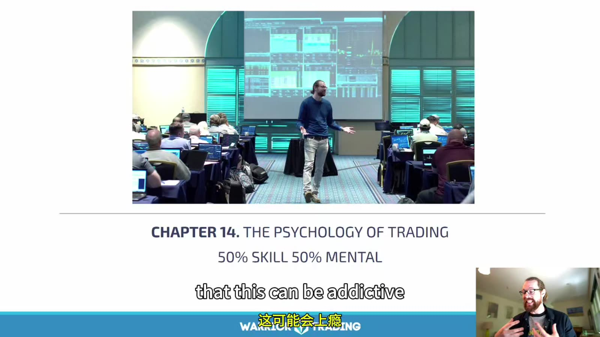
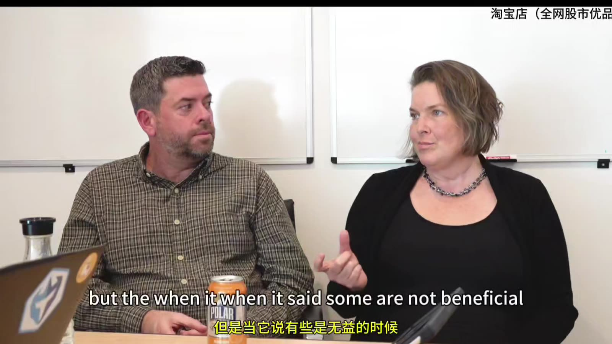
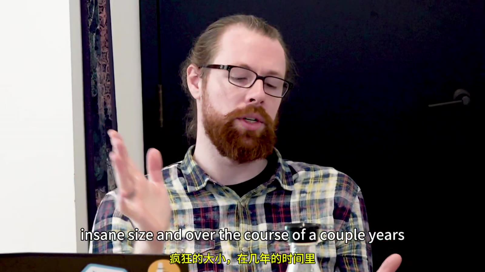
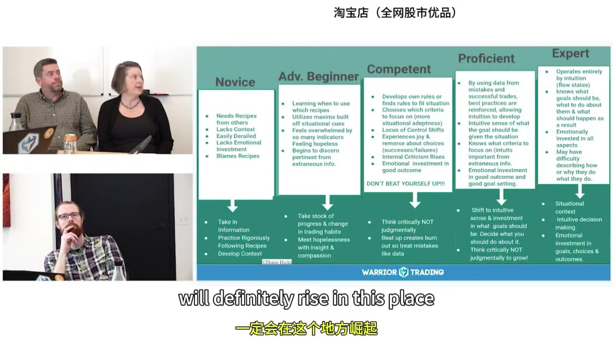
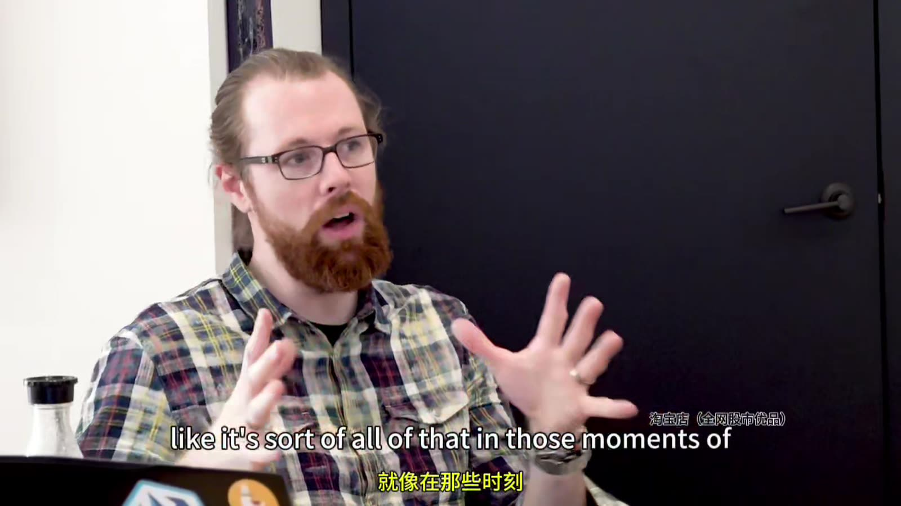
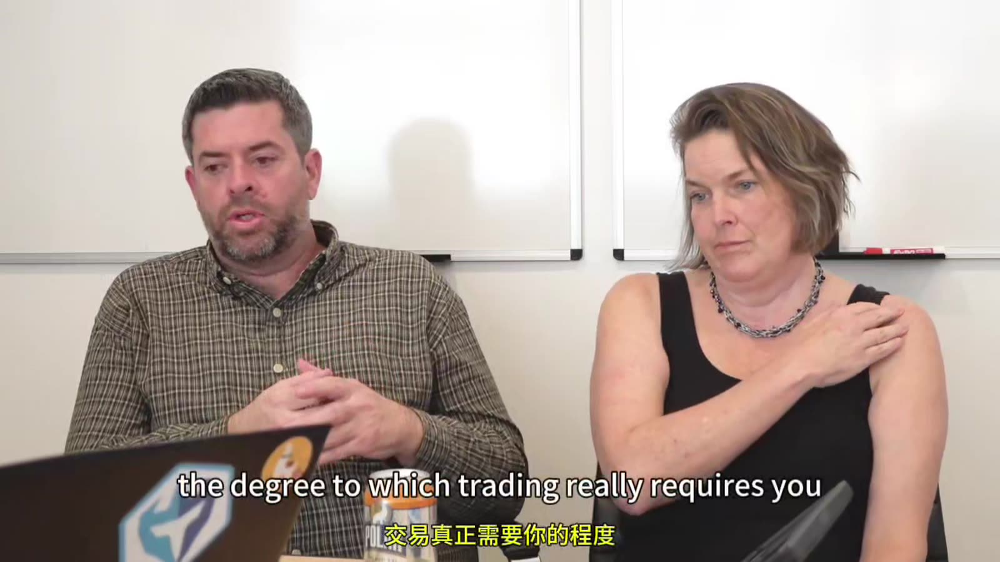

# Starter 14：交易心理、学习阶段与正念

> 对应视频：Chapter 14 Introduction、Part 1–4（6:44、1:33:37、1:06:53、1:19:27、8:35）
> 本节重点：在情绪变成订单前识别它，用预先规则和暂停机制降低冲动；心理训练辅助执行，不能替代有正期望的策略。

## 1. “50% Skill / 50% Mental” 是比喻，不是比例



**图怎么看：**

- 课件强调懂图形并不等于能稳定执行，这个提醒有价值。
- 50/50 没有可测分母，不应被当成研究结论。
- 策略没有成本后正期望时，再强的心理纪律也只会更一致地执行负期望。
- 反过来，策略有效但频繁违反仓位和 stop，同样无法实现回测结果。

更准确的关系：

`实际结果 = 策略质量 × 执行一致性 × 风险约束 × 市场适配`

任一项接近零，整体就会崩坏。


**图怎么看：**

- 画面是对心理章节的导入，不是技术图。
- 后续由讲者和两位心理健康从业者对谈，内容以教育和自我观察为主。
- 资料把可执行方法提炼出来，不把个别人的治疗经验泛化为诊断。
- 若交易引发持续焦虑、抑郁、成瘾、债务或生活功能受损，应停止交易并寻求当地合格专业帮助。

## 2. 情绪不是敌人，自动下单才是问题

常见触发：

- FOMO；
- 止损后马上重进；
- 盈利回吐后的愤怒；
- 连胜后的过度自信；
- 与他人 P&L 比较；
- 害怕红日而不肯止损；
- 想用下一笔恢复情绪。

目标不是“像机器人一样没有情绪”，而是：

1. 觉察身体和想法；
2. 给情绪命名；
3. 不在高唤醒状态扩大风险；
4. 按预先机制退出或暂停；
5. 事后复盘，不自我羞辱。

## 3. Emotional Hijack 要翻译成行为信号

课程用 amygdala、neocortex 和 fight/flight 等解释高压力下的反应。这个神经叙事经过大幅简化，不能用来医学诊断。对交易最有用的是可观察前兆：

- 呼吸变浅；
- 肩颈、胃部紧张；
- 快速重复点击；
- 只找支持持仓的信息；
- 内心出现“必须赚回来”；
- 不再计算仓位；
- 隐藏或不愿看亏损；
- 改 stop、取消 daily max loss。

把这些写成 `red flags`，一出现就触发预设动作。



**图怎么看：**

- 这是对谈，不是展示可直接复制的交易 setup。
- 重点是让讲者描述真实触发、身体反应和行为后果，再由主持人帮助拆解。
- 有效复盘也应这样具体：发生了什么、感觉什么、做了什么，而不是只写“心态不好”。
- 对话案例来自个体经验，不能证明某种情绪对所有人产生相同交易结果。



**图怎么看：**

- 画面口述仓位规模和多年经验，说明心理反应会随资金规模变化。
- “有经验”不代表不再情绪化；规模扩大可能重新触发过去没有的压力。
- 应按实际风险金额逐级暴露，而不是从 sim 直接跳到大仓位。
- 复盘重点不是模仿讲者的风险容忍度，而是找自己的失控阈值。

## 4. Stress Tank

课程用“压力水箱”描述当天可用自控资源：

- 睡眠不足；
- 家庭冲突；
- 疾病；
- 工作压力；
- 连续亏损；
- 技术故障；

都会让水位上升。开盘前可以做 0–10 自评：

| 项目 | 0 | 10 |
|---|---:|---:|
| 睡眠/身体 | 很好 | 极差 |
| 外部压力 | 无 | 极高 |
| 交易冲动 | 无 | 强烈 |
| 清晰度 | 清晰 | 混乱 |

预先规定：总分达到某阈值就减半风险、只模拟或休息。阈值必须事前设，不能盘中为了继续交易临时解释。

## 5. 决策偏差

### Confirmation bias

持仓后只看支持方向的新闻和 prints。对策：入场前写出会证明自己错的证据。

### Recency bias

最近三笔全赢，就认为 setup 永远有效；最近三笔全亏，就认为策略失效。对策：看完整滚动样本。

### Loss aversion

不愿实现亏损，反而让小亏变大。对策：把 stop 定义为策略成本，不以平仓决定“是否真的亏”。

### Outcome bias

违规交易赚钱就认为决定正确；合规止损就认为决定错误。对策：过程评分与 P&L 分开。

### Sunk-cost fallacy

因为已亏很多而继续持仓或加仓。对策：每一刻重新问“如果现在空仓，我会按这价格和风险新开吗？”

## 6. 学习不是直接从规则跳到直觉



**图怎么看：**

- 图表从 Novice、Advanced Beginner、Competent、Proficient 到 Expert，描述从依赖规则到情境化判断。
- 这类阶段模型用于反思，不是认证量表，也没有固定学习时长。
- 专家所谓“直觉”通常来自大量有反馈的模式记忆；新手抛弃规则不是专家化。
- 右侧也提醒专家仍会出错，且需要复盘维持校准。

### Novice

- 需要明确 checklist；
- 不知道哪些信息重要；
- 容易模仿他人；
- 目标：平台安全、统一 setup 语言。

### Advanced beginner

- 开始认出重复形态；
- 容易规则过多、互相冲突；
- 目标：限制股票池和 setup，建立日志。

### Competent

- 能制定计划和取舍；
- 开始看到不同 market context；
- 目标：稳定执行、理解分布。

### Proficient / Expert

- 识别情境更快；
- 知道何时不交易；
- 仍需数据防止直觉漂移；
- 不能把“感觉”免于风险限制。

## 7. 不用 P&L 证明自我价值


**图怎么看：**

- 这是经验反思片段：拥有下单能力和购买力，不等于应该使用。
- 交易结果容易与聪明、勇气或成功感绑定，导致不愿认错。
- 应把身份目标换成过程目标，例如“今天每笔都先算 size”。
- 一笔亏损只证明某次结果，不证明交易者整体能力；一笔盈利也不证明已掌握策略。

把日评分拆开：

- Setup selection；
- Risk calculation；
- Order execution；
- Stop compliance；
- Pause compliance；
- Data logging。

P&L 单独记录，不参与当天行为分。

## 8. 内在“部分”是自我观察框架

课程使用类似 parts work 的语言，给不同反应命名：

- 激进、想打全垒打的部分；
- 害怕亏损、过早止盈的部分；
- 害怕红日、拒绝平仓的部分。



**图怎么看：**

- 画面没有技术信息，价值在于把“我很烂”改写成“某种保护性反应现在变强”。
- 命名可以让交易者和冲动拉开距离，但不表示人格真的被分成独立实体。
- 每个反应可能有保护目的，例如避免亏损、避免羞耻；目的合理不代表动作有效。
- 实际改进仍需映射到订单行为：加仓、取消 stop、过早卖出或 revenge trade。

一个复盘例：

```text
触发：盈利从 +300 回到 +80
想法：必须回到 +300 才能停
身体：胸口紧、手握鼠标
冲动：跳入 scanner 最新标的
实际：无 setup 买入
保护目的：避免“失去盈利”的挫败感
下次动作：离开屏幕 10 分钟，daily P&L lock
```

## 9. Radical Acceptance 不等于放任亏损

接受是承认当前事实：

- 价格已经跌破；
- 今天已经亏损；
- 机会已经错过；
- 当前市场不适合策略。

它不是：

- 接受持仓继续无限亏；
- 不作风险动作；
- 用“善待自己”为违规辩护；
- 相信一切都会回来。



**图怎么看：**

- 对谈强调交易会反复暴露同一类反应，需要持续练习，而不是一次顿悟。
- 最有效的接受通常紧接具体动作：平仓、停止、降低规模。
- 可以对自己温和，同时对规则严格；两者不冲突。
- 若不能自主停止，应把限制放到券商层面，而不只依赖意志。

## 10. RAIN 作为暂停流程

- **R — Recognize**：我正在 FOMO / 生气；
- **A — Allow / Accept**：承认反应存在，不马上消灭；
- **I — Investigate**：身体哪里紧？什么事实触发？
- **N — Non-identification / Nurture**：情绪不是命令，选择预定动作。

在快节奏交易中可压缩成 30 秒：

```text
Name it → hands off keyboard → 3 slow breaths
→ read red-flag card → continue only if checklist passes
```

## 11. 正念练习的作用边界


**图怎么看：**

- 云层是把想法和情绪视为来去天气的视觉隐喻。
- 练习目标不是预测市场，也不是强迫自己放松，而是发现注意力已经被带走。
- 冥想后仍需照常做 catalyst、risk 和 order checks。
- 若练习使人更焦虑或不适，应停止并选择更合适的支持方式。


**图怎么看：**

- 夜空用于帮助扩大注意范围，避免把单笔 P&L 当成全部现实。
- 它适合开盘前或触发暂停后的重置，不适合在仍有无人管理的持仓时闭眼进行。
- 先平风险、取消订单，再离开屏幕。
- 课程讲者说冥想与最佳连胜相关，这是个人观察，不能证明因果。

一个安全的两分钟版本：

1. 确认没有持仓或未完成订单；
2. 双脚着地；
3. 观察三次自然呼吸；
4. 扫描下颌、肩、胸、胃；
5. 给当前状态一个词；
6. 阅读当天风险上限；
7. 决定 live、reduced size、sim 或休息。

## 12. External Accountability

可以让教练、同伴或家人帮助：

- 复核周度日志；
- 监督触发 daily stop 后是否继续；
- 发现规模悄悄上升；
- 在重大生活压力时提醒暂停。

但对方不能替你承担损失，也不应变成跟单来源。共享时保护账户、身份和医疗隐私。

## 13. Emotional Stop Protocol

预先写：

```text
Red flags:
- 连续快速点击
- “赚回来”想法
- 取消有效止损
- 与别人 P&L 比较
- 第二次规则违约

Immediate actions:
1. flatten and cancel all
2. disable hotkeys
3. leave desk for 15 minutes
4. write trigger/body/action
5. no live trading for rest of session if max rule hit
```

协议的价值在自动化：等到高唤醒时再决定是否休息，通常已经太晚。

本节核心：**不是消灭恐惧、贪婪或挫折，而是确保这些状态没有权限直接改变仓位。**
