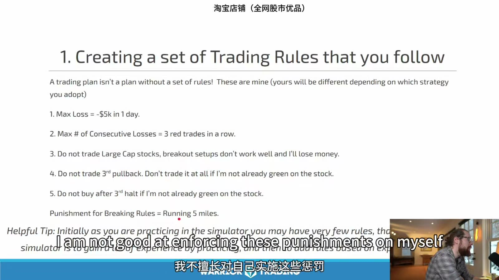
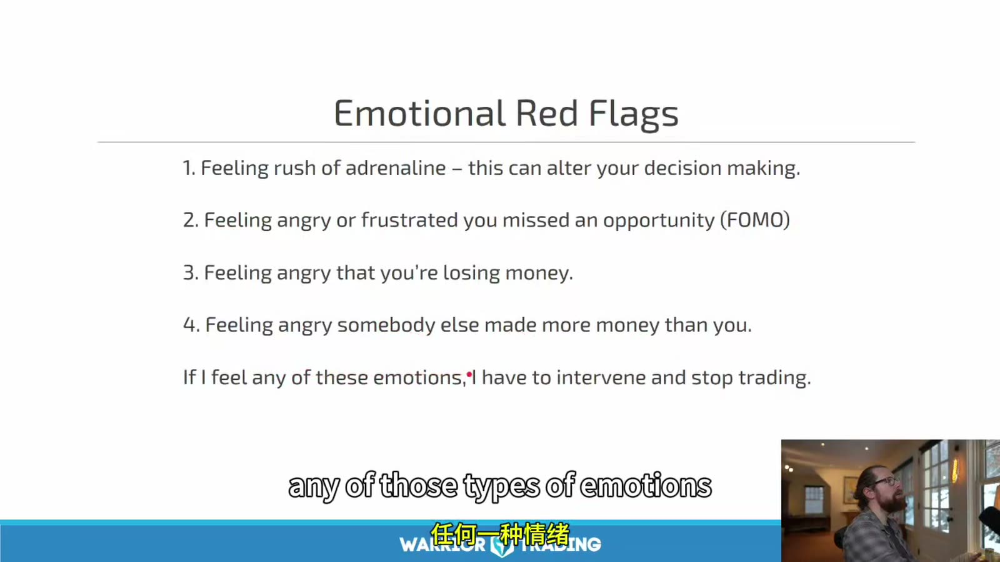
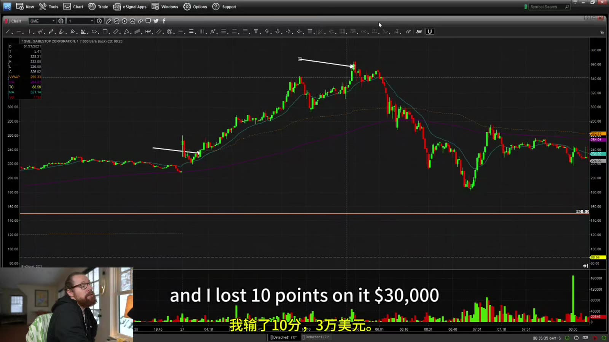

# Starter 15：交易计划与学习流程

> 对应视频：Chapter 15 Part 1–2（46:02、9:51）
> 本节重点：把股票池、setup、订单、风险、暂停条件和复盘写成一份可测试的计划；不以固定三个月、盈利目标或课程升级作为上线依据。

## 1. “先模拟三个月”只是最低提醒，不是毕业条件

时间不能替代证据。三个月里：

- 可能只经历一种 market regime；
- 可能每天只做一笔，样本不足；
- 可能大量随意交易但没有固定策略；
- sim fills 可能不现实；
- 规则违约没有被记录。

上线条件应由：

- 样本量；
- 成本后 expectancy；
- 最大回撤；
- 执行错误率；
- 规则遵守率；
- live/sim fill 差异；

决定，而不是日历。

## 2. 一份计划必须能让第三方复现

最低章节：

1. 交易目标和资本边界；
2. 股票池；
3. 数据、新闻和扫描源；
4. 可交易时段；
5. market context；
6. setup；
7. trigger；
8. invalidation；
9. position sizing；
10. entry/exit order types；
11. daily/weekly risk；
12. no-trade conditions；
13. 日志和 review schedule；
14. 策略修改流程。

“我做 bull flag”“低买高卖”“只做强股”都不可复现。

## 3. Rules 应当是 Guardrails，不是事后惩罚



**图怎么看：**

- 示例包括 daily max loss、连续三次亏损停止、不做 large caps、不做第三次 pullback、不追第三次 halt。
- 这些是讲者按自身策略写的历史规则，不适合作为你的默认数值。
- “违规后跑五分钟”不是可靠风控；惩罚可能让人隐藏违规，也无法撤销订单风险。
- 更好的设计是券商 max-loss lock、max order size、禁止继续下单和当日结束。

规则应符合：

- 客观：能判断是否触发；
- 即时：触发后马上执行；
- 自动：尽量不依赖高压时的意志；
- 可审计：日志能证明是否遵守；
- 与风险相关：不是无关的自我惩罚。

例如：

```text
若 realized + unrealized P&L <= -$100：
flatten → cancel all → broker lockout → 当天不再 live。
```

比“亏了就提醒自己冷静”有效。

## 4. 连续三笔亏损不是万能门槛

连续亏损可以提示：

- setup 不适合当日；
- 执行漂移；
- 情绪上升；
- 正常随机序列。

策略胜率 40% 时，三连亏并不罕见。可以把它作为 pause trigger：

1. 暂停 15 分钟；
2. 复核三笔是否合规；
3. 若有规则违约或达到 daily max，结束；
4. 若全部合规且计划允许，只以缩小风险继续。

门槛需用策略分布校准。

## 5. 股票池写到可查询

不要只写 `$1–$10 stocks`。应包括：

- exchange / security type；
- price range；
- float 口径；
- minimum volume / RVOL；
- maximum spread；
- catalyst types；
- offering / compliance exclusions；
- 是否允许 ETF、ADR、IPO；
- 是否允许 premarket / after-hours；
- borrow requirement。

股票池是风险控制的一部分。临时因社交媒体热点切换到不熟悉产品，会同时改变波动、点差、订单和心理压力。

## 6. Setup Specification

示例：

```text
Name: first 5m pullback
Context: fresh verified catalyst; top-5 gapper; daily room >= 2R
Formation: impulse high, 2-5 candle pullback, volume contraction
Trigger: break of previous closed 5m high
Entry: marketable limit, max offset $0.03
Invalidation: pullback low
Target: premarket high, then daily resistance
Skip: spread > $0.05; within 2% of LULD; third pullback
```

每个字段都要从真实日志验证，示例数值不能直接照搬。

## 7. 目标收益不能反推必须交易

课程谈到“magic number”和依靠交易的收入目标。财务目标可以用于资本规划，但市场不按账单提供机会。

危险链条：

`今天目标 $500 → 只赚 $200 → 必须再做一笔 → 降低标准 → 亏损`

更适合每日控制的是：

- maximum risk；
- maximum trades；
- allowed setups；
- trading window；
- process score。

收入预期用长周期分布估算，并准备其他收入和现金缓冲。不要用借款、生活费或短期必须支出的资金交易。

## 8. Emotional Red Flags 写成停机条件



**图怎么看：**

- 课件列出四类高唤醒状态，并提出出现时停止交易。
- “感觉到才停”可能太晚；每个状态要附可观察行为，例如加快点击、取消 stop。
- 和他人 P&L 比较会改变自己的仓位标准，尤其在群聊或直播环境。
- 最好让平台限制和计时器配合心理识别，而不只靠意志。

可以用交通灯：

- Green：清晰、按计划；
- Orange：一次冲动或两次执行错误，减半风险并暂停；
- Red：daily max、revenge thought、取消 stop，立刻结束。

## 9. Workspace Rules

- 固定、安静、无无关通知；
- symbol/account/order status 醒目；
- 手机和社交媒体移出；
- setup checklist 可见；
- session end 到时自动提醒；
- 平仓后退出平台，不回来看“最后一笔”；
- 网络、电源和备用退出渠道已测试。

视觉提示只放当前规则和风险上限，不贴收益截图刺激追逐。

## 10. 课程结尾的 GME 案例如何读


**图怎么看：**

- 这一帧主要是课程收尾和下一产品导流，不包含新的交易证据。
- 原视频花了较多时间介绍社区、课程升级和个人目标；资料只保留可执行学习流程。
- 是否继续某套课程，与策略能否在你的真实成本下盈利是两件事。
- 学习资源应按证据质量选择，而不是按群体认同或成功故事选择。



**图怎么看：**

- 图上先快速上行、随后深跌，体现极端波动可以同时制造巨额盈利和巨额回撤。
- 讲者在上一节刚强调不做不符合自己的 large-cap 风格标的，结尾却因热点交易 GME；这正好说明规则会被行情和 FOMO 挑战。
- 口述的大额盈利和亏损是单一个人、单一历史事件，不能用于推算学习者收益。
- 真正应研究的是每笔 planned risk、actual slippage 和为何偏离原股票池。

课程把 GME 描述为“正确类型股票”是事后结果导向。若计划允许这种跨策略交易，必须在事前写出：

- 何种 feeding-frenzy 条件；
- 更高价格与 spread 的仓位公式；
- extended-hours 订单；
- halt 和 overnight 风险；
- 最大允许亏损。

否则它就是计划外交易，即使赚钱也应记为 rule violation。

## 11. 社区的作用与风险

社区可用于：

- 复盘和问答；
- 共享原始来源；
- 责任监督；
- 发现执行盲点。

风险：

- 跟单；
- 幸存者偏差；
- P&L 比较；
- 只分享赢家；
- 群体 FOMO；
- 把讲师的风险容忍度当标准。

延迟几秒的 alert 对快速小盘策略可能已经失效。任何别人 callout 的股票都必须通过自己的完整 checklist。

## 12. 策略修改必须版本化

流程：

1. 收集问题，不在盘中改；
2. 写出假设；
3. 定义新旧规则差异；
4. 在历史或 sim 上重测；
5. 保留 out-of-sample；
6. 指定生效日期；
7. 小规模 forward test；
8. 不满意时回滚，而不是继续叠加例外。

日志写 `strategy_version`，否则长期统计混合不同规则。

## 13. 一个实际学习周期

### Phase A：Mechanics

- 平台、订单、热键、日志；
- 不评价盈利。

### Phase B：One setup in replay/sim

- 固定股票池、固定时间；
- 收集全部信号。

### Phase C：Conservative fill simulation

- 加 spread、slippage、partial fill；
- 计算成本后 EV。

### Phase D：Minimum live size

- 只验证成交和情绪差异；
- 不追求收入。

### Phase E：Controlled scaling

- 每次增一级；
- 指标恶化立即退回。

任何 phase 都可以得出“这套策略不适合我”；停止不是失败，而是风险决策。

## 14. Pre-market Checklist

```text
sleep/stress score:
account / buying power:
platform / data / route:
open positions/orders:
daily max loss:
allowed setups/version:
market regime:
watchlist + primary sources:
levels + LULD:
planned entry/stop/target/size:
session end time:
```

## 15. Post-market Checklist

```text
broker fills imported and reconciled:
fees/borrow included:
all trades tagged:
rule violations:
best process decision:
worst process decision:
emotional red flags:
platform issues:
one change to test later:
no live rule changes today:
```

Starter 的终点不是“准备好实盘”，而是终于拥有足够术语去写第一版可检验计划。**是否实盘，由数据和风险承受力决定，不由看完多少视频决定。**
