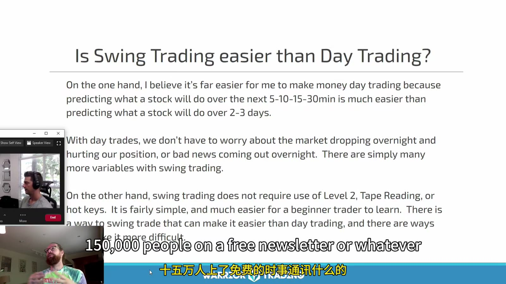
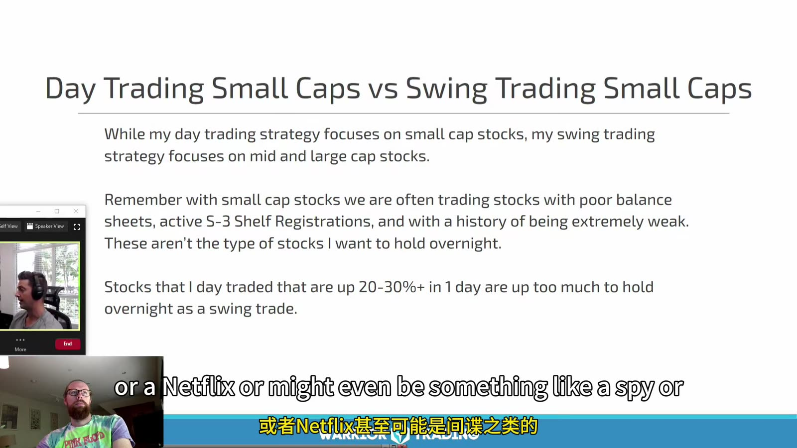
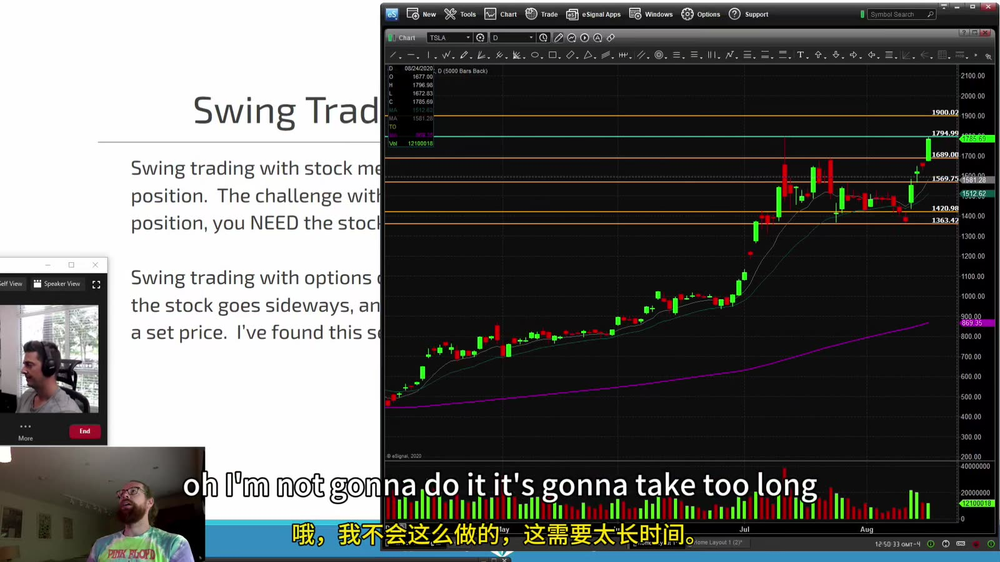

# Swing & Options 01：Swing Trading Foundations

> 对应视频：Chapter 1 Intro to Swing Trading
> 本节重点：Swing trade 用更长持有期换取更低的盘中操作频率，但会引入隔夜 gap、新闻、财报和仓位占用；它不天然比 day trade 更安全。

## 1. Swing trading 是否更容易



**图怎么看：**

- Slide 认为 day trade 更容易预测未来几分钟，而 swing trade 更容易学习、无需高速读取 Level 2。
- 这是课程作者的个人经验，不是普遍难度结论；两者面对的是不同风险。
- Day trade 主要暴露于盘中执行、slippage 和短周期噪声；swing trade 主要增加 overnight gap、事件和多日 regime 变化。
- “不需要 Level 2”不等于不需要流动性；进出大仓位仍会受 bid/ask 与成交量影响。

## 2. 不把日内 small-cap 直接持有过夜



**图怎么看：**

- 课程把 day trade 的 small caps 与 swing trade 的 mid/large caps 分开。
- Slide 指出部分小盘公司财务弱、可能有 shelf registration，且当日已涨 20–30% 后不适合直接隔夜。
- 分类逻辑是合理的风险过滤，但 market cap 不能单独替代 filings、float、债务和催化剂核验。
- 日内盈利仓若收盘前没有独立 swing thesis，就必须按 day-trade 计划退出，不能因不愿止损而改标签。

选择 swing 标的时额外核对：

- 平均成交量和 spread；
- 下一次 earnings、FDA、宏观数据或公司事件；
- 日线/周线结构和上方空间；
- SEC filings、融资与 corporate actions；
- sector 与指数相关性；
- 隔夜最大可承受 gap；
- 是否允许/计划使用期权。

## 3. 股票与期权两种载体



**图怎么看：**

- 股票仓位价值主要随标的价格线性变化；期权还受到时间和 implied volatility 影响。
- 图中大盘股持续上涨的历史结果不能说明任意 entry 都适合 swing。
- 股票持仓可能有分红、借股和 margin 成本；期权则有 expiration、exercise/assignment 和 contract multiplier。
- 用期权限制投入金额不等于限制所有策略的最大亏损；卖出裸期权尤其不同。

## 4. Swing thesis 必须有时间边界

每笔在进入前写：

```text
underlying thesis
entry trigger
technical invalidation
event calendar
expected holding days
time stop
price target(s)
overnight gap allowance
position size
instrument: shares or exact option structure
```

`time stop` 很关键：如果预期 3–5 天内突破，到了第 5 天仍横盘，就应重新评估，而不是无限延长。

## 5. 仓位按 gap risk 计算

日线 stop 距离常大于日内 stop，仓位自然应更小：

```text
technical risk per share = entry - stop
gap stress risk per share = entry - stress_price
position size = risk_budget / max(technical risk, gap stress risk)
```

Stress price 可用历史 earnings gap、ATR 倍数或情景分析估计，但都不是保证下限。

期权仓则用整个 payoff 分布：

- Long option：通常最多损失已付 premium，但到期、流动性和提前平仓仍重要；
- Debit spread：最大亏损通常是 net debit，利润受 short leg 限制；
- Credit spread：最大亏损是 strike width 减 net credit，再乘合约乘数；
- Covered call / cash-secured put：仍承担大量标的方向风险，不能只看收到的 premium。

## 6. Event calendar 是仓位的一部分

每晚确认：

- earnings 和公司公告；
- ex-dividend；
- option expiration；
- 宏观数据、FOMC、就业与通胀公布；
- 行业会议、监管决定；
- 计划外 corporate action。

如果不愿承担某事件的 gap，就在事件前减仓或退出，而不是寄希望于 stop。

## 7. Swing journal

除 entry/exit 外，保存：

- 入场时 daily/weekly 图；
- 市场和 sector context；
- 持仓期间每天 thesis 是否仍成立；
- overnight P&L 与 intraday P&L 分解；
- 计划事件与意外事件；
- option IV、delta、theta 和 bid/ask；
- 最大有利/不利波动；
- exit 属于 target、stop、time stop 还是 thesis change。

这样才能判断自己的 edge 来自方向判断、隔夜 gap、盘中管理，还是偶然市场 beta。
