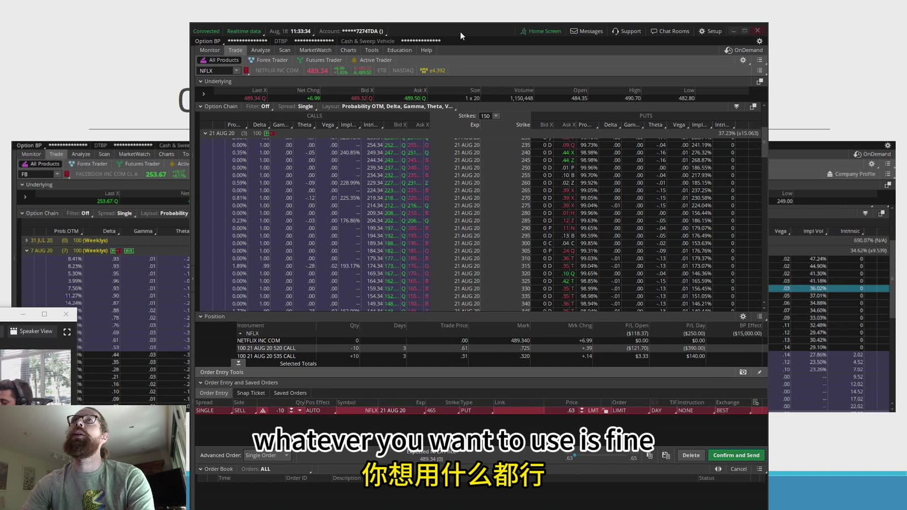
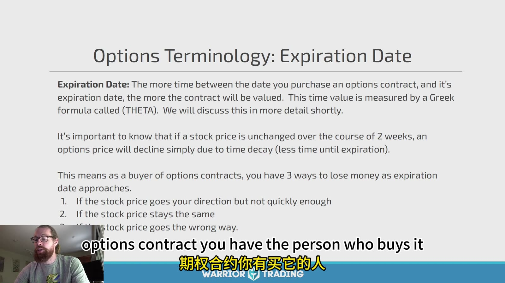
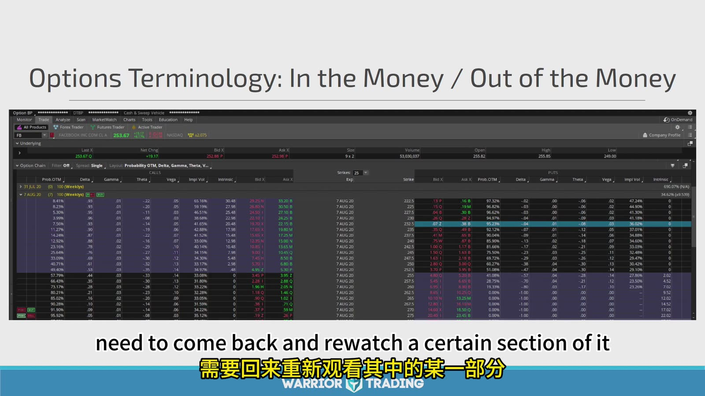
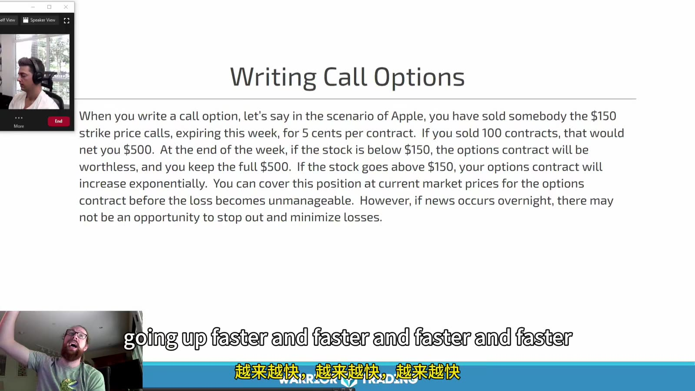
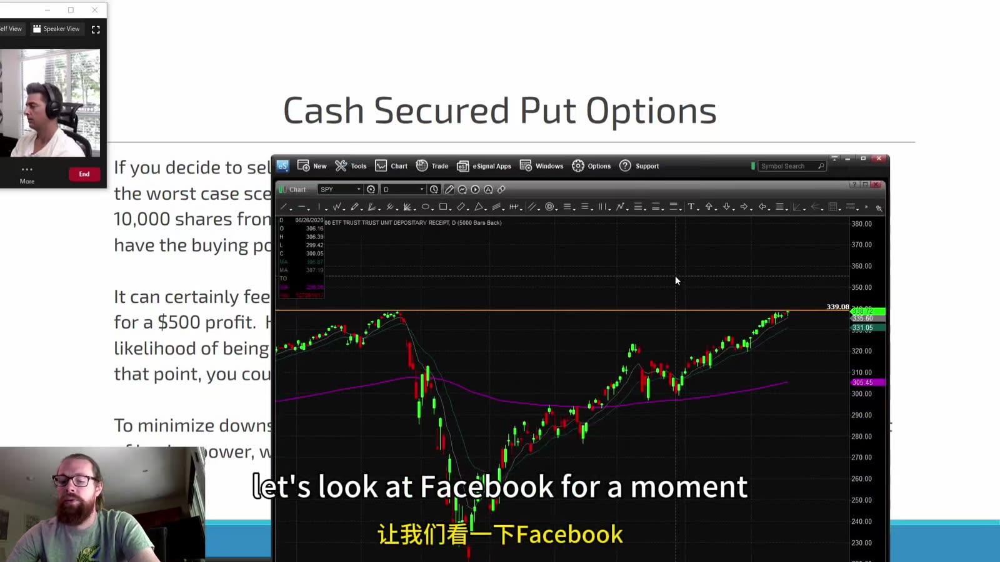
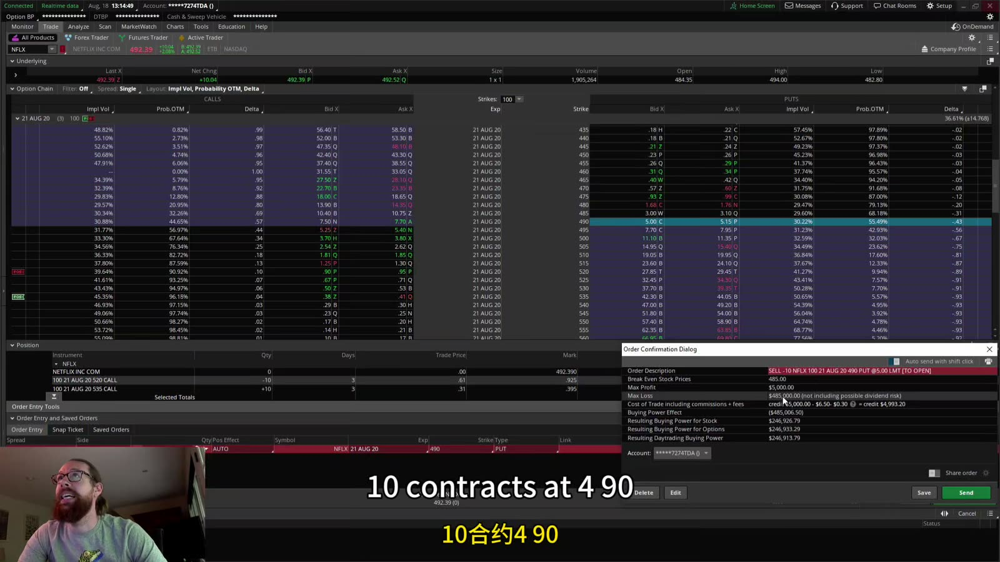

# Swing & Options 02：Options Contracts and Obligations

> 对应视频：Chapter 2 Part 1–2
> 本节重点：买方获得权利并支付 premium，卖方收取 premium 并承担义务。任何期权仓都必须从 expiration payoff、提前 assignment 和流动性三方面理解。

## 1. 先读 option chain



**图怎么看：**

- 期权链通常按 expiration 分组，calls 与 puts 分列，每行对应一个 strike。
- Bid/ask 是报价，不是保证能按 mid 成交；成交稀疏时 last price 可能很旧。
- Volume 是当日成交，open interest 是此前未平仓合约数，二者不能互换。
- 一份美股标准 equity option 通常控制 100 股，但 corporate action 后可能变成 adjusted contract，必须看合约规格。

下单前核对：

```text
underlying
call or put
expiration
strike
buy or sell
open or close
contracts
limit price
multiplier / adjusted deliverable
```

## 2. Expiration 与 time decay



**图怎么看：**

- Slide 说明距离到期越长通常时间价值越多，并把 theta 与时间衰减联系起来。
- “股票方向走对”仍可能亏钱：走得太慢、幅度不足，或 IV 下跌都可能抵消 delta 收益。
- Theta 不是每天固定扣相同金额；它会随 moneyness、时间和 IV 改变。
- 临近到期时 gamma 通常更敏感，仓位价格可能对标的小幅变化剧烈反应。

## 3. ITM、ATM、OTM



**图怎么看：**

- Call：标的高于 strike 时有 intrinsic value；Put：标的低于 strike 时有 intrinsic value。
- ITM/OTM 只比较 spot 与 strike，不说明交易最终盈利。
- Long option 的到期 breakeven 还需加/减 premium。
- 平台颜色与列布局可变，应能不依赖颜色独立判断。

到期 payoff：

```text
long call  = max(S_T - K, 0) - premium
long put   = max(K - S_T, 0) - premium
```

再乘合约 multiplier，并扣费用。

## 4. 买方的风险与优势

- Long call/put 的损失通常限于 premium；
- 不需要像股票一样投入全部 notional；
- 可以表达方向或为现有仓位对冲；
- 但必须同时判断方向、幅度、时间与 IV；
- 低价 OTM 合约可能有极高归零概率；
- wide spread 会让未成交的理论价值无法实现。

“最多只亏 premium”仍可能是账户的 100%，所以合约数也必须按风险预算计算。

## 5. Writing call 的真实义务



**图怎么看：**

- Slide 用 call writer 收 premium、标的超过 strike 后合约价值上升来解释卖方风险。
- Covered call 有 100 股/每份合约作覆盖；naked call 没有股票覆盖，理论风险无上限。
- 收到 `$0.50` 报价通常代表每份标准合约 `$50`，但 multiplier 需核实。
- “到期归零”不是唯一结果；美式 equity option 可能提前 assignment。

Covered call 的经济实质：

```text
long stock + short call
```

它牺牲 strike 上方收益换 premium，但几乎保留股票从当前价跌到零的下行风险。

## 6. Cash-secured put



**图怎么看：**

- 卖 put 收 premium，并预留若被 assignment 后按 strike 买入股票的现金。
- “本来就愿意买”不等于没有风险；坏消息后股票可远低于 strike。
- 最大收益通常只是 premium，最大亏损接近 `strike × multiplier - premium`。
- 需考虑账户是否真的保持足够现金、broker 对 assignment 的处理和交易费用。

到期 payoff（short put）：

```text
premium - max(K - S_T, 0)
```

## 7. 实际订单确认



**图怎么看：**

- 订单窗口必须区分 `sell to open` 与 `sell to close`；选错会建立相反的新义务。
- 数量显示 10 contracts 时，标准合约通常对应 1000 股 notional，不是 10 股。
- Margin/buying power effect 要在发送前检查，且 broker 可以在波动中提高要求。
- Multi-leg 策略最好用组合订单，以免先成交一腿后留下裸露风险。

## 8. Assignment、exercise 与 expiration

- Long holder 可 exercise；short writer 可被 assignment；
- Equity options 常为 American-style，可在到期前 exercise/assignment；
- Ex-dividend 前 short ITM call 的提前 assignment 风险会上升；
- 到期 ITM 合约可能自动 exercise，但阈值与 broker cut-off 必须核实；
- 没有足够 buying power 时，broker 可能提前平仓；
- Pin risk 会在到期附近让最终 assignment 数量不确定；
- 不要等到最后一分钟才处理 illiquid contract。

当前标准、风险披露和产品差异应以 [OCC Options Disclosure Document](https://www.theocc.com/company-information/documents-and-archives/options-disclosure-document) 与自己的 broker 规则为准。期权不适合所有投资者。

## 9. 写方最容易忽略的三件事

1. **Premium 小不等于风险小。** 收 `$50` 可能对应数千或数万美元 notional。
2. **概率高不等于期望值好。** 多次小额收 premium 可能被一次 gap loss 抹去。
3. **能随时平仓不等于总能便宜平仓。** 新闻、停牌和 wide spread 会改变退出成本。

每个 short option 仓都应先写最大盈利、最大亏损、breakeven、assignment 后仓位和应急退出。
