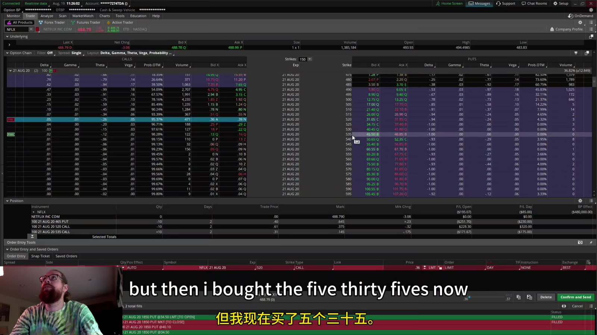
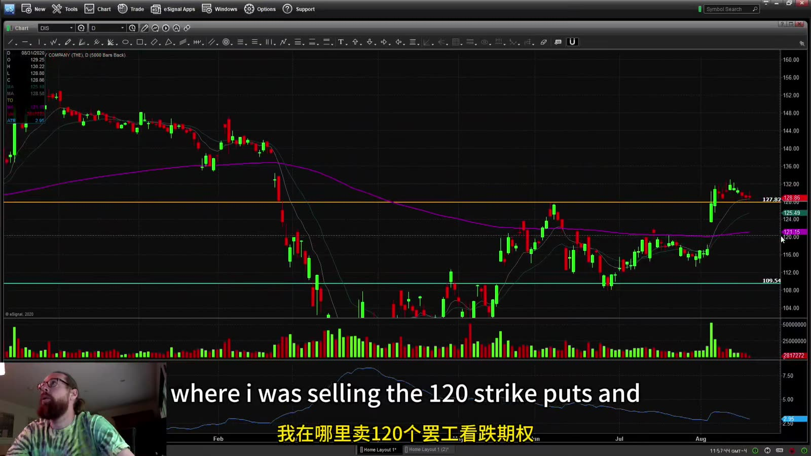
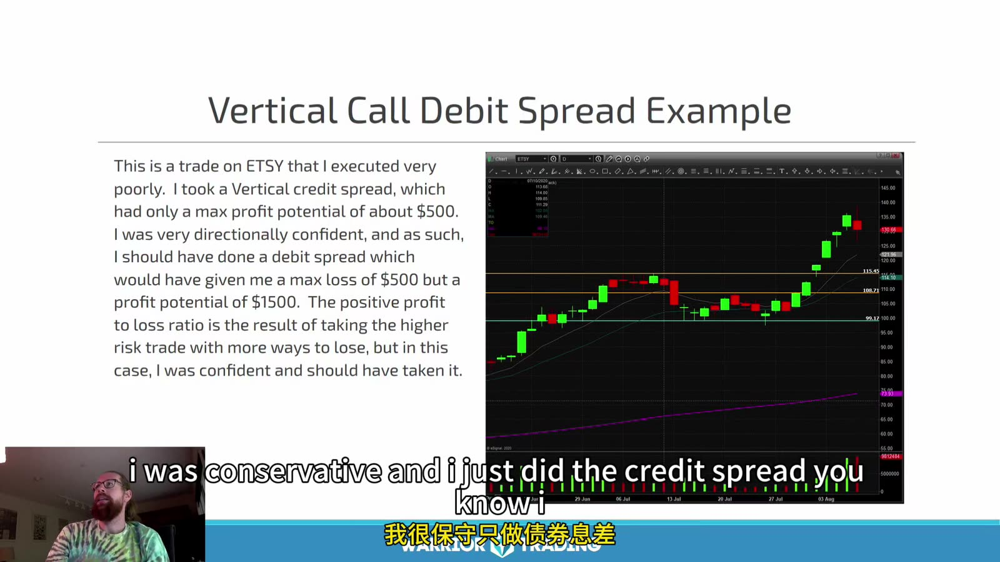
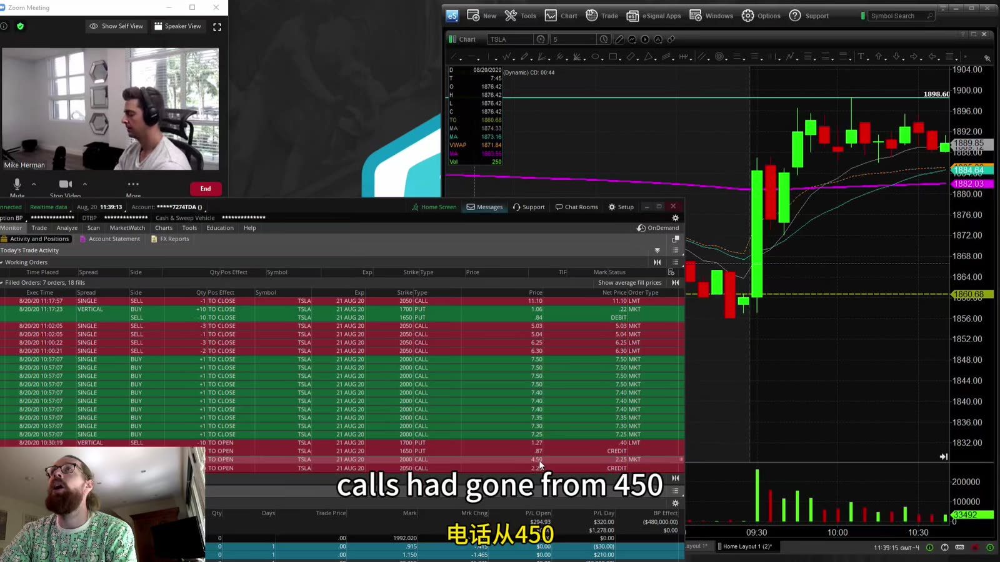
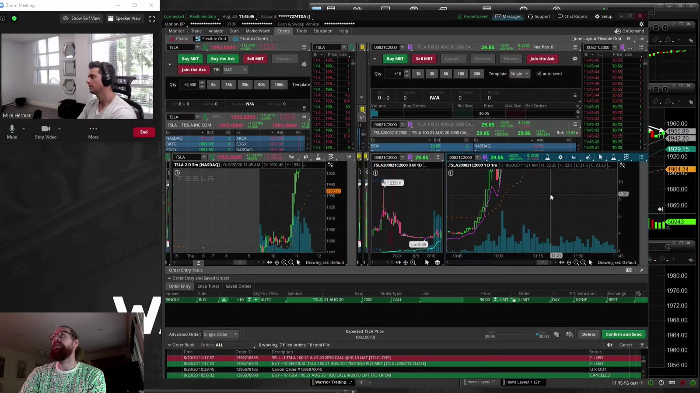
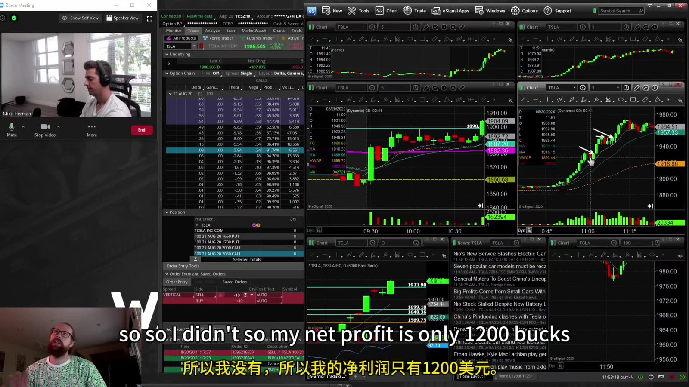

# Swing & Options 03：Options Spreads and TSLA Example

> 对应视频：Chapter 2 Part 3 与 Bonus TSLA Trade
> 本节重点：Spread 用一条腿限制另一条腿的风险或成本，但同时限制收益、增加成交复杂度。应先画到期 payoff，再考虑进场。

## 1. Vertical spread 的基本结构

同一 underlying、同一 expiration、不同 strike：

| 策略 | 组合 | 典型方向 | 最大亏损 |
|---|---|---|---|
| Call debit spread | 买低 strike call，卖高 strike call | 看涨 | net debit |
| Put debit spread | 买高 strike put，卖低 strike put | 看跌 | net debit |
| Call credit spread | 卖低 strike call，买高 strike call | 看跌/中性 | width - credit |
| Put credit spread | 卖高 strike put，买低 strike put | 看涨/中性 | width - credit |

以上都乘合约 multiplier，并扣费用。只有同到期、同类型的 vertical 才能直接用这张表。

## 2. 组合订单与 legging risk



**图怎么看：**

- 期权链上需要同时选 long leg 和 short leg，方向、strike、expiration 任一错误都会改变 payoff。
- 两腿各自有 bid/ask；自然成交区间不是简单把两个 last price 相减。
- 用 net debit/net credit 的限价组合单可减少一腿成交、另一腿未成交的裸露风险。
- 深度不足时，显示的 mid 可能不可成交；应从较保守价格逐步调整，不追逐平台理论值。

## 3. Put credit spread 案例



**图怎么看：**

- 主图用于选择支撑区域，期权腿则把看涨/中性判断转换成有限风险结构。
- Short put strike 决定主要义务，long put strike 限制极端下跌损失。
- 不能只因 strike 在支撑下方就认为安全；overnight gap 可直接越过两条 strike。
- 先用到期 payoff 计算 max profit、max loss 与 breakeven，再评估中途 Greeks。

以 short put strike `K_s`、long put strike `K_l`、net credit `C` 为例：

```text
max profit = C
max loss   = (K_s - K_l) - C
breakeven  = K_s - C
```

每股数值再乘 multiplier。

## 4. Vertical call debit spread



**图怎么看：**

- Slide 说明方向判断很强时，debit spread 可比 credit spread 保留更多上行，但最大收益仍被 short call 限制。
- 低 strike long call 提供正 delta，高 strike short call 抵消部分成本和 Greeks。
- 股价提前快速越过两条 strike 时，spread 仍可能因剩余时间价值未立即达到到期最大值。
- 若持有到期，要处理 exercise/assignment 与 pin risk；不一定应等到理论 max profit。

Call debit spread：

```text
max loss   = net debit
max profit = strike width - net debit
breakeven  = long-call strike + net debit
```

## 5. TSLA 案例：不对称 iron condor



**图怎么看：**

- 初始结构是两组 credit spread：卖 `1700 put / 买 1650 put` 收约 `$0.40`，同时卖 `2000 call / 买 2050 call` 收约 `$2.25`。
- 两侧 credit 严重不对称：上方 call spread 收得多，也说明市场对触及上方 strike 定价更高；这不是上下风险均衡的区间交易。
- TSLA 突破前高后，原先约 `$4.50` 卖出的 2000 call 快速升值，call credit spread 成为主要亏损侧。
- 图中后来的巨大上涨是结果展示，不是“不知道方向时卖 condor”的 entry 证明。
- 若截图使用 split 前历史价格或旧合约，不能把名义价格直接与当前 TSLA 对照。

按课程口述，put spread 约以 `$0.22` 买回，保留每股约 `$0.18`；call 侧则在标的突破约 1911 后开始主动拆腿。

## 6. 拆腿后的风险已经改变



**图怎么看：**

- 讲师买回原本 short 的 2000 calls、留下 long 2050 calls，仓位由 defined-risk call credit spread 变成单独 long calls。
- 这一步不再是 iron condor 的被动 payoff，而是新的强方向判断；最大亏损转为留下 long calls 的成本，delta/gamma/vega 也全部改变。
- Long calls 随 TSLA 上涨获利后被分批卖出，但若突破立即失败，它们也可能迅速回吐。
- 每次拆腿后都必须重新核对 open orders、剩余合约、净 Greeks、最大损失和新的退出规则，不能继续沿用原 spread 的 stop。

拆腿本身不是可普遍复制的“修复法”。这次结果盈利，不能证明以后遇到 losing spread 都应该移除 short leg；它可能把原先有限风险结构变成另一笔没有事前计划的交易。

## 7. 结果复盘不能只看最终盈利



**图怎么看：**

- 课程口述的合计净利润约 `$1,200`，但它来自 put spread 小利、short calls 的亏损和保留 long calls 的大幅升值三部分。
- 若只看最终净利润，会掩盖原 call credit spread 已经失效，以及中途主动改变 payoff 的事实。
- 讲师也指出：靠近现价的 2000/2050 侧为了较高 credit 需要持续管理，较远 OTM strike 收益更少但不那么敏感。
- 复盘应比较初始 iron-condor payoff、实际逐腿 fills、每次改仓后的新 payoff 与最大中途风险，而不是用事后最高价后悔少赚。

这段最值得保留的不是“iron condor 也能赚”，而是：`credit 越诱人，通常对应更高的被触及风险；一旦拆腿，必须把它视为新仓位。`

## 8. Spread 管理的四种退出

1. **Price target**：达到预定 net price；
2. **Underlying invalidation**：标的破坏技术结构；
3. **Time stop**：预期 move 未按期出现；
4. **Event/volatility change**：earnings、IV 或 liquidity 改变。

不要只对单腿设 stop。退出时看整个 spread 的可成交 net price；分别市价平腿会增加成本与裸露风险。

## 9. 到期前检查

- 两条腿是 ITM/ATM/OTM 哪种组合；
- short leg 是否可能提前 assignment；
- 是否有 ex-dividend；
- 到期后 exercise/assignment 会形成多少股票；
- 账户是否有足够 buying power；
- spread 是否有足够 liquidity 平仓；
- broker 的 expiration cut-off；
- 是否值得为最后少量利润继续承担 pin risk。

Spread 把风险写进结构，但不会替你管理到期和订单。
