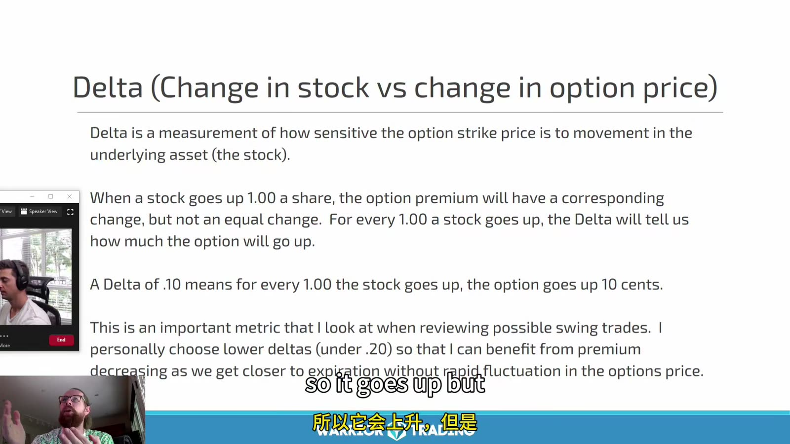
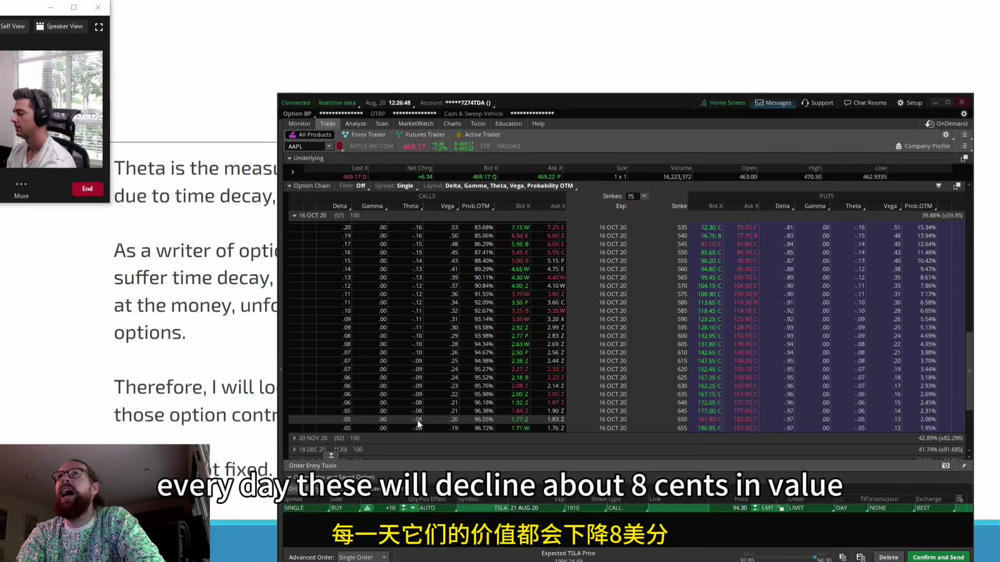
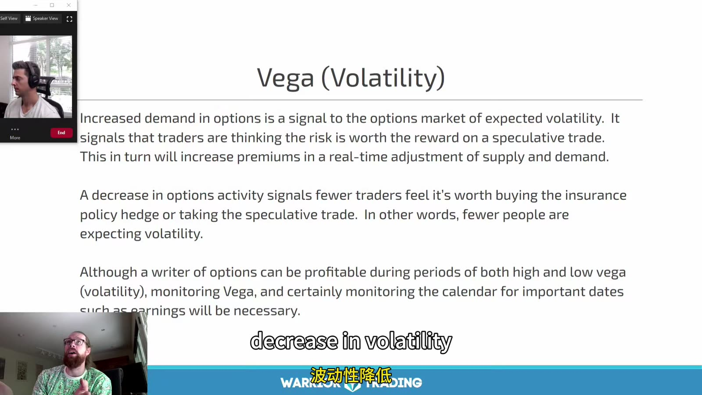

# Swing & Options 04：Premium Pricing and Greeks

> 对应视频：Chapter 3 Part 4 Premium Pricing & Greek Pricing Formulas
> 本节重点：期权价格不是“股票涨一美元，期权就固定涨多少”。Delta、gamma、theta、vega 只是在其他条件近似不变时描述局部敏感度。

## 1. Premium 的组成

```text
option premium = intrinsic value + extrinsic value
```

Extrinsic value 受到：

- 剩余时间；
- implied volatility；
- 标的价格与 strike 的关系；
- 利率和预期股息；
- 供需与 bid/ask；
- 合约条款。

到期时标准 vanilla option 不再有时间价值，只剩 payoff；到期前则不能只用 intrinsic value 定价。

## 2. Delta



**图怎么看：**

- Slide 把 delta 解释为标的变动与 option price 变动的敏感度。
- 例如 delta `0.10` 不是永远“股票每涨 `$1`，期权涨 `$0.10`”；这是当前点附近的近似。
- 标的移动后 delta 会因 gamma 改变，IV 与时间也可能同时改变。
- Long call delta 通常为正，long put delta 通常为负；short position 符号相反。

课程提到偏好低 delta 来获得更高杠杆式涨幅，但低 delta 常意味着更 OTM、归零概率更高、spread 百分比更宽。不能把“便宜”当作风险低。

## 3. Theta



**图怎么看：**

- 画面将 theta 与每天的时间价值损耗联系起来。
- Theta 是模型在当前条件下的局部估计，不是账户每天固定扣款。
- 临近到期、接近 ATM 时衰减形状可能更陡；周末/事件的市场定价也不是简单按日历线性分摊。
- Long option 通常负 theta，short option 通常正 theta，但 short 方用尾部风险换取这种收益。

如果 swing thesis 需要两周才实现，购买只剩几天的合约会让 timing tolerance 极低。

## 4. Vega 与 implied volatility



**图怎么看：**

- Vega 描述 option price 对 implied volatility 变化的敏感度。
- IV 是市场从期权价格反推出的预期波动输入，不是历史波动本身，也不直接预测方向。
- Earnings 前 IV 可能升高、公布后快速下降；即使方向正确，也可能发生 IV crush。
- 不同 expiration/strike 构成 volatility surface，不能只看单一 “IV” 数字。

## 5. Gamma、rho 与二阶效应

课程画面主要突出 delta/theta/vega，但完整理解还要补：

- **Gamma**：delta 对标的价格的敏感度；临近到期 ATM 合约 gamma 可很高。
- **Rho**：option price 对利率的敏感度；长期合约更相关。
- **Vanna/charm 等**：专业风险管理会关注交叉效应，但初学不需要据此堆指标。

Greeks 是模型输出，不是市场欠你的收益。

## 6. 选择 expiration

从 thesis duration 反推：

```text
expected move window
+ time for false start
+ time to exit with liquidity
= minimum practical days to expiration
```

更远到期：

- premium 更高；
- theta 通常较缓；
- 对 IV 更敏感；
- 给 thesis 更多时间。

更近到期：

- premium 较低；
- theta/gamma 更剧烈；
- timing 错误容忍度低；
- 到期操作风险更近。

## 7. 选择 strike

不要只看“每份多少钱”。比较：

- delta 与 moneyness；
- bid/ask 占 premium 的比例；
- volume/open interest；
- breakeven；
- thesis 目标下的情景价值；
- max loss；
- 若用 spread，short strike 如何限制收益。

以相同风险预算比较合约数，而不是用相同合约数比较。

## 8. 四个情景矩阵

对 long call 至少计算：

| 标的路径 | IV | 时间 | 可能结果 |
|---|---|---|---|
| 快速上涨 | 上升 | 少量流逝 | 通常最有利 |
| 缓慢上涨 | 下降 | 大量流逝 | 方向对仍可能亏 |
| 横盘 | 上升 | 流逝 | vega 可能暂时抵消 theta |
| 下跌 | 下降 | 流逝 | 多因素同时不利 |

再对 long put、credit/debit spread 重做，不要假设完全镜像。

## 9. Greeks snapshot

每笔入场、每日收盘、退出各保存：

```text
underlying price
option bid / ask / mid / last
expiration and DTE
strike and moneyness
IV
delta / gamma / theta / vega
open interest / volume
event calendar
position-level Greeks
```

复盘时才能分解：到底是方向、时间、IV，还是成交成本导致 P&L。
