# Swing & Options 05：Stock Swing Setups

> 对应视频：Chapter 3 Stock Setup 1–4
> 本节重点：四种 setup 分别从 pullback、ABCD、水平支撑阻力和 200 EMA 寻找多日机会。所有触发都以日线为 context，再用明确价位定义风险。

## Setup 1：First Daily Candle to Make a New High

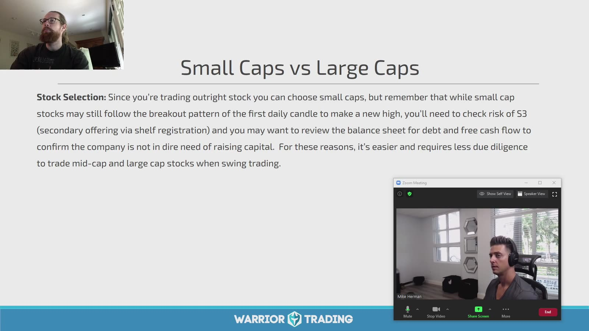

**图怎么看：**

- Slide 建议 swing 更偏 mid/large caps，并对 small cap 的 shelf registration、债务和稀释做额外尽调。
- “大盘股”不是安全保证；财报和宏观事件同样会 gap。
- 日线 first candle new high 需要此前已有清楚 pullback，不能把任意绿色日 K 当触发。
- 若使用 options，还要同时选择 expiration、strike 与流动性。

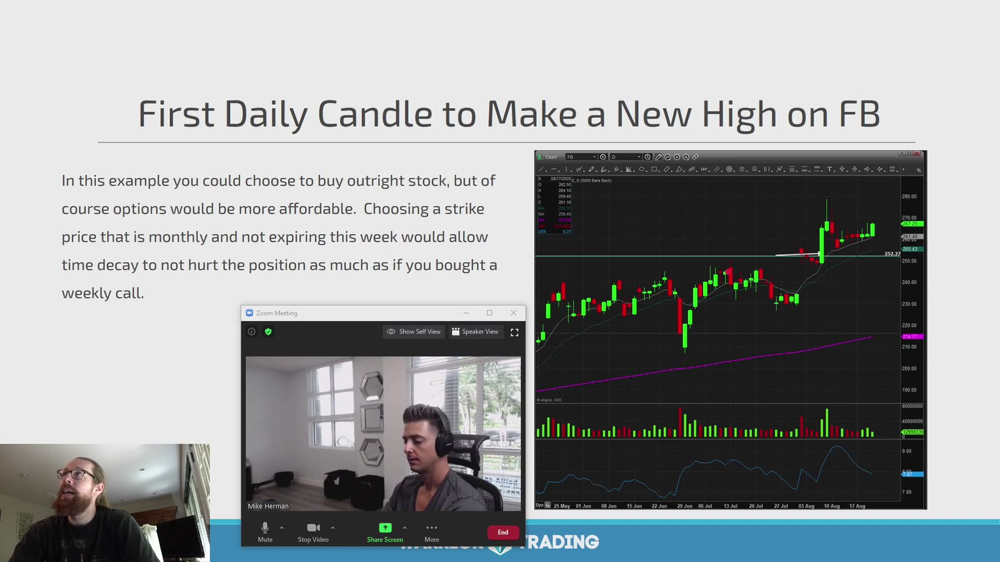

**图怎么看：**

- 股价在上升趋势中回撤，随后一根日 K 突破前一日 high，属于 pullback continuation trigger。
- Entry 可以是盘中 trade-through，也可以等日线收盘确认；两者价格、假突破率和隔夜风险不同。
- Stop 参考 pullback low，若距离太远就缩小仓位。
- 上方最近前高与日线阻力决定第一目标，不应默认恢复到历史最高。

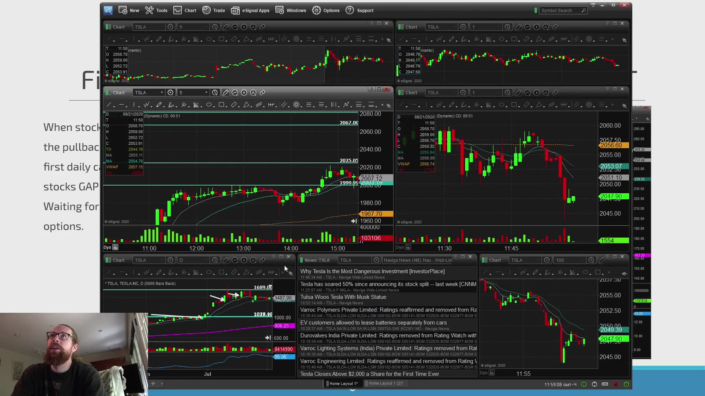

**图怎么看：**

- 多张图展示同一 setup 在不同路径下的表现，右下急跌提醒失败不会总是平滑。
- 如果触发日恰逢 earnings，技术 stop 无法控制 after-hours gap。
- 日线 signal 可以用小时图/15m 优化执行，但不能因此把日线失效点偷偷收紧。
- 每笔记录 trigger 当日是否收在前日 high 上方，以及次日是否 follow-through。

定义：

```text
trend = rising daily structure
pullback = N sessions without breaking major support
trigger = first session trades/closes above prior session high
stop = pullback low or predefined tighter structure
target = prior high / measured R
```

`trades above` 与 `closes above` 必须分开测试。

## Setup 2：Daily ABCD

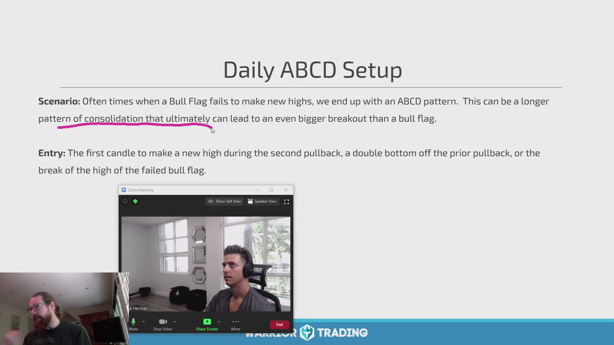

**图怎么看：**

- Slide 将 bull flag 未立即创新高、形成更长 consolidation 的情况归为 ABCD。
- A→B 是 impulse，B→C 是多日 pullback/consolidation，C 后重新上行。
- Entry 可用第二次 pullback 后 first daily candle new high、double bottom，或突破失败 bull flag 的 high。
- C 低点是结构失效，不是因预期 D 就可以忽略的价位。

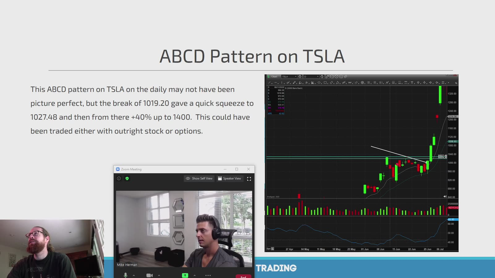

**图怎么看：**

- 图中 TSLA 在高位整理后突破水平参考，随后快速扩张。
- 成功的知名股票案例存在选择偏差；应保存未突破、跌破 C 的样本。
- 若 breakout candle 已经很大，risk-to-C 可能不合理，等待 retest 是独立 entry。
- 股票和 options 都可表达方向，但期权不能绕过技术风险，只是改变 payoff。

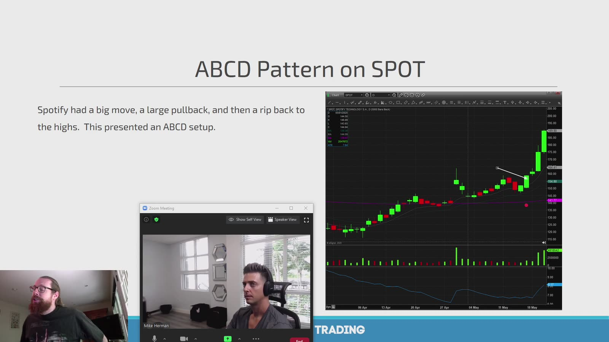

**图怎么看：**

- SPOT 先有大涨、明显回撤，再恢复至高点，形成较长周期 ABCD。
- A/B/C 锚点应在 D 出现前标出；事后总能找出看似漂亮的三段。
- Consolidation 时间越长，option expiration 需要留的缓冲越多。
- D 不是固定目标；突破前高后要用新结构管理。

## Setup 3：Daily Support / Resistance

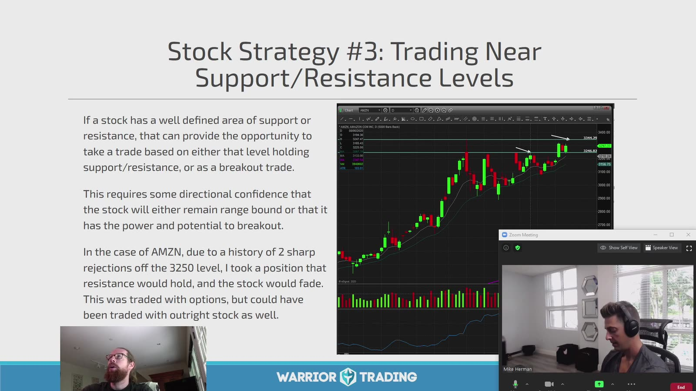

**图怎么看：**

- 图中价格多次在相近水平受阻，同时 low 抬高，可能形成 flat top/ascending triangle。
- 可以交易 range rejection，也可以交易 breakout；两者方向相反，触发不能混用。
- 课程案例提到根据历史 rejection 偏向阻力仍有效，这属于需要重新验证的条件。
- 在阻力下买 options 时，必须明确是在押突破还是押回落。

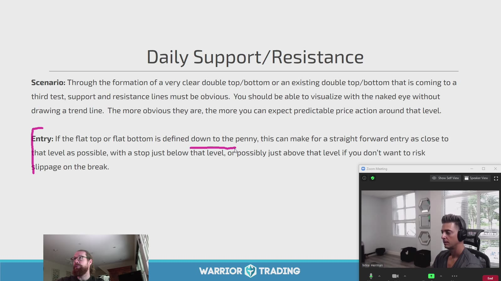

**图怎么看：**

- Slide 强调明显 double top/bottom、第三次测试或 trendline 与水平位。
- 支撑/阻力更适合视为区域而非精确一分钱；但 entry 和 stop 仍要有精确订单价。
- 测试次数增加既可能削弱挂单，也可能重复确认区域；不能机械规定第三次一定突破。
- 先看区域外到下一目标的空间，再决定是否值得入场。

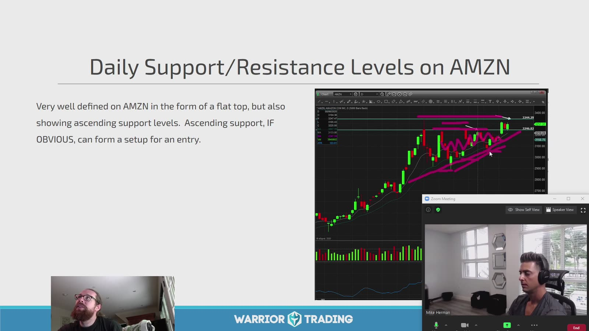

**图怎么看：**

- 紫色标记显示多次顶部测试，斜线显示 ascending support，价格逐步压缩。
- 图形可被命名为 ascending triangle，但真正 edge 要来自预定义样本。
- Earnings 前的压缩可能在公布后向任一方向 gap，普通 stop 无法控制。
- Options IV 往往在事件前升高；买对方向也要超过已定价的 move。

两种计划分开写：

```text
rejection plan:
  entry = failed test / break micro low
  stop  = acceptance above resistance

breakout plan:
  entry = close/trade above + liquidity
  stop  = failed breakout / retest low
```

## Setup 4：Daily 200 EMA

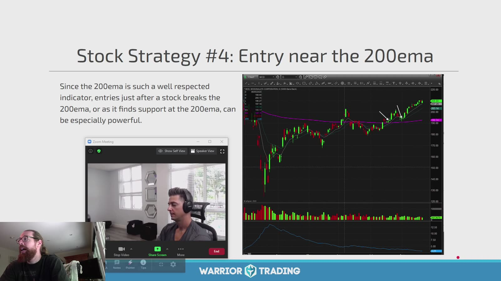

**图怎么看：**

- 股价从下方突破紫色 200 EMA，之后在其附近整理并恢复上行。
- 这属于 breakout-retest，而不是第一次碰线就买。
- 不同平台的复权和 EMA 参数会产生差异，应固定数据源。
- 200 EMA 广受观察，但不会阻止新闻 gap。

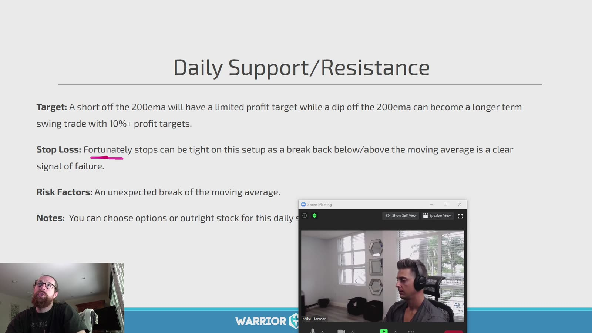

**图怎么看：**

- Slide 区分：向上突破后的 short/rejection 目标可能有限，跌到 200 EMA 的 long bounce 可能持有更久。
- 这种不对称是课程经验，仍需按实际趋势和上方/下方空间判断。
- Stop 可放在明确 break-and-acceptance 的另一侧，而不是刚好贴线。
- “tight stop” 会减少每笔损失，也可能在均线附近正常震荡中频繁触发。

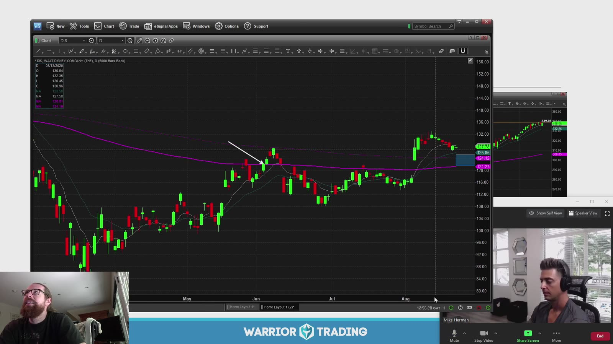

**图怎么看：**

- 图中多根 K 在 200 EMA 两侧来回，说明 moving average 是动态区域而非硬墙。
- 白箭头附近短暂收回后仍可能重新跌破；需要 close、volume 或 higher low 确认。
- 若均线走平，趋势意义比明显上/下斜时更弱。
- Reclaim、retest、rejection 和 breakdown 四种事件应单独统计。

## 5. 股票与期权的选择

选择股票更合适：

- 想要线性 delta；
- 持有期不确定；
- option spread 很宽；
- 不想承担 expiration/IV；
- 需要分红权利且理解相关风险。

选择 defined-risk option structure 可能更合适：

- 明确事件与时间窗；
- 股票 notional 太大；
- 愿意支付 premium 或限制 upside；
- option chain 有足够 liquidity；
- 已计算所有 Greeks 与到期处理。

不能因为账户买不起 100 股，就随意买最便宜的 OTM option。

## 6. 四种 setup 的统一表

| Setup | Trigger | Invalidation | 时间风险 |
|---|---|---|---|
| First daily new high | 破前日 high | pullback low | 触发后不 follow-through |
| Daily ABCD | C 后恢复并破结构 | C low | consolidation 继续延长 |
| S/R breakout | 区域外 acceptance | 跌回区域 | 多次假突破 |
| 200 EMA reclaim | 回到均线上并守住 | 接受在均线下 | 线附近震荡 |

## 7. 复盘标准

对每个 setup 同时保存：

- 入场前最后一个完整日线截图；
- 当时的 market/sector；
- entry 方式：intraday trade-through 或 daily close；
- 是否跨 earnings；
- 股票/期权结构及原因；
- 到第一目标的 planned R；
- 5/10/20 个交易日后的结果；
- time stop 是否优于 price stop；
- 失败后是否立即变成反向 setup。

目标是把漂亮图形压缩成在未知未来中也能执行的规则。
