# Swing & Options 06：Options Swing Strategies

> 对应视频：Chapter 3 Options Setup 1–5
> 本节重点：五种策略不是按“保守到激进”简单排列，而是五种不同 payoff。选择前先回答：方向、波动、时间、最大亏损与 assignment 后会持有什么。

## Strategy 1：Covered Call

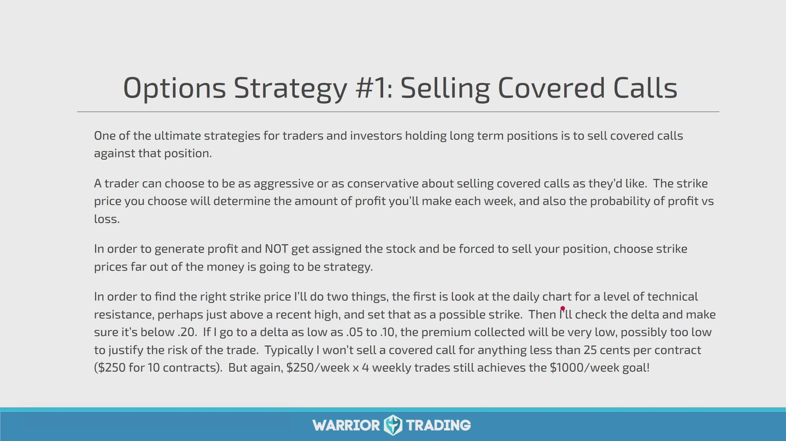

**图怎么看：**

- Covered call 是持有 100 股并卖出 1 份 call，收到 premium 换取 strike 上方收益被截断。
- Slide 用较低 delta、较远 OTM strike 寻找较低 assignment 概率；delta 只是局部敏感度，不是精确到期概率。
- 只在“本来就愿意按 strike 卖出”时，assignment 才与计划一致。
- Premium 不能保护大幅下跌；股票风险仍占主导。

到期时：

```text
stock P&L + short call P&L
```

最大收益大致为：

```text
(strike - stock cost basis) + premium
```

最大亏损仍接近股票跌到零的损失，减去 premium。

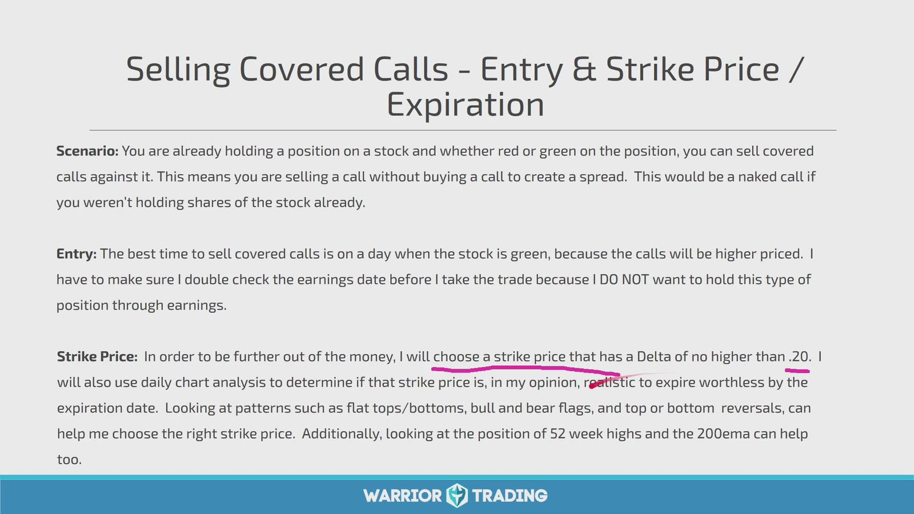

**图怎么看：**

- Slide 建议已有股票仓后，在股价较强时卖 call，并避开 earnings。
- 股价上涨时 call premium 往往更高，但 IV、到期和 strike 同样重要。
- “选择 `.20` 以下 delta”是课程偏好，不是统一最优阈值。
- 到期更远收 premium 更多，同时被锁住 upside 的时间也更长。

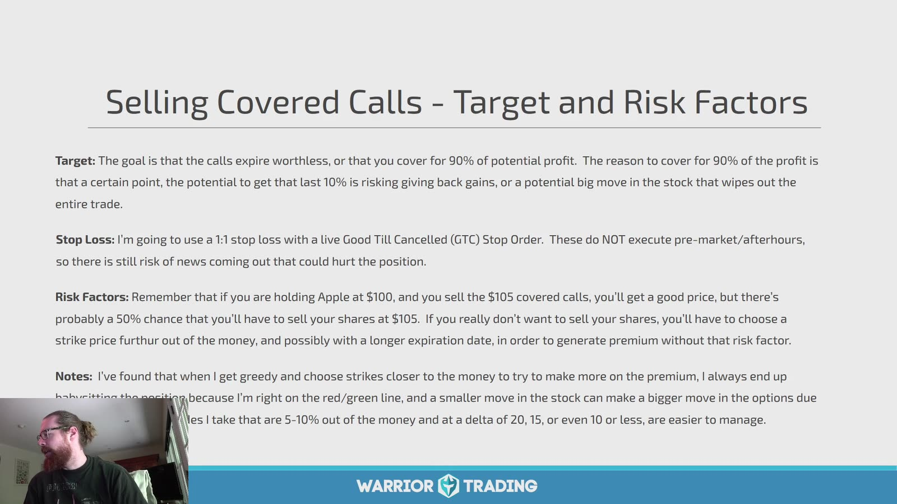

**图怎么看：**

- Slide 设想在 call 价值衰减 90% 后买回；这是 profit-management 规则，不应机械等待。
- 若剩余收益很小而仍承担 gap/assignment 风险，提前平仓可能更合理。
- Good-till-canceled stop 对 short option 未必按预期工作，且盘前盘后 underlying 变化时 option market 可能关闭。
- Ex-dividend 前 ITM short call 有提前 assignment 风险。

Covered call 复盘要用“若只持股票”的基准，判断收到 premium 是否补偿了被截断的 upside。

## Strategy 2：Cash-Secured Put

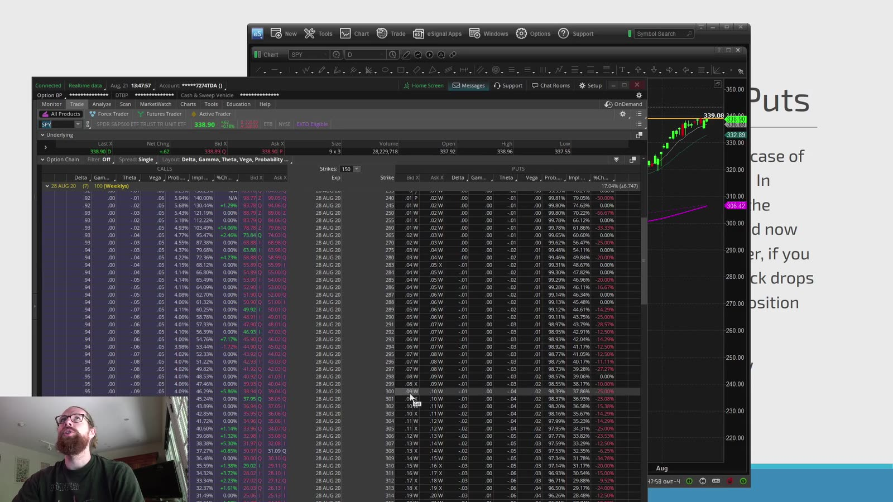

**图怎么看：**

- 画面在 put chain 中选择 short strike，同时需要预留 `strike × multiplier` 左右的现金。
- Strike 应代表愿意持有股票的真实价格，不只是 premium 看起来高。
- 低 delta/远 OTM 降低 premium 与 assignment 可能性，但不消除 gap tail risk。
- 若合约 adjusted 或 multiplier 非 100，现金需求会不同。

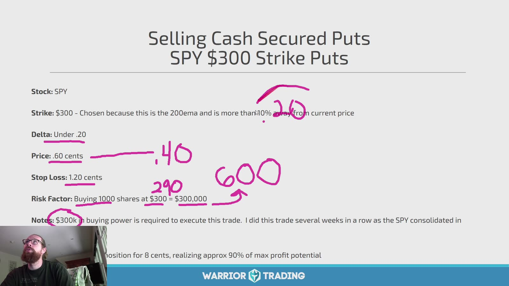

**图怎么看：**

- Slide 用 `$300` strike、约 `$0.50` premium 说明一份标准合约的 nominal cash obligation。
- 1 份通常需要约 `$30,000` notional，而最大收益只有约 `$50`，风险收益极不对称。
- “大概率归零”不等于 edge；需比较历史 tail loss 和机会成本。
- Assignment 后如果不愿继续持有，就不应把它称为 cash-secured entry strategy。

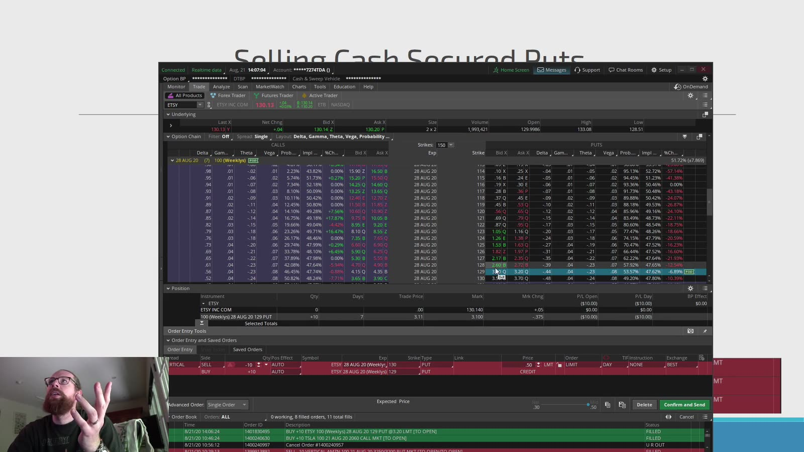

**图怎么看：**

- 确认窗口必须显示 `sell to open`、正确 strike/expiration、合约数与 buying-power effect。
- Broker 显示的 margin requirement 可能小于经济损失；“账户允许下单”不代表风险合适。
- 在 market stress 中 put spread 会扩大，买回止损可能远差于 mid。
- Short put 在到期前也可能 assignment。

Cash-secured put 到期：

```text
max profit = premium
breakeven  = strike - premium
max loss   ≈ strike - premium  (if stock goes to 0)
```

每股数值乘 multiplier。

## Strategy 3：Vertical Credit Spread / Iron Condor

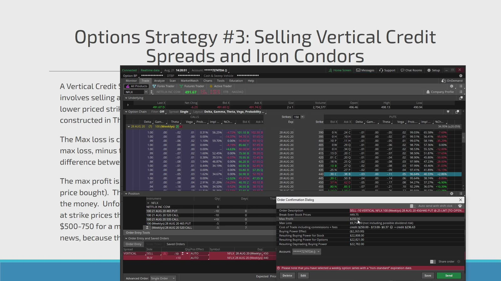

**图怎么看：**

- Credit spread 卖近 strike、买远 strike 限定尾部损失；iron condor 同时组合 put credit spread 与 call credit spread。
- Iron condor 不是“两个胜率相加”，而是需要标的到期留在中间区间。
- 四腿结构有更多 bid/ask、费用和 assignment 管理。
- Earnings 等大波动事件会同时威胁任一侧。

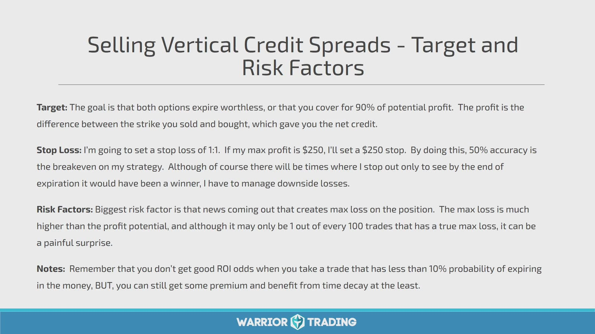

**图怎么看：**

- Slide 用 `1:1` stop 与回收约 90% premium 的目标描述管理方法。
- Option spread 价格会因 IV 与 liquidity 突然跳过 stop；固定 1:1 不是最大损失保证。
- 若收 `$250`、width 对应 max loss `$750`，breakeven 胜率要扣费用和实际退出成本。
- “低概率 ITM”若 payout 极不对称，仍可能期望值不佳。

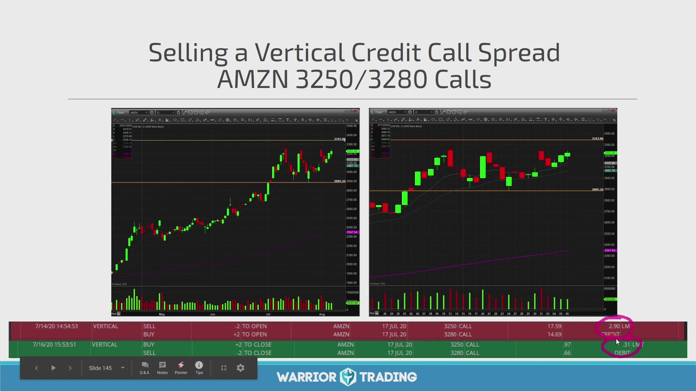

**图怎么看：**

- 图中根据日线阻力卖较低 strike call、买更高 strike call，表达看跌/中性。
- 标的突破 short strike 后仍不一定立即达到 max loss，但 gamma 风险会随到期接近上升。
- Call spread 可能遇到 short call 提前 assignment；long call 可对冲经济风险，但股票仓与操作仍需处理。
- 到期 pin 在两条 strike 附近时，不要依赖平台自动替你得到预期结果。

Iron condor 需要四个 strike 的完整 payoff、两个 breakeven 和两侧 max loss，不能只写总 credit。

## Strategy 4：Vertical Debit Spread

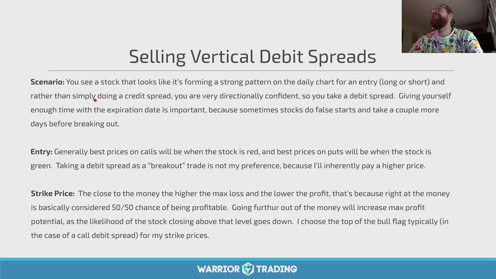

**图怎么看：**

- Slide 说明方向信心较强时用 debit spread，并给 trade 足够到期时间。
- Long leg 提供方向，short leg 降低 debit 但限制最大收益。
- “靠近 ATM 就是 50/50”过度简化；市场概率、风险中性概率和实际回报不是同一个概念。
- 最合适 short strike 应结合目标价、payoff、liquidity，而不只是 bull flag 顶部。

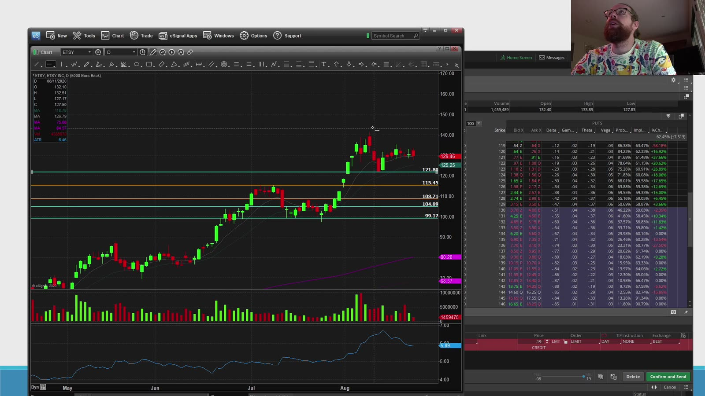

**图怎么看：**

- 左图定义标的支撑/阻力，右侧 chain 用于选择两腿。
- 若标的目标低于 short strike，付出的 width 可能没有被充分利用。
- Deep ITM/OTM 腿的 spread 和 open interest 可能不同，不能只追求理论 max profit。
- 组合成交后核对实际 net debit，它直接决定最大损失与 breakeven。

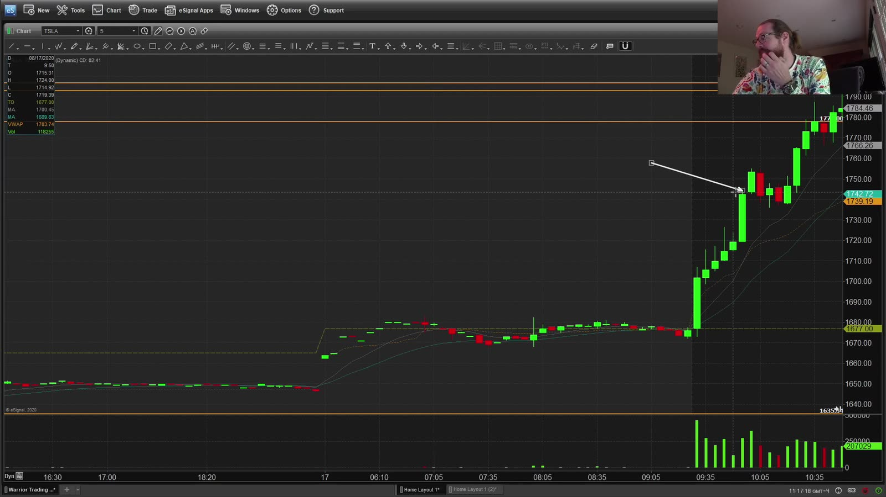

**图怎么看：**

- 白箭头后价格大幅上行，是 debit call spread 的理想方向结果。
- 如果很早超过 short strike，spread 仍受剩余 extrinsic value 影响，未必立即等于 width。
- Long leg ITM、short leg 也 ITM 时，到期可能 exercise/assignment 相抵，但账户仍需按 broker 流程处理。
- 在 max profit 剩余很少时继续持有，是用大量剩余风险换少量收益。

Debit spread：

```text
max loss = net debit
max profit = strike width - net debit
```

## Strategy 5：Buying Calls / Puts

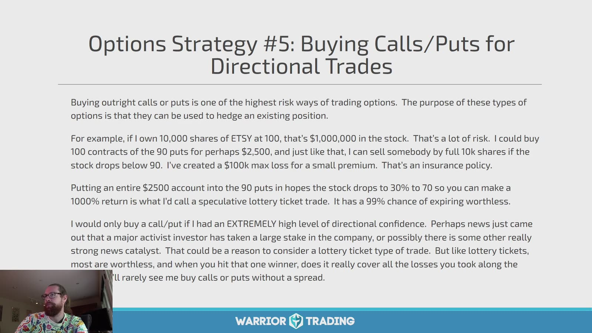

**图怎么看：**

- Slide 正确指出单买 option 是高风险表达：premium 可全部归零。
- 用 put 对冲大股票仓和把全部小账户押在 puts 上，虽然工具相同，风险目的完全不同。
- Lottery-ticket 的小美元价格容易掩盖高归零概率。
- Directional confidence 不能用主观“非常确定”衡量，需有 setup、事件与风险预算。

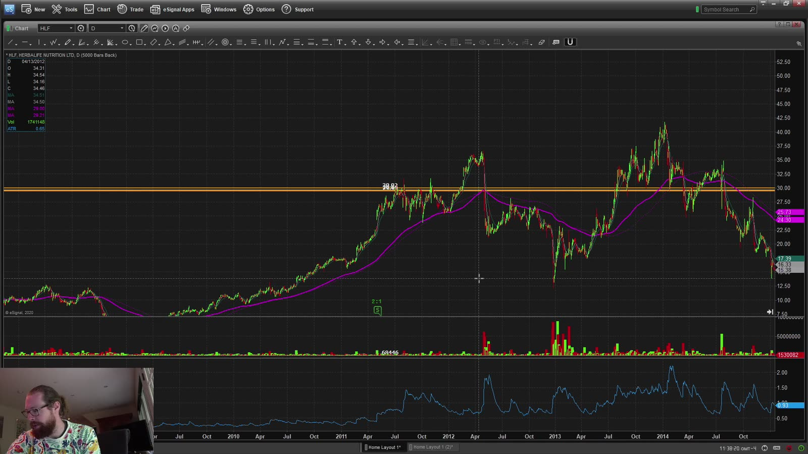

**图怎么看：**

- 长期 chart 中多次趋势、震荡与回撤说明 expiration 必须匹配预期时间。
- 在震荡区买 option 会同时遭遇方向不明和 theta。
- Long-dated option 减少近期 time pressure，但 premium 与 vega exposure 更高。
- 如果 thesis 是长期投资，直接股票与 LEAPS 的税务、股息、delta 和流动性需要单独比较。

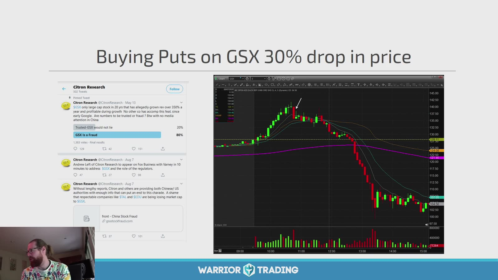

**图怎么看：**

- 图中消息/研究内容后股票大跌，是 put 的成功方向案例。
- 看到消息后再买时，IV 和 put premium 可能已经大幅上涨；chart 跌幅不能直接等于 option 回报。
- 单一研究报告存在事实、时点和市场已定价风险，不能只凭截图建立信念。
- 若股票停牌，option 也可能难以交易；预设止损无法保证。

## 6. 五种策略的真实风险对照

| 策略 | 主要观点 | 最大收益 | 主要尾部风险 |
|---|---|---|---|
| Covered call | 温和看涨/愿按 strike 卖 | 有上限 | 股票大跌 |
| Cash-secured put | 愿按 strike 买 | premium | 股票跌到接近零 |
| Credit spread | 方向/区间，收 premium | credit | gap 至 max loss |
| Debit spread | 明确方向 | width - debit | debit 全损 |
| Long call/put | 强方向/对冲 | call 理论无上限，put 有上限 | premium 全损 |

## 7. 不能用“胜率”单独选策略

Credit strategies 常显示较高小赢频率，long options 常显示较低胜率但单笔潜在收益大。统一比较：

```text
expectancy
= P(win) × avg_win
- P(loss) × avg_loss
- fees
- slippage
```

还要看 skew、最大连续亏损、margin increase 和相关仓位同时受损。

## 8. Position-level Greeks

不要只看单腿：

- Covered call：long stock delta 被 short call 部分抵消；
- Cash-secured put：short put 有正 delta、负 gamma、正 theta、负 vega；
- Credit spread：defined risk，但到期附近 short strike 周围 gamma 敏感；
- Debit spread：正/负方向 delta，theta/vega 被 short leg 部分抵消；
- Long option：长 gamma、长 vega、负 theta（常见情况）。

平台显示的 Greeks 是估计值，要看整个 position 的净值。

## 9. 每笔 options swing 的固定模板

```text
Underlying thesis:
Event calendar:
Strategy:
Expiration / DTE:
Legs:
Net debit/credit:
Multiplier:
Max profit:
Max loss:
Breakeven(s):
Position Greeks:
Underlying invalidation:
Option/spread exit:
Assignment/exercise plan:
Liquidity check:
```

任何一栏无法填写，就还没有完成下单前分析。

## 10. 当前规则与披露

课程是录制期材料。合约结算、exercise/assignment、broker cut-off、margin 与产品资格以当前官方文件和券商说明为准：

- [OCC Options Disclosure Document](https://www.theocc.com/company-information/documents-and-archives/options-disclosure-document)
- [FINRA Options overview](https://www.finra.org/investors/investing/investment-products/options)

这些策略都可能损失资金；defined-risk 只表示理论 payoff 有边界，不表示一定能在计划价格退出。
