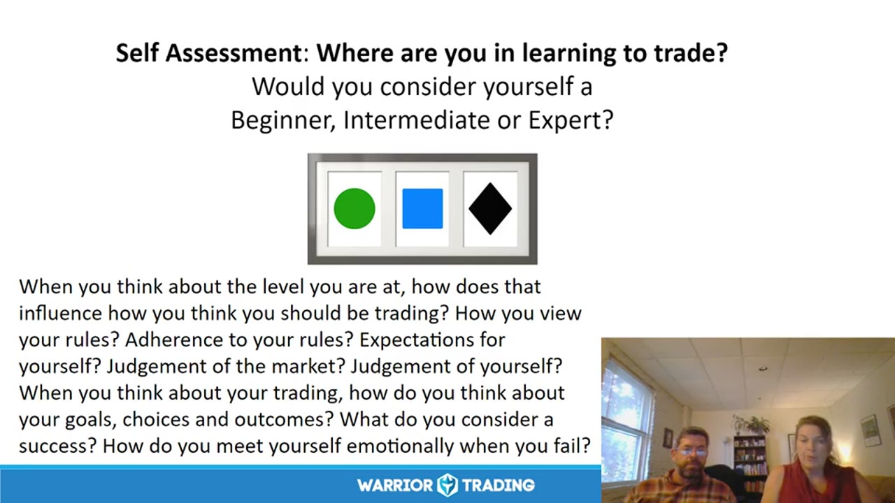
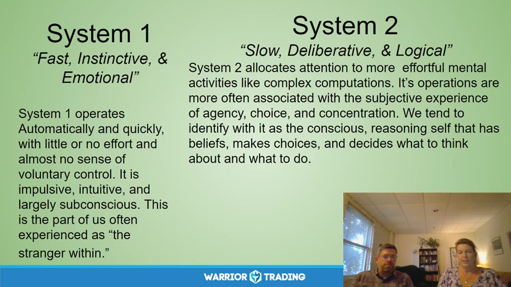
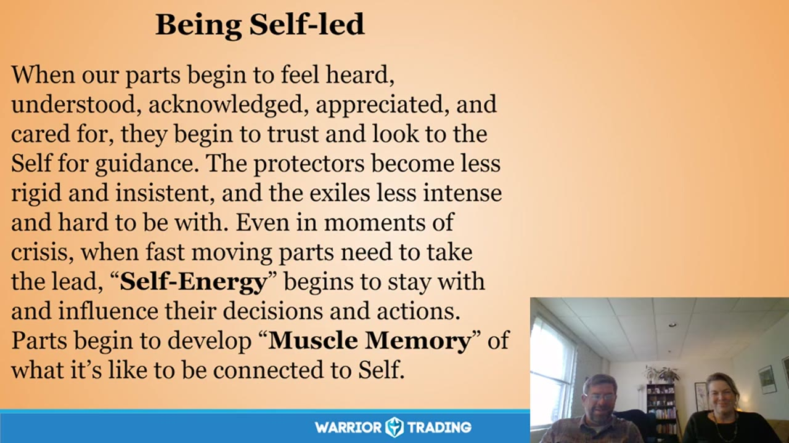
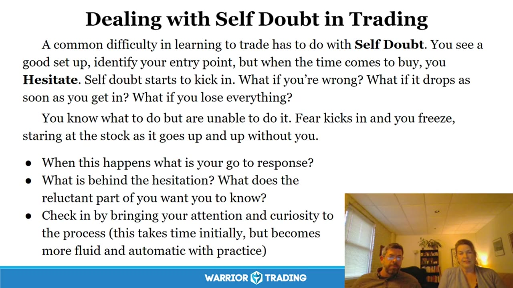
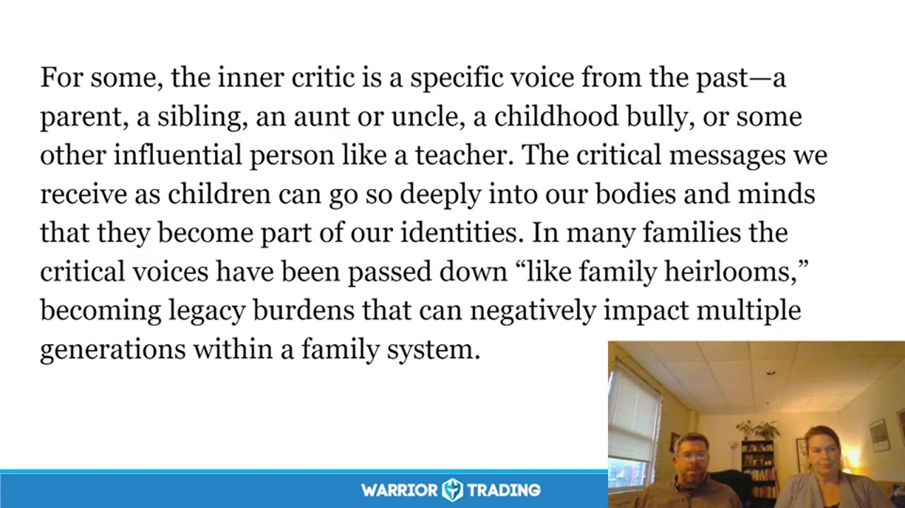
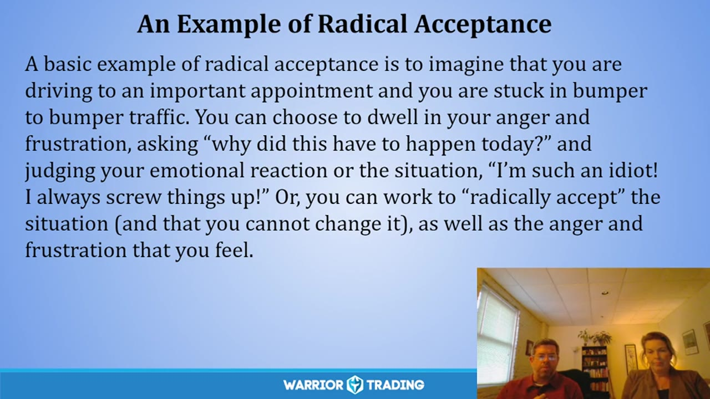
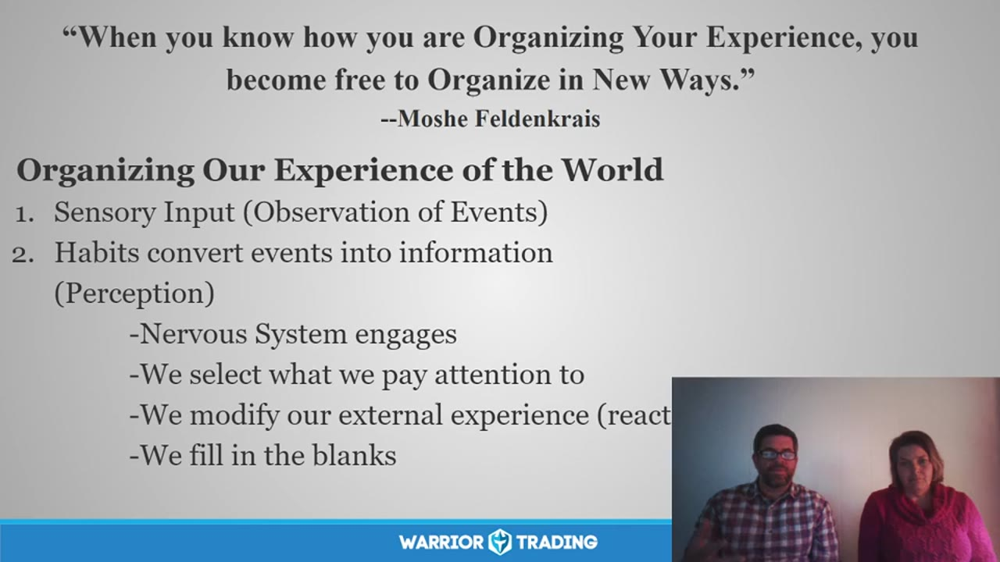

# FOMO Friday：2019

> 8 场，合计 8.4 小时。返回 [FOMO Friday 目录](../README.md)。

## v0933：交易心理与学习过程

> 日期：2019-10-18　·　时长：00:59:56

**本场重点：** 交易者需要区分交易表现与学习过程，保持耐心和自我接纳。

**图怎么看：**

- 这张图片展示了一个自我评估问题，询问交易者在学习交易过程中处于哪个阶段（初学者、中级或专家）。
- 通过这个问题，交易者可以反思自己的交易水平，并思考如何根据当前水平调整交易策略。
- 图片下方的文字进一步探讨了交易者在不同水平时对规则的遵守、市场判断、自我判断以及成功定义等重要方面。
- 这些内容强调了交易者需要区分交易表现与学习过程的重要性，以保持耐心和自我接纳。

### 关键内容

- 交易者容易因FOMO而过早进入交易，导致情绪波动。
- 通过冥想和反思，可以更好地理解自己的内心体验和情绪反应。
- 交易者应区分交易表现与学习过程，避免过度自信。
- 系统一和系统二思维模式在交易中的应用。
- 从新手到专家的五个技能发展阶段。
- 模拟交易的重要性，以及如何将其视为真实交易。
- 交易者应接受决策带来的情感后果，而不是自我责备。
- 专家级交易者依靠直觉，难以用言语解释其决策过程。
- 交易者应保持耐心，接受自己的不足，并不断改进。
- 交易者应学会区分数据和自我评价，避免过度批评自己

### 分析与执行顺序

1. 主持人介绍FOMO Friday的主题，即交易心理和学习过程。
2. 主持人分享了关于洗碗的比喻，强调内在体验和情绪管理的重要性。
3. 主持人进行了简短的冥想练习，帮助参与者放松并集中注意力。
4. 主持人引导参与者进行自我评估，确定自己的交易水平和规则遵守情况。
5. 主持人讨论了系统一和系统二思维模式在交易中的应用。
6. 主持人解释了从新手到专家的五个技能发展阶段。
7. 主持人强调模拟交易的重要性，以及如何将其视为真实交易

### 案例与细节

- 主持人提到Ross在交易中使用多任务处理的情况，展示了如何在交易中保持专注。
- 主持人分享了Adele的例子，她无法停止过度交易，导致账户爆仓。
- 主持人提到了Delphino的例子，他在模拟交易中学会了期权交易。
- 主持人分享了Casilla的例子，她在模拟交易中经历了各种情绪波动，最终学会了控制这些情绪。
- 主持人提到了Mark的20天样本挑战，要求交易者每次只交易一股股票，以培养纪律性

### 风险与边界

- 录制于2019年，部分市场规则和条件可能已发生变化。
- 模拟交易虽然有助于学习，但不能完全替代真实交易的经验。
- 过度依赖模拟交易可能导致实际交易时的心理偏差。
- 交易者应谨慎对待自己的情绪反应，避免过度自信或自我责备
- 交易者应意识到不同阶段的心理变化，适时调整自己的心态和策略

### 复盘问题

- 你认为自己目前处于哪个技能发展阶段？
- 你在交易过程中是否经常感到过度自信或自我责备？
- 你如何区分交易表现与学习过程？
- 你在模拟交易中是如何培养自己的交易技能的？
- 你如何应对交易中的情绪波动？

---

## v0934：多重自我与交易决策

> 日期：2019-10-25　·　时长：00:59:29

**本场重点：** 多重自我在交易决策中的影响，通过自动思维和系统思考来理解情绪和决策过程。

**图怎么看：**

- 这张幻灯片详细介绍了人类心理的两个系统：System 1（快速、本能、情感）和System 2（缓慢、深思熟虑、逻辑）。System 1自动且迅速地运作，几乎不需要意志力控制，而System 2则更注重复杂的计算和深思熟虑的过程。
- 幻灯片还提到了Daniel Kahneman的《Thinking, Fast and Slow》，强调我们的大多数决定并非由理性的深思熟虑驱动，而是由快速冲动和预设程序驱动，这些冲动和程序来源于我们过去的经历。
- 此外，幻灯片还讨论了管理者、被驱逐者和消防员的角色，这些角色在保护系统方面起着关键作用，但同时也可能引发极端情绪和行为问题。

### 关键内容

- 多重自我指的是我们内心有许多不同的部分，这些部分会影响我们的决策和情绪。
- 系统一（自动思维）和系统二（有意识思考）之间的区别在于，系统一更快速、无意识且情感驱动，而系统二更慢、有意识且逻辑驱动。
- 多重自我中的保护者（管理者和消防员）会试图控制我们的行为，有时这些保护者会驱使我们做出极端的行为。
- 通过练习自我观察和自我同情，可以将系统二的思维转化为系统一的自动思维。
- 多重自我中的核心自我是更接近基本意识的部分，能够帮助我们更好地理解自己。
- 交易中常见的自动思维包括对损失的恐惧和冲动交易，这些思维会影响我们的决策过程。
- 通过练习自我观察和自我同情，可以帮助我们识别和管理这些自动思维。

### 分析与执行顺序

1. 首先，介绍多重自我概念，解释它如何影响我们的决策和情绪。
2. 然后，讲解系统一和系统二的区别，强调它们在决策过程中的不同作用。
3. 接着，讨论多重自我中的保护者如何影响我们的行为，以及如何识别和管理这些保护者。
4. 之后，通过实例说明多重自我中的核心自我如何帮助我们更好地理解自己。
5. 最后，总结练习自我观察和自我同情的重要性，以改善决策过程。

### 案例与细节

- 在交易中，当遇到大亏损时，系统一的自动思维可能会驱使我们做出冲动的交易决策，而系统二的有意识思考则可以帮助我们冷静下来，重新评估情况。
- 一个交易者可能会发现自己在交易时总是过于谨慎，这可能是多重自我中的保护者在起作用，试图防止更大的损失。
- 另一个交易者可能发现自己在交易时总是过于自信，这可能是多重自我中的保护者在起作用，试图保持积极的心态。
- 通过练习自我观察和自我同情，一个交易者可以更好地识别和管理这些自动思维，从而做出更明智的决策。

### 风险与边界

- 多重自我理论可能难以量化，因此在实际应用中可能存在一定的主观性。
- 交易市场不断变化，多重自我理论需要结合实际情况灵活应用。
- 多重自我理论主要基于心理学研究，对于交易决策的具体影响还需要进一步验证。
- 多重自我理论的实践效果可能因个体差异而异，需要持续观察和调整。

### 复盘问题

- 多重自我中的哪些部分对交易决策影响最大？
- 如何通过自我观察和自我同情来识别和管理这些自动思维？
- 多重自我理论在实际交易中的应用效果如何？

---

## v0935：内部家庭系统模型与交易心理

> 日期：2019-11-01　·　时长：01:00:53

**本场重点：** 通过识别和管理交易中的不同心理部分，可以改善交易表现。

**图怎么看：**

- 当我们的部分开始感到被倾听、理解、认可、欣赏和关心时，它们会信任并寻求自我指导。保护者会变得不那么僵化和固执，流亡者也会变得不那么强烈和难以相处。
- 即使在危机时刻，快速移动的部分需要领导时，‘自我能量’也会开始跟随并影响他们的决策和行动。
- 部分开始发展“肌肉记忆”，了解如何与自我连接的感觉。
- 通过识别和管理交易中的不同心理部分，可以改善交易表现。

### 关键内容

- 内部家庭系统模型认为自我由多个具有不同角色和动机的心理部分组成。
- 识别和接纳这些心理部分是提高交易表现的关键。
- 通过自我对话，可以更好地理解这些心理部分的需求和动机。
- 管理者和消防员是两种主要的心理部分，分别代表保护和行动。
- 消防员在管理者无法控制心理部分时出现，可能导致冲动行为。
- 通过建立与这些心理部分的关系，可以减少内心的冲突。
- 自我能量是克服恐惧和贪婪的关键，需要同时关注两者。
- 通过自我观察和对话，可以更好地理解自己的心理部分。

### 分析与执行顺序

1. Ted引导参与者进行自我观察，注意当前的情绪和身体感受。
2. 识别出一个目标心理部分，开始与之对话。
3. 询问这个部分的感受和需求，了解它的角色。
4. 通过自我对话，探索这个部分的背景和动机。
5. 表达对这个部分的理解和同情，建立更积极的关系。
6. 询问这个部分是否愿意与管理者合作，共同实现目标。
7. 总结与这个部分的对话，确认下一步行动计划。

### 案例与细节

- 在交易中，管理者可能会阻止你进入市场，而消防员则会在错过机会时推动你立即行动。
- 当管理者无法控制心理部分时，消防员会介入，导致冲动行为。
- 通过自我观察和对话，可以更好地理解这些心理部分的需求和动机。
- 管理者和消防员之间的冲突可以通过建立合作关系来解决。
- 在交易中，自我能量可以帮助你克服恐惧和贪婪，保持平衡。

### 风险与边界

- 内部家庭系统模型可能不适合所有交易者，特别是那些从未接触过此类概念的人。
- 过度依赖心理部分可能会导致决策失误，特别是在高压环境下。
- 录制年代限制，此方法可能需要根据当前市场环境进行调整。
- 自我观察和对话可能需要时间和练习才能熟练掌握。

### 复盘问题

- 在交易中，哪些心理部分最常出现冲突？
- 如何通过自我观察和对话来更好地理解这些心理部分？
- 在实际交易中，如何应用这种方法来改善表现？

---

## v0936：交易中的自我怀疑与过度自信

> 日期：2019-11-08　·　时长：01:01:58

**本场重点：** 交易中自我怀疑和过度自信是常见问题，通过自我反思和调整可以改善。这些情绪会影响决策，需要学会平衡。

**图怎么看：**

- 交易课程的重点在于如何处理自我怀疑和过度自信的问题。
- 通过自我反思和调整可以改善交易过程中的情绪影响。
- 这张截图详细描述了交易中常见的自我怀疑和过度自信问题。
- 图片中的文字提供了具体的应对策略和建议，帮助学员理解并解决这些问题。

### 关键内容

- 交易中常见的自我怀疑和过度自信情绪会影响决策，需要学会平衡。
- 自我怀疑通常表现为犹豫和冲动，而过度自信则可能导致冒险。
- 通过自我反思和调整，可以减少这些情绪对交易的影响。
- 自我怀疑和过度自信源于内心深处，需要耐心和持续的努力。
- 通过练习和自我对话，可以更好地理解这些情绪背后的原因。
- 过度自信可能源于良好的交易记录或外界的赞美。
- 自我怀疑和过度自信之间的平衡可以通过冥想和自我反思来实现。
- 交易中需要谨慎，避免盲目自信导致的损失。
- 通过练习和反思，可以逐步建立对市场的信心。
- 自我怀疑和过度自信是交易中常见的心理障碍，需要通过自我调节来克服

### 分析与执行顺序

1. 首先，识别交易中出现的自我怀疑和过度自信情绪。
2. 其次，通过自我反思和调整，尝试理解这些情绪背后的原因。
3. 然后，制定计划，逐步克服这些情绪。
4. 最后，通过持续的练习和自我反思，建立对市场的信心。
5. 在交易过程中，保持冷静，避免盲目自信。
6. 通过冥想和自我对话，增强自我调节能力。
7. 在交易中，注意市场变化，避免过度自信导致的错误

### 案例与细节

- 在一次交易中，当看到一个好机会时，犹豫不决，担心会犯错，最终错过了这个机会。
- 另一个例子中，过度自信导致在一次交易中过于激进，结果亏损严重。
- 一位交易者分享，通过不断练习和反思，逐渐学会了如何控制自我怀疑和过度自信的情绪。
- 通过设定合理的交易计划，并严格遵守，可以减少这些情绪的影响。
- 一位交易者提到，当获得一段时间的好成绩后，会感到非常自信，但这也可能导致过度自信。
- 通过冥想和自我对话，可以更好地理解这些情绪背后的原因，从而更好地应对它们

### 风险与边界

- 录制于2019年，部分信息可能不再适用，如市场规则和税务情况。
- 自我怀疑和过度自信是长期存在的问题，需要持续努力才能克服。
- 过度自信可能导致重大损失，需要谨慎对待。
- 自我怀疑和过度自信之间存在相互影响，需要综合考虑

### 复盘问题

- 在交易中遇到自我怀疑和过度自信时，你是如何处理的？
- 通过哪些方法帮助自己更好地理解这些情绪背后的原因？
- 在交易过程中，如何保持冷静，避免盲目自信？

---

## v0937：交易中的内心批评

> 日期：2019-11-22　·　时长：01:00:20

**本场重点：** 交易中常见的内心批评类型及其影响，以及如何应对这些批评。

**图怎么看：**

- 描述了内心批评的来源，包括来自过去的特定声音，如父母、兄弟姐妹、亲戚、童年欺负者或老师。
- 强调了儿童时期接收到的批判性信息可以深深嵌入我们的身体和思维，成为我们身份的一部分。
- 指出在许多家庭中，这些批判性声音就像家族遗产一样被传承下来，成为代际负担，对家庭系统产生负面影响。
- 内省批评生活在绝对的世界里，几乎没有空间容纳细微差别或灰色地带。

### 关键内容

- 内心理解是识别和处理内心批评的关键。
- 内心批评通常在压力或困难时期出现，表现为严厉的自我批评。
- 批评类型包括完美主义者、任务大师、模具师、负罪感传递者等。
- 这些批评类型往往有积极意图，但表达方式可能有害。
- 识别批评来源有助于更好地应对内心的负面声音。
- 通过自我同情和接受来应对内心批评。
- 内心理解有助于识别和应对不同类型的内心批评。
- 通过反思和自我对话来识别内心批评的模式。
- 内心理解有助于区分建设性批评和破坏性批评。
- 内心理解有助于识别和应对早期经历带来的内心批评

### 分析与执行顺序

1. 分享丹尼尔·梅德的诗，介绍内心理解的重要性。
2. 介绍内心理解的方法，如冥想练习。
3. 识别和分类常见的内心批评类型，如完美主义者、任务大师等。
4. 讨论每个批评类型的特征和影响。
5. 通过实际例子说明如何识别和应对内心批评。
6. 强调识别内心批评来源的重要性。
7. 通过自我同情和接受来应对内心批评

### 案例与细节

- 客户因为错误而自责，认为自己是一个错误。
- 客户因为错误而感到内疚，认为自己应该放弃。
- 客户因为未能达到预期标准而感到沮丧。
- 客户因为未能达到完美标准而感到焦虑。
- 客户因为未能达到任务目标而感到压力。
- 客户因为未能达到社会标准而感到不满

### 风险与边界

- 录制年代限制，信息可能不再适用于当前市场环境。
- 内心理解需要持续实践，否则效果可能减弱。
- 识别和应对内心批评需要时间和耐心。
- 内心理解可能因个人差异而有所不同，需个性化调整

### 复盘问题

- 识别客户内心批评的具体类型有哪些？
- 如何通过自我对话来识别内心批评的模式？
- 如何通过自我同情和接受来应对内心批评？
- 识别内心批评来源的方法是什么？
- 如何通过实际例子来说明如何识别和应对内心批评？

---

## v0938：FOMO Fridays - Radical Acceptance

> 日期：2019-12-20　·　时长：00:59:23

**本场重点：** 通过接受现实来管理情绪波动，提高交易表现；理解自我批评和负面情绪；培养自我同情。

**图怎么看：**

- 这是一个关于如何通过接受现实来管理情绪波动，提高交易表现的例子。
- 当你在重要的约会前被困在交通堵塞时，你可以选择愤怒和沮丧，或者选择接受并接受这种情况。
- 这有助于你更好地控制自己的情绪，并提高交易表现。
- 通过这种方式，你可以学会如何接受生活中的不确定性，并从中学习和成长。

### 关键内容

- Diane 和 Ted 分享了关于接受现实的观点，强调了自我同情的重要性。
- Carl Rogers 的名言强调了接受自己不完美的一面可以带来改变。
- 通过接受现实，可以减少情绪反应，提高交易决策质量。
- 接受自己的不完美可以帮助我们更好地处理失败和挫折。
- 接受现实需要练习，从次要反应开始，逐步转向直接面对情绪。
- 接受现实并不意味着接受一切，而是愿意看到事实并接受它。
- 接受现实有助于减少对自我的苛责，提高自我接纳度。

### 分析与执行顺序

1. Diane 和 Ted 开始讨论接受现实的概念，强调了自我同情的重要性。
2. 他们分享了 Carl Rogers 的名言，强调了接受自己不完美的一面可以带来改变。
3. 他们引导参与者进行冥想，帮助他们放松并关注呼吸。
4. 他们鼓励参与者识别并接受自己的情绪反应，而不是试图消除它们。
5. 他们提供了具体的例子，如在交通堵塞时保持冷静，而不是愤怒和沮丧。
6. 他们强调了接受现实需要练习，从次要反应开始，逐步转向直接面对情绪。
7. 他们鼓励参与者反思自己的情绪反应模式，并寻找改进的方法。

### 案例与细节

- Diane 提到自己在准备离开时感到沉重，意识到这与即将到来的旅行有关。
- Linda 表示，通过冥想和呼吸练习，她能够减缓情绪反应，专注于当前的任务。
- Ross 在刚开始交易时调整了自己的心态，接受当前的市场情况而非理想的情况。

### 风险与边界

- 录制于 2019 年，部分信息可能不再适用，如特定的市场条件和心理状态。
- 接受现实需要持续练习，否则可能会失去效果。
- 自我同情和接受现实可能需要时间和耐心，短期内可能看不到明显变化。
- 接受现实需要练习，从次要反应开始，逐步转向直接面对情绪。

### 复盘问题

- 你如何在实际交易中应用接受现实的概念？
- 你在接受现实的过程中遇到了哪些挑战？
- 你如何平衡自我同情和自我要求之间的关系？

---

## v0939：交易心理与情绪管理

> 日期：2019-12-27　·　时长：01:06:56

**本场重点：** 理解自己的情绪模式有助于提高交易表现；通过练习和反思，可以逐步改变不利的情绪反应。

**图怎么看：**

- 这张幻灯片详细介绍了交易中的情绪管理策略。
- 它列出了八种主要的性格特征及其对应的应对方式。
- 这些策略帮助交易者识别并调整自己的情绪模式。
- 通过理解和实践这些策略，交易者可以提高交易表现并减少负面情绪的影响。

### 关键内容

- 交易者常常无意识地使用系统1和系统2思维，但需要意识到这些模式并进行反思。
- 敏感退缩策略的人倾向于自我表达和情感接触的减少，这可能源于早期关系创伤。
- 依赖和讨好策略的人寻求支持，而自立和独立策略的人则倾向于自我依赖。
- 交易者可以通过反思自己的情绪模式来改善交易表现。
- 通过练习和反思，可以逐步改变不利的情绪反应，提高交易决策的质量。
- 敏感退缩策略的人可能在交易中感到不安，而其他策略的人可能表现出不同的行为模式。
- 交易者可以通过自我反思和练习来更好地理解自己的情绪模式。
- 交易心理和情绪管理是提高交易表现的关键因素之一。
- 交易者需要识别并理解自己情绪模式背后的核心经验

### 分析与执行顺序

1. 首先，讲师介绍了交易心理的重要性，强调了理解和反思情绪模式的作用。
2. 然后，讲师分享了敏感退缩策略的具体表现，包括自我表达和情感接触的减少。
3. 接着，讲师讨论了依赖和讨好策略以及自立和独立策略的特点。
4. 随后，讲师引导参与者反思自己的情绪模式，并识别核心经验。
5. 最后，讲师强调了通过练习和反思来改变不利情绪反应的重要性。
6. 在整个过程中，讲师不断鼓励参与者进行自我反思和练习，以改善交易表现

### 案例与细节

- 一位交易者在交易中感到紧张，开始怀疑自己的决策，最终导致亏损。
- 另一位交易者在交易中遇到困难时，能够冷静下来，分析情况，做出更好的决策。
- 一位交易者发现自己在交易中总是过于自信，导致频繁失误。
- 另一位交易者在交易中遇到挫折时，能够及时调整心态，继续前进。
- 一位交易者在交易中总是犹豫不决，无法果断行动，导致错失良机

### 风险与边界

- 交易心理和情绪管理的效果可能因人而异，不同交易者的反应可能不同。
- 录制年代限制可能导致某些策略不再适用当前市场环境的变化。
- 交易者可能需要较长时间才能看到明显改善，这需要耐心和持续的努力。
- 情绪反应的改变可能受到外部市场波动的影响，需要综合考虑多种因素

### 复盘问题

- 交易者在交易中遇到情绪困扰时，通常会采取哪些应对措施？
- 如何通过自我反思和练习来改善交易中的情绪反应？
- 交易者在面对不利情绪时，应该关注哪些核心经验？

---

## v0940：交易心理与自我成长

> 日期：2019　·　时长：01:13:19

**本场重点：** 通过交易心理实践，提升自我认知与情绪管理能力，实现交易成功。

**图怎么看：**

- 通过交易心理实践，提升自我认知与情绪管理能力，实现交易成功。
- 在会议中，参与者们讨论了如何通过交易心理来提升自我认知和情绪管理。
- 参与者们分享了他们在交易过程中的经验和教训，探讨了如何更好地理解市场和自己的情绪。
- 会议强调了通过交易心理实践的重要性，以帮助参与者在交易中取得更好的结果。

### 关键内容

- 参与者分享了交易过程中的心理体验，强调了情绪管理的重要性。
- 讨论了如何通过冥想和自我反思来提高交易表现。
- 分享了如何面对失败和红日（亏损），以及如何从中学习。
- 强调了自我接纳和自我同情在交易中的重要性。
- 讨论了如何区分生活压力和交易压力，以及如何应对。
- 分享了如何通过冥想和自我反思来提高交易表现。
- 讨论了如何面对成功带来的自我怀疑和自我保护。
- 强调了交易心理实践对个人成长的重要性。

### 分析与执行顺序

1. Diane读了一首诗，引导参与者进行冥想。
2. 参与者分享了交易过程中的心理体验，强调了情绪管理的重要性。
3. 讨论了如何通过冥想和自我反思来提高交易表现。
4. 分享了如何面对失败和红日（亏损），以及如何从中学习。
5. 强调了自我接纳和自我同情在交易中的重要性。

### 案例与细节

- 参与者分享了如何通过冥想来缓解交易压力，保持冷静。
- 讨论了如何通过自我反思来识别和克服自我怀疑。
- 分享了如何通过冥想来提高交易决策的质量。
- 讨论了如何通过自我接纳来面对交易中的失败。
- 分享了如何通过自我同情来处理交易中的挫折。

### 风险与边界

- 录制于2019年，部分市场规则和操作方式可能已发生变化。
- 参与者分享的经验可能不适用于所有交易者，需结合自身情况。
- 自我反思和冥想可能需要一定时间才能见效，需持续练习。
- 交易心理实践可能需要一定基础，初学者需谨慎尝试。

### 复盘问题

- 参与者在交易过程中遇到了哪些主要的心理挑战？
- 如何通过冥想和自我反思来提高交易表现的具体方法是什么？
- 参与者是如何面对交易中的失败和红日（亏损）的？

---
