# FOMO Friday：2020

> 48 场，合计 51.4 小时。返回 [FOMO Friday 目录](../README.md)。

## v0941：自我研究的原则

> 日期：2020-01-03　·　时长：01:00:01

**本场重点：** 通过自我研究，理解情绪模式，接受内在冲突，以提高交易表现。

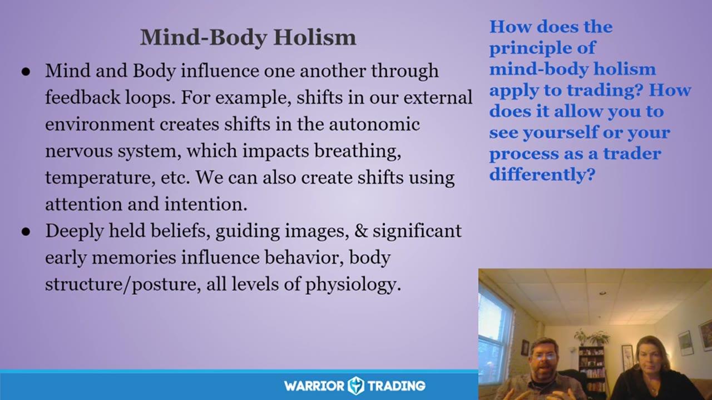

**图怎么看：**

- 通过自我研究，理解情绪模式，接受内在冲突，以提高交易表现。
- Mind and Body influence one another through feedback loops. For example, shifts in our external environment creates shifts in the autonomic nervous system, which impacts breathing, temperature, etc. We can also create shifts using attention and intention.
- Deeply held beliefs, guiding images, & significant early memories influence behavior, body structure/posture, all levels of physiology.

### 关键内容

- 通过有机性原则，理解生活系统如何组织自身。
- 通过正念原则，理解意识与身体的整体关系。
- 通过赞助原则，理解自我接纳与引导。
- 通过多视角原则，理解从不同角度看待交易。
- 通过资源原则，理解利用内外资源的重要性。
- 通过正念练习，理解如何在交易中保持专注。
- 通过有机性原则，理解情绪与身体的互动。
- 通过正念练习，理解如何识别和命名情绪。
- 通过赞助原则，理解如何自我接纳。
- 通过多视角原则，理解如何从不同角度看待交易

### 分析与执行顺序

1. 首先，通过诗歌引入自我研究的主题。
2. 然后，进行冥想练习，帮助参与者放松。
3. 接着，讲解有机性原则，理解生活系统的组织。
4. 再者，介绍正念原则，理解意识与身体的整体关系。
5. 之后，讲解赞助原则，理解自我接纳与引导。
6. 最后，总结多视角原则，理解从不同角度看待交易
7. 通过提问，鼓励参与者分享自己的体验和困惑

### 案例与细节

- 参与者提到，他们正在经历交易中的无聊感，有时会因为等待正确的交易机会而感到焦虑。
- 讲师提到，正念练习可以帮助参与者更好地识别和命名情绪，从而更好地管理情绪。
- 参与者分享了自己在交易中遇到的挑战，如如何克服内心的恐惧和不确定性。
- 讲师举例说明，通过正念练习，可以更好地理解市场动态，并做出更明智的决策。
- 参与者提到，他们希望在交易中保持正念，以便更好地应对市场波动和情绪变化

### 风险与边界

- 正念练习可能对某些人来说难以坚持，需要持续练习。
- 有机性原则可能难以完全理解，需要更多实际案例来解释。
- 赞助原则可能需要更多具体情境来帮助参与者更好地理解。
- 正念练习的效果可能因个人差异而异，需要根据个人情况调整练习方法。
- 多视角原则的应用可能受限于个人经验，需要更多实际操作来验证

### 复盘问题

- 正念练习的具体步骤是什么？
- 有机性原则如何帮助理解情绪与身体的互动？
- 赞助原则如何帮助自我接纳？
- 多视角原则如何帮助从不同角度看待交易？

---

## v0942：资源状态的心理学

> 日期：2020-01-10　·　时长：00:59:28

**本场重点：** 通过心理练习和资源状态来提升交易心理，强调自我接纳和内在资源的重要性。

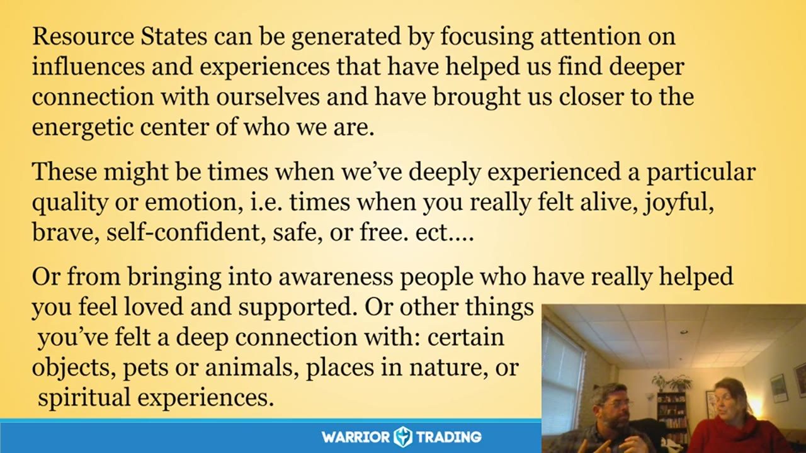

**图怎么看：**

- 这张图片展示了一个关于资源状态的心理学主题的幻灯片。
- 幻灯片上显示了两个参与者的对话场景，背景是一个室内环境。
- 幻灯片上方的文字描述了资源状态的概念，强调通过关注对自己有帮助的经历和影响来找到与自己更深的连接。
- 幻灯片下方的文字进一步解释了资源状态的来源，包括深刻体验特定品质或情绪的时间，以及对被爱和支持的人或事物的意识。

### 关键内容

- 资源状态是指帮助我们连接自己并保持在最积极和有益品质中的意识状态。
- 通过资源状态，我们可以感到更自信和有能力，更平静和更舒适。
- 资源状态有助于进入和维持与创造性流动的连接。
- 通过练习和创造仪式，可以将这些状态带入交易空间。
- 资源状态可以是情感和心理体验，如勇气、自我信心、专注、耐心和自我同情。
- 通过接受自己的不足和抵抗，可以促进更资源丰富的内部环境。
- 通过冥想和练习，可以培养内在的灵活性和适应性。

### 分析与执行顺序

1. 首先，通过诗歌和冥想引导参与者回归中心状态。
2. 然后，讨论资源状态的概念及其对交易的影响。
3. 接着，分享个人经历，如滑雪和划船时的状态。
4. 进一步，讨论如何将这些状态带入交易空间。
5. 最后，通过反思和练习，帮助参与者更好地理解自己在交易中的表现

### 案例与细节

- 在一次滑雪时，通过把手放在桨上，能够进入一种深度连接的状态，从而进入流态。
- 在冥想中，把手放在键盘上，可以作为进入交易状态的仪式。
- 通过反思和练习，可以识别出哪些品质容易进入，哪些品质难以进入。
- 通过反思他人对自己的欣赏，可以增强自我接纳。
- 通过练习和反思，可以更好地理解自己在交易中的表现

### 风险与边界

- 录制年代限制，此内容适用于2020年的市场环境。
- 心理练习可能不适合所有参与者，特别是那些有严重心理问题的人。
- 自我接纳的过程需要时间和持续的努力。
- 市场环境的变化可能会影响资源状态的效果

### 复盘问题

- 在冥想过程中，哪些品质最容易进入你的意识？
- 你如何将这些资源状态带入交易空间？
- 通过反思他人对自己的欣赏，你如何更好地理解自己？
- 在交易中，哪些品质是你最难进入的？
- 你如何通过练习和反思来改善自己在交易中的表现？

---

## v0943：自我领导力在交易中的应用

> 日期：2020-01-17　·　时长：01:08:25

**本场重点：** 通过自我领导力，可以更好地管理情绪和内在冲突，从而提高交易表现。

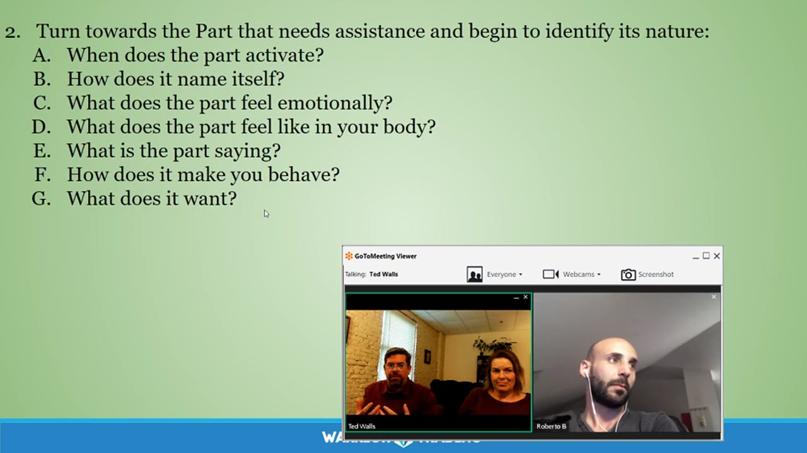

**图怎么看：**

- 通过自我领导力，可以更好地管理情绪和内在冲突，从而提高交易表现。
- 自我能量和自我领导力被标记为8-C：冷静、好奇心、清晰、同情心、自信、创造力、勇气和连接性。
- 自我领导力的核心是区分不同的部分并成为积极、富有同情心的领导者。
- 自我领导力要求识别需要帮助的部分及其本质，包括其激活时间、情感体验、身体感受等。

### 关键内容

- 交易中常见的情绪和内在冲突会影响决策。
- 通过自我领导力，可以更好地理解并管理这些情绪。
- 自我领导力的核心是培养自我意识和同理心。
- 通过冥想练习，可以增强自我领导能力。
- 内在冲突如保护者和被保护者需要被理解和接纳。
- 自我领导力有助于在交易中保持冷静和清晰。
- 通过练习，可以逐步建立自我领导的习惯。
- 自我领导力需要时间和持续的努力。
- 自我领导力有助于克服交易中的恐惧和不确定性。
- 自我领导力是长期成功的基石

### 分析与执行顺序

1. 首先，介绍自我领导力的概念及其重要性。
2. 然后，通过冥想练习来增强自我领导能力。
3. 接着，讨论内在冲突如保护者和被保护者的角色。
4. 进一步，解释如何通过自我领导力来管理情绪。
5. 最后，强调自我领导力在交易中的实际应用和长期价值

### 案例与细节

- Kyle提到，他发现很难在推动自己进步的同时，不让压力阻碍自己的成长。
- Diane分享了Pema Chodron的一句话：“你就是天空，其他的一切都是天气。”
- Roberto提到了一个内在冲突，即一个驱动他前进的部分和一个让他疯狂的部分。
- James提到，他发现自己难以平衡推动自己进步的压力和不让自己被压力所困。
- Angela提到，她意识到自己在思考他人时感到悲伤，这提醒了她珍惜每一个当下

### 风险与边界

- 录制于2020年，部分信息可能不再适用。
- 市场环境和心理状态会随时间变化，需灵活调整策略。
- 自我领导力的实践需要时间和持续的努力，短期内可能看不到明显效果。
- 交易中的情绪波动和内在冲突复杂多变，需要不断学习和适应

### 复盘问题

- 在交易中，哪些情绪和内在冲突最常影响你的决策？
- 你如何通过自我领导力来管理这些情绪和内在冲突？
- 你是否定期进行冥想练习以增强自我领导能力？

---

## v0944：交易与人际关系的影响

> 日期：2020-01-24　·　时长：00:58:26

**本场重点：** 交易可能影响个人关系，反之亦然。识别和处理这些情感冲突是关键。

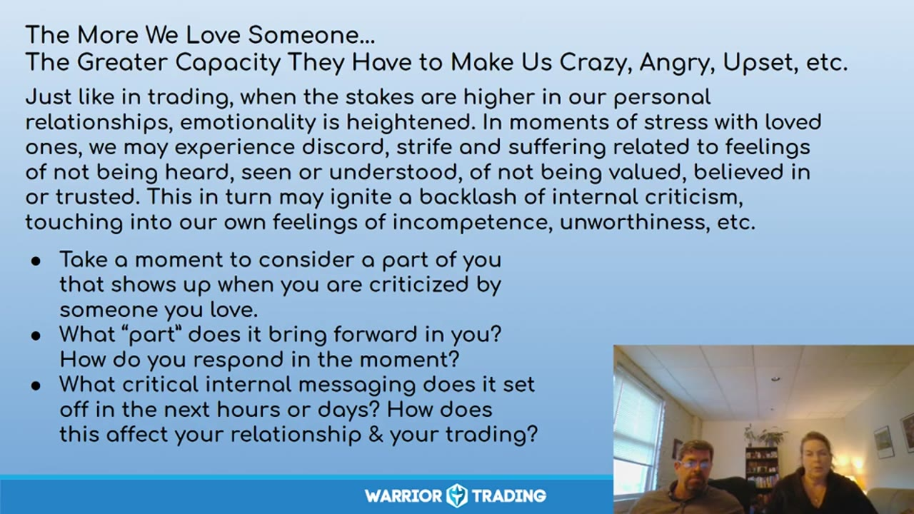

**图怎么看：**

- 这张幻灯片详细描述了在亲密关系中，当爱意加深时，人们可能会经历的情绪波动和冲突。
- 它强调了在交易中，当涉及高风险的投资决策时，情绪会变得更加激烈。
- 幻灯片还提到了在亲密关系中的压力和冲突，以及这些冲突如何引发内部批评和自我怀疑。
- 最后，幻灯片提出了一个思考问题，帮助人们理解自己在被爱人批评时的心理反应及其对关系和交易的影响。

### 关键内容

- 伴侣的批评可能引发深层次的情感反应，如羞愧和自我怀疑。
- 伴侣的批评可能加剧交易中的负面情绪。

### 分析与执行顺序

1. 首先，识别交易中的情感冲突来源。
2. 其次，通过自我反思和冥想来识别自己的情感反应模式。
3. 第三，练习自我同情，以减轻负面情绪。
4. 第四，与伴侣沟通，理解他们的批评背后的意图。
5. 第五，记录自己的情感反应，以便更好地理解和管理它们。

### 案例与细节

- 当交易者经历失败时，他们可能会感到被批评，进而产生防御性反应。
- 一位交易者提到，他的父亲在一次交易后批评他，这让他感到非常沮丧。
- 另一位交易者表示，他的妻子经常批评他缺乏纪律，这让他感到很难改变。
- 交易者在经历交易损失后，会感到被批评，进而产生防御性反应。
- 一位交易者分享，当他的母亲批评他时，他感到非常受伤，这让他在交易中更加谨慎。

### 风险与边界

- 交易中的情感冲突可能源于对失败的恐惧，以及对支持者的依赖。
- 识别和处理这些情感冲突有助于提高交易表现。
- 交易者可能会因为批评而感到被攻击，从而产生防御性反应。
- 伴侣的批评可能加剧交易中的负面情绪。
- 通过练习自我同情和理解，可以减轻这些负面情绪。
- 交易者需要认识到自己的情感反应模式，并尝试改变。

### 复盘问题

- 交易中的情感冲突主要来源于哪些方面？
- 如何通过自我反思和冥想来识别自己的情感反应模式？
- 在交易中遇到批评时，如何保持冷静并进行自我同情？
- 如何与伴侣沟通，理解他们的批评背后的意图？

---

## v0945：情绪与交易决策

> 日期：2020-01-31　·　时长：00:55:05

**本场重点：** 情绪驱动的交易决策会偏离中心，影响交易表现。因此，保持冷静和理性是关键。

**图怎么看：**

- 整体界面显示了一个视频会议窗口，左侧是一个用户界面，右侧是两个参与者的视频。
- 可见信息：没有明显的金融数据或图表。
- 与本场关系：该截图展示了交易者如何通过视频会议讨论情绪对交易决策的影响，符合本场主题。
- 阅读边界：无法从截图中直接得出具体的交易策略或市场分析结论。

### 关键内容

- 情绪波动会影响交易决策，导致偏离中心。
- 保持冷静和理性有助于更好地执行交易策略。
- 交易者需要识别并管理自己的情绪，以提高交易表现。
- 情绪压力可能带来积极影响，但也可能导致错误决策。
- 交易者应定期检查自己的情绪状态，确保决策基于理性而非情绪。
- 交易者需要建立正确的交易心态，避免过度自信或自卑。
- 交易者应关注自己的情绪变化，及时调整交易策略。
- 交易者应学会从错误中吸取教训，而不是自我责备。
- 交易者需要培养自我反省的习惯，以提高交易技能

### 分析与执行顺序

1. 讲师首先引用Stephen Gilligan的名言，强调决策时应考虑是否接近内心中心。
2. 讲师通过Selena的反馈，进一步探讨情绪如何影响交易决策。
3. 讲师指出情绪波动可能导致交易者偏离中心，影响交易表现。
4. 讲师建议交易者在早晨进行自我反省，以保持情绪平衡。
5. 讲师分享了Selena的经验，强调情绪压力可能带来的积极影响，但同时也可能导致错误决策。
6. 讲师强调交易者需要识别并管理自己的情绪，以提高交易表现。
7. 讲师建议交易者定期检查自己的情绪状态，确保决策基于理性而非情绪。
8. 讲师鼓励交易者从错误中吸取教训，而不是自我责备

### 案例与细节

- 讲师提到David在30分钟后感到情绪疲惫，这反映了情绪波动对交易的影响。
- Selena分享了她面对压力和自我期望的经历，说明情绪如何影响交易决策。
- 讲师提到交易者需要定期检查自己的情绪状态，以保持情绪平衡。
- Selena提到她在刚开始交易时感受到巨大的压力，这反映了情绪如何影响初学者。
- 讲师提到交易者需要从错误中吸取教训，而不是自我责备，以提高交易表现。
- Selena分享了她在交易过程中遇到的压力和自我期望，说明情绪如何影响交易决策

### 风险与边界

- 录制年代限制，交易环境和市场条件已发生变化。
- 情绪波动对交易的影响因人而异，需结合个人情况灵活应对。
- 交易者需要根据当前市场环境调整策略，避免盲目跟随。
- 情绪管理技巧需要持续练习，才能在实际交易中发挥作用。
- 交易者需要关注市场变化，及时调整交易策略，避免情绪波动影响决策

### 复盘问题

- 交易者在交易前是否进行了情绪检查？
- 交易者如何处理连续亏损的情况？
- 交易者如何保持情绪平衡，避免过度自信或自卑？
- 交易者如何从错误中吸取教训，而不是自我责备？
- 交易者如何在日常生活中培养情绪管理的习惯？

---

## v0946：情绪交易的心理学

> 日期：2020-02-07　·　时长：01:01:25

**本场重点：** 情绪交易是交易者在面对强烈情绪时做出非理性决策的过程，这可能导致交易失败。但通过练习和自我反思，可以减少这种影响。

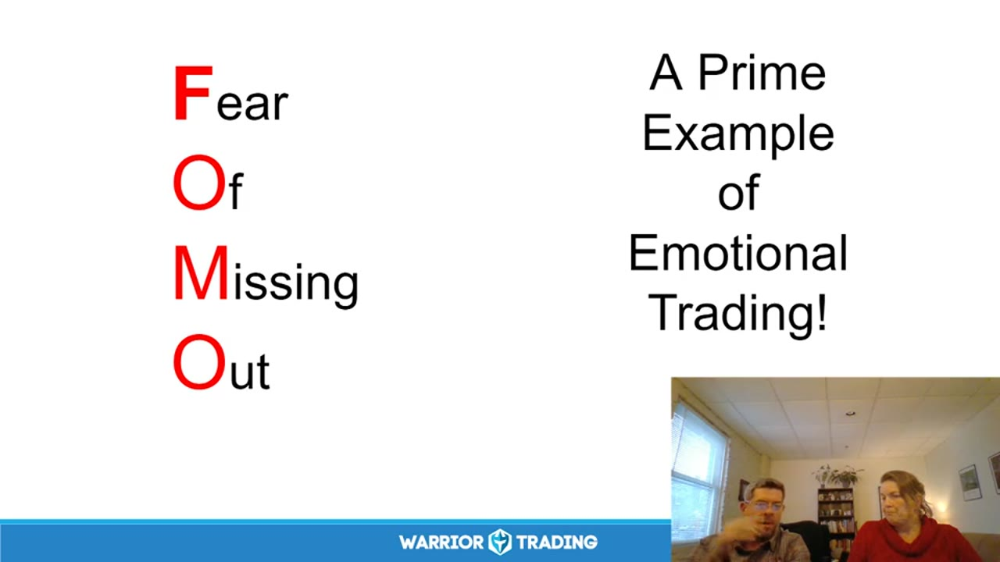

**图怎么看：**

- 这张幻灯片详细描述了情绪交易的三个阶段：高度关注、情绪交易和情绪劫持。
- 高度关注阶段：交易者的注意力被高度集中，情绪开始发挥作用，导致焦虑增加。
- 情绪交易阶段：强烈的负面情绪和不合理的信念控制了交易者的思维过程，导致决策失误。
- 情绪劫持阶段：交易者的情绪和负面信念完全控制了他们的思考和决策，可能导致不理智的行为。

### 关键内容

- 情绪交易涉及强烈的情感反应，如焦虑、冲动、自我怀疑和过度自信。
- 交易决策受到多种因素的影响，包括情绪、过去的经验和潜意识信念。
- 呼吸练习可以帮助交易者调节情绪，保持冷静。
- 通过自我反思和接受当前现实，可以减少情绪交易的影响。
- 交易者需要培养耐心等品质，以应对市场波动。
- 情绪交易可能导致决策失误，甚至带来负面后果。
- 通过练习和自我反思，可以逐步减少情绪交易的影响。
- 交易者需要认识到情绪只是交易体验的一部分，而非决定一切的因素

### 分析与执行顺序

1. 首先，通过诗歌引导参与者进入情绪体验。
2. 然后，进行冥想练习，帮助参与者放松并关注呼吸。
3. 接着，分享情绪交易的具体例子，如过度自信导致的错误。
4. 最后，介绍呼吸练习方法，帮助交易者调节情绪。
5. 在整个过程中，强调自我反思和接受当前现实的重要性

### 案例与细节

- 一个交易者在看到市场走势不利时，产生了强烈的恐惧感，导致他做出了错误的交易决策。
- 另一个交易者在面对市场波动时，感到焦虑和不确定，最终导致了亏损。
- 一位交易者在交易时过于自信，试图强行控制市场走向，结果反而导致了更大的损失
- 一位交易者在交易前进行了深呼吸练习，帮助自己保持冷静，最终做出了正确的决策
- 一位交易者在交易后反思自己的情绪反应，意识到情绪只是交易的一部分，不应完全依赖它

### 风险与边界

- 情绪交易可能在市场波动较大时加剧，导致决策失误。
- 过度依赖呼吸练习可能无法完全消除情绪的影响。
- 录制年代限制，现代交易环境可能与当时有所不同。
- 情绪交易的风险在于决策的不可预测性，可能导致资金损失

### 复盘问题

- 在交易前，你如何调节自己的情绪？
- 你认为哪些情绪最常影响你的交易决策？
- 你如何在交易中保持冷静和专注？
- 你是否尝试过通过自我反思来减少情绪交易的影响？
- 你如何平衡积极和消极的情绪，以更好地应对市场波动？

---

## v0947：情绪管理与交易心理

> 日期：2020-02-14　·　时长：01:02:11

**本场重点：** 情绪管理是交易成功的关键，通过自我反思和冥想可以改善交易心态。

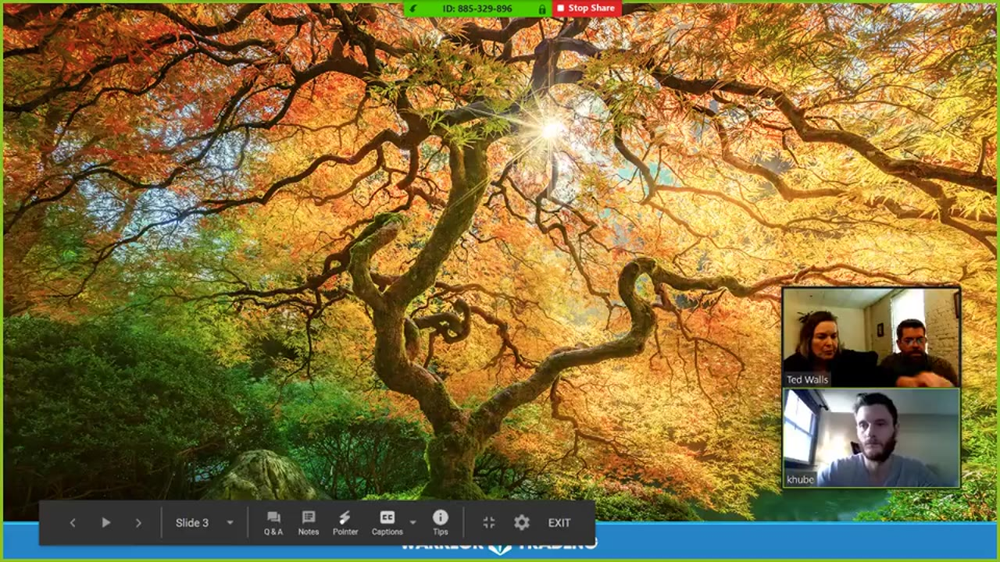

**图怎么看：**

- 这张图片展示了一个自然景观，背景是一棵大树，树叶呈现出秋天的色彩，阳光透过树叶洒下，营造出一种宁静和谐的氛围。
- 图片右上角有两个小窗口，显示了两位参与者正在进行视频会议。
- 图片左下角有一个蓝色的横幅，上面写着'WARRIOR TRADING'，可能表明这是一个与交易相关的主题。
- 整体画面结合了自然美景和交易心理的主题，有助于传达情绪管理和交易心态的重要性。

### 关键内容

- Kyle因生病错过了交易日，导致情绪波动较大。
- 交易中情绪管理的重要性在于保持冷静和理性。
- 通过冥想可以更好地理解自己的情绪反应。
- 交易者需要识别并接纳自己的不同情绪。
- 情绪管理有助于减少交易中的冲动行为。
- 长期交易中情绪管理可以提高交易技能。
- 情绪管理需要时间和耐心，不能急于求成。
- 交易者应学会接受失败并从中学习。
- 情绪管理是交易成功的重要因素之一
- Kyle提到自己在交易中经常感到焦虑和压力，这表明情绪管理对于应对这些负面情绪至关重要。
- 通过冥想，Kyle开始更加关注自己的呼吸和情绪变化，这有助于他更好地控制情绪反应，从而减少冲动交易。
- Kyle分享了自己如何在交易中遇到挫折后继续前进的经验，这说明情绪管理能够帮助他在面对失败时保持冷静。
- 情绪管理需要时间和耐心，Kyle的经历表明，即使在初期可能效果不明显，但长期坚持会逐渐改善交易心态。
- 交易者需要识别并接纳自己的不同情绪，例如焦虑和恐惧，这有助于他们更好地理解自己的心理状态，从而做出更合理的决策

### 分析与执行顺序

1. 首先，Kyle分享了自己因生病错过交易日的经历。
2. 然后，通过冥想帮助Kyle识别和接纳自己的情绪。
3. 接着，引导Kyle观察自己情绪反应的具体部位。
4. 进一步，鼓励Kyle对情绪反应进行自我反思。
5. 最后，总结情绪管理在交易中的重要性，并给出建议

### 案例与细节

- Kyle提到自己因生病错过了交易日，导致情绪波动较大。
- 在冥想过程中，Kyle注意到自己身体某些部位的紧张感。
- Kyle分享了自己如何在交易中遇到挫折后继续前进的经验。
- 通过冥想，Kyle开始更加关注自己的呼吸和情绪变化。
- Kyle表示自己在交易中经常感到焦虑和压力
- 在一次交易中，Kyle注意到自己在亏损后变得非常焦虑，甚至在第二天的交易中也表现得不够冷静，这说明情绪管理对于控制交易情绪至关重要。
- 通过冥想，Kyle能够更好地理解自己的情绪反应，例如在交易中感到紧张时，他会深呼吸来缓解这种感觉，这表明冥想有助于他更好地管理情绪。
- 在一次模拟交易中，Kyle发现自己在连续几天亏损后变得非常沮丧，但在接下来的一周里，他通过调整心态，最终实现了盈利，这说明情绪管理能够帮助他在面对失败时保持积极态度

### 风险与边界

- 录制年代限制，交易环境和心理策略可能有所变化。
- 情绪管理的效果因人而异，需持续实践。
- 交易市场波动可能导致情绪波动加剧。
- 过度依赖情绪管理可能忽视技术分析的重要性
- 如果过度依赖情绪管理而忽视技术分析，可能会导致交易决策失误，尤其是在市场波动较大时，情绪管理的效果可能会减弱。
- 情绪管理的效果因人而异，有些人可能需要更长时间才能看到明显的变化，这可能导致一些交易者失去信心，从而放弃尝试。
- 录制年代限制，交易环境和心理策略可能有所变化，因此在实际操作中需要根据当前市场情况灵活调整情绪管理的方法

### 复盘问题

- Kyle在交易中遇到的主要情绪是什么？
- 冥想如何帮助Kyle更好地理解自己的情绪？
- 情绪管理在交易中的具体应用有哪些？

---

## v0948：交易心理与学习目标

> 日期：2020-02-21　·　时长：01:00:34

**本场重点：** 交易中保持清晰思维的重要性，以及如何通过自我反思和慈悲心态来提高交易技能。

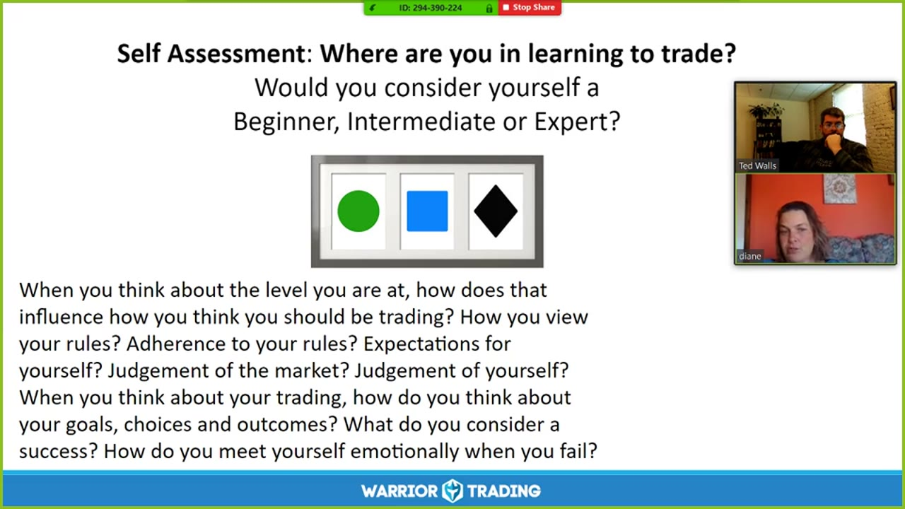

**图怎么看：**

- 这张图片展示了交易课程中的一个自我评估环节，帮助学员确定自己的交易水平。
- 图片中包含了一个关于交易水平的自评问题，询问学员是否认为自己是一名初学者、中级投资者还是专家。
- 此外，图片还提供了关于交易水平对交易决策、规则遵守、市场判断和个人期望的影响的详细描述。
- 这些内容有助于学员更好地理解自己的交易状态，并据此调整交易策略和心态。

### 关键内容

- Ted提到自己滑雪受伤后，现在更加注重交易中的心理状态。
- 交易中保持清晰思维有助于更好地理解市场和自己的交易策略。
- 通过冥想练习可以提高交易者的专注力和自我反思能力。
- 交易者需要区分学习阶段的目标和实际交易的目标。
- 保持慈悲心态可以帮助交易者更好地应对失败和挫折。
- 交易者应该认识到自己的水平，并据此调整交易策略。
- 在交易过程中保持自我反思和慈悲心态可以减少情绪波动。
- 交易者应该学会从错误中吸取教训，而不是过度批评自己。
- 交易者需要区分专家和新手的心态，以避免过度自信或自卑。
- 交易者应该学会在不同阶段调整自己的心态，以适应市场的变化

### 分析与执行顺序

1. Ted介绍了自己滑雪受伤的经历，强调了保持清晰思维的重要性。
2. 他解释了冥想练习如何帮助交易者提高专注力和自我反思能力。
3. Ted讨论了交易中的心理状态，包括如何区分学习阶段的目标和实际交易的目标。
4. 他强调了保持慈悲心态的重要性，以帮助交易者更好地应对失败和挫折。
5. Ted分享了如何通过自我反思和慈悲心态来提高交易技能的方法。
6. 他提到了保持慈悲心态可以帮助交易者减少情绪波动，更好地应对市场变化。
7. Ted强调了交易者应该学会从错误中吸取教训，而不是过度批评自己。

### 案例与细节

- Ted提到自己滑雪时从六到八英尺高的悬崖上摔下，导致脑震荡。
- 他分享了一个关于洗碗的比喻，说明了做事情的目的不仅仅是完成任务。
- Ted提到了一个关于洗碗的比喻，说明了做事情的目的不仅仅是完成任务。

### 风险与边界

- 录制于2020年，当时的市场环境和交易规则可能已发生变化。
- 交易者需要根据当前的市场情况和规则来调整自己的交易策略。
- 保持慈悲心态可以帮助交易者减少情绪波动，但过度宽容可能导致决策失误。
- 交易者需要学会区分专家和新手的心态，以避免过度自信或自卑。

### 复盘问题

- 交易者在学习阶段应该关注哪些关键点？
- 如何通过自我反思和慈悲心态来提高交易技能？
- 交易者在实际交易中应该如何调整自己的心态？

---

## v0949：面对市场波动的心理调适

> 日期：2020-02-28　·　时长：01:01:41

**本场重点：** 面对市场波动，需要调整心态，保持冷静，避免冲动决策。

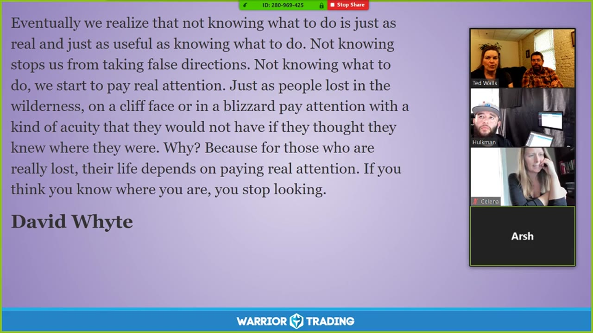

**图怎么看：**

- 这张幻灯片提供了关于如何在面对市场波动时调整心态和保持冷静的重要信息。
- 幻灯片上引用了David Whyte的观点，强调了在不确定性和恐惧面前，我们如何处理困难、情绪和日常生活中不可预测的遭遇。
- 幻灯片还提到了痛苦的情绪是提醒我们注意自己正在做什么，而不是逃避。
- 通过这些信息，可以更好地理解如何在市场波动中保持冷静和理智，避免冲动决策。

### 关键内容

- 市场波动导致恐惧和不确定性增加，影响决策。
- 通过冥想可以缓解情绪，帮助回归平静。
- 面对市场变化，需要调整策略，保持灵活性。
- 长期市场波动可能导致策略失效，需灵活调整。
- 保持自我认知，接受当前市场环境的变化。
- 利用模拟交易环境进行策略调整，避免直接交易。
- 市场波动期间，保持耐心和学习态度。
- 长期市场经验有助于适应市场变化，提高应对能力。
- 面对市场波动，需要保持冷静，避免冲动决策。
- 通过练习和反思，逐步提升应对市场波动的能力

### 分析与执行顺序

1. 主持人介绍本周市场波动情况，引发讨论。
2. 分享冥想方法，帮助参与者缓解情绪，回归平静。
3. 讨论如何在市场波动中调整策略，保持灵活性。
4. 分享个人经验，强调长期市场经验的重要性。
5. 讨论如何利用模拟交易环境进行策略调整，避免直接交易。
6. 总结市场波动期间的心态调整方法，强调保持冷静和耐心的重要性

### 案例与细节

- 市场波动导致许多交易者感到恐惧和不确定，影响了他们的决策。
- 一位交易者提到，他因为不想承认损失而延迟关闭亏损的交易，导致账户受损。
- 另一位交易者表示，他通过瑜伽、冥想和反思来调整自己的心态。
- 市场波动期间，一位交易者发现他的趋势跟踪策略不再有效，需要调整策略。
- 一位交易者提到，他通过观察市场动态的变化，调整了自己的交易策略，以适应新的市场环境

### 风险与边界

- 市场波动具有不确定性，无法预测何时会恢复正常。
- 长期市场波动可能导致某些交易策略失效，需灵活调整。
- 市场波动期间，情绪管理尤为重要，否则可能做出冲动决策。
- 录制年代限制为2020年，当前市场环境可能已发生变化。
- 模拟交易环境虽然有助于策略调整，但实际交易中仍需谨慎

### 复盘问题

- 在市场波动期间，哪些策略可以帮助交易者保持冷静？
- 如何通过模拟交易环境进行策略调整，避免直接交易？
- 面对市场波动，交易者应该采取哪些具体措施来调整心态？

---

## v0950：决策与多重自我

> 日期：2020-03-06　·　时长：01:00:14

**本场重点：** 决策往往不由理性推敲，而是由快速冲动驱动，这揭示了决策过程中的复杂性。

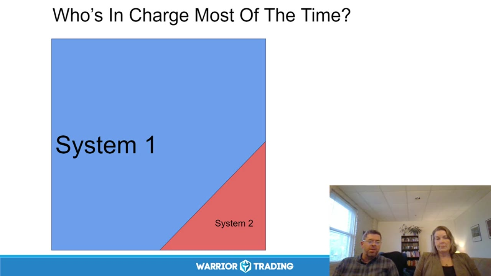

**图怎么看：**

- 这张幻灯片通过一个图表展示了决策过程中两个系统的作用。
- System 1（蓝色部分）代表快速、冲动且情绪化的决策过程。
- System 2（红色部分）代表缓慢、深思熟虑且逻辑性的决策过程。
- 决策往往不由理性推敲，而是由快速冲动驱动，这揭示了决策过程中的复杂性。

### 关键内容

- 决策通常不由理性推敲，而是由快速冲动驱动。
- 系统一和系统二分别代表快速自动和慢速逻辑思考。
- 系统一通常与情绪驱动的行为相关，而系统二则与逻辑推理相关。
- 系统一占据我们大部分时间，因为它帮助我们完成日常任务。
- 系统二在处理复杂计算和元认知时更为有效。
- 了解系统一和系统二有助于更好地管理情绪和决策。
- 多重自我理论强调个体内部存在多个维度或部分。
- 这些部分通常与特定情感相关，如愤怒、悲伤等。
- 通过识别和理解这些部分，可以更好地管理情绪和决策

### 分析与执行顺序

1. 首先介绍了多重自我理论，强调个体内部存在多个维度或部分。
2. 接着解释了系统一和系统二的概念，分别代表快速自动和慢速逻辑思考。
3. 然后讨论了系统一和系统二在决策过程中的不同作用。
4. 最后通过实例展示了如何识别和理解这些内部部分以更好地管理情绪和决策。
5. 在整个过程中，强调了通过识别和理解内部部分来更好地管理情绪和决策的重要性

### 案例与细节

- 系统一和系统二的概念被用来解释决策过程中的快速冲动和逻辑思考。
- 通过实例展示了如何识别和理解内部部分，如愤怒、悲伤等。
- 讨论了如何通过识别和理解这些内部部分来更好地管理情绪和决策。
- 通过实例展示了如何通过识别和理解内部部分来更好地管理情绪和决策。

### 风险与边界

- 录制于2020年，市场环境和监管规则可能已发生变化。
- 系统一和系统二的概念适用于一般决策过程，但具体应用可能因情境而异。
- 多重自我理论强调个体内部存在多个维度或部分，但实际应用可能因人而异

### 复盘问题

- 系统一和系统二分别代表什么？它们在决策过程中如何发挥作用？
- 多重自我理论如何帮助我们更好地理解自己的情绪和决策过程？
- 如何通过识别和理解内部部分来更好地管理情绪和决策？

---

## v0951：情绪管理在交易中的应用

> 日期：2020-03-13　·　时长：01:01:39

**本场重点：** 交易中情绪波动的管理，通过自我同情和正念练习来应对恐惧和愤怒。

**图怎么看：**

- 这张截图显示了交易课程候选人之一的视频会议界面。
- 背景是一棵色彩斑斓的树，象征着自然与交易的联系。
- 右上角有两个小窗口，显示了两位演讲者。
- 下方有一个蓝色横幅，上面写着 'WARRIOR TRADING'，表明这是交易课程的一部分。

### 关键内容

- Michelle有金融背景，曾从事股票交易和财务顾问工作。
- 她决定离开公司环境是因为压力大，开始自学交易。
- 交易中出现恐惧和愤怒的情绪，特别是市场波动时。
- 通过正念练习和自我同情，可以更好地管理这些情绪。
- 恐惧和愤怒源于对未来的不确定性和自我保护。
- 拥抱自己的脆弱性，接受恐惧和愤怒，是克服这些情绪的关键。
- 正念练习有助于减缓情绪反应，提高自我领导能力。
- 交易中需要灵活地调整策略，适应市场变化。
- 通过正念练习，可以更好地理解自己的情绪，找到内心的平衡
- 恐惧和愤怒源于对未来的不确定性和自我保护，这使得交易者在面对市场波动时容易产生过度反应。
- 通过正念练习和自我同情，可以更好地管理这些情绪，从而减少决策过程中的冲动行为。
- 拥抱自己的脆弱性，接受恐惧和愤怒，是克服这些情绪的关键，因为这有助于建立内在的韧性。
- 正念练习有助于减缓情绪反应，提高自我领导能力，使交易者能够更冷静地分析市场情况。
- 交易中需要灵活地调整策略，适应市场变化，这要求交易者具备高度的心理弹性，以应对不断变化的市场环境。

### 分析与执行顺序

1. 介绍交易心理学团队和FOMO Friday的主题。
2. Michelle介绍了她的背景和交易经验。
3. 讨论交易中出现的恐惧和愤怒情绪。
4. 分享一个关于拥抱故事的引言，鼓励接纳脆弱性。
5. 进行正念冥想练习，帮助缓解情绪紧张。
6. 讨论如何通过正念练习和自我同情来管理情绪

### 案例与细节

- Michelle提到她曾是一名股票经纪人，后来决定成为一名全职交易员。
- 她描述了最近市场波动带来的恐惧和愤怒情绪。
- 通过正念练习，她感到肩膀放松，紧张感减轻。
- 她分享了自己在交易中遇到的挑战和如何应对的方法。
- 她提到自己在交易中感到压力，担心市场进一步下跌
- Michelle提到她曾担心市场进一步下跌，导致她关闭了部分仓位，这反映了交易者在面对不确定性时的自然反应。
- 通过正念练习，Michelle感到肩膀放松，紧张感减轻，这表明正念练习确实有助于缓解情绪紧张。
- Michelle分享了自己在交易中遇到的挑战，包括如何处理市场波动带来的恐惧和愤怒情绪，这说明正念练习和自我同情对于实际交易者来说至关重要。

### 风险与边界

- 录制于2020年，市场情况可能已发生变化。
- 正念练习的效果因人而异，需持续实践。
- 市场波动可能导致情绪波动加剧，需谨慎管理。
- 自我同情和正念练习需要时间和耐心，短期内效果有限
- 市场波动可能导致情绪波动加剧，如果交易者不能及时调整心态，可能会导致决策失误。
- 自我同情和正念练习需要时间和耐心，短期内效果有限，这要求交易者要有长期坚持的心理准备。
- 录制于2020年，市场情况可能已发生变化，交易者需要根据当前市场环境灵活调整策略。
- 正念练习的效果因人而异，需持续实践，否则可能无法有效缓解情绪紧张。

### 复盘问题

- 交易中遇到的恐惧和愤怒情绪是如何产生的？
- 如何通过正念练习来缓解这些情绪？
- 自我同情在情绪管理中扮演什么角色？

---

## v0952：FOMO Fridays - 初心者心态在市场波动中的应用

> 日期：2020-03-20　·　时长：01:07:02

**本场重点：** 在市场波动中保持初心者心态，有助于发现新的交易机会。

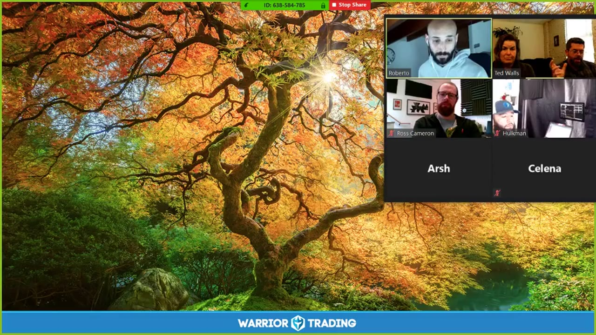

**图怎么看：**

- 在市场波动中保持初心者心态，有助于发现新的交易机会。
- 初心者心态是指在交易过程中，不带任何预设的预期和偏见。
- 这种心态使交易者能够更开放地接受新信息和可能性。
- 通过保持初心者心态，交易者可以更好地适应市场的变化和不确定性。

### 关键内容

- 市场波动导致交易者容易陷入惯性思维，而初心者心态能帮助重新审视市场。
- 专家心态往往局限在已知规则，而初心者心态能带来新的视角。
- 市场波动中，技术分析变得尤为重要，但初心者心态能帮助发现新的交易机会。
- 通过冥想练习，可以培养初心者心态，帮助交易者更好地应对市场变化。
- 市场波动中，情绪管理至关重要，而初心者心态能帮助保持冷静。
- 市场波动中，交易者需要灵活调整策略，而初心者心态能提供新的视角。
- 市场波动中，交易者需要保持开放心态，而初心者心态能帮助发现新的可能性。
- 市场波动中，交易者需要学会放下过去的预期，而初心者心态能帮助实现这一点。
- 市场波动中，交易者需要学会接受不确定性，而初心者心态能帮助找到内心的平静。
- 市场波动中，交易者需要学会自我反思，而初心者心态能帮助找到内心的平衡

### 分析与执行顺序

1. 首先，讨论了市场波动带来的挑战，强调了初心者心态的重要性。
2. 接着，分享了初学者心态的概念，强调了它对交易者的重要性。
3. 然后，通过具体的例子展示了如何应用初心者心态来发现新的交易机会。
4. 之后，介绍了冥想练习的方法，帮助交易者培养初心者心态。
5. 最后，总结了初心者心态在市场波动中的应用，强调了其重要性

### 案例与细节

- 市场波动中，技术分析变得尤为重要，但初心者心态能帮助发现新的交易机会。例如，当市场波动剧烈时，技术指标可能不再有效，而初心者心态能帮助交易者重新审视市场。
- 通过冥想练习，可以培养初心者心态。例如，在市场波动中，交易者可以通过冥想练习来清空自己的思绪，重新审视市场。
- 市场波动中，交易者需要学会放下过去的预期。例如，当市场波动剧烈时，交易者可能会发现之前的交易策略不再适用，而初心者心态能帮助他们重新审视市场，找到新的交易机会

### 风险与边界

- 市场波动中，交易者可能会过于依赖技术指标，而忽视初心者心态的重要性。
- 市场波动中，交易者可能会因为情绪波动而做出错误的决策，而初心者心态能帮助他们保持冷静。
- 市场波动中，交易者可能会因为过度关注市场波动而忽略其他重要的信息，而初心者心态能帮助他们保持全面的视角。
- 录制年代限制：此内容适用于2020年3月20日的市场环境，可能不适用于当前的市场环境

### 复盘问题

- 在市场波动中，你是如何应用初心者心态的？
- 在市场波动中，你是如何保持冷静的？
- 在市场波动中，你是如何重新审视市场并发现新的交易机会的？

---

## v0953：交易中的内心对话与自我领导

> 日期：2020-04-03　·　时长：01:09:38

**本场重点：** 交易者需要识别并理解内心的各个部分，以做出更明智的决策；通过自我领导，可以减少冲动交易带来的损失。

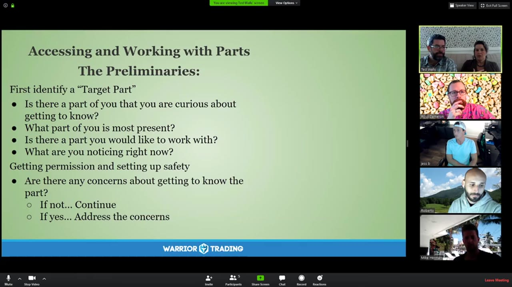

**图怎么看：**

- 这张幻灯片详细介绍了交易者如何识别并理解内心的各个部分，以做出更明智的决策。
- 幻灯片强调了自我领导的重要性，通过这种方式可以减少冲动交易带来的损失。
- 幻灯片提供了具体的步骤和建议，帮助交易者更好地理解和管理自己的内心部分。
- 这些内容对于提高交易者的决策能力和风险管理能力至关重要。

### 关键内容

- 交易者在市场开盘时遇到了技术问题，导致错过最佳交易时机。
- 通过自我领导，可以减少冲动交易带来的损失，提高交易成功率。
- 交易者可以通过冥想来更好地理解自己的内心世界，从而做出更明智的决策。
- 交易者需要认识到，某些规则一旦打破，可能会带来不可预知的后果。
- 交易者需要通过自我反思和记录来提高自己的交易技能，而不是仅仅关注盈利。
- 交易者需要学会区分短期情绪波动和长期交易策略之间的差异。

### 分析与执行顺序

1. Roberto分享了他在市场开盘时遇到的技术问题，导致错过最佳交易时机。
2. 交易者需要识别并理解内心的各个部分，如恐惧、贪婪等，以做出更明智的决策。
3. 通过冥想，交易者可以更好地理解自己的内心世界，从而做出更明智的决策。
4. 交易者需要学会区分哪些规则是必须遵守的，哪些是可以灵活处理的。
5. 交易者需要关注自己的情绪反应，避免因情绪驱动而做出错误的交易决策。
6. 交易者需要学会接受内心的各个部分，包括恐惧和贪婪，以更好地管理自己的情绪。

### 案例与细节

- Roberto在市场开盘时遇到了技术问题，导致他的交易平台Trading View冻结，错过了最佳交易时机。
- Jess在市场开盘时进行了IMAB的交易，但因为市场波动较大，最终导致亏损，这让她意识到冲动交易的风险。
- Mike分享了他在市场开盘前未遵循规则的情况，虽然当时没有造成重大损失，但他意识到这种行为可能在未来带来风险。
- 交易者在市场开盘时遇到了技术问题，导致错过最佳交易时机，这让他们意识到技术问题对交易的影响。
- 交易者通过冥想练习，学会了更好地理解自己的内心世界，从而做出更明智的决策。

### 风险与边界

- 技术问题可能导致交易者错过最佳交易时机，影响交易结果。
- 冲动交易可能导致交易者在市场波动较大时做出错误决策，增加亏损风险。
- 交易者需要学会区分哪些规则是必须遵守的，哪些是可以灵活处理的，否则可能会带来不可预知的后果。
- 交易者需要通过自我反思和记录来提高自己的交易技能，而不是仅仅关注盈利，否则可能会忽视重要的交易细节。
- 交易者需要学会区分短期情绪波动和长期交易策略之间的差异，否则可能会因为情绪驱动而做出错误的交易决策。

### 复盘问题

- 你在交易过程中遇到过哪些技术问题？如何应对这些技术问题？
- 你在交易过程中是否曾经因为情绪驱动而做出错误的交易决策？如何避免这种情况发生？
- 你在交易过程中是如何区分哪些规则是必须遵守的，哪些是可以灵活处理的？
- 你在交易过程中是如何通过冥想来更好地理解自己的内心世界的？
- 你在交易过程中是如何通过自我反思和记录来提高自己的交易技能的？

---

## v0954：冲动交易与等待优质机会

> 日期：2020-05-01　·　时长：01:01:39

**本场重点：** 冲动交易与等待优质机会是交易中常见的心理挑战，需要通过自我反思和情绪管理来克服。

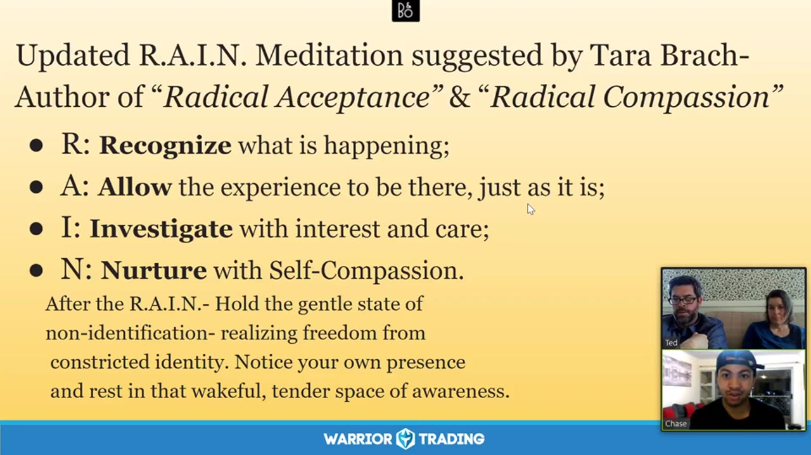

**图怎么看：**

- R: Recognize what is happening;
- A: Allow the experience to be there, just as it is;
- I: Investigate with interest and care;
- N: Nurture with Self-Compassion.

### 关键内容

- Chase在市场慢的时候会冲动交易，导致亏损。
- 快速决策和情绪反应是交易中常见的问题。
- 通过自我反思和情绪管理可以改善交易表现。
- 雨滴冥想是一种有效的自我反思工具。
- 情绪反应通常源于内心的批评。
- 自我接纳和自我同情是关键。
- 交易中需要培养勇气、温柔和玩心。
- Chase分享了他的经历，展示了真实的情感波动。
- 雨滴冥想帮助Chase识别和处理情绪反应
- Chase提到他在市场慢的时候会冲动交易，这表明情绪反应会影响交易决策，尤其是在缺乏明显机会时。因此，学会识别和管理这些情绪反应至关重要。
- 雨滴冥想帮助Chase识别和处理情绪反应，特别是自我怀疑和焦虑，这表明这种方法能够提供一种结构化的途径来面对和理解自己的情绪。
- 自我接纳和自我同情是关键，因为它们可以帮助Chase更好地接受自己的情绪反应，并以更加宽容的态度对待自己，从而减少交易中的冲动行为。
- 通过自我反思和情绪管理，Chase能够更好地理解自己的情绪反应，这有助于他在未来做出更理性的交易决策。
- Chase分享了他在交易中遇到的自我怀疑和恐惧，这说明情绪反应通常源于内心的批评，而自我接纳和自我同情可以帮助他克服这些负面情绪。

### 分析与执行顺序

1. Chase分享了他在市场慢的时候会冲动交易的问题。
2. 讨论了情绪反应如何影响交易决策。
3. 介绍了雨滴冥想作为一种自我反思工具。
4. 引导Chase进行雨滴冥想以识别和处理情绪反应。
5. Chase分享了冥想后的感受，包括情绪的变化和身体的放松

### 案例与细节

- Chase提到他在市场慢的时候会冲动交易，导致亏损。
- Chase描述了他在交易中感到焦虑和压力，特别是在慢市时。
- Chase分享了他如何通过自我反思来识别和处理情绪反应。
- Chase提到他如何通过雨滴冥想来缓解焦虑和压力。
- Chase描述了他在交易中遇到的自我怀疑和恐惧
- Chase描述了他在市场慢的时候会冲动交易，导致亏损，这表明情绪反应可能导致不理智的行为，尤其是在缺乏明显机会时。这种行为不仅会导致经济损失，还会进一步加剧情绪反应。
- Chase提到他在交易中感到焦虑和压力，特别是在慢市时，这说明情绪反应可能源于外部市场环境的变化，而自我反思和情绪管理可以帮助他更好地应对这些变化。
- Chase分享了他如何通过自我反思来识别和处理情绪反应，例如通过雨滴冥想来缓解焦虑和压力，这表明这种方法能够帮助他在实际交易中更好地控制自己的情绪。
- Chase描述了他在交易中遇到的自我怀疑和恐惧，这说明情绪反应通常源于内心的批评，而自我接纳和自我同情可以帮助他克服这些负面情绪，从而提高交易表现。
- Chase提到他在市场慢的时候会冲动交易，这表明情绪反应可能源于对市场不确定性的担忧，而自我接纳和自我同情可以帮助他更好地应对这种不确定性。

### 风险与边界

- 录制年代限制，此内容适用于2020年的市场环境。
- 情绪反应可能因市场变化而有所不同，需灵活应对。
- 自我反思和情绪管理需要持续练习，效果可能因人而异。
- 雨滴冥想可能对某些人更有效，需尝试不同的方法
- 录制年代限制，此内容适用于2020年的市场环境，因此在当前市场条件下，可能需要调整策略以适应新的市场动态。
- 情绪反应可能因市场变化而有所不同，需灵活应对，否则可能会导致交易决策失误，尤其是在市场波动较大时。
- 自我反思和情绪管理需要持续练习，效果可能因人而异，因此需要耐心和毅力才能看到显著改进。
- 雨滴冥想可能对某些人更有效，需尝试不同的方法，否则可能会发现这种方法并不适用于所有人，从而影响交易表现。

### 复盘问题

- Chase在市场慢的时候为什么会冲动交易？
- 雨滴冥想如何帮助Chase识别和处理情绪反应？
- 自我接纳和自我同情在交易中扮演什么角色？

---

## v0955：FOMO Fridays - 7 Radical Acceptance

> 日期：2020-05-08　·　时长：01:01:29

**本场重点：** FOMO Fridays 是关于交易心理的节目，重点在于接受现实，而不是逃避情绪反应。

**图怎么看：**

- 整体界面显示了一个宁静的峡谷景观，背景中有两个人在进行视频通话。
- 画面中有一段文字，引用了Tara Brach关于Radical Acceptance的定义。
- 这张截图展示了如何通过视觉和文字结合来传达交易心理学中的重要概念。
- 图片中的峡谷景观并不能单独证明交易心理的内容，但可以作为背景图像来增强视觉效果。

### 关键内容

- 讨论了接受现实的重要性，而不是逃避情绪反应。
- 分享了如何在遇到困难时保持冷静，接受事实。
- 强调了自我接纳和适应能力的重要性。
- 通过实例展示了如何在交易中应用接受原则。
- 解释了接受原则的具体操作方法，如自我观察和命名。
- 讨论了如何处理负面情绪和自我批评。
- 强调了适应变化和持续学习的重要性。
- 分享了如何通过冥想来培养接受能力。
- 讨论了如何在交易中应用接受原则，以减少情绪反应。
- 强调了接受原则的应用需要时间和耐心

### 分析与执行顺序

1. 首先，主持人介绍了接受原则的概念。
2. 然后，分享了如何在遇到交通堵塞时应用接受原则。
3. 接着，讨论了如何在交易中应用接受原则。
4. 之后，分享了一些具体的例子来说明接受原则的应用。
5. 最后，总结了接受原则的重要性，并鼓励观众实践这一原则

### 案例与细节

- 在交通堵塞的情况下，参与者容易陷入愤怒和沮丧的情绪，而接受原则可以帮助他们冷静下来，接受现实。
- 在交易中，当遇到不利情况时，参与者可能会感到失望和沮丧，而接受原则可以帮助他们接受现实，继续前进。
- 通过冥想练习，参与者可以更好地理解自己的情绪反应，并学会接受这些反应。
- 在交易中，当遇到挫折时，参与者可以通过接受原则来调整心态，继续进行交易。
- 通过接受原则，参与者可以更好地管理自己的情绪反应，从而提高交易表现

### 风险与边界

- 录制于 2020 年，部分信息可能不再适用。
- 接受原则的应用需要时间和耐心，短期内可能看不到明显效果。
- 在交易中应用接受原则需要结合实际情况灵活调整。
- 接受原则的应用需要结合个人情况，不同人可能有不同的体验

### 复盘问题

- 在交通堵塞的情况下，你是如何应用接受原则的？
- 在交易中遇到不利情况时，你是如何应用接受原则的？
- 通过冥想练习，你学到了什么？

---

## v0956：使用彻底接受与彻底同情释放情绪反应模式

> 日期：2020-05-22　·　时长：01:01:42

**本场重点：** 通过彻底接受与彻底同情，可以更好地处理交易中的情绪反应，提升交易表现。

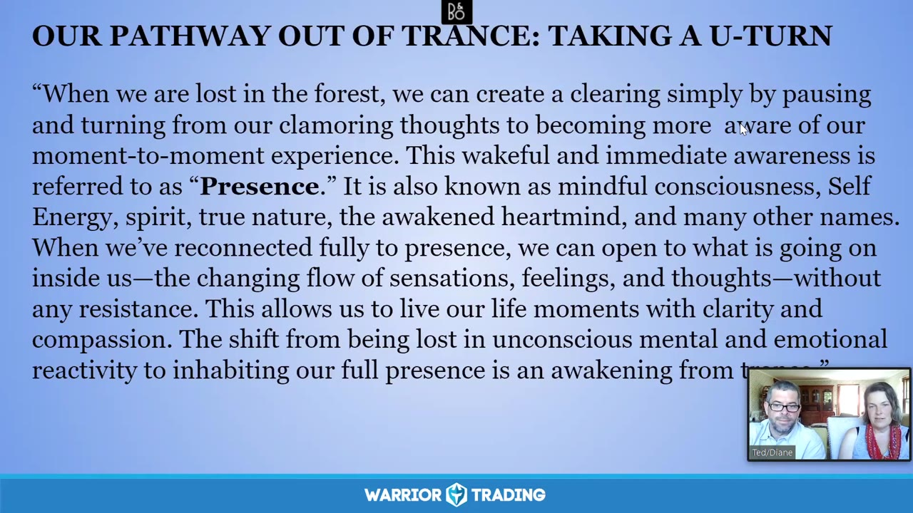

**图怎么看：**

- 通过彻底接受与彻底同情，可以更好地处理交易中的情绪反应，提升交易表现。
- 在交易过程中，学会接受自己的情绪反应，并以一种更加宽容和理解的态度去面对它们。
- 这种心态可以帮助交易者保持冷静和客观，从而做出更明智的决策。
- 通过这种方式，交易者可以在面对压力和挑战时保持稳定的心态，提高交易成功率。

### 关键内容

- 彻底接受可以帮助交易者更好地处理错误带来的心理冲击。
- 彻底接受与彻底同情是应对情绪反应的有效工具。
- 交易者需要识别并接受自己的情绪，而不是逃避它们。
- 彻底接受与彻底同情有助于交易者保持冷静，避免冲动决策。
- 彻底接受与彻底同情可以提高交易者的自我意识。
- 彻底接受与彻底同情有助于交易者从错误中学习，而不是陷入自责。
- 彻底接受与彻底同情可以促进交易者的情绪调节能力。
- 彻底接受与彻底同情可以增强交易者的内心力量，帮助他们更好地面对市场波动。
- 彻底接受与彻底同情可以提高交易者的交易表现，减少情绪驱动的决策

### 分析与执行顺序

1. 首先，通过冥想练习帮助交易者放松身心，进入更专注的状态。
2. 然后，引导交易者识别并接受自己的情绪，而不是逃避它们。
3. 接着，鼓励交易者以同情的心态对待自己，而不是苛责自己。
4. 最后，通过实际交易情境模拟，帮助交易者将这些技巧应用到实际操作中。
5. 在整个过程中，强调自我观察和自我反思的重要性，帮助交易者更好地理解自己的情绪反应模式

### 案例与细节

- 在一次交易中，交易者发现自己在错误的市场趋势下坚持持有亏损头寸，直到最后才止损，这导致了更大的损失。
- 另一个交易者在面对市场波动时，能够迅速调整心态，不再过度担忧，而是专注于当前的交易机会。
- 交易者在遇到不利市场情况时，能够冷静分析，而不是立即做出冲动的决策。
- 通过彻底接受与彻底同情的练习，交易者能够在面对市场波动时保持冷静，避免情绪驱动的决策。
- 在一次模拟交易中，交易者能够识别并接受自己的情绪反应，从而更好地控制自己的交易行为

### 风险与边界

- 彻底接受与彻底同情的练习需要时间和持续的努力，否则可能无法有效改善交易表现。
- 如果交易者在面对重大损失时无法接受自己的错误，可能会导致情绪失控，影响后续交易。
- 彻底接受与彻底同情的练习可能需要一段时间才能见效，因此交易者需要耐心。
- 录制年代限制意味着这些方法可能需要根据当前市场环境进行适当调整
- 彻底接受与彻底同情的练习可能不适合所有交易者，特别是那些已经具备良好情绪管理能力的人

### 复盘问题

- 交易者在面对错误时，通常会采取哪些情绪反应模式？
- 彻底接受与彻底同情如何帮助交易者更好地处理这些情绪反应？
- 交易者在实际交易中如何应用彻底接受与彻底同情的技巧？

---

## v0957：情绪管理在交易中的应用

> 日期：2020-06-05　·　时长：01:04:39

**本场重点：** 情绪管理是交易成功的关键，需要识别并接受自己的情绪，从而做出更明智的决策。

**图怎么看：**

- 这张图片展示了一个关于情绪管理在交易中的应用的课程截图。
- 图片中有四个小窗口显示了不同的人正在进行视频会议。
- 背景是一幅美丽的自然景观，河流蜿蜒穿过绿色的山谷。
- 图片下方有一段文字，引用了Tara Brach的话，强调了在当下时刻识别和接受自己情绪的重要性。

### 关键内容

- 情绪波动会影响交易决策，需要识别并接受这些情绪。
- 通过照镜子检查自己的情绪状态是一种有效的方法。
- 情绪管理是交易过程中的重要组成部分，需要持续练习。
- 自我反省和自我领导是提高交易表现的关键。
- 情绪管理有助于避免过度依赖市场数据而忽视内在感受。
- 情绪管理不仅适用于交易，也适用于生活中的其他方面。
- 情绪管理需要培养自我接纳和自我同情的能力。
- 情绪管理有助于提高交易者的整体表现和稳定性

### 分析与执行顺序

1. Hulk分享了如何通过照镜子来检查自己的情绪状态，这是一种简单但有效的实践方法。
2. 识别生理信号（如紧张）可以帮助交易者更好地管理情绪。
3. 通过自我反省和自我领导，可以提高交易表现。
4. 持续练习情绪管理技巧，以适应不断变化的市场环境。
5. 在交易过程中，保持自我意识和自我接纳，避免过度依赖市场数据。

### 案例与细节

- Hulk提到，当他无法在镜子里直视自己时，意味着内部出现了问题，这促使他开始反思并调整自己的状态。
- Roberto分享了如何通过多次检查来确保自己处于最佳状态，包括查看镜子是否能够直视自己。
- Diane提到，情绪管理不仅适用于交易，也适用于生活中的其他方面，如职业发展和人际关系。
- Hulk强调了情绪管理的重要性，指出情绪波动会影响交易决策，需要识别并接受这些情绪。
- Roberto分享了一个具体的生理信号，如手掌发热，可以帮助交易者识别情绪状态的变化。
- Hulk提到，情绪管理需要时间和耐心，不能期望立即见效，这需要持续练习和自我反省。

### 风险与边界

- 情绪管理需要时间和耐心，不能期望立即见效。
- 过度依赖市场数据而忽视内在感受可能导致决策失误。
- 情绪管理的有效性取决于个人的自我接纳程度。
- 情绪管理需要持续练习，否则可能无法适应不断变化的市场环境。

### 复盘问题

- 如何通过照镜子来检查自己的情绪状态？
- 识别生理信号（如紧张）对情绪管理有何帮助？
- 情绪管理需要哪些具体步骤？
- 情绪管理如何影响交易决策？
- 情绪管理在交易中的重要性体现在哪些方面？

---

## v0958：交易中的自我驱动力与批评

> 日期：2020-06-12　·　时长：00:59:03

**本场重点：** 交易中的自我驱动力与批评是双刃剑，需要找到平衡。

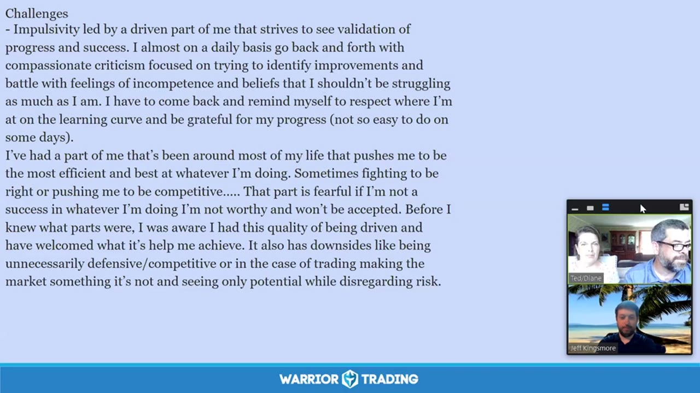

**图怎么看：**

- 这张截图详细描述了交易者在追求成功过程中遇到的挑战，包括冲动性、对进步和成功的渴望以及自我怀疑。
- 截图中提到的自我驱动力虽然有助于提高效率和竞争力，但也可能导致过度竞争和防御性行为。
- 截图还提到了交易者在面对市场波动时可能忽视风险的情况。
- 截图下方的“WARRIOR TRADING”标志表明这是一个专注于交易策略的课程或研讨会的一部分。

### 关键内容

- Jeff分享了自我驱动力和批评的想法，指出它们是双刃剑。
- 自我驱动力有时会忽视风险，而批评则有助于避免冲动和错误。
- Jeff提到自我批评通常在事后出现，这反映了内心的自我反省。
- 通过诗歌和引用，强调自我安抚和自我滋养的重要性。
- 讨论了如何识别和处理这些内在的驱动力和批评。
- 强调了在交易中保持耐心和信任的重要性。
- 分享了如何通过诗歌和引用来缓解自我批评的方法。

### 分析与执行顺序

1. Ted和Diane介绍了FOMO Friday的主题，即交易中的心理学。
2. Jeff分享了他的交易经验，特别是自我驱动力和批评的作用。
3. 讨论了如何通过诗歌和引用来缓解自我批评的方法。
4. 分享了如何通过自我对话来更好地理解自己的内在驱动力。

### 案例与细节

- Jeff提到自我驱动力有时会忽视风险，比如过度扩展或选择超出价格范围的股票。
- Jeff分享了自己在交易中的经历，包括冲动和谨慎的部分。
- 诗歌《滞留的幸福》强调了自我安抚和自我滋养的重要性。
- 引用Pema Chodgans的话，强调了接受自己和调整策略的重要性。
- 讨论了如何通过自我对话来更好地理解自己的内在驱动力。

### 风险与边界

- 录制于2020年，部分市场条件和规则可能已发生变化。
- 自我批评通常在事后出现，这反映了内心的自我反省。
- 分享的诗歌和引用可能需要结合当前市场环境进行解读。
- 强调了在交易中保持平衡的重要性，既不过于自信也不过于悲观

### 复盘问题

- Jeff分享了哪些具体的交易经历？
- 诗歌《滞留的幸福》如何帮助缓解自我批评？
- 如何通过自我对话来更好地理解自己的内在驱动力？

---

## v0959：资源状态在交易中的应用

> 日期：2020-06-19　·　时长：01:00:22

**本场重点：** 通过冥想和自我反思，找到交易中的资源状态以提高表现。

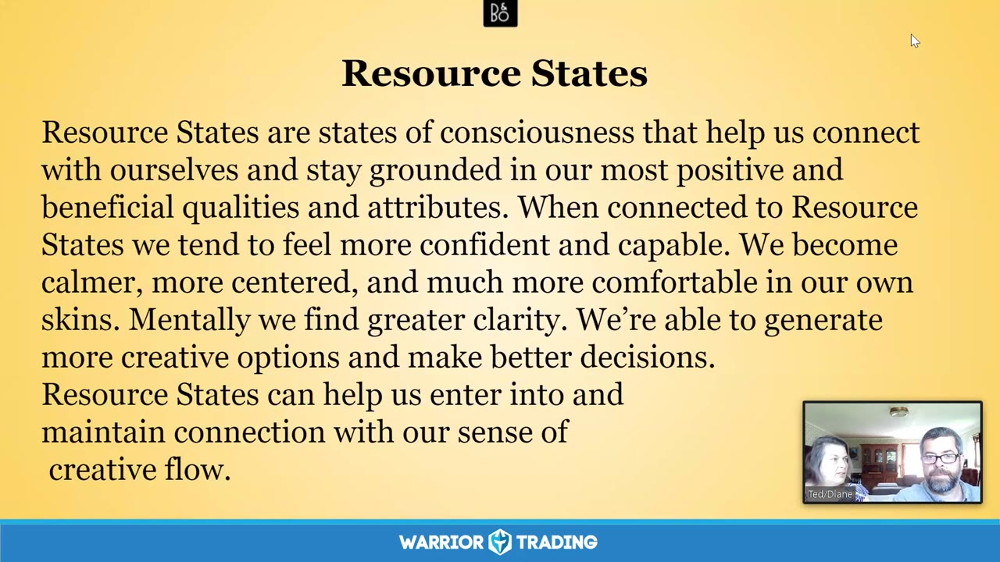

**图怎么看：**

- 这张图片详细介绍了资源状态的概念，强调了它们如何帮助人们与自己连接并保持积极和有益的品质。
- 它描述了资源状态带来的好处，如增强自信、感到更冷静、更中心化以及在自己的皮肤中感到更加舒适。
- 此外，资源状态有助于进入和维持与创造力流动的联系。
- 图片还提到可以通过关注那些帮助我们找到更深自我连接和接近我们能量中心的经历来生成资源状态。

### 关键内容

- 资源状态有助于回归自我，是心理治疗的重要部分。
- 通过提问‘这是否将我带向中心’来评估想法和情绪。
- 自动思维和 trance 状态会将我们带离中心，但练习可以帮助我们识别并回到自我。
- 资源状态可以是任何能帮助我们回归自我的活动，如冥想、跑步等。
- 资源状态可能包括自信、勇气、耐心等情感和心理体验。
- 通过自我反思和练习，可以识别和培养这些资源状态。
- 资源状态有助于处理交易中的情绪，提高决策质量。
- 通过冥想和自我反思，可以更好地理解自己的内心世界。

### 分析与执行顺序

1. 主持人分享了Stephen Gilligan的名言，引导大家思考当前的状态。
2. 通过冥想练习，帮助参与者回归自我，减少自动思维的影响。
3. 引导参与者注意呼吸，放松身体，进入更深的内在状态。
4. 通过冥想和自我反思，帮助参与者更好地理解自己的内心世界，提高交易表现。

### 案例与细节

- 主持人提到，通过冥想练习，可以更好地理解自己的内心世界。
- 通过自我反思，识别和培养有助于交易的资源状态，如自信、勇气等。
- 通过冥想和自我反思，可以更好地理解自己的内心世界，提高交易表现。

### 风险与边界

- 录制年代限制，此内容适用于2020年的市场环境。
- 资源状态的识别和培养需要持续的练习和自我反思。
- 市场环境的变化可能会影响资源状态的效果。
- 个人情况不同，资源状态的具体形式也会有所不同。

### 复盘问题

- 通过冥想练习，你是否能够更好地理解自己的内心世界？
- 在交易中，哪些资源状态对你最有帮助？
- 如何通过自我反思和练习，识别和培养这些资源状态？

---

## v0960：自我领导力在交易中的应用

> 日期：2020-06-26　·　时长：01:01:29

**本场重点：** 交易中如何通过自我领导力来管理情绪和决策，避免过度自信和冲动交易。

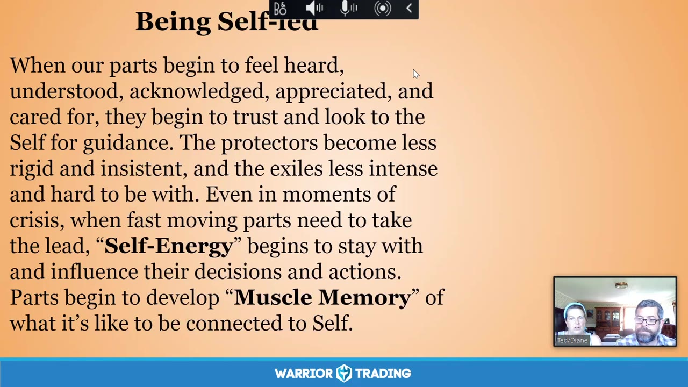

**图怎么看：**

- 当我们的部分开始感到被倾听、理解、认可和欣赏时，它们会信任并寻求自我的指导。保护者会变得不那么僵化和固执，流亡者也会变得不那么强烈和难以相处。
- 即使在危机时刻，当快速移动的部分需要主导时，‘自能量’开始与它们保持联系，并影响它们的决定和行动。
- 部分开始发展“肌肉记忆”，了解与自我相连的感觉。
- 通过这种方式，自我领导力帮助交易者更好地管理情绪和决策，避免过度自信和冲动交易。

### 关键内容

- 自我领导力是通过八个C（冷静、好奇、清晰、同情、自信、创造力、勇气、连接）来实现的。
- 交易中常见的陷阱是过度自信和冲动交易，这会导致决策失误。
- 通过自我领导力，可以更好地理解自己的情绪和决策过程。
- 自我领导力有助于识别和接纳内心的各个部分，从而提高交易表现。
- 自我领导力需要时间和练习，逐步建立对市场的信任。
- 通过自我领导力，可以更好地应对市场变化，而不是被市场情绪左右。
- 自我领导力强调的是内在成长和和谐，而非简单的盈利。
- 自我领导力需要识别和接纳内心的各个部分，包括那些可能带来困扰的部分。

### 分析与执行顺序

1. 首先，介绍自我领导力的概念，包括八个C。
2. 然后，解释自我领导力如何帮助交易者更好地管理情绪和决策。
3. 接着，通过实例说明如何识别和接纳内心的各个部分。
4. 进一步，讨论如何通过自我领导力来应对市场变化，而不是被市场情绪左右。
5. 最后，强调自我领导力是一个持续的过程，需要时间和练习。

### 案例与细节

- “我上周经历了一次艰难的情绪交易周，导致了一个糟糕的一天。”
- “当我在模拟器中表现良好时，为什么搬到实盘交易后会失败？”
- “我在交易中感到非常自信，以至于大幅增加仓位，结果损失惨重。”
- “当我意识到自己过于关注利润时，我的交易表现开始恶化。”
- “我在交易中感到害怕，害怕失去资金，这影响了我的决策。”

### 风险与边界

- 自我领导力需要时间和练习，短期内可能看不到明显效果。
- 过度依赖自我领导力可能会忽视市场信号，导致错过交易机会。
- 录制年代限制，某些市场规则和条件已发生变化。
- 自我领导力的应用需要结合个人情况，不能一概而论。

### 复盘问题

- 在交易中，哪些情绪最常影响决策？
- 如何通过自我领导力来识别和接纳内心的各个部分？
- 在实际交易中，如何应用自我领导力来应对市场变化？

---

## v0961：情绪管理在交易中的应用

> 日期：2020-07-10　·　时长：01:02:03

**本场重点：** 情绪管理对交易的影响，通过冥想和自我意识提升交易表现。

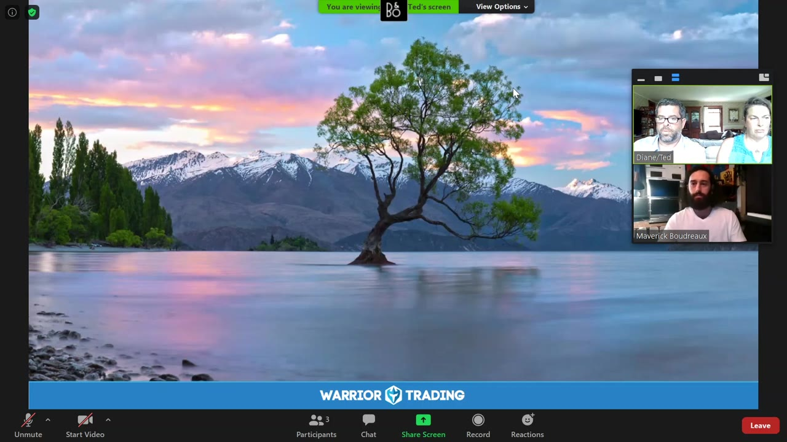

**图怎么看：**

- 这张截图显示了一个关于情绪管理在交易中的应用的课程，背景是一棵孤零零的树，象征着孤独和自我反思。
- 屏幕上方的文字引用了John Welwood的话，强调了在交易中保持自我意识的重要性。
- 右上角的参与者列表显示了三个学员，这表明这是一个在线课程。
- 底部的“WARRIOR TRADING”标志表明这是与交易相关的课程内容。

### 关键内容

- Maverick 通过 Robin Hood 开始交易，经历了一段时间的亏损后，开始关注情绪管理。
- 通过冥想和自我意识，Maverick 发现了内心的见证者，并开始改变生活。
- 情绪管理不仅影响交易表现，还影响个人生活，如睡眠和人际关系。
- 通过接受和理解内心的负面情绪，可以更好地应对交易中的压力。
- 社区支持对于交易新手非常重要，可以帮助他们克服负面情绪。
- 通过识别和命名内心的负面情绪，可以更好地管理这些情绪。
- 冥想有助于减缓内心的情绪，促进自我意识的提升。
- 情绪管理需要时间和耐心，不能急于求成。
- 交易中的负面情绪是人性的一部分，需要接受和理解。
- 通过练习和接受，可以逐步减少负面情绪的影响

### 分析与执行顺序

1. Maverick 分享了他的交易经历，从 Robin Hood 开始，经历了亏损。
2. 他开始关注情绪管理，通过冥想和自我意识找到内心的见证者。
3. 通过识别和命名内心的负面情绪，如赌徒和自信者，开始接受这些情绪。
4. 冥想帮助他减缓情绪，更好地应对交易中的压力。
5. 通过接受和理解内心的负面情绪，他开始改变生活，提高交易表现

### 案例与细节

- Maverick 通过 Robin Hood 开始交易，经历了一段时间的亏损。
- 他发现内心的赌徒部分，喜欢冒险和大赢利。
- 他识别出内心的自信者部分，过于自信和激进。
- 通过冥想，他学会了接受和理解这些负面情绪。
- 他开始在交易中更加冷静，不再急于求成
- 通过接受和理解内心的负面情绪，他能够更好地应对交易中的压力

### 风险与边界

- 录制于 2020 年，当时的市场环境和交易规则可能已发生变化。
- 情绪管理虽然重要，但不能保证交易成功。
- 过度依赖情绪管理可能导致忽视技术分析和其他重要因素

### 复盘问题

- Maverick 如何通过冥想和自我意识改善交易表现？
- 情绪管理对个人生活有哪些积极影响？
- 如何识别和命名内心的负面情绪？
- 接受和理解内心的负面情绪需要多长时间？
- 情绪管理是否适用于所有交易者？

---

## v0962：交易与人际关系

> 日期：2020-07-17　·　时长：00:52:21

**本场重点：** 交易中的情绪波动会影响人际关系，反之亦然。理解这些影响有助于改善双方的关系。

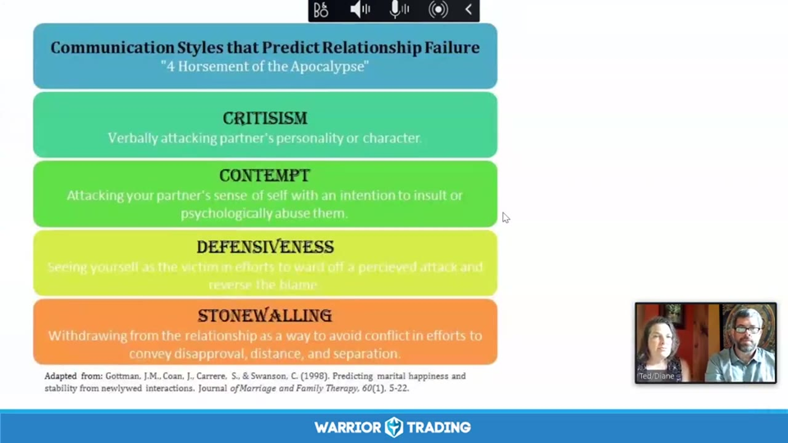

**图怎么看：**

- 这张幻灯片详细探讨了在交易过程中与爱人发生冲突时，人们可能会经历的情绪波动及其对人际关系的影响。
- 它提出了几个关键问题，帮助参与者分析自己在交易中的情感反应，以及这些反应如何影响与他人的关系。
- 通过这些问题，参与者可以更好地理解自己的行为模式，并识别哪些人对他们的交易活动最为支持，哪些人则不那么支持。
- 此外，幻灯片还讨论了那些可能被排斥在外的部分，以及这些部分在生活中的表现形式，以及如何处理这些部分。

### 关键内容

- 交易是一种情感密集型活动，容易引发情绪波动。
- 批评是关系中最常见的负面行为之一，会伤害对方。
- 理解和处理这些情绪可以帮助改善交易和人际关系。
- 通过识别和命名情绪，可以更好地管理交易中的冲突。
- 使用温暖和同情来对待自己的情绪化部分，有助于缓解紧张。
- 在交易和关系中，保持开放和诚实的沟通至关重要。
- 识别和应对关系中的负面模式有助于改善双方的关系。
- 通过练习和反思，可以逐步改善交易和人际关系中的沟通

### 分析与执行顺序

1. 首先，识别交易中的情绪波动及其原因。
2. 然后，分析这些情绪如何影响交易决策。
3. 接着，探讨如何通过沟通改善与家人和朋友的关系。
4. 进一步，学习如何在交易中表达自己的情感。
5. 最后，通过练习和反思，提高处理情绪的能力

### 案例与细节

- 当妻子问起交易的盈亏时，可能会感到不安，担心她会因此担忧。
- 在一次交易失败后，父亲可能会批评交易策略，导致交易者感到沮丧。
- 夫妻之间因交易而产生争执，可能源于对安全和信任的担忧。
- 在交易中，批评他人可能会引发对方的防御心理，导致沟通障碍。
- 在关系中，批评可能会导致对方感到被攻击，从而产生负面情绪

### 风险与边界

- 录制于2020年，当时的市场环境和规则可能已发生变化。
- 批评可能会导致对方感到被攻击，从而产生负面情绪。
- 交易中的失败可能导致家庭成员担心，甚至认为这是赌博。
- 在交易中，过度关注批评可能会导致情绪失控，影响决策

### 复盘问题

- 在交易中遇到批评时，你的反应是什么？
- 如何在交易和关系中平衡自我保护和开放沟通？
- 在面对交易失败时，你如何与家人和朋友沟通？

---

## v0963：情绪交易与情绪劫持

> 日期：2020-07-24　·　时长：01:02:59

**本场重点：** 情绪交易和情绪劫持是影响交易表现的关键因素。通过自我反思和情绪管理，可以减少冲动交易，提高决策质量。

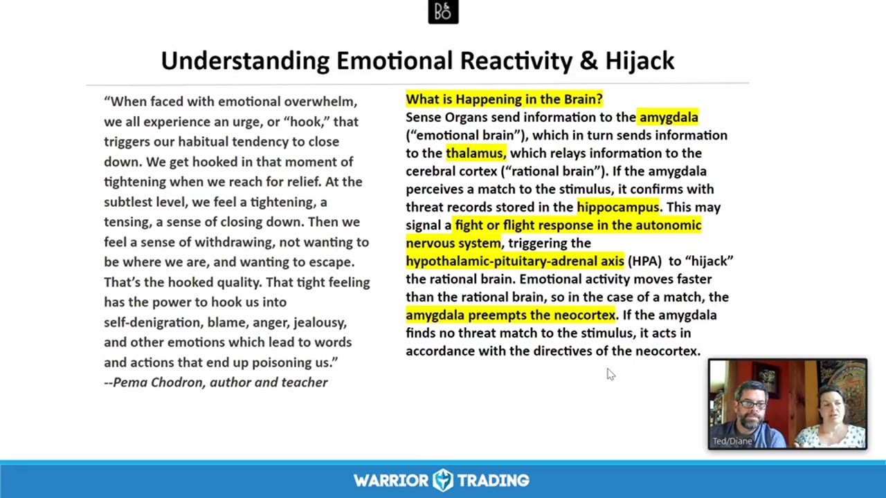

**图怎么看：**

- 这张幻灯片详细解释了情绪反应和情绪劫持在大脑中的发生过程。
- 它描述了感官器官将信息传递给杏仁体（情感大脑），杏仁体会将信息传递给丘脑，丘脑再将信息传递给前额叶皮层（理性大脑）。
- 如果杏仁体识别到威胁匹配刺激，它会确认存储在海马体中的威胁记录，这可能触发自主神经系统中的战斗或逃跑反应，激活下丘脑-垂体-肾上腺轴（HPA）来‘劫持’理性大脑。
- 情绪活动比理性大脑快，因此在威胁匹配的情况下，杏仁体会先于前额叶皮层发挥作用。

### 关键内容

- 情绪交易可能导致决策失误，而情绪劫持则会导致更严重的后果。
- 通过自我反思和情绪管理，可以减少情绪驱动的交易。
- 情绪反应速度远超理性思考，因此需要提前准备。
- 情绪劫持时，交易者可能会忽视规则，做出冲动决策。
- 情绪管理需要练习，包括冥想和呼吸练习。
- 情绪交易和情绪劫持在交易中普遍存在，需要识别和应对。
- 情绪反应可能源于过去的经历或社会文化影响。
- 情绪管理有助于建立纪律，提高交易表现。
- 情绪管理需要长期坚持，才能有效。
- 情绪管理不仅适用于交易，也适用于其他生活领域。

### 分析与执行顺序

1. 首先，讲师介绍了情绪交易的概念，指出情绪反应会影响决策。
2. 接着，讲师解释了情绪劫持的定义及其对交易的影响。
3. 然后，讲师分享了一个个人体验，说明情绪反应如何影响决策。
4. 之后，讲师讨论了如何通过自我反思和情绪管理来减少情绪驱动的交易。
5. 最后，讲师强调了情绪管理的重要性，并提供了具体的练习方法。

### 案例与细节

- 讲师提到，当自己在游戏或交易中失败时，会感到沮丧，这反映了情绪反应如何影响决策。
- 讲师分享了一个个人经验，说明如何通过自我反思来识别和接受内心的冲突。
- 讲师提到了一个交易场景，在连续亏损后，情绪压力导致冲动交易。
- 讲师描述了一次交易经历，当市场表现不佳时，情绪反应导致放弃规则。
- 讲师分享了一个呼吸练习的方法，帮助缓解情绪紧张。

### 风险与边界

- 情绪管理需要长期坚持，否则可能无法有效减少冲动交易。
- 情绪反应可能源于过去的经历或社会文化影响，难以完全消除。
- 情绪管理方法的有效性取决于个人实践和适应情况。
- 录制年代限制，当前市场环境和情绪管理方法可能有所不同。

### 复盘问题

- 情绪交易和情绪劫持分别指的是什么？
- 如何通过自我反思和情绪管理减少情绪驱动的交易？
- 情绪管理的具体方法有哪些？

---

## v0964：培养情绪智力在交易中的应用

> 日期：2020-07-31　·　时长：00:54:11

**本场重点：** 情绪智力对于交易者长期成功至关重要，通过自我意识、自我调节、动机、同理心和社会技能来提升情绪管理能力。

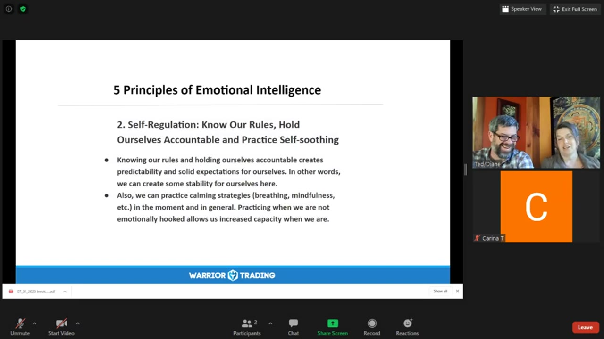

**图怎么看：**

- 本场标题：培养情绪智力在交易中的应用
- 本场重点：情绪智力对于交易者长期成功至关重要，通过自我意识、自我调节、动机、同理心和社会技能来提升情绪管理能力。
- 候选时间：A=1365秒，B=1137秒，C=2210秒
- 源系列：FOMO FRIDAYS / 2020

### 关键内容

- 情绪智力是识别和监控自己及他人情绪的能力，帮助指导思考和行为。
- 交易过程中情绪管理非常重要，技术熟练度只是成功的一半。
- 通过日记记录交易经验可以帮助发现模式，提高自我意识。
- 自我调节包括了解自己的规则，保持自我安慰，以诚实和同情心对待自己。
- 情绪智力的培养需要诚实和同情心，避免自我惩罚。
- 通过识别和管理情绪，可以更好地做出交易决策。
- 情绪智力的应用包括识别和管理内在冲突，如Rambo和Randy。
- 情绪智力的培养需要时间和耐心，通过自我反思和社区支持来实现。
- 情绪智力的培养有助于减少交易中的情绪波动，提高决策质量。
- 情绪智力的培养需要识别和挑战不合理的信念，以促进更好的交易结果。
- 情绪智力的培养需要建立一个支持性的社区，以分享经验和情感

### 分析与执行顺序

1. 开始时进行冥想练习，帮助参与者放慢节奏，提高自我意识。
2. 通过日记记录交易经验，帮助识别模式和情绪触发点。
3. 自我调节包括识别和接受自己的情绪，以及采取措施缓解压力。
4. 同理心意味着以朋友的方式对待自己，尤其是在经历挑战和损失时。
5. 社交技能包括表达自己的体验而不带防御性，这有助于建立支持性的社区。
6. 通过识别和管理内在冲突，如Rambo和Randy，来提高情绪智力。
7. 通过自我反思和社区支持来培养情绪智力，以实现更好的交易结果

### 案例与细节

- 参与者被鼓励记录交易日志，以识别模式和情绪触发点。
- 通过日记记录，参与者可以识别忘记执行硬停损的情况，并进一步调查原因。
- 参与者被鼓励识别和管理内在冲突，如Rambo（激进）和Randy（谨慎），以提高情绪智力。
- 通过自我反思和社区支持，参与者可以更好地理解自己的情绪和行为模式。
- 通过识别和挑战不合理的信念，如“我必须成功”，参与者可以减少情绪波动，提高决策质量

### 风险与边界

- 情绪智力的培养需要时间和耐心，可能无法立即看到效果。
- 情绪智力的应用需要持续的努力和自我反思，否则可能无法持续改进。
- 录制年代限制为2020年，当前市场环境可能与当时有所不同。
- 情绪智力的应用需要识别和管理内在冲突，这可能需要深入的心理分析。
- 情绪智力的培养需要建立支持性的社区，但社区成员的参与程度可能不同

### 复盘问题

- 你如何通过日记记录来识别和管理自己的情绪模式？
- 你在交易过程中遇到过哪些情绪冲突？你是如何处理这些冲突的？
- 你如何通过自我反思来提高自己的情绪智力？
- 你认为情绪智力的培养对你的交易决策有何影响？
- 你如何在交易中实践同理心和社交技能？

---

## v0965：交易中的过程与目标

> 日期：2020-08-07　·　时长：01:01:37

**本场重点：** 交易过程中，既要追求盈利，也要注重学习过程，保持平衡。

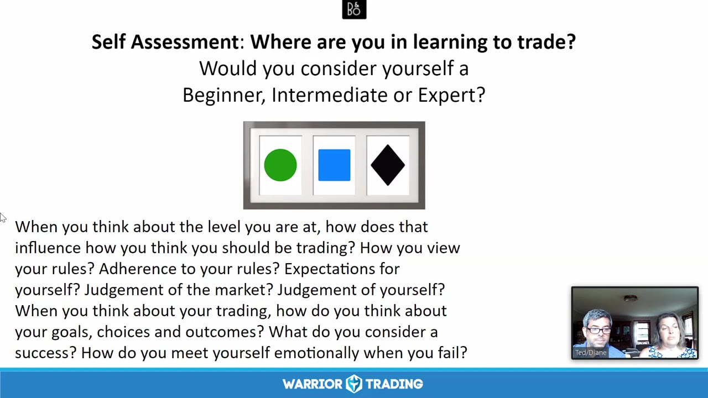

**图怎么看：**

- 这张幻灯片展示了交易技能层次的等级划分，从Unconsciously Incompetent到Consciously Competent。
- Unconsciously Incompetent表示对交易知识一无所知，可能认为自己比实际更了解。
- Consciously Incompetent表示知道自己在某些方面不擅长，这会困扰他们。
- Consciously Competent表示理解如何交易，但需要大量努力和专注。

### 关键内容

- 交易者往往过于关注盈利目标，忽视了学习过程的重要性。
- 通过冥想，可以更好地体验交易过程中的挑战与乐趣。
- 成功的关键在于理解自己的情感反应，并将其转化为积极的动力。
- 交易者需要区分短期波动与长期趋势，避免情绪化决策。
- 系统一和系统二的思维模式对交易决策有重要影响。
- 交易者应学会从失败中吸取教训，而不是逃避责任。
- 交易过程中的情感投资有助于提高交易技能。
- 交易者需要记录交易过程中的情感变化，以便更好地理解自己。
- 交易者应将交易过程视为一个不断学习和成长的过程

### 分析与执行顺序

1. 讲师首先介绍了交易中的两种思维方式：系统一和系统二。
2. 系统一快速、本能且情绪化，而系统二则更慢、更逻辑化。
3. 交易者需要在系统一和系统二之间找到平衡，以做出最佳决策。
4. 通过冥想，交易者可以更好地体验交易过程中的情感变化。
5. 交易者需要反思自己的交易经历，识别成功和失败的原因。
6. 交易者应记录每次交易的情感变化，以便更好地理解自己。
7. 交易者应保持耐心，逐步积累经验，最终达到熟练水平

### 案例与细节

- 一位交易者在周一经历了大额亏损，然后试图通过增加风险来弥补损失，最终导致更大的亏损。
- 另一位交易者在连续25天盈利后，因为失去控制而放弃了策略，变得自负。
- 一位交易者在连续30天盈利后，认为这是一次侥幸，但最终还是因为情绪失控而失去了所有收益。

### 风险与边界

- 交易者可能会过于关注短期波动，忽视长期趋势，导致情绪化决策。
- 交易者可能会因为过度自信而忽视风险，最终导致重大损失。
- 交易者可能会因为缺乏经验而频繁犯错，难以达到熟练水平。
- 交易者可能会因为过度关注盈利目标而忽视学习过程的重要性，导致无法持续进步。
- 交易者可能会因为缺乏耐心而放弃学习过程，最终无法达到熟练水平

### 复盘问题

- 交易者如何在追求盈利的同时，更好地体验交易过程中的挑战与乐趣？
- 交易者如何通过反思自己的交易经历，识别成功和失败的原因？
- 交易者如何记录每次交易的情感变化，以便更好地理解自己？
- 交易者如何在系统一和系统二之间找到平衡，以做出最佳决策？

---

## v0966：自我心、意图与影响

> 日期：2020-08-14　·　时长：01:04:14

**本场重点：** 通过识别和理解内心的各个部分来提高交易表现，避免情绪化决策。

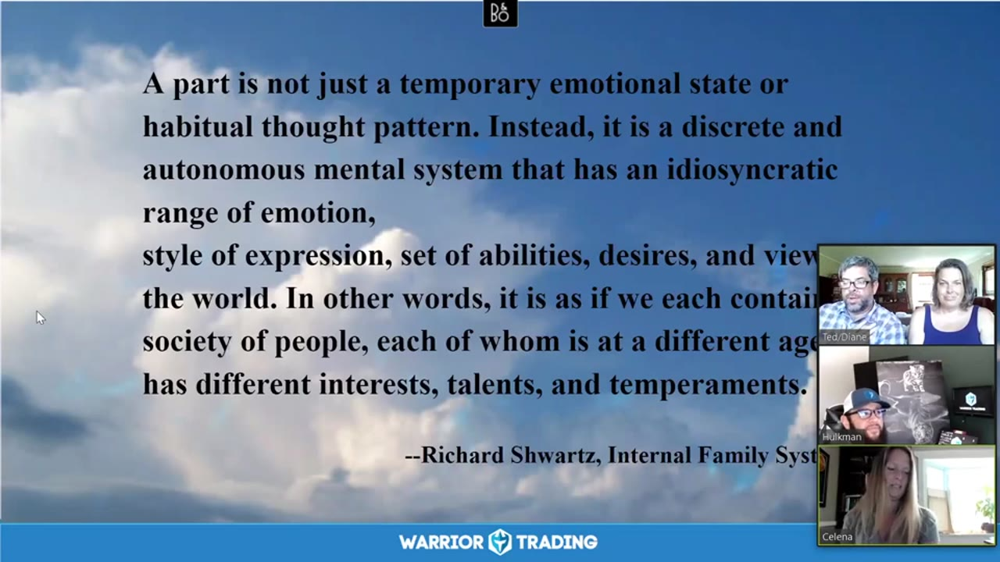

**图怎么看：**

- 幻灯片详细描述了内心的不同部分如何相互作用，并且强调这些部分在保护自己不受外界压力时会采取不同的策略。
- 幻灯片还提到了一些特定的部分类型，如保护性部分（试图阻止脆弱部分被激活）和反应性部分（试图分散注意力以应对触发的脆弱部分）。
- 此外，幻灯片还讨论了被排除的部分，这些部分通常持有极端的情感和信念，导致它们与系统中的其他部分隔离。
- 幻灯片最后指出，了解这些部分有助于提高交易表现并避免情绪化决策。

### 关键内容

- 交易中情绪化的决策往往是由内心的某个部分驱动的。
- 识别和理解这些部分有助于提高交易表现，避免情绪化决策。
- 自我心的概念包括多个维度或部分，每个部分都有独特的角色和动机。
- 通过识别和理解这些部分，可以更容易地与它们建立协作关系。
- 自我心的核心自我是更接近基本意识的存在，能够见证和持有各种内心的部分。
- 内心的部分通常需要被看见和支持，而不是被驱逐或忽视。

### 分析与执行顺序

1. 首先，识别和理解内心的各个部分，包括管理者和被遗弃的部分。
2. 通过自我领导和意图，可以更好地管理这些内心的部分。
3. 在交易中，识别和理解内心的部分可以帮助避免情绪化的决策。
4. 通过练习自我领导和意图，可以更好地管理内心的部分，从而提高交易表现。
5. 通过识别和理解内心的部分，可以更好地管理情绪和行为，从而提高交易表现。

### 案例与细节

- Selena 发现了一个两岁的心灵部分，这个部分让她感到无聊，想要立即进行交易。
- Hulk 在一次交易中感到恐惧，他意识到这个恐惧来自于一个被遗弃的部分。
- Cynthia 发现了一个两岁的心灵部分，这个部分让她感到无聊，想要立即进行交易。
- Michael 在一个完美的交易机会出现时感到空白，然后回到现实，意识到自己进入了另一个世界。
- Hulk 和 Selena 在一次交易中发现了一个被遗弃的部分，这个部分让他们感到害怕，但最终被接纳和支持。

### 风险与边界

- 识别和理解内心的部分可能需要时间和耐心。
- 内心的部分可能包含负面情绪，这可能会导致交易者感到沮丧。
- 自我心的概念可能对一些人来说难以接受，因为它涉及到深层次的心理探索。
- 录制于 2020 年，某些心理技术可能随着时间的推移而发生变化。

### 复盘问题

- 你如何识别和理解内心的各个部分？
- 你如何通过自我领导和意图来管理这些内心的部分？
- 你如何在交易中避免情绪化的决策？

---

## v0967：情绪管理与交易心理

> 日期：2020-08-21　·　时长：01:01:55

**本场重点：** 通过情绪管理提升交易心理，识别并处理内心冲突。

**图怎么看：**

- The Self is described as the core self that is more closely related to our basic awareness and serves as the center of who we are.
- It has the ability to step back, turn towards, witness, and hold the various parts of who we are.
- When the Self is differentiated, it can become an active and compassionate leader for its other parts.
- The Self-energy and Self-Leadership are marked by the 8-C's: calmness, curiosity, clarity, compassion, confidence, creativity, courage, and connectedness.

### 关键内容

- 情绪管理是交易成功的关键，需要识别并处理内心的冲突。
- 通过冥想和自我对话来识别和处理内心的冲突。
- 识别交易中的不同部分，如保护者和流放者。
- 通过自我领导和自我能量来增强交易心理。
- 使用八C（冷静、好奇心、清晰、同情、自信、创造力、勇气、连接）来增强自我能量。
- 通过日常练习和交易前的准备来建立自我能量。
- 识别并处理内心冲突，如贪婪和恐惧。
- 通过自我对话和冥想来增强交易心理。
- 通过自我领导来处理内心的冲突和情绪。
- 通过自我能量来增强交易心理的稳定性

### 分析与执行顺序

1. 讲师介绍了情绪管理的重要性，并引导学生进行冥想。
2. 学生在冥想过程中识别并处理内心的冲突。
3. 通过自我对话和冥想来识别和处理内心的冲突。
4. 学生分享了自己在交易中的经历和感受。
5. 讲师指导学生如何通过自我领导来处理内心的冲突和情绪。
6. 通过自我能量来增强交易心理的稳定性，帮助学生更好地应对市场波动

### 案例与细节

- 一位学生提到，他感到紧张，因为他在交易中总是想要更多，而不是及时止损。
- 另一位学生分享了他在交易中遇到的贪婪和恐惧，导致他无法做出正确的决策。
- 讲师通过自我领导和自我能量来帮助学生处理内心的冲突，例如贪婪和恐惧。
- 通过冥想和自我对话，学生能够更好地识别和处理内心的冲突。
- 一位学生分享了他在交易中遇到的保护者和流放者的冲突，导致他无法做出正确的决策

### 风险与边界

- 录制于2020年，部分市场规则和条件可能已发生变化。
- 使用的技术和方法可能需要根据当前市场情况进行调整。
- 交易心理和情绪管理是一个持续的过程，需要不断练习和改进。
- 市场波动可能导致情绪波动，影响交易决策

### 复盘问题

- 在交易中，哪些情绪最常影响你的决策？
- 如何通过自我领导来处理内心的冲突和情绪？
- 在交易前，你有哪些日常练习来增强自我能量？
- 如何通过自我对话和冥想来识别和处理内心的冲突？
- 在交易中，你如何保持冷静和清晰的头脑？

---

## v0968：情绪反应在交易中的自我认知

> 日期：2020-08-28　·　时长：01:08:27

**本场重点：** 情绪反应是交易中的常见问题，通过自我认知可以改善决策，但需要时间和耐心。

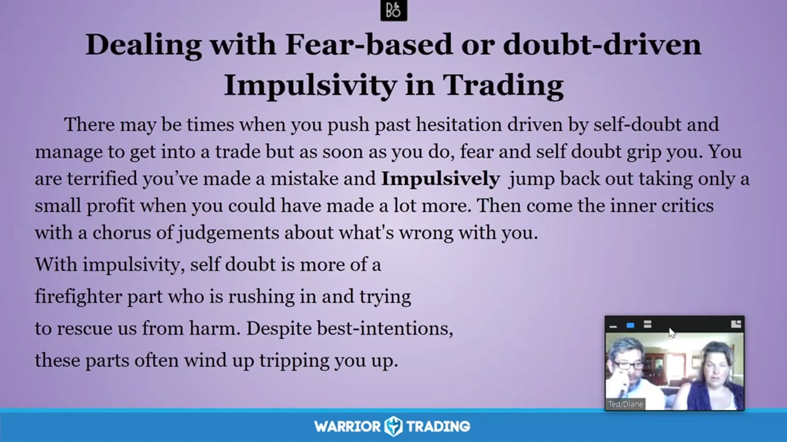

**图怎么看：**

- 这张幻灯片讨论了恐惧驱动或怀疑驱动的冲动性在交易中的处理方法。
- 它强调了在交易过程中，面对恐惧和自我怀疑时的冲动行为可能导致错过更大的利润机会。
- 幻灯片还提到了自我怀疑作为保护机制的一部分，试图拯救我们免受伤害。
- 尽管有好的意图，这些部分往往反而会阻碍我们的进步。

### 关键内容

- 情绪反应如犹豫、冲动和过度自信会影响交易决策。
- 通过自我认知和理解这些情绪背后的动机，可以改善交易表现。
- 自我认知过程需要时间和耐心，不应期望立即看到结果。
- 情绪反应源于内心的保护机制，如管理者和消防员。
- 通过理解和接纳这些情绪，可以减少它们对交易的影响。
- 交易中的关键在于保持冷静和专注，而不是盲目跟随市场。
- 情绪反应可以通过冥想和自我反思来管理。
- 交易者需要建立自己的规则和策略，以应对市场波动。
- 情绪反应是交易过程中不可避免的一部分，需要学会接受。
- 通过练习和自我反思，可以逐步改善情绪反应对交易的影响

### 分析与执行顺序

1. 首先进行冥想练习，帮助放松和集中注意力。
2. 识别交易中的犹豫、冲动和过度自信的情绪。
3. 了解这些情绪背后的动机和保护机制。
4. 通过自我反思和冥想，逐步理解和接纳这些情绪。
5. 制定个人规则和策略，以应对市场波动和情绪反应。
6. 定期进行自我反思，以持续改进交易表现。
7. 通过模拟交易和实际交易，逐步实践和验证策略

### 案例与细节

- 一位新交易者在模拟交易中发现，当市场走势快速上升时，他会过于兴奋而错过最佳时机。
- 一位交易者在交易中遇到亏损后，感到害怕再次失败，导致犹豫不决。
- 一位交易者在交易中发现，当市场走势不利时，他会变得过于紧张，无法做出决策。
- 一位交易者在模拟交易中设定止损点，以避免过度自信导致的大额亏损。
- 一位交易者通过冥想练习，学会了在交易前放松心情，提高专注度。
- 一位交易者在交易中发现，当市场波动较大时，他容易受到情绪影响，导致决策失误

### 风险与边界

- 情绪反应是交易中常见的问题，但改善需要时间和耐心，不应期望立即看到结果。
- 过度自信可能导致决策失误，增加风险。
- 市场环境不断变化，交易策略需要适时调整。
- 录制年代限制为2020年，当前市场环境可能有所不同。
- 情绪反应可能因个人经历不同而有所差异，需个性化处理

### 复盘问题

- 在交易中遇到犹豫和冲动时，如何识别和理解这些情绪背后的动机？
- 通过自我认知和冥想练习，如何逐步改善情绪反应对交易的影响？
- 在实际交易中，如何制定和应用个人规则和策略，以应对市场波动和情绪反应？

---

## v0969：情绪与心理学在交易中的应用

> 日期：2020-09-04　·　时长：01:03:01

**本场重点：** 情绪管理在交易中的重要性，通过自我对话和冥想来处理情绪，以及理解内在家庭系统模型。

**图怎么看：**

- 图B显示了两位参与者在Zoom会议上的实时交流，背景是一个美丽的日落场景，突显了交易课程的主题。
- 画面中的参与者正在讨论情绪管理在交易中的重要性，这与课程的重点相吻合。
- 图B提供了视觉上的吸引力，有助于观众集中注意力并保持参与感。
- 画面中的参与者正在使用耳机进行沟通，表明他们正在进行面对面的交流，符合课程内容的要求。

### 关键内容

- 情绪管理是交易成功的关键，通过自我对话和冥想来处理情绪。
- 内在家庭系统模型帮助理解情绪和交易之间的关系。
- 交易中的恐惧和FOMO（害怕错过）是常见的心理挑战。
- 通过识别和接纳情绪，可以更好地管理交易过程。
- 交易中的压力和外部因素会加剧情绪波动。
- 通过冥想和自我对话，可以培养对情绪的同情和理解。
- 情绪管理需要时间和耐心，不能急于求成。
- 通过识别和接纳情绪，可以更好地理解自己和市场。
- 内在家庭系统模型强调了情绪和交易之间的互动。
- 通过自我对话和冥想，可以更好地处理交易中的情绪波动

### 分析与执行顺序

1. 讲师首先介绍了情绪管理的重要性，并通过自我对话和冥想来处理情绪。
2. 然后，讲师分享了一个案例，说明如何通过自我对话来处理交易中的情绪。
3. 接着，讲师解释了内在家庭系统模型，并引用了电影《头脑特工队》来说明情绪管理的重要性。
4. 最后，讲师强调了情绪管理需要时间和耐心，不能急于求成。
5. 在整个过程中，讲师鼓励参与者通过自我对话和冥想来更好地处理情绪波动

### 案例与细节

- 一位交易者在连续几天亏损后，感到愤怒和失望，但通过冥想和自我对话，他能够缓解这些情绪。
- 另一位交易者在面对市场波动时，感到恐惧和FOMO，通过识别和接纳这些情绪，他能够更好地管理交易过程。
- 通过内在家庭系统模型，参与者了解到情绪和交易之间的互动，从而更好地理解自己的情绪反应。
- 一位新手交易者在面对市场压力时，感到焦虑和不安，通过冥想和自我对话，他能够更好地应对这些情绪。
- 一位交易者在连续几天盈利后，感到自信和满足，但通过冥想和自我对话，他能够保持冷静，避免过度乐观

### 风险与边界

- 录制于2020年，部分市场规则和税务条件可能已发生变化。
- 交易中的情绪波动是普遍现象，但不同市场环境和个人经验可能导致不同的结果。
- 通过自我对话和冥想来处理情绪的方法需要持续练习，才能有效应用于实际交易中。
- 内在家庭系统模型虽然有助于理解情绪和交易之间的关系，但在实际操作中可能需要结合其他方法

### 复盘问题

- 在交易中，哪些情绪最常见？如何通过自我对话和冥想来处理这些情绪？
- 内在家庭系统模型如何帮助理解情绪和交易之间的关系？
- 通过自我对话和冥想，可以培养哪些情绪管理技能？

---

## v0970：冷静内心批评者

> 日期：2020-09-11　·　时长：01:04:55

**本场重点：** 讨论如何处理内心的严厉批评者，通过自我接纳和理解来转变这些负面声音。

**图怎么看：**

- 内省的批评者从我们的早期经验中发展而来，可以被视为一个内部化的“外星人”，它附着在我们应该是一个更有益、引导我们前进的部分上，这个部分正在寻找并试图引导我们走向正确的方向。
- 相反，这个部分传递的信息，即已经将负面批评内化了，会变得尖锐、伤人，并且自我孤立。
- 导致我们更倾向于关闭或破坏性行为，而不是任何积极成长的行为。
- 这种内在批评者的存在让我们陷入困境，阻碍了我们的成长和发展。

### 关键内容

- 内心批评者通常在压力情境下出现，它们会用严厉的语言批评我们。
- 批评者试图帮助我们，但其方法往往导致自我贬低。
- 识别批评者的根源，如童年经历或家庭影响，有助于理解其动机。
- 通过自我接纳和理解，可以逐步软化和转变这些批评者。
- 不同类型的批评者包括完美主义者、任务大师、模具塑造者等。
- 面对批评者时，保持开放心态，理解其背后的情感和意图。
- 通过冥想练习，可以更好地识别和理解内心的批评者。
- 在交易中，批评者可能表现为过度交易或放弃交易机会。
- 了解批评者的根源有助于更好地应对和转化它们。

### 分析与执行顺序

1. 首先，介绍内心批评者的定义及其常见表现。
2. 然后，通过案例分析不同类型的批评者，如完美主义者和任务大师。
3. 接着，分享如何通过自我接纳和理解来转变这些批评者的方法。
4. 最后，强调冥想练习在识别和理解内心批评者中的重要性。
5. 通过具体的例子，展示如何面对和处理内心的批评者。
6. 总结时，强调自我接纳和理解的重要性，以及如何逐步软化和转变这些批评者

### 案例与细节

- 一位参与者提到，她的内心批评者在她失败时让她感到自责，这反映了她对父亲的爱和期望。
- 另一位参与者分享了她在交易中遇到的批评者，如害怕失败和过度交易的倾向。
- 通过冥想练习，参与者能够更好地识别和理解内心的批评者，从而采取更积极的态度。
- 一位参与者提到了她内心的控制者，它试图控制她的冲动，如饮食和交易。
- 通过自我接纳和理解，参与者能够更好地面对和处理内心的批评者，从而改善交易表现

### 风险与边界

- 录制于2020年，部分信息可能不再适用。
- 批评者的类型和表现可能因人而异，需根据个人情况进行调整。
- 自我接纳和理解需要时间和持续的努力，短期内可能看不到明显效果。
- 在交易中，批评者可能表现为过度交易或放弃交易机会，这可能导致资金损失

### 复盘问题

- 如何识别和理解内心的批评者？
- 通过哪些方法可以逐步软化和转变这些批评者？
- 在交易中，如何应对和处理内心的批评者？

---

## v0971：FOMO Friday：接受现实

> 日期：2020-09-18　·　时长：00:58:10

**本场重点：** FOMO Friday讨论了接受现实的重要性，通过冥想和自我反思来处理情绪波动。重点在于如何在交易中应用这一概念。

**图怎么看：**

- 这张幻灯片详细阐述了接受现实的概念，包括接受事物本来的样子、理解我们能够控制和无法控制的事情、保持非评判态度、客观看待情况、承认我们的处境以及放下对抗现实。
- 这些定义帮助参与者理解如何在交易中应用接受现实的概念，以更好地管理情绪波动。
- 通过这种方式，参与者可以学会如何在压力和不确定性中保持冷静和理性。
- 这有助于他们在面对市场波动时做出更明智的决策，减少因情绪影响而产生的错误判断。

### 关键内容

- 接受现实是接受当前时刻的状态，而不是试图改变它。
- 接受自己和生活现状是自我接纳的一部分。
- 通过冥想练习接受现实可以减少情绪波动。
- 接受现实有助于减轻对过去的纠结和对未来的恐惧。
- 接受现实可以促进内心的平静和自我接纳。
- 接受现实可以减少对自身和生活的负面评价。
- 接受现实可以提高交易中的决策质量。
- 接受现实可以减少交易中的冲动行为。
- 接受现实可以增强自我同情心。
- 接受现实可以改善交易心态

### 分析与执行顺序

1. 讲师介绍了接受现实的概念，强调接受当前状态的重要性。
2. 讲师分享了关于接受现实的名言，以加深理解。
3. 讲师引导了一段冥想，帮助参与者练习接受现实。
4. 参与者被邀请回顾自己在交易中遇到的情绪波动。
5. 参与者被鼓励识别自己容易接受的部分和难以接受的部分。
6. 参与者被指导如何通过自我反思来改善交易心态

### 案例与细节

- “我们注意到很多人在关系中难以接受现实，因为他们希望关系有所不同。”
- “如果我在这一刻接受自己，只是为了改变，这是否有效？”
- “接受自己和生活现状是自我接纳的一部分。”
- “接受现实可以减少对自身和生活的负面评价。”
- “接受现实可以提高交易中的决策质量。”
- “接受现实可以减少交易中的冲动行为。”

### 风险与边界

- 录制于2020年，部分信息可能不再适用。
- 交易市场环境变化可能导致接受现实的具体应用有所不同。
- 心理状态和个人经历会影响接受现实的效果。
- 接受现实需要持续练习，否则效果可能减弱。
- 接受现实可能需要结合其他心理技巧共同使用

### 复盘问题

- 在交易中，哪些情绪波动最常影响你的决策？
- 你如何在日常生活中实践接受现实？
- 你认为哪些因素会阻碍你更好地接受现实？

---

## v0972：FOMO Friday：通过接受来应对交易中的情绪

> 日期：2020-09-25　·　时长：01:03:46

**本场重点：** 通过接受现实来缓解交易中的情绪波动，提高交易表现。

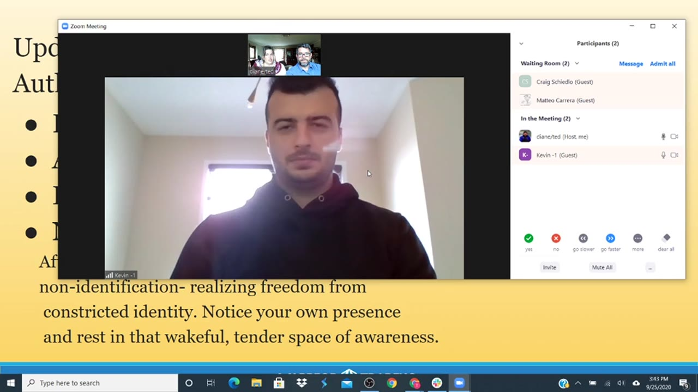

**图怎么看：**

- R: Recognize what is happening;
- A: Allow the experience to be there, just as it is;
- I: Investigate with interest and care;
- N: Nurture with Self-Compassion.

### 关键内容

- 介绍了接受的概念，强调接受现实的重要性。
- 分享了Lao Tzu的诗，强调接受现实的必要性。
- 引用了Pema Chodron的话，强调自我同情的重要性。
- 通过冥想练习，帮助参与者更好地接受自己的情绪。
- 分享了一个参与者通过接受内心的批评者而获得突破的故事。
- 讨论了如何通过自我反省来识别和接受自己的情绪。
- 强调了在交易中保持专注和纪律的重要性。
- 分享了如何通过自我反省来识别和接受自己的情绪。
- 分享了Lao Tzu的诗，强调接受现实的必要性，指出即使面对难以控制的生活，也要学会接纳。
- 引用了Pema Chodron的话，强调自我同情的重要性，指出对待自己就像对待他人一样，给予善意和理解。
- 通过冥想练习，帮助参与者更好地接受自己的情绪，指出通过呼吸和身体扫描，可以减轻紧张和压力。
- 分享了一个参与者通过接受内心的批评者而获得突破的故事，强调了与内心的对话和合作的重要性。
- 讨论了如何通过自我反省来识别和接受自己的情绪，指出在交易中保持专注和纪律的重要性。
- 强调了在交易中保持专注和纪律的重要性，指出即使面对失败和挫折，也要坚持自己的规则和计划。
- 分享了如何通过自我反省来识别和接受自己的情绪，指出通过观察生理反应和情绪变化，可以更好地理解自己的内心。

### 分析与执行顺序

1. 首先，介绍了接受的概念，并分享了Lao Tzu的诗。
2. 然后，分享了Pema Chodron的话，强调自我同情的重要性。
3. 接着，进行了冥想练习，帮助参与者更好地接受自己的情绪。
4. 之后，分享了一个参与者通过接受内心的批评者而获得突破的故事。
5. 最后，讨论了如何通过自我反省来识别和接受自己的情绪。

### 案例与细节

- 参与者Greg分享了如何通过接受内心的批评者而获得突破的故事。
- 参与者Kevin分享了如何在交易中保持纪律和专注。
- 参与者Mateo分享了如何通过接受自己的情绪来改善交易表现。
- 参与者Nandini分享了如何通过接受内心的恐惧来改善交易表现。
- 参与者Roberto分享了如何通过接受内心的保护者来改善交易表现。
- 参与者Greg分享了如何通过接受内心的批评者而获得突破的故事，指出通过与内心的对话和合作，可以找到新的解决方案。
- 参与者Kevin分享了如何在交易中保持纪律和专注，指出即使面对失败和挫折，也要坚持自己的规则和计划，以保持交易纪律。
- 参与者Mateo分享了如何通过接受自己的情绪来改善交易表现，指出通过自我反省和接受情绪，可以更好地专注于交易。
- 参与者Nandini分享了如何通过接受内心的恐惧来改善交易表现，指出通过自我反省和接受情绪，可以更好地处理交易中的恐惧。

### 风险与边界

- 录制于2020年，部分信息可能不再适用。
- 交易市场和环境的变化可能导致某些策略不再有效。
- 心理和情绪管理的方法需要持续实践才能生效。
- 录制于2020年，部分信息可能不再适用，特别是市场环境和规则的变化可能导致某些策略不再有效。
- 交易市场和环境的变化可能导致某些策略不再有效，特别是在疫情和经济不确定性的影响下，市场波动性增加。
- 心理和情绪管理的方法需要持续实践才能生效，特别是在面对长期压力和挑战时，需要不断调整和适应。

### 复盘问题

- 参与者是如何通过接受内心的情绪来改善交易表现的？
- 冥想练习对接受情绪有何帮助？
- 如何通过自我反省来识别和接受自己的情绪？

---

## v0973：过渡到实盘交易

> 日期：2020-10-02　·　时长：01:58:46

**本场重点：** 过渡到实盘交易时，需要克服情绪波动和压力，保持冷静和理性。

**图怎么看：**

- 在实盘交易中，学员可能会遇到情绪波动和压力，因此需要学会如何保持冷静和理性。
- 学员可以参考系统1（The Hare）和系统2（The Tortoise）的概念来理解自己的思维模式。
- 学员应该意识到自己可能受到FOMO（Fear of Missing Out）和复仇交易的影响，并采取措施克服这些情绪。
- 通过设置适当的阻力水平并持有胜利者足够长的时间，学员可以更好地管理情绪波动和压力。

### 关键内容

- 实盘交易会增加压力，导致回归到早期的习惯和情绪反应。
- 需要通过模拟交易来建立应对策略，保持专注，而不是关注盈利或亏损。
- 实盘交易会暴露个人的脆弱性，因此需要制定计划，了解交易成本，包括佣金和其他费用。
- 在实盘交易的第一周设定具体目标，如合适的仓位大小、如何处理亏损日等。
- 使用与实盘交易相同的交易平台，以减少适应期。
- 通过身体锻炼来培养自律，保持冷静。
- 接受错误和失败，面对错误时要有责任感，不要否认它们。
- 过渡到实盘交易时，需要通过模拟交易来建立应对策略，保持专注，而不是关注盈利或亏损。这有助于减少情绪波动，提高决策质量。
- 在实盘交易前降低仓位，以适应实盘环境。这样做可以减少因过度交易而导致的损失，同时帮助交易者更好地适应市场波动。
- 通过设定交易限制来控制交易数量，减少过度交易。这有助于保持冷静，避免因情绪波动而做出冲动决策。
- 在交易前进行情绪检查，通过放松身体来缓解情绪紧张。这有助于提高交易者的心理韧性，减少因情绪波动而产生的负面影响。
- 通过自我反省来监控情绪状态，保持冷静。这有助于交易者识别并调整自己的情绪反应，从而提高交易表现

### 分析与执行顺序

1. 在模拟交易阶段使用与实盘交易相同的资金规模，以减少实盘交易初期的压力。
2. 在实盘交易前降低仓位，以适应实盘环境。
3. 在实盘交易前熟悉交易平台，以减少适应期。
4. 通过设定交易限制来控制交易数量，减少过度交易。
5. 在交易前进行情绪检查，通过放松身体来缓解情绪紧张。
6. 通过自我反省来监控情绪状态，保持冷静。
7. 过滤掉外部噪音，以保持独立决策

### 案例与细节

- 学生分享了从模拟交易到实盘交易的经历，强调了FOMO和报复性交易的心理。
- 讲师建议在交易前写下计划，以减缓冲动交易的冲动。
- 讲师分享了自己从过度交易到适当交易的过程。
- 通过呼吸练习和自我对话，缓解交易中的紧张情绪
- 学生分享了从模拟交易到实盘交易的经历，强调了FOMO和报复性交易的心理。通过模拟交易，他学会了如何控制情绪反应，避免在实盘交易中做出冲动决策。
- 讲师建议在交易前写下计划，以减缓冲动交易的冲动。例如，一位交易者在模拟交易中制定了详细的入市和止损计划，这帮助他在实盘交易中保持冷静，减少了冲动交易。
- 讲师分享了自己从过度交易到适当交易的过程。他通过设定每日交易次数和使用呼吸练习来缓解紧张情绪，最终在实盘交易中取得了更好的成绩

### 风险与边界

- 过渡到实盘交易是最具挑战性的时刻，需要谨慎对待。
- 过度交易会导致情绪波动加剧，需要通过设定交易限制来控制。
- 市场总是提供机会，但需要保持开放心态，准备好抓住最佳时机。
- 录制于2020年，平台、监管、税务和经纪商条件只能表述为历史录制内容
- 过渡到实盘交易时，过度交易可能导致情绪波动加剧。这不仅会增加交易成本，还可能损害交易者的心理韧性，导致决策失误。
- 市场总是提供机会，但需要保持开放心态，准备好抓住最佳时机。然而，过度自信可能导致忽视潜在风险，从而增加投资损失的可能性。
- 录制于2020年，平台、监管、税务和经纪商条件只能表述为历史录制内容。这意味着当前的市场环境和交易规则可能已发生变化，交易者需谨慎参考。
- 过度依赖模拟交易环境可能导致实际交易表现不佳。模拟交易无法完全复制实盘交易中的心理压力和市场波动，这可能会影响交易者的适应能力

### 复盘问题

- 在实盘交易前，如何制定具体的交易计划？
- 如何通过模拟交易来建立应对实盘交易中的压力和情绪反应？
- 在交易过程中，如何通过自我反省来监控情绪状态？
- 如何通过呼吸练习和自我对话来缓解交易中的紧张情绪？

---

## v0974：情绪管理与交易心理

> 日期：2020-10-09　·　时长：01:01:26

**本场重点：** 情绪反应如何影响交易决策，以及如何通过自我反思和冥想来改善。

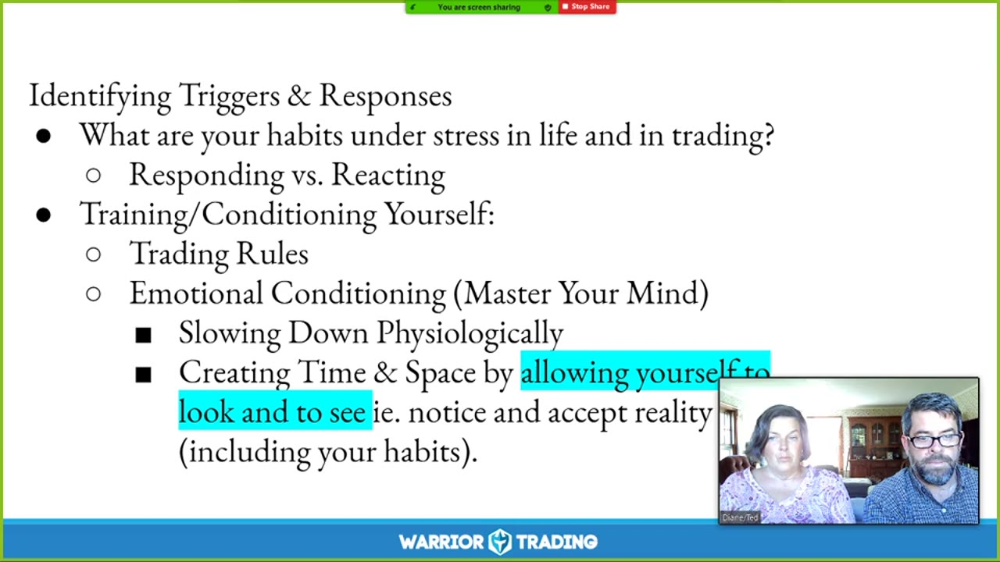

**图怎么看：**

- 这张幻灯片详细介绍了情绪反应在交易中的影响，并提出了通过训练和条件化自己来改善的方法。
- 幻灯片强调了识别触发因素和响应方式的重要性，以及如何通过交易规则和情感条件反射来控制自己的情绪。
- 幻灯片还提到了减缓生理反应和创造时间和空间来观察和接受现实（包括自己的习惯）的方法。
- 这些方法旨在帮助交易者更好地理解自己的情绪反应，从而做出更明智的交易决策。

### 关键内容

- 情绪反应可能导致交易者进入反应模式而非响应模式。
- 识别触发因素和习惯有助于更好地管理情绪。
- 通过冥想和呼吸练习可以减缓情绪反应。
- 交易者需要识别自己的压力源，并采取措施缓解。
- 情绪反应可能源于过去的经历和信念。
- 交易者需要区分内部和外部因素，以更好地应对压力。
- 通过自我反思和冥想，可以更好地理解自己的情绪反应。
- 交易者需要建立应对情绪反应的策略。
- 交易者需要认识到自己的情绪反应模式，并尝试改变。
- 交易者需要保持耐心，逐步改善情绪管理能力

### 分析与执行顺序

1. 讲师首先介绍了情绪反应如何影响交易决策。
2. 然后引导参与者识别触发因素和习惯。
3. 接着介绍了冥想和呼吸练习的方法。
4. 最后，鼓励参与者进行自我反思和冥想练习。
5. 通过案例分析，展示了如何识别和应对情绪反应。
6. 讲师强调了识别压力源和采取措施的重要性。
7. 通过提问和讨论，帮助参与者更好地理解情绪反应模式

### 案例与细节

- 一位参与者提到，当交易表现不佳时，会感到梦想在滑落，这反映了情绪反应如何影响交易决策。
- 另一位参与者提到，当心率升高时，会感到冲动，这表明情绪反应如何导致冲动行为。
- 讲师提到了一个关于调整止损水平的问题，说明了如何通过思考和感觉来评估概率。
- 一位参与者分享了自己在从模拟交易转向真实交易时遇到的压力，这反映了情绪反应如何因情境变化而变化。
- 讲师提到了一个关于手术室的例子，说明在高度紧张的情况下，情绪反应如何影响决策

### 风险与边界

- 录制于2020年，部分信息可能不再适用。
- 交易环境和市场条件不断变化，需结合当前情况灵活应用。
- 情绪反应可能因个体差异而异，需个性化调整策略。
- 市场波动可能导致情绪反应加剧，需谨慎应对。
- 交易者需要持续学习和实践，以提高情绪管理能力

### 复盘问题

- 你如何识别自己的情绪反应模式？
- 你如何通过冥想和呼吸练习来减缓情绪反应？
- 你如何区分内部和外部因素，以更好地应对压力？
- 你如何制定应对情绪反应的策略？
- 你如何通过自我反思来改进情绪管理能力？

---

## v0975：情绪管理在交易中的应用

> 日期：2020-10-16　·　时长：01:00:36

**本场重点：** 情绪波动如何影响交易决策，以及如何通过冥想和呼吸练习来管理这些情绪。

**图怎么看：**

- 这张幻灯片展示了心中心冥想的四个核心品质：平等、慈悲、同情和喜悦。
- 幻灯片上还显示了Zoom会议界面，表明这是一个在线研讨会。
- 幻灯片上的文字提供了关于如何通过冥想和呼吸练习管理情绪波动的信息。
- 幻灯片右下角显示了参与者列表，包括主持人Ted/Diane和嘉宾Matthew Punches。

### 关键内容

- 情绪冲动和习惯模式是交易中常见的问题，需要通过冥想和呼吸练习来管理。
- 情绪冲动源于本能反应，需要学会转向这些情绪而不是逃避。
- 通过呼吸练习可以缓解紧张感，帮助交易者更好地集中注意力。
- 交易者需要识别自己的情绪触发点，并以友善的方式对待这些情绪。
- 通过调整交易策略和风险管理，可以减少冲动交易的发生。
- 情绪管理需要时间和耐心，逐步建立对交易系统的信任。
- 交易者需要认识到自己的情绪反应，并学会自我同情。
- 通过练习和反思，可以逐步改善交易表现。
- 交易者需要关注自己的交易习惯，避免过度交易和冲动交易

### 分析与执行顺序

1. 首先，通过分享John Wellwood的引用来引入情绪管理的重要性。
2. 然后，进行一次简短的冥想练习，帮助参与者放松。
3. 接着，讨论情绪冲动和习惯模式如何影响交易决策。
4. 之后，介绍如何通过呼吸练习来缓解紧张感。
5. 最后，鼓励参与者识别自己的情绪触发点，并以友善的方式对待这些情绪

### 案例与细节

- 一位交易者提到，他每天早上登录电脑的时间是格林尼治标准时间7点，同时照顾一岁大的儿子。
- 另一位交易者分享了自己如何通过调整最大亏损来减少焦虑，从而改善交易体验。
- 通过调整交易策略，一位交易者设定了新的风险参数，以减少冲动交易的发生。
- 一位交易者描述了自己如何通过冥想和呼吸练习来缓解交易前的紧张感。
- 一位交易者分享了自己如何通过调整交易策略来减少冲动交易的发生，从而提高交易表现

### 风险与边界

- 交易环境的变化可能会影响情绪管理的效果，因此需要持续调整策略。
- 交易者的情绪反应可能因市场变化而有所不同，需要灵活应对。
- 录制年代限制为2020年，当前市场环境可能与当时有所不同。
- 交易者需要根据自身情况调整策略，避免过度依赖单一方法

### 复盘问题

- 交易者如何识别自己的情绪触发点？
- 交易者在交易前进行了哪些呼吸练习来缓解紧张感？
- 交易者如何通过调整交易策略来减少冲动交易的发生？
- 交易者在交易过程中如何保持自我同情？
- 交易者如何通过冥想和呼吸练习来改善交易表现？

---

## v0976：使用仁慈接受和仁慈同情来释放情绪反应模式

> 日期：2020-10-23　·　时长：01:00:24

**本场重点：** 通过接受现实和培养自我同情来改善情绪管理，尤其在交易中遇到困难情绪时。

**图怎么看：**

- In her book "Radical Compassion," Tara Brach talks about a Trance of Suffering we are all prone to getting stuck in. It's like getting lost in a dense forest of our lives.
- Entangled in incessant worry or planning, absorbed in harsh judgements of ourselves or others, and getting overwhelmed by our busy striving to meet demands and solve problems.
- In trading, this trance can take us into those emotionally hijacked places where we're crippled by self-doubt and hesitation, swept up in impulsivity, overcome by FOMO, or find ourselves giving in to revenge trading or a long run of over trading.

### 关键内容

- 冥想练习帮助参与者注意到自己的呼吸和身体感受，从而更好地理解内在体验。
- 通过接受和同情自己，可以减少交易中的情绪反应，提高决策质量。
- 交易中的情绪反应模式往往源于对现实的误解和对自我的苛责。
- 通过练习，可以逐步减少对负面情绪的抵抗，增加对积极情绪的接纳。
- 接受和同情是克服交易中情绪反应的关键步骤，有助于建立更健康的心理状态。
- 通过自我反思和练习，可以逐步改变交易中的情绪反应模式，提高交易表现。
- 交易中的情绪反应模式通常源于对失败的恐惧和对成功的渴望。
- 通过练习接受和同情，可以减少交易中的情绪波动，提高决策的稳定性。
- 接受和同情不仅适用于交易，也适用于生活中的其他方面，有助于建立更健康的人际关系

### 分析与执行顺序

1. 引导参与者进行冥想练习，注意呼吸和身体感受。
2. 通过自我反思，识别当前的情绪反应模式。
3. 练习接受和同情自己，减少对负面情绪的抵抗。
4. 通过练习，逐步减少对情绪反应的过度反应。
5. 分享具体的交易场景，展示如何应用接受和同情的方法来改善情绪管理。
6. 讨论如何将接受和同情的原则应用于日常生活，以促进更健康的心态

### 案例与细节

- 在交易中，当市场走势不符合预期时，可能会产生焦虑和恐惧的情绪。
- 通过冥想练习，可以更好地控制这些情绪，减少冲动交易的行为。
- 当交易结果不佳时，可能会产生自我批评的情绪，通过接受和同情自己，可以减少这种情绪。
- 在交易中，当市场走势突然变化时，可能会产生紧张和不安的情绪。
- 通过接受和同情自己，可以更好地应对这些情绪，减少对市场的过度反应

### 风险与边界

- 交易中的情绪反应模式可能根深蒂固，需要长期练习才能看到明显效果。
- 过度依赖接受和同情可能会导致对实际情况的忽视，需要平衡。
- 录制年代限制，部分信息可能不再适用当前市场环境。
- 接受和同情的方法可能不适合所有人，需要根据个人情况调整

### 复盘问题

- 在交易中，哪些情绪反应模式最常见？
- 如何通过接受和同情来减少交易中的情绪波动？
- 在日常生活中，如何实践接受和同情的原则？

---

## v0977：情绪管理在交易中的应用

> 日期：2020-10-30　·　时长：01:02:56

**本场重点：** 情绪管理是交易成功的关键，通过冥想和自我同情可以更好地应对市场波动。

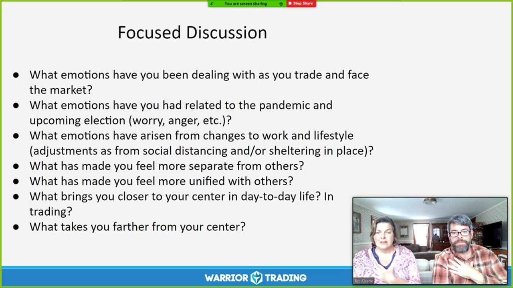

**图怎么看：**

- 这张幻灯片详细列出了在交易过程中需要关注的情绪问题，包括市场波动带来的情绪、疫情和选举相关的担忧、工作和生活方式变化引发的情感以及与他人的分离感和统一感。
- 幻灯片还介绍了Tonglen冥想作为一种培养慈悲、利他和勇气的西藏佛教冥想实践，帮助人们认识到自己的恐惧和愤怒，并消除对自己和他人的判断。
- 此外，幻灯片强调了在交易中保持开放心态的重要性，即没有预设的概念、期望和对可能性的开放态度，这有助于更好地理解和适应市场波动。
- 这些内容都直接支持了本场课程的重点，即通过情绪管理和冥想来提高交易的成功率。

### 关键内容

- 交易中情绪波动频繁，需要培养自我同情和开放心态。
- 利用冥想和开放心态可以帮助应对市场波动。
- 情绪管理对于新手尤其重要，可以帮助他们保持冷静。
- 市场波动时，新手容易陷入恐慌，而老手则能保持冷静。
- 通过练习同情心和开放心态，可以更好地应对市场变化。
- 市场波动时，新手更容易被情绪左右，而老手则能保持冷静。
- 通过冥想练习，可以提高对市场的适应能力。
- 市场波动时，新手需要学会放慢脚步，保持冷静。

### 分析与执行顺序

1. 首先，通过冥想练习帮助学员放松心情。
2. 然后，引导学员关注自己的情绪和身体感受。
3. 接着，教授学员如何通过自我同情来缓解紧张情绪。
4. 最后，通过练习同情心和开放心态，帮助学员更好地应对市场变化。
5. 在整个过程中，强调自我观察和自我调节的重要性。

### 案例与细节

- 在市场波动时，新手可能会因为担心损失而感到焦虑。
- 一位学员提到，在成功交易后，担心再次失败的心理压力。
- 另一位学员分享了在面对市场波动时，选择较小仓位进行交易的经验。
- 通过练习同情心和开放心态，学员们能够更好地应对市场变化。
- 一位学员提到，在面对市场波动时，选择暂时退出市场的经验。

### 风险与边界

- 市场环境的变化可能导致学员无法完全按照指导进行练习。
- 学员可能因为个人生活压力而难以集中注意力。
- 市场波动时，新手更容易受到情绪影响，而老手则能保持冷静。
- 录制年代限制，部分信息可能不再适用于当前市场环境。

### 复盘问题

- 在市场波动时，学员们是如何通过冥想练习来缓解情绪的？
- 通过练习同情心和开放心态，学员们能够更好地应对哪些市场情况？
- 在面对市场波动时，学员们是如何调整自己的交易策略的？

---

## v0978：交易策略与心理调节

> 日期：2020-11-06　·　时长：02:16:56

**本场重点：** 确保策略完善且个性化，避免冲动决策，建立信任系统。

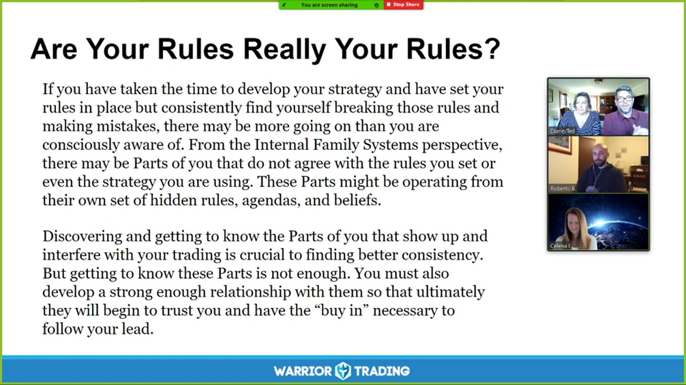

**图怎么看：**

- 整体界面显示Zoom会议界面，包含参与者列表和聊天功能。
- 页面上展示了一段关于交易策略与心理调节的内容，强调了制定和完善策略的重要性。
- 幻灯片内容涉及交易策略的制定、个人化、避免冲动决策以及建立信任系统。
- 图片中没有显示具体的交易数据或图表，仅提供文字信息。

### 关键内容

- 发展策略的重要性在于确保持续盈利，避免过多策略导致不一致。
- 写下策略和规则有助于识别漏洞，提高一致性。
- 专注一两个策略，通过反复练习建立肌肉记忆，减少压力下的失误。
- 系统性地设定盈利目标，明确何时退出交易，避免过长时间持有。
- 规则需个性化，根据个人策略定制，而非一刀切。
- 9:33 AM 规则避免早市前的交易，减少波动和假突破。
- 随着经验增长，逐步调整规则，使之成为计划的一部分。
- 技术点加仓仅在有意义的情况下进行，避免盲目操作。
- 遇到连续亏损时，容易进入忽视型模式，远离自己。
- 交易不应像机器人一样，而是要保持情感连接，处理内心部分需要友好的态度。
- 写下策略和规则有助于识别漏洞，提高一致性，确保策略的持续盈利。通过详细记录，可以更好地发现潜在问题并及时修正。
- 专注一两个策略，通过反复练习建立肌肉记忆，减少压力下的失误，从而提高交易效率和准确性。这需要时间和耐心，但长期来看能显著提升表现。
- 系统性地设定盈利目标，明确何时退出交易，避免过长时间持有，可以有效控制风险，防止因过度持有而导致的损失。这需要结合市场动态和个人经验灵活调整。
- 规则需个性化，根据个人策略定制，而非一刀切，这样可以更好地适应市场变化，提高交易的成功率。每个交易者的情况不同，因此规则也应有所不同。
- 9:33 AM 规则避免早市前的交易，减少波动和假突破，有助于降低交易成本，提高决策质量。这需要结合市场特点和个人经验来确定最佳交易时间。

### 分析与执行顺序

1. 首先，确保花时间真正理解并测试你的策略以实现持续盈利。
2. 其次，写下你的策略、计划和利润目标，识别漏洞，提高一致性。
3. 再次，专注一两个策略，测试其有效性，建立肌肉记忆。
4. 然后，系统性地设定盈利目标，明确何时退出交易，避免过长时间持有。
5. 最后，随着经验增长，逐步调整规则，使之成为计划的一部分，确保规则的演变是计划性的。

### 案例与细节

- 9:33 AM 规则：避免早市前的交易，减少波动和假突破。
- 最大亏损规则：达到最大亏损后停止交易，避免管理不当的损失。
- 技术点加仓：仅在有意义的技术点上加仓，避免盲目操作。
- 专制型自我管理：权威型父母既要求严格又富有同情心，而专制型父母则缺乏温暖。
- Carmen提到，她需要一套经过验证的规则，否则无法自信地应用。这说明规则的有效性对于交易者的信心至关重要，需要通过实践不断验证和完善。
- John表示自己刚开始交易，遇到一些问题，包括妻子的不满和自我批评。这说明家庭关系对交易者的情绪和决策有很大影响，需要妥善处理。
- Matthew分享了自己的第一周交易经历，包括内批评和社交场合的表现。这展示了交易过程中常见的心理挑战，需要通过自我反思和沟通来克服。

### 风险与边界

- 策略可能不够完善，需要更多时间磨练。
- 账户大小与风险管理无关，应根据技能水平而非账户大小来决定风险。
- 交易不应像机器人一样，忽视情感连接的重要性。
- 录制年代限制，平台、监管、税务和经纪商条件只能表述为历史录制内容。
- 策略可能不够完善，需要更多时间磨练，这可能导致初期交易表现不佳，影响信心。因此，持续测试和优化策略是必要的。
- 账户大小与风险管理无关，应根据技能水平而非账户大小来决定风险。这可能导致过度自信或过度谨慎，影响交易决策的合理性。
- 交易不应像机器人一样，忽视情感连接的重要性。这可能导致情绪失控，做出不理性的决策。因此，保持情感平衡是关键。
- 录制年代限制，平台、监管、税务和经纪商条件只能表述为历史录制内容。这可能影响当前交易环境的理解，需要结合最新信息进行调整。

### 复盘问题

- 如何确保策略的持续盈利？
- 写下策略和规则的具体好处是什么？
- 如何通过反复练习建立策略的肌肉记忆？
- 系统性地设定盈利目标的具体方法有哪些？
- 如何避免连续亏损后的冲动交易？

---

## v0979：情绪与交易：损失厌恶

> 日期：2020-11-13　·　时长：01:04:17

**本场重点：** 损失厌恶是交易中常见的认知偏差，影响决策，需通过正念练习和心理策略来应对。

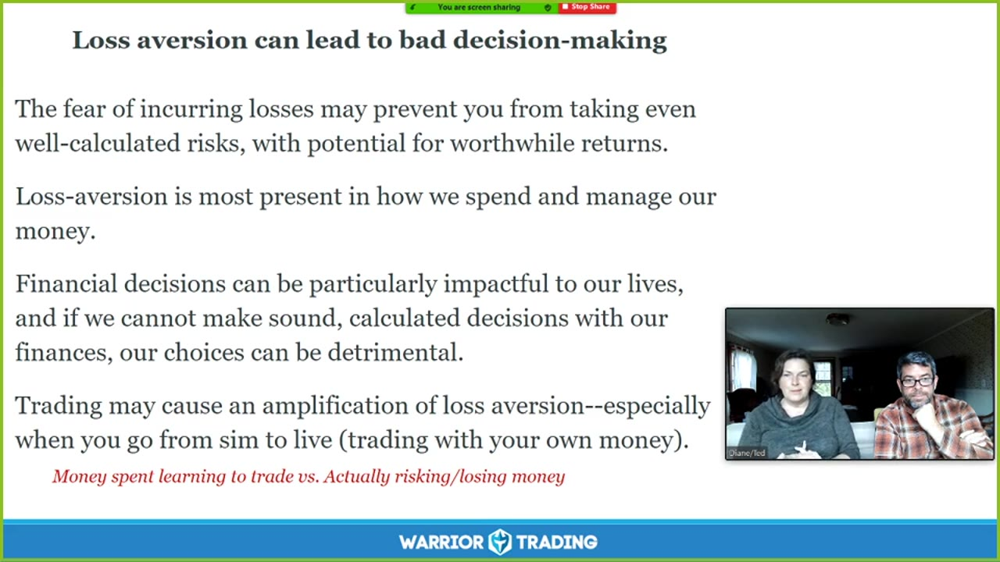

**图怎么看：**

- 文章详细介绍了损失厌恶对交易决策的影响。
- 它指出，恐惧亏损可能会阻止人们采取即使计算得当的风险，从而错过潜在的回报。
- 文章强调了财务决策在个人生活中的重要性，并指出如果无法做出明智、谨慎的财务决策，选择可能有害。
- 此外，文章还提到了交易中的损失厌恶放大效应，特别是在从模拟到现实（使用自己的钱进行交易）时。

### 关键内容

- 损失厌恶是一种认知偏差，使人们更害怕损失而非获得。
- 在交易中，损失厌恶可能导致过度保护和错误决策。
- 正念练习有助于识别和缓解损失厌恶带来的负面影响。
- 社会经济地位和文化背景也会影响个体的损失厌恶程度。
- 内在批评者是导致损失厌恶的一个重要因素。
- 通过重新框架和锚定，可以减轻损失厌恶的影响。
- 交易中的损失厌恶并非总是负面的，有时可以作为自我保护机制。
- 正念练习和自我同情有助于管理内在批评者。
- 交易中的损失厌恶需要长期关注和实践来克服。
- 正念练习可以帮助识别和理解内在批评者的动机

### 分析与执行顺序

1. 首先进行正念冥想，帮助学员放松和集中注意力。
2. 然后讨论损失厌恶的概念及其对交易决策的影响。
3. 接着分析不同社会经济和文化背景下的损失厌恶差异。
4. 进一步探讨内在批评者如何影响交易决策。
5. 最后，教授如何通过重新框架和锚定来减轻损失厌恶的影响

### 案例与细节

- 在一次实验中，参与者不愿意在公平条件下押注，因为损失厌恶使他们更害怕损失。
- 一个成功交易员在经历巨大盈利后，面对单日40,000美元的亏损时，由于有足够资金缓冲，损失的影响较小。
- 一个交易员在交易中不断遇到挫折，发现内在批评者的声音越来越强烈，影响了决策。
- 通过正念练习，一个交易员学会了识别内在批评者的出现，并尝试用积极的方式回应。
- 一个交易员在交易中遇到困难时，发现自己无法专注于当前情境，而是被过去的失败所困扰

### 风险与边界

- 录制年代限制，此内容基于2020年的市场环境和交易习惯。
- 正念练习的效果因人而异，可能需要持续实践才能见效。
- 内在批评者的存在是一个复杂的问题，需要深入探索其根源和动机
- 交易市场的变化可能导致某些策略不再适用

### 复盘问题

- 损失厌恶如何影响你的交易决策？
- 你如何识别和管理内在批评者的声音？
- 你是否尝试过通过重新框架和锚定来减轻损失厌恶的影响？

---

## v0980：自我交易研究

> 日期：2020-11-20　·　时长：00:59:05

**本场重点：** 通过自我交易研究，理解情绪波动对交易决策的影响，并培养自我同情。

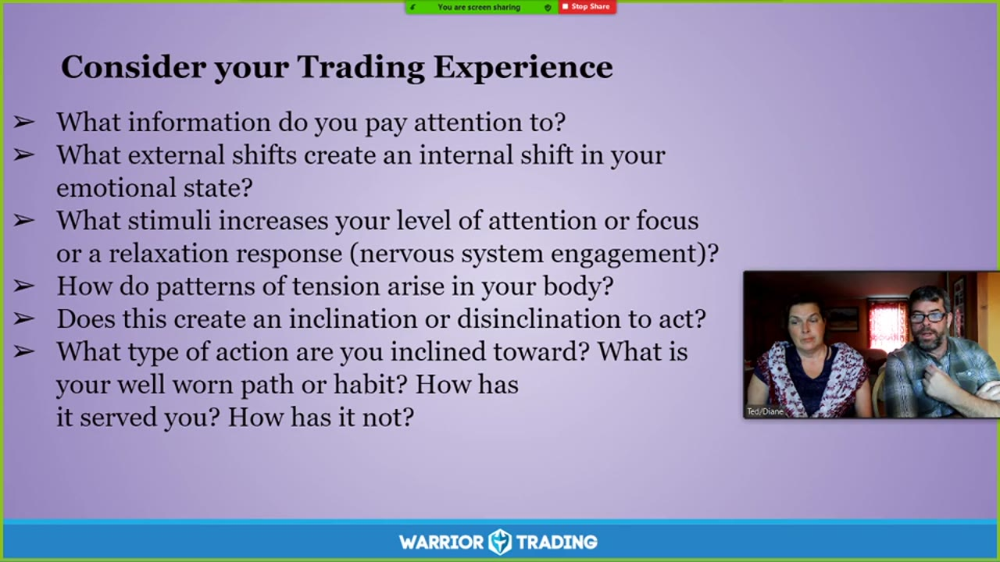

**图怎么看：**

- 这张幻灯片提出了几个问题，帮助参与者反思他们的交易经验，包括他们关注的信息、外部因素如何影响他们的情绪状态、刺激物如何影响他们的注意力或焦点、身体中的紧张模式以及这些模式是否影响他们的行动倾向。
- 这些问题旨在帮助参与者识别和理解情绪波动如何影响他们的交易决策，并培养自我同情。
- 幻灯片还提到了“有机性”这一概念，强调了生活中的自然智能和创造性，以及与机器相比，生物体的敏感性和参与性。
- 通过思考这些主题，参与者可以更好地理解和调整自己的交易过程，从而提高交易的成功率。

### 关键内容

- 交易者需要注意到自己在市场中的情绪波动，这些波动会影响交易决策。
- 通过冥想练习，可以更好地理解自己的情绪状态，从而做出更明智的交易决策。
- 交易者应该识别并接受自己的不同情绪状态，而不是仅仅关注盈利。
- 交易过程中，情绪波动会导致注意力集中度的变化，影响交易表现。
- 交易者可以通过调整交易策略来应对情绪波动带来的挑战。
- 交易者需要认识到自己是交易过程的一部分，而不是市场的被动参与者。
- 交易者应该培养自我同情，以更好地应对情绪波动带来的压力。
- 交易者可以通过练习有机性、正念和身心连接来提高交易表现。
- 交易者需要意识到交易过程中的情绪波动是正常的，不应过度担忧。
- 交易者应该学会在情绪波动时保持冷静，避免冲动交易。

### 分析与执行顺序

1. 讲师首先介绍了交易中的情绪波动，指出情绪波动会影响交易决策。
2. 然后，讲师引导观众进行冥想练习，帮助他们更好地理解自己的情绪状态。
3. 接着，讲师讨论了如何识别和接受不同的情绪状态，强调情绪波动是正常的。
4. 随后，讲师解释了有机性、正念和身心连接的概念，并提供了具体的练习方法。
5. 最后，讲师总结了交易者如何通过自我同情和练习来提高交易表现。

### 案例与细节

- 当交易者看到市场波动时，可能会感到兴奋或恐惧，这会影响他们的交易决策。
- 一位交易者在模拟交易中提高了交易规模，但感到无聊，这表明他可能需要调整交易策略。
- 另一位交易者在一次大亏损后，情绪波动加剧，导致他在接下来的交易中更加谨慎。
- 交易者在模拟交易中表现良好，但在真实交易中却感到紧张，这表明他们需要适应真实市场的环境。
- 一位交易者在交易过程中感到焦虑，通过深呼吸和放松练习来缓解情绪，从而改善交易表现。

### 风险与边界

- 交易者可能过于关注盈利，忽视了情绪波动对交易决策的影响。
- 交易者可能在真实交易中遇到更大的压力，导致情绪波动加剧。
- 交易者可能无法完全控制情绪波动，这会影响他们的交易表现。
- 交易者需要意识到，情绪波动是交易过程的一部分，不应过度担忧。
- 交易者需要不断练习和调整策略，以应对情绪波动带来的挑战。

### 复盘问题

- 交易者在交易过程中遇到了哪些情绪波动？
- 交易者是如何识别和接受这些情绪波动的？
- 交易者在模拟交易和真实交易中表现出的不同情绪状态是什么？
- 交易者是如何通过练习有机性和正念来提高交易表现的？

---

## v0981：接纳与交易心理

> 日期：2020-11-27　·　时长：00:56:38

**本场重点：** 接纳内心的不安，调整心态，逐步适应真实交易环境。

**图怎么看：**

- 在Zoom会议中，三位参与者正在进行一场关于接纳内心不安并调整心态以适应真实交易环境的讨论。
- 屏幕上的文字提供了关于接纳与交易心理的核心概念，强调了在当下时刻接受真实的自我和经历的重要性。
- 通过分享个人经验，参与者们探讨了如何通过接纳来释放痛苦的迷梦，并走向真正的自由。
- Tara Brach的观点被引用，指出接纳是一种内在的转变，能够帮助人们从恐惧和评判中解脱出来，实现真正的自由。

### 关键内容

- David在八个月的交易后，仍然缺乏耐心等待理想的交易机会，导致过度交易。
- 接纳内心的情绪，而不是试图压抑它们，可以帮助改善交易表现。
- 通过多角度看待自己，可以更好地理解内心的冲突。
- 交易过程中遇到的焦虑是正常的，不应视为异常。
- 通过呼吸练习和身体动作来缓解紧张情绪，帮助集中注意力。
- 接纳自己的不足，同时保持高标准，是成功的关键。
- 在模拟交易和真实交易之间找到平衡点，逐步适应真实市场。
- 保持耐心，逐步建立对市场的信心，避免过早进入真实交易环境。
- 通过自我反思和练习，提高交易心理素质，逐步克服恐惧和不安

### 分析与执行顺序

1. 主持人介绍今天的主题，邀请学生参与讨论。
2. 分享一首诗，强调接纳的重要性。
3. 主持人解释接纳的概念，包括多角度看待自己。
4. 通过呼吸练习和身体动作来缓解紧张情绪。
5. 邀请学生分享自己的经历和问题，进行针对性指导。
6. 总结接纳内心情绪的方法，鼓励学生实践。
7. 结束时提醒学生保持耐心，逐步适应真实交易环境

### 案例与细节

- David提到他在八个月的交易后，仍然无法等待理想的交易机会，导致过度交易。
- 主持人建议通过呼吸练习，如海洋声呼吸，来缓解紧张情绪。
- 主持人提到通过多角度看待自己，可以帮助理解内心的冲突。
- David分享了他在模拟交易和真实交易之间的经历，以及如何逐步适应。
- 主持人建议通过自我反思和练习，提高交易心理素质，逐步克服恐惧和不安

### 风险与边界

- 录制年代限制，适用于2020年的交易环境。
- 技术问题可能导致音频中断，影响交流效果。
- 心理调整需要时间，短期内可能看不到明显效果。
- 过度依赖心理调整，忽视实际操作技能提升的风险

### 复盘问题

- David的问题反映了哪些常见的交易心理问题？
- 接纳内心情绪的方法有哪些？
- 如何在模拟交易和真实交易之间找到平衡点？
- 在交易过程中，如何保持耐心和冷静？
- 通过哪些具体练习可以提高交易心理素质？

---

## v0982：情绪管理与资源状态

> 日期：2020-12-04　·　时长：00:59:22

**本场重点：** 通过冥想和自我关爱来管理情绪，提升交易表现。重点在于识别和培养内在资源。

**图怎么看：**

- 资源状态是一种意识状态，帮助我们连接自己并保持积极和有益的品质。
- 当我们处于资源状态时，我们会感到更加自信和有能力。
- 在资源状态下，我们会变得更加冷静、更集中，并且在自己的皮肤中感到更加舒适。
- 我们的思维会找到更大的清晰度。

### 关键内容

- 介绍了资源状态的概念，即恢复和平衡的状态。
- 强调了在交易中保持平衡和中心感的重要性。
- 分享了如何通过回忆美好经历来触发资源状态的方法。
- 讨论了如何通过自我对话来改善交易心态。
- 强调了在交易中保持开放心态和接受能力的重要性。
- 讨论了如何通过冥想来平衡情绪和恢复平静。
- 分享了如何通过自我反思来识别和解决内心的冲突。
- 讨论了如何通过冥想来接受和利用资源状态带来的礼物。

### 分析与执行顺序

1. 首先介绍了资源状态的概念，即恢复和平衡的状态。
2. 然后分享了Ari Goldfield的文章《Feel the Love Inside You》，强调自我关爱的重要性。
3. 接着讨论了如何通过冥想练习来培养自我关爱和自我同情。
4. 进一步讨论了如何通过回忆美好经历来触发资源状态的方法。
5. 最后分享了如何通过自我反思来识别和解决内心的冲突。

### 案例与细节

- 在交易中，资源状态可能与勇气、自信、专注、耐心和自我同情等情绪和心理体验相关。
- 分享了Ari Goldfield的文章《Feel the Love Inside You》，强调自我关爱的重要性。
- 讨论了如何通过冥想练习来培养自我关爱和自我同情。
- 分享了如何通过回忆美好经历来触发资源状态的方法，如在海滩上的经历。
- 讨论了如何通过自我反思来识别和解决内心的冲突，如对失败和损失的态度。

### 风险与边界

- 录制于2020年，部分信息可能不再适用。
- 交易环境和个人情况的变化可能导致某些方法不再有效。
- 自我关爱和自我同情需要长期实践才能见效。

### 复盘问题

- 在交易中，哪些情绪和心理状态最能帮助你成功？
- 如何通过冥想练习来培养自我关爱和自我同情？
- 在交易中遇到困难时，有哪些资源可以帮助你恢复平衡？
- 如何通过自我反思来识别和解决内心的冲突？

---

## v0983：自我领导力与情绪管理

> 日期：2020-12-11　·　时长：00:50:29

**本场重点：** 通过自我领导力，我们可以更好地管理情绪和决策，但需要认识到并非所有部分都是积极的。

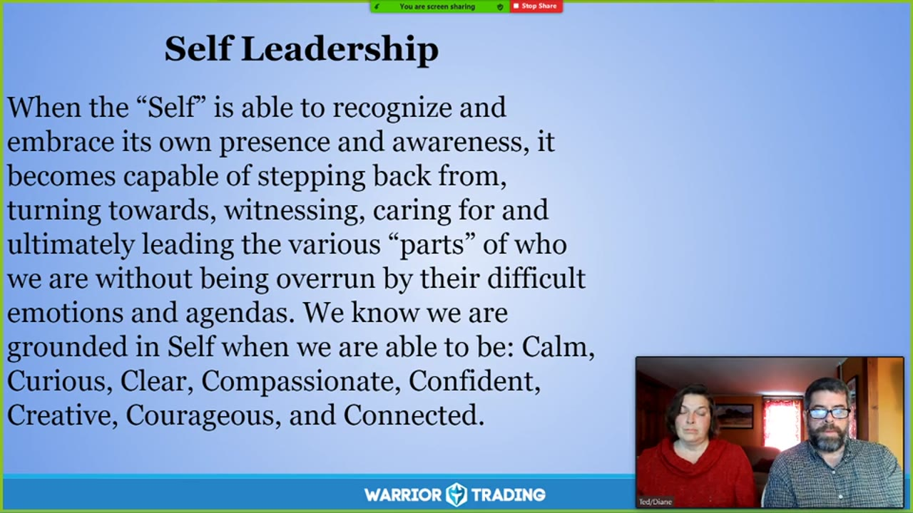

**图怎么看：**

- 当“Self”能够识别并拥抱自己的存在和意识时，它就能够从各种‘部分’中抽身出来，转向、见证、关怀，并最终引导这些部分，而不会被它们的困难情绪和议程所淹没。
- 我们知道自己处于“Self”状态，当我们能够保持冷静、好奇、清晰、慈悲、自信、创造力、勇气和连接时。
- 通过自我领导力，我们可以更好地管理情绪和决策，但需要认识到并非所有部分都是积极的。

### 关键内容

- 自我领导力是通过自我意识和觉察来领导自己。
- 自我领导力的核心是理解并接纳自己的情绪。
- 自我领导力有助于区分积极和消极的情绪。
- 自我领导力需要练习和耐心。
- 自我领导力可以帮助我们更好地应对市场波动。
- 自我领导力需要识别和接纳内心的不同部分。
- 自我领导力有助于建立更深层次的自我连接。
- 自我领导力需要区分有目标和无目标的部分。
- 自我领导力需要培养自我同情。

### 分析与执行顺序

1. 首先，通过冥想和自我反思来平静心灵。
2. 然后，识别并接纳内心的不同部分。
3. 接着，通过练习和自我对话来培养自我领导力。
4. 进一步，通过自我反省来理解不同部分的意图。
5. 最后，通过自我同情来促进内心的和谐。

### 案例与细节

- 在一次交易中，一个自信的部分试图控制局面，而另一个谨慎的部分则试图保持冷静。
- 当市场波动时，一个部分试图保护资金，而另一个部分则试图抓住机会。
- 在面对失败时，一个部分试图保持谦虚，而另一个部分则试图证明自己的价值。
- 在交易中，一个部分试图保持冷静，而另一个部分则容易激动。
- 在面对重大决策时，一个部分试图保持乐观，而另一个部分则感到焦虑。

### 风险与边界

- 自我领导力需要长期练习，短期内可能看不到明显效果。
- 自我领导力需要识别和接纳内心的不同部分，这可能需要时间和耐心。
- 自我领导力需要区分有目标和无目标的部分，这可能会影响决策过程。
- 自我领导力需要培养自我同情，这可能需要改变对失败的看法。
- 录制年代限制为2020年，部分信息可能不再适用。

### 复盘问题

- 在交易中，哪些部分是你最常遇到的？
- 如何区分有目标和无目标的部分？
- 在面对市场波动时，你是如何保持冷静的？
- 如何通过自我领导力来提高交易表现？
- 在日常生活中，你如何应用自我领导力？

---

## v0984：交易与关系的心理学

> 日期：2020-12-18　·　时长：00:59:23

**本场重点：** 交易和关系相互影响，需要处理内部批评和外部压力，以保持健康的关系。

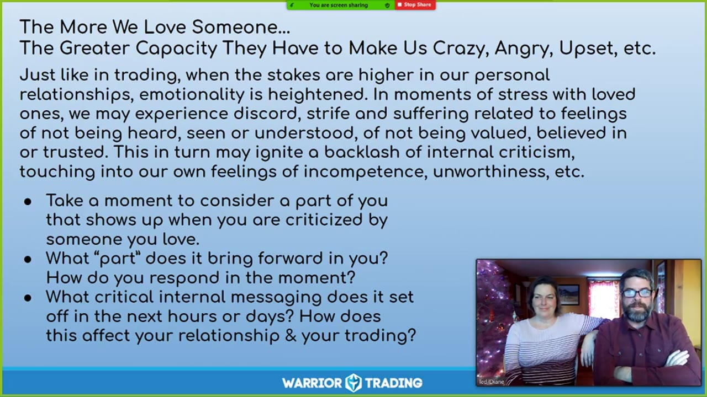

**图怎么看：**

- 这张幻灯片详细讨论了交易和关系之间的相互影响，强调了在亲密关系中，当交易涉及高风险时，情绪会变得高度紧张。
- 它指出，在与爱人发生冲突时，人们可能会经历不被理解、不被重视或不被信任的感觉，这可能导致内部批评和自我怀疑。
- 幻灯片还提出了几个问题，帮助参与者反思自己在受到爱人批评时的感受，并探讨这些感受如何影响他们的关系和交易。
- 此外，幻灯片还提到了沟通风格预测关系失败的“四匹马”理论，包括批评、轻视、防御和回避。

### 关键内容

- 交易和关系相互影响，需要处理内部批评和外部压力。
- 交易中的批评和负面情绪可能影响个人关系，甚至导致冲突。
- 在交易和关系中，需要识别和处理自己的情绪反应。
- 在交易和关系中，需要识别和处理对方的情绪反应。
- 在交易和关系中，需要学会识别和处理对方的情绪反应。

### 分析与执行顺序

1. 首先，讨论了交易和关系如何相互影响。
2. 接着，分析了交易中的批评和负面情绪如何影响个人关系。
3. 然后，探讨了如何识别和处理自己的情绪反应。
4. 进一步讨论了如何识别和处理对方的情绪反应。
5. 最后，强调了在交易和关系中保持健康情绪的重要性。

### 案例与细节

- 当交易伙伴批评我时，我会感到被攻击，开始自我怀疑。
- 我的父母担心我在交易中的不稳定，这让我感到压力。
- 我的妻子支持我在交易失败时，这让我感到安心。
- 我的朋友认为我不应该谈论我的交易，这让我感到孤立。
- 我的父母总是批评我在交易中的表现，这让我感到沮丧。

### 风险与边界

- 交易和关系中的批评和负面情绪可能引发长期的心理压力。
- 交易中的批评和负面情绪可能影响个人关系，导致冲突。
- 交易中的批评和负面情绪可能引发内部自我批评，导致情绪波动。
- 交易中的批评和负面情绪可能引发对方的防御性反应。
- 交易中的批评和负面情绪可能引发对方的攻击性反应。
- 交易中的批评和负面情绪可能引发对方的冷漠反应。

### 复盘问题

- 在交易中遇到批评时，你的反应是什么？
- 你的伴侣在交易中批评你时，你会如何回应？
- 如何在交易和关系中保持健康的情绪？
- 在交易中遇到批评时，你如何处理自己的情绪？
- 如何在交易和关系中识别和处理对方的情绪？

---

## v0985：解锁同情心以恢复平衡与自我领导

> 日期：2020　·　时长：01:01:20

**本场重点：** 在市场波动中保持冷静，通过同情心恢复平衡和自我领导。

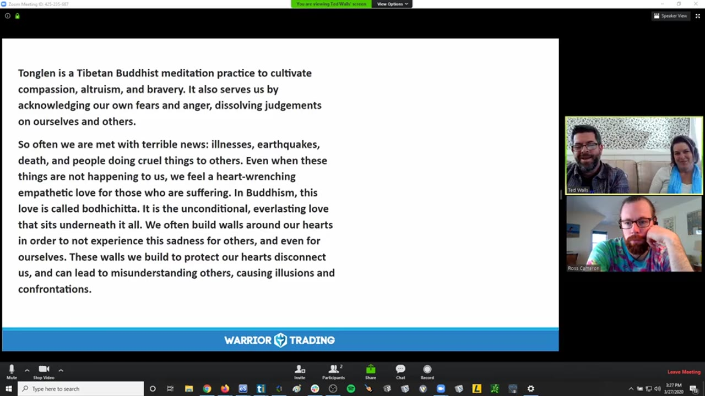

**图怎么看：**

- Tonglen is a Tibetan Buddhist meditation practice that aims to cultivate compassion, altruism, and bravery.
- This practice helps individuals acknowledge their own fears and anger, dissolve judgments on themselves and others.
- In Buddhism, this love is called bodhichitta, which is the unconditional, everlasting love that sits underneath it all.
- By practicing Tonglen, one can break the walls around their heart and experience empathy for those in need.

### 关键内容

- 市场波动导致情绪波动，影响决策。
- 通过练习同情心，可以更好地应对市场波动带来的挑战。
- 自我领导的概念帮助我们找到内心的平衡。
- 通过练习同理心，可以缓解情绪压力，恢复内心的平静。
- 市场波动中，情绪管理是成功的关键。
- 通过练习同理心，可以更好地理解自己和他人的感受。
- 同理心可以帮助我们放下过去的错误，向前看。
- 同理心练习有助于我们更好地理解市场波动带来的挑战。

### 分析与执行顺序

1. 讲师首先介绍了市场波动的情况，强调了情绪管理的重要性。
2. 然后，讲师介绍了同理心的概念，并解释了如何通过练习同理心来缓解情绪压力。
3. 接着，讲师带领大家进行了一次简短的冥想练习，帮助大家放松。
4. 最后，讲师分享了一些具体的例子，说明如何通过同理心练习来应对市场波动带来的挑战。
5. 在整个过程中，讲师强调了同理心练习的重要性，以及它如何帮助我们更好地应对市场波动带来的挑战。

### 案例与细节

- 市场在一个月内下跌了30%，创下了历史记录。
- 讲师提到，当他在刚开始交易时，会因为情绪波动而做出冲动的决定，导致大额亏损。
- 一位新学员提到，他最近在交易中感到焦虑，担心无法最大化利用市场机会。
- 另一位学员提到，他最近在交易中感到兴奋，但同时也感到紧张，担心自己的表现。
- 讲师分享了一个例子，说明如何通过隐藏利润和损失来减少情绪波动的影响。

### 风险与边界

- 录制于2020年，当时的市场环境和规则可能已发生变化。
- 同理心练习的效果因人而异，需要持续实践。
- 市场波动带来的挑战可能会持续存在，需要不断调整策略。
- 同理心练习可能无法完全消除情绪波动，需要结合其他方法。

### 复盘问题

- 市场波动期间，你如何管理自己的情绪？
- 你是否尝试过通过同理心练习来缓解情绪压力？
- 你在交易中遇到的主要挑战是什么？

---

## v0986：交易中的自我怀疑、犹豫、冲动与自信

> 日期：2020　·　时长：01:06:11

**本场重点：** 交易中常见的心理障碍及其克服方法；分享个人经验以提高交易技能。

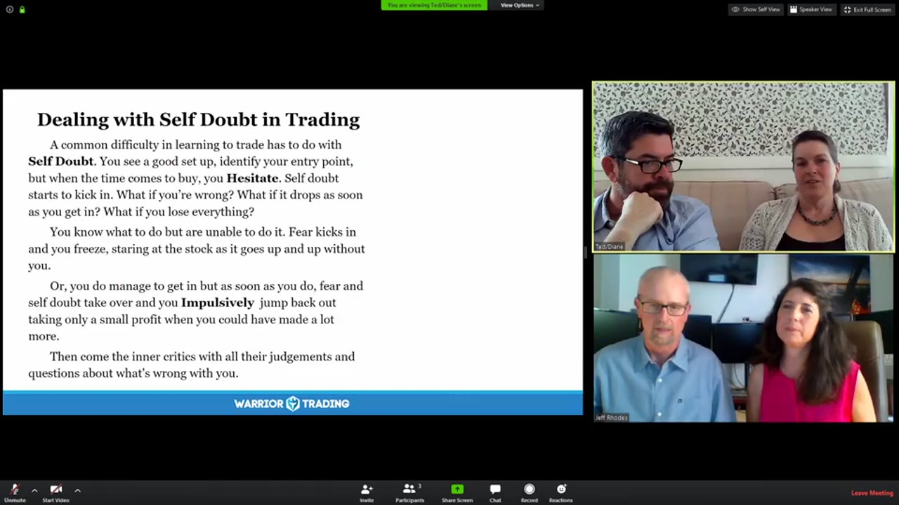

**图怎么看：**

- 这张图片展示了交易课程中的一个关键部分，讨论了交易者在面对市场波动时可能遇到的心理障碍，如自我怀疑、犹豫和冲动。
- 通过分享个人经验，参与者可以更好地理解这些心理障碍，并学习如何克服它们，从而提高交易技能。
- 图片中显示了一段关于交易中常见心理障碍的文字，强调了自我怀疑、犹豫和冲动对交易者的影响。
- 这有助于学员们认识到自己的弱点并采取措施改进，提升交易表现。

### 关键内容

- 交易中常见的心理障碍包括自我怀疑、犹豫、冲动和自信过度。
- 这些心理障碍往往源于相似的心理根源，如恐惧和自我批评。
- 通过冥想和呼吸练习来缓解这些心理障碍，帮助恢复冷静。
- 自我怀疑和犹豫通常表现为对不确定性和风险的恐惧。
- 冲动则表现为试图通过行动消除任何软弱的怀疑。
- 交易者需要接受错误带来的情感后果，才能摆脱这些心理障碍。
- 保持中心状态，避免情绪化交易，是克服这些心理障碍的关键。
- 分享个人经历，如自我批评和失败恐惧，有助于理解这些心理障碍。
- 通过呼吸练习和冥想，可以缓解情绪波动，恢复冷静

### 分析与执行顺序

1. 主持人介绍今天的主题：自我怀疑、犹豫、冲动和自信。
2. 主持人邀请 Jeff 和 Joanna 分享他们的交易经验和心理障碍。
3. Jeff 和 Joanna 分享他们在交易中遇到的自我怀疑和犹豫的情况。
4. 主持人引导大家进行冥想和呼吸练习，以缓解心理压力。
5. 分享个人经验，如自我批评和失败恐惧，帮助理解这些心理障碍。
6. 通过练习和反思，逐步建立对交易的信心。
7. 使用呼吸练习和冥想来缓解情绪波动，恢复冷静

### 案例与细节

- Jeff 在交易中遇到犹豫的情况，担心犯错，导致错过机会。
- Joanna 在交易中遇到冲动的情况，急于抓住机会，导致亏损。
- Jeff 和 Joanna 通过冥想和呼吸练习来缓解心理压力，恢复冷静。
- Jeff 和 Joanna 分享他们如何通过练习和反思来逐步建立对交易的信心。
- 通过呼吸练习和冥想，Jeff 和 Joanna 能够更好地控制情绪波动，避免冲动和犹豫。
- Jeff 和 Joanna 通过分享个人经历，帮助其他交易者理解这些心理障碍

### 风险与边界

- 录制于 2020 年，部分信息可能不再适用。
- 呼吸练习和冥想的效果因人而异，不一定适用于所有人。
- 自我批评和失败恐惧可能根深蒂固，难以立即克服。
- 交易市场不断变化，需要持续学习和适应新的市场环境

### 复盘问题

- Jeff 和 Joanna 分享了哪些具体的交易经验？
- 冥想和呼吸练习如何帮助他们缓解心理压力？
- 如何通过练习和反思逐步建立对交易的信心？
- 呼吸练习和冥想在实际交易中起到了什么作用？
- 个人经历如何帮助理解这些心理障碍？

---

## v0987：交易心理：克服自我怀疑、犹豫、冲动和过度自信

> 日期：2020　·　时长：01:05:16

**本场重点：** 交易心理如何影响决策，以及如何通过自我反思和情感管理来优化交易表现。

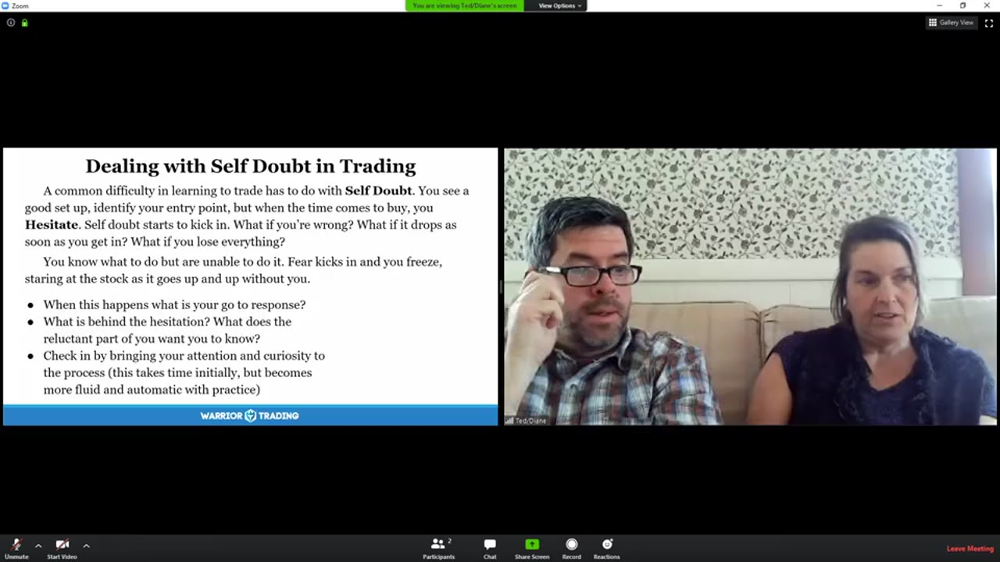

**图怎么看：**

- 交易中的一个常见困难与自我怀疑有关。
- 当你看到一个好的交易机会，确定你的入场点时，但当该时机到来时，你会犹豫。
- 自我怀疑开始发挥作用。如果你错了会怎样？如果它在你进入后不久就下跌了呢？或者你会输掉一切呢？

### 关键内容

- 自我怀疑是交易中常见的难题，它会导致犹豫和冲动。
- 通过自我反思和情感管理可以克服这些心理障碍。
- 交易者需要识别触发自我怀疑的因素，并采取措施应对。
- 过度自信可能导致决策失误，而自我怀疑则有助于保持谨慎。
- 交易者可以通过练习冥想、瑜伽等方法来提高情绪管理能力。
- 交易心理影响交易表现，需要持续关注和改进。
- 交易者需要认识到自我怀疑和过度自信都是内心的一部分，需要平衡。
- 交易者可以通过回顾错误来提高自我意识和决策能力。
- 交易心理训练可以帮助新手交易者更好地理解市场和自己。

### 分析与执行顺序

1. 主持人介绍FOMO Friday的主题，即交易心理。
2. 讲师介绍自我怀疑、犹豫、冲动和过度自信之间的关系。
3. 讲师通过实例说明这些心理因素如何影响交易决策。
4. 讲师指导交易者如何识别和应对这些心理因素。
5. 讲师分享如何通过冥想和自我反思来改善交易心理。
6. 讲师回答观众的问题，进一步解释交易心理的重要性

### 案例与细节

- 一位交易者在看到好的交易机会时犹豫不决，担心会犯错，这导致他错过了最佳时机。
- 另一位交易者过于自信，忽视了市场风险，最终导致亏损。
- 通过练习冥想，一位交易者学会了更好地控制自己的情绪，减少了冲动交易。
- 一位交易者在模拟交易中表现良好，但在实际交易中却频繁出现失误，这表明心理状态对实际交易有重要影响。
- 一位交易者通过回顾过去的错误，发现自我怀疑和过度自信是导致决策失误的主要原因

### 风险与边界

- 交易心理训练的效果因人而异，需要长期坚持。
- 过度依赖心理训练可能忽视实际操作技能的提升。
- 交易心理训练需要结合实际情况进行，不能一概而论。
- 交易心理训练的效果受到市场环境变化的影响。
- 交易心理训练需要结合个人性格特点进行，不能一刀切

### 复盘问题

- 交易者在面对自我怀疑时通常会有哪些反应？
- 如何通过自我反思来识别和应对自我怀疑？
- 交易者可以通过哪些方法来提高情绪管理能力？
- 交易心理训练对新手交易者有何帮助？
- 交易心理训练的效果如何评估？

---

## v0988：交易中的内心批评者

> 日期：2020　·　时长：01:03:53

**本场重点：** 内心批评者在交易中如何影响决策，如何识别并应对这些批评者。

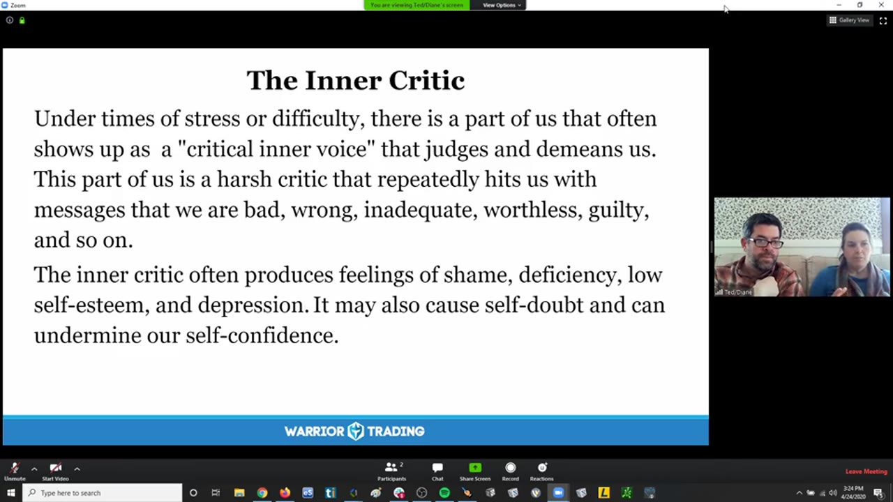

**图怎么看：**

- 描述了内心的批评者在压力或困难时期出现的情况，它会用负面的言语评判和贬低自己。
- 这种批评者反复地向我们传达我们是坏的、错误的、不足够的、无价值的、内疚的等信息。
- 内心的批评者常常导致羞愧感、缺乏感、低自尊心和抑郁情绪，并可能引起自我怀疑，从而削弱自信。
- 在交易中，这种内心的批评者会影响决策，因为它会不断质疑自己的能力，导致焦虑和恐惧。

### 关键内容

- 内心批评者是交易中常见的负面声音，它会评判、羞辱交易者。
- 内心批评者通常表现为完美主义者、任务管理者等角色。
- 识别内心批评者的方法是注意那些负面自我对话。
- 内心批评者源于早期经历，可能与家庭环境有关。
- 通过练习自我同情，可以减轻内心批评者的负面影响。
- 记录交易过程中的情绪触发点有助于识别内心批评者的模式。
- 通过外部化内心批评者的语言，可以更好地理解和应对它们。
- 长期工作可以减少内心批评者的控制力

### 分析与执行顺序

1. 讲师首先介绍了内心批评者的概念及其在交易中的作用。
2. 然后讲解了不同类型的内心批评者，如完美主义者、任务管理者等。
3. 接着分享了识别内心批评者的技巧，包括注意负面自我对话。
4. 讲师还提到了记录交易过程中的情绪触发点的方法。
5. 最后，讲师强调了理解内心批评者的动机有助于更温和地对待自己。
6. 整个过程中，讲师通过实例说明了如何识别和应对内心批评者。
7. 讲师还提供了练习自我同情的方法，以减轻内心批评者的负面影响

### 案例与细节

- 一位交易者在盈利时却无法卖出，因为担心成为亏损交易。
- 一位交易者在交易中过于谨慎，担心失败，导致错过机会。
- 一位交易者在交易中感到焦虑，不断检查图表，难以做出决定。
- 一位交易者在交易中感到沮丧，因为担心被他人失望。
- 一位交易者在交易中感到内疚，因为担心伤害他人感情

### 风险与边界

- 内心批评者可能在交易中导致犹豫、冲动或自我怀疑。
- 过度关注内心批评者可能导致交易表现不佳。
- 理解内心批评者的动机有助于更温和地对待自己。
- 录制年代限制为2020年，因此某些市场条件可能已发生变化。
- 内心批评者可能因市场波动而加剧，需要持续关注

### 复盘问题

- 识别内心批评者的技巧有哪些？
- 如何通过自我同情减轻内心批评者的负面影响？
- 记录交易过程中的情绪触发点有何帮助？

---
