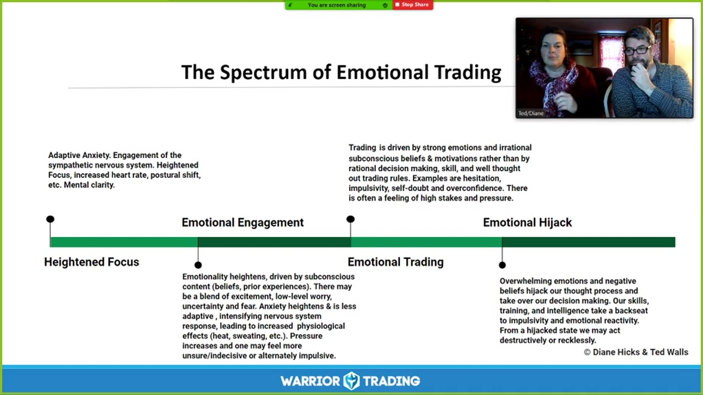
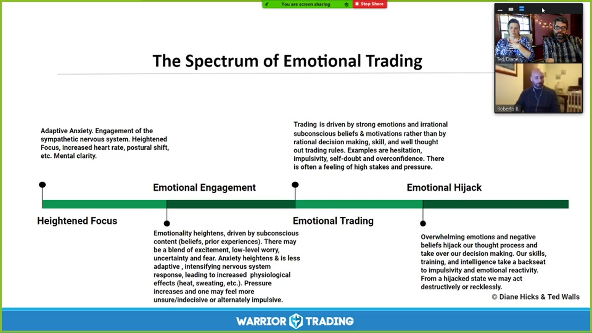
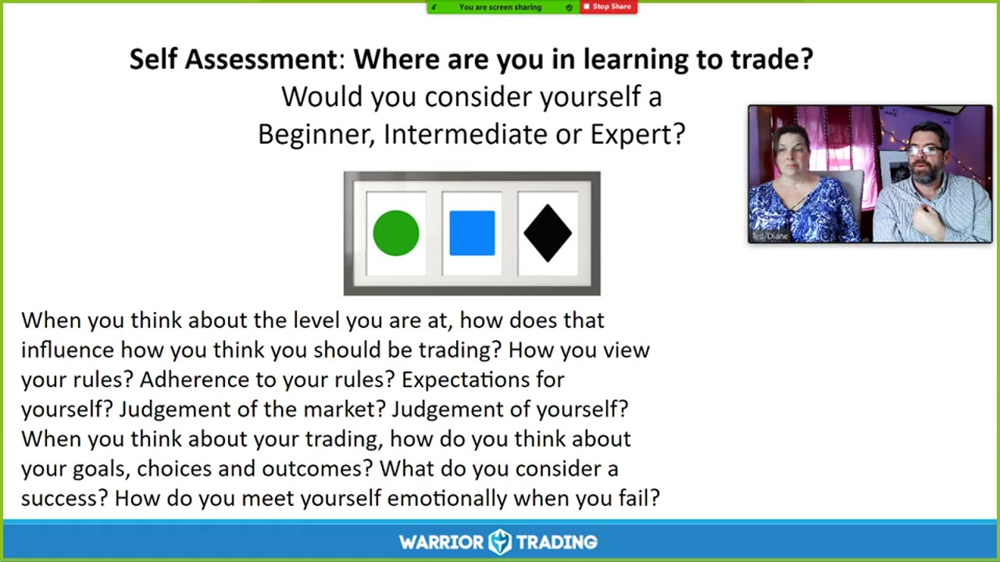
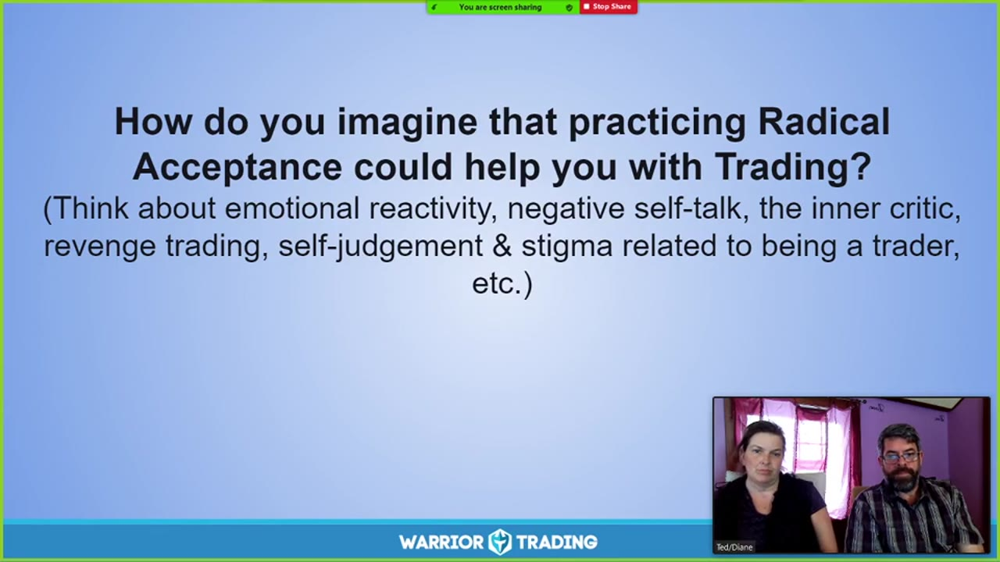
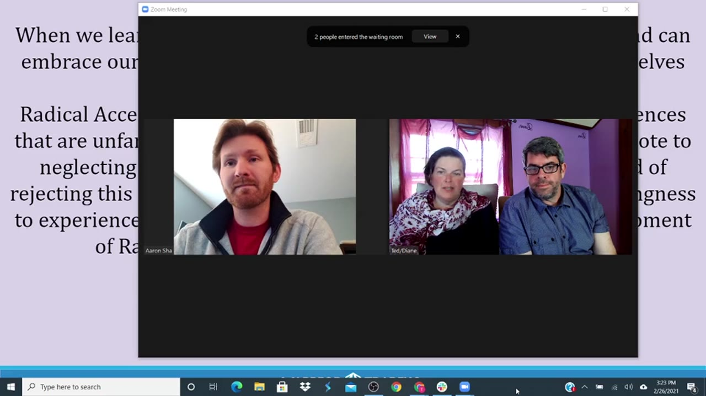
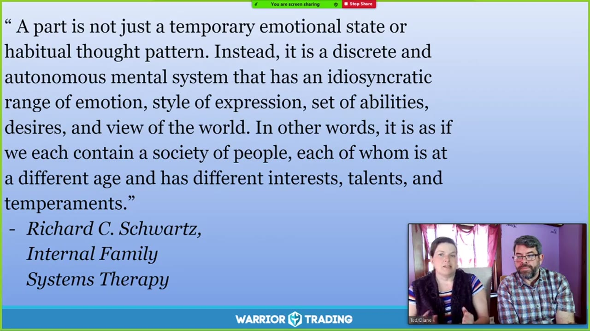
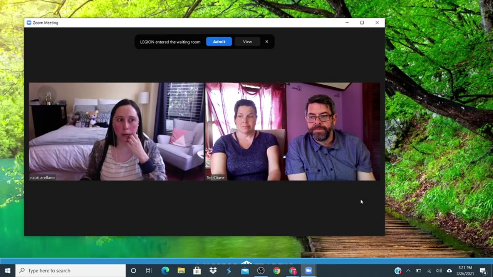
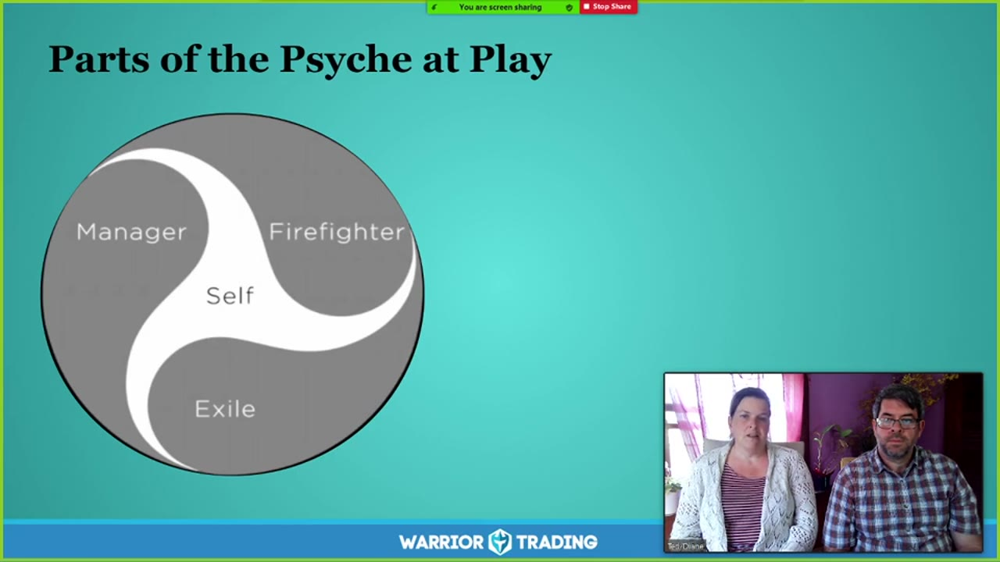
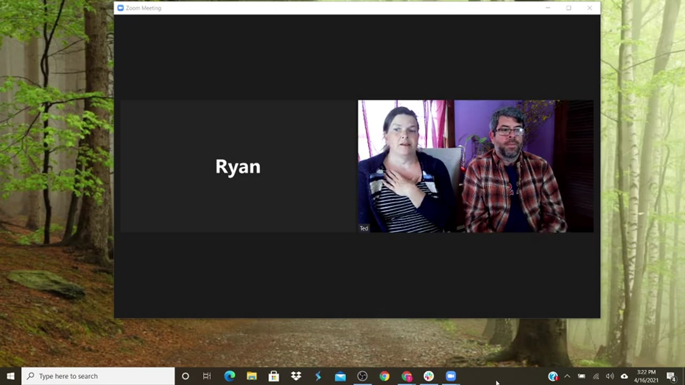
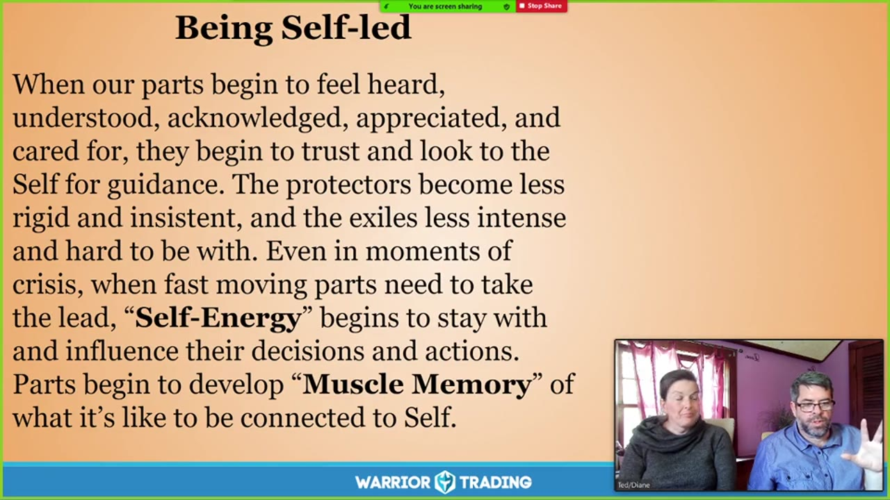

# FOMO Friday：2021

> 17 场，合计 17.2 小时。返回 [FOMO Friday 目录](../README.md)。

## v0989：情绪劫持与情绪交易

> 日期：2021-01-08　·　时长：01:02:29

**本场重点：** 情绪劫持会导致决策失误，而通过冥想可以恢复冷静，但需要长期练习。

**图怎么看：**

- 这张幻灯片详细描述了情绪交易的三个阶段：高度聚焦、情绪参与和情绪劫持。
- 在高度聚焦阶段，情绪的高度化驱动于潜意识内容（信念、先前经验等）。这可能包括兴奋、低水平的担忧、不确定性和恐惧。
- 情绪参与阶段，焦虑增强且不太适应性，导致神经系统的反应增加，生理效应（如发热、出汗等）增加。
- 情绪劫持阶段，强烈的情绪和负面信念接管我们的思维过程，使我们从理性决策中脱身，可能导致破坏性或鲁莽的行为。

### 关键内容

- 情绪劫持会触发本能反应，导致决策失误。
- 通过冥想可以恢复冷静，但需要长期练习。
- 情绪劫持通常发生在极端事件或日常交易中。
- 情绪交易会影响决策，导致冲动或犹豫。
- 长期压力会加剧情绪劫持的可能性。
- 交易新手更容易受到情绪影响。
- 情绪劫持会破坏决策过程，导致错误行动。
- 通过冥想可以识别和缓解情绪劫持。
- 情绪交易会影响交易表现，导致波动性增加。
- 长期练习可以帮助减少情绪影响

### 分析与执行顺序

1. 首先介绍情绪劫持的概念及其影响。
2. 然后解释情绪劫持是如何触发本能反应的。
3. 接着讨论如何通过冥想来缓解情绪劫持。
4. 最后强调长期练习的重要性以减少情绪影响。
5. 通过实例说明情绪劫持的具体表现和后果。
6. 分享冥想练习的具体步骤和方法。
7. 总结情绪劫持对交易的影响及应对策略

### 案例与细节

- 在一次交易中，情绪劫持导致了错误的买卖决策，最终导致账户亏损。
- 一位交易者在经历连续几次失败后，情绪劫持导致了过度交易和冲动行为。
- 通过冥想练习，一位交易者能够在情绪劫持发生时迅速恢复冷静，做出更合理的决策。
- 一位新手交易者在面对市场波动时，情绪劫持导致了频繁的止损操作。
- 一位经验丰富的交易者在面对市场变化时，能够保持冷静，避免情绪驱动的决策

### 风险与边界

- 情绪劫持可能在任何交易中发生，但通常在极端事件或日常交易中更为明显。
- 长期压力会加剧情绪劫持的可能性，可能导致决策失误。
- 情绪劫持会影响交易表现，导致波动性增加。
- 通过冥想可以缓解情绪劫持，但需要长期练习。
- 情绪劫持是交易中常见的现象，但可以通过适当的方法进行管理。
- 录制年代限制为2018-2021年，因此某些信息可能不再适用

### 复盘问题

- 情绪劫持是如何触发本能反应的？
- 如何通过冥想来缓解情绪劫持？
- 情绪劫持对交易表现有何影响？
- 长期练习如何帮助减少情绪影响？
- 有哪些具体的冥想练习方法可以缓解情绪劫持？

---

## v0990：情绪交易与决策

> 日期：2021-01-15　·　时长：01:04:36

**本场重点：** 情绪交易如何影响决策，以及如何通过自我接纳改善交易表现。

**图怎么看：**

- 这张幻灯片详细描述了情绪交易的三个阶段：适应性焦虑、情感投入和情感劫持。
- 在适应性焦虑阶段，交易者会表现出高度专注和心率加快等生理反应。
- 情感投入阶段，交易者的决策受到强烈的情绪驱动，而非理性的分析。
- 情感劫持阶段，交易者的思维过程被强烈的情感和负面信念所控制，导致不理性或鲁莽的行为。

### 关键内容

- 情绪交易可能导致冲动或过度交易，影响决策质量。
- 通过自我接纳，可以减少情绪对交易决策的影响。
- 设定止损和目标价可以帮助管理情绪。
- 自我反思是改善情绪交易的关键。
- 情绪交易可能源于对失败的恐惧。
- 通过练习，可以逐步提高情绪管理能力。
- 自我接纳有助于减少交易中的焦虑。
- 情绪交易可能源于对市场变化的误解。
- 通过自我对话，可以识别和改变负面情绪模式。
- 情绪交易可能影响交易者的长期表现

### 分析与执行顺序

1. 首先，介绍了情绪交易的概念及其对决策的影响。
2. 然后，通过冥想帮助参与者放松并关注呼吸。
3. 接着，讨论了情绪交易的具体例子，如报复性交易。
4. 随后，分享了如何通过设定止损和目标价来管理情绪。
5. 最后，强调了自我接纳在情绪管理中的重要性。
6. 通过自我反思，识别和改变负面情绪模式。
7. 通过练习，逐步提高情绪管理能力

### 案例与细节

- 一位参与者提到，当盈利达到五分时，会立即平仓，即使盈利很小。
- 另一位参与者分享了通过设定止损和目标价来管理情绪的方法。
- 通过自我接纳，可以减少交易中的焦虑，如接受可能的亏损。
- 通过自我反思，可以识别和改变负面情绪模式，如对失败的恐惧。
- 通过练习，可以逐步提高情绪管理能力，如在小规模交易中接受亏损

### 风险与边界

- 录制于2021年，部分市场规则和条件可能已发生变化。
- 自我接纳可能需要时间和持续的努力才能见效。
- 情绪交易可能因市场变化而加剧，需保持警惕。
- 自我接纳可能无法完全消除所有情绪波动，需结合其他策略

### 复盘问题

- 在交易中，哪些情绪最常导致冲动或过度交易？
- 如何通过设定止损和目标价来管理情绪？
- 自我接纳在情绪管理中扮演什么角色？
- 通过自我反思，可以识别哪些负面情绪模式？
- 如何逐步提高情绪管理能力？

---

## v0991：培养情绪智力

> 日期：2021-01-22　·　时长：00:59:39

**本场重点：** 情绪智力对于交易者长期成功至关重要，通过自我意识、自我调节、动机、同理心和社会技能五个方面来提升。

**图怎么看：**

- 这张图片展示了一个关于情绪智力在交易中的重要性的幻灯片。
- 幻灯片上提到了情绪智力的五个方面：自我意识、自我调节、动机、同理心和社会技能。
- 幻灯片还强调了动机的重要性，指出记住为什么追求交易以及它对你意味着什么对交易者来说很重要。
- 此外，幻灯片还提到，在遇到挑战或经历重大损失时，重新评估目标的现实性和回顾为何开始交易的价值，可以帮助交易者获得新的视角。

### 关键内容

- 情绪智力是识别和监控自己情绪的能力，以及理解他人情绪的能力。
- 自我意识是理解自己的优点和缺点，用同情的方式对待自己。
- 自我调节是了解自己的规则，对自己的行为负责，并进行自我安慰。
- 动机是理解自己为什么从事交易，以及它对自己意味着什么。
- 同理心是用对待朋友的方式对待自己，接受并拥抱自己的情绪。
- 社会技能是在交易和其他情境中表达经验的能力，不带防御性。
- 交易者需要培养情绪智力，以应对市场波动和情绪波动。
- 情绪智力有助于识别和管理情绪，从而改善交易决策。
- 通过练习雨滴冥想，可以更好地理解和接纳自己的情绪。
- 情绪智力的提升需要时间和持续的努力，而不是一蹴而就的。
- 情绪智力的应用不仅限于交易，还适用于生活中的其他方面。

### 分析与执行顺序

1. 讲师首先介绍了情绪智力的概念及其重要性。
2. 然后详细讲解了五个方面的原则：自我意识、自我调节、动机、同理心和社会技能。
3. 接着，讲师通过实例说明了如何应用这些原则来提升情绪智力。
4. 最后，讲师介绍了雨滴冥想的方法，帮助学员更好地理解和接纳自己的情绪。
5. 在整个过程中，讲师强调了持续练习和自我反思的重要性。
6. 讲师还提到了写作小组，帮助交易者更好地处理情绪问题。

### 案例与细节

- 一位交易者在交易中过度持有头寸，导致亏损。通过自我反思，他认识到这是自己的弱点，并开始采取措施改进。
- 一位交易者在面对市场变化时，坚持使用旧策略，导致连续亏损。通过自我调节，他学会了适应市场变化。
- 一位交易者在交易中感到焦虑，通过雨滴冥想，他学会了放松并接受自己的情绪。
- 一位交易者在交易中遇到挫折，通过自我同理心，他学会了更加宽容地对待自己。
- 一位交易者在交易中遇到困难，通过社会技能，他学会了更好地表达自己的感受，而不带防御性。

### 风险与边界

- 情绪智力的提升需要时间和持续的努力，短期内可能看不到明显效果。
- 交易市场的变化可能导致某些策略不再适用，需要不断调整。
- 情绪智力的应用不仅限于交易，还需要在生活中其他方面进行实践。
- 录制年代限制为2021年，部分信息可能不再适用当前市场环境。
- 雨滴冥想的具体步骤可能因人而异，需要根据个人情况进行调整。

### 复盘问题

- 你如何理解情绪智力的五个原则？
- 你在交易中遇到过哪些情绪问题？
- 你如何通过自我反思来提升情绪智力？
- 你如何将雨滴冥想应用于实际交易中？
- 你如何平衡自我调节和自我同理心之间的关系？

---

## v0992：情绪劫持与交易心理

> 日期：2021-01-29　·　时长：00:57:22

**本场重点：** 情绪劫持是交易中常见的问题，通过自我接纳和理解来克服它。录制于2021年。

**图怎么看：**

- 画面是 Zoom 会议界面，中央有三位参与者的视频窗口，右侧参与者列表显示主持人与来宾；这是一场讨论而非图表演示。
- 多人交流的形式适合把情绪劫持从抽象概念落到个人经历：识别触发事件、当时的身体和想法变化，以及随后发生的交易行为。
- 对应本场主题时，可把讨论内容整理成自己的触发链条，并为高风险状态预设暂停、离开屏幕、降低仓位或停止当天交易等动作。
- 单张会议截图看不出任何人的真实心理状态，也不能证明方法有效；结论应来自完整讨论、个人日志和之后的行为变化。

### 关键内容

- 通过冥想练习，帮助参与者放松身心。
- 讨论了情绪劫持对交易的影响，强调自我接纳的重要性。
- 分享了如何识别和应对情绪劫持的方法。
- 强调了情绪劫持与自我评价的关系，特别是与他人比较。
- 探讨了如何通过自我接纳来克服情绪劫持。
- 讨论了如何通过设定合理目标来避免情绪劫持。
- 分享了如何通过调整心态来应对交易中的波动。
- 强调了情绪劫持与交易表现之间的关系。
- 讨论了如何通过自我接纳来提升交易体验

### 分析与执行顺序

1. 首先，进行了一分钟的冥想练习，帮助参与者放松。
2. 接着，引导参与者关注自己的呼吸，感受身体的变化。
3. 然后，鼓励参与者接受自己的情绪和想法。
4. 进一步，指导参与者将注意力转向自己的内在力量和自信。
5. 最后，提醒参与者在每次交易前进行自我接纳的练习。
6. 通过分享个人经历，帮助参与者更好地理解情绪劫持。
7. 通过提问和回答的方式，引导参与者思考如何应对情绪劫持。
8. 通过案例分析，展示了如何通过自我接纳来克服情绪劫持。
9. 通过讨论，帮助参与者建立正确的交易心态

### 案例与细节

- 参与者提到最近的一次交易中，情绪劫持导致了巨大的亏损。
- 参与者分享了如何通过自我接纳来克服情绪劫持的经历。
- 参与者描述了如何通过调整心态来应对交易中的波动。
- 参与者提到了如何通过设定合理目标来避免情绪劫持。
- 参与者分享了如何通过自我接纳来提升交易体验的方法。
- 参与者描述了如何通过自我接纳来克服情绪劫持的过程

### 风险与边界

- 情绪劫持可能会影响交易表现，需要及时识别和处理。
- 过度自我批评可能导致情绪劫持，需要建立积极的心态。
- 情绪劫持可能源于对成功的期望过高，需要调整期望值。
- 情绪劫持可能源于对失败的恐惧，需要增强心理韧性。
- 情绪劫持可能源于对市场的误解，需要提高市场认知能力

### 复盘问题

- 在交易中遇到情绪劫持时，你通常是如何应对的？
- 你认为情绪劫持的主要原因是什么？
- 你如何通过自我接纳来克服情绪劫持？

---

## v0993：情绪管理与交易心理

> 日期：2021-02-05　·　时长：00:59:27

**本场重点：** 情绪波动会影响交易表现，关键在于自我认知和情绪调节。

**图怎么看：**

- 这张幻灯片展示了交易能力层次结构，从无意识熟练到无意识不熟练。
- 它帮助理解不同水平下的交易者如何处理市场判断和自我评价。
- 通过分析这些层次，可以更好地了解交易者的技能水平及其对交易决策的影响。
- 这对于提高交易策略的有效性和减少情绪波动至关重要。

### 关键内容

- 情绪波动是交易中常见的现象，新手和经验者都会经历。
- 交易过程中的情绪反应需要被识别和管理，以避免影响决策。
- 通过自我评估和冥想练习，可以更好地理解自己的情绪状态。
- 交易新手往往缺乏耐心，而经验者则可能过于谨慎。
- 情绪波动会导致交易行为失常，如过度交易或犹豫不决。
- 通过设定合理的目标和期望，可以减少情绪波动带来的负面影响。
- 交易过程中需要保持冷静，避免被情绪左右。
- 通过反思和记录，可以更好地理解自己的情绪模式和交易行为

### 分析与执行顺序

1. 讲师首先介绍了情绪波动在交易中的常见性。
2. 然后通过滑雪比喻说明不同水平的交易者面对不同挑战。
3. 接着引导参与者进行自我评估，确定自己在交易中的水平。
4. 通过冥想练习帮助参与者更好地认识自己的情绪状态。
5. 最后强调了通过设定合理目标和期望来管理情绪的重要性

### 案例与细节

- 讲师提到一位新手交易者在看到经验丰富的交易者操作后感到压力，导致情绪失控。
- 另一位交易者在达到盈利目标后难以停止交易，表现出类似上瘾的行为。
- 通过滑雪比喻，讲师说明了交易新手和经验者的不同挑战。
- 一位交易者在连续盈利后遇到一次重大亏损，情绪波动导致后续交易失误。
- 另一位交易者在连续亏损后，通过调整心态和策略成功扭转局面

### 风险与边界

- 交易市场不断变化，情绪管理方法需要根据市场情况进行调整。
- 情绪波动可能导致交易决策失误，影响收益。
- 交易新手和经验者的情绪管理难度不同，需要针对性的方法。
- 录制年代限制为2021年，当前市场环境可能有所不同

### 复盘问题

- 在交易过程中，哪些情绪波动最常见？
- 如何通过自我评估确定自己在交易中的水平？
- 冥想练习如何帮助管理情绪波动？
- 设定合理目标和期望对情绪管理有何帮助？

---

## v0994：情绪管理在交易中的应用

> 日期：2021-02-12　·　时长：01:00:19

**本场重点：** 情绪波动导致交易失误，需要通过冥想和自我反思来调整心态。

**图怎么看：**

- 两位参与者正在讨论如何通过冥想和自我反思来调整交易心态。
- 一位参与者穿着蓝色花纹上衣，另一位穿着格子衬衫。
- 背景显示了室内环境，窗帘和墙壁。
- 会议正在进行中，界面上显示了“Admit”按钮和“View”按钮。

### 关键内容

- 情绪波动是交易新手常见的问题，甚至高级交易者也会遇到。
- 保持专注，关注从每次交易中能学到什么，而不是仅仅追求利润。
- 通过冥想和自我反思，可以更好地理解自己的情绪反应。
- 情绪波动会影响决策，导致错误的交易行为。
- 保持耐心和接受，有助于克服情绪障碍。
- 在交易中，情绪波动可能导致过度贪婪和冲动。
- 通过自我反思，可以识别出情绪波动的具体原因。
- 情绪波动可能源于对成功的渴望和对失败的恐惧。
- 通过冥想，可以缓解情绪紧张，提高交易表现。
- 情绪波动可能源于对平台的信任缺失

### 分析与执行顺序

1. 首先，介绍情绪波动在交易中的常见问题。
2. 然后，通过冥想帮助参与者放松身心。
3. 接着，引导参与者反思自己的情绪反应。
4. 再者，通过自我反思识别情绪波动的原因。
5. 最后，通过冥想缓解情绪紧张，提高交易表现。
6. 在整个过程中，强调耐心和接受的重要性。
7. 通过实例，展示情绪波动如何影响交易决策

### 案例与细节

- 一位交易者在模拟交易中表现良好，但在真实账户中情绪波动导致频繁亏损。
- 另一位交易者在交易中感到极度焦虑，无法控制自己的情绪。
- 通过冥想，一位交易者学会了更好地管理自己的情绪，减少了冲动交易。
- 一位交易者在交易中感到被市场背叛，情绪低落，影响了后续交易。
- 通过反思，一位交易者意识到自己在交易中过于追求短期利润，忽视了长期策略

### 风险与边界

- 录制于2021年，部分信息可能不再适用。
- 情绪波动可能因市场变化而加剧，需持续关注。
- 交易环境和心理状态的变化可能影响效果。
- 情绪波动可能因个人经历不同而表现各异

### 复盘问题

- 在交易中，哪些情绪波动最常见？
- 如何通过冥想缓解情绪紧张？
- 在交易中，如何识别情绪波动的具体原因？
- 通过自我反思，可以采取哪些措施来改善情绪管理？
- 在交易中，信任缺失可能带来哪些负面影响？

---

## v0995：情绪管理与交易

> 日期：2021-02-19　·　时长：00:58:00

**本场重点：** 情绪管理是交易成功的关键，通过接受现实来减少负面情绪，提高交易表现。

**图怎么看：**

- 这张幻灯片提出了一个关于如何通过实践Radical Acceptance来帮助交易者处理情绪反应的问题。
- 它鼓励参与者思考在交易过程中可能遇到的情绪问题，如负面自我对话、内心批评、报复性交易等。
- 这有助于理解Radical Acceptance如何帮助交易者减少负面情绪，从而提高交易表现。
- 通过这种方式，参与者可以更好地理解和应用Radical Acceptance的原则，以改善他们的交易体验。

### 关键内容

- 情绪反应和情绪劫持会导致交易者变得僵化，难以自我接纳。
- 接受自己当前的状态是改变的前提，这需要勇气和自我反省。
- 通过冥想和自我接纳，可以更好地理解自己的情绪，从而提高交易表现。
- 接受自己和生活中的不完美是自我接纳的一部分，这有助于减少负面情绪。
- 通过模拟交易和实际交易的对比，可以更好地理解自己的情绪反应。
- 自我接纳不仅适用于交易，也适用于生活的其他方面。
- 通过练习自我接纳，可以减少交易过程中的压力和焦虑。
- 自我接纳可以帮助交易者更好地面对失败和挫折，从而提高长期表现。
- 自我接纳需要时间和实践，不能期望立即看到结果

### 分析与执行顺序

1. 讲师首先介绍了情绪管理的重要性，指出情绪反应和情绪劫持会导致僵化。
2. 然后引导听众进行冥想，检查身体和当下的感受，以促进自我接纳。
3. 接着分享了Tara Brock关于自我接纳的观点，强调接受现实的重要性。
4. 最后通过模拟交易和实际交易的对比，帮助听众更好地理解情绪反应。
5. 整个过程中，讲师鼓励听众反思自己的情绪反应，寻找改进的方法

### 案例与细节

- 一位交易者在模拟交易中表现良好，但在实际交易中频繁突破规则，导致亏损。
- 另一位交易者在一天结束时盈利，但因为继续交易而最终亏损。
- 一位交易者在交易中遇到挫折后，选择退出市场，而不是继续交易。
- 一位交易者在模拟交易中严格遵守规则，但在实际交易中却经常违反规则。
- 一位交易者在交易中遇到失败后，选择自我接纳，而不是自我批评

### 风险与边界

- 自我接纳需要时间和实践，短期内可能看不到明显效果。
- 过度自我接纳可能导致放松警惕，忽视潜在的风险。
- 模拟交易和实际交易的差异可能会影响自我接纳的效果。
- 录制年代限制，信息可能不适用于当前市场环境
- 自我接纳需要个人努力，外部因素可能影响效果

### 复盘问题

- 在模拟交易和实际交易中，你如何识别自己的情绪反应？
- 你如何通过自我接纳来减少交易过程中的压力和焦虑？
- 你认为哪些情绪反应是你需要特别关注和改善的？

---

## v0996：FOMO Fridays 心理学与交易

> 日期：2021-02-26　·　时长：01:06:31

**本场重点：** 讨论交易心理，通过冥想和自我接纳来应对情绪波动，强调持续练习的重要性。

**图怎么看：**

- 在Zoom会议界面上，可以看到三位参与者正在参与讨论。
- 会议中有一位男性参与者，一位女性参与者，以及另一位男性参与者。
- 会议正在进行中，参与者们似乎在进行交流。
- 会议界面显示了会议的标题和一些基本功能按钮。

### 关键内容

- 交易心理对交易表现有重大影响，需要通过冥想和自我接纳来管理情绪。
- 初学者在交易中遇到挫折时，需要学会接受并继续前进。
- 冥想可以帮助交易者更好地理解自己的情绪和反应。
- 自我接纳是克服交易中挫折的关键。
- 交易过程中可能会遇到情绪上的波动，需要学会接受这些波动。
- 通过冥想和自我接纳，可以更好地处理交易中的情绪问题。
- 交易者需要学会接受损失，并从中学习。
- 冥想有助于交易者识别和理解自身情绪，从而更好地应对市场波动。
- 通过自我接纳，交易者可以减少对失败的恐惧，专注于过程而非结果。
- 交易者需要认识到自己的进步，并通过持续练习来提升技能。
- 在交易中遇到挫折时，自我接纳能够帮助交易者保持冷静，避免做出冲动决策。
- 通过冥想和自我接纳，交易者可以更好地处理情绪波动，提高交易表现。

### 分析与执行顺序

1. 主持人介绍FOMO Friday的主题和目的。
2. 进行冥想练习，帮助参与者放松并关注内在体验。
3. 分享冥想中的体验和感受，帮助参与者更好地理解自己。
4. 讨论交易中的情绪波动，强调自我接纳的重要性。
5. 鼓励参与者在交易中应用冥想和自我接纳的方法。

### 案例与细节

- Adam分享了他第一次参加FOMO Friday的经历，描述了他在交易中遇到的挫折和如何应对。
- 参与者分享了他们在交易中遇到的情绪波动，如失望和焦虑。
- 主持人引用了《Tarvax Radical Acceptance》中的观点，强调接受当前情况的重要性。
- 参与者讨论了如何在交易中保持耐心和冷静，避免冲动交易。
- 主持人提到了《The Power of Now》这本书对交易者的影响。
- Adam分享了他第一次参加FOMO Friday的经历，描述了他在交易中遇到的挫折和如何通过冥想来缓解压力，保持冷静。
- 参与者提到，通过阅读《The Power of Now》这本书，他们学会了更加专注于当下，而不是过去的失误或未来的不确定性。

### 风险与边界

- 交易市场不断变化，需要根据当前市场情况进行调整。
- 交易者需要持续学习和实践，以适应市场的变化。
- 交易者需要认识到自己的进步，并保持耐心。
- 交易者需要学会接受损失，并从中学习。
- 交易者需要意识到，即使采取了冥想和自我接纳的方法，市场仍然可能产生不可预测的变化，因此需要灵活调整策略。
- 在交易过程中，如果过度依赖冥想而忽视市场信号，可能会导致错过重要的交易机会。

### 复盘问题

- 在交易中遇到挫折时，你是如何应对的？
- 你如何在交易中保持耐心和冷静？
- 你是否尝试过使用冥想来帮助自己更好地管理情绪？

---

## v0997：FOMO Fridays - 接受与慈悲

> 日期：2021-03-05　·　时长：00:58:35

**本场重点：** 接受与慈悲是应对情绪化反应的关键工具；通过练习可以更好地理解自己。

**图怎么看：**

- 这张幻灯片定义了“激进接受”的概念，即以同情心和接纳的态度去理解和接受现实，而不是坚持认为它应该是什么。
- 幻灯片上还引用了一段话，强调在面对情绪化反应时，接受与慈悲的重要性，并指出通过练习可以更好地理解自己。
- 幻灯片上的文字和图片结合在一起，提供了一个关于如何在交易中应用接受与慈悲的指导。
- 这张幻灯片是本次FOMO Fridays课程的重点内容之一，旨在帮助学员理解并实践接受与慈悲的技巧。

### 关键内容

- 接受与慈悲是两种翅膀，帮助我们从情绪化反应中解脱。
- 接受与慈悲可以帮助我们更灵活地应用两者，从一种到另一种。
- 接受与慈悲是应对情绪化反应的关键工具，帮助我们更好地理解自己。
- 接受与慈悲可以帮助我们更柔软地面对自己的不足。
- 接受与慈悲可以帮助我们更柔软地面对自己的不足，从而更好地照顾自己。
- 通过练习接受与慈悲，我们可以更好地理解自己，并从情绪化反应中解脱出来。这种练习有助于我们认识到自己的不足，并以更加宽容和理解的态度对待自己。

### 分析与执行顺序

1. 首先，介绍接受与慈悲的概念。
2. 然后，解释接受与慈悲是两种翅膀，帮助我们从情绪化反应中解脱。
3. 接着，强调接受与慈悲可以帮助我们更灵活地应用两者，从一种到另一种。
4. 最后，通过练习来更好地理解自己，从而更好地应对情绪化反应。
5. 在整个过程中，不断强调接受与慈悲的重要性，以及它们如何帮助我们更好地理解自己。

### 案例与细节

- 在交易中，我们可能会遇到保护性元素，这些元素是为了帮助我们度过困难时期而发展起来的。
- 例如，如果我们在白天交易，晚上还要工作，可能会需要在进入工作环境时武装自己。
- 当我们在交易中感到过度武装时，可以问自己是否真的需要这样，或者是否有地方可以放松。
- 在交易中，我们可能会遇到那些让我们不舒服的情绪，通过接受与慈悲，我们可以更好地处理这些情绪。

### 风险与边界

- 录制于2021年，部分信息可能不再适用。
- 接受与慈悲的概念虽然重要，但在实际操作中可能会遇到挑战。
- 在交易中，过度武装可能会导致情绪化反应，影响决策。

### 复盘问题

- 在交易中，哪些情况会让你感到过度武装？
- 如何通过接受与慈悲来更好地处理这些情绪化反应？
- 在日常生活中，你如何实践接受与慈悲？

---

## v0998：交易心理与情绪管理

> 日期：2021-03-12　·　时长：00:55:03

**本场重点：** 交易中遇到的情绪问题可以通过自我接纳和自我同情来解决，但需要时间和耐心。

**图怎么看：**

- 画面是视频会议布局：左侧一位参与者占较大窗口，右侧并列两位讨论者，三人都处于实时交流状态，没有交易图表覆盖。
- 参与者表情和轮流发言构成主要信息，说明课程采用小组分享方式讨论情绪、自我接纳和实际经历，而不是单向技术演示。
- 它对应交易心理主题：通过说出亏损后的感受、听取他人经验和获得回应，把隐藏的羞耻或冲动转化为可以复盘的具体问题。
- 小组支持不是专业心理治疗，也不能替代个人风险系统；他人的经历可提供参照，但交易规则仍需根据自己的数据验证。

### 关键内容

- 通过冥想练习自我接纳和自我同情，可以缓解交易中的情绪压力。
- 自我接纳意味着接受当前市场状况，而不是理想化的市场。
- 自我同情可以帮助交易者更好地处理失败和挫折。
- 交易者需要学会在交易过程中保持冷静，避免冲动交易。
- 通过记录和反思交易经历，可以逐步提高交易技能。
- 交易者需要认识到自己的进步，并保持积极的心态。
- 交易者应该学会原谅自己，减少对完美主义的追求。
- 交易者需要与家人沟通，减轻外部压力。
- 交易者需要认识到自己的情绪波动，并学会调整心态

### 分析与执行顺序

1. 首先，进行冥想练习，帮助交易者放松身心。
2. 然后，通过自我接纳和自我同情来处理交易中的情绪问题。
3. 接着，记录交易经历，反思自己的表现。
4. 最后，与家人沟通，减轻外部压力，提高交易心理素质。
5. 在整个过程中，交易者需要保持耐心和积极的态度，逐步改善交易表现。

### 案例与细节

- 交易者在交易过程中感到紧张和焦虑，导致手心出汗，无法完成交易。
- 交易者在模拟交易中表现良好，但在真实交易中频繁出现失误。
- 交易者在交易后反思自己的表现，记录下成功和失败的经验。
- 交易者在模拟交易中取得连续盈利，但在真实交易中却出现连续亏损。
- 交易者在交易过程中遇到挫折，开始怀疑自己的能力，产生自我否定的情绪。

### 风险与边界

- 交易者可能因为过度关注利润而忽视过程，导致交易表现不佳。
- 交易者可能因为外部压力而无法集中精力进行交易。
- 交易者可能因为缺乏耐心而无法坚持自我改善的过程。
- 交易者可能因为过度自信而忽视自我反省的重要性。
- 交易者可能因为过度依赖技术分析而忽略心理因素的影响。

### 复盘问题

- 交易者在交易过程中遇到了哪些情绪问题？
- 交易者是如何通过自我接纳和自我同情来解决问题的？
- 交易者在交易过程中有哪些具体的改进措施？
- 交易者在交易过程中遇到了哪些外部压力？
- 交易者如何与家人沟通以减轻外部压力？

---

## v0999：决策与内心多面性

> 日期：2021-03-19　·　时长：01:04:21

**本场重点：** 决策过程中的内心多面性会影响交易表现，通过自我接纳和理解来改善。

**图怎么看：**

- 这张幻灯片展示了决策过程中内心多面性的概念，强调了通过自我接纳和理解来改善交易表现的重要性。
- 幻灯片上引用了Richard C. Schwartz关于内部家庭系统疗法的观点，指出每个部分不是短暂的情绪状态或习惯性思维模式，而是一个独立且自主的心理系统。
- 幻灯片还提到了两个系统：System 1（快速、情绪化和本能）和System 2（缓慢、刻意和逻辑），并讨论了这些系统如何影响决策过程。
- 通过理解这些内在部分及其相互作用，可以更好地管理交易中的心理因素，从而提高交易表现。

### 关键内容

- 决策过程涉及多个系统，包括快速直觉的系统一和慢速逻辑的系统二。
- 内心多面性影响决策，特别是情绪和信念。
- 通过自我接纳和理解，可以更好地管理这些内心力量。
- 系统一和系统二在决策中扮演不同角色，需要平衡。
- 内心多面性中的管理者和消防员角色有助于理解情绪反应。
- 通过练习和反思，可以提高系统二的意识。
- 自我接纳和理解是改善交易表现的关键。
- 内心多面性中的部分需要被理解和合作，而非排斥。
- 决策过程中的情绪和信念需要被识别和理解

### 分析与执行顺序

1. 首先介绍决策过程中的两个系统：快速直觉的系统一和慢速逻辑的系统二。
2. 解释系统一如何自动快速地做出决策，而系统二则需要更多思考。
3. 讨论内心多面性如何影响决策，特别是情绪和信念。
4. 通过练习和反思，逐步提高对系统二的意识。
5. 强调自我接纳和理解是改善交易表现的关键。
6. 通过练习，可以培养更强大的自我领导能力

### 案例与细节

- 在交易中，系统一可能会导致冲动和无意识的行为，如快速下单。
- 系统二则可能导致过度分析和犹豫，影响决策速度。
- 内心多面性中的部分，如愤怒和恐惧，可能会影响交易决策。
- 通过练习，可以学会识别和理解这些内心力量，从而更好地管理它们。
- 在交易中，当遇到损失时，内心的某些部分可能会试图阻止接受损失，如通过调整入场点位。
- 通过练习，可以培养一种更强大的自我领导能力，以更好地应对市场波动

### 风险与边界

- 录制年代限制，信息基于2018-2021年的市场环境。
- 内心多面性的管理需要持续练习，否则效果可能不佳。
- 市场环境变化可能会影响决策过程中的内心多面性。
- 自我接纳和理解需要时间和耐心，短期内可能看不到明显效果

### 复盘问题

- 在交易中，哪些情绪和信念最常影响决策？
- 如何通过练习提高对系统二的意识？
- 在交易中，如何更好地管理和利用内心多面性中的部分？

---

## v1000：多重自我理论在交易中的应用

> 日期：2021-03-26　·　时长：00:59:23

**本场重点：** 通过多重自我理论理解交易中的情绪和决策过程，认识到内在不同部分的需求和情感，从而提高交易表现。

**图怎么看：**

- 候选人B的时间戳为1247秒，显示了三位参与者在一个Zoom会议上的场景。
- 会议界面顶部显示“LEGION entered the waiting room”，表明有新成员加入。
- 参与者们正在进行讨论，可能是在探讨多重自我理论在交易中的应用。
- 背景显示了一个室内环境，可能是会议室或家庭办公室，适合进行在线会议和学习活动。

### 关键内容

- 多重自我理论认为内在世界可以视为一个家庭系统，由多个子人格组成，其中一些是儿童化的且处于痛苦状态。
- 通过内部倾听，可以更好地理解这些内在部分的需求，从而更有效地管理情绪和决策。
- 交易中的情绪波动往往源于内在不同部分之间的冲突，理解这些冲突有助于改善交易表现。
- 通过自我接纳和同情，可以更好地处理内在不同部分带来的挑战。
- 多重自我理论强调内在不同部分之间的合作而非对抗，有助于建立更健康的心理状态。
- 通过识别和理解内在不同部分的需求，可以更好地应对交易中的情绪波动和决策挑战。
- 多重自我理论的应用需要时间和耐心，逐步了解内在不同部分的需求至关重要。
- 通过练习内部倾听和自我接纳，可以逐步改善交易表现和心理状态。

### 分析与执行顺序

1. 讲师首先介绍了多重自我理论的基本概念，包括内在世界的家庭系统模型。
2. 然后，讲师通过具体的案例分析了内在不同部分如何影响交易决策。
3. 接着，讲师引导参与者进行冥想练习，以更好地理解自己的内在世界。
4. 最后，讲师邀请参与者分享自己的体验，讨论如何应用多重自我理论改善交易表现。
5. 整个过程中，讲师强调了自我接纳和同情的重要性，帮助参与者更好地理解自己的内在需求。

### 案例与细节

- 讲师提到一个参与者在交易中遇到的问题，即在盈利时不愿离开市场，这反映了贪婪和完美主义的部分。
- 另一个参与者分享了自己在交易中遇到的情绪波动，包括焦虑和恐惧，这反映了内在不同部分之间的冲突。
- 讲师还提到了一个参与者在交易中遇到的挫折感，这反映了内在自我保护机制的作用。
- 通过练习内部倾听，参与者能够更好地理解自己在交易中的情绪波动和决策过程。
- 通过自我接纳和同情，参与者能够更好地处理内在不同部分带来的挑战，从而改善交易表现。

### 风险与边界

- 多重自我理论的应用需要时间和耐心，短期内可能看不到明显效果。
- 理解内在不同部分的需求需要深入探索，可能会触及过去的创伤经历。
- 交易中的情绪波动复杂多变，多重自我理论的应用需要结合实际情况灵活调整。
- 多重自我理论的实践依赖于个体的心理状态和认知水平，不同人适用程度不同。

### 复盘问题

- 多重自我理论的核心概念是什么？
- 如何通过内部倾听理解内在不同部分的需求？
- 在交易中应用多重自我理论时，需要注意哪些关键点？

---

## v1001：交易心理：克服自我怀疑与冲动

> 日期：2021-04-09　·　时长：01:03:27

**本场重点：** 交易中常见的自我怀疑和冲动行为会阻碍交易决策，通过自我反思和练习可以改善。

**图怎么看：**

- 这张幻灯片展示了交易过程中常见的自我怀疑和冲动行为，强调了通过自我反思和练习来改善交易决策的重要性。
- 幻灯片上显示了“Parts of the Psyche at Play”（心理部分），并列出了“Manager”（管理者）、“Firefighter”（消防员）、“Self”（自我）和“Exile”（流放者）四个部分，这些部分在交易中扮演着不同的角色。
- 幻灯片还提到了“Dealing with Self Doubt in Trading”（交易中的自我怀疑处理），指出在面对好机会时，由于自我怀疑而犹豫不决的情况非常常见。
- 幻灯片最后提到，“Check in by bringing your attention and curiosity to the process”（通过关注和好奇来检查过程），建议通过持续的关注和好奇心来提高交易决策的质量。

### 关键内容

- 交易中常见的情绪包括自我怀疑、犹豫、冲动和过度自信。
- 这些情绪通常源于内心的冲突，如保护自己免受伤害。
- 克服这些情绪需要自我反思和练习。
- 通过练习可以提高交易决策的质量。
- 自我怀疑和冲动行为会影响交易结果。
- 通过练习可以逐步建立信任感。
- 自我怀疑和冲动行为是交易中常见的挑战。
- 通过自我反思可以更好地理解这些情绪背后的原因

### 分析与执行顺序

1. 讲师首先介绍了交易中常见的心理问题，包括自我怀疑、犹豫、冲动和过度自信。
2. 然后分享了一个关于自我怀疑和冲动行为的例子。
3. 接着引导参与者进行冥想，以帮助他们更好地理解自己的内心。
4. 最后，讲师总结了克服这些心理障碍的方法。
5. 整个过程中，讲师强调了自我反思的重要性。
6. 通过练习可以逐步改善交易决策的质量。
7. 保持中立心态有助于做出更好的交易决策

### 案例与细节

- 一个交易者在面对损失时感到自我怀疑，导致犹豫不决，最终错过了最佳交易时机。
- 另一个交易者在面对市场波动时过于自信，导致冲动交易，最终遭受损失。
- 通过冥想和自我反思，交易者能够更好地理解自己的内心，并逐步克服这些心理障碍。
- 讲师提到，自我怀疑和冲动行为是交易中常见的挑战，需要通过练习来克服。
- 通过练习，交易者可以逐步建立信任感，从而做出更好的交易决策

### 风险与边界

- 录制年代限制为2021年，因此某些策略可能不再适用。
- 交易市场不断变化，因此需要持续学习新的策略。
- 自我反思和练习需要时间和耐心，短期内可能看不到明显效果。
- 过度自信可能导致更大的风险，因此需要谨慎对待

### 复盘问题

- 在交易中遇到自我怀疑和冲动行为时，如何更好地理解自己的内心？
- 通过哪些方法可以逐步克服自我怀疑和冲动行为？
- 在交易过程中，如何保持中立心态？

---

## v1002：克服交易中的自我怀疑与恐惧

> 日期：2021-04-16　·　时长：01:01:42

**本场重点：** 克服自我怀疑和恐惧需要自我接纳和理解，通过冥想和自我对话来实现。

**图怎么看：**

- 两位参与者正在参加一场关于克服交易中自我怀疑和恐惧的研讨会。
- 他们通过视频通话的方式进行沟通，这有助于增强他们的互动和理解。
- 背景显示了森林的图片，可能象征着自然和内心的平静。
- 会议的重点在于通过冥想和自我对话来克服自我怀疑和恐惧。

### 关键内容

- 自我怀疑和恐惧是交易中的常见情绪，需要通过自我接纳来克服。
- 通过提问和自我对话，可以更好地理解内心的恐惧和犹豫。
- 分享了具体的交易经历，如过度自信导致的大损失。
- 强调了自我接纳的重要性，即使失败也是成长的一部分。
- 通过调整交易策略和心态，逐步克服恐惧和犹豫。
- 通过冥想和自我对话，逐步建立对损失的接受。
- 自我怀疑和恐惧可能源于过去的负面经历，需要逐步克服。
- 自我怀疑和恐惧会阻碍交易决策，需要逐步克服

### 分析与执行顺序

1. 开始冥想练习，通过呼吸和自我接纳来放松身心。
2. 识别内心的情绪和感受，特别是恐惧和犹豫。
3. 通过自我对话，探索这些情绪背后的原因。
4. 设定小目标，逐步减少交易风险，增加信心。
5. 使用宠物岩石作为工具，帮助缓解身体紧张感。

### 案例与细节

- 在交易中遇到过度自信的情况，导致大损失。
- 通过调整交易策略，逐步减少交易风险。
- 使用宠物岩石作为工具，帮助缓解身体紧张。
- 记录每天的交易经历和感受，逐步建立自我接纳。
- 通过日常练习和自我反思，逐步建立交易的信心

### 风险与边界

- 录制年代限制，适用于2021年的交易环境。
- 自我接纳和理解需要时间和持续的努力。
- 过度依赖宠物岩石可能会忽视实际问题。
- 自我接纳和理解可能需要专业心理咨询的支持

### 复盘问题

- 在交易中遇到自我怀疑和恐惧时，如何进行自我接纳和理解？
- 通过哪些具体方法可以帮助克服交易中的自我怀疑和恐惧？
- 在克服自我怀疑和恐惧的过程中，有哪些关键步骤需要特别注意？

---

## v1003：情绪管理与自我领导力

> 日期：2021-04-30　·　时长：00:57:52

**本场重点：** 情绪管理是交易成功的关键，通过自我领导力可以更好地应对市场波动。

**图怎么看：**

- 整体界面为蓝色背景的幻灯片，包含文字说明。
- 幻灯片内容涉及情绪管理和自我领导力的概念。
- 画面信息对应本场主题，强调情绪管理在交易中的重要性。
- 这张截图不能单独证明情绪管理的具体方法，需要结合其他信息理解。

### 关键内容

- 诗歌强调自我关怀的重要性，鼓励以柔软的方式对待自己。
- 自我领导力涉及自我能量和八个核心特质：冷静、好奇心、清晰度、同情心、自信、创造力、勇气和联系。
- 交易中的不同部分（如保护者、放逐者）会影响决策，需要学会倾听和理解它们。
- 通过练习，可以更好地识别和处理这些情绪，从而提高交易表现。
- 自我领导力的核心在于认识到自己的存在和意识，并寻找双赢的局面。
- 通过自我领导力，可以减少过度反应和冲动行为，提高决策质量。
- 自我领导力需要时间和实践来培养，通过练习可以逐步实现。
- 自我领导力有助于建立更灵活和动态的内心互动，提高控制感。
- 自我领导力需要持续的努力和实践，通过不断练习可以逐步提升。

### 分析与执行顺序

1. 首先，通过冥想引导参与者进入自我反思的状态。
2. 然后，分享诗歌《If You Would Grow》以激发自我关怀的主题。
3. 接着，介绍自我领导力的概念及其八个核心特质。
4. 进一步解释不同部分在交易中的作用，以及如何倾听和理解它们。
5. 最后，通过实际案例展示如何应用自我领导力来改善交易表现。
6. 在整个过程中，强调自我领导力需要时间和持续的努力。
7. 通过练习和反思，逐步提高自我领导力的能力。

### 案例与细节

- 一位参与者提到，通过自我领导力，能够更好地管理情绪，减少过度交易。
- 另一位参与者分享了如何通过自我领导力来应对市场波动，保持冷静和清晰的思维。
- 通过自我领导力，能够更好地识别和处理交易中的不同部分，减少冲动行为。
- 通过自我领导力，可以更好地理解自己的情绪和需求，从而做出更明智的决策。
- 通过自我领导力，可以更好地应对市场变化，减少情绪化决策带来的负面影响。

### 风险与边界

- 自我领导力需要时间和持续的努力，短期内可能看不到明显效果。
- 过度依赖自我领导力可能导致忽视实际市场情况的变化。
- 自我领导力的应用需要结合实际情况，不能一概而论。
- 录制年代限制为2021年，当前市场环境可能有所不同。

### 复盘问题

- 在交易中，哪些部分对决策影响最大？
- 如何通过自我领导力更好地理解和管理这些部分？
- 自我领导力的具体步骤是什么？

---

## v1004：自我领导力在交易中的应用

> 日期：2021-05-07　·　时长：01:03:48

**本场重点：** 交易中遇到挫折时如何自我领导，保持冷静并调整心态。

**图怎么看：**

- 整体界面显示Zoom会议窗口，参与者包括两位交易者和一位主持人。
- 画面中有两位交易者正在讨论自我领导力在交易中的应用。
- 背景显示会议室环境，墙上挂着证书和文件。
- 此截图无法单独证明自我领导力在交易中的具体应用，但可以作为讨论话题的一部分。

### 关键内容

- 自我领导力是通过倾听和引导内心的不同部分来实现的。
- 面对市场波动时，需要认识到市场是中立的，不应将其视为个人攻击。
- 通过深呼吸和冥想，可以缓解内心的负面情绪。
- 自我领导力有助于识别并处理内心的批评声音。
- 通过自我反思和积极调整，可以改善交易表现。
- 自我领导力需要时间和持续的努力来培养。
- 在交易中保持耐心和冷静，避免过度自信。
- 通过自我对话和自我接纳，可以更好地应对交易中的挫折。
- 自我领导力有助于建立更健康的心理状态，提高交易成功率

### 分析与执行顺序

1. 讲师首先分享了一首诗歌，以引出自我领导力的概念。
2. 通过诗歌，讲师引导学生认识到内心不同部分的声音。
3. 学生被邀请分享自己的经历，以更好地理解自我领导力的重要性。
4. 通过冥想练习，学生学会放松并关注内心的声音。
5. 学生被鼓励识别并处理内心的批评声音，以改善交易表现

### 案例与细节

- 一位学生提到，在一次交易中，他听到了内心年轻部分的声音，这让他感到不安。
- 另一位学生表示，他发现自己在交易中经常过于关注亏损，而不是盈利。
- 通过自我反思，学生意识到自己在交易中经常陷入自我批评。
- 通过冥想练习，学生学会了如何放松并专注于呼吸，从而减轻内心的紧张感。
- 一位学生分享了自己在交易中遇到挫折后的感受，包括焦虑和自我怀疑

### 风险与边界

- 市场环境的变化可能会影响自我领导力的效果。
- 自我领导力需要长期坚持，短期内难以看到明显效果。
- 交易中的情绪波动可能会干扰自我领导力的实践。
- 录制年代限制可能导致某些策略不再适用当前市场环境
- 自我领导力的有效性取决于个人的自我认知和实践程度

### 复盘问题

- 在交易中遇到挫折时，你是如何自我领导的？
- 你是否注意到自己在交易中经常出现的负面思维模式？
- 通过自我领导力，你是否能够更好地管理交易中的情绪波动？

---

## v1005：情绪管理与内在自我对话

> 日期：2021-05-14　·　时长：01:00:06

**本场重点：** 情绪管理是交易成功的关键，通过识别和理解内在自我对话来实现。但过度关注可能导致疲劳。

**图怎么看：**

- 幻灯片标题“Being Self-led”，右下角是两位讲师的视频窗口；正文讨论内在不同 parts 与 Self 建立信任后的变化。
- 当这些 parts 感到被听见、理解、承认、欣赏和照顾时，保护性部分会减少僵硬与强迫，被放逐部分的痛苦也会降低。
- 页面提出“Self-Energy”在危机和快速反应出现时仍能影响决定，并通过反复连接形成类似“Muscle Memory”的习惯。
- 这是内在家庭系统的心理框架，不是行情信号，也不能仅凭一页判断个人状态；应用到交易要落实为暂停、风险限制和可复盘的行为。

### 关键内容

- 讲师介绍了内部家庭系统的理论，认为自我不是单一实体，而是由多个具有不同角色和动机的部分组成。
- 通过识别和理解这些部分，可以更好地管理情绪，提高交易表现。
- 通过练习和冥想，可以培养对这些部分的同情和理解。
- 在交易中，需要平衡深度工作和休息，避免过度劳累。
- 通过倾听和理解这些部分，可以减轻压力和焦虑，提高交易决策的质量。
- 通过练习自我领导力，可以更好地管理内在冲突。
- 交易中的情绪管理是一个长期过程，需要持续的努力。
- 通过练习自我对话，可以更好地理解自己的需求和动机。

### 分析与执行顺序

1. 讲师首先介绍了内部家庭系统的理论，认为自我不是单一实体，而是由多个具有不同角色和动机的部分组成。
2. 然后，讲师分享了一个案例，说明如何通过识别和理解内在部分来改善交易表现。
3. 接着，讲师介绍了如何通过练习和冥想来培养对这些部分的同情和理解。
4. 最后，讲师强调了在交易中保持平衡的重要性，既不过度工作也不忽视休息。
5. 在整个过程中，讲师鼓励参与者通过练习自我对话来更好地理解自己的需求和动机。

### 案例与细节

- 一个案例中，一个交易员有一个非常努力工作的部分，这导致他在交易中过度劳累，最终导致了疲劳。
- 另一个案例中，一个交易员有一个严厉的内心批评者，这让他感到沮丧和无助，最终影响了他的交易表现。
- 讲师提到，一个交易员在几次失败后，发现了一个更微妙的部分，这个部分告诉他放弃。
- 通过练习自我领导力，交易员能够更好地理解自己的需求和动机，从而做出更好的交易决策。
- 一个交易员通过练习自我对话，发现了一个部分想要额外的披萨，而另一个部分则希望他停止吃披萨。

### 风险与边界

- 过度关注某些部分可能导致疲劳，甚至产生负面效果。
- 如果参与者没有足够的时间进行练习，可能会感到挫败。
- 录制年代限制，部分内容可能不再适用于当前市场环境。
- 交易中的情绪管理需要时间和耐心，不能急于求成。

### 复盘问题

- 你如何识别和理解自己交易中的内在部分？
- 你在交易中遇到过哪些情绪挑战？
- 你如何平衡深度工作和休息，以避免过度劳累？

---
