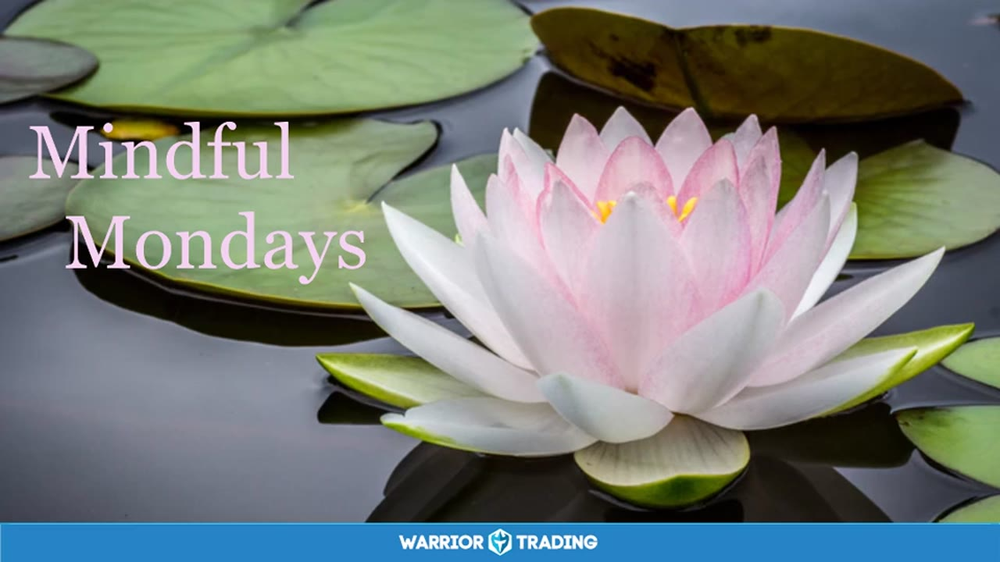

# Mindful Monday：2018

> 5 场，合计 2.8 小时。返回 [Mindful Monday 目录](../README.md)。

## v0822：正念冥想引导

> 日期：2018-11-26　·　时长：00:08:57

**本场重点：** 通过正念冥想放松身心，提升内在平静。

**图怎么看：**

- 画面整体：展示了一条穿过竹林的小径，两侧是高大的竹子。
- 可见信息：没有明显的金融数据或市场分析。
- 与本场关系：本场主题是正念冥想，而图片展示了宁静的自然环境，适合冥想和放松。
- 阅读边界：图片中的自然风光并不能直接证明与金融市场的关联性。

### 关键内容

- 通过深呼吸感受身体的自然放松。
- 注意呼吸中的细微感觉，如空气流动。
- 随着呼吸释放身体的紧张和压力。
- 将注意力转向心脏区域，体验爱与同情。
- 在心空间中体验被接纳的感觉。
- 在心空间和被接纳之间切换，增强连接感。
- 继续呼吸，让连接感深入内心。
- 最后回到日常意识，准备结束冥想。
- 正念冥想有助于减轻压力，提高专注力。
- 通过练习，可以更好地管理情绪和压力

### 分析与执行顺序

1. 引导参与者坐下，闭上眼睛，开始深呼吸。
2. 指导参与者注意呼吸中的细微感觉，如空气流动。
3. 提醒参与者随着呼吸释放身体的紧张和压力。
4. 引导参与者将注意力转向心脏区域，体验爱与同情。
5. 邀请参与者在心空间和被接纳之间切换，增强连接感。
6. 指导参与者继续呼吸，让连接感深入内心。
7. 最后，引导参与者回到日常意识，准备结束冥想

### 案例与细节

- “随着每一次呼吸，你注意到空气如何进入你的鼻子，然后通过嘴巴或鼻子流出。”
- “当你呼气时，想象任何紧张或压力随着呼吸流出。”
- “随着每一次呼吸，你感到身体逐渐放松，紧张和压力减少。”
- “想象自己在一个温暖的怀抱中，被深深的爱和同情所包围。”
- “随着每一次呼吸，你感到自己被接纳和理解，没有任何评判。”

### 风险与边界

- 正念冥想的效果因人而异，可能需要多次练习才能见效。
- 录制年代久远，现代的冥想技巧和方法可能有所不同。
- 正念冥想可能不适合所有人，特别是有严重心理问题的人。
- 正念冥想不能替代专业心理咨询，不应作为主要治疗手段

### 复盘问题

- 在冥想过程中，你注意到哪些身体部位的紧张和压力？
- 你如何将注意力从呼吸转移到心脏区域？
- 在心空间和被接纳之间切换时，你有何感受？
- 冥想结束后，你如何回到日常意识？

---

## v0823：Mindful Monday 的冥想练习

> 日期：2018-12-10　·　时长：00:39:56

**本场重点：** 通过冥想练习提高交易者的情绪调节能力，但需注意实际操作中的心理压力。

**图怎么看：**

- 这张图片展示了一个山顶上的石堆，背景是连绵起伏的山脉。
- 石堆位于前景，为场景增添了一种自然的元素。
- 远处的山脉在晴朗的天空下显得宁静而壮丽。
- 这种自然景观可能用于冥想练习，帮助交易者放松心情，提高情绪调节能力。

### 关键内容

- 冥想有助于提高交易者的自我意识，保持冷静。
- 通过呼吸练习和身体感知，可以更好地连接自己。
- 冥想可以减少交易过程中的情绪波动，提高决策质量。
- 冥想练习需要时间和持续的努力才能见效。
- 交易者需要学会接受失败，并以友善的态度对待自己。
- 冥想可以提高交易者的专注力和情绪稳定性。
- 交易者可以通过调整自己的心态来应对市场波动。
- 冥想练习可以帮助交易者更好地管理情绪和压力。
- 冥想练习需要结合实际交易情境进行练习。
- 冥想练习可以提高交易者的自我接纳和自我同情能力

### 分析与执行顺序

1. 首先，让参与者放松，闭上眼睛或保持柔和的目光。
2. 然后，引导参与者关注呼吸，感受每一次呼吸带来的变化。
3. 接着，提醒参与者注意身体的任何紧张或压力点，并尝试释放这些紧张。
4. 进一步，加入对呼吸的简单享受，甚至微笑，感受这些变化。
5. 最后，邀请参与者将注意力转向感恩，以及心的开放。
6. 在整个过程中，引导参与者回到自己的心空间，感受连接和接纳。
7. 结束时，让参与者慢慢恢复到日常意识，准备开始新的一天

### 案例与细节

- 在冥想过程中，参与者被引导关注呼吸，感受每一次呼吸带来的变化。
- 参与者被提醒注意身体的任何紧张或压力点，并尝试释放这些紧张。
- 参与者被邀请将注意力转向感恩，以及心的开放。
- 参与者被引导回到自己的心空间，感受连接和接纳。
- 参与者被提醒在日常生活中保持这种连接感，继续练习冥想。
- 参与者被鼓励在交易中运用这些技巧，保持冷静和专注

### 风险与边界

- 交易者可能难以立即感受到冥想带来的好处，需要持续练习。
- 市场波动可能会干扰交易者的冥想练习，需要适应。
- 交易者可能在面对重大损失时感到沮丧，需要学会自我同情。
- 冥想练习的效果可能因个人差异而异，需要个体化调整。
- 录制年代限制可能影响当前市场的适用性，需要结合实际情况调整

### 复盘问题

- 冥想练习如何帮助交易者更好地管理情绪和压力？
- 交易者在实际交易中如何应用冥想练习的技巧？
- 冥想练习需要多长时间才能看到明显效果？

---

## v0824：情绪管理与自我觉察

> 日期：2018-12-17　·　时长：00:38:45

**本场重点：** 情绪波动如何影响交易决策，以及如何通过冥想保持冷静。

**图怎么看：**

- 图片展示了一朵粉色的莲花，背景是绿色的荷叶。
- 图片上方的文字“Mindful Mondays”表明这是一个关于周一的冥想活动。
- 图片下方的“Warrior Trading”标志表明这是Warrior Trading公司的活动。
- 图片中的莲花象征着平静和内在的觉醒，适合用于冥想和自我觉察的主题。

### 关键内容

- 情绪波动会影响交易决策，如胜利后过于自信或失败后犹豫。
- 通过冥想可以保持冷静，回归当下。
- 呼吸练习有助于放松身心，增强自我觉察。
- 社区支持有助于缓解负面情绪。
- 同情心和接纳是处理情绪的关键。
- 接受自己是克服负面情绪的第一步。
- 冥想练习可以帮助维持内心的平静。
- 通过呼吸练习进入更深层次的自我觉察。
- 同情他人可以缓解自己的压力。
- 接受自己是克服负面情绪的重要步骤

### 分析与执行顺序

1. 讲师首先回答观众的问题，解释情绪波动对交易的影响。
2. 然后引导观众进行冥想练习，包括深呼吸和身体扫描。
3. 通过呼吸练习帮助观众放松身心，回归当下。
4. 进一步引导观众进入内心深处，感受爱与接纳。
5. 最后，通过冥想练习结束课程，帮助观众保持内心的平静。
6. 分享一个关于同情心的例子，鼓励观众将这种情感传递给他人。
7. 总结冥想练习的重要性，强调自我觉察和社区支持的作用

### 案例与细节

- 当交易成功后，可能会变得过于自信，导致冒险。
- 当交易失败后，可能会变得过于谨慎，甚至不敢行动。
- 通过冥想练习，可以更好地控制情绪，保持冷静。
- 在交易过程中，可以通过深呼吸来缓解紧张情绪。
- 通过身体扫描，可以更好地感知身体的紧张和放松。
- 通过冥想练习，可以更好地理解自己内心的感受

### 风险与边界

- 情绪波动是交易中常见的问题，但不同人的情绪反应可能不同。
- 冥想练习需要持续练习才能有效，短期内可能效果有限。
- 社区支持对于缓解负面情绪非常重要，但每个人的情况不同。
- 冥想练习的效果可能因个人差异而异，需要根据自身情况进行调整。
- 录制年代限制，当前环境和市场条件可能与当时有所不同

### 复盘问题

- 情绪波动如何影响你的交易决策？
- 你如何通过冥想练习来保持冷静？
- 你如何在日常生活中应用自我觉察？
- 你如何利用社区支持来缓解负面情绪？
- 你如何通过同情心来缓解自己的压力？

---

## v0825：Mindful Monday 2018 年末冥想课程

> 日期：2018-12-31　·　时长：00:42:15

**本场重点：** 通过呼吸练习和冥想来平衡自主神经系统，达到放松和专注的状态。

**图怎么看：**

- 这张幻灯片详细介绍了如何通过呼吸练习和冥想来平衡自主神经系统，帮助人们放松和专注。
- 幻灯片上列出了两种主要的呼吸方式及其对自主神经系统的刺激效果。
- 通过交替使用左右鼻孔进行呼吸，可以平衡自主神经系统，促进放松。
- 左鼻孔呼吸能够刺激副交感神经系统，有助于放松。

### 关键内容

- 呼吸练习可以影响自主神经系统，帮助放松或集中注意力。
- 左鼻孔呼吸有助于放松，右鼻孔呼吸有助于集中。
- 通过练习呼吸技巧，可以在需要时切换到放松或专注状态。
- Kundalini 瑜伽中的呼吸练习有助于平衡身心。
- 冥想可以帮助人们重新连接被切断的部分，创造更轻松和真实的生活。
- 呼吸练习可以促进身体和心灵之间的联系。
- 通过练习呼吸技巧，可以更好地管理情绪和压力。
- 冥想和呼吸练习有助于提高决策能力，回到零点状态。
- 左鼻孔呼吸和右鼻孔呼吸各有优势，可以根据需要选择使用。
- 通过练习呼吸技巧，可以改善自主神经系统的平衡

### 分析与执行顺序

1. 讲师介绍了呼吸练习的重要性，包括左鼻孔和右鼻孔呼吸的方法。
2. 参与者进行了几次深呼吸练习，感受呼吸带来的放松效果。
3. 参与者在冥想过程中注意自己的呼吸，放松身体和心灵。
4. 参与者练习了左鼻孔和右鼻孔呼吸，感受不同呼吸方式带来的变化。
5. 参与者在练习过程中注意自己的感受和情绪变化，进行自我观察。
6. 参与者在练习结束后，分享了自己的体验和感受，互相交流心得。
7. 讲师总结了呼吸练习和冥想的好处，鼓励大家继续练习

### 案例与细节

- 左鼻孔呼吸有助于放松，右鼻孔呼吸有助于集中。
- 参与者注意到左鼻孔呼吸时感觉更加放松，右鼻孔呼吸时感觉更加集中。
- 参与者在练习过程中尝试了不同的呼吸方式，发现不同的呼吸方式对身体和心灵有不同的影响。
- 参与者在练习结束后，分享了自己在练习过程中的感受，如放松、集中等。
- 参与者在练习过程中注意到了自己的呼吸节奏和身体感受的变化

### 风险与边界

- 呼吸练习需要正确的姿势和方法，否则可能无法达到预期效果。
- 长时间练习可能导致身体不适，需要适当休息。
- 自主神经系统平衡需要长期练习，短期内可能看不到明显效果。
- 录制年代限制，呼吸练习的具体效果可能因人而异。
- 呼吸练习需要在安静的环境中进行，否则可能难以集中注意力

### 复盘问题

- 参与者在练习过程中感受到了哪些变化？
- 呼吸练习如何帮助参与者更好地管理情绪和压力？
- 参与者在练习结束后有什么感受和收获？

---

## v0826：Mindful Monday：冥想与交易

> 日期：2018　·　时长：00:39:43

**本场重点：** 冥想可以帮助交易者更好地管理情绪，提高专注力，但需要长期坚持才能见效。

**图怎么看：**

- 这张图片展示了一条穿过森林的小木板路，通向一个宁静的湖泊。
- 湖水呈现出鲜艳的蓝色，反射着周围的绿色植物。
- 树木茂密，树叶在微风中轻轻摇曳。
- 这条小径为人们提供了一条通往自然美景的路径，体现了人与自然和谐共处的理念。

### 关键内容

- 冥想可以应用于任何活动，帮助人们安静下来。
- 冥想过程中，注意力容易被思绪分散，需要练习。
- 诗歌《够了》鼓励人们开放生活，体验更深层次的生活。
- 通过呼吸练习，可以释放身体的紧张和压力。
- 在呼吸过程中加入感恩和意识，可以提升内在的平静感。
- 将注意力转向心脏区域，可以连接爱、慈悲等美好品质。
- 冥想有助于平衡情绪，但需要持续练习。
- 冥想不是睡眠，而是一种保持现时意识的状态。
- 长时间冥想后，时间感知会改变，感觉时间过得更快。
- 冥想可以用于交易前清空思绪，保持冷静

### 分析与执行顺序

1. 讲师介绍冥想的基本概念，包括如何安静下来。
2. 分享诗歌《够了》，引导听众进入冥想状态。
3. 指导听众进行呼吸练习，释放身体的紧张和压力。
4. 加入感恩和意识，提升内在的平静感。
5. 将注意力转向心脏区域，连接爱、慈悲等美好品质。
6. 最后，指导听众回到日常意识，结束冥想练习

### 案例与细节

- “我们有如此多的趋势被生活中的活动所吸引。”
- “比如，引用费里斯·比勒的话，生活移动得很快，如果你不时不时地停下来四处看看，你可能会错过一些东西。”
- “让自己的注意力转向呼吸本身，感受每一次呼吸的细微变化。”
- “注意你可能在身体中持有的任何紧张或压力，特别是胸部、肩膀、背部、颈部和下巴。”
- “随着你继续呼吸，允许享受每个吸气和呼气，甚至加入感恩，感谢你的身体为你提供的简单呼吸。”

### 风险与边界

- 冥想需要长期坚持才能见效，短期内效果有限。
- 冥想过程中可能会出现情绪波动，需要适当处理。
- 录制年代久远，当前市场环境可能有所不同。
- 冥想技巧需要个体适应，不同人可能有不同的体验和效果

### 复盘问题

- 冥想练习对交易者的情绪管理有何帮助？
- 如何在日常生活中应用冥想技巧？
- 冥想过程中遇到困难时应如何应对？

---
