# Mindful Monday：2019

> 43 场，合计 30.4 小时。返回 [Mindful Monday 目录](../README.md)。

## v0827：情绪管理与交易心理

> 日期：2019-01-07　·　时长：00:36:51

**本场重点：** 通过冥想练习来管理情绪，提高交易决策质量。

**图怎么看：**

- 这张图片展示了竹林中的小径，非常适合进行冥想练习，有助于管理情绪并提高交易决策的质量。
- 竹林中的小径为参与者提供了一个宁静的环境，有助于放松心情，从而更好地集中注意力。
- 冥想练习在交易中非常重要，因为它可以帮助交易者保持冷静，减少情绪波动对决策的影响。
- 通过冥想练习，参与者可以学会如何在压力下做出更明智的交易决策，从而提高整体交易表现。

### 关键内容

- 通过冥想练习帮助交易者处理情绪波动，减少焦虑。
- 识别并接受情绪，如恐惧和焦虑，有助于更好地进行交易。
- 练习自我对话，理解情绪背后的原因，促进情感调节。
- 通过身体感受来识别情绪的具体位置，增强自我意识。
- 培养自我同情和接纳，减少自我批评。
- 在交易中保持专注，避免外部干扰，提高决策质量。
- 通过练习建立内在连接，提高情绪管理能力。
- 识别并接受自己的情绪反应，减少冲动交易。
- 通过诗歌引导思考，理解完美与缺陷共存的哲学。
- 练习自我对话，理解情绪背后的动机，促进情感调节

### 分析与执行顺序

1. 引导参与者进行呼吸练习，帮助放松身心。
2. 通过冥想练习，引导参与者关注呼吸，识别身体内的紧张感。
3. 指导参与者释放紧张感，通过呼吸练习让情绪得到缓解。
4. 邀请参与者注意情绪的出现，并转向这些情绪。
5. 鼓励参与者用自我同情和接纳的态度面对情绪。
6. 引导参与者回到表面意识，结束冥想练习。
7. 分享诗歌，引导思考完美与缺陷共存的哲学

### 案例与细节

- 在交易中感到紧张和焦虑，通过冥想练习帮助放松。
- 识别到喉咙部位的紧张感，通过深呼吸逐渐缓解。
- 通过自我对话理解情绪背后的动机，如害怕失败。
- 在交易前进行冥想，帮助集中注意力，减少冲动交易。
- 通过诗歌理解完美与缺陷共存的哲学，促进情感调节

### 风险与边界

- 交易环境的变化可能影响情绪管理的效果。
- 市场波动可能导致情绪波动加剧，影响决策。
- 冥想练习需要持续练习才能有效，短期内效果有限。
- 录制年代限制，当前市场环境与当时可能有所不同。
- 自我对话和情绪调节需要时间和实践，短期内难以显著改善

### 复盘问题

- 在交易过程中，哪些情绪最常出现？
- 如何通过自我对话理解情绪背后的动机？
- 冥想练习对情绪管理有何具体帮助？
- 诗歌如何帮助理解完美与缺陷共存的哲学？

---

## v0828：Mindful Monday：早晨冥想与交易准备

> 日期：2019-01-14　·　时长：00:43:59

**本场重点：** 通过早晨冥想帮助交易者调整心态，提高专注力，减少情绪波动，从而更好地进行交易。

**图怎么看：**

- 图片展示了一朵粉色的莲花在水面上盛开，周围有绿色的荷叶。
- 图片上方的文字“Mindful Mondays”表明这是一个关于周一的冥想活动。
- 图片下方的文字“Warrior Trading”可能表示这个活动是由Warrior Trading组织的。
- 图片整体给人一种平静和宁静的感觉，适合用于冥想和交易准备的主题。

### 关键内容

- 冥想有助于减缓思维的忙碌状态，保持当下。
- 通过呼吸练习，释放身体的紧张和压力。
- 接受自己的缺点和错误，转化为成长的机会。
- 在交易前进行冥想，有助于调整心态，减少情绪波动。
- 通过练习，逐步加深自我存在的感知。
- 接受自己，包括自己的弱点，是改变的关键。
- 在交易中遇到挫折时，学会接受并继续前进。
- 通过呼吸练习，将注意力集中在当下，减少分心。
- 冥想可以帮助交易者更好地管理情绪，提高决策质量

### 分析与执行顺序

1. 讲师首先介绍了Mindful Monday的目的，即通过冥想帮助交易者准备一天的交易。
2. 然后引导参与者进行简单的呼吸练习，放慢呼吸，放松身心。
3. 接着讲解了如何通过呼吸练习来释放身体的紧张和压力。
4. 进一步强调接受自己的缺点和错误，将其视为成长的机会。
5. 最后，鼓励参与者在交易前进行冥想，以调整心态，减少情绪波动

### 案例与细节

- 讲师提到，通过呼吸练习，可以注意到呼吸带来的微妙感觉，如空气流动、胸部和腹部的扩张与收缩。
- 参与者被建议在呼吸时注意这些感觉，让思绪随呼吸自然流动。
- 讲师分享了一个关于接受自己缺点的故事，强调了接受自己是改变的关键。
- 参与者被提醒，在交易前进行冥想，可以帮助他们更好地管理情绪，提高决策质量。
- 讲师提到了一个关于损失管理的例子，强调了接受损失是成功的关键之一

### 风险与边界

- 由于录制年代较早，部分信息可能不再适用，如特定的交易平台状态。
- 心理辅导和交易策略的具体细节可能已发生变化。
- 交易市场的变化可能导致某些策略不再有效。
- 心理状态的变化可能会影响交易表现，需要持续关注

### 复盘问题

- 冥想练习对交易者的心态有何具体影响？
- 如何通过呼吸练习来更好地管理情绪？
- 接受自己的缺点和错误对于交易者来说意味着什么？

---

## v0829：Mindful Monday：冥想与感恩

> 日期：2019-01-21　·　时长：00:44:01

**本场重点：** 通过冥想和感恩练习，提高自我意识和情绪管理能力。重点在于日常生活的实践，而非仅限于特定场合。

**图怎么看：**

- 这张图片展示了一个宁静的水面上漂浮着一朵粉色莲花，周围环绕着绿色的荷叶。
- 图片上方的文字“Mindful Mondays”表明这是一个关于冥想和感恩练习的主题。
- 图片下方的“Warrior Trading”标志表明这是Warrior Trading公司提供的内容。
- 整体氛围传达出一种平静和反思的感觉，适合冥想和感恩练习的环境。

### 关键内容

- 讲师通过冥想引导，帮助参与者放松身心，提高自我意识。
- 通过呼吸练习，关注身体感受，释放压力和紧张。
- 加入感恩意识，培养积极心态，增强自我接纳。
- 认识到忙碌思维的常见性，通过冥想练习逐步减少这种状态。
- 讨论交易行业对个人系统的需求，强调自我认知的重要性。
- 强调持续练习的重要性，以改善自我对话和情绪管理。
- 提醒参与者，冥想和感恩是日常生活中的实践，而非仅限于特殊场合。

### 分析与执行顺序

1. 讲师首先介绍今天的主题，即冥想和感恩。
2. 指导参与者进行呼吸练习，关注呼吸过程中的身体感受。
3. 引入感恩意识，让参与者意识到呼吸的重要性，并表达感激之情。
4. 通过自我肯定的话语，鼓励参与者对自己更加宽容和接纳。
5. 分享Pema Chodhron的名言，强调选择如何面对生活中的挑战。
6. 引用Mary Oliver的诗歌，强调接受自己和连接自然的重要性。
7. 总结冥想和感恩的实践方法，强调持续练习的重要性。

### 案例与细节

- “All right, so welcome back to Mindful Monday. I'm Ted. It's a pretty cold day where I live.”
- “Over your head and face, your neck, down to your shoulders, down through your arms, all the way out to your fingertips, down through your chest and back, over your belly, lower back, over your hips, down your legs to your knees, down your calves, all the way down to your feet, to the tips of your toes.”
- “So thanks, Vince. So I'll read that out for the recording. I have a very busy mind, and all the work I have in the mornings doesn't help.”
- “And that, you know, adding that awareness of gratitude is one that I've found, you know, really helpful and very interesting.”
- “You know, this idea of gratitude for the breath, which we often, you know, go through our day not even aware of, although it's with us all the time.”

### 风险与边界

- 冥想和感恩练习的效果因人而异，可能需要一段时间才能看到明显的变化。
- 录制年代限制，现代生活节奏可能与当时有所不同，影响练习效果。
- 忙碌思维的减少是一个渐进的过程，需要持续练习。
- 感恩意识的培养需要时间和耐心，短期内可能看不到显著效果。

### 复盘问题

- 冥想和感恩练习对您的情绪管理有何帮助？
- 您如何将这些练习融入到日常生活中？
- 您在练习过程中遇到了哪些挑战？

---

## v0830：Mindful Monday：交易前的心理准备

> 日期：2019-01-28　·　时长：00:41:06

**本场重点：** 在交易前进行心理准备，通过冥想和自我接纳来提升交易表现。重点在于培养自我意识和情感智慧。

**图怎么看：**

- 这张图片展示了一条穿过茂密森林的小径，小径通向一个宁静的湖泊。
- 森林中的绿色植物和树木为场景增添了宁静和自然的感觉。
- 清澈的湖泊反射出周围的绿色植被，营造出一种平静和放松的氛围。
- 这样的环境可以作为冥想和自我接纳的背景，有助于提升交易者的心理准备。

### 关键内容

- 冥想可以帮助交易者更好地控制情绪，减少压力。
- 通过呼吸练习，可以逐步放松身体，减轻紧张感。
- 自我接纳是克服自我限制信念的关键。
- 情感智慧有助于更清晰地理解自己的情绪反应。
- 在交易前进行冥想可以提高专注力和决策质量。
- 通过练习，可以逐渐培养出更积极的心态。
- 自我观察和自我接纳是提升交易表现的重要手段。
- 情感智慧可以帮助交易者更好地应对市场波动。
- 通过冥想，可以更好地连接内心的情感和理智

### 分析与执行顺序

1. 讲师首先介绍了冥想的基本概念和目的。
2. 然后指导参与者进行呼吸练习，以放松身心。
3. 接着引导参与者观察自己的情绪，并学会接纳。
4. 最后，鼓励参与者将这种自我接纳带到日常交易中。
5. 整个过程包括呼吸练习、情绪观察和自我接纳三个主要环节。

### 案例与细节

- “允许一切开始在你体内放慢速度，真正让你做出有意识的决定，放下所有你一直在做的事情，所有你一直在思考或处理的事情，以便你可以真正拥有这一小段时间，简单地让注意力转向内在。”
- “随着你继续呼吸，你的意识可以开始在这些状态之间流动。”
- “在呼吸时，你可能会注意到一种更多的开放性和轻松感。”
- “如何简单，如何容易可以让这成为你的一部分？”
- “让我们的心放松和打开，让我们连接到我们自己的爱和存在。”

### 风险与边界

- 由于录制于2019年，部分信息可能不再适用，如特定的市场规则和税务规定。
- 冥想的效果因人而异，有些人可能需要更多时间来适应。
- 自我接纳的过程可能需要持续的努力和实践。
- 市场环境的变化可能会影响交易策略的有效性。

### 复盘问题

- 冥想练习对你的交易表现有何影响？
- 你在交易前是否经常进行类似的冥想练习？
- 你如何将自我接纳的概念应用到实际交易中？

---

## v0831：交易中的正念练习

> 日期：2019-02-04　·　时长：00:41:24

**本场重点：** 正念练习有助于减少情绪反应，提高决策质量；通过资源状态和正念练习，可以更好地应对市场波动。

**图怎么看：**

- 这张图片展示了竹林小径上的课程画面，背景是一个宁静的自然环境。
- 图片中没有显示任何具体的交易数据或图表，但提供了良好的视觉效果。
- 竹林和小径可能象征着平静和专注，有助于提高交易者的正念。
- 图片中的文字“WARRIOR TRADING”表明这是一个与交易相关的课程或活动。

### 关键内容

- 正念练习可以帮助交易者保持冷静，避免情绪化决策。
- 通过正念练习，可以识别并缓解身体中的紧张感。
- 正念练习有助于培养自我接纳和自我同情。
- 资源状态如Good Harbor Beach可以帮助交易者在压力下保持冷静。
- 正念练习强调接受生活中的不确定性，从而促进更好的决策。
- 正念练习需要持续练习，以培养耐心和坚持。
- 正念练习有助于交易者更好地理解市场动态，而不是试图控制它。
- 正念练习可以减少对未知的恐惧和后悔，从而提高交易表现。
- 正念练习需要结合实际操作，如冥想和放松练习。

### 分析与执行顺序

1. 讲师首先介绍正念练习的重要性，帮助交易者保持冷静。
2. 然后引导交易者进行正念呼吸练习，注意呼吸过程中的细微感受。
3. 接着，讲师指导交易者关注身体中的紧张感，并通过呼吸来释放这些紧张。
4. 进一步引导交易者转向内心深处，培养自我接纳和自我同情。
5. 最后，讲师总结正念练习的关键点，强调持续练习和接受生活中的不确定性。

### 案例与细节

- 讲师提到，当交易者不断梦见交易，等待进入或退出交易时，这表明他们正在努力学习，但可能处于压力状态。
- 讲师分享了一个资源状态的例子，即Good Harbor Beach，帮助交易者在压力下保持冷静。
- 讲师提到，当交易者反复梦见错过交易时，可以在睡前练习放松和呼吸练习。
- 讲师引用了Carl Rogers的观点，强调无条件积极关注的重要性，无论交易表现如何。
- 讲师提到，当交易者在滑行时，需要保持专注，而不是想象海滩来分散注意力。

### 风险与边界

- 正念练习需要持续实践，否则可能无法有效减少情绪反应。
- 资源状态如Good Harbor Beach可能因个人经历而有所不同，需根据个人情况选择。
- 正念练习的效果可能因个人差异而异，需要个体化调整。
- 录制年代限制为2019年，当前市场环境可能已发生变化。

### 复盘问题

- 正念练习的具体步骤是什么？
- 如何识别并缓解身体中的紧张感？
- 资源状态如Good Harbor Beach如何帮助交易者？
- 无条件积极关注如何应用于交易实践中？
- 如何将正念练习融入日常交易流程？

---

## v0832：使用正念改善交易

> 日期：2019-02-11　·　时长：00:42:08

**本场重点：** 通过正念练习改善交易决策，强调自我接纳的重要性。

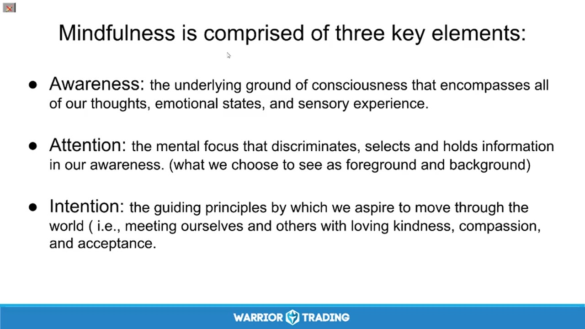

**图怎么看：**

- 这张幻灯片详细介绍了正念的三个关键元素：意识、注意力和意图。
- 它强调了正念练习的核心理念，即通过自我接纳来改善交易决策。
- 幻灯片还列出了七项态度基础，包括非评判、耐心、初学者心态、信任、非追求、接受和放手。
- 这些内容有助于理解如何将正念融入交易策略，以提高决策的质量和稳定性。

### 关键内容

- 正念练习有助于改善交易决策，通过自我接纳减少压力。
- 正念的核心要素包括意识、注意力和意图。
- 非评判态度是正念的重要组成部分，帮助克服内心的批评。
- 耐心对于应对压力和挑战至关重要。
- 接受自己和市场是正念实践的关键。
- 正念练习可以提高决策质量，减少冲动交易。
- 正念可以帮助交易者更好地理解自己的情绪和反应。
- 正念练习需要时间和实践来培养。
- 正念练习可以提高交易者的自我信任和自我接纳。
- 正念练习有助于减少对结果的执着，提高交易效率

### 分析与执行顺序

1. 讲师开始介绍正念练习，引导参与者进行呼吸练习。
2. 讲师解释了正念的核心要素，包括意识、注意力和意图。
3. 讲师强调了非评判态度的重要性，帮助克服内心的批评。
4. 讲师讨论了耐心在应对压力和挑战中的重要性。
5. 讲师分享了如何通过正念练习接受自己和市场。
6. 讲师提供了具体的正念练习方法，帮助参与者更好地理解自己。
7. 讲师鼓励参与者在交易中应用正念练习，提高决策质量

### 案例与细节

- 讲师提到“Beginner's Mind”，并分享了一个朋友的例子，说明在压力大的时候需要更多时间来冥想。
- 讲师引用了爱因斯坦的话：“愚蠢或无知在于重复做同样的事情，期望不同的结果。”
- 讲师提到了正念练习可以帮助交易者更好地理解自己的情绪和反应，例如在市场波动时保持冷静。
- 讲师分享了如何通过正念练习接受自己和市场，例如在市场热的时候放松警惕，在市场冷的时候更加谨慎。
- 讲师提到正念练习可以帮助交易者减少对结果的执着，例如在市场表现不佳时仍然保持乐观的心态

### 风险与边界

- 正念练习需要时间和实践来培养，如果交易者没有坚持练习可能会效果不佳。
- 正念练习可能无法立即解决所有交易中的问题，需要持续的努力。
- 正念练习的效果可能因个人差异而异，不同交易者可能会有不同的体验。
- 正念练习的某些技巧可能需要特定的环境和心态才能有效，例如在压力大的情况下可能难以集中注意力。

### 复盘问题

- 正念练习如何帮助你在交易中更好地理解自己的情绪和反应？
- 你如何在实际交易中应用非评判态度？
- 正念练习如何帮助你在面对市场波动时保持冷静？
- 你如何在实际交易中应用耐心？
- 正念练习如何帮助你在面对市场冷淡时保持乐观？

---

## v0833：情绪管理与交易心理

> 日期：2019-02-25　·　时长：00:38:32

**本场重点：** 通过冥想和正念练习，管理交易中的情绪反应，提高交易心理素质。

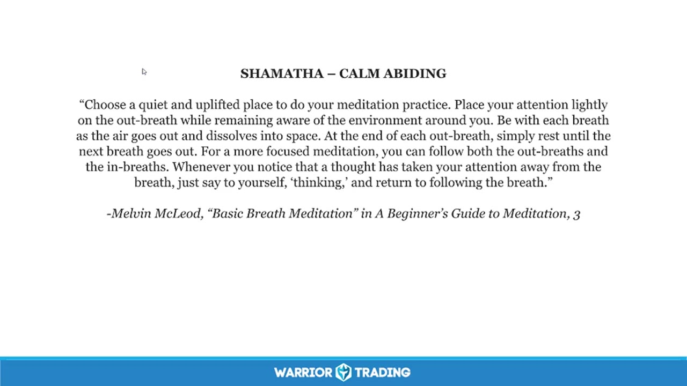

**图怎么看：**

- 幻灯片标题是“SHAMATHA – CALM ABIDING”，先要求选择安静、令人精神舒展的位置，再把注意力放到呼气上。
- 练习并不要求头脑完全空白；当想法出现时，按幻灯片提示轻轻标记为“thinking”，然后把注意力带回呼吸。
- 放到交易场景中，这套动作训练的是识别念头与情绪、暂停自动反应、重新选择行为，可用于处理亏损后的冲动和错过机会后的追单欲望。
- 这是一项情绪管理练习，不是入场信号，也不会消除市场风险；仓位、止损和每日最大亏损等规则仍需独立执行。

### 关键内容

- 冥想可以帮助我们从无意识的情绪反应中抽离出来，更好地管理情绪。
- 通过关注呼吸，可以逐步培养出对内心情绪的觉察。
- 正念练习有助于我们在面对困难时保持冷静，而不是被情绪所左右。
- 交易中情绪反应强烈，需要通过冥想来缓解。
- 正念练习可以让我们在面对不同情绪时保持客观和冷静。
- 通过练习，我们可以逐渐学会如何在交易中保持内心的平静。
- 正念练习强调的是观察而非评判，帮助我们更好地理解自己的情绪。
- 通过正念练习，我们可以学会如何在交易中保持内心的平衡。
- 正念练习可以帮助我们在面对挑战时保持冷静，而不是被情绪所影响。

### 分析与执行顺序

1. 讲师介绍了冥想的基本概念和目的，包括如何通过关注呼吸来达到内心的平静。
2. 讲师分享了正念练习的具体方法，包括如何通过呼吸来观察内心的情绪。
3. 讲师强调了正念练习的重要性，包括如何在面对困难时保持冷静。
4. 讲师通过引用书籍和作者的观点，进一步解释了正念练习的方法和意义。
5. 讲师通过实际操作，引导参与者进行冥想练习，包括如何关注呼吸和内心的情绪。

### 案例与细节

- 讲师提到Pimit Trojan的名言：“我们可以在生活中选择让情况使我们变得越来越有怨恨和恐惧，或者选择让它们使我们变得更柔软和更开放。”
- 讲师引用了Melvin McLeod的观点：“在坐禅时，保持眼睛睁开，面向墙壁，这有助于我们保持专注，而不是被外界干扰。”
- 讲师分享了Pima Chodran的观点：“在禅修中，我们可以通过关注呼吸来观察内心的情绪，从而更好地理解自己。”
- 讲师提到正念练习可以帮助我们在面对挑战时保持冷静，而不是被情绪所影响。例如，在交易中遇到挫折时，可以通过正念练习来缓解情绪压力。
- 讲师通过引用John Austin的诗歌，强调了正念练习的重要性：“她的眼神如此恒定，我们的每一个动作都被她注视着，充满了深情和耐心。”

### 风险与边界

- 正念练习的效果因人而异，有些人可能难以坚持。
- 交易市场变化莫测，正念练习无法完全消除情绪波动。
- 正念练习需要长期坚持才能见效，短期内效果有限。
- 正念练习适用于个人情绪管理，但不能解决所有交易中的问题。

### 复盘问题

- 正念练习的具体步骤是什么？
- 如何在日常交易中应用正念练习？
- 正念练习对交易心理有哪些具体帮助？

---

## v0834：Mindful Monday：情绪管理与交易

> 日期：2019-03-04　·　时长：00:40:52

**本场重点：** 通过冥想练习管理情绪，提高交易表现；强调接受自我和过程的重要性。

**图怎么看：**

- 这张图片展示了一位正在冥想的人。
- 图片中的文字引用了Pema Chödrön关于冥想实践的观点。
- 图片强调了冥想不仅仅是试图改变自己，而是学会与自己和解。
- 这与本场标题和重点相符合，强调了通过冥想练习管理情绪，提高交易表现，并强调接受自我和过程的重要性。

### 关键内容

- 接受自我和过程是成功的关键。
- 在交易前进行冥想练习有助于保持冷静和专注。
- 长期练习冥想可以改变大脑的功能，减少情绪失控。
- 长期练习冥想可以提高交易时的专注力。
- 接受自我和过程可以减少对成功的过度期望。
- 长期练习冥想可以提高交易时的流畅度。
- 接受自我和过程可以减少交易中的冲动行为。
- 接受自我和过程可以提高交易时的决策质量

### 分析与执行顺序

1. 首先，介绍自己和今天的主题，即如何使用冥想来帮助处理交易中的情绪。
2. 然后，引导听众进行冥想练习，包括呼吸和感受身体。
3. 接着，讨论如何接受和理解自己的情绪，而不是试图压抑它们。
4. 之后，分享冥想练习如何帮助改善交易表现。
5. 最后，鼓励听众继续练习冥想，并分享相关资源和建议

### 案例与细节

- 在交易前进行冥想练习，有助于保持冷静和专注。
- 通过长期练习冥想，可以减少交易中的冲动行为。
- 接受自我和过程可以帮助克服恐惧和焦虑。
- 在交易过程中，保持冷静和专注，避免情绪波动。
- 通过冥想练习，可以更好地管理情绪，提高交易表现

### 风险与边界

- 录制年代限制，信息可能不再适用于当前市场环境。
- 长期练习冥想需要时间和耐心，否则效果可能不佳。
- 接受自我和过程可能会降低对成功的期望值，导致交易表现下降。
- 长期练习冥想需要持续的努力，否则效果可能不稳定

### 复盘问题

- 在交易前进行冥想练习，有哪些具体的方法和步骤？
- 如何通过接受自我和过程来提高交易表现？
- 长期练习冥想需要哪些条件和支持？

---

## v0835：面对恐惧：交易中的心理调适

> 日期：2019-03-11　·　时长：00:40:09

**本场重点：** 本课程探讨如何通过正念冥想和自我接纳来面对交易中的恐惧，提升交易表现。

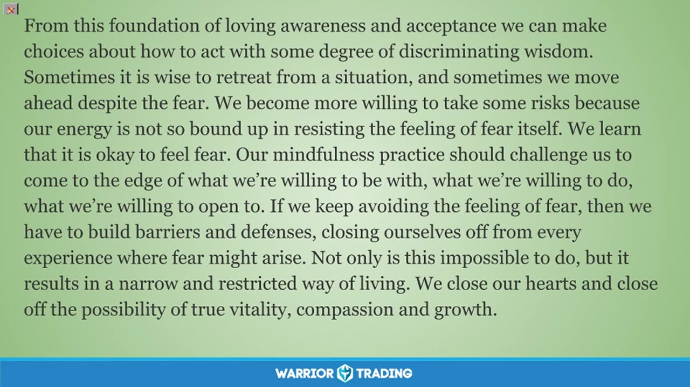

**图怎么看：**

- 通过正念冥想和自我接纳，我们能够更好地处理交易过程中的恐惧。
- 学习如何在恐惧面前保持开放的心态，而不是逃避。
- 认识到恐惧是一种自然的情绪反应，学会与之共存。
- 通过正念冥想，我们可以逐渐学会信任自己，不被恐惧所控制。

### 关键内容

- 正念冥想有助于缓解交易中的恐惧情绪，提高交易决策的质量。
- 通过命名和观察恐惧，可以更好地理解其本质并减轻其影响。
- 正念练习能够帮助交易者建立与自己更友善的关系，减少自我批评。
- 面对恐惧时，可以设定规则和参数来帮助自己克服犹豫。
- 接受恐惧的存在是克服恐惧的关键步骤，而非试图完全消除它。
- 正念练习需要时间和耐心，逐步培养对自身情绪的接纳。
- 交易中的恐惧是常态，关键在于如何处理和应对。
- 通过正念练习，可以提高交易者的心理韧性，更好地应对市场波动。
- 正念练习不仅适用于交易，也适用于其他生活领域，如职业转换等。
- 正念练习能够帮助交易者从内心深处认识到自己的恐惧，并学会接纳它们

### 分析与执行顺序

1. 首先，进行简短的正念冥想练习，帮助参与者放松。
2. 然后，讲解如何识别和命名恐惧，以及它在身体中的位置。
3. 接着，引导参与者以更友善的方式对待自己的恐惧，如同对待朋友。
4. 进一步，鼓励参与者通过自我对话来表达和理解自己的恐惧。
5. 最后，分享一个正念练习的例子，以加深理解并激励实践

### 案例与细节

- 例子1：一名交易者在模拟器中交易时，因害怕亏损而犹豫不决，通过正念练习，他学会了接受这种恐惧，并将其转化为前进的动力。
- 例子2：一名刚从医疗行业转行到金融行业的新人，面对新环境的不确定性感到焦虑，通过正念练习，他逐渐适应了新的工作环境。
- 例子3：一名交易者在面对市场波动时感到恐慌，通过正念练习，他学会了冷静下来，分析市场情况，做出更明智的决策。
- 例子4：一名交易者在交易过程中遇到挫折，通过正念练习，他学会了接受失败，并从中吸取教训，继续前行。
- 例子5：一名交易者在面对重大决策时感到压力，通过正念练习，他学会了放松心情，理性分析，做出最佳选择

### 风险与边界

- 正念练习的效果因人而异，需要持续练习才能看到明显效果。
- 过度依赖正念练习可能会忽视实际操作中的风险和挑战。
- 正念练习无法解决所有心理问题，仍需结合其他心理治疗方法。
- 录制年代限制为2019年，当前可能需要更新相关知识和方法
- 正念练习需要一定的耐心和时间，短期内可能看不到显著变化

### 复盘问题

- 正念练习如何帮助你在面对恐惧时做出更好的决策？
- 你如何将正念练习应用到日常交易中？
- 在面对恐惧时，你通常会采取哪些策略？

---

## v0836：Mindful Monday：培养自我接纳与同情心

> 日期：2019-03-18　·　时长：00:45:20

**本场重点：** 问题在于如何在交易中保持冷静，结论是通过自我接纳和同情心来应对情绪波动，边界在于长期实践的效果。

**图怎么看：**

- 这张图片展示了日落时分的海滩景色，天空呈现出美丽的紫色和红色渐变。
- 这种宁静而美丽的自然景象可能象征着内心的平静和自我接纳。
- 它提醒人们在交易中保持冷静的重要性，通过自我接纳和同情心来应对情绪波动。
- 这与本场主题“培养自我接纳与同情心”相契合，强调了在交易过程中保持冷静和平衡的重要性。

### 关键内容

- Ted 和 Diane 是 Warrior Trading Psychology 团队成员，通过 Mindful Monday 和 FOMO Fridays 提供心理辅导。
- 冥想练习有助于减轻情绪压力，提高交易时的专注力。
- 通过呼吸练习，可以注意到身体内的紧张和压力，并逐渐释放。
- 接受自己和他人的故事，质疑其真实性，有助于减少情绪反应。
- 强烈的情绪是人类的一部分，但可以通过转向它们来减轻痛苦。
- 通过呼吸练习将情感带入心中，可以缓解负面情绪，增加正面情绪。
- 自我接纳和同情心是克服自我怀疑的关键。
- 长期实践可以帮助减少情绪波动的影响，但需要持续的努力。
- 在交易中，恐惧和贪婪是常见的情绪，但可以通过平衡来管理这些情绪

### 分析与执行顺序

1. Ted 开始带领大家进行冥想练习，引导大家放松。
2. 通过呼吸练习，注意呼吸的感觉，放松身体。
3. 邀请大家将情感带入心中，体验自我接纳和同情心。
4. 分享 Pima Chodron 的名言，强调接受和自我同情的重要性。
5. 邀请大家在交易中接受过去的失败经验，减少未来的情绪波动。
6. 通过自我接纳和同情心，帮助克服自我怀疑和恐惧

### 案例与细节

- James 在交易中感到自我怀疑，有时非常自信，有时又完全不相信自己。
- Robert 发现自己的颈部和其他部位有紧张感，意识到这是长期积累的压力。
- Pima Chodron 的名言：‘我们的习惯模式虽然根深蒂固，但可以通过觉察和自我同情来改变’。
- 通过呼吸练习，将情感转化为爱和同情，帮助缓解负面情绪。
- 在交易中，接受过去的失败经验，可以帮助更好地应对未来的不确定性。
- Ben Quela 在交易中感到自我怀疑，寻求如何克服这种感觉的方法

### 风险与边界

- 录制年代久远，部分方法可能不再适用于当前市场环境。
- 长期实践需要持续的努力，否则效果可能不佳。
- 自我接纳和同情心需要时间和耐心，短期内难以见效。
- 在交易中，过度依赖自我接纳和同情心可能导致忽视实际风险
- 市场环境的变化可能影响情绪波动的频率和强度

### 复盘问题

- 在交易中，如何有效地运用自我接纳和同情心？
- 冥想练习对交易者有哪些具体的好处？
- 如何在日常生活中实践自我接纳和同情心？
- 在交易中遇到情绪波动时，应该如何应对？
- 长期实践自我接纳和同情心的方法有哪些？

---

## v0837：交易前的心理准备

> 日期：2019-03-25　·　时长：00:43:38

**本场重点：** 在交易前进行心理准备，通过冥想和自我关怀来提高专注力和情绪管理能力。这些技巧适用于所有交易者。

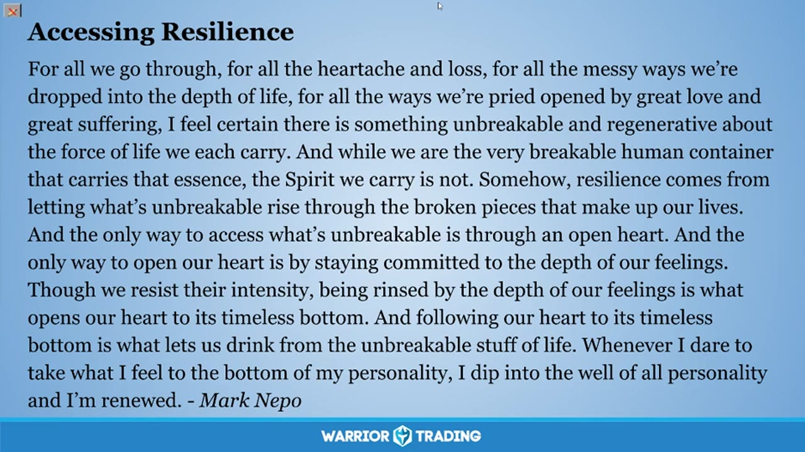

**图怎么看：**

- 这张图片展示了一段关于心理准备的文字，强调了在交易前进行冥想和自我关怀的重要性。
- 图片中的文字提到，通过冥想和自我关怀可以提高专注力和情绪管理能力。
- 这段文字适用于所有交易者，旨在帮助他们在交易前做好心理准备。
- 图片下方的“Warrior Trading”标志表明这是与交易相关的课程内容。

### 关键内容

- 通过冥想帮助交易者减少分心，提高专注力。
- 意识到内心的声音，并学会接受和释放情绪。
- 通过呼吸练习，让心灵回归当下。
- 将注意力转向内心深处，体验爱与宽容。
- 在交易前进行冥想，有助于减少冲动和恐惧。
- 通过冥想，可以更好地理解自己的情绪和需求。
- 冥想可以帮助交易者更好地应对市场波动。
- 冥想可以提高交易者的决策质量。
- 冥想可以增强交易者的内在力量和韧性

### 分析与执行顺序

1. 引导参与者进行呼吸练习，帮助他们放松。
2. 指导参与者将注意力集中在呼吸上，感受每一次呼吸带来的变化。
3. 鼓励参与者注意身体中的紧张和压力点，通过呼吸释放这些压力。
4. 引导参与者将注意力转向内心深处，体验爱与宽容。
5. 通过冥想，帮助参与者更好地理解自己的情绪和需求。
6. 鼓励参与者在交易前进行冥想，以提高专注力和情绪管理能力

### 案例与细节

- 一位参与者提到，冥想帮助他在面对市场波动时保持冷静。
- 另一位参与者表示，冥想让他更好地理解了自己的情绪和需求。
- 通过冥想，参与者学会了如何更好地管理自己的情绪，从而做出更明智的决策。
- 一位参与者分享了如何通过冥想来减轻交易过程中的压力。
- 通过冥想，参与者能够更好地应对市场的不确定性，从而做出更明智的决策

### 风险与边界

- 冥想的效果因人而异，有些人可能需要更多时间来适应。
- 市场环境的变化可能会削弱冥想的效果。
- 交易者需要持续练习才能获得最佳效果。
- 冥想不能替代专业的心理咨询和治疗。
- 录制年代限制，现代市场环境可能与当时有所不同

### 复盘问题

- 冥想对交易者的情绪管理有何具体帮助？
- 如何通过冥想来提高交易者的决策质量？
- 冥想能否帮助交易者更好地应对市场波动？

---

## v0838：Mindful Monday：用爱改善交易心态

> 日期：2019-04-01　·　时长：00:42:39

**本场重点：** 通过冥想练习，改善交易心态，增强自我关爱。

**图怎么看：**

- 这张图片展示了一棵大树，树叶呈现出秋天的色彩，阳光透过树叶洒下温暖的光芒。
- 图片下方有“Warrior Trading”的标志，可能与交易课程相关。
- 这幅图像传达了自然的宁静和美丽，有助于提升交易心态。
- 通过冥想练习，可以改善交易心态，增强自我关爱。

### 关键内容

- Ted分享了自己50岁生日的感受，并进行了简短的冥想练习。
- 通过回忆被深深爱着的时刻，加深这种感觉，并将其扩展到周围的人。
- 强调在交易中保持专注和冷静的重要性，以及如何通过爱来改善心态。
- 强调了在交易中保持清晰和聚焦的重要性，以及如何通过爱来实现这一点。
- 提醒参与者在交易中保持自我关爱的重要性，以及如何通过爱来改善交易心态。

### 分析与执行顺序

1. Ted开始介绍今天的主题，即通过冥想改善交易心态。
2. 进行了一次简短的冥想练习，引导参与者回忆被深深爱着的时刻。
3. 邀请参与者分享他们所体验到的接收和扩展爱的过程。
4. 讨论了多任务处理的弊端，以及如何通过短暂的冥想练习来提高专注力。
5. 分享了在心理学领域中，爱的重要性正在逐渐增加。
6. 通过一个具体的例子，展示了如何将爱的感觉扩展到周围的人。

### 案例与细节

- 女儿送生日拥抱的瞬间，加深了被爱的感觉。
- 回忆在海滩上的时刻，增强了被爱的感觉。
- 通过回忆与孩子在一起的时刻，增强了被爱的感觉。
- 分享了在交易中保持清晰和聚焦的重要性，以及如何通过爱来实现这一点。
- 引用了Mary Oliver的诗歌，鼓励大家珍惜生命，活出精彩。

### 风险与边界

- 多任务处理可能会导致注意力分散，影响交易表现。
- 长时间的多任务处理可能导致疲劳，影响决策能力。
- 录制年代限制，部分信息可能不再适用当前市场环境。
- 技术问题可能导致部分内容无法正常播放，影响学习效果。

### 复盘问题

- 你从这次冥想练习中学到了什么？
- 你如何将爱的感觉扩展到周围的人？
- 你认为在交易中保持清晰和聚焦的重要性是什么？

---

## v0839：Mindful Monday：情绪管理与自我接纳

> 日期：2019-04-08　·　时长：00:44:47

**本场重点：** 通过冥想和自我接纳，改善情绪管理，提高交易表现。

**图怎么看：**

- 这张图片展示了一段来自John Welwood的引言，鼓励人们放下对“开悟”的追求，而是专注于当下，倾听内心的声音，感受爱、渴望和恐惧。
- 引言强调了每个人都是独特的，无论我们试图成为什么样的人。
- 它呼吁人们打开自己的心扉，接受自己，而不是追求某种理想化的人格。
- 这是一段关于自我接纳和内在平静的深刻思考，对于提升情绪管理和交易表现具有重要意义。

### 关键内容

- John Wellwood的名言强调了接受自己当前状态的重要性。
- 自我接纳有助于缓解情绪反应，提高交易表现。
- 通过冥想练习，可以更好地理解自己的情绪。
- 接受自己是完美与缺陷的结合，无需苛求完美。
- 在交易中保持平和心态，享受过程而非仅仅追求结果。
- 通过练习，可以逐步建立自我接纳的习惯。
- 接受自己当前的状态，而不是试图成为更好的自己。
- 在困难时刻，保持友善和耐心的态度。
- 通过练习，可以更好地应对情绪波动。
- 接受自己是足够好的，不需要额外的压力

### 分析与执行顺序

1. 主持人Ted分享John Wellwood的名言，引导听众进入冥想状态。
2. 通过呼吸练习，帮助听众放松身心，减少紧张情绪。
3. 邀请听众转向内心，感受呼吸带来的平静。
4. 指导听众识别身体内的紧张情绪，并尝试释放。
5. 鼓励听众以友善和接纳的态度对待自己。
6. 通过冥想练习，帮助听众建立自我接纳的习惯。
7. 分享个人经历，说明自我接纳对情绪管理的重要性

### 案例与细节

- 主持人提到John Wellwood的名言：‘忘掉开悟吧，坐在任何地方，倾听风的声音。’
- 通过冥想练习，主持人引导听众关注呼吸，感受空气流动。
- 主持人分享个人经历，提到自己在面对情绪波动时，通过冥想练习找到了内心的平静。
- 主持人提到自己在训练狗狗Genevieve时，通过友善和接纳的态度帮助她缓解焦虑。
- 主持人分享自己儿子诺亚即将离开家去上大学的经历，强调在困难时刻保持友善和耐心的重要性

### 风险与边界

- 录制年代限制，此方法可能需要根据当前市场环境进行调整。
- 自我接纳的方法可能对不同个体效果不同，需灵活运用。
- 情绪管理需要长期坚持，短期内难以看到明显效果。
- 市场环境变化可能导致情绪波动加剧，需结合实际情况调整策略

### 复盘问题

- 冥想练习对情绪管理的具体效果如何？
- 自我接纳的方法是否适用于所有交易者？
- 如何在实际交易中应用这些情绪管理技巧？

---

## v0840：交易前的心理准备

> 日期：2019-04-22　·　时长：00:09:03

**本场重点：** 通过冥想调整心态，减少交易中的情绪波动，提高专注力。

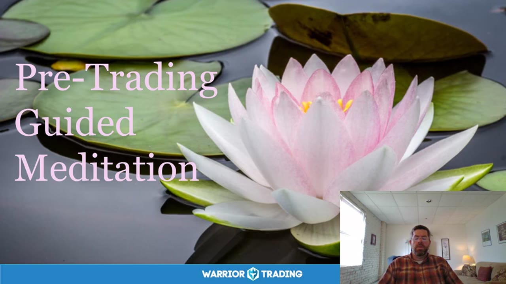

**图怎么看：**

- 这张图片展示了一个水莲花在水面上漂浮的场景，背景中有绿色的荷叶。
- 图片上方的文字写着“Pre-Trading Guided Meditation”，意为“交易前的引导冥想”。
- 右下角的小窗口显示了一位正在讲话的人，可能是在进行冥想指导。
- 整体画面给人一种平静和放松的感觉，适合用于交易前的心理准备和冥想练习。

### 关键内容

- 通过冥想帮助交易者放松身心，减少压力。
- 引导交易者关注呼吸，感受身体的自然节奏。
- 通过呼吸练习，释放身体内的紧张和压力。
- 将注意力转向内心，体验心流状态。
- 培养自我接纳和同情心，增强心理韧性。
- 通过冥想，帮助交易者建立积极的心态。
- 在交易前进行冥想，有助于提高交易表现。
- 冥想可以减少交易中的情绪波动，提高决策质量。
- 通过冥想，帮助交易者更好地管理情绪和压力。

### 分析与执行顺序

1. 交易者坐下，闭上眼睛，开始深呼吸。
2. 引导交易者放慢呼吸，感受空气进出身体的感觉。
3. 提醒交易者注意呼吸的细微变化，感受身体的自然节奏。
4. 引导交易者识别身体中的紧张和压力点，通过呼吸释放这些感觉。
5. 邀请交易者将注意力转向内心，体验心流状态。
6. 鼓励交易者接纳自己，培养同情心。
7. 引导交易者继续深呼吸，保持连接感。

### 案例与细节

- 呼吸时，感受空气从鼻孔进入，再从嘴巴呼出。
- 注意到胸部和腹部随着呼吸而扩张和收缩。
- 当感到紧张时，深呼吸，让紧张感随着呼气流出。
- 想象心脏打开，体验爱、同情和接受。
- 在交易前进行5分钟的冥想，帮助集中注意力。

### 风险与边界

- 录制年代较早，当前市场环境可能有所不同。
- 市场情绪和压力点可能因个人差异而异。
- 冥想效果因人而异，需持续实践。
- 交易者的情绪波动可能受到多种因素影响，仅靠冥想难以完全控制。

### 复盘问题

- 交易者在冥想过程中是否能够完全放松？
- 冥想后，交易者的情绪和压力水平有何变化？
- 冥想是否有助于提高交易者的专注力？

---

## v0841：Mindful Monday：培养自我同情心以应对交易波动

> 日期：2019-05-06　·　时长：00:41:36

**本场重点：** 通过培养自我同情心来应对交易中的情绪波动，提高交易成功率。

**图怎么看：**

- 这张图片展示了一个宁静的森林湖泊场景，背景中有树木和绿色植物。
- 右下角的小窗口显示了一位正在讲话的人，可能是在进行一场关于交易波动和自我同情心的讲座。
- 图片下方有“Warrior Trading”的标志，表明这可能是与该交易公司相关的培训材料。
- 图片上方的文字引用了Tara Brach的话，强调在面对情绪波动时培养自我同情心的重要性。

### 关键内容

- 培养自我同情心可以帮助我们在面对困难情境时保持冷静，而不是陷入情绪化的反应。
- 交易就像生活一样，充满了挑战和不确定性，需要我们学会更好地理解自己。
- 通过冥想练习，我们可以学会更温柔地对待自己的情绪，从而减少不必要的自我惩罚。
- 自我同情心有助于我们更好地处理恐惧和焦虑，避免被这些情绪所困。
- 通过自我反省和接受，我们可以更好地理解自己的情绪，从而达到内心的平衡。
- 自我同情心可以减少交易中的冲动行为，帮助我们做出更理性的决策。
- 自我同情心可以让我们更好地处理交易中的失败和挫折，从而更快地恢复。
- 自我同情心可以让我们更好地理解自己的情绪阴影，从而更好地应对市场变化

### 分析与执行顺序

1. 首先，分享了 Tara Brock 的两段引言，强调了接受和自我同情的重要性。
2. 然后，介绍了冥想的基本步骤，包括呼吸和身体扫描。
3. 接着，通过 Tara Brock 的故事，进一步解释了如何对待情绪和自我。
4. 最后，分享了 Mark Nipo 的诗歌，鼓励大家在交易中保持平静和接受。
5. 整个过程中，强调了自我同情心在交易中的重要性，以及如何通过冥想来实现。
6. 通过自我反省和接受，逐步引导听众进入一种更加平静和接受的状态。
7. 通过诗歌，进一步强化了冥想和自我同情心的概念，鼓励听众在交易中保持冷静

### 案例与细节

- Tara Brock 的《Radical Acceptance》鼓励我们接受事物的真实面貌，而不是仅仅评判它们的好坏。
- 当遇到情绪波动时，可以通过自我反省和接受来更好地理解自己的情绪。
- 通过冥想练习，可以学会更温柔地对待自己的情绪，从而减少不必要的自我惩罚。
- 自我同情心可以减少交易中的自责和负面情绪，提高决策质量。
- 通过自我反省和接受，可以更好地理解自己的情绪阴影，从而更好地应对市场变化。
- 自我同情心可以让我们更好地处理恐惧和焦虑，避免被这些情绪所困。

### 风险与边界

- 交易市场的变化可能导致自我同情心的实践效果降低。
- 自我同情心的培养需要时间和持续的努力，短期内可能看不到明显效果。
- 录制年代限制可能会影响某些具体策略的有效性。
- 自我同情心的实践需要个人的主动性和自律，否则可能难以坚持。
- 市场环境的变化可能导致某些情绪反应变得更为复杂，需要灵活调整应对策略

### 复盘问题

- 在交易中遇到情绪波动时，你是如何运用自我同情心来应对的？
- 你认为自我同情心在交易中的哪些方面最为关键？
- 你是否尝试过通过冥想来培养自我同情心？如果有，效果如何？

---

## v0842：Mindful Monday：培养内心柔软的力量

> 日期：2019-05-13　·　时长：00:41:13

**本场重点：** 通过冥想和内心柔软的力量，改善交易心态，减少情绪波动。

**图怎么看：**

- 这张图片展示了一位讲师在进行直播课程，背景是一个美丽的自然景观，可能是在分享关于内心柔软力量的内容。
- 图片中的文字引用了Pema Chodron的话，强调了对自己和他人的善意对个人体验世界的影响。
- 通过这种方式，讲师试图传达如何通过冥想和内心的柔软来改善交易心态，减少情绪波动。
- 图片下方的“Warrior Trading”标志表明这是一场与交易相关的课程，可能旨在帮助学员在交易过程中保持内心的平静和稳定。

### 关键内容

- Pema Chodron 的引言强调了在面对生活挑战时，选择变得柔软和开放的重要性。
- 通过呼吸练习，意识到身体内的紧张和压力，并尝试释放它们。
- 练习自我同情和接纳，而不是自我惩罚。
- 强调了练习自我慈悲和接纳的重要性，以改善交易心态。

### 分析与执行顺序

1. 开始分享 Pema Chodron 的引言，强调选择变得柔软和开放的重要性。
2. 通过呼吸练习，引导参与者意识到身体内的紧张和压力，并尝试释放它们。
3. 练习自我同情和接纳，而不是自我惩罚。
4. 分享了关于自我慈悲的引言，强调接受自己不完美的部分。
5. 讨论了如何对待内心的管理者和消防员，以促进情感的平衡。
6. 引用了 Rumi 的诗歌，强调接受生活中不可预测的变化。

### 案例与细节

- 当交通堵塞时，选择变得愤怒和沮丧，还是选择接受并继续前行。
- 在交易中遇到挫折时，选择自我惩罚，还是选择自我同情。
- 当情绪波动时，选择保持僵硬和反应性，还是选择变得柔软和开放。
- 在面对内心冲突时，选择与自己对话，还是选择逃避。
- 在交易中遇到失败时，选择放弃，还是选择继续努力。

### 风险与边界

- 录制年代限制，这些策略可能需要根据当前市场环境进行调整。
- 自我慈悲的练习可能需要持续实践才能有效。
- 内心管理者和消防员的存在使得自我接纳变得更加复杂。
- 市场环境的变化可能会影响这些策略的效果。

### 复盘问题

- 在面对生活挑战时，你选择了变得柔软和开放，还是选择了僵硬和反应性？
- 在交易中遇到挫折时，你是如何处理自己的情绪的？
- 你如何对待内心的管理者和消防员？
- 你如何练习自我慈悲和接纳？

---

## v0843：Mindful Monday：保持情绪稳定进行交易

> 日期：2019-05-20　·　时长：00:44:08

**本场重点：** 通过练习正念，保持情绪稳定，避免过度反应，从而更好地应对交易中的波动。

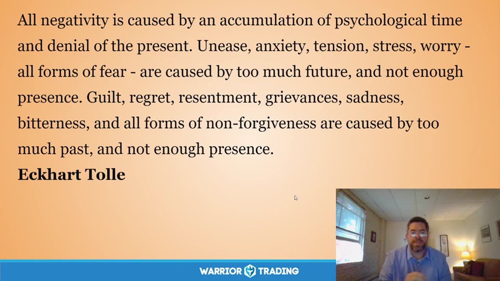

**图怎么看：**

- Eckhart Tolle指出，所有消极情绪都是由心理时间的积累和对当前体验的否认引起的。
- 他提到，焦虑、紧张、压力、担忧等恐惧形式是由过多的未来和不足的当下体验造成的。
- 同样，内疚、后悔、怨恨、悲伤、愤怒等非原谅形式的情绪也是由于过多的过去和不足的当下体验造成的。
- 这些观点强调了在交易中保持情绪稳定的重要性，以避免过度反应并更好地应对市场波动。

### 关键内容

- 正念练习有助于识别并接受当前的情绪，而不是完全抑制它们。
- 通过正念练习，可以更好地处理交易中的情绪波动，如恐惧、焦虑等。
- 正念强调在当下体验，而非被过去或未来的思绪所困扰。
- 正念练习可以帮助识别并接纳内心的批评声音，以更友好的方式对待自己。
- 正念练习有助于减轻因过度关注未来或过去而产生的紧张和焦虑。
- 正念练习可以提高自我同情的能力，更好地照顾自己。
- 正念练习有助于识别并接纳内心的情绪，如恐惧、焦虑、后悔等。
- 正念练习可以减少因过度关注未来或过去而产生的压力和焦虑。
- 正念练习可以提高自我意识，更好地理解自己的情绪和行为模式。

### 分析与执行顺序

1. 开始正念练习，闭上眼睛或保持柔和的目光。
2. 专注于呼吸，感受空气进出身体的感觉。
3. 注意身体中的任何紧张或压力点，并通过呼吸来释放它们。
4. 练习接受和自我同情，将这些意图带入呼吸过程中。
5. 继续练习，直到感觉更加平静和放松。
6. 逐渐回到表面意识，睁开眼睛，结束练习。

### 案例与细节

- 在正念练习中，注意到对某只股票的爱恨情绪。
- 通过正念练习，注意到对过去交易结果的反思。
- 通过正念练习，注意到对未来交易结果的预期。
- 通过正念练习，注意到对交易中出现的错误的自责。
- 通过正念练习，注意到对交易中出现的胜利的过度自信。
- 通过正念练习，注意到对交易中出现的失败的恐惧。

### 风险与边界

- 正念练习可能无法立即消除所有情绪波动，需要持续练习。
- 正念练习可能不适合所有人，有些人可能需要其他形式的心理支持。
- 正念练习可能无法解决深层次的心理问题，需要专业心理咨询。
- 正念练习的效果可能因个人差异而异，需要根据个人情况进行调整。
- 正念练习可能需要一定的时间才能看到明显效果，需要耐心坚持。

### 复盘问题

- 在正念练习中，你注意到哪些情绪波动？
- 在正念练习中，你如何处理这些情绪波动？
- 在正念练习中，你如何保持自我同情？

---

## v0844：使用正念应对交易中的情绪反应

> 日期：2019-06-03　·　时长：00:44:21

**本场重点：** 正念可以帮助交易者更好地做出决策，通过接受自己的情绪来减少无意识反应带来的问题。

**图怎么看：**

- 这张图片展示了一个关于正念在交易中应用的教学幻灯片。
- 幻灯片上显示了两位演讲者的视频片段，背景是一个室内环境。
- 幻灯片上方的文字强调了正念的重要性，并提到了如何通过接受自己的情绪来减少无意识反应带来的问题。
- 幻灯片下方的“Warrior Trading”标志表明这是与交易相关的课程内容。

### 关键内容

- 正念不仅仅是元认知，更重要的是活在当下，关注自己内心的关系。
- 正念起源于22年前的禅宗冥想实践，结合了心理学和正念。
- 系统一和系统二的思考方式，大多数决策来自系统一，即情感和自发的思维。
- 通过正念练习，可以更好地了解自己内心的真实情况及其动机。
- 接受和慈悲是正念的核心，有助于缓解情绪反应带来的困扰。
- 正念可以帮助交易者从和平中心出发，而不是从反应出发。

### 分析与执行顺序

1. 讲师首先介绍了正念的概念，强调它不仅仅是元认知，更重要的是活在当下。
2. 然后，讲师分享了一个关于接受和和平中心的引言，鼓励交易者从和平中心出发。
3. 接着，讲师引导听众进行正念冥想练习，通过呼吸和自我观察来放松身心。
4. 在冥想过程中，讲师指导参与者识别并接受自己内心的情绪，特别是那些难以接受的部分。
5. 最后，讲师分享了一首诗《Start Close In》，鼓励交易者从最接近的问题开始，而不是跳过它们。
6. 整个过程包括理论讲解、实际练习和心灵引导，旨在帮助交易者更好地应对市场波动和情绪反应

### 案例与细节

- 系统一和系统二的思考方式，其中系统一更多地涉及情感和自发的思维。
- 系统二则是我们的意识本身，但大多数决策来自系统一，即情感和自发的思维。
- 正念练习包括自我探索和接受，以及非附着性。
- 正念练习可以带来内心的平静和智慧，帮助交易者更好地应对市场波动。

### 风险与边界

- 正念练习需要时间和持续的努力，才能真正改变交易者的决策过程。
- 正念练习可能需要一段时间才能看到明显的效果。
- 正念练习需要开放的心态，接纳自己的不完美和弱点。
- 正念练习可能不适合所有交易者，特别是那些对改变持怀疑态度的人。
- 正念练习需要一定的自律和耐心，否则可能难以坚持下去

### 复盘问题

- 正念练习如何帮助交易者更好地应对市场波动和情绪反应？
- 正念练习的具体步骤是什么？
- 正念练习需要多长时间才能看到明显的效果？
- 正念练习是否适用于所有交易者？
- 正念练习如何帮助交易者从和平中心出发，而不是从反应出发？

---

## v0845：初学者心态在交易中的应用

> 日期：2019-06-10　·　时长：00:43:56

**本场重点：** 初学者心态有助于保持开放思维，避免过度依赖已有知识，从而更好地应对市场波动。

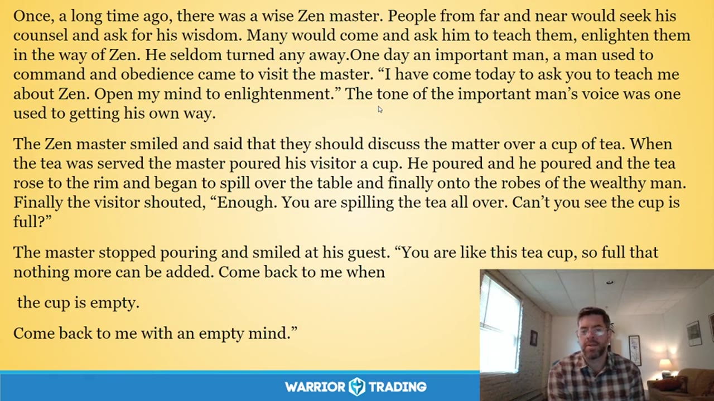

**图怎么看：**

- 初学者心态有助于保持开放思维，避免过度依赖已有知识，从而更好地应对市场波动。
- 这张截图展示了关于初学者心态在交易中的应用的主题。
- 图片中显示了一位穿着格子衬衫的人正在讲解，背景是一个室内环境。
- 图片中没有显示具体的交易数据或图表，因此无法单独证明这一点。

### 关键内容

- 初学者心态强调以开放、新鲜的心态面对一切，避免被已有知识束缚。
- 通过冥想练习，可以培养初学者心态，提高自我接纳和同情心。
- 初学者心态有助于避免隧道视野，扩大视野范围，更好地理解市场。
- 初学者心态强调接受自己当前的状态，而不是执着于过去的成功或失败。
- 初学者心态有助于在交易中保持冷静，避免情绪化决策。
- 初学者心态强调从零开始，不断学习和适应新的市场情况。
- 初学者心态有助于在交易中保持灵活，避免固守旧有的交易模式。
- 初学者心态强调接受自己，而不是苛求完美，有助于建立正确的交易心态。
- 初学者心态有助于在交易中保持平衡，避免过度乐观或悲观。
- 初学者心态有助于在交易中保持专注，避免分心或过度思考未来

### 分析与执行顺序

1. 讲师首先介绍了初学者心态的概念及其来源。
2. 然后通过冥想练习引导参与者体验初学者心态。
3. 接着分享了一个关于初学者心态的著名故事，进一步阐述其含义。
4. 最后，讲师总结了初学者心态在交易中的重要性，并鼓励参与者实践。
5. 在整个过程中，讲师多次强调自我接纳和同情心的重要性。
6. 通过故事和实际例子，讲师展示了初学者心态如何帮助交易者更好地应对市场变化。
7. 最后，讲师提醒参与者保持开放心态，避免过度依赖已有知识

### 案例与细节

- 讲师提到初学者心态有助于避免隧道视野，就像一个杯子满了，无法再加更多的茶。
- 讲师引用了初学者心态在交易中的实际应用，如一位交易者在经历一系列亏损后，开始怀疑自己的技能。
- 讲师分享了一个交易者的经历，他通过初学者心态重新找回了交易的信心。
- 讲师提到了初学者心态如何帮助交易者保持冷静，避免因情绪波动而做出错误的交易决策。
- 讲师引用了一个交易者的经历，他在交易中保持了开放心态，避免了过度依赖过去的经验

### 风险与边界

- 初学者心态可能不适合那些已经习惯了固定交易模式的交易者。
- 过度强调初学者心态可能导致交易者忽视积累的经验和知识。
- 初学者心态可能在市场环境发生重大变化时显得不够实用。
- 初学者心态可能在交易者面临巨大压力时难以维持。
- 初学者心态可能在交易者缺乏自律时难以实施

### 复盘问题

- 初学者心态如何帮助交易者更好地应对市场波动？
- 在交易中保持初学者心态的关键是什么？
- 初学者心态是否适用于所有类型的交易者？

---

## v0846：平静专注：交易心理修炼

> 日期：2019-06-17　·　时长：00:44:42

**本场重点：** 通过冥想练习培养交易中的冷静专注，减少情绪反应，提高交易表现。

**图怎么看：**

- 通过冥想练习培养交易中的冷静专注，减少情绪反应，提高交易表现。
- Pema Chödrön在《No Time to Lose》一书中提到，训练不跟随思想，不完全摆脱思想，这是不可能的。
- 在冥想实践中，当你意识到思维游离时，轻轻地将注意力带回到当下。
- Pema Chödrön在《Living Beautifully with Uncertainty and Change》中指出，基本的指导原则是让思想去，或者给它们一个标签‘思考’，并专注于当下的体验。

### 关键内容

- 通过冥想练习培养交易中的冷静专注，减少情绪反应。
- 使用呼吸作为焦点，帮助集中注意力。
- 接受内心浮现的一切，而不是试图改变它们。
- 通过练习接受自己，培养自我接纳和同情。
- 冥想可以帮助减少交易中的情绪反应，提高交易表现。
- 通过冥想练习，培养交易中的冷静专注，减少情绪反应，提高交易表现。
- 使用呼吸作为焦点，帮助集中注意力，接受内心浮现的一切，而不是试图改变它们。
- 通过练习接受自己，培养自我接纳和同情，有助于更好地应对交易中的情绪波动。
- 在交易前进行冥想，有助于保持冷静和专注，提高交易表现。
- 冥想可以帮助减少交易中的情绪反应，提高交易表现，尤其是在情绪开始波动时。
- 通过练习接受自己，可以更好地理解自己的情绪，从而做出更明智的决策。

### 分析与执行顺序

1. 邀请观众进行简单的呼吸练习，帮助放松。
2. 引导观众将注意力集中在呼吸上，帮助集中。
3. 邀请观众在心中加入简单意图，享受呼吸。
4. 引导观众将注意力转向心区，想象心区开放。
5. 邀请观众向自己表达爱意和接纳。
6. 引导观众继续练习，加深自我连接感。

### 案例与细节

- 通过冥想练习，让呼吸成为焦点，帮助集中注意力。
- 在冥想过程中，接受内心浮现的一切，而不是试图改变它们。
- 通过练习接受自己，可以更好地应对交易中的情绪波动。
- 在交易前进行冥想，有助于保持冷静和专注。
- 在交易前进行冥想，有助于保持冷静和专注，例如，在FOMO Fridays中，冥想练习帮助减少情绪反应，提高交易表现。
- 通过冥想练习，让呼吸成为焦点，帮助集中注意力，例如，通过跟随呼吸的节奏，可以更容易地进入交易状态。
- 在冥想过程中，接受内心浮现的一切，而不是试图改变它们，例如，当负面情绪出现时，学会接受它们，而不是试图抑制它们。
- 通过练习接受自己，可以更好地应对交易中的情绪波动，例如，当感到焦虑时，通过冥想练习来接受这种感觉，而不是逃避它。

### 风险与边界

- 冥想练习可能无法立即改善所有人的交易表现。
- 冥想需要持续练习才能产生效果。
- 录制年代限制，当前环境可能与当时有所不同。
- 冥想练习可能不适合所有人，需根据个人情况调整。
- 冥想练习可能无法立即改善所有人的交易表现，例如，对于那些已经习惯于快速决策的人来说，冥想可能需要更长时间才能见效。
- 冥想需要持续练习才能产生效果，例如，如果只是偶尔进行冥想而不坚持练习，那么其效果可能会非常有限。

### 复盘问题

- 冥想练习对你的交易表现有何影响？
- 你在交易前是否经常进行冥想练习？
- 冥想练习如何帮助你应对交易中的情绪波动？

---

## v0847：与恐惧为友

> 日期：2019-06-24　·　时长：00:41:15

**本场重点：** 恐惧是保护我们的一部分，通过接纳它来改变关系，让它成为合作而非对抗。

**图怎么看：**

- 森林中的湖景图片展示了自然环境，可能用于说明恐惧可以通过冥想和正念来理解和接受。
- 图片中没有明显的交易相关元素，但可以作为背景图像，帮助观众放松并专注于冥想。
- 图片与本场主题“与恐惧为友”相呼应，因为自然环境有助于人们在冥想中找到内心的平静。
- 图片本身并不能单独证明交易策略的有效性，但它可以帮助参与者更好地理解恐惧的本质，并将其视为一种资源而不是障碍。

### 关键内容

- 恐惧是一种保护机制，帮助我们避免危险。
- 通过接纳恐惧，可以改变与它的关系，使之成为合作而非对抗。
- 恐惧会随着我们的注意力而放大，但通过接纳它可以减少这种放大。
- 恐惧通常会跟随相同的模式出现，因此需要识别这些模式。
- 通过自我同情和接纳，可以更深入地了解自己。
- 恐惧和其他情绪一样是暂时的，可以通过冥想来体验它们的变化。
- 恐惧往往源于早期经历，了解这些经历有助于更好地应对恐惧。
- 通过练习，可以逐渐学会如何在恐惧出现时保持冷静。
- 恐惧有时会像一个故事一样出现，通过倾听这个故事可以更好地理解它

### 分析与执行顺序

1. 首先，通过冥想来放松身心，进入更加平静的状态。
2. 然后，识别出当前可能存在的恐惧，并将其命名为‘恐惧’。
3. 接着，观察恐惧带来的身体反应，如呼吸变化和身体紧张。
4. 进一步，尝试将恐惧视为一个朋友，而不是敌人。
5. 最后，通过自我同情和接纳，让恐惧成为自我成长的一部分。
6. 在整个过程中，保持开放的心态，接受恐惧的存在。
7. 通过反复练习，逐渐学会如何在恐惧出现时保持冷静

### 案例与细节

- 我害怕失败，我害怕让家人失望。
- 我注意到我的胸口和喉咙有紧张感。
- 我试着将恐惧想象成一个孩子，需要被安慰。
- 我开始理解并接受即使有恐惧，也可以成功。
- 我试着将恐惧视为一个朋友，而不是敌人

### 风险与边界

- 录制年代限制，此方法可能不适用于现代市场环境。
- 恐惧有时会像疼痛一样提醒我们注意身体状况，需要及时处理。
- 恐惧和其他情绪一样是暂时的，但有时会持续很长时间，需要持续关注。
- 通过自我同情和接纳，可以更深入地了解自己，但这需要时间和练习

### 复盘问题

- 你如何识别当前可能存在的恐惧？
- 你如何将恐惧视为一个朋友，而不是敌人？
- 你如何通过自我同情和接纳来更好地理解自己的恐惧？
- 你如何通过冥想来放松身心，进入更加平静的状态？
- 你如何通过反复练习来逐渐学会如何在恐惧出现时保持冷静？

---

## v0848：Mindful Monday：Bodhita 的实践

> 日期：2019-07-01　·　时长：00:46:20

**本场重点：** 通过 Bodhita 实践，我们可以更好地管理情绪反应，提高交易表现。但需要长期练习。

**图怎么看：**

- 通过 Bodhita 实践，我们可以更好地管理情绪反应，提高交易表现。但需要长期练习。
- 在交易中，通过 Bodhita 实践可以帮助我们更好地理解自己的情绪反应，并学会如何有效地管理它们。
- 长期练习 Bodhita 实践可以提高我们的交易表现，使我们在面对市场波动时更加冷静和理性。
- 通过 Bodhita 实践，我们可以更好地理解和控制自己的情绪反应，从而提高交易的表现和稳定性。

### 关键内容

- Bodhita 是佛教中的概念，意为觉醒的心智。
- 通过 Bodhita，我们可以在困难经历中保持柔软和开放。
- 长期练习可以让我们更平衡地面对情绪波动。
- Bodhita 可以帮助我们在交易中保持冷静。
- 愤怒是一种常见的情绪，通过 Bodhita 可以更好地管理。
- 长期练习可以帮助我们识别并中断负面情绪循环。
- 通过 Bodhita，我们可以更好地理解自己和他人的感受。
- Bodhita 的实践需要时间和耐心。
- 通过 Bodhita，我们可以更好地理解自己的情绪反应。
- Bodhita 的实践可以帮助我们更好地应对市场波动

### 分析与执行顺序

1. 首先，介绍 Bodhita 的概念及其在佛教中的意义。
2. 然后，讲解 Bodhita 如何帮助我们管理情绪反应。
3. 接着，分享如何通过呼吸练习来激活 Bodhita。
4. 再者，举例说明如何在交易中应用 Bodhita 的实践。
5. 最后，强调长期练习的重要性，并鼓励大家继续实践。
6. 在整个过程中，不断强调 Bodhita 的核心理念是培养柔软和开放的心态。
7. 通过具体的例子，展示如何在实际交易中应用 Bodhita 的实践

### 案例与细节

- 在交易中遇到损失时，通过 Bodhita 的实践，可以更好地接受和处理这些损失，而不是被它们击垮。
- 当市场波动时，通过 Bodhita 的实践，可以更好地保持冷静，而不是被情绪所左右。
- 在交易中遇到挫折时，通过 Bodhita 的实践，可以更好地接受自己的情绪，而不是试图压抑它们
- 在交易中遇到愤怒时，通过 Bodhita 的实践，可以更好地理解自己的情绪，而不是让它失控
- 在交易中遇到恐惧时，通过 Bodhita 的实践，可以更好地接受自己的恐惧，而不是被它吓倒
- 在交易中遇到悲伤时，通过 Bodhita 的实践，可以更好地接受自己的悲伤，而不是被它淹没

### 风险与边界

- Bodhita 的实践需要长期坚持，否则效果可能不明显。
- 如果过度依赖 Bodhita 而忽视其他交易技巧，可能会导致交易表现不佳。
- 录制年代限制，目前的市场环境和心理状态可能与当时有所不同。
- Bodhita 的实践可能不适合所有人，需要根据个人情况调整
- Bodhita 的实践需要时间和耐心，短期内可能看不到明显效果

### 复盘问题

- 在交易中遇到情绪波动时，你是如何应用 Bodhita 的实践的？
- 你认为 Bodhita 的实践对你的交易表现有何影响？
- 你是否尝试过 Bodhita 的其他实践方法？如果有，效果如何？

---

## v0849：舒适面对不确定性

> 日期：2019-07-08　·　时长：00:43:41

**本场重点：** 通过冥想和自我对话，学会在不确定中保持冷静，避免情绪化决策。

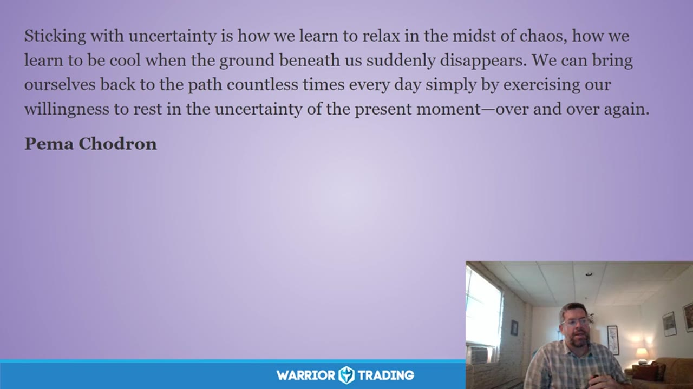

**图怎么看：**

- Sticking with uncertainty is how we learn to relax in the midst of chaos, how we learn to be cool when the ground beneath us suddenly disappears. We can bring ourselves back to the path countless times every day simply by exercising our willingness to rest in the uncertainty of the present moment—over and over again.
- 通过冥想和自我对话，学会在不确定中保持冷静，避免情绪化决策。
- 在不确定中坚持下去，是我们学会在混乱中放松，在我们脚下突然消失的地基时保持冷静的方法。我们可以通过每天无数次地锻炼自己愿意在当下不确定的状态中休息来回到正确的道路上。
- 在不确定中坚持，使我们在混乱中学会放松，在我们脚下的地基突然消失时保持冷静。我们可以通过每天无数次地锻炼自己愿意在当下不确定的状态中休息来回到正确的道路上。

### 关键内容

- 通过冥想练习，帮助交易者在市场波动中保持冷静。
- Pema Chodron的书籍《舒适面对不确定性》强调了接受不确定性的价值。
- 通过呼吸练习，释放身体的紧张和压力。
- 将注意力转向内心，培养对不确定性的接纳。
- 在面对不确定性时，保持开放的心态，促进创造力和创新。
- 通过呼吸和自我对话，逐步进入舒适的状态

### 分析与执行顺序

1. 开始一段关于舒适面对不确定性的引言。
2. 介绍Pema Chodron的书籍《舒适面对不确定性》，强调接受不确定性的价值。
3. 进行呼吸练习，帮助放松身体，释放紧张。
4. 引导参与者将注意力转向内心，培养对不确定性的接纳。
5. 通过自我对话，理解并接受内心的恐惧和不安。
6. 鼓励参与者在面对不确定性时，保持开放的心态，促进创造力和创新。
7. 通过练习，逐步减少对失败和损失的恐惧。
8. 在面对不确定性时，保持中心和稳定，避免冲动和犹豫。
9. 通过练习，逐步建立对内心情绪的友好关系

### 案例与细节

- 在面对Class 5急流时，需要高度集中注意力，保持开放心态，促进创造力。
- 通过呼吸练习，释放喉咙、胸部和腹部的紧张感。
- 通过自我对话，理解并接受内心的恐惧和不安，如害怕失败和损失。
- 在面对不确定性时，保持中心和稳定，避免冲动和犹豫，如避免报复性交易。
- 通过练习，逐步减少对失败和损失的恐惧，如允许自己成为更好的朋友来面对这些情绪

### 风险与边界

- 录制年代限制，此内容适用于2019年的市场环境。
- 市场环境变化可能导致某些策略不再适用。
- 情绪管理技巧可能因个体差异而效果不同。
- 市场波动可能导致情绪波动加剧，需谨慎应对。
- 过度依赖心理调节可能忽视技术分析的重要性

### 复盘问题

- 在面对不确定性时，哪些情绪是你最常遇到的？
- 如何通过自我对话更好地理解并接受内心的恐惧和不安？
- 在实际交易中，你是如何保持中心和稳定的？

---

## v0850：为什么我们冥想及其好处

> 日期：2019-07-15　·　时长：00:45:07

**本场重点：** 通过冥想培养内在平静，提升决策质量；长期实践能带来深刻变化。

**图怎么看：**

- 在冥想中，我们允许自己坐在情绪困扰的状态下。
- 随着练习的增多，我们变得更加开放，并在生活中培养出勇气。
- 在冥想中，你永远不会觉得自己‘做到了’或者‘达到了’。
- 当你有足够的放松来体验内心深处的东西时，你会感到一种深刻的洞察力。

### 关键内容

- 冥想帮助我们面对内心的波动，培养内在的平静。
- 通过冥想，我们可以更好地理解自己的情绪和思维模式。
- 长期冥想可以培养出坚定性、清晰的洞察力、勇气和注意力。
- 冥想有助于我们接受生活中的不确定性，保持开放的心态。
- 冥想可以让我们更深入地了解自己，发现内在的智慧。
- 通过冥想，我们可以更好地处理生活中的挑战，提高应对能力。
- 冥想可以帮助我们摆脱对成功的过度追求，学会接受生活中的平凡。
- 长期冥想可以培养出一种无所谓的态度，但不是消极的态度。
- 冥想可以让我们更好地理解自己，发现内在的力量和智慧。
- 通过冥想，我们可以更好地理解交易的本质，提高决策质量。

### 分析与执行顺序

1. 讲师首先介绍了冥想的基本步骤，包括呼吸练习和身体扫描。
2. 然后，讲师分享了如何通过冥想来培养内在的平静和清晰的洞察力。
3. 接着，讲师讲解了如何通过冥想来培养勇气和注意力。
4. 最后，讲师强调了冥想的重要性，以及它如何帮助我们更好地理解自己。
5. 在整个过程中，讲师多次强调了冥想对于个人成长的重要性。

### 案例与细节

- 讲师提到，通过冥想，可以更好地理解自己的情绪和思维模式。
- 讲师举例说，通过冥想，可以更好地理解交易的本质，提高决策质量。
- 讲师还提到了一个具体的练习，即在冥想时关注自己的呼吸，感受每一次呼吸的变化。
- 讲师分享了一个练习，即在冥想时关注自己的身体，从脚趾到头顶，感受每一个部位的感觉。
- 讲师还提到了一个练习，即在冥想时关注自己的内心，感受心的跳动，体验内心的温暖和爱。

### 风险与边界

- 由于录制于2019年，部分信息可能不再适用，如互联网连接测试等。
- 长期冥想的效果因人而异，需要持续实践。
- 冥想过程中可能会遇到情绪波动，需要有心理准备。
- 冥想需要一定的专注力，初学者可能难以坚持。

### 复盘问题

- 冥想的基本步骤是什么？
- 通过冥想，我们可以获得哪些内在品质？
- 冥想如何帮助我们更好地理解自己？
- 冥想对于交易决策有哪些实际帮助？

---

## v0851：冥想与自我接纳

> 日期：2019-07-22　·　时长：00:42:44

**本场重点：** 通过冥想练习自我接纳，减少恐惧和焦虑，提高交易心理素质。

**图怎么看：**

- 这张图片展示了一个宁静的自然景观，背景是日落时分的山丘和草地，前景是一个圆形的石头堆，可能象征着冥想的中心。
- 这种环境有助于放松心情，减少焦虑和恐惧，从而提高交易的心理素质。
- 图片中的自然美景与冥想的主题相得益彰，营造出一种平静和专注的氛围。
- 通过这样的场景，学员可以更好地集中注意力，进行冥想练习，从而达到自我接纳的目的。

### 关键内容

- Ted分享了如何通过冥想练习自我接纳，减少恐惧和焦虑。
- 通过提问自己当前的感受、情绪和思维，帮助进入当下。
- 冥想过程中，关注呼吸和身体感觉，放松身心。
- 接受自己的情绪和想法，以更温暖和开放的方式对待自己。
- 通过练习，逐步学会在面对困难时保持冷静和接纳。
- Ted提到，面对恐惧时，可以尝试以更温和的方式对待自己。
- 通过练习，可以更好地理解自己内心的需求和动机。
- 通过练习，可以更好地应对生活中的挑战，提高交易心理素质。

### 分析与执行顺序

1. Ted首先分享了一段关于冥想的短文，提醒大家在开始冥想前的一些注意事项。
2. Ted引用了Tarbrock的一段话，强调无条件地爱自己，以更温柔和专注的方式对待自己。
3. Ted介绍了如何在冥想前检查自己的心态，通过一系列问题帮助自己进入当下。
4. Ted引导大家关注自己的感受、情绪和思维，以更温和的方式对待自己。
5. Ted通过自己的体验，展示了如何在面对困难时保持冷静和接纳。

### 案例与细节

- Ted提到了一位朋友最近发展出飞行恐惧症，但选择从一个友好的角度去面对它。
- Ted分享了如何通过冥想练习自我接纳，减少恐惧和焦虑，提高交易心理素质。
- Ted引用了Suzuki的一句话，强调解决问题是额外添加的，而非实际情况。
- Ted提到了一位朋友在交易课程中遇到失败恐惧，通过练习逐渐克服它。
- Ted提到了一位朋友在瑜伽课程中遇到困难，通过练习学会了如何放松自己。

### 风险与边界

- 冥想练习需要持续进行，否则效果可能不佳。
- 录制年代限制，部分信息可能不再适用。
- 冥想练习需要个人自觉，否则难以坚持。
- 冥想练习可能对某些人来说难度较大，需要耐心。
- 冥想练习需要结合实际生活，否则难以见效。

### 复盘问题

- 冥想练习对你个人有何帮助？
- 如何在日常生活中实践自我接纳？
- 你认为哪些因素会影响冥想练习的效果？

---

## v0852：仁慈接受：自我接纳的艺术

> 日期：2019-08-05　·　时长：00:45:00

**本场重点：** 通过冥想和自我接纳，改善交易决策过程中的情绪管理。重点在于理解自己，给予无条件的爱，并接受所有的情绪和感受。

**图怎么看：**

- 主体是树林、湖水与远山构成的安静自然景观，右上角保留讲师的小窗口；这一帧属于心理课程的引导画面，不是行情或下单界面。
- 平缓的景观用来配合仁慈、接受与自我接纳练习，重点是让注意力从交易结果转回当下的身体感受和情绪反应。
- 对应本场主题时，应把画面理解为练习环境提示：允许不舒服的感受出现，再以较少自责的方式观察它，而不是急着压制或用交易来补偿。
- 自然景观本身无法证明心理状态已经改善，也不能替代交易日志、风险限额和复盘；实际效果仍要看人在压力场景中的行为是否改变。

### 关键内容

- 冥想是自我接纳的第一步，通过呼吸和身体感知来放松。
- 自我接纳意味着接受现实，而不是坚持改变它。
- 自我接纳有助于摆脱完美主义和失败感，促进内心的平静。
- 通过练习自我接纳，可以更好地应对交易中的情绪波动。
- 自我接纳不仅适用于积极情绪，也适用于负面情绪。
- 自我接纳需要时间和耐心，不是一蹴而就的过程。
- 自我接纳有助于打破自我怀疑和恐惧的循环。
- 自我接纳是一种内在的转变，需要持续的努力。
- 自我接纳可以提高交易决策的质量，减少情绪化的反应

### 分析与执行顺序

1. 首先进行冥想练习，通过呼吸放松身心。
2. 接着观察自己的情绪和身体感觉，接受它们的存在。
3. 然后转向内心深处，接受那些难以接受的部分。
4. 最后表达接纳的话语，如“我接受你，就像你一样”，并感受它的意义。
5. 在整个过程中，保持开放的心态，接受所有的情绪和感受

### 案例与细节

- 在冥想过程中，注意到自己因为早起而感到困倦，或者有大量思绪。
- 在呼吸时，注意到胸腔和腹部的扩张与收缩。
- 在练习自我接纳时，接受自己在交易中犯错的事实。
- 在表达接纳时，说出“我接受你，就像你一样”，并感受内心的平静。
- 在交易中遇到挫折时，能够以更宽容的态度对待自己

### 风险与边界

- 自我接纳需要时间和耐心，短期内可能看不到明显效果。
- 过度自我接纳可能导致放松警惕，忽视实际问题。
- 自我接纳适用于个人成长，但在特定情况下可能需要专业帮助。
- 录制年代限制，某些心理策略可能随着时间变化而有所不同

### 复盘问题

- 在冥想过程中，你注意到哪些情绪和身体感觉？
- 在练习自我接纳时，哪些部分最难接受？
- 如何将自我接纳应用到日常交易决策中？
- 在面对困难时，你是如何保持自我接纳的？
- 自我接纳对你的交易表现有何影响？

---

## v0853：保持当下：交易心理与冥想

> 日期：2019-08-19　·　时长：00:43:06

**本场重点：** 保持当下是交易成功的关键，通过冥想练习可以减少情绪波动，提高决策质量。但需注意，市场环境不断变化。

**图怎么看：**

- 这张图片显示了Pema Chodron关于如何在失去信心时保持当下的建议。
- 她建议人们改变看待问题的方式，并且向前看。
- 而不是将痛苦归咎于外部环境或自己的弱点。
- 相反，他们可以选择保持当下和清醒地体验自己的经历，不拒绝它，也不抓住它。

### 关键内容

- 冥想可以帮助交易者减少对过去和未来的过度关注，专注于当前时刻。
- 保持当下有助于减少情绪波动，提高决策质量。
- 市场环境不断变化，保持当下需要持续练习。
- 通过呼吸练习，可以逐渐放慢思维速度，进入更深层次的自我连接。
- 接受和同情自己是保持当下的重要步骤。
- 市场总是处于不断变化的状态，保持当下需要适应这种变化。
- 通过练习，可以更好地识别和管理自己的情绪。
- 保持当下有助于提高交易者的专注力和决策能力。
- 冥想是一种有效的工具，可以帮助交易者更好地应对市场波动。

### 分析与执行顺序

1. 讲师分享了一段关于保持当下的冥想练习。
2. 参与者被引导进行深呼吸，放慢思维速度。
3. 通过呼吸练习，参与者逐渐进入更深层次的自我连接。
4. 讲师强调了接受和同情自己在保持当下的重要性。
5. 参与者被鼓励识别和命名自己的情绪。
6. 通过练习，参与者可以更好地管理自己的情绪。
7. 保持当下需要持续练习，以适应不断变化的市场环境。

### 案例与细节

- “我们是生活在一种完全被时间幻觉催眠的文化中，在这种文化中，所谓的现在时刻只是因果过去的微小分界线和吸收性的未来之间的细线。”
- “我们总是处于过去或未来的状态之间，很少真正地活在当下。”
- “通过练习，可以更好地识别和管理自己的情绪。”
- “保持当下有助于提高交易者的专注力和决策能力。”
- “通过呼吸练习，可以逐渐放慢思维速度，进入更深层次的自我连接。”

### 风险与边界

- 市场环境不断变化，保持当下的方法需要适应这种变化。
- 冥想练习的效果因人而异，需要持续练习。
- 保持当下的方法可能在不同市场环境下效果不同。
- 录制年代限制，市场环境和交易策略可能已发生变化。

### 复盘问题

- 冥想练习对您的情绪管理有何帮助？
- 您如何将保持当下的方法应用到实际交易中？
- 您在练习过程中遇到了哪些挑战？

---

## v0854：自我接纳与交易心理

> 日期：2019-08-26　·　时长：00:42:27

**本场重点：** 通过自我接纳来应对交易中的情绪波动，提高交易决策的质量。

**图怎么看：**

- 这张图片展示了一位讲师在进行自我接纳和交易心理的演讲。
- 演讲内容强调了自我接纳的重要性，并鼓励人们通过自我接纳来应对交易中的情绪波动。
- 演讲还提到了改变对负面情绪的看法和保持清醒的态度。
- 这些观点有助于提高交易决策的质量，从而更好地管理情绪波动。

### 关键内容

- 讲师介绍了Pema Chodron的名言，强调了在面对困难时选择软化自己而非硬化。
- 通过冥想练习，帮助参与者学会自我接纳，减少情绪反应。
- 自我接纳并不意味着放弃任何东西，而是接受自己的真实状态。
- 面对愤怒等负面情绪，通过自我接纳和理解来缓解情绪。
- 保持内心的平静，避免因情绪波动做出冲动的交易决策。
- 通过练习，逐步学会在困难时刻保持冷静和理性。
- 自我接纳有助于建立更健康的心理状态，提高交易表现。
- 通过练习，可以更好地理解自己和他人的反应模式。
- 自我接纳不仅适用于自己，也适用于他人，有助于建立更好的人际关系。
- 通过练习，可以逐渐减少对负面情绪的抵抗，增加接纳度

### 分析与执行顺序

1. 讲师首先介绍了Pema Chodron的名言，强调了在面对困难时选择软化自己而非硬化。
2. 然后引导参与者进行冥想练习，帮助他们放松身心。
3. 通过呼吸练习，帮助参与者识别并释放身体内的紧张情绪。
4. 进一步引导参与者转向内心深处，感受心的温暖和爱。
5. 最后，鼓励参与者将这种自我接纳的态度带入日常生活中，包括交易决策。
6. 在整个过程中，讲师不断提醒参与者注意自己的情绪变化，学会自我接纳。
7. 通过反复练习，逐步培养出更加平和的心态，减少情绪波动带来的负面影响

### 案例与细节

- 讲师提到自己曾经历过的愤怒情绪，并分享了如何通过自我接纳来处理这种情绪。
- 通过冥想练习，参与者能够感受到呼吸的节奏，从而放松身心。
- 讲师举例说明了在交易中遇到困难时，如何通过自我接纳来缓解情绪。
- 通过练习，参与者能够更好地理解自己和他人的反应模式，从而做出更理性的决策。
- 讲师分享了如何通过自我接纳来处理交易中的失败和挫折，从而保持积极的心态

### 风险与边界

- 由于录制年代较早，部分心理策略可能需要根据当前市场环境进行调整。
- 自我接纳的过程需要持续练习，否则效果可能不佳。
- 在交易中，自我接纳虽然有助于减少情绪波动，但并不能完全消除风险。
- 在面对极端市场情况时，自我接纳可能不足以应对突发的情绪波动
- 自我接纳需要结合其他心理策略共同使用，才能达到最佳效果

### 复盘问题

- 在交易中遇到情绪波动时，你是如何处理的？
- 通过这次练习，你是否发现了自己的哪些情绪反应模式？
- 在日常生活中，你是否能够更好地接纳自己和他人？

---

## v0855：自我接纳与交易心理

> 日期：2019-09-09　·　时长：00:44:22

**本场重点：** 通过自我接纳，我们可以更好地处理交易中的恐惧和挫折，从而提高交易表现。

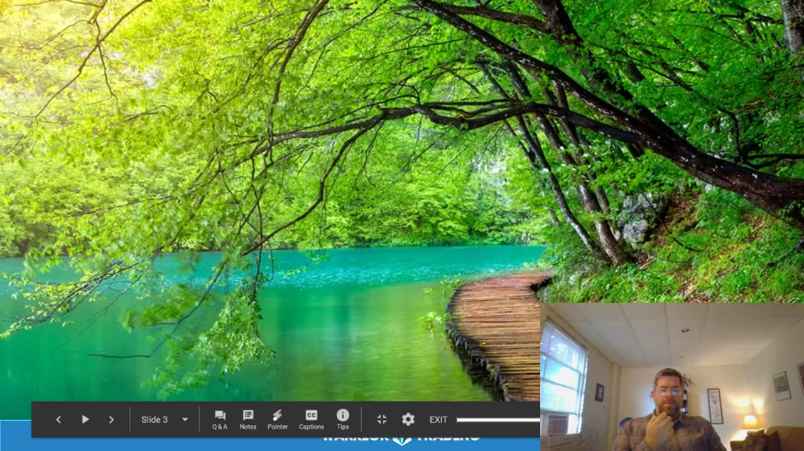

**图怎么看：**

- 这张图片展示了一条穿过森林的小溪，周围环绕着茂密的树木。
- 它传达了自然环境的宁静和美丽，可能用于强调在交易中找到平静和平衡的重要性。
- 森林中的小溪象征着内心的平静和自我接纳，帮助人们在面对挑战时保持冷静。
- 这种场景有助于提醒参与者在交易过程中寻找内心的平静，以实现更好的自我接纳和情绪管理。

### 关键内容

- 讲师引用了Tara Brock的书籍《Radical Acceptance》，强调接受自己当前的状态。
- 通过自我接纳，可以减轻交易中的负面情绪，如恐惧和失望。
- 自我接纳需要在情绪波动时保持柔软和同情心。
- 自我接纳有助于识别和改变内心的负面模式。
- 自我接纳可以减少对损失的过度反应，帮助恢复交易信心。
- 自我接纳需要区分同情和怜悯，前者更有利于个人成长。
- 自我接纳需要认识到自己的局限性，但同时保持希望。
- 自我接纳需要认识到情绪只是暂时的，而不是永恒的。
- 自我接纳需要认识到每个人都有自己的挑战，不应感到孤单。
- 自我接纳需要认识到即使在困难时期，生活仍然值得被珍惜。

### 分析与执行顺序

1. 讲师分享了Tara Brock的引言，强调接受自己当前的状态。
2. 通过冥想练习，引导学员关注呼吸和身体感受。
3. 鼓励学员在情绪波动时转向自己，给予自己同情和接纳。
4. 通过自我接纳，识别和改变内心的负面模式。
5. 通过自我接纳，减少对损失的过度反应，恢复交易信心。
6. 通过自我接纳，区分同情和怜悯，前者更有利于个人成长。
7. 通过自我接纳，认识到情绪只是暂时的，而不是永恒的。

### 案例与细节

- 讲师提到“Imagine you are walking in the woods and you see a small dog sitting by a tree...”，通过这个例子说明如何从愤怒转向关心。
- 讲师提到“when we behave in hurtful ways, it is because we are caught in some kind of trap...”，通过这个例子说明如何理解内在的脆弱和痛苦。
- 讲师提到“if you've been in a bad trade or have had a loss...”，通过这个例子说明如何处理交易中的失败。
- 讲师提到“how do you tend to respond...”，通过这个例子说明大多数人在交易失败时的常见反应。
- 讲师提到“how do we begin to sponsor that change into our lives, into the world...”，通过这个例子说明如何支持自己进行积极改变。

### 风险与边界

- 自我接纳需要时间和持续的努力，否则可能难以立即见效。
- 自我接纳需要区分同情和怜悯，否则可能会陷入消极的情绪循环。
- 自我接纳需要认识到情绪只是暂时的，否则可能会忽视长期的心理健康。
- 录制年代限制可能会影响某些策略的有效性，例如市场环境的变化。

### 复盘问题

- 在交易中遇到挫折时，你如何应用自我接纳的方法？
- 你如何区分同情和怜悯，以更好地处理情绪波动？
- 你如何通过自我接纳来识别和改变内心的负面模式？

---

## v0856：自我探究与慈悲心

> 日期：2019-09-16　·　时长：00:44:29

**本场重点：** 通过自我探究与慈悲心，我们可以更好地应对交易中的情绪反应，从而提高交易表现。

**图怎么看：**

- 图片B展示了一个自然景观，可能象征着内心的平静和自我探索。
- 图片B中的自然美景与内心状态的联系，暗示了通过自我探究与慈悲心，可以提升交易表现。
- 图片B中的自然景观为交易者提供了一种反思和放松的方式，有助于在交易过程中保持冷静和专注。
- 图片B中的自然景观与交易者的内心状态相呼应，强调了内在平衡的重要性。

### 关键内容

- Ted 强调了接受并不意味着无行动，而是从和平中心回应而非反应。
- 通过练习呼吸冥想，可以更好地关注当下，减少情绪反应。
- 接受和慈悲心可以帮助我们更好地处理内心的波动。
- 自我探究与慈悲心是应对交易压力的有效工具。
- 接受和慈悲心可以减少情绪反应的强度，帮助我们更好地应对市场变化。
- 通过练习，我们可以逐渐培养出更加开放的心态。
- 接受和慈悲心可以帮助我们更好地理解自己的内心世界。
- 通过练习，我们可以更好地应对交易中的情绪波动。
- 接受和慈悲心可以让我们更好地处理过去的创伤经历。
- 接受和慈悲心可以帮助我们更好地理解自己，从而做出更明智的决策

### 分析与执行顺序

1. Ted 开始介绍今天的主题：自我探究与慈悲心。
2. 他解释了接受并不意味着无行动，而是从和平中心回应而非反应。
3. Ted 引导大家进行呼吸冥想，以帮助大家更好地关注当下。
4. 他提醒大家注意自己在交易中可能持有的情绪，并尝试用慈悲心去接纳它们。
5. Ted 让大家在冥想过程中观察自己对情绪的反应方式。
6. 他鼓励大家在冥想结束后，继续将这种慈悲心应用到日常生活中

### 案例与细节

- “如果我们在交易中遇到挫折，我们可能会试图控制情绪，但这样做往往效果不佳。”
- “例如，当我们在交易中遇到亏损时，我们可能会感到沮丧和失望，但如果能够用慈悲心去接纳这些情绪，我们可能会更好地应对这种情况。”
- “例如，当我们在交易中遇到成功时，我们可能会感到兴奋和激动，但如果能够用慈悲心去接纳这些情绪，我们可能会更好地处理成功后的喜悦。”
- “例如，当我们在交易中遇到失败时，我们可能会感到沮丧和失望，但如果能够用慈悲心去接纳这些情绪，我们可能会更好地处理失败后的失落感。”

### 风险与边界

- 接受和慈悲心需要长期练习才能有效，否则可能无法立即改善交易表现。
- 接受和慈悲心可能无法完全消除情绪反应，因此仍需结合其他情绪管理方法。
- 录制年代限制可能会影响某些策略的有效性，因此需要结合当前市场环境进行调整。
- 接受和慈悲心可能不适合所有人，有些人可能需要其他方法来管理情绪反应

### 复盘问题

- 在冥想过程中，你如何观察自己的情绪反应？
- 在接受和慈悲心的过程中，你遇到了哪些挑战？
- 你如何将接受和慈悲心应用到实际交易中？

---

## v0857：初学者心态在交易中的应用

> 日期：2019-09-23　·　时长：00:44:32

**本场重点：** 初学者心态有助于保持开放思维，避免情绪化反应；通过练习和耐心，可以达到交易中的流状态。

**图怎么看：**

- 本场重点：初学者心态有助于保持开放思维，避免情绪化反应；通过练习和耐心，可以达到交易中的流状态。
- Shunryu Suzuki 提到，在日本有一个术语 'Shoshin'，意思是 '初学者的心态'。我们的 '原始心态' 包括我们自身的一切，总是丰富且自足。这并不意味着封闭的心态，而是空心和准备的心态。
- 如果心态是空的，它总是准备好一切。它是对一切开放的。在初学者的心态中有许多可能性；在专家的心态中则很少。
- 通过练习和耐心，可以达到交易中的流状态。

### 关键内容

- 初学者心态是一种开放的心态，有助于避免情绪化反应。
- 通过练习和耐心，可以达到交易中的流状态。
- 初学者心态要求放弃专家的习惯，准备好接受和怀疑。
- 初学者心态有助于理解市场的真实情况。
- 初学者心态要求放弃对市场的控制感。
- 初学者心态有助于避免冲动交易。
- 初学者心态要求接受自己不是专家的事实。
- 初学者心态有助于提高交易决策的准确性。
- 初学者心态要求接受市场变化的不确定性。
- 初学者心态有助于提高交易的心理素质。

### 分析与执行顺序

1. 讲师介绍了初学者心态的概念，强调了开放心态的重要性。
2. 讲师分享了初学者心态如何帮助避免情绪化反应的例子。
3. 讲师提到了交易中的流状态，并解释了如何通过练习达到这种状态。
4. 讲师分享了初学者心态如何帮助理解市场的真实情况。
5. 讲师强调了初学者心态要求放弃对市场的控制感。
6. 讲师通过例子说明了初学者心态如何帮助避免冲动交易。
7. 讲师总结了初学者心态对提高交易决策准确性和心理素质的重要性。

### 案例与细节

- 讲师提到初学者心态要求放弃专家的习惯，比如在交易中保持空杯心态。
- 讲师分享了初学者心态如何帮助理解市场的真实情况，比如通过练习和耐心达到流状态。
- 讲师提到了初学者心态如何帮助避免冲动交易，比如通过观察市场变化而不是盲目跟风。
- 讲师分享了初学者心态如何帮助提高交易决策的准确性，比如通过接受市场变化的不确定性。
- 讲师提到了初学者心态如何帮助提高交易的心理素质，比如通过练习和耐心达到流状态。

### 风险与边界

- 初学者心态要求放弃对市场的控制感，这可能导致交易决策的不确定性。
- 初学者心态要求接受市场变化的不确定性，这可能导致交易中的波动性增加。
- 初学者心态要求接受自己不是专家的事实，这可能导致交易中的挫败感。
- 初学者心态要求放弃专家的习惯，这可能导致交易中的犹豫不决。
- 初学者心态要求接受市场变化的不确定性，这可能导致交易中的风险增加。

### 复盘问题

- 初学者心态如何帮助避免情绪化反应？
- 如何通过练习和耐心达到交易中的流状态？
- 初学者心态如何帮助理解市场的真实情况？

---

## v0858：与恐惧为友

> 日期：2019-09-30　·　时长：00:45:17

**本场重点：** 通过冥想和接受，我们可以更好地理解并处理恐惧，从而在交易中更加冷静和理性。

**图怎么看：**

- 画面整体：清晰的教学视频截图，包含讲解者和自然景观背景。
- 可见信息：没有具体可见的文字内容。
- 与本场关系：图片展示了与恐惧相关的冥想练习，强调了通过冥想和接受恐惧来提高交易中的冷静和理性。
- 阅读边界：图片虽然展示了冥想练习，但没有具体的交易数据或市场分析内容。

### 关键内容

- 恐惧是一种无意识驱动我们生活的潜意识力量。
- 通过命名和接受恐惧，我们可以开始以更爱的方式与之相处。
- 恐惧总是对未来的一种预想，一种想象，通常是没有根据的。
- 通过持续的耐心和勇气，我们可以逐渐学会信任自己。
- 恐惧有时会让我们冻结，有时会推动我们前进。
- 通过接受恐惧，我们可以更好地理解自己的内心世界。
- 恐惧是交易中常见的体验，我们需要学会接受它。
- 通过练习冥想，我们可以逐步学会信任自己。

### 分析与执行顺序

1. 首先，分享马克·吐温的名言，解释恐惧如何成为潜意识的力量。
2. 然后，介绍杰克·科恩菲尔德的观点，解释如何通过接受来释放恐惧。
3. 接着，进行冥想练习，通过呼吸和重复词语来放松身心。
4. 最后，讨论如何将这些方法应用到实际交易中，以更好地管理情绪。
5. 在整个过程中，强调接受和理解的重要性，以及如何逐步建立信任

### 案例与细节

- 在交易中，恐惧可能会导致我们冻结，无法进入一个好的交易机会。
- 当遇到亏损时，恐惧可能会让我们坚持下去，甚至加倍下注，试图回到盈亏平衡点，最终导致更大的损失。
- 通过冥想练习，可以更好地理解自己的情绪反应，例如恐惧和兴奋。
- 在交易中，恐惧有时会让我们过于谨慎，有时会让我们冒险。
- 通过接受恐惧，可以更好地理解自己的内心世界，从而做出更好的决策

### 风险与边界

- 在交易中，过度依赖冥想可能会导致忽视市场动态的变化。
- 恐惧有时会让我们过度谨慎，有时会让我们冒险。
- 通过接受恐惧，可以更好地理解自己的内心世界，但过度接受可能导致失去判断力。
- 录制年代限制意味着这些方法可能需要根据当前市场情况进行调整

### 复盘问题

- 在交易中，你如何识别和管理自己的恐惧情绪？
- 通过冥想练习，你是否能够更好地理解自己的情绪反应？
- 在实际交易中，你如何应用这些方法来更好地管理情绪？

---

## v0859：Mindful Monday：Bodichita 的实践

> 日期：2019-10-07　·　时长：00:44:18

**本场重点：** 通过 Bodichita 实践，我们可以更好地应对交易中的挫折和情绪波动，培养更积极的心态。

**图怎么看：**

- 通过 Bodhichitta 实践，我们可以更好地应对交易中的挫折和情绪波动，培养更积极的心态。
- Bodhichitta 是一个 Sanskrit 词，翻译为 '觉醒的心灵'。当我们进入一个开放、专注的意识状态，并且这种意识基于我们自己的爱与同情心时，我们就激活了 Bodhichitta。
- 它被描述为不可摧毁的、柔软的中心点，能够容纳并转变我们最困难的经历。
- Bodhichitta 被比喻为永恒的阳光和温暖，而我们的情绪波动则像是遮挡视线的风暴云。随着练习和学习的增加，我们开始将这些情绪波动视为天气变化，它们可以吸引并拖拽我们，但同时我们知道它们只是短暂的。

### 关键内容

- Bodichita 概念强调在困难面前保持柔软和善良。
- 通过接受和同情自己，可以改变负面情绪的影响。
- 交易中遇到挫折时，可以通过冥想来缓解压力。
- 接受自己的情绪波动是自我成长的一部分。
- 通过练习，可以逐渐建立更积极的心态。
- 通过冥想，可以更好地理解自己的情绪和市场反应。
- 交易需要耐心和持续的努力，而不是急于求成。
- 面对恐惧，最好的方法是与之和平相处。

### 分析与执行顺序

1. 讲师介绍了 Bodichita 的概念，强调了它的重要性。
2. 通过分享一个比喻，讲师展示了如何面对情绪波动。
3. 讲师引导听众进行冥想，以缓解情绪压力。
4. 讲师分享了如何在交易中应用 Bodichita 的实践方法。
5. 讲师通过提问，鼓励听众分享自己的交易经验。
6. 讲师总结了 Bodichita 的重要性，并鼓励听众继续练习。
7. 讲师结束时，提醒听众注意自我承诺的重要性

### 案例与细节

- 当遇到损失或 FOMO 时，我们倾向于变得越来越僵硬，视野变得狭窄，反应变得更强。
- 通过接受和同情自己，可以改变对这些经历的看法。
- 当遇到挫折时，试着放慢脚步，接受自己的情绪。
- 通过练习，可以逐渐建立更积极的心态。
- 交易中的情绪波动就像天气变化，暂时的风暴会过去。
- 通过诗歌，可以更好地理解自我承诺的重要性

### 风险与边界

- 交易环境和市场条件不断变化，因此需要灵活调整。
- 心理训练的效果因人而异，需要持续练习。
- 交易中的情绪波动可能会影响决策，需要谨慎处理。
- 录制年代限制，当前市场情况可能与当时有所不同

### 复盘问题

- 你在交易中遇到过哪些情绪波动？如何应对这些情绪？
- 你如何理解 Bodichita 的概念？它如何帮助你在交易中保持冷静？
- 你能否分享一个具体的例子，说明如何通过接受和同情自己来改变情绪？

---

## v0860：提高交易中的不确定容忍度

> 日期：2019-10-14　·　时长：00:44:59

**本场重点：** 通过提高对不确定性的容忍度，可以更好地应对市场波动，减少情绪化决策带来的负面影响。

**图怎么看：**

- 通过提高对不确定性的容忍度，可以更好地应对市场波动，减少情绪化决策带来的负面影响。
- Pema Chodron的引言强调了在面对不确定性时如何学会放松和保持冷静。
- 通过持续地练习对不确定性的容忍，我们可以将自己带回到日常生活中，即使是在充满变化的情况下也能保持稳定。
- 这种能力有助于我们在交易中做出更明智的决策，从而减少因情绪波动而产生的错误。

### 关键内容

- 交易过程中常常受到情绪波动的影响，需要学会接受不确定性。
- 通过冥想和呼吸练习，可以缓解紧张情绪，提高决策质量。
- 保持耐心和持续性，逐步提升交易技能，避免过度自信。
- 在交易中遇到困难时，可以参考David White的诗句，提醒自己保持清醒。
- 识别并接受自己的情绪，有助于做出更理性的决策。
- 在交易前进行自我检查，确保处于最佳状态。
- 通过练习，逐渐适应市场的不确定性，提高应对能力。
- 保持对市场的敬畏之心，避免盲目跟风。
- 通过接受不确定性，可以减少恐惧，增加创造力和警觉性

### 分析与执行顺序

1. 首先，通过呼吸练习放松身体，减轻紧张情绪。
2. 然后，通过冥想练习，提高对当下的感知能力。
3. 接着，识别并接受自己的情绪，避免过度反应。
4. 最后，制定每日交易前的自我检查清单，确保状态良好。
5. 在交易过程中，保持耐心和持续性，逐步提升技能水平。
6. 遇到困难时，参考David White的诗句，提醒自己保持清醒。
7. 在面对不确定时，保持开放心态，寻找无限可能性

### 案例与细节

- Kyle提到，他发现自己很难在当下感到满足，而总是想着未来。
- Eduardo分享，他在冥想时难以找到自己的心，但通过将手放在那个空间，情况有所改善。
- Dan提到，他刚刚完成了一个摆动交易课程，但不确定下一步该做什么。
- Pema Chodron的观点是，当我们习惯于不确定性时，无限的可能性就会在我们的生活中打开。
- Tacitus的观点是，对安全的渴望阻碍了伟大的事业，这适用于交易中的不确定性

### 风险与边界

- 交易环境不断变化，需要根据当前市场情况进行调整。
- 过度依赖冥想和呼吸练习可能忽视实际操作中的重要细节。
- 长期交易中可能会遇到心理疲劳，需要适时休息。
- 市场波动可能导致情绪波动，影响决策质量。
- 录制年代限制为2019年，部分信息可能不再适用

### 复盘问题

- 在交易前进行了哪些自我检查？
- 如何处理交易过程中的情绪波动？
- 在面对不确定性时，采取了哪些具体措施？

---

## v0861：情绪冲动的解脱

> 日期：2019-10-21　·　时长：00:42:39

**本场重点：** 本课程重点在于通过冥想练习，学会识别并接受情绪冲动，从而减少交易中的冲动行为。

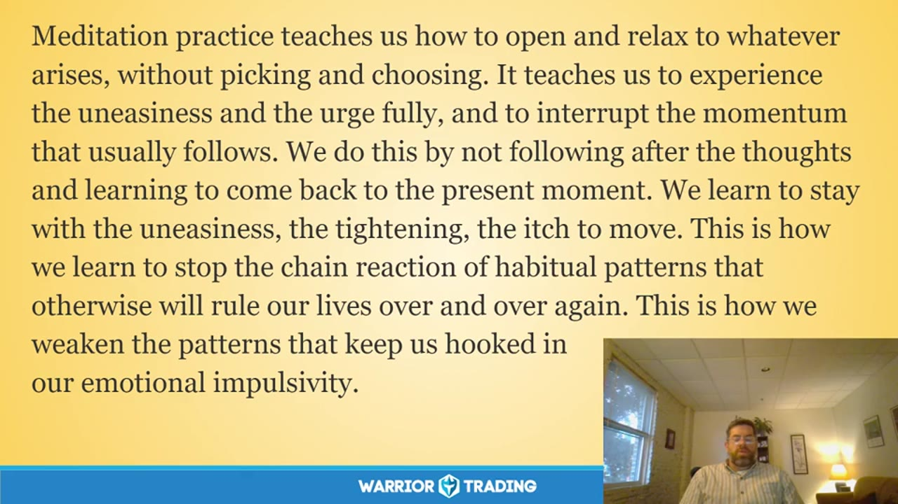

**图怎么看：**

- 冥想练习教会我们如何开放和放松地面对任何出现的事情，而无需选择和决定。
- 它教导我们充分体验不安和冲动的感觉，并打断通常随之而来的惯性。
- 我们通过不跟随思绪，而是回到当下时刻来学习与不安、紧绷感和移动的渴望共存。
- 这使我们能够停止习惯性模式的连锁反应，这些模式会反复控制我们的生活。

### 关键内容

- 课程开始时，讲师介绍了今天的主题是“解脱情绪冲动”，强调了这一技能的重要性。
- 通过冥想练习，学员可以学会识别并接受自己的情绪冲动，从而减少交易中的冲动行为。
- 通过练习，学员可以学会区分情绪冲动和真实的市场机会，从而做出更明智的决策。
- 课程还提到了非识别性（non-identification）的概念，即学会从情绪中抽离，回归到更深的自我意识中。
- 课程最后引用了一首诗，强调了接受和顺应生活的重要性，而非试图控制它。

### 分析与执行顺序

1. 课程开始时，讲师带领学员进行冥想练习，通过深呼吸来放松身心。
2. 讲师引导学员注意自己的身体感受，包括呼吸、胸腹的扩张和收缩等。
3. 通过练习，学员学会了识别并接受自己的情绪冲动，而不是立即采取行动。
4. 通过练习，学员可以学会在面对情绪冲动时保持冷静，而不是立即采取行动。
5. 课程强调了自我接纳的重要性，即无论情绪如何，个人的价值不会因此改变。

### 案例与细节

- 讲师引用了心理学家John Wellwood的观点，强调了面对情绪时保持开放的态度能够释放内在的力量。
- 课程中提到了情绪冲动的本质，即当情绪出现时，它们会试图推动我们采取行动。
- 通过练习，学员可以学会识别并接受自己的情绪冲动，而不是立即采取行动。

### 风险与边界

- 课程中的建议基于历史录制内容，当前市场环境可能有所不同。
- 学员需要根据自身情况灵活应用这些技巧，避免过度依赖。
- 课程中的某些概念可能难以完全理解，需要反复练习。
- 学员需要结合实际情况，避免盲目模仿他人的交易行为。

### 复盘问题

- 你能否识别并接受自己的情绪冲动？
- 你在交易中是否经常受到情绪的影响？
- 你如何在面对情绪冲动时保持冷静？

---

## v0862：接纳情绪波动

> 日期：2019-10-28　·　时长：00:46:09

**本场重点：** 学会接纳情绪波动，而非逃避，是提高交易心理素质的关键。

**图怎么看：**

- 这张幻灯片详细介绍了如何通过接纳情绪波动来提高交易心理素质。
- 幻灯片上引用了Pema Chödrön的《接纳不受欢迎》一书的内容，强调了保护自己免受痛苦的无效性。
- 幻灯片还提到了Trungpa Rinpoche关于唤醒心/意识的方法，即从受伤的心开始。
- 此外，幻灯片还介绍了一种名为L.E.S.R.（Locate, Embrace, Stop, Remain）的冥想练习，帮助人们在面对困难情绪时找到并接纳自己的感受。

### 关键内容

- 情绪波动是交易中常见的现象，包括恐惧、犹豫、自我怀疑等。
- 通过练习，可以逐渐学会接纳这些情绪，而不是逃避。
- 情绪波动源于身体感受，如喉咙、胸部、腹部。
- 接纳情绪需要练习，逐步培养对痛苦的承受力。
- 区分疼痛和痛苦，前者是生活事件带来的，后者是额外的心理负担。
- 接纳情绪波动有助于提高交易心理素质，减少决策失误。
- 通过练习，可以逐步建立对情绪波动的适应能力。
- 情绪波动是交易中不可避免的一部分，要学会与之共存。
- 通过练习，可以逐步减少对舒适感的依赖，增加对痛苦的承受力。

### 分析与执行顺序

1. 首先进行冥想练习，帮助放松身心。
2. 然后识别当前的情绪状态，如恐惧、犹豫等。
3. 接着将注意力集中在身体的感受上，如喉咙、胸部、腹部。
4. 进一步练习接纳这些情绪，而不是逃避。
5. 最后通过持续练习，逐步提高对情绪波动的适应能力。

### 案例与细节

- 在交易中遇到挫折时，情绪可能会集中在喉咙或胸部。
- 当感到愤怒或失望时，可以尝试接受这些情绪，而不是试图压抑它们。
- 通过练习，可以逐渐减少对舒适感的依赖，增加对痛苦的承受力。
- 在交易中遇到失败时，可以尝试接纳这种失败带来的痛苦，而不是逃避它。
- 通过练习，可以逐步建立对情绪波动的适应能力，从而提高交易心理素质。

### 风险与边界

- 情绪波动是交易中不可避免的一部分，过度依赖舒适感会降低应对压力的能力。
- 过度接纳负面情绪可能导致情绪耗竭，影响交易表现。
- 交易环境不断变化，需要持续练习以适应新的市场情况。
- 交易心理素质的提升是一个长期过程，短期内难以看到明显效果。

### 复盘问题

- 在交易中遇到情绪波动时，如何识别并接纳这些情绪？
- 通过哪些具体练习可以帮助提高对情绪波动的适应能力？
- 在交易过程中，如何平衡接纳情绪与保持理性决策之间的关系？

---

## v0863：仁慈接受与自我接纳

> 日期：2019-11-04　·　时长：00:42:49

**本场重点：** 通过冥想和自我接纳，改善交易心态，克服恐惧和自我批评。

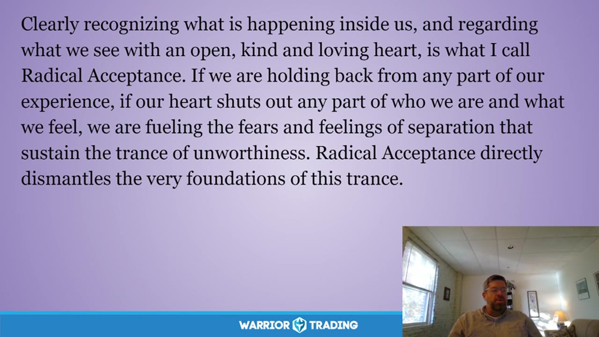

**图怎么看：**

- 这张图片展示了一片宁静的森林湖泊，树木繁茂，湖水清澈见底，给人一种平静和放松的感觉。
- 森林中的湖景图片可能象征着内心的平静和自我接纳。
- 通过欣赏自然美景，人们可以更好地理解自己的内心状态，并找到内心的平衡。
- 这种视觉上的宁静有助于提升交易心态，减少恐惧和自我批评。

### 关键内容

- 冥想是自我接纳的第一步，通过呼吸感受身体的放松。
- 自我接纳意味着接受现实，而不是坚持完美，这有助于提高交易表现。
- 面对失败和情绪波动时，给予自己善意和理解，帮助克服自我批评。
- 自我接纳是摆脱恐惧和自我怀疑的关键，促进内心的平静。
- 通过反思自己的交易行为，可以更好地理解自我接纳的重要性。
- 自我接纳需要时间和练习，但能够带来深刻的改变。
- 自我接纳不仅适用于交易，也适用于生活中的其他方面。
- 通过接受自己和生活的现状，可以找到真正的自由和幸福。
- 自我接纳需要勇气面对内心的恐惧和不安，但这是值得的。

### 分析与执行顺序

1. 首先进行冥想练习，通过呼吸感受身体的放松。
2. 然后讨论自我接纳的概念，解释其重要性。
3. 接着分享个人经历，如何通过自我接纳改善交易表现。
4. 最后引用Mark Nipo的诗歌，进一步强调自我接纳的意义。
5. 在整个过程中，鼓励参与者反思自己的交易行为和心态。

### 案例与细节

- 在一次直播交易中，参与者发现自己在交易时过于紧张，甚至对自己进行批评。
- 通过自我接纳，参与者学会了接受自己的错误，并从中学习。
- 在一次交易中，参与者因为担心失败而犹豫不决，最终导致错失良机。
- 通过自我接纳，参与者能够更好地管理情绪，保持冷静。
- 在一次交易中，参与者因为担心被家人失望而感到压力巨大，影响了决策。

### 风险与边界

- 自我接纳需要时间和练习，短期内可能看不到明显效果。
- 过度自我接纳可能导致放松过度，影响交易决策。
- 自我接纳需要勇气面对内心的恐惧和不安，这可能对某些人来说是一个挑战。
- 录制年代限制，某些方法可能不再适用于当前市场环境。
- 自我接纳需要持续的努力，否则可能会逐渐减弱效果。

### 复盘问题

- 在冥想过程中，你注意到哪些情绪和想法？
- 自我接纳如何帮助你在交易中做出更好的决策？
- 你如何在日常生活中实践自我接纳？

---

## v0864：交易心理与正念冥想

> 日期：2019-11-11　·　时长：00:46:04

**本场重点：** 正念冥想是提高交易心理素质的有效方法，通过自我接纳和慈悲对待自己，可以更好地应对市场波动。但这种方法需要长期坚持。

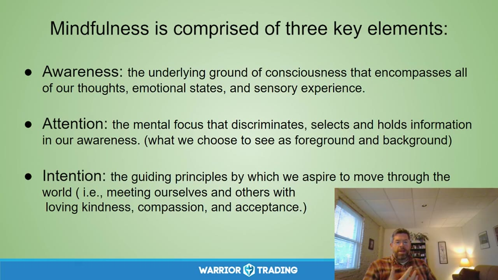

**图怎么看：**

- Mindfulness is comprised of three key elements: Awareness, Attention, and Intention.
- Awareness: the underlying ground of consciousness that encompasses all of our thoughts, emotional states, and sensory experience.
- Attention: the mental focus that discriminates, selects, and holds information in our awareness. (What we choose to see as foreground and background).
- Intention: the guiding principles by which we aspire to move through the world (i.e., meeting ourselves and others with loving kindness, compassion, and acceptance).

### 关键内容

- 正念冥想的核心在于培养自我接纳和慈悲对待自己，这有助于缓解情绪压力。
- 正念冥想包括三个关键要素：意识、注意力和意图。
- 非评判态度意味着以客观的态度看待自己的经历，不自我批评。
- 耐心是学习过程中的重要品质，需要持续练习。
- 初学者心态意味着以开放的心态面对未知，不固守已知。
- 信任自己是自我引导和权威，相信自己的直觉。
- 非努力努力是指在当下放松，而不是追求完美。
- 接受现实是接受事物的真实状态，而不是期望它们如何。
- 放下意味着接受当前时刻的变化，愿意随之变化

### 分析与执行顺序

1. 讲师首先分享了几个关于正念和慈悲的引用，以引入主题。
2. 然后进行了一段简短的冥想练习，帮助参与者体验正念。
3. 接着讲解了正念冥想的三个关键要素：意识、注意力和意图。
4. 进一步解释了非评判、耐心、初学者心态、信任、非努力努力、接受和放下等七个态度基础。
5. 最后通过雨公式（Recognize, Accept, Investigate, Non-Identification）来指导如何处理情绪反应。
6. 整个过程中，讲师不断强调正念冥想对改善交易心理的重要性。
7. 最后，讲师分享了一首诗，鼓励大家珍惜生命，积极面对生活中的挑战。

### 案例与细节

- “You hold in your hands an invitation to remember the transforming power of forgiveness and loving kindness.” 这句话强调了正念冥想中自我接纳和慈悲的重要性。
- “I have come to see that our problem is that we don't know what happiness is.” 讲师引用了Mark Epstein的观点，说明了正念冥想对于理解幸福的意义。
- “A big part of what he's talking about here is this willingness to meet all of our emotions with loving, kindness, warmth, acceptance, compassion.” 讲师解释了如何用慈悲对待自己的情绪。
- “So, mindfulness is basically a mental state achieved by focusing one's awareness on the present moment, while calmly acknowledging and accepting one's feelings, thoughts, and physical sensations.” 讲师定义了正念冥想的状态。
- “The ability to receive the pleasant without grasping and the unpleasant without condemning.” 讲师强调了正念冥想中接受情绪的能力。

### 风险与边界

- 正念冥想需要长期坚持，短期内可能难以看到明显效果。
- 市场环境变化可能导致情绪波动，影响正念冥想的效果。
- 录制年代限制，一些具体操作方法可能不再适用当前市场环境。
- 正念冥想的效果因人而异，需要个体根据自身情况调整实践方法。
- 正念冥想可能需要一定时间才能熟练掌握，期间可能会遇到挫折。

### 复盘问题

- 正念冥想中的非评判态度如何帮助你在交易中保持冷静？
- 耐心在交易学习过程中扮演什么角色？
- 初学者心态如何帮助你更好地适应市场变化？
- 信任自己在交易中意味着什么？
- 非努力努力如何帮助你在交易中找到平衡？

---

## v0865：五种冥想的好处及其在交易中的应用

> 日期：2019-11-18　·　时长：00:45:43

**本场重点：** 冥想如何帮助我们更好地应对市场波动，提高交易心理素质。

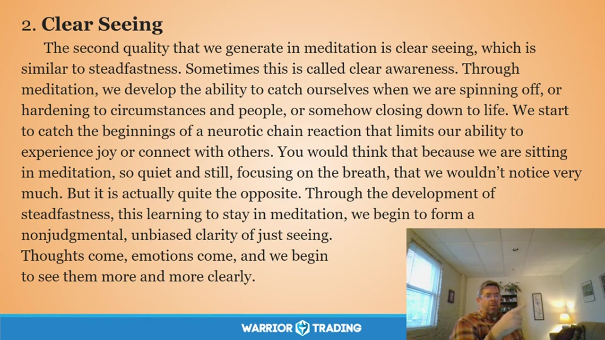

**图怎么看：**

- 通过冥想，我们能够培养出一种清晰的洞察力，类似于坚定不移。这被称为清晰意识。
- 在冥想过程中，我们能够捕捉到自己在分心、对环境和他人产生固执态度时的情况。
- 我们开始注意到神经质连锁反应的开端，这种反应限制了我们体验快乐或与他人建立联系的能力。
- 尽管我们在冥想中保持安静和静止，专注于呼吸，但实际上我们并没有忽视很多东西。

### 关键内容

- 冥想可以帮助我们更好地认识自己的情绪和身体感受，从而提高交易心理素质。
- 通过冥想，我们可以学会接受生活中的不确定性，而不是总是寻求确定性。
- 冥想可以培养我们的专注力，使我们更加关注当前的市场情况。
- 冥想有助于我们保持谦逊的态度，避免因成功而变得骄傲。
- 冥想可以提高我们的自我意识，帮助我们更好地理解自己的情绪反应。
- 冥想可以让我们学会放下，不再过分执着于过去的得失。
- 冥想可以培养我们的勇气，面对情绪上的挑战。
- 冥想可以提高我们的清晰度，帮助我们更好地识别市场趋势。
- 冥想可以让我们学会接受生活中的变化，而不是抗拒它。
- 冥想可以提高我们的耐心，帮助我们在市场中保持冷静。

### 分析与执行顺序

1. 讲师首先介绍了自己进行口腔手术的经历，强调了冥想在手术过程中的帮助。
2. 然后，讲师分享了如何通过冥想来缓解身体的紧张感，特别是肩部、胸部、背部、颈部和颌部的紧张。
3. 接着，讲师介绍了如何通过呼吸将注意力集中在身体的不同部位，以释放这些部位的紧张。
4. 讲师还分享了如何通过冥想来提高对市场的专注力，特别是在交易过程中。
5. 最后，讲师强调了冥想如何帮助我们接受生活中的不确定性，而不是试图控制一切。

### 案例与细节

- 讲师提到自己在做家务时，如洗碗，将这些日常活动转化为冥想练习，以提高专注力。
- 讲师分享了自己在交易中遇到的市场波动，强调了保持冷静和专注的重要性。
- 讲师提到了自己在交易中遇到的挫折，以及如何通过冥想来调整心态。
- 讲师分享了自己在交易中遇到的市场趋势，强调了如何通过冥想来更好地识别这些趋势。
- 讲师提到了自己在交易中遇到的情绪波动，强调了如何通过冥想来管理这些情绪。

### 风险与边界

- 由于录制年代较早，部分市场规则和操作方式可能已发生变化。
- 讲师提到的某些冥想技巧可能需要根据个人情况进行调整。
- 讲师提到的某些市场情况和交易策略可能已经过时。
- 讲师提到的某些市场趋势和心理状态可能不再适用。

### 复盘问题

- 冥想如何帮助你在交易中更好地应对市场波动？
- 你如何将冥想融入到日常交易活动中？
- 你认为哪些冥想技巧对你最有帮助？

---

## v0866：Mindful Monday：调适当下体验

> 日期：2019-11-25　·　时长：00:45:37

**本场重点：** 通过冥想和自我关怀，调整交易心态，关注当下感受，培养内在平静。

**图怎么看：**

- 紫色幻灯片摘录 Pema Chödrön 的《How to Meditate》，建议冥想开始前先检查自己此刻的心理与身体状态。
- 核心提问是“What are you feeling?”：感受可以是情绪、困倦或平静，也可以是激动、疼痛等身体经验，不要求先把它变好。
- 练习目标是以非语言方式接触当下经验，训练在冲动出现时先辨认状态；交易中可据此发现紧张、报复心或过度兴奋。
- 文字练习不能诊断心理或身体问题，也不会自动改善交易；是否有效应通过持续练习和日志中的实际行为变化来判断。

### 关键内容

- 讲师分享了Tara Brock的引言，强调无条件地爱自己。
- 通过呼吸练习，引导学员关注身体感受和情绪。
- 强调自我接纳和慈悲的重要性，帮助缓解焦虑。
- 引用Stephen Batchler的观点，强调好奇心的重要性。
- 强调自我关怀对交易心态的积极影响。
- 指出自我中心感是常见现象，但可以通过实践转变。
- 讲师提到感恩和反思，强调持续练习的重要性。
- 提醒学员注意感恩和反思，保持交易心态的平衡

### 分析与执行顺序

1. 讲师开场介绍自己和主题，分享冥想引言。
2. 引导学员进行呼吸练习，注意身体感受。
3. 通过提问引导学员自我观察，发现内心未意识到的部分。
4. 分享David White的诗歌，鼓励学员从自身出发，倾听内心。
5. 总结自我关怀对交易心态的积极影响，鼓励学员持续练习

### 案例与细节

- 学员在冥想过程中感到紧张，通过呼吸练习逐渐放松。
- 讲师提到一位客户因母亲去世周年纪念日而感到不安，通过冥想找到情感出口。
- 学员分享自己开始更好地对待自己，不再自我苛责。
- 讲师引用Pima Chodren的书《如何冥想》，强调自我关怀的重要性。
- 学员提到感恩和反思，强调持续练习的重要性

### 风险与边界

- 录制年代限制，当前市场环境可能与当时不同。
- 自我关怀方法可能因人而异，效果因个体差异而异。
- 市场波动可能导致学员情绪波动，需谨慎处理。
- 自我观察可能触及深层次情绪，需适当引导避免过度压力

### 复盘问题

- 学员在冥想过程中有哪些具体感受？
- 自我关怀的方法如何帮助缓解焦虑？
- 如何将自我关怀融入日常交易中？
- 分享的诗歌如何启发学员进行自我反思？

---

## v0867：保持当下

> 日期：2019-12-09　·　时长：00:39:15

**本场重点：** 通过冥想练习保持当下，减少情绪波动，提高交易表现。

**图怎么看：**

- 这张图片展示了Adyashanti关于如何通过冥想练习保持当下的观点。
- 图片中的文字强调了在当下保持意识的重要性。
- 通过冥想，人们可以减少情绪波动，提高交易表现。
- 图片下方的“Warrior Trading”标志表明这是与交易相关的课程内容。

### 关键内容

- 通过冥想练习，可以减少被情绪化思维控制的可能性。
- 保持当下有助于更好地管理情绪，提高交易决策质量。
- 练习过程中，注意身体感受和呼吸，有助于放松。
- 通过练习，可以培养对自我情绪的接纳和同情。
- 冥想可以帮助交易者更好地应对市场波动。
- 保持当下有助于减少对未来和过去的过度关注。
- 通过练习，可以提高对自身情绪的觉察。
- 冥想练习有助于提高交易者的专注力和情绪稳定性。
- 保持当下有助于减少交易中的冲动行为。
- 通过练习，可以提高对自我情绪的接受度

### 分析与执行顺序

1. 首先，分享一段来自Joko Beck的禅宗名言，强调保持当下的重要性。
2. 然后，进行冥想练习，引导参与者注意呼吸和身体感受。
3. 接着，指导参与者识别并释放身体中的紧张和压力。
4. 进一步，通过呼吸练习，培养对自我情绪的接纳和同情。
5. 最后，鼓励参与者在日常生活中继续练习，以提高情绪稳定性

### 案例与细节

- “caught in the self-centered dream, only suffering”，保持当下有助于减少被情绪化思维控制的可能性。
- “Each moment, life as it is, the only teacher”，保持当下有助于更好地管理情绪，提高交易决策质量。
- “Expansion and contraction in your chest and belly with each breath you take”，通过练习，可以培养对自我情绪的接纳和同情。
- “allowing that sense of connection, with yourself to deepen”，通过练习，可以提高对自我情绪的接受度。
- “Robert shared, so hard to drop my thoughts about stocks and et cetera, and go inside and try to get in touch with my true feelings”，保持当下有助于减少对未来和过去的过度关注

### 风险与边界

- 由于录制年代久远，部分市场环境和交易规则可能已发生变化。
- 冥想练习的效果因人而异，需要持续练习才能见效。
- 保持当下的方法可能不适合所有交易者，需根据个人情况调整。
- 市场波动可能导致情绪波动，影响练习效果

### 复盘问题

- 在冥想练习中，哪些步骤你觉得最难坚持？
- 通过保持当下，你在交易中遇到哪些具体问题得到了改善？
- 你如何将冥想练习融入到日常交易中？

---

## v0868：自我接纳与交易心理

> 日期：2019-12-16　·　时长：00:45:04

**本场重点：** 通过自我接纳，我们可以更好地管理情绪，提高交易表现。但自我接纳并不意味着放弃改变。

**图怎么看：**

- 幻灯片引用Pema Chödrön，说明loving kindness toward ourselves并不是消除所有缺点；愤怒、胆怯、嫉妒或不配得感仍可能存在。
- 文字重点是保持清醒、意识到当下，并与已经存在的自己建立友好关系，而不是把不喜欢的部分丢掉后才允许自我接纳。
- 这与本场交易心理相连：承认恐惧和错误能减少防御性反应，使交易者更早看到冲动、亏损后的报复行为或规则违约。
- 自我接纳不等于认可每次错误或放弃改变；风险规则仍要执行，练习的作用是减少羞耻带来的逃避和重复行为。

### 关键内容

- 讲师分享了自己在机场经历愤怒情绪的经历，强调了自我接纳的重要性。
- 通过自我接纳，可以更好地管理情绪，提高交易表现。
- 自我接纳并不意味着放弃改变，而是接受自己的情绪。
- 通过自我接纳，可以更好地应对市场变化带来的压力。
- 自我接纳需要持续的努力，但可以带来积极的变化。
- 讲师分享了Mary Oliver的诗歌《Wild Geese》，鼓励大家面对绝望。
- 通过自我接纳，可以更好地理解自己的情绪，提高交易表现。
- 讲师分享了自己在机场经历愤怒情绪的经历，说明情绪管理的重要性。

### 分析与执行顺序

1. 讲师首先分享了自己在机场经历愤怒情绪的经历。
2. 然后，讲师解释了自我接纳的概念，即接受自己的情绪。
3. 接着，讲师分享了如何通过自我接纳来管理情绪的方法。
4. 最后，讲师引用了Mary Oliver的诗歌《Wild Geese》来鼓励大家面对绝望。
5. 整个过程中，讲师强调了自我接纳的重要性，并分享了实际案例。

### 案例与细节

- 讲师提到自己在机场经历愤怒情绪的经历，说明情绪管理的重要性。
- 讲师分享了如何通过自我接纳来管理情绪的方法，如承认自己的情绪。
- 讲师引用了Mary Oliver的诗歌《Wild Geese》，鼓励大家面对绝望。
- 讲师提到“Bruce Banner Hulk”（绿巨人），说明情绪管理的重要性。
- 讲师提到自己在机场经历愤怒情绪的经历，说明情绪管理的重要性。当遇到延误时，讲师能够意识到自己的情绪并选择接受它，而不是让它控制自己。
- 讲师分享了如何通过自我接纳来管理情绪的方法，如承认自己的情绪。例如，在面对市场波动时，讲师会提醒自己承认并接受自己的情绪，而不是试图压抑它们。

### 风险与边界

- 录制年代限制，当前市场环境可能与当时有所不同。
- 自我接纳需要持续的努力，但效果因人而异。
- 情绪管理方法的有效性取决于个人情况和市场环境的变化。
- 录制年代限制，当前市场环境可能与当时有所不同。因此，讲师提到的一些具体情境和策略可能不再适用。
- 自我接纳需要持续的努力，但效果因人而异。有些人可能会发现这种方法非常有效，而另一些人则可能需要更多时间才能看到改善。

### 复盘问题

- 讲师分享了哪些实际案例来说明自我接纳的重要性？
- 自我接纳的具体步骤是什么？
- Mary Oliver的诗歌《Wild Geese》是如何鼓励大家面对绝望的？

---

## v0869：自我探究与慈爱存在

> 日期：2019-12-30　·　时长：00:39:16

**本场重点：** 通过自我探究与慈爱存在，可以更好地应对交易中的情绪反应。这需要持续的练习，以在关键时刻保持冷静。

**图怎么看：**

- Ron Kurtz认为，通过观察自己的经历而无需干扰，并且不试图控制所体验的事物，仅仅让事情发生并观察它们，人们能够发现关于自己之前不知道的东西。
- 他指出，这样可以揭示内心结构的一部分，即那些使你成为你自己的东西。
- 这张图片展示了一个自然景观，可能象征着内心的平静和自我探索。
- Ron Kurtz的观点强调了自我探索的重要性，以及它如何帮助个体更好地理解自己和应对交易中的情绪反应。

### 关键内容

- 讲师强调了自我探究与慈爱存在的重要性，尤其是在情绪触发时。
- 诗歌《足够》邀请观众回到当下，提醒他们关注呼吸和身体感受。
- 引用Jack Cornfield的话，强调从和平中心出发，可以更好地回应而不是反应。
- 通过练习，可以更深入地体验呼吸，释放身体的紧张。
- Tonglin练习是一种将同情心扩展到他人的冥想形式。
- Peter Levine的观点指出，欲望是痛苦的原因，但真正的幸福来自内心深处。
- Ron Kurtz的方法强调观察自己的经验，而不要试图控制它。
- Grace的比喻强调开放自己去接受生活中的经历，就像接住雨滴一样。
- Derek Walcott的诗歌《爱之后》鼓励人们重新接纳自己，珍惜生命中的每一个瞬间。
- 讲师强调了持续练习的重要性，以在交易中保持冷静和理性。

### 分析与执行顺序

1. 讲师开始介绍今天的主题，即自我探究与慈爱存在。
2. 通过诗歌《足够》，引导观众回到当下。
3. 讲解Jack Cornfield的观点，强调从和平中心出发的重要性。
4. 进行呼吸练习，引导观众放松身体，体验呼吸。
5. 介绍Tonglin练习，帮助观众将同情心扩展到他人。
6. 分享Peter Levine和Ron Kurtz的观点，强调观察和接纳的重要性。
7. 通过Derek Walcott的诗歌，鼓励观众重新接纳自己，珍惜生活。

### 案例与细节

- 讲师引用了诗歌《足够》，其中提到‘这些词语是足够的’，‘如果这些词语不够，那么是呼吸’，以此引导观众回到当下。
- Jack Cornfield的话：‘从一个和平的中心，我们可以回应而不是反应’。
- Ron Kurtz的方法：‘如果你可以观察自己的经验，而不要干扰它，你会发现自己之前不知道的东西’。
- Derek Walcott的诗歌：‘当你再次来到自己的门口，在镜子前微笑，欢迎彼此’。
- 讲师提到Tonglin练习，通过想象自己的心作为过滤器，发送出爱、善意和同情。
- 通过诗歌和讲师的话语，观众被引导进入一种更加平静和自我接纳的状态。

### 风险与边界

- 录制年代限制，某些观点可能不再完全适用当前市场环境。
- 交易市场的变化可能导致某些策略不再有效。
- 心理练习的效果因人而异，需要持续实践。
- 市场情绪波动可能导致情绪触发，影响练习效果。

### 复盘问题

- 观众在练习过程中是否能够真正感受到内心的平静？
- 讲师提到的Tonglin练习如何帮助观众更好地处理情绪？
- 观众能否理解从和平中心出发的重要性，并将其应用到实际交易中？

---
