# Mindful Monday：2020

> 46 场，合计 36.5 小时。返回 [Mindful Monday 目录](../README.md)。

## v0870：Beginner's Mind 在交易中的应用

> 日期：2020-01-06　·　时长：00:44:22

**本场重点：** 交易中培养慈悲之心的重要性，通过冥想和诗歌引导自我接纳。

**图怎么看：**

- 这张图片展示了一个紫色花田的美丽景色，背景是夕阳，给人一种宁静和平的感觉。
- 右下角的小窗口显示了一位正在讲话的人，可能是在进行直播或录制视频。
- 图片下方有“Warrior Trading”的标志，表明这可能是与交易相关的课程内容。
- 图片的整体氛围和内容都与交易课程的主题相符合，特别是关于培养慈悲心和自我接纳的内容。

### 关键内容

- 讲师介绍了Beginner's Mind的概念，强调了慈悲之心的重要性。
- 通过诗歌《情人节给埃里克·曼》来引导听众思考如何对待自己。
- 分享了Zen大师Shimriu Suzuki的观点，强调了开放心态和好奇心。
- 通过冥想练习，帮助听众学会自我接纳和慈悲。
- 讨论了恐惧、贪婪等情绪对交易的影响，以及如何面对这些情绪。
- 强调了Beginner's Mind在交易中的重要性，即保持开放和好奇的心态。
- 分享了Stephen Bachelor的书籍《Buddhism Without Beliefs》中的观点，强调了好奇心的重要性。
- 通过一个故事，说明了如何通过自我接纳来达到内心的平衡。
- 强调了自我接纳和慈悲之心对于交易成功的重要性。
- 分享了听众在冥想过程中的体验和感受，鼓励大家继续实践。
- 通过Beginner's Mind，可以培养对自身情绪的开放态度，比如恐惧和贪婪，从而更好地理解自己。
- 在交易中保持Beginner's Mind，意味着愿意接受新的可能性，而不是固守已有的交易模式。
- 当遇到挫折时，用Beginner's Mind的心态去看待问题，可以发现新的解决方案，而不是陷入消极情绪。
- Beginner's Mind强调了自我接纳的重要性，这有助于减少自我批评，提高交易表现。
- 通过冥想练习，可以逐步培养Beginner's Mind，使自己更加开放和好奇，从而更好地适应市场变化

### 分析与执行顺序

1. 讲师开始介绍今天的主题Beginner's Mind，并解释了它的含义。
2. 分享了Shimriu Suzuki的名言，强调了慈悲之心的重要性。
3. 通过冥想练习，引导听众进行自我观察和接纳。
4. 分享了诗歌《情人节给埃里克·曼》，鼓励听众重新审视自己的生活。
5. 讨论了恐惧、贪婪等情绪对交易的影响，以及如何面对这些情绪。
6. 通过一个故事，说明了如何通过自我接纳来达到内心的平衡。
7. 总结了Beginner's Mind在交易中的重要性，强调了自我接纳和慈悲之心。

### 案例与细节

- “I guess I love them all. They're like your children. You love all of them, hopefully you do.”
- “And the poems that had been hiding in the eyes of skunks for centuries crawled out and curled up at his feet.”
- “I struggle with having compassion for myself. Instead, I feel an incessant drive to perform better, earn more money, et cetera.”
- “You are like this teacup, so full that nothing more can be added. Come back to me when the cup is empty. Come back to me with an empty mind.”
- “The mind of the beginner is empty, free of the habits of the expert, ready to accept, to doubt, and open to all the possibilities.”
- “I struggle with having compassion for myself. Instead, I feel an incessant drive to perform better, earn more money, et cetera.” 这句话反映了很多人在交易中面临的自我苛责问题，通过培养Beginner's Mind，可以减少这种负面情绪。
- “And the poems that had been hiding in the eyes of skunks for centuries crawled out and curled up at his feet.” 这句话形象地描述了如何通过重新审视自己的生活，找到内心的平衡和灵感。
- “You are like this teacup, so full that nothing more can be added. Come back to me when the cup is empty. Come back to me with an empty mind.” 这句话强调了在交易中保持空杯心态的重要性，即时刻准备接受新的信息和机会

### 风险与边界

- 录制年代限制，部分内容可能不再适用当前市场环境。
- 部分引用的书籍和资源可能需要更新版本。
- 冥想和自我接纳需要长期坚持，短期内难以见效。
- 交易市场变化莫测，需要灵活应对。
- 如果过度依赖Beginner's Mind而忽视市场分析和技术指标，可能会导致决策失误。
- 在市场波动较大时，保持Beginner's Mind可能会让人过于乐观，忽视潜在的风险。
- 长期坚持冥想和自我接纳需要时间和耐心，短期内看不到明显效果可能会让人感到沮丧。
- 录制年代限制，部分内容可能不再适用于当前市场环境，需要结合最新信息进行调整

### 复盘问题

- 您在冥想过程中有哪些体验和感受？
- 您如何理解Beginner's Mind在交易中的应用？
- 您认为如何克服自我接纳和慈悲之心的障碍？

---

## v0871：平静专注：交易心理的基石

> 日期：2020-01-13　·　时长：00:43:09

**本场重点：** 通过冥想和自我观察，培养交易者在市场波动中的冷静和专注，以减少情绪干扰。

**图怎么看：**

- 这张图片展示了一个宁静的峡谷景观，河流穿过岩石地形，体现了自然的美丽和力量。
- 图片下方的文字引用了Pema Chödrön关于冥想和思维训练的观点，强调了在冥想过程中保持对思想的关注与不关注之间的平衡。
- 图片右下角显示了一位正在使用视频会议软件进行交流的人，这可能是在分享冥想技巧或讨论交易心理学。
- 整体上，这张图片结合了自然美景和冥想指导，旨在帮助交易者在市场波动中保持冷静和专注。

### 关键内容

- 通过冥想练习，将注意力集中在呼吸上，有助于缓解紧张和压力。
- 意识到身体各部位的紧张感，并通过呼吸释放这些紧张。
- 接受并放下内心的杂念，专注于当下的体验。
- 通过练习，逐步提高对内心体验的关注度和接受度。
- 在交易前进行冥想，有助于保持冷静和专注。
- 接受疼痛和不适，而不是试图消除它们，有助于减轻慢性疼痛带来的影响。
- 通过练习，逐步减少自动反应，增加有意识的思考。
- 保持对内心体验的开放和接纳，有助于提高交易表现。
- 通过练习，逐步建立内心的平静和专注，以应对市场的不确定性。
- 通过练习，逐步提高对内心体验的关注度和接受度，以减少情绪干扰。

### 分析与执行顺序

1. 邀请参与者坐下，放松身体，闭上眼睛或保持柔和的目光。
2. 引导参与者深呼吸，注意呼吸的感觉，以及空气进出身体的过程。
3. 指导参与者扫描身体，从头部到脚趾，注意任何紧张或不适的地方。
4. 通过呼吸，释放身体的紧张感，让身体逐渐放松。
5. 保持对呼吸的关注，让心灵回到当下，减少杂念和干扰。
6. 通过练习，逐步提高对内心体验的关注度和接受度，以减少情绪干扰。

### 案例与细节

- 通过冥想练习，意识到身体各部位的紧张感，并通过呼吸释放这些紧张。
- 在交易前进行冥想，有助于保持冷静和专注。
- 通过练习，逐步减少自动反应，增加有意识的思考。
- 接受疼痛和不适，而不是试图消除它们，有助于减轻慢性疼痛带来的影响。

### 风险与边界

- 长期交易中，市场环境的变化可能导致冥想效果减弱。
- 个体差异可能导致冥想效果不同，需要持续练习。
- 录制年代限制，现代交易环境可能与当时有所不同。
- 市场波动可能导致情绪波动，影响冥想效果。

### 复盘问题

- 在冥想过程中，你注意到哪些情绪或想法？
- 冥想后，你在交易中是否感觉更加冷静和专注？
- 你如何将冥想练习融入日常交易准备流程？

---

## v0872：使用正念应对交易中的恐惧

> 日期：2020-01-27　·　时长：00:43:52

**本场重点：** 正念可以帮助交易者更好地处理恐惧情绪，通过接受现实而非逃避来减轻压力。

**图怎么看：**

- 这张图片展示了一片宁静的森林湖泊，树木繁茂，水面清澈见底，给人一种平静和放松的感觉。
- 森林中的湖景与文字描述相结合，可能意在传达一种与自然和谐相处的理念，暗示正念和内心的平静。
- 森林中的湖景与文字描述结合，可能旨在强调在交易过程中保持内心的平静和专注的重要性。
- 森林中的湖景与文字描述结合，可能意在提醒交易者在面对恐惧时，应学会接受现实，而不是逃避，从而减轻压力。

### 关键内容

- 正念帮助交易者更好地处理情绪波动，特别是恐惧。
- 通过接受现实而非逃避，可以减轻恐惧带来的压力。
- 正念练习可以帮助交易者从更深层次连接自己，从而更好地应对情绪。
- 正念练习包括呼吸、身体扫描和扩展慈悲心到他人。
- 恐惧通常源于脆弱和痛苦，而不是真正的威胁。
- 通过正念练习，交易者可以识别并接受自己的情绪，从而减少反应性。
- 正念练习有助于交易者建立与自己情绪的健康关系。
- 正念练习包括认识、接受、调查和非识别四个步骤。
- 正念练习有助于交易者从更深层次连接自己，从而更好地应对情绪。

### 分析与执行顺序

1. 讲师首先介绍了正念的概念，强调接受现实的重要性。
2. 然后引导听众进行简单的呼吸练习，帮助他们放松。
3. 接着，讲师带领听众进行身体扫描，帮助他们识别身体内的紧张和压力。
4. 最后，讲师鼓励听众将慈悲心扩展到他人，以减轻恐惧。
5. 整个过程包括呼吸练习、身体扫描和扩展慈悲心三个步骤。

### 案例与细节

- “When we behave in hurtful ways, it is because we are caught in some kind of trap。” 例子说明了恐惧背后的真实原因。
- “And ultimately, the trade went exactly as they were expecting. But they ended up losing on the trade because fear took over。” 例子展示了恐惧如何影响交易决策。
- “You know, the relationship between fear and something like shame。” 例子说明了羞愧如何加剧恐惧。
- “Recognition, acceptance, investigation, non-identification。” 例子展示了正念练习的四个步骤。
- “You know, the rain acronym that I use quite often。” 例子展示了常用的RAIN方法。

### 风险与边界

- 正念练习需要时间和耐心，对于初学者可能难以坚持。
- 正念练习的效果因人而异，有些人可能需要更多时间来适应。
- 正念练习无法立即解决所有情绪问题，需要持续练习。
- 录制年代限制，正念练习的具体方法和效果可能随时间有所变化。

### 复盘问题

- 正念练习对交易者的情绪管理有何具体帮助？
- 如何在日常交易中应用正念练习？
- 正念练习能否帮助交易者更好地应对市场波动？

---

## v0873：与恐惧为友

> 日期：2020-02-03　·　时长：00:45:30

**本场重点：** 通过正念练习，我们可以更好地理解并接纳恐惧，从而减少其负面影响。但恐惧是不可避免的，关键在于如何应对。

**图怎么看：**

- 主体是树木环绕的碧绿色湖面与木栈道，右下角保留讲师视频窗口；这一帧是冥想引导背景，没有行情或订单数据。
- 安静景观用来降低外部刺激，让注意力转向呼吸、身体感受以及恐惧出现时的反应，而不是立即回避或压制它。
- 对应“与恐惧为友”的主题，练习重点是辨认恐惧、允许它存在，再选择符合计划的行为；接受感受不等于服从冲动。
- 自然画面无法证明恐惧已经消失或交易表现已经改善；仍需用风险限额、停止规则与事后日志检验实际行为。

### 关键内容

- 恐惧是生活中常见的驱动力，但很多时候我们避免直接探索它的本质。
- 通过正念练习，我们可以更深入地理解恐惧的本质，从而更好地应对它。
- 恐惧是一种条件反射体验，认识到这一点有助于我们更好地处理它。
- 当恐惧出现时，我们可以轻轻地命名它，这有助于我们更温和地对待自己的情绪。
- 正念练习可以帮助我们从更广阔的角度看待恐惧，而不是仅仅关注表面现象。
- 通过正念练习，我们可以逐渐学会信任自己，更好地面对生活中的挑战。
- 正念练习不仅帮助我们理解恐惧，还能让我们在面对恐惧时更加勇敢和开放。
- 正念练习需要耐心和勇气，这有助于我们在面对恐惧时保持平衡。
- 正念练习可以让我们更好地理解自己，从而更好地应对生活中的各种情绪。
- 正念练习可以帮助我们从恐惧中解脱出来，过上更自由的生活

### 分析与执行顺序

1. 讲师首先介绍了恐惧在生活中的普遍性，并指出我们往往避免直接探索它的本质。
2. 然后，讲师分享了马克吐温的一句话，强调了恐惧的虚幻性。
3. 接着，讲师引用了杰克·科恩菲尔德的观点，强调了正念练习的重要性。
4. 讲师通过引导听众进行正念练习，帮助他们更好地理解并接纳自己的情绪。
5. 最后，讲师总结了正念练习的核心理念，强调了它对个人成长的重要性。
6. 在整个过程中，讲师不断提醒听众要保持耐心和勇气，以更好地应对恐惧

### 案例与细节

- “我的生活充满了可怕的不幸，大多数从未发生过。”——马克·吐温
- “我们不能真正摆脱我们抗拒的东西。我们抗拒和恐惧的秘密跟随我们，即使我们试图推开它。”——杰克·科恩菲尔德
- “我们不能成为机器人，我们需要承认恐惧的存在，接受它，并找到与它建立不同关系的方法。”——杰克·科恩菲尔德
- “正念练习帮助我们从更广阔的角度看待恐惧，而不是仅仅关注表面现象。”——杰克·科恩菲尔德
- “正念练习可以帮助我们从恐惧中解脱出来，过上更自由的生活。”——杰克·科恩菲尔德

### 风险与边界

- 正念练习需要时间和持续的努力，否则可能无法有效应对恐惧。
- 恐惧是复杂的，有时需要专业的心理咨询来处理。
- 正念练习的效果因人而异，有些人可能需要更长时间才能看到明显的变化。
- 录制年代限制意味着这些方法可能需要根据当前市场环境进行调整

### 复盘问题

- 正念练习的核心理念是什么？
- 如何通过正念练习更好地理解并接纳自己的情绪？
- 正念练习需要哪些品质？
- 正念练习如何帮助我们在面对恐惧时保持平衡？

---

## v0874：Mindful Monday：Bodichita 的实践

> 日期：2020-02-10　·　时长：00:42:20

**本场重点：** 通过 Bodichita 实践，我们可以更好地面对内心的挣扎，保持平衡的心态。

**图怎么看：**

- Bodhichitta is a Sanskrit word that roughly translates as 'The Awakened Heart Mind.'
- When we drop into a place of open, mindful awareness that is grounded in our own capacity for loving kindness and compassion, we are activating Bodhichitta.
- It has often been described as the indestructible, tender, soft spot at the center of our being that is capable of holding and transforming our most difficult experiences.

### 关键内容

- Bodichita 是觉醒的心智，能够帮助我们以更柔软的方式看待困难的经历。
- 通过 Bodichita，我们可以认识到愤怒等情绪，并以更宽容的态度对待它们。
- Bodichita 帮助我们在面对内心挣扎时保持开放和温暖的心态。
- 通过 Bodichita，我们可以更好地理解自己的情绪反应，从而做出更明智的决策。
- Bodichita 让我们意识到情绪波动就像天气变化，可以被接受和理解。
- 通过 Bodichita，我们可以培养信任，相信自己有能力应对任何挑战。
- Bodichita 让我们认识到自己是天空，而情绪只是天气。
- 通过 Bodichita，我们可以学会接纳自己，包括那些不那么喜欢的部分。
- Bodichita 让我们认识到愤怒等情绪是可以被理解和接受的。
- 通过 Bodichita，我们可以更好地处理内心的冲突，从而达到内心的平静。

### 分析与执行顺序

1. Ted 开始介绍 Bodichita 的概念，这是一种觉醒的心智。
2. Ted 引用了 Pema Chodron 的话，强调了软化和接纳的重要性。
3. Ted 指导大家进行冥想，以柔软的方式对待自己的情绪。
4. Ted 解释了 Bodichita 的作用，即帮助我们更好地面对内心的挣扎。
5. Ted 引用了 Pema Chodron 的话，说明了 Bodichita 的比喻意义。

### 案例与细节

- 当情绪被触发时，我们往往会进入一种反应模式，导致隧道视野。
- 通过 Bodichita，我们可以学会以更柔软的方式对待自己的情绪。
- 当愤怒等情绪出现时，我们可以选择以更宽容的态度对待它们。
- 通过 Bodichita，我们可以更好地理解自己的情绪反应，从而做出更明智的决策。
- Bodichita 让我们认识到情绪波动就像天气变化，可以被接受和理解。

### 风险与边界

- 录制年代限制，此内容适用于当时的市场环境。
- Bodichita 的实践需要持续的努力和耐心，否则效果可能不明显。
- 情绪波动和市场变化是不可预测的，因此需要灵活应对。
- Bodichita 的实践需要结合个人的具体情况，不能一概而论。

### 复盘问题

- 在进行 Bodichita 实践时，你遇到了哪些挑战？
- 你如何将 Bodichita 的理念应用到实际交易中？
- 在面对内心挣扎时，你如何保持开放和温暖的心态？

---

## v0875：舒适面对不确定性

> 日期：2020-02-24　·　时长：00:45:06

**本场重点：** 在不确定性中保持冷静，接受恐惧，培养正念。这适用于所有交易者，无论经验水平。

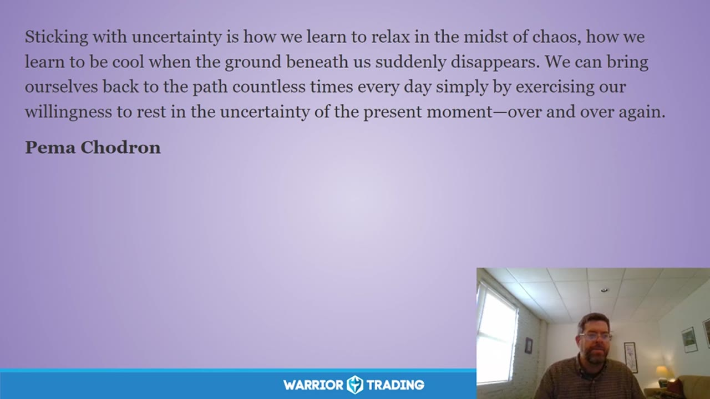

**图怎么看：**

- 在不确定性中学会放松和冷静，如何在混乱中保持冷静，如何在我们脚下的地面突然消失时保持冷静。
- 我们可以每天无数次地通过锻炼自己愿意在当下时刻的不确定中休息来把自己带回到路上。
- 通过反复练习对当前时刻的接受，我们学会了在混乱中保持冷静。
- 这种能力对于所有交易者来说都是至关重要的，无论他们的经验水平如何。

### 关键内容

- 通过正念练习，可以更好地应对交易中的不确定性。
- 恐惧是交易中常见的负面情绪，但可以通过正念练习来缓解。
- 保持中心和开放心态有助于在不确定情况下做出更明智的决策。
- 正念练习可以帮助交易者放松，减少焦虑。
- 通过呼吸练习，可以逐步进入更深的放松状态。
- 接受不确定性是学习如何在混乱中保持冷静的关键。
- 正念练习需要持续进行，以增强应对不确定性的能力。
- 恐惧和焦虑是交易中常见的负面情绪，但可以通过正念练习来缓解。
- 通过练习正念，可以更好地理解自己的情绪和反应模式。

### 分析与执行顺序

1. 首先，介绍今天的主题——舒适面对不确定性。
2. 然后，分享一段关于正念的引言，强调接受和放松的重要性。
3. 接着，进行冥想练习，引导参与者关注呼吸。
4. 之后，指导参与者扫描身体，释放紧张情绪。
5. 最后，邀请参与者将正念带入日常生活中，特别是在面对不确定性时。

### 案例与细节

- “当您变得舒适与不确定性时，无限的可能性就会出现在您的生活中。”——Eckhart Tolle
- “恐惧不再是您行动的主要因素，不再阻止您采取行动来发起改变。”——Eckhart Tolle
- “如果不确定性是可以接受的，它会变成活力、警觉性和创造力。”——罗马哲学家Tacitus
- “不明确是什么让我们停止了错误的方向。”——Pima
- “我们可以在每天无数次地回到这条路上，通过反复练习在不确定的现在时刻休息。”——Pima

### 风险与边界

- 正念练习需要持续进行，否则效果会减弱。
- 过度依赖正念可能会导致对其他策略的忽视。
- 正念练习可能不适合所有人的个性和需求。
- 录制年代限制可能会影响某些引用的时效性。

### 复盘问题

- 您在冥想过程中注意到哪些情绪变化？
- 您如何将正念练习应用到实际交易中？
- 您认为哪些因素阻碍了您在交易中保持冷静？

---

## v0876：情绪冲动脱钩

> 日期：2020-03-02　·　时长：00:43:52

**本场重点：** 通过冥想和呼吸练习，学会面对情绪冲动，释放紧张感。

**图怎么看：**

- 这张图片展示了一个关于冥想和呼吸练习的课程截图，强调了在面对情绪冲动时如何通过冥想来放松和释放紧张感。
- 图片中的文字描述了冥想练习如何帮助人们学会面对情绪冲动，而不是选择逃避或自我责备。
- 通过冥想，人们可以学会在不选择的情况下接受当前的情绪状态，并学习如何与这些情绪共存而不被它们所控制。
- 这种练习有助于打破习惯性模式，减少情绪冲动带来的负面影响。

### 关键内容

- 通过允许体验发生，可以释放情绪紧张，促进自我觉察。
- 面对困难情绪时，愿意接受它们会带来内在力量。
- 冥想和呼吸练习有助于缓解情绪冲动，恢复内心平静。
- 识别情绪触发点，避免落入陷阱，保持开放心态。
- 使用四周期呼吸法，帮助减缓情绪反应。
- 通过雨滴冥想，接受现实，进行深入调查。
- 非识别概念强调区分思维与自我，避免被情绪控制。
- 通过练习，逐步学会放下旧模式，拥抱变化。
- 面对不确定性时，保持开放心态，寻找新策略。
- 使用呼吸练习和冥想，帮助应对市场波动带来的压力

### 分析与执行顺序

1. 开始冥想，闭上眼睛或注视美丽的峡谷和河流。
2. 注意当前状态，观察思绪和情绪，开始内观。
3. 专注于呼吸，感受气息流动，放松身体。
4. 继续呼吸练习，逐渐进入更深层次的自我觉察。
5. 使用四周期呼吸法，帮助减缓情绪反应。
6. 进行雨滴冥想，接受现实，进行深入调查。
7. 反思情绪触发点，避免落入陷阱，保持开放心态

### 案例与细节

- 当市场出现剧烈波动时，使用呼吸练习来恢复内心的平静。
- 面对失败时，用非识别概念认识到情绪只是暂时现象，不是自我。
- 在面对不确定性时，使用雨滴冥想来接受现实，寻找新的应对策略。
- 当情绪冲动出现时，通过内观练习来识别和接受情绪，而不是逃避。
- 在交易中遇到挫折时，使用呼吸练习来缓解紧张感，恢复冷静

### 风险与边界

- 市场环境不断变化，呼吸练习和冥想可能无法完全应对所有情况。
- 长期情绪紧张可能导致心理压力累积，需要结合其他方法缓解。
- 呼吸练习和冥想需要持续练习才能有效，短期内可能效果有限。
- 录制年代限制，现代市场环境与当时有所不同，需灵活调整方法

### 复盘问题

- 在实际交易中，如何将呼吸练习和冥想融入日常操作？
- 面对情绪冲动时，有哪些具体的应对策略可以尝试？
- 如何在日常生活中培养非识别的概念，避免被情绪控制？

---

## v0877：接纳市场波动

> 日期：2020-03-09　·　时长：00:47:19

**本场重点：** 学会接纳市场波动，培养内心的平静与坚韧，以应对不断变化的市场环境。

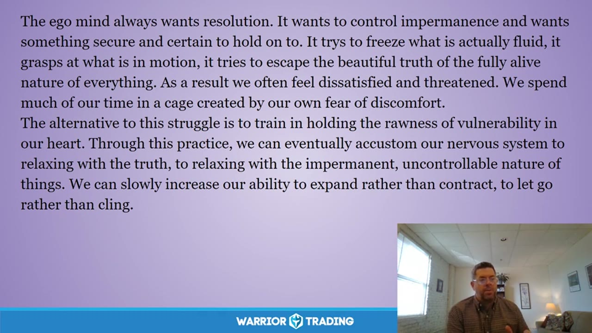

**图怎么看：**

- 这张幻灯片提供了关于如何在不断变化的市场环境中保持内心平静和坚韧的信息。
- 它引用了Pema Chödrön的《接纳不欢迎》一书中的观点，强调了面对痛苦和脆弱时的重要性。
- 幻灯片还提到了市场的不可预测性以及人们如何通过接受这种不可预测性来减少焦虑。
- 通过这种方式，人们可以更好地适应市场波动，并从中找到成长的机会。

### 关键内容

- 市场波动是常态，需要学会接纳。
- 通过冥想和自我接纳，可以更好地应对市场波动。
- 市场规则和策略可能不再适用，需要灵活调整。
- 接纳情绪，而不是逃避，有助于做出更明智的决策。
- 市场波动带来机会，但需要冷静分析。
- 长期实践可以增强应对市场波动的能力。
- 市场波动是检验心理素质的重要时刻。
- 接纳市场波动，可以减少不必要的交易风险。
- 市场波动提醒我们保持谦逊和开放的心态。
- 市场波动是学习和成长的机会。

### 分析与执行顺序

1. 开始时介绍市场波动的背景，强调其不可避免性。
2. 分享Pema Chodron的观点，强调接纳的重要性。
3. 引导听众进行冥想练习，帮助他们学会接纳。
4. 讨论市场规则和策略的变化，强调灵活性的重要性。
5. 举例说明如何在市场波动中保持冷静和理性。
6. 强调长期实践对提高心理素质的重要性。
7. 总结市场波动带来的启示，鼓励听众积极面对。

### 案例与细节

- 当市场突然下跌时，很多人会立即采取行动，试图弥补损失，结果往往导致更多的亏损。
- 在市场波动中，保持冷静，接受当前的市场状况，而不是试图控制它，可以帮助做出更好的决策。
- 通过长期的冥想练习，可以逐渐习惯放松面对市场的真相。
- 市场波动提醒我们，过去的成功经验可能不再适用，需要灵活调整策略。
- 在市场波动中，保持谦逊和开放的心态，可以更好地理解市场动态，做出更明智的决策。

### 风险与边界

- 市场规则和策略的变化可能导致投资者的原有计划失效。
- 过度依赖过去的经验可能会导致决策失误。
- 市场波动可能引发情绪波动，影响判断力。
- 长期市场波动可能导致心理压力增大，需要适当的心理支持。
- 市场环境的变化是历史性的，当前的市场情况可能与过去有所不同。

### 复盘问题

- 在市场波动中，哪些因素会影响决策？
- 如何通过冥想练习提高应对市场波动的能力？
- 在市场波动中，哪些情绪需要特别注意？

---

## v0878：仁慈接受

> 日期：2020-03-16　·　时长：00:47:07

**本场重点：** 在不确定时期，通过自我接纳和理解，找到内心的平静与自由。

**图怎么看：**

- 仁慈接受是指以慈悲之心接纳现实，而非执着于改变它。
- 在不确定时期，通过自我接纳和理解，找到内心的平静与自由。
- 仁慈接受意味着接受自己的不完美，并且愿意去爱自己，直到达到完全的和谐。
- 这张截图展示了一个人在室内环境中，可能是在进行某种形式的冥想或自我反省活动。

### 关键内容

- 自我接纳是理解自己并以无条件的爱对待自己的过程。
- 卡尔·罗杰斯提出的无条件正向关注，强调以更友善的方式对待自己。
- 通过冥想练习，可以放慢思维，连接内心的真实感受。
- 在困难时期，选择接受现实而非抗拒，可以带来更大的灵活性。
- 自我接纳意味着放下对完美的追求，转向自我关爱。
- 通过观察旧情绪模式，可以深化真理的觉醒。
- 在经历前所未有的事件时，保持开放的心态，见证自我。
- 自我接纳是走出自我怀疑的陷阱，信任自己的内在智慧。
- 在面对挑战时，给予自己善意，接受自己是关键。
- 自我接纳是走出恐惧和羞耻的循环，走向自由之路

### 分析与执行顺序

1. 介绍自我接纳的概念及其重要性。
2. 引导参与者进行冥想练习，放慢呼吸，观察内心感受。
3. 分享卡尔·罗杰斯的无条件正向关注理论，强调友善对待自己。
4. 通过实例说明如何在困难时期保持开放心态，见证自我。
5. 引导参与者在冥想中观察旧情绪模式，深化真理的觉醒。
6. 分享如何在面对挑战时给予自己善意，接受自己是关键。
7. 总结自我接纳的重要性，强调走出自我怀疑的陷阱，信任内在智慧

### 案例与细节

- 在冥想过程中，参与者注意到喉咙、胸部或腹部的感受。
- 参与者分享了在困难时期如何通过自我接纳找到内心的平静。
- 通过自我接纳，参与者能够放下对完美的追求，转向自我关爱。
- 在冥想中，参与者注意到呼吸的自然起伏，放松身心。
- 参与者分享了如何在面对挑战时给予自己善意，接受自己是关键。
- 通过自我接纳，参与者能够放下对过去的评判，转向自我关爱

### 风险与边界

- 自我接纳需要时间和持续的努力，否则可能难以实现。
- 在困难时期，自我接纳可能需要额外的耐心和支持。
- 自我接纳的过程可能因个人差异而有所不同，需灵活调整。
- 录制年代限制可能影响当前观众的理解和应用。
- 自我接纳需要持续练习，否则可能难以维持效果

### 复盘问题

- 在冥想过程中，哪些感受最明显？
- 自我接纳如何帮助你在困难时期保持平静？
- 如何在日常生活中实践自我接纳？

---

## v0879：基础正念练习

> 日期：2020-03-23　·　时长：00:45:21

**本场重点：** 正念练习帮助我们更好地面对生活中的挑战，通过呼吸和冥想找到内心的平静。

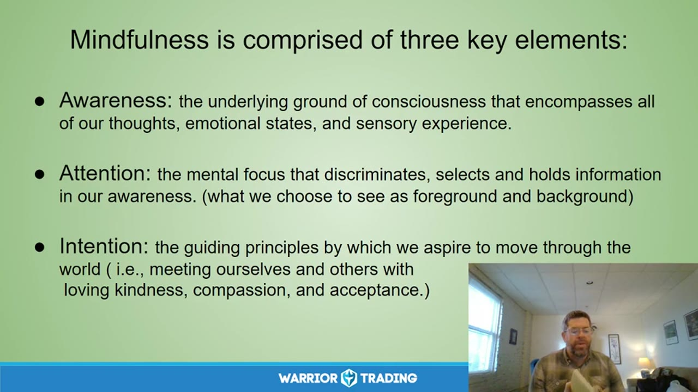

**图怎么看：**

- Mindfulness is composed of three key elements: Awareness, Attention, and Intention.
- Awareness encompasses all thoughts, emotional states, and sensory experiences.
- Attention discriminates, selects, and holds information in awareness.
- Intention guides our movement through the world with kindness, compassion, and acceptance.

### 关键内容

- 正念练习的核心是关注当下，接受自己的感受和想法。
- 通过呼吸练习，我们可以逐渐放松身体，进入内心深处。
- 正念练习有助于我们以更友好的方式对待自己和他人。
- 正念练习可以改善我们对市场的理解和应对。
- 正念练习强调自我接纳，而不是追求完美。
- 正念练习可以帮助我们识别并接受自己的情绪。
- 正念练习需要持续练习，即使只是日常的一部分。
- 正念练习可以改善我们的情绪管理能力，如处理愤怒和仇恨。
- 正念练习有助于我们更好地理解自己和他人的情感状态

### 分析与执行顺序

1. 首先分享正念练习的定义，包括意识、注意力和意图三个要素。
2. 然后通过一个具体的例子，描述日常生活中如何忘记正在发生的事情。
3. 接着介绍正念练习的重要性，以及它如何帮助我们更好地理解自己。
4. 进一步解释正念练习如何帮助我们接受自己的情绪，而不仅仅是压抑它们。
5. 最后强调正念练习需要持续练习，即使只是日常的一部分

### 案例与细节

- Jeff刚加入直播，这是他第一次体验正念练习。
- 通过呼吸练习，Jeff注意到脚下的树叶刮擦声和自己的愤怒情绪。
- 在正念练习中，Jeff回忆起昨天朋友的话，感到不安和愤怒。
- 通过正念练习，Jeff学会了接受自己的情绪，而不是压抑它们。
- 在正念练习中，Jeff意识到自己想要报复朋友的想法，但克制了这种冲动

### 风险与边界

- 正念练习需要持续练习，否则效果会减弱。
- 正念练习可能揭示一些令人不安的记忆和情绪。
- 正念练习的效果因人而异，有些人可能难以坚持。
- 正念练习的理论和实践可能随着时间推移而发生变化

### 复盘问题

- 正念练习的核心是什么？
- 通过正念练习，我们可以更好地理解什么？
- 正念练习如何帮助我们处理情绪？
- 正念练习需要哪些条件才能有效？

---

## v0880：自我友好的心理策略

> 日期：2020-04-20　·　时长：00:50:11

**本场重点：** 通过自我友好来管理情绪波动，提高交易心理素质。注意情绪反应的根源和应对方式。

**图怎么看：**

- 这张图片展示了一段关于自我友好的心理策略的文本，强调了在交易过程中通过自我友好来管理情绪波动的重要性。
- 文本指出，自我友好不仅包括对他人表现出的善意和温柔，也包括对自己展现出的善意和温柔。
- 通过这种自我友好的心态，可以更好地理解和管理自己的情绪波动，从而提高交易的心理素质。
- 这与本场的重点——通过自我友好来管理情绪波动，提高交易心理素质相契合。

### 关键内容

- 讲师分享了Pema Chodron的名言，强调面对情绪时的选择性。
- 通过冥想练习，引导学员学会自我友好。
- 自我友好的核心在于接纳自己的情绪反应，而不是试图消除它们。
- 情绪反应是自我认知的一部分，需要以非评判的方式对待。
- 接受失败是自我友好的一部分，可以从中学习。
- 自我友好的态度有助于提高情绪调节能力。
- 通过练习，可以更好地理解自己内在的不同部分。
- 自我友好的态度可以促进更灵活和适应性强的心态。
- 自我友好的态度可以减少对完美主义的追求。

### 分析与执行顺序

1. 讲师首先分享了Pema Chodron的名言，强调面对情绪时的选择性。
2. 然后引导学员进行冥想练习，帮助他们学会自我友好。
3. 通过提问和讨论，进一步探讨自我友好的重要性和实践方法。
4. 最后分享了Mary Oliver的诗歌《野鹅》，鼓励学员以开放的心态面对生活。
5. 在整个过程中，讲师不断强调自我友好的重要性和实践方法。
6. 通过具体的例子，帮助学员更好地理解和实践自我友好。
7. 通过讨论，帮助学员识别和调整自我友好的态度。

### 案例与细节

- 讲师提到自己在面对愤怒情绪时，采取非评判的态度。
- 学员分享了自己在面对失败时的态度转变。
- 讲师引用了Suzuki Shih Tzu-Sin Riu的观点，强调接受自己是改变的前提。
- 学员分享了自己在面对压力时，采取自我友好的态度。
- 讲师分享了自己在面对挑战时，采取自我友好的态度。

### 风险与边界

- 录制年代限制，适用于2020年的市场环境。
- 自我友好的实践需要长期坚持，短期内效果有限。
- 情绪反应的根源可能复杂，需要深入探索。
- 自我友好的态度需要逐步培养，短期内难以显著改变。
- 市场环境的变化可能影响情绪反应的模式。

### 复盘问题

- 讲师分享的Pema Chodron的名言对你有何启发？
- 你在日常生活中是如何实践自我友好的？
- 你如何处理自己在面对情绪时的非评判态度？

---

## v0881：初学者心态在交易中的应用

> 日期：2020-05-04　·　时长：00:50:06

**本场重点：** 初学者心态有助于交易者保持开放和灵活，但需要克服自我期望和压力。

**图怎么看：**

- 这张幻灯片展示了决策过程中的过滤器概念，强调了刺激（Stimulus）如何通过思想（Thoughts）、情感（Emotions）、经历（Experiences）和信念（Beliefs）等过滤器影响我们的决策。
- 通过这个模型，可以看出决策是由多个因素共同作用的结果，而这些因素可能会影响我们对信息的解读和反应。
- 理解并识别这些过滤器可以帮助交易者更好地控制自己的情绪和思维，从而做出更明智的交易决策。
- 例如，在交易中，如果一个人过于关注市场的情绪波动，可能会导致过度交易或做出冲动的决定。

### 关键内容

- 初学者心态意味着放下先入为主的观念，为新事物留出空间。
- 通过冥想练习，可以培养更加开放和灵活的心态。
- 初学者心态是实现自我接纳和同情的关键。
- 交易中常常遇到情绪波动，初学者心态有助于应对。
- 保持开放心态有助于发现新的可能性，而固执于旧信念则会限制成长。
- 通过呼吸练习，可以逐步放松身心，进入更深层次的连接。
- 初学者心态不仅适用于交易，也适用于生活中的其他方面。
- 保持开放心态有助于克服自我期望和压力，提高交易表现。
- 通过练习，可以逐渐培养出更加开放和灵活的心态。

### 分析与执行顺序

1. 讲师首先介绍了初学者心态的概念及其重要性。
2. 然后引导听众进行简单的冥想练习，包括闭眼呼吸。
3. 接着讲解了如何通过呼吸练习来放松身体。
4. 最后，讲师分享了一个关于初学者心态的日本故事，以进一步说明其意义。
5. 在整个过程中，讲师不断强调保持开放心态的重要性。

### 案例与细节

- “我们可能会对自己的交易策略抱有期望，这会影响我们的决策。”
- “如果我们的意识充满了这些期望，就很难找到必要的灵活性。”
- “保持开放心态有助于克服自我期望和压力，提高交易表现。”
- “通过练习，可以逐渐培养出更加开放和灵活的心态。”
- “初学者心态不仅适用于交易，也适用于生活中的其他方面。”

### 风险与边界

- 初学者心态的培养需要时间和持续练习，否则可能难以立即见效。
- 过度依赖初学者心态可能会导致缺乏明确的交易策略。
- 交易市场变化莫测，初学者心态需要结合实际情况灵活运用。
- 录制年代限制为2020年，当前市场环境可能有所不同。

### 复盘问题

- 初学者心态如何帮助交易者更好地应对市场波动？
- 在实际交易中，如何将初学者心态与具体策略相结合？
- 如何在保持开放心态的同时，确保交易决策的合理性？

---

## v0882：面对恐惧的心理策略

> 日期：2020-05-11　·　时长：00:37:54

**本场重点：** 本课程讨论了如何通过自我接纳和慈悲来应对恐惧，强调了在困难时期保持内心平静的重要性。

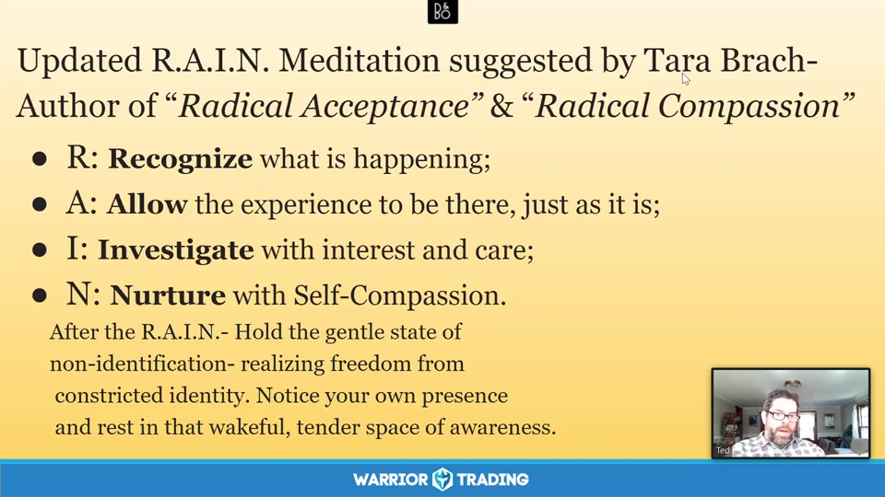

**图怎么看：**

- R: Recognize what is happening;
- A: Allow the experience to be there, just as it is;
- I: Investigate with interest and care;
- N: Nurture with Self-Compassion.

### 关键内容

- 讲师分享了Tara Brock的比喻，描述了面对恐惧时的心态转变。
- 恐惧常常导致身体紧张和思维狭窄，但通过慈悲和接纳可以缓解这种状态。
- 面对恐惧时，应该保持慈悲和好奇心，理解情绪背后的原因。
- 恐惧可能源于过去的经历，但通过自我接纳可以更好地应对。
- 在困难时期，保持内心的平静和慈悲可以帮助更好地处理情绪。
- 通过练习慈悲和接纳，可以改善与自己和他人的关系。
- 恐惧和悲伤等情绪反映了深层次的情感体验，需要温柔地对待自己。
- 通过练习慈悲和接纳，可以更好地理解自己的情感反应。
- 在交易中，通过练习慈悲和接纳可以减少情绪波动，提高决策质量。
- 通过练习慈悲和接纳，可以更好地处理生活中的挑战和困难

### 分析与执行顺序

1. 讲师首先介绍了Tara Brock的比喻，描述了面对恐惧时的心态转变。
2. 然后，讲师解释了如何通过慈悲和接纳来应对恐惧，强调了理解情绪背后的原因。
3. 接着，讲师分享了如何在日常生活中练习慈悲和接纳的方法。
4. 最后，讲师鼓励听众在交易和其他生活中实践这些方法，以改善情绪管理。
5. 在整个过程中，讲师强调了慈悲和接纳的重要性，以及它们对情绪管理的影响。

### 案例与细节

- 讲师提到，当看到一只小狗被陷阱困住时，恐惧会转变为关心，这适用于所有人。
- 在交易中，恐惧可能导致过度紧张和焦虑，影响决策质量。
- 通过练习慈悲和接纳，可以更好地理解自己的情感反应，从而做出更明智的决策。
- 在困难时期，保持内心的平静和慈悲可以帮助更好地处理情绪。
- 通过练习慈悲和接纳，可以改善与自己和他人的关系，从而更好地应对生活中的挑战和困难。

### 风险与边界

- 在交易中，过度的慈悲和接纳可能导致过于宽松的态度，影响决策质量。
- 在困难时期，如果无法找到适当的平衡，可能会感到沮丧和无助。
- 录制年代限制可能会影响某些具体情境的理解，例如当前的经济环境和市场状况。
- 在实际操作中，需要根据个人情况调整慈悲和接纳的程度，避免一刀切的做法。

### 复盘问题

- 在面对恐惧时，哪些具体的情绪反应需要特别关注？
- 如何在日常生活中练习慈悲和接纳？
- 在交易中，如何将慈悲和接纳转化为实际的操作策略？

---

## v0883：平静专注：交易心理调适

> 日期：2020-05-18　·　时长：00:46:27

**本场重点：** 通过平静专注练习，调整情绪反应，提高交易表现。重点在于自我接纳与慈悲。

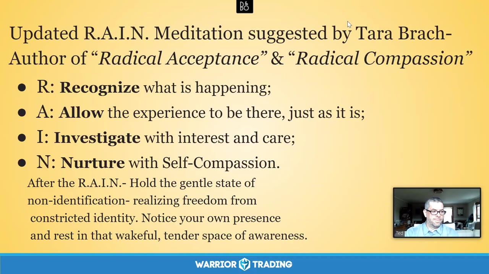

**图怎么看：**

- 幻灯片标题说明这是Tara Brach提出的更新版R.A.I.N. Meditation，并列出四步：Recognize、Allow、Investigate与Nurture。
- Recognize要求识别正在发生什么，Allow让体验暂时如其所是，Investigate带着兴趣和关怀观察，Nurture则以自我同情回应。
- 这张图把平静专注从抽象态度变成顺序练习，可在交易触发后先命名情绪，再容纳感受、检查身体与想法，最后选择更稳健行动。
- RAIN不是消除市场风险或强行压住情绪的方法；若已达到最大亏损或失去执行能力，应先停止交易，再做练习和复盘。

### 关键内容

- 通过平静专注练习，调整情绪反应，提高交易表现。
- 冥想时使用呼吸作为焦点，帮助稳定思维。
- 面对情绪波动时，保持冷静，接受错误。
- 自我接纳与慈悲是关键，而非完美主义。
- 技术问题影响了部分讨论，但核心内容依然有价值。
- 平静专注有助于减少情绪反应，提高决策质量。
- 通过练习，逐步培养自我接纳与慈悲的态度。
- 通过平静专注练习，可以减少情绪反应，提高决策质量。情绪波动时，保持冷静有助于做出更合理的判断。
- 自我接纳与慈悲是关键，而非追求完美。接纳自己的不足，可以减少内心的冲突，提高交易表现。
- 在交易中应用平静专注的方法，需要持续练习。通过日常的冥想，逐步培养自我接纳与慈悲的态度。
- 面对情绪波动时，可以通过呼吸练习来放松身心，从而更好地集中注意力。这有助于提高交易中的专注力和决策质量。
- 技术问题虽然影响了部分讨论，但核心内容依然有价值。通过回顾之前的录音，可以更好地理解平静专注的重要性。

### 分析与执行顺序

1. 引导参与者进行冥想练习，使用呼吸作为焦点。
2. 提醒参与者注意当前的情绪状态，接受它们的存在。
3. 指导参与者通过呼吸练习，逐渐放松身体。
4. 鼓励参与者在冥想过程中，接纳自己的情绪。
5. 分享平静专注的重要性，以及如何在交易中应用。
6. 通过实例，展示如何在交易中保持冷静，接受错误。
7. 强调自我接纳与慈悲的重要性，而非完美主义。

### 案例与细节

- 当技术问题导致视频中断时，参与者仍然能够继续冥想。
- 通过雨滴冥想，参与者能够更好地关注当前的情绪状态。
- 分享一个关于自我接纳的例子：面对情绪波动时，保持冷静。
- 在交易中遇到情绪波动时，可以通过深呼吸来缓解紧张情绪。例如，当市场出现大幅波动时，通过几次深呼吸，可以让自己冷静下来，更好地分析市场情况。
- 通过雨滴冥想，参与者能够更好地关注当前的情绪状态。例如，在一次模拟交易中，参与者注意到自己对某只股票（如AAPL）的过度乐观情绪，并通过冥想练习来调整心态，最终做出了更为理性的交易决策。

### 风险与边界

- 技术问题可能影响讨论的连贯性。
- 录制年代久远，部分信息可能不再适用。
- 市场环境变化，需要结合当前情况进行调整。
- 心理调适方法需结合个人情况灵活运用。
- 技术问题可能影响讨论的连贯性。例如，网络中断可能导致录音中出现断断续续的情况，影响听众的理解。
- 录制年代久远，部分信息可能不再适用。例如，某些交易策略和技术指标可能已经发生变化，需要结合当前情况进行调整。

### 复盘问题

- 在交易中遇到情绪波动时，如何保持冷静？
- 如何通过自我接纳与慈悲来改善交易表现？
- 在实际交易中，如何应用平静专注的方法？

---

## v0884：克服交易中的恐惧

> 日期：2020-06-01　·　时长：00:50:02

**本场重点：** 通过正念练习和自我对话克服交易中的恐惧，提高决策质量。

**图怎么看：**

- 这张图片展示了一个宁静的森林湖泊场景，背景中有树木和绿色植物，前景是一条木质小径通向湖边。
- 图片右下角有一个小窗口显示一个人在进行视频通话，可能是在进行冥想或自我对话。
- 图片上方的文字提供了关于如何处理恐惧的指导，建议从简单的事情开始，当恐惧出现时，轻轻地命名它，并体验它对呼吸、身体和心脏的影响。
- 图片下方的文字进一步解释了恐惧的本质，指出恐惧总是对未来的一种期待，常常是没有根据的想象。

### 关键内容

- 正念练习有助于识别和接纳内心的恐惧，而不是被其控制。
- 通过正念练习，可以更好地理解恐惧的本质，并学会与之和平相处。
- 正念练习可以帮助交易者回到自己的中心，减少冲动决策。
- 正念练习可以提高交易者的自我意识，减少因恐惧而做出的错误决策。
- 正念练习可以培养交易者的耐心和自我同情。
- 正念练习可以提高交易者的决策质量，减少因恐惧而产生的失误。
- 正念练习可以增强交易者的心理韧性，帮助他们面对市场波动。
- 正念练习可以提高交易者的自我认知，更好地理解自己的情绪反应。
- 正念练习可以减少交易者对失败的恐惧，提高交易信心。

### 分析与执行顺序

1. 首先，进行正念呼吸练习，帮助放松身体，减轻紧张情绪。
2. 然后，识别并命名内心的恐惧，了解其来源和影响。
3. 接着，探索恐惧背后的需求，寻找解决问题的方法。
4. 最后，通过正念练习，逐步接纳和处理内心的恐惧。
5. 在整个过程中，保持开放的心态，接受自己的情绪反应。
6. 通过正念练习，逐步建立与恐惧的和谐关系。
7. 在日常交易中，持续应用正念练习，提高决策质量。

### 案例与细节

- 在交易中，当出现亏损时，恐惧会促使交易者采取极端措施，如增加仓位或完全退出市场。
- 通过正念练习，交易者可以更好地理解自己的情绪反应，从而减少因恐惧而做出的错误决策。
- 正念练习可以帮助交易者在面对市场波动时保持冷静，减少冲动决策。
- 在交易中，当出现盈利时，恐惧会促使交易者迅速平仓，以避免潜在的损失。

### 风险与边界

- 正念练习需要时间和耐心，短期内可能难以看到明显效果。
- 过度依赖正念练习可能会忽视其他重要的交易策略和技巧。
- 正念练习的效果因人而异，不同交易者可能有不同的体验。
- 正念练习无法完全消除交易中的所有恐惧，但可以显著降低其影响。
- 正念练习的成效受到录制年代的限制，现代市场环境可能有所不同。

### 复盘问题

- 在交易中，你如何识别和处理内心的恐惧？
- 正念练习如何帮助你在面对市场波动时保持冷静？
- 你如何将正念练习融入日常交易中？

---

## v0885：Bodhichitta 的心性觉醒

> 日期：2020-06-08　·　时长：00:46:31

**本场重点：** 通过心性觉醒来提升交易情绪管理，理解情绪背后的脆弱性，培养慈悲心。

**图怎么看：**

- 这张图片展示了一个宁静的自然景观，背景是一个美丽的日落，天空被橙色和蓝色的色调所覆盖，给人一种平静和宁静的感觉。
- 在右下角的小窗口中，可以看到一个人正在进行视频通话，这可能是在分享关于情绪管理和慈悲心的信息。
- 图片下方有一个标志，上面写着“Warrior Trading”，这表明这个视频与交易相关，并且可能与提升交易情绪管理有关。
- 整体来看，这张图片结合了自然美景和心灵成长的主题，旨在传达通过心性觉醒来提升交易情绪管理的理念。

### 关键内容

- Bodhichitta 是佛教概念，连接心与智。
- 通过心性觉醒，可以软化而非硬化自己。
- 在当前动荡时期，心性觉醒尤为重要。
- Pema Chödrön 的话强调了选择如何回应生活中的挑战。
- 通过冥想练习，可以培养心性觉醒。
- 愤怒等情绪背后通常有恐惧或受伤。
- 心性觉醒可以帮助我们更好地理解自己。
- 通过冥想，可以体验到心性的温暖和光明。
- 心性觉醒是内在柔软和慈悲心的体现。
- 通过练习，可以更深入地理解自己的情绪
- 通过心性觉醒，可以更好地理解自己和他人的情绪反应，从而减少冲动交易。例如，当感到愤怒时，意识到其背后可能是恐惧或受伤，有助于采取更理性的行动。
- 心性觉醒有助于培养慈悲心，使交易者更加关注市场参与者的情感状态，从而做出更公正合理的判断。例如，在市场波动时，能够更加同情卖方的困境，避免过度追涨杀跌。
- 心性觉醒能够增强交易者的自我意识，使其更加清晰地认识到自己的情绪变化，从而更好地控制情绪波动。例如，通过冥想练习，能够更敏锐地察觉到自己从愤怒到平静的变化过程。
- 心性觉醒有助于建立更深层次的人际关系，使交易者在与客户、合作伙伴交流时更加真诚和理解。例如，在与客户沟通时，能够更加耐心地倾听对方的需求，而不是急于表达自己的观点。
- 心性觉醒能够提高交易者的整体生活质量，使其在面对市场压力时更加从容。例如，通过练习心性觉醒，能够在工作和家庭之间找到更好的平衡，从而减少因工作压力导致的家庭矛盾

### 分析与执行顺序

1. 开始播放 Pema Chödrön 的诗歌《野鹅》。
2. 引导听众进行简单的呼吸冥想。
3. 介绍 Bodhichitta 的概念及其重要性。
4. 分享 Pema Chödrön 的话，强调选择的重要性。
5. 通过诗歌和冥想，帮助听众放松身心。
6. 解释心性觉醒的过程，包括识别和接纳情绪。
7. 通过练习，培养心性觉醒的能力

### 案例与细节

- “Do not have to be good. You do not have to walk on your knees or a hundred or the desert repenting.” 这句话强调了自我评判的负面作用。
- “We can let, you know, those circumstances soften us rather than harden us.” 强调了面对困难时选择软化而非硬化自己。
- “Meanwhile, the sun and the clear pebbles of the rain are moving across the landscapes.” 描述了自然界的美好景象，帮助听众放松。
- “You know, that softening, you know, just have to let the soft animal of your body, love what it loves.” 引导听众放下苛责，学会爱自己。
- “Each breath, deepening in that offering of loving kindness and compassion for yourself, sending it out into this community you’re now a part of.” 通过呼吸练习，培养慈悲心
- 在一次交易中，当市场突然下跌时，我感到非常愤怒，想要立即卖出止损。但在冥想练习后，我意识到这种情绪背后是对损失的恐惧。于是，我选择了冷静下来，分析市场情况，最终做出了更为理性的决策。
- 在与客户沟通时，我曾经因为对方的一次失误而感到非常生气，想要严厉批评对方。但在冥想练习后，我学会了更加宽容和理解对方，最终达成了双赢的合作协议。
- 在一次重要的交易决策前，我进行了长时间的冥想练习，让自己更加清晰地认识到自己的情绪状态。这使我能够更加理性地分析市场数据，最终做出了正确的决策。

### 风险与边界

- 录制年代较早，可能不适用于当前市场环境。
- 心性觉醒需要长期练习，短期内难以显著改善情绪管理。
- 情绪波动较大时，心性觉醒的效果可能减弱。
- 个体差异可能导致心性觉醒的效果不同
- 在市场极度波动时，心性觉醒的效果可能会减弱，因为此时情绪波动较大，难以保持冷静。例如，在一场剧烈的市场波动中，即使进行了长期的冥想练习，也难以完全抑制住恐慌情绪。
- 个体差异可能导致心性觉醒的效果不同，有些人可能更容易通过冥想练习达到心性觉醒的状态，而另一些人则可能需要更长时间才能感受到明显的变化。例如，一位经验丰富的交易者可能比新手更容易通过冥想练习达到心性觉醒的状态。
- 录制年代较早，可能不适用于当前市场环境，因为市场结构和交易方式发生了变化。例如，现在的市场流动性更强，交易速度更快，这可能会影响心性觉醒的效果。
- 心性觉醒需要长期练习，短期内难以显著改善情绪管理，因此交易者可能需要耐心等待效果显现。例如，即使每天坚持进行冥想练习，也需要几个月甚至更长时间才能感受到明显的情绪管理改善

### 复盘问题

- 听众在冥想过程中是否注意到任何特别的情绪或想法？
- 心性觉醒如何帮助你在面对市场波动时保持冷静？
- 你如何将心性觉醒的概念应用到日常生活中？

---

## v0886：舒适面对不确定性

> 日期：2020-06-15　·　时长：00:51:01

**本场重点：** 通过练习正念和接受不确定性，改善情绪管理，提高交易表现。

**图怎么看：**

- 这张图片展示了一个宁静的自然景观，背景是一个美丽的日落，前景有一个圆形的石头堆，周围环绕着绿色的草地。
- 图片下方显示了“Warrior Trading”的标志，表明这是一个与交易相关的主题。
- 图片右侧的小窗口显示了一位正在讲话的人，可能是在进行某种形式的培训或讲座。
- 整体氛围传达出一种平静和反思的感觉，适合于提升情绪管理和交易表现的主题。

### 关键内容

- 正念练习有助于缓解恐惧，促进创造力。
- 通过正念练习，可以更好地面对恐惧，提高交易表现。
- 正念练习包括呼吸练习和身体扫描，帮助放松。
- 正念练习有助于培养对内心感受的接纳。
- 正念练习可以提高对不确定性的适应能力。
- 正念练习有助于缓解紧张情绪，提高交易决策质量。
- 正念练习可以提高自我意识，更好地理解自己。
- 正念练习有助于提高交易中的灵活性和创造性。
- 正念练习可以提高对情绪的控制能力，减少冲动交易。
- 正念练习可以提高对交易市场的洞察力，更好地应对市场变化

### 分析与执行顺序

1. 首先介绍正念练习的重要性，强调它可以帮助人们更好地面对不确定性。
2. 然后分享正念练习的具体步骤，包括呼吸练习和身体扫描。
3. 接着解释正念练习如何帮助人们缓解紧张情绪，提高自我意识。
4. 最后强调正念练习在提高交易表现中的重要作用。
5. 在整个过程中，不断强调正念练习对情绪管理和交易表现的积极影响。

### 案例与细节

- 在一次白水皮艇活动中，作者体验到面对恐惧时的紧张感，但通过正念练习，能够将注意力从恐惧转移到当下的呼吸上。
- 作者提到，通过正念练习，能够更好地处理交易中的情绪波动，避免冲动交易。
- 作者分享了通过正念练习，能够更好地理解自己的情绪，从而做出更明智的交易决策。
- 作者提到，通过正念练习，能够在面对市场不确定性时保持冷静，更好地应对市场变化。
- 作者分享了通过正念练习，能够更好地理解自己的内心感受，从而更好地应对交易中的挑战。

### 风险与边界

- 正念练习的效果因人而异，有些人可能需要更长时间才能看到明显效果。
- 正念练习需要持续进行，否则效果可能会减弱。
- 正念练习可能不适合所有交易者，特别是那些已经习惯了快速决策的人。
- 正念练习的效果受到个人心理状态的影响，因此效果可能不稳定。
- 正念练习的效果可能受到外部环境的影响，如市场波动等。

### 复盘问题

- 正念练习的具体步骤是什么？
- 正念练习如何帮助人们更好地面对不确定性？
- 正念练习在提高交易表现中的具体作用是什么？

---

## v0887：情绪冲动的解脱

> 日期：2020-06-22　·　时长：00:46:11

**本场重点：** 情绪冲动的解脱是交易成功的关键，需要培养自我同情和接受能力。

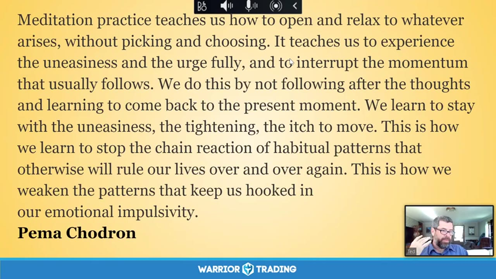

**图怎么看：**

- 冥想练习教会我们如何开放并放松地面对任何出现的事物，而无需选择。它教导我们充分体验不安和冲动，并打断通常随之而来的惯性。
- 通过不跟随思绪，而是学会回到当下，我们学会了与不安、紧绷感和移动的渴望共存。
- 这使我们能够阻止习惯性模式的连锁反应，这些模式会反复统治我们的生活。
- 这是如何削弱那些让我们陷入情绪冲动中的模式的方法。

### 关键内容

- 交易中情绪冲动容易导致决策失误，需要学会放下。
- 通过冥想练习，可以更好地认识和接受自己的情绪。
- 情绪冲动的根源在于冲动驱动的情感反应。
- 自我同情和接受是克服情绪冲动的关键。
- 交易者需要学会在情绪波动中保持冷静。
- 通过练习，可以逐步建立更积极的情感应对机制。
- 情绪冲动的解脱需要时间和持续的努力。
- 交易者需要认识到自己的情绪模式，并学会应对。
- 通过自我观察和反思，可以更好地理解自己的情绪反应

### 分析与执行顺序

1. 讲师首先分享了关于情绪冲动的观点，强调了自我同情的重要性。
2. 然后介绍了冥想练习的方法，帮助参与者放松身心。
3. 接着引导参与者进行呼吸练习，以缓解紧张情绪。
4. 最后，鼓励参与者将这种练习应用到实际交易中。
5. 整个过程中，讲师不断强调自我观察和反思的重要性。
6. 通过这些步骤，参与者可以逐步学会如何在情绪波动中保持冷静。
7. 整个过程需要持续练习，才能达到预期效果

### 案例与细节

- 讲师提到自己最难以处理的情绪是愤怒，通过长期练习已经能够更好地应对。
- 通过冥想练习，参与者可以更好地认识到自己的情绪模式。
- 讲师引用了Pema Chodron的观点，强调了情绪冲动的根源及其对人的影响。
- 通过自我观察，参与者可以识别出自己的情绪冲动模式。
- 通过练习，参与者可以学会如何在情绪波动中保持冷静

### 风险与边界

- 情绪冲动的解脱是一个长期的过程，需要持续的努力。
- 如果参与者无法坚持练习，可能会导致效果不佳。
- 录制年代限制可能会影响某些方法的有效性。
- 情绪冲动的解脱需要个体根据自身情况调整练习方法

### 复盘问题

- 在交易中，你通常会遇到哪些情绪冲动？
- 你如何在情绪冲动时保持冷静？
- 你认为自我同情在情绪冲动解脱中扮演什么角色？

---

## v0888：欢迎不可欢迎的事物

> 日期：2020-06-29　·　时长：00:47:18

**本场重点：** 本节讨论如何面对情绪波动和市场变化，通过自我接纳和自我照顾来提升交易表现。

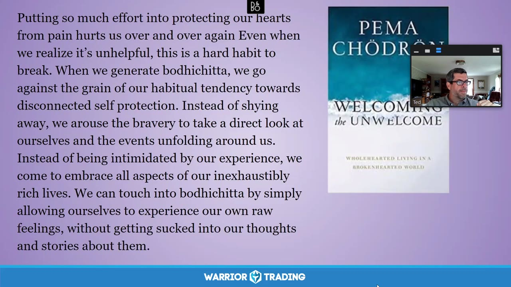

**图怎么看：**

- 本节讨论如何面对情绪波动和市场变化，通过自我接纳和自我照顾来提升交易表现。
- 通过自我接纳和自我照顾，可以更好地应对市场变化和情绪波动。
- 在面对不可预测的市场时，保持开放的心态和自我关怀是非常重要的。
- 通过自我接纳和自我照顾，可以增强交易者的心理韧性，提高交易表现。

### 关键内容

- 自我接纳是面对情绪波动的关键，有助于保持冷静。
- 通过练习和自我照顾，可以逐步适应市场的不确定性。
- 情绪波动如愤怒和羞愧需要被接纳而非逃避。
- 自我接纳有助于建立更深层次的自我关系。
- 市场变化和情绪波动是交易者必须面对的常态。
- 通过练习，可以逐渐减少对舒适感的依赖。
- 自我接纳有助于提高交易决策的质量。
- 自我接纳是克服恐惧和不安的关键。
- 自我接纳需要持续练习，不能一蹴而就

### 分析与执行顺序

1. 讲师首先介绍了自我接纳的概念，强调了它在交易中的重要性。
2. 然后，讲师分享了一个具体的例子，说明了自我接纳如何帮助处理情绪波动。
3. 接着，讲师解释了如何通过练习来培养自我接纳的习惯。
4. 最后，讲师强调了自我接纳需要持续的努力和实践。
5. 在整个过程中，讲师多次引用了相关书籍和研究，以支持观点。
6. 讲师还提到了一些具体的练习方法，如呼吸练习和自我观察。
7. 讲师鼓励听众在日常生活中实践自我接纳，以改善交易表现

### 案例与细节

- 讲师提到一位学员在交易中遇到的困难，即对损失的恐惧。
- 另一位学员则无法想象交易中的钱是真实的，导致了不必要的冒险。
- 讲师分享了一个具体的练习方法，即在感到愤怒时，用温暖和同情来对待自己。
- 讲师还提到了一个具体的场景，即在交易中遇到挫折时，如何保持冷静。
- 讲师分享了一个具体的练习，即在感到羞愧时，如何接受自己的感受而不逃避

### 风险与边界

- 自我接纳是一个长期的过程，短期内难以看到明显效果。
- 过度自我接纳可能导致放松警惕，忽视市场风险。
- 市场环境的变化可能会影响自我接纳的效果。
- 自我接纳需要持续练习，否则容易退步。
- 录制年代限制可能影响某些具体策略的有效性

### 复盘问题

- 自我接纳在交易中的具体应用有哪些？
- 如何在日常生活中实践自我接纳？
- 自我接纳与自我控制之间的平衡点在哪里？

---

## v0889：仁慈接受

> 日期：2020-07-06　·　时长：00:48:18

**本场重点：** 在交易中培养自我接纳，减少情绪波动，提高交易效率。

**图怎么看：**

- 幻灯片把 Radical Acceptance 定义为：以同情的态度承认、容纳并完整接受现实本来的样子，而不是坚持现实必须变成自己期望的样子。
- 放到交易中，接受的是已经发生的价格、亏损和当下情绪，不是认同错误行为；先停止与事实争执，才有空间执行止损或结束当天交易。
- 页面引用 Tara Brach 的话，将练习方向从追求完美转向以关怀接纳完整的自己，对应课程减少自责与报复性交易的目标。
- 彻底接纳不等于被动持有亏损、放弃复盘或降低标准；风险规则仍然生效，接受只改变面对事实的方式。

### 关键内容

- 通过理解自己和给予无条件的爱来培养自我接纳。
- 冥想练习帮助放松身心，提高专注力。
- 识别身体紧张部位，如肩膀、颈部、背部等，进行呼吸放松。
- 通过自我接纳，减少对完美主义的追求，转向过程导向。
- 自我接纳有助于识别和改变负面情绪模式，促进正向发展。
- 通过自我接纳，可以减轻焦虑，提高交易决策质量。
- 自我接纳是克服交易中恐惧和羞耻的关键。
- 通过自我接纳，可以更好地处理交易中的挫折和失败。
- 自我接纳需要时间和耐心，逐步培养。
- 自我接纳有助于建立更健康的心理状态，提高交易表现

### 分析与执行顺序

1. 介绍冥想练习，引导参与者放松。
2. 指导参与者关注呼吸，放松身体。
3. 引导参与者识别身体紧张部位，进行呼吸放松。
4. 鼓励参与者以仁慈的态度对待自己，接受自己的不完美。
5. 通过自我接纳，减少对完美主义的追求，转向过程导向。
6. 通过自我接纳，识别和改变负面情绪模式，促进正向发展

### 案例与细节

- 在交易过程中，注意到肩膀和颈部的紧张，通过深呼吸放松。
- 通过自我接纳，减少对交易结果的过度关注，转向过程导向。
- 识别交易中的负面情绪模式，如焦虑和恐惧，通过自我接纳减轻。
- 在交易中遇到挫折时，通过自我接纳接受失败，继续前进。

### 风险与边界

- 自我接纳需要时间和耐心，短期内可能看不到明显效果。
- 过度自我接纳可能导致放松过度，影响交易决策。
- 交易市场变化快速，自我接纳不能替代市场分析。
- 录制年代限制，部分方法可能不再完全适用当前市场环境

### 复盘问题

- 在交易中，哪些情绪模式最需要自我接纳？
- 如何通过自我接纳减少交易中的焦虑和恐惧？
- 自我接纳与过程导向交易策略有何联系？

---

## v0890：交易中的正念实践

> 日期：2020-07-13　·　时长：00:48:45

**本场重点：** 正念可以帮助交易者更好地管理情绪，减少冲动行为，提高决策质量。

**图怎么看：**

- 非评判性：作为自己经验的客观见证者——它不是好或坏，只是如此。但同时，不要因为评判而自责；只是以一些善意和好奇心注意到。
- 耐心：让事情按照自己的节奏发展。在没有变得过度紧张、激动或害怕的情况下。
- 初学者心态：愿意将一切视为第一次。释放期望，并不固执于我们认为知道的东西。
- 信任：相信自己。成为自己的直觉向导和权威。其他人可能有所帮助，但最终的道路是你的，也是你自己的。

### 关键内容

- 正念是一种内在的觉察，帮助交易者冷静下来，更好地处理情绪。
- 心向正念强调在情绪波动时保持善良、宽容和同情。
- 正念练习包括非评判、耐心、初学者心态等七个基础要素。
- 通过正念练习，交易者可以更好地理解自己的情绪，并采取更理性的行动。
- 正念有助于交易者建立信任，相信自己的直觉和判断。
- 正念练习要求交易者接受当前的状态，而不是追求完美。
- 正念练习需要交易者学会放下已有的观念，以开放的心态面对新的挑战。
- 正念练习强调自我接纳和自我照顾，帮助交易者更好地应对情绪波动。

### 分析与执行顺序

1. 讲师首先介绍了正念的概念，强调它可以帮助交易者更好地管理情绪。
2. 然后分享了Jack Cornfield的名言，强调和平的可能性。
3. 接着介绍了心向正念的概念，强调在情绪波动时保持善良、宽容和同情。
4. 讲师详细讲解了正念练习的七个基础要素，包括非评判、耐心、初学者心态等。
5. 最后，讲师通过实例展示了如何应用这些基础要素进行正念练习。

### 案例与细节

- 讲师提到，正念练习可以帮助交易者更好地管理情绪，减少冲动行为，提高决策质量。
- 通过正念练习，交易者可以更好地理解自己的情绪，并采取更理性的行动。
- 正念练习要求交易者接受当前的状态，而不是追求完美。
- 正念练习强调自我接纳和自我照顾，帮助交易者更好地应对情绪波动。
- 正念练习可以帮助交易者建立信任，相信自己的直觉和判断。

### 风险与边界

- 正念练习需要长期坚持才能见效，短期内可能效果有限。
- 正念练习可能会让交易者感到困惑，尤其是在情绪波动时。
- 正念练习需要交易者具备一定的心理素质，否则可能难以坚持。
- 正念练习的成效受到交易者个人情况的影响，不同人可能有不同的体验。

### 复盘问题

- 正念练习对交易者的情绪管理有何具体帮助？
- 心向正念的概念如何应用于实际交易中？
- 正念练习的七个基础要素如何相互关联？

---

## v0891：为什么我们冥想及其好处

> 日期：2020-07-20　·　时长：00:48:26

**本场重点：** 冥想可以提高交易者的心理素质，帮助他们更好地应对市场波动。

**图怎么看：**

- 这张幻灯片强调了冥想在提高交易者心理素质方面的益处，有助于他们更好地应对市场波动。
- 幻灯片上显示了一位讲师的视频会议画面，背景是一个办公室环境，突出了冥想的重要性。
- 幻灯片上的文字指出，通过冥想，人们可以变得更加开放和接受生活中的各种体验，从而在面对生活中的困难时更加平静和放松。
- 这表明冥想不仅是一种个人实践，还对交易者的情绪管理有着积极的影响。

### 关键内容

- 冥想可以帮助交易者更好地管理情绪，减少市场波动带来的负面影响。
- 通过冥想，交易者可以培养清晰的思维，更好地理解市场动态。
- 冥想有助于建立内在的勇气，面对市场的不确定性。
- 长期练习冥想可以提高交易者的专注力，使他们更专注于当前的交易。
- 冥想可以培养一种无所谓的态度，帮助交易者更好地适应市场变化。
- 冥想可以提高交易者的自我意识，更好地理解自己的情绪和行为。
- 冥想可以提高交易者的耐心，帮助他们在市场波动中保持冷静。
- 冥想可以提高交易者的决策能力，帮助他们做出更明智的交易决策。
- 冥想可以提高交易者的自律性，帮助他们坚持自己的交易策略。

### 分析与执行顺序

1. 讲师首先介绍了冥想的基本概念和目的。
2. 然后讲解了冥想对交易者心理素质的具体帮助。
3. 接着分享了冥想对交易者情绪管理的作用。
4. 进一步解释了冥想如何提高交易者的专注力。
5. 最后强调了冥想对交易者决策能力和自律性的提升。

### 案例与细节

- 讲师提到，通过冥想，交易者可以更好地管理情绪，减少市场波动带来的负面影响。
- 讲师举例说，通过冥想，交易者可以培养清晰的思维，更好地理解市场动态。
- 讲师指出，通过冥想，交易者可以建立内在的勇气，面对市场的不确定性。
- 讲师分享了一个交易者的例子，他通过冥想提高了交易的专注力，从而在市场波动中保持冷静。
- 讲师提到，通过冥想，交易者可以培养一种无所谓的态度，更好地适应市场变化。

### 风险与边界

- 冥想的效果因人而异，有些人可能难以坚持。
- 市场环境的变化可能导致冥想效果减弱。
- 交易者需要在实际交易中不断实践，才能真正受益。
- 录制年代限制，现代交易环境可能与当时有所不同。

### 复盘问题

- 冥想对交易者的情绪管理有哪些具体帮助？
- 如何通过冥想提高交易者的专注力？
- 冥想如何帮助交易者建立内在的勇气？
- 交易者在实际交易中应该如何应用冥想技巧？

---

## v0892：保持当下

> 日期：2020-08-03　·　时长：00:48:45

**本场重点：** 本节讨论如何通过冥想和正念练习来保持当下，减少情绪波动，提高交易表现。

**图怎么看：**

- 我们生活在一种完全被时间幻觉所控制的文化中，在这种文化中，所谓的‘现在’时刻被感知为过去和未来之间微小的时间差距。
- 我们的意识几乎完全被记忆和期待所占据。
- 我们没有意识到过去从未存在过，现在也不存在，将来也不会有任何其他体验。
- 因此，我们与现实脱节。

### 关键内容

- 通过冥想练习，可以减缓思绪，专注于当下的呼吸。
- 正念练习有助于识别并放下过去的担忧和未来的恐惧。
- 保持当下可以减少情绪波动，提高交易决策质量。
- 正念练习强调接受当前的状态，而不是试图改变它。
- 通过自我观察，可以更好地理解自己的情绪和思维模式。
- 正念练习有助于建立内心的平静和平衡感。
- 正念练习可以改善人际关系中的平衡，避免过度担忧或忽视。
- 正念练习有助于识别并调整不切实际的目标和期望。
- 正念练习可以提高对生活本质的认识，减少对幻想的依赖。
- 正念练习可以增强对自身情绪和思维模式的理解，从而更好地应对市场变化。

### 分析与执行顺序

1. 首先，进行简短的冥想练习，帮助减缓思绪，专注于呼吸。
2. 然后，观察自己的思绪和情绪，尝试接受它们而不评判。
3. 接着，通过自我观察，识别自己在交易中的情绪和思维模式。
4. 最后，通过正念练习，将注意力集中在当下的呼吸上，减少对未来的担忧和对过去的回忆。
5. 在整个过程中，保持开放的心态，接受当下的体验，而不是试图改变它。

### 案例与细节

- 在交易前，通过冥想练习，观察自己的思绪和情绪，尝试接受它们而不评判。
- 在交易中，通过正念练习，将注意力集中在当下的呼吸上，减少对未来的担忧和对过去的回忆。
- 在交易后，通过反思，识别自己在交易中的情绪和思维模式，尝试调整不切实际的目标和期望。
- 在交易中，通过正念练习，观察市场的变化，尝试接受它们而不评判。
- 在交易中，通过正念练习，观察自己的情绪和思维模式，尝试接受它们而不评判。

### 风险与边界

- 正念练习可能需要一段时间才能见效，因此需要耐心。
- 过度关注过去或未来可能导致情绪波动，影响交易表现。
- 正念练习可能不适合所有交易者，需要根据个人情况进行调整。
- 正念练习的效果可能因个人差异而异，需要持续实践。
- 正念练习可能需要一段时间才能适应，因此需要耐心。

### 复盘问题

- 在交易前，你进行了哪些冥想练习？
- 在交易中，你是如何保持当下的？
- 在交易后，你如何反思自己的情绪和思维模式？

---

## v0893：自我接纳与情绪管理

> 日期：2020-08-10　·　时长：00:48:01

**本场重点：** 通过自我接纳，更好地管理情绪，提高交易表现。重点在于长期实践和自我反思。

**图怎么看：**

- 这张图片展示了一位演讲者在分享关于自我接纳和情绪管理的观点。
- 演讲者强调了自我接纳的重要性，并建议人们通过对自己更宽容来改善自己的体验。
- 图片中的文字提供了具体的指导，鼓励人们在面对困难时保持冷静和清醒。
- 这些观点对于提高交易表现和长期实践自我接纳具有重要的教学意义。

### 关键内容

- 通过自我接纳，可以更好地处理交易中的情绪波动。
- 自我接纳包括温柔、善良和同情心，但需要勇气面对自己。
- 通过练习，可以逐步学会更有效地自我接纳。
- 自我接纳有助于减少交易中的负面情绪，如愤怒和恐惧。
- 通过自我接纳，可以更好地理解自己的情绪反应模式。
- 自我接纳需要时间和耐心，不是一蹴而就的过程。
- 通过自我接纳，可以更好地处理交易中的挫折感。
- 自我接纳有助于建立更健康的心理状态，提高交易表现。
- 自我接纳是一种长期实践，需要持续的努力和反思。
- 自我接纳可以帮助交易者更好地面对失败和错误

### 分析与执行顺序

1. 首先，通过冥想来放松身心，帮助自己更好地集中注意力。
2. 然后，通过呼吸练习来进一步放松身体，关注呼吸的感觉。
3. 接着，扫描身体，注意任何紧张或压力的部位。
4. 最后，通过呼吸将注意力转移到心脏区域，感受内心的温暖和接纳。
5. 在整个过程中，保持开放的心态，接受自己的情绪和感受。
6. 在冥想结束后，慢慢恢复意识，继续进行日常活动。
7. 通过持续的练习，逐渐培养自我接纳的习惯和能力

### 案例与细节

- 在交易中遇到挫折时，可以通过自我接纳来缓解负面情绪，例如愤怒和失望。
- 当交易结果不如预期时，可以通过自我接纳来接受失败，并从中学习。
- 在面对市场波动时，可以通过自我接纳来保持冷静，避免过度反应。
- 当情绪波动影响交易决策时，可以通过自我接纳来重新评估自己的情绪反应。
- 在交易过程中，可以通过自我接纳来更好地理解自己的情绪反应模式，从而做出更明智的决策

### 风险与边界

- 自我接纳是一个长期的过程，需要持续的努力和实践。
- 自我接纳可能无法立即解决所有情绪问题，需要时间和耐心。
- 自我接纳需要勇气面对自己的弱点和不足。
- 自我接纳的效果因人而异，取决于个人的心理素质和交易经验
- 录制年代限制为2020年，部分信息可能不再适用

### 复盘问题

- 在交易中遇到挫折时，你是如何运用自我接纳来缓解负面情绪的？
- 通过自我接纳，你是否发现了自己的情绪反应模式？
- 在练习自我接纳的过程中，你遇到了哪些挑战？
- 自我接纳对你在交易中的表现有何影响？

---

## v0894：自我探究与慈爱存在

> 日期：2020-08-17　·　时长：00:48:07

**本场重点：** 通过冥想和自我探究，帮助交易者平静情绪反应，提高专注力。

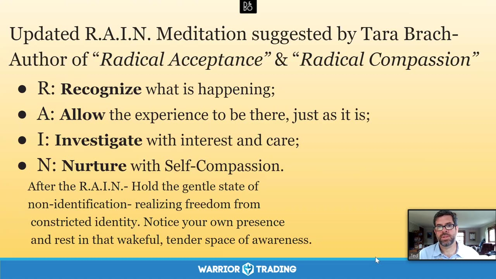

**图怎么看：**

- R: Recognize what is happening;
- A: Allow the experience to be there, just as it is;
- I: Investigate with interest and care;
- N: Nurture with Self-Compassion.

### 关键内容

- 通过冥想开始课程，帮助参与者放松并进入当下。
- 自我探究与慈爱存在有助于缓解内心的紧张和焦虑。
- 通过接受和放下，可以更好地处理过去的创伤和情绪。
- 自我观察和内部倾听是理解内心世界的工具。
- 识别并接纳内心的各个部分，促进自我成长。
- 通过练习，可以逐步释放内心的紧张和负面情绪。
- 自我接纳和自我同情是交易成功的关键。
- 通过自我探究，可以更好地理解自己的行为模式和动机。
- 保持警觉和谨慎，尤其是在睡眠不足的情况下进行交易。
- 识别并应对冲动行为，避免过度交易和冒险

### 分析与执行顺序

1. 课程开始时，通过冥想帮助参与者放松。
2. 分享诗歌《足够》，引导自我探究。
3. 通过呼吸练习，帮助参与者集中注意力。
4. 引导参与者观察自己的情绪和身体感受。
5. 通过自我探究，识别并接纳内心的各个部分。
6. 练习自我接纳和自我同情，促进内在平衡。
7. 通过自我观察，识别冲动行为的原因和动机。
8. 练习自我控制，避免过度交易和冒险行为。
9. 总结课程，强调自我探究的重要性

### 案例与细节

- 参与者提到在三小时睡眠后进行交易的心理状态。
- 分享了Jack Cornfield的接受概念，强调接受并不意味着无行动。
- 引用了Peter Levine关于发现痛苦根源的观点。
- 讨论了如何识别和应对内心的自我批评。
- 分享了Derek Walcott的诗歌《爱之后的爱》，强调自我接纳的重要性

### 风险与边界

- 课程录制于2020年，部分信息可能不再适用。
- 交易环境和个人情况的变化可能导致某些策略失效。
- 睡眠不足会影响决策能力，增加交易风险。
- 自我探究需要时间和耐心，短期内难以见效。
- 课程中的某些概念可能需要进一步实践验证

### 复盘问题

- 课程中提到的自我探究方法是否适用于您的交易情况？
- 您如何在实际交易中应用自我接纳和自我同情？
- 您是否注意到在交易前进行自我检查的效果？

---

## v0895：新手心态在交易中的应用

> 日期：2020-08-24　·　时长：00:49:22

**本场重点：** 新手心态可以帮助交易者保持开放和灵活，避免过度控制和固有思维，从而提高决策质量。

**图怎么看：**

- 新手心态可以帮助交易者保持开放和灵活，避免过度控制和固有思维，从而提高决策质量。
- 新手心态是心怀慈悲的初学者心态。
- 新手心态是空无一物，没有专家的习惯，准备接受、怀疑并开放所有可能性。
- 新手心态能够以一步一步的方式，瞬间揭示事物的本质。

### 关键内容

- 新手心态是一种开放的心态，有助于接受不确定性并探索新可能性。
- 过度控制会阻碍学习新事物的能力，新手心态则能促进新的学习。
- 确认偏误是新手心态需要克服的心理障碍之一。
- 接受现实是新手心态的核心，它要求交易者接受当前市场的真实情况。
- 新手心态有助于交易者从过去的交易中解脱出来，专注于当前的交易。
- 新手心态可以应用于各种市场条件，帮助交易者适应变化。
- 新手心态强调自我接纳和自我同情，而不是自我批评。
- 新手心态有助于交易者制定合理的目标，避免过度乐观或悲观。
- 新手心态可以应用于交易策略的开发和调整过程中。
- 新手心态强调自我反思和持续改进，而不是追求完美或一劳永逸的解决方案

### 分析与执行顺序

1. 分享Zen Mind, Beginners Mind的概念及其作者Shinryu Suzuki的观点。
2. 通过散步体验新手心态，放慢脚步，观察周围环境。
3. 进行呼吸练习，放慢节奏，进入当下。
4. 通过自我对话，接纳自己和当前的状态，培养自我同情。
5. 将新手心态应用于交易决策，避免过度控制和固有思维。
6. 通过实际例子，展示新手心态如何帮助交易者应对市场变化。
7. 强调新手心态的重要性，鼓励交易者持续实践和改进

### 案例与细节

- Jeff和Diane在散步时注意到阳光穿过森林，树叶的沙沙声，鸟儿的鸣叫，空气的温度，这些都帮助他们体验新手心态。
- 通过呼吸练习，Jeff和Diane注意到呼吸的细微感觉，空气在身体内的流动，胸部和腹部的扩张与收缩。
- 分享了Shinryu Suzuki的一段话，强调新手心态是开放和无边界的。
- 通过呼吸练习，Jeff和Diane开始更加开放地接受当下的不确定性。
- Jeff和Diane讨论了如何将新手心态应用于交易决策，避免过度控制和固有思维。
- 通过呼吸练习，Jeff和Diane开始更加开放地接受当下的不确定性，体验新手心态带来的自由和灵活性

### 风险与边界

- 新手心态的应用需要时间和实践，短期内可能不会立即见效。
- 过度依赖新手心态可能导致决策过于随意，缺乏系统性。
- 新手心态强调自我接纳和自我同情，但过度自我同情可能导致决策失误。
- 新手心态适用于个人交易，但在团队决策中可能需要更多考虑。
- 新手心态强调自我反思和持续改进，但过度自我反思可能导致拖延

### 复盘问题

- 新手心态如何帮助交易者更好地应对市场变化？
- 呼吸练习在新手心态中扮演什么角色？
- 如何将新手心态应用于实际交易决策中？
- 新手心态是否适用于所有类型的交易者？
- 新手心态能否帮助交易者克服确认偏误？

---

## v0896：面对恐惧：通过冥想和自我同情来应对

> 日期：2020-08-31　·　时长：00:51:01

**本场重点：** 本课程探讨了如何通过冥想和自我同情来处理交易中的恐惧情绪，强调了自我接纳的重要性。

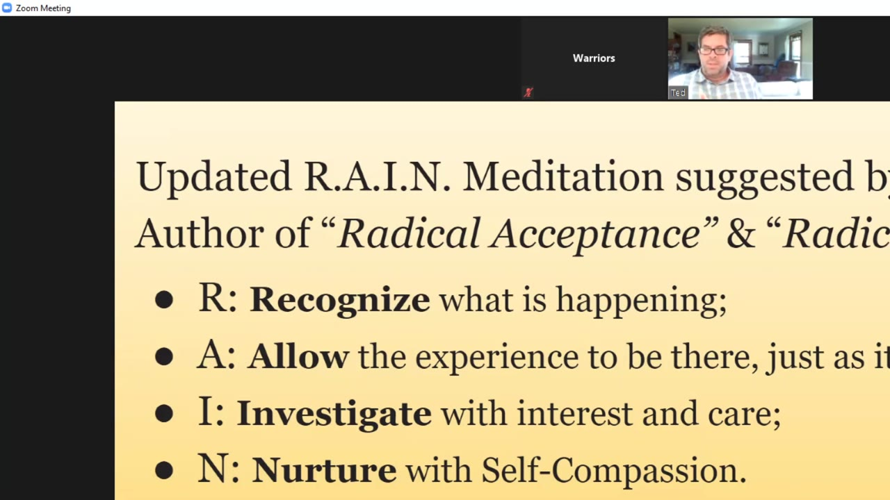

**图怎么看：**

- 画面放大显示R.A.I.N.四个首字母及其动作：识别正在发生的体验、允许其存在、以兴趣和关怀调查、用自我同情滋养。
- 背景文字提醒练习后不要重新认同狭窄身份，而要觉察自己的临在、温柔和意识；这把注意力从恐惧故事带回直接体验。
- 它对应本场面对恐惧的路径：交易者先识别身体紧张和灾难化想法，再允许、调查触发点，最后用更温和的方式选择是否继续交易。
- 冥想不能判断某只股票的方向，也不能替代止损；它只帮助降低自动反应，最终交易决定仍要服从客观计划和仓位限制。

### 关键内容

- 课程介绍了交易心理学和如何使用冥想来更好地处理情绪。
- 讲师提到了Carl Rogers的无条件积极关注概念，强调自我接纳的重要性。
- 通过雨滴冥想，帮助参与者更好地认识和处理自己的情绪。
- 课程强调了自我同情的重要性，包括接受和理解自己的情绪。
- 讲师分享了Tara Brock的名言，强调了无条件接纳自己。
- 课程通过雨滴冥想引导参与者进行自我反思和情绪管理。
- 讲师提到了自我同情的三个步骤：识别、命名和调查。
- 课程强调了自我同情的重要性，包括自我安抚和自我滋养。
- 课程引用了Rumi的诗歌，强调了接纳和理解生活中的各种情绪。
- 课程提到自我同情可以帮助人们更好地应对交易中的情绪波动。

### 分析与执行顺序

1. 讲师首先介绍了自己和团队，以及今天的主题是工作中的恐惧。
2. 讲师分享了Tara Brock的名言，强调了无条件接纳自己。
3. 讲师介绍了雨滴冥想的过程，包括呼吸和身体扫描。
4. 讲师引导参与者识别和命名自己的情绪。
5. 讲师指导参与者接受和理解自己的情绪。
6. 讲师解释了自我同情的三个步骤：识别、命名和调查。
7. 讲师强调了自我同情的重要性，包括自我安抚和自我滋养。

### 案例与细节

- “Happiness lies not in finding what is missing, but in finding what is present.” 这句话强调了自我接纳的重要性。
- “You know, the learning curve can be quite stressful in learning how to trade.” 交易学习曲线的陡峭性增加了情绪管理的难度。
- “Being as kind to yourself as possible can be immensely helpful.” 自我同情可以极大地帮助交易者。
- “And as you step back and more fully witness that, see if you can do so with a little more warmth, kindness, compassion, and acceptance.” 通过雨滴冥想，参与者可以更好地体验和接受自己的情绪。
- “So, yeah, in this, you know, tenderness and presence, really turning towards ourselves.” 通过自我反思，参与者可以更好地理解自己的情绪。
- “And as you're ready, you can begin to allow your focus to shift, letting your attention turn inward into your body.” 通过转向内在，参与者可以更好地管理自己的情绪。

### 风险与边界

- 录制年代限制，信息可能不再适用于当前市场环境。
- 自我同情的概念需要长期实践才能有效。
- 交易市场的变化可能导致情绪管理策略失效。
- 自我同情可能无法完全解决所有情绪问题。

### 复盘问题

- 课程中的雨滴冥想是如何帮助参与者更好地管理情绪的？
- 自我同情的三个步骤是什么？它们如何帮助参与者更好地理解自己的情绪？
- 课程中的名言和故事如何帮助参与者更好地接纳自己？

---

## v0897：冷静驻留

> 日期：2020-09-14　·　时长：00:46:59

**本场重点：** 通过冥想和自我接纳，学会在交易中保持冷静，避免情绪化决策。

**图怎么看：**

- 这张图片展示了一段关于冥想和自我接纳的文本，强调了在交易中保持冷静的重要性。
- 文本中提到的‘Shamatha’是一种冥想方法，旨在帮助人们稳定思维，专注于当下。
- 图片中的文字提供了关于如何通过冥想和自我接纳来管理情绪化决策的指导。
- 这与本场标题“冷静驻留”相契合，强调了在交易过程中保持冷静和理智的重要性。

### 关键内容

- 冥想是培养内心平静的重要工具，帮助交易者更好地应对情绪波动。
- 通过呼吸练习，可以逐步放松身心，进入更加专注的状态。
- 自我接纳是关键，接受自己当前的状态，而不是试图改变它。
- 交易中的情绪反应往往源于潜意识中的信念，需要深入探索这些信念。
- 保持冷静驻留，意味着在面对市场变化时保持理性思考。
- 通过练习，可以在更长时间内保持思维清晰，减少情绪干扰。
- 自我接纳和慈悲对待自己是克服交易恐惧的关键。
- 交易者需要关注过程而非结果，以更好地管理风险。
- 交易者应学会区分当前情绪与过去经历，避免过度反应

### 分析与执行顺序

1. 讲师首先介绍了冥想的重要性，强调了它作为培养内心平静的工具的作用。
2. 然后引导参与者进行呼吸练习，通过深呼吸来放松身体，逐渐进入冥想状态。
3. 接着，讲师强调了自我接纳的重要性，鼓励参与者接受自己当前的状态。
4. 进一步讨论了如何识别和处理潜意识中的信念，以减少情绪反应。
5. 最后，讲师分享了一个实际案例，说明如何在交易中保持冷静驻留，避免情绪化决策。

### 案例与细节

- 一位参与者提到，在交易中遇到大胜后又遭遇大亏损的情况，这反映了情绪反应可能带来的负面影响。
- 另一位参与者分享了如何通过呼吸练习来缓解交易中的恐惧感，这展示了冥想的具体应用。
- 讲师提到了一个关于交易风险管理的例子，强调了在交易过程中保持冷静的重要性。
- 还有一位参与者分享了如何通过自我接纳来处理交易中的恐惧感，这展示了自我接纳的实际效果。

### 风险与边界

- 交易市场的变化可能导致情绪反应加剧，影响冷静驻留的效果。
- 交易者可能难以完全控制自己的情绪，特别是在面临重大损失时。
- 录制年代限制意味着某些市场条件和心理策略可能已发生变化。
- 交易者需要持续练习，才能在实际交易中真正实现冷静驻留。

### 复盘问题

- 冥想练习对交易者的情绪管理有何具体帮助？
- 自我接纳在交易中如何发挥作用？
- 如何识别和处理潜意识中的信念，以减少情绪反应？
- 在实际交易中，如何保持冷静驻留？

---

## v0898：克服恐惧的心理策略

> 日期：2020-09-21　·　时长：00:49:23

**本场重点：** 通过心理策略克服恐惧，提高交易表现；理解恐惧的本质及其影响。

**图怎么看：**

- 这张图片展示了一个人在进行屏幕共享，背景是一个宁静的湖边景色。
- 图片上方的文字提到了如何通过冥想来理解和接纳恐惧。
- 图片下方的文字进一步解释了如何通过命名恐惧来与之建立联系。
- 整体内容强调了通过心理策略克服恐惧的重要性。

### 关键内容

- 恐惧往往源于过去的创伤，新手交易者在经历几次亏损后才会开始感到害怕。
- 接受恐惧的存在是克服它的第一步，通过正念冥想练习来实现。
- 恐惧是一种保护机制，但过度依赖它会限制我们的交易表现。
- 通过正念练习，可以逐步学会识别和接受自己的情绪，从而更好地应对市场波动。
- 恐惧的根源可能隐藏在更深层次的信念和恐惧中，需要逐步探索和理解。
- 面对恐惧时，可以选择退一步重新评估，或者勇敢地向前迈进。
- 正念练习可以帮助我们更好地理解自己，从而做出更明智的决策。
- 恐惧的表达形式多种多样，如愤怒、失望等，需要逐一识别和处理。
- 通过正念练习，可以逐渐减少对恐惧的抵抗，从而减轻其负面影响。
- 恐惧的根源可能与个人经历有关，需要深入探索以找到解决方法

### 分析与执行顺序

1. 首先，通过正念冥想练习，帮助参与者认识到自己的情绪和身体感受。
2. 接着，引导参与者识别和命名恐惧，将其视为一种可以被理解和接受的情绪。
3. 然后，通过自我对话和正念练习，逐步探索恐惧的根源和背后的原因。
4. 最后，鼓励参与者采取行动，无论是退一步重新评估还是勇敢地向前迈进。
5. 在整个过程中，强调正念练习的重要性，帮助参与者更好地理解自己和市场。
6. 通过逐步探索和接受恐惧，参与者可以逐步建立对市场的信心。
7. 最终，通过正念练习，参与者可以更好地应对市场波动，提高交易表现

### 案例与细节

- 一名新手交易者在经历几次亏损后开始感到害怕，这导致他在交易时变得犹豫不决。
- 通过正念练习，他开始意识到自己的恐惧，并逐步探索其根源，最终克服了这种恐惧。
- 一名交易者在面对市场波动时感到恐惧，通过正念练习，他学会了接受这种情绪，从而更好地应对市场。
- 一名交易者在面对失败时感到恐惧，通过正念练习，他学会了将这种恐惧转化为动力，从而更好地应对市场。
- 一名交易者在面对市场不确定性时感到恐惧，通过正念练习，他学会了接受这种不确定性，从而更好地应对市场

### 风险与边界

- 由于录制年代较早，部分市场规则和条件可能已发生变化。
- 正念练习的效果因人而异，需要持续实践才能看到明显效果。
- 恐惧的根源可能非常复杂，需要深入探索和理解，这可能需要更多的时间和资源。
- 正念练习可能不适合所有人，特别是那些有严重心理障碍的人。
- 市场环境的变化可能导致正念练习的效果减弱，需要不断调整策略

### 复盘问题

- 正念练习的具体步骤是什么？
- 如何识别和命名恐惧？
- 恐惧的根源可能是什么？
- 如何通过正念练习克服恐惧？
- 正念练习的效果如何衡量？

---

## v0899：Bodhi Chita 的实践与应用

> 日期：2020-09-28　·　时长：00:47:41

**本场重点：** 通过 Bodhi Chita 实践，我们可以更好地面对情绪波动，避免被情绪左右，从而更从容地应对市场变化。

**图怎么看：**

- Pema Chodron说，Bodhichitta就像黑暗中的闪电，让我们感到连接到某种东西，使我们的世界感觉更大。
- 当我们开始培养和珍视这些觉醒时刻时，它们会越来越多。
- 然后在某个时刻，从清醒转变为不可逆转：我们的心灵和思想发生了变化，Bodhichitta不再是短暂的经历，而是成为我们的一部分。
- 这表明通过Bodhichitta的实践，我们可以更好地面对情绪波动，避免被情绪左右，从而更从容地应对市场变化。

### 关键内容

- Bodhi Chita 是一种觉醒的心智，能够帮助我们更好地面对情绪波动。
- 通过练习 Bodhi Chita，我们可以学会更加温柔地对待自己，减少情绪反应。
- Bodhi Chita 可以帮助我们在面对市场时保持冷静和专注。
- 通过练习 Bodhi Chita，可以减少对市场的过度反应，提高交易决策的质量。
- Bodhi Chita 的实践需要持续的努力和耐心，不能一蹴而就。
- Bodhi Chita 可以帮助我们更好地理解自己的情绪，从而更好地管理它们。
- Bodhi Chita 的实践可以帮助我们从更深层次的角度看待市场波动。
- Bodhi Chita 的实践可以让我们在面对市场时更加自信和坚定。
- Bodhi Chita 的实践可以帮助我们更好地理解自己和他人的情绪。
- Bodhi Chita 的实践可以让我们更好地应对生活中的挑战和压力。

### 分析与执行顺序

1. 首先，通过冥想练习 Bodhi Chita，让自己进入更加平静的状态。
2. 然后，识别并接纳自己的情绪，而不是试图压抑它们。
3. 接着，通过呼吸练习，将注意力集中在身体的感受上，帮助自己放松。
4. 最后，通过练习 Bodhi Chita，逐渐学会更加温柔地对待自己和他人。
5. 在整个过程中，保持耐心和持续的努力，逐步提高自己的情绪管理能力。

### 案例与细节

- Kevin 在周五的工作中，通过练习 Bodhi Chita，学会了与内心的负面部分和平相处。
- Cheryl 发现自己的呼吸习惯有问题，通过练习 Bodhi Chita，学会了更加深沉的呼吸。
- Patty 分享了自己如何通过持续的练习 Bodhi Chita，逐渐减少对市场的过度反应。
- David White 的诗歌《所有真实的誓言》强调了坚持真理的重要性，与 Bodhi Chita 的实践相呼应。
- Bodhi Chita 的实践可以帮助我们更好地理解自己和他人的内心世界，从而更好地应对市场变化。

### 风险与边界

- Bodhi Chita 的实践需要时间和耐心，短期内可能看不到明显的效果。
- 过度依赖 Bodhi Chita 而忽视实际操作技能的提升，可能会导致交易表现不佳。
- Bodhi Chita 的实践可能需要面对一些负面情绪，这可能会让人感到不适。
- 录制年代限制，Bodhi Chita 的实践方法可能需要结合现代心理学理论进行调整。

### 复盘问题

- 你如何在日常生活中实践 Bodhi Chita？
- 你在面对市场波动时，是如何运用 Bodhi Chita 的？
- 你认为 Bodhi Chita 的实践对你的交易决策有何影响？

---

## v0900：舒适面对不确定性

> 日期：2020-10-05　·　时长：00:48:59

**本场重点：** 本课程探讨如何通过冥想和自我接纳来应对交易中的不确定性，强调在面对恐惧时保持冷静和理性。

**图怎么看：**

- 本课程的重点在于如何通过冥想和自我接纳来应对交易中的不确定性。
- 课程强调在面对恐惧时保持冷静和理性。
- 学员可以通过冥想和自我接纳来提高对不确定性的适应能力。
- 这有助于在交易过程中减少焦虑和压力，从而更好地把握市场机会。

### 关键内容

- 讲师分享了自己对鲨鱼的恐惧，以及如何通过游泳来面对这种恐惧。
- 通过冥想和自我接纳，可以更好地处理交易中的不确定性。
- 恐惧是自然存在的，但可以通过练习变得更为舒适。
- 在交易中，恐惧可能会导致过度谨慎或冲动行为。
- 通过逐步增加交易规模，可以在恐惧和舒适之间找到平衡。
- 面对恐惧时，需要保持理性和冷静，而不是被情绪左右。
- 在交易中遇到恐惧时，可以通过冥想来缓解压力。
- 恐惧和不确定性的存在是正常的，关键是如何处理它们。
- 通过练习，可以学会在面对不确定性时保持冷静。
- 恐惧和不确定性的处理方法适用于所有交易者，无论经验水平

### 分析与执行顺序

1. 讲师首先介绍了自己对鲨鱼的恐惧，并分享了如何通过游泳来面对这种恐惧。
2. 然后，讲师介绍了如何通过冥想来处理交易中的不确定性。
3. 接着，讲师分享了如何通过逐步增加交易规模来找到恐惧和舒适之间的平衡。
4. 最后，讲师强调了在面对恐惧时保持冷静的重要性，并鼓励大家进行自我接纳。
5. 在整个过程中，讲师多次引用了Pema Chodron的名言，以强调自我接纳的重要性。
6. 讲师还提到了Eckhart Tolle的观点，进一步说明了如何通过自我接纳来克服恐惧。
7. 讲师通过自己的经历和实例，展示了如何在面对恐惧时保持冷静和理性

### 案例与细节

- 讲师提到自己在Texas和Colorado生活时没有遇到鲨鱼，但在搬到Massachusetts后，开始担心鲨鱼。
- 在一次视频中，16英尺的白鲨出现在Cape Cod附近的海滩上，这增加了讲师的恐惧感。
- 讲师分享了自己如何通过游泳来面对对鲨鱼的恐惧，从而逐渐克服这种恐惧。
- 在交易中，当交易规模较小或在模拟器中交易时，恐惧可能不存在，但这可能导致交易者失去专注。
- 当交易规模增加到500股时，恐惧会重新出现，导致恐慌和冲动行为

### 风险与边界

- 本课程录制于2020年，部分信息可能不再适用，如某些软件功能或平台状态。
- 交易市场的变化可能导致某些策略不再有效，因此需要持续关注市场动态。
- 恐惧和不确定性的处理方法虽然普遍适用，但每个交易者的具体情况不同，需要灵活调整。
- 本课程提供的方法适用于一般情况，但在特定市场环境下可能需要额外的应对措施

### 复盘问题

- 在面对恐惧时，您是如何保持冷静和理性的？
- 您是否尝试过通过冥想来处理交易中的不确定性？
- 您在交易中遇到恐惧时，通常会采取哪些措施来缓解压力？
- 您是否发现通过逐步增加交易规模来找到恐惧和舒适之间的平衡有助于提高交易表现？
- 您是否同意恐惧和不确定性的存在是正常的，关键是如何处理它们？

---

## v0901：情绪冲动与交易心理

> 日期：2020-10-12　·　时长：00:47:51

**本场重点：** 交易中情绪冲动会阻碍决策，通过冥想和自我认知可以缓解。

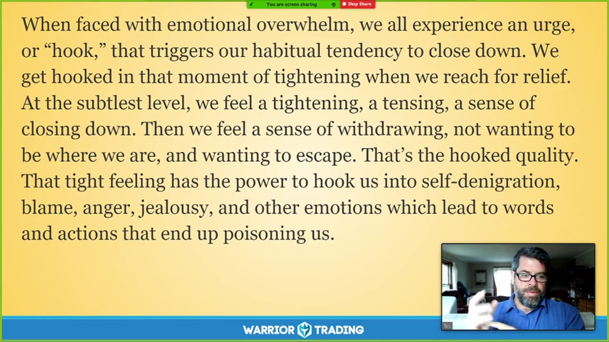

**图怎么看：**

- 这张幻灯片展示了一段关于情绪冲动对交易决策影响的文本，强调了在面对情绪困扰时，人们往往会感到紧张和渴望逃离当前状态。
- 幻灯片上显示了Daniel Goleman的名言，指出抵制冲动是所有情感自我控制的基础，因为所有的感情都可能引发某种冲动。
- 幻灯片还提到了“钩住”这一概念，描述了当人们感到情绪困扰时，可能会经历一种紧绷感和想要逃离的感觉，这种感觉可能导致负面情绪和行为。
- 这些内容有助于理解情绪冲动如何影响交易决策，并提供了解决方法，如冥想和自我认知。

### 关键内容

- 交易中情绪冲动是常见现象，会影响决策质量。
- 通过冥想和自我认知可以缓解情绪冲动带来的负面影响。
- 合理的目标设定和简化策略有助于应对情绪波动。
- 交易新手难以获得正确的直觉，需要时间训练。
- 情绪冲动源于对现实的逃避，试图避免更脆弱的情感。
- 通过冥想练习可以学会放松面对情绪冲动，减少习惯性模式的影响。
- 交易中需要培养自我认知和接受能力，以更好地应对情绪波动。
- 交易新手在过渡期容易出现情绪冲动，需要特别注意。
- 通过冥想练习可以提高决策质量，进入适当的流动状态

### 分析与执行顺序

1. 首先，讲师介绍了交易中情绪冲动的普遍性和影响。
2. 然后，讲解了如何通过冥想和自我认知来缓解情绪冲动。
3. 接着，分享了如何设定合理目标和简化策略以应对情绪波动。
4. 最后，强调了通过冥想练习可以提高决策质量，进入适当的流动状态。
5. 在整个过程中，讲师多次引用了相关理论和实例进行说明。

### 案例与细节

- “从河上看到的景象让我想起了年轻时在Santa Elena Canyon的时光，提醒我保持内心的平静。”
- “如果可以让你的经验发生，它将释放其结，展开，带来更深层次、更稳固的自我体验。”
- “如果可以让你的经验发生，即使是在最痛苦或最可怕的感觉出现时，你的意愿去面对它们会唤起你内在的力量。”

### 风险与边界

- 交易新手在过渡期容易出现情绪冲动，需要特别注意。
- 情绪冲动源于对现实的逃避，试图避免更脆弱的情感。
- 通过冥想练习可以提高决策质量，但需要持续练习。
- 交易新手在初期难以获得正确的直觉，需要时间训练。

### 复盘问题

- 交易中情绪冲动的具体表现有哪些？
- 如何通过冥想和自我认知缓解情绪冲动带来的负面影响？
- 交易新手在初期如何提高决策质量？

---

## v0902：接纳内心的不安

> 日期：2020-10-19　·　时长：00:47:03

**本场重点：** 在交易中遇到困难情绪时，通过冥想练习接纳和转化，而不是陷入旧习惯模式。

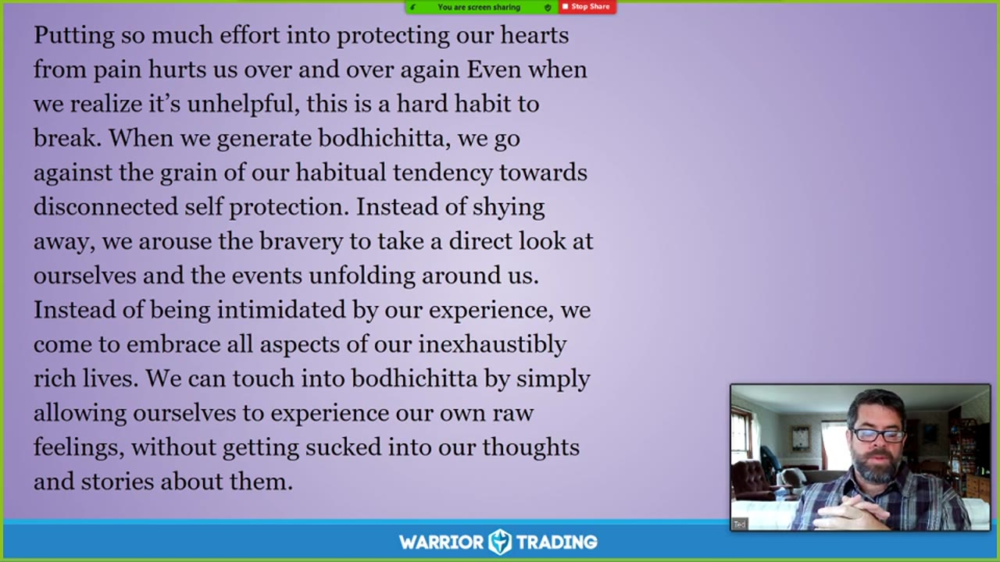

**图怎么看：**

- 紫色幻灯片讨论为了避免痛苦而保护内心的习惯，并指出这种保护容易让人脱离生命体验、缩小世界并陷入恐惧。
- 正文以Bodhicitta说明另一条路径：保持清醒、带着觉察面对周围事件，允许原始感受出现，而不立即被既有想法和故事黏住。
- 这与“接纳内心不安”对应：交易中的焦虑不必立刻通过追单、加仓或逃避来消除，可以先容纳感受，再回到规则判断。
- 开放体验不等于继续承担无限风险；如果交易条件已经失效，应按计划退出，同时允许失望存在，而不是用仓位证明自己。

### 关键内容

- 交易中遇到困难情绪时，容易陷入旧习惯模式，难以摆脱。
- 通过冥想练习，可以学会接纳这些情绪，而不是逃避。
- 接纳内心不安有助于培养更深层次的同理心和慈悲。
- 市场波动性大，需要灵活适应，而非寻求固定解决方案。
- 通过练习，可以逐渐习惯接受不完美和不可控的事物。
- 接纳内心不安有助于进入流动状态，调整策略。
- 通过练习，可以逐渐建立处理更多情绪的能力。
- 接纳内心不安有助于减少对舒适感的依赖，增加对痛苦的承受力。
- 通过练习，可以逐渐减少对旧习惯模式的依赖，转向更积极的态度。
- 接纳内心不安有助于培养更深层次的自我连接和理解

### 分析与执行顺序

1. 首先，回顾交易中遇到的困难情绪，识别旧习惯模式。
2. 然后，通过冥想练习，学会接纳这些情绪，而不是逃避。
3. 接着，识别身体中的紧张和压力点，进行呼吸练习。
4. 再者，通过练习，逐渐学会接纳内心不安，而不是试图消除它。
5. 最后，通过练习，可以逐渐减少对旧习惯模式的依赖，转向更积极的态度。
6. 在整个过程中，保持耐心和持续练习的重要性。
7. 通过练习，可以逐渐建立处理更多情绪的能力，减少对舒适感的依赖

### 案例与细节

- 当市场波动时，容易陷入过度交易或报复性交易，导致大量损失。
- 通过练习，可以学会在面对失败时，将其视为学习机会，而不是自我批评。
- 当市场突然下跌时，容易产生恐慌情绪并做出冲动的卖出决定，通过练习可以学会冷静下来，分析市场情况，而不是立即跟随市场的波动。

### 风险与边界

- 市场环境变化可能导致旧习惯模式再次出现，需要持续练习。
- 过度依赖旧习惯模式可能导致决策失误，需要逐步减少依赖。
- 市场波动性大，需要灵活适应，而非寻求固定解决方案。

### 复盘问题

- 在交易中遇到困难情绪时，如何通过冥想练习接纳和转化？
- 通过练习，可以逐渐减少对旧习惯模式的依赖，转向更积极的态度，具体有哪些方法？
- 在面对失败时，如何将其视为学习机会，而不是自我批评？

---

## v0903：Mindful Monday：接受自己

> 日期：2020-10-26　·　时长：00:46:28

**本场重点：** 通过接受自己来克服内心的评判，实现心灵成长。

**图怎么看：**

- 幻灯片建议在挣扎时给自己一个友善动作，并用“没关系，你会没事，我们以前经历过”一类语言提供安抚和支持。
- 下半段把“不配得感的恍惚”描述为阻隔归属感的强大方式，并提出通往归属甜蜜感的路径是接纳自己和不评判地接纳他人。
- 它对应本场“接受自己”：亏损或犯错后先减少自我攻击，才能更诚实地查看规则违约、情绪触发和下一步修正。
- 友善语言不能抹去交易后果；复盘仍需记录具体订单和损失，只是避免用羞耻把一次错误扩大成身份判断。

### 关键内容

- 接受自己是克服内心评判的关键。
- 通过自我反思和练习，可以更好地理解自己。
- 接受自己需要放下对完美的追求。
- 接受自己意味着拥抱自己的全部，包括弱点。
- 接受自己有助于减少对自我的过度识别。
- 接受自己可以带来内心的平静和自由。
- 接受自己需要时间和持续的努力。
- 接受自己是迈向自我接纳的第一步。
- 接受自己可以改善交易心态。
- 接受自己需要培养内在的慈悲和理解

### 分析与执行顺序

1. 首先，介绍接受自己的重要性。
2. 然后，解释接受自己需要放下对完美的追求。
3. 接着，强调接受自己需要培养内在的慈悲和理解。
4. 再者，分享如何通过自我反思来更好地理解自己。
5. 最后，鼓励观众每天练习接受自己，以实现心灵成长

### 案例与细节

- “我们有这样一种倾向，即完美主义，这实际上是一个非常苛刻的任务主人，它实际上离我们的中心越来越远。”
- “比如，当我在早上6点左右进行自己的冥想练习时，我通常会思考有一天我会开放房间让你们坐在一起。”
- “当我们在任何给定的时刻感觉到有两个部分时，一部分有能力退后一步，转向另一部分，而另一部分则经历着体验的强度。”
- “当我们在这些状态下感到恐惧时，逻辑可以如此强烈，以至于很难看到其他东西。”
- “当我们从这些状态中出来时，我们会意识到，尽管当时感觉非常强烈，但其实并没有那么糟糕。”

### 风险与边界

- 录制年代限制，信息可能不再适用于当前市场环境。
- 接受自己需要时间和持续的努力，否则效果有限。
- 完美主义可能会阻碍接受自己，需要逐步克服。
- 自我反思和练习需要自律，否则难以坚持。
- 接受自己需要培养内在的慈悲和理解，这可能需要时间

### 复盘问题

- 你今天是否尝试了接受自己？
- 你在哪些方面遇到了困难？
- 你如何将接受自己应用到你的交易中？

---

## v0904：Maitri：自我友好的接纳

> 日期：2020-11-02　·　时长：00:49:23

**本场重点：** 通过Maitri练习，接纳自己当前的状态，培养自我友好的态度，以改善情绪管理和交易表现。

**图怎么看：**

- 通过Maitri练习，接纳自己当前的状态，培养自我友好的态度，以改善情绪管理和交易表现。
- 在冥想中，我们学会对自我表现出善意、爱意和同情心。无论何时何地，我们都会与自己共处，无论心情如何。
- 当我们培养对自我的慈悲时，我们也正在培养平静。平静意味着我们能够无条件地接受自己和世界，不被‘对’和‘错’所左右。
- 在基本坐姿练习中，我们与自己建立友谊，并培养对自我的慈悲。

### 关键内容

- Maitri是Pema Chodron提出的概念，意为自我友好的接纳。
- 冥想练习帮助我们接受自己当前的状态，无论是混乱还是清晰。
- 自我友好的态度有助于缓解内心的评判和负面情绪。
- 通过呼吸练习，逐步放松身体，释放紧张。
- 培养自我友好的态度可以促进交易决策的冷静和理性。
- 冥想练习需要耐心，逐步培养清晰的意识。
- 自我友好的态度可以帮助我们更好地处理交易中的失败。
- 通过呼吸练习，将友好的心态扩展到整个身心。
- 自我友好的态度有助于建立内在的平静和平衡。
- 冥想练习可以提高交易者的整体表现

### 分析与执行顺序

1. 讲师首先介绍了Maitri的概念，强调接纳自己当前的状态。
2. 然后引导参与者进行呼吸练习，逐步放松身体。
3. 接着，讲师指导参与者关注自己的身体，释放紧张。
4. 最后，讲师引导参与者将友好的心态扩展到整个身心。
5. 在整个过程中，讲师不断强调自我友好的重要性。
6. 通过呼吸练习，逐步培养内在的平静和平衡。
7. 最后，讲师总结了冥想练习的目的和意义

### 案例与细节

- “当我们在冥想时，我们的头脑可能会像猴子一样快速运转，这时我们可以转向它，接受它。”
- “通过呼吸练习，让一切活动逐渐平息下来，注意呼吸的感觉，感受空气在体内的流动。”
- “随着呼吸，让所有的活动逐渐平息下来，注意呼吸的感觉，感受空气在体内的流动。”

### 风险与边界

- 冥想练习需要耐心，如果参与者无法坚持，可能会影响效果。
- 自我友好的态度需要长期培养，短期内难以显著改善情绪管理。
- 录制年代限制，适用于2020年的情况，可能不适用于当前环境。
- 自我友好的态度需要结合其他心理训练方法，单独使用效果有限

### 复盘问题

- 冥想练习的具体步骤是什么？
- 如何通过呼吸练习来放松身体？
- 自我友好的态度如何帮助改善交易表现？
- 冥想练习需要多长时间才能看到效果？

---

## v0905：交易心理与路径

> 日期：2020-11-09　·　时长：00:45:40

**本场重点：** 通过交易心理培养，找到内心的柔软，面对不确定性，保持平衡。

**图怎么看：**

- 这张图片展示了一位讲师在进行交易心理相关的讲解，背景是一个美丽的自然景观，可能意在传达交易中的不确定性和挑战。
- 图片下方有“WARRIOR TRADING”的标志，表明这可能是与交易相关的培训课程。
- 图片中间的文字引用了Pema Chodron关于交易心理的见解，强调了在交易过程中如何面对不确定性，保持内心的柔软。
- 整体来看，这张图片有助于理解交易心理的重要性，并提供了一种应对交易中不确定性的方法。

### 关键内容

- 交易心理是交易成功的关键，通过培养勇气和柔软心，可以更好地应对市场波动。
- 勇气不是没有恐惧，而是能够面对恐惧并继续前进。
- 交易过程中，保持内心的柔软和平衡至关重要，避免过度自信或悲观。
- 通过练习和反思，可以更好地理解自己的情绪和市场反应。
- 交易策略需要稳定性和一致性，避免频繁改变策略。
- 面对失败和挫折时，要有自我接纳和原谅的心态。
- 交易心理训练没有捷径，需要长期坚持。
- 通过冥想和自我反思，可以更好地理解自己和市场。
- 交易心理训练的核心是面对不确定性，而不是逃避它。
- 交易心理训练可以帮助交易者更好地管理情绪和市场风险

### 分析与执行顺序

1. 开始时，讲师介绍了今天的主题《战士之路》，并引用了关于勇气和软化的比喻。
2. 通过冥想和自我反思，帮助听众更好地理解自己的情绪和市场反应。
3. 分享了关于勇气和软化的例子，强调了面对恐惧和不确定性的能力。
4. 讨论了交易心理的重要性，包括如何面对失败和挫折。
5. 强调了交易策略的稳定性和一致性，以及如何处理市场波动和情绪波动

### 案例与细节

- “When I was about six years old, I received an essential Bodhi-Chita teaching from an old woman sitting in the sun.” 这个例子展示了从童年就开始培养交易心理的重要性。
- “Even the cruelest people, even the cruelest people have this soft spot.” 这句话强调了每个人内心都有柔软的一面，可以通过练习发现。
- “We can try to control the uncontrollable by looking for security and predictability, always hoping to be comfortable and safe.” 这句话描述了试图控制不可控因素的心理过程。
- “The central question of a warrior's training is not how we avoid uncertainty and fear.” 这句话强调了面对不确定性和恐惧的重要性。
- “You know, you're sitting there, you have a plan. You know, you're, you know, you've got your strategy, you know, firmly set.” 这个场景描述了交易者在制定计划时的状态

### 风险与边界

- 交易心理训练的效果因人而异，需要长期坚持。
- 市场环境不断变化，交易心理训练需要适应新的市场条件。
- 交易者的情绪波动会影响决策，需要学会管理和调节情绪。
- 交易心理训练无法保证盈利，需要结合实际操作进行验证

### 复盘问题

- 你认为勇气和柔软心在交易中扮演什么角色？
- 如何通过交易心理训练更好地应对市场波动和情绪波动？
- 你如何理解交易心理训练的核心是面对不确定性而非逃避它？

---

## v0906：Mindful Monday：培养内心平静与正念

> 日期：2020-11-16　·　时长：00:45:31

**本场重点：** 通过正念练习和自我接纳，培养内心平静，以应对交易中的情绪波动。

**图怎么看：**

- 这张图片展示了一个自然景观，背景是一个美丽的山谷和河流，天空中有云彩，给人一种宁静的感觉。
- 右下角的小窗口显示了一位正在讲话的人，可能是在进行一场关于内心平静和正念的讲座。
- 屏幕顶部有一个绿色的提示框，写着“您正在进行屏幕共享”，这表明这是一个在线直播或视频会议。
- 屏幕底部有一个蓝色的横幅，上面写着“Warrior Trading”，这可能是提供该课程的公司或组织的名称。

### 关键内容

- 正念练习有助于从紧张转变为平静，释放内在压力。
- 交易中的情绪波动会让我们失去平衡，变得反应过度。
- 通过正念练习，可以学会以更开放的心态面对自己的情绪。
- 正念练习可以帮助我们更好地理解自己，从而做出更明智的决策。
- 正念练习可以减轻交易中的焦虑和恐惧感。
- 正念练习有助于建立内心的平和，提高交易表现。
- 正念练习可以让我们更好地接纳自己，从而减少自我批评。
- 正念练习可以让我们更好地理解自己，从而减少情绪化的决策。

### 分析与执行顺序

1. 开始正念练习，通过呼吸来放松身心。
2. 注意自己的呼吸，感受每一次呼吸带来的变化。
3. 观察身体的感受，特别是任何紧张或压力的部位。
4. 通过呼吸将注意力转移到身体的各个部分，释放紧张。
5. 在练习过程中，保持开放和接纳的态度，接受自己的情绪。
6. 练习结束后，逐渐回到日常生活中，继续应用正念练习。

### 案例与细节

- 正念练习中，通过呼吸来放松身心，感受每一次呼吸带来的变化。
- 在练习过程中，注意到身体的紧张部位，并通过呼吸将其释放。
- 通过正念练习，学会以更开放的心态面对自己的情绪，如愤怒或悲伤。
- 在交易中，通过正念练习，能够更好地理解自己，从而减少情绪化的决策。
- 通过正念练习，能够更好地接纳自己，从而减少自我批评。

### 风险与边界

- 正念练习需要持续进行，否则效果可能不佳。
- 正念练习可能会在初期带来一些不适感，如情绪波动。
- 正念练习的效果因人而异，需要根据个人情况进行调整。
- 正念练习的成效受到个人心理状态的影响，需要耐心和坚持。
- 正念练习的效果可能受到外部环境的影响，如工作压力等。

### 复盘问题

- 正念练习的具体步骤是什么？
- 如何在日常生活中应用正念练习？
- 正念练习对交易表现有何影响？

---

## v0907：Tonglin冥想：培养慈悲心

> 日期：2020-11-23　·　时长：00:47:33

**本场重点：** 通过Tonglin冥想培养慈悲心，改善情绪管理，提高交易表现。

**图怎么看：**

- 在四个阶段中开始可视化。
- 呼吸时感受热、黑暗和沉重的感觉——一种窒息感，并在呼气时感受凉爽、明亮和光亮的感觉——一种清新感。
- 完全吸入负能量，通过身体的所有毛孔吸收，然后完全辐射出正能量。
- 持续这个过程直到你的可视化与你的吸气和呼气同步。

### 关键内容

- Tonglin冥想是一种源自藏传佛教的传统练习，旨在培养对他人的同情心。
- 通过呼吸练习，将他人的痛苦吸入，将爱和希望送出。
- 这种练习有助于缓解内心的恐惧和焦虑，提高对他人和自己的同情心。
- Tonglin冥想可以应用于各种情境，包括自己和他人的困难时刻。
- 通过练习，可以逐渐扩展慈悲心，超越个人界限。
- Tonglin冥想有助于克服对损失的恐惧，从而更好地应对市场波动。
- 练习时，可以注意到自己的情感反应，如愤怒和嫉妒，并将其转化为积极的能量。
- 通过练习，可以逐步培养出对他人的同情心，即使在看似不可能的情况下也能做到。
- Tonglin冥想可以无限扩展，帮助人们认识到事物并非如此坚固，从而体验到空性。
- 练习时，可以感受到自己与他人的连接，以及共享的同情心

### 分析与执行顺序

1. 首先进行开放心胸的练习，让意识连接到内心深处的爱和慈悲。
2. 然后进行可视化练习，想象将他人的痛苦吸入，将爱和希望送出。
3. 接着聚焦于任何痛苦的情境，如个人经历的损失，同时发送同情和支持。
4. 最后扩展慈悲心，不仅针对自己和亲近的人，还要扩展到更广泛的群体。
5. 在整个练习过程中，注意自己的情感反应，如愤怒和嫉妒，并将其转化为积极的能量

### 案例与细节

- 通过Tonglin冥想，当看到别人取得成功时，可以培养出同情心，而不是嫉妒。
- 在交易中遇到挫折时，可以练习将负面情绪转化为积极的能量，以保持冷静。
- 当看到市场波动时，可以练习将内心的恐惧转化为对市场的理解，从而更好地应对。
- 在与朋友或家人交流时，可以练习将内心的温暖和关怀传递给他们，增进彼此的关系

### 风险与边界

- Tonglin冥想需要持续练习才能见效，否则可能无法达到预期效果。
- 在交易中应用时，需要结合实际情况灵活调整，否则可能无法有效应对市场变化。
- 由于录制年代较早，部分信息可能不再适用，需结合当前市场环境进行调整。
- 练习时可能会遇到情绪波动，需要学会如何处理这些情绪，否则可能影响练习效果

### 复盘问题

- 在Tonglin冥想中，如何处理自己的情绪反应，如愤怒和嫉妒？
- 通过Tonglin冥想，如何将负面情绪转化为积极的能量？
- 在实际交易中，如何应用Tonglin冥想来应对市场波动？

---

## v0908：Mindful Monday：探索Shikantaza冥想

> 日期：2020-11-30　·　时长：00:45:18

**本场重点：** 通过Shikantaza冥想，理解如何在交易中保持冷静，避免冲动行动。

**图怎么看：**

- 这张图片展示了一位讲师正在分享关于Shikantaza冥想的内容。
- 背景中的风景图片与交易课程的主题相呼应，可能用于营造一种平静和专注的氛围。
- 讲师似乎正在进行一场在线讲座或研讨会，这与课程的重点——在交易中保持冷静和避免冲动行动有关。
- 图片中的风景和讲师的互动可能是为了帮助学员更好地理解和应用冥想技巧。

### 关键内容

- Shikantaza是一种高级的禅宗冥想形式，强调直接坐下来，不做任何思考。
- 通过Shikantaza，可以更好地理解自己的思维过程，避免被情绪左右。
- 这种冥想有助于提高对市场变化的响应能力，而不是反应性。
- 长期练习可以培养对他人的友善态度，从而改善人际关系。
- Shikantaza强调直接体验思想和情感，而不是评判它们。
- 通过练习，可以更好地认识到自己和他人的内在联系。
- 这种冥想可以帮助交易者更好地管理情绪，避免冲动交易。
- Shikantaza强调放松心态，让思想自然流动，而不是强行控制。
- 通过练习，可以逐渐减少对市场的过度关注，回归内心平静。
- Shikantaza强调直接体验，而不是通过复杂的技巧来达到目的。

### 分析与执行顺序

1. 讲师首先介绍了Shikantaza的基本概念，强调直接坐下来，不做任何思考。
2. 然后讲解了Shikantaza的核心原则，即直接体验思想和情感，而不是评判它们。
3. 接着，讲师分享了一段关于Shikantaza的指导语，帮助听众进行冥想。
4. 最后，讲师总结了Shikantaza对交易者的潜在益处，包括提高情绪管理能力。
5. 在整个过程中，讲师多次强调放松心态，让思想自然流动的重要性。
6. 讲师还提到了其他冥想形式，如Tonglin，以对比Shikantaza的特点。

### 案例与细节

- “当我在开始坐下来时，外面是黑暗的，然后在坐的过程中，太阳升起来了。”
- “我们的大脑喜欢生成思想，即使在睡觉时，我们的梦也是大脑自我对话的表现。”
- “就像天空不会阻碍白云自由漂浮一样，我们也不应该阻碍思想自由流动。”
- “在一次交易中，我注意到自己在思考是否应该进入某个交易，然后我意识到这只是一个想法，而不是我的决定。”
- “通过练习Shikantaza，我发现自己开始更喜欢人们，即使这不是我最初的目的。”

### 风险与边界

- 由于录制于2020年，一些市场条件和规则可能已发生变化。
- 虽然Shikantaza有助于情绪管理，但不能保证交易者不会出现亏损。
- 长期坚持练习需要时间和耐心，否则可能难以看到明显效果。
- 在实际交易中应用这些理念需要结合具体市场情况和策略。
- 虽然Shikantaza有助于提高情绪管理能力，但不能替代专业的风险管理措施。

### 复盘问题

- Shikantaza的核心原则是什么？
- 通过Shikantaza练习，交易者可以得到哪些具体的益处？
- 如何将Shikantaza的理念应用到实际交易中？
- 除了Shikantaza，还有哪些冥想形式可以帮助交易者更好地管理情绪？
- 长期坚持Shikantaza练习需要哪些条件？

---

## v0909：自我赞助：心理调适与情绪管理

> 日期：2020-12-07　·　时长：00:49:03

**本场重点：** 自我赞助是通过接纳和引导内心的负面情绪，将其转化为积极力量的过程。这个过程需要耐心和深度自我认知，最终能够帮助我们更好地应对市场波动。

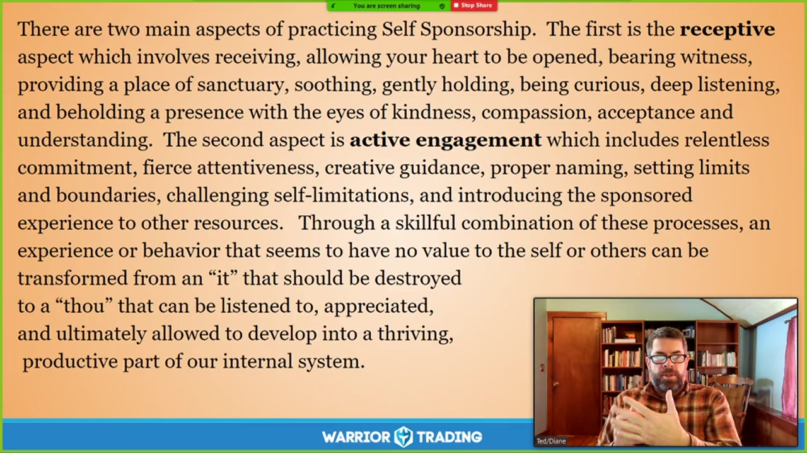

**图怎么看：**

- 本场重点：自我赞助是通过接纳和引导内心的负面情绪，将其转化为积极力量的过程。
- 这个过程需要耐心和深度自我认知，最终能够帮助我们更好地应对市场波动。
- 候选时间：A=1284秒，B=1030秒，C=2001秒
- 源系列：Mindful Monday / 2020

### 关键内容

- 自我赞助是一种心理工具，用于处理交易过程中的强烈情绪。
- 自我赞助的核心在于接纳内心的不同部分，而不是试图消除它们。
- 通过自我赞助，可以将内心的恐惧、焦虑等负面情绪转化为积极的力量。
- 自我赞助包括两个主要方面：接纳和引导（接收）以及积极干预（主动）。
- 接纳部分需要开放心态，接纳内心的负面情绪，而不是试图压抑它们。
- 积极干预则需要设定界限，引导这些情绪以更健康的方式表达。
- 自我赞助可以帮助交易者更好地应对市场波动，提高决策质量。
- 自我赞助需要时间和实践，逐步培养出这种能力。
- 自我赞助强调的是内在的自我对话，而非外界评判。
- 自我赞助有助于建立更深层次的自我意识，从而更好地管理情绪

### 分析与执行顺序

1. 首先，通过冥想来放松身心，进入更加平静的状态。
2. 然后，通过自我对话，识别内心的不同部分及其表现。
3. 接着，接纳这些部分，给予它们更多的关注和理解。
4. 之后，通过积极干预，引导这些部分以更健康的方式表达。
5. 最后，通过练习和反思，逐步培养自我赞助的能力。
6. 在整个过程中，保持开放的心态，接纳内心的每一个部分。
7. 通过自我赞助，逐步建立更深层次的自我意识，更好地管理情绪

### 案例与细节

- 在交易中，当遇到亏损时，内心的谨慎部分可能会变得过度活跃，导致过度保守。
- 通过自我赞助，可以将这种谨慎转化为一种积极的力量，帮助交易者更好地控制风险。
- 例如，Ross 在交易中表现出极高的速度，这源于他对市场的恐惧和焦虑。
- 通过自我赞助，他学会了如何接纳和引导这种恐惧，将其转化为一种快速反应的能力。
- 在交易中，当面对市场波动时，内心的冲动部分可能会导致冲动交易。
- 通过自我赞助，可以将这种冲动转化为一种更理性的决策过程，从而提高交易质量

### 风险与边界

- 自我赞助需要时间和实践，短期内可能看不到明显效果。
- 如果过度依赖自我赞助而忽视了市场基本面和技术分析，可能会导致决策失误。
- 自我赞助强调的是内在的自我对话，而非外界评判，这可能导致过度自信。
- 录制年代限制为2020年，当前市场环境和心理策略可能有所不同
- 自我赞助的效果因人而异，需要个体根据自身情况灵活应用

### 复盘问题

- 自我赞助的核心是什么？如何通过自我赞助来改善交易表现？
- 在自我赞助的过程中，如何平衡接纳和引导这两个方面？
- 自我赞助需要哪些具体步骤？如何在实际交易中应用这些步骤？

---

## v0910：交易心理：平衡、勇猛、温柔与游戏

> 日期：2020-12-14　·　时长：00:50:34

**本场重点：** 交易心理中如何通过勇猛、温柔和游戏找到内心的平衡，提升决策质量。

**图怎么看：**

- 这张幻灯片详细列出了赞助实践涉及的几个关键方面，包括中心化/开放注意力、深度倾听/正确命名、被触摸/触摸、挑战/接受、连接资源和传统、发展多个框架/练习行为技能以及培养勇气、温柔和游戏。
- 这些内容强调了在赞助实践中需要关注的几个重要方面，帮助参与者更好地理解和支持这一过程。
- 通过这些方面的练习，人们可以提高自己的敏感度和适应能力，从而更好地应对各种情况。

### 关键内容

- 勇猛代表着保护自我、他人和界限的能量。
- 温柔是表达温柔、关心和同情的能量，有助于开放心灵。
- 游戏性是自由、好奇和创造性的能量，有助于打破固定思维。
- 勇猛和温柔之间的平衡可以避免过度的攻击性和被动性。
- 游戏性在勇猛和温柔之间起到调节作用，避免过度严肃或轻浮。
- 勇猛、温柔和游戏性三者平衡有助于更好地面对生活中的挑战。
- 勇猛、温柔和游戏性是交易心理中重要的自我调节工具。
- 通过勇猛、温柔和游戏性找到内心的平衡，可以提高决策质量。
- 勇猛、温柔和游戏性是交易心理中自我探索的重要方面

### 分析与执行顺序

1. 讲师首先介绍了勇猛、温柔和游戏性三个品质的概念。
2. 然后详细解释了每个品质的作用及其重要性。
3. 接着讨论了这三个品质之间的平衡关系。
4. 最后强调了这些品质在交易心理中的应用。
5. 在整个过程中，讲师多次引用了相关理论和实例进行说明

### 案例与细节

- 勇猛：讲师提到，勇猛是保护自我、他人和界限的能量，如在交易中保持坚定的决心。
- 温柔：温柔是表达关心和同情的能量，如在交易中保持柔软的心灵。
- 游戏性：游戏性是自由和创造性的能量，如在交易中保持开放的心态。
- 勇猛和温柔的平衡：讲师举例说，如果勇猛过多而缺乏温柔，会导致冲动和攻击性。
- 游戏性的作用：讲师提到，游戏性可以帮助打破固定思维，如在交易中尝试新的策略

### 风险与边界

- 勇猛过多可能导致冲动和攻击性，影响决策质量。
- 温柔不足可能导致过于被动和胆怯，影响交易表现。
- 游戏性过度可能导致轻浮和无纪律，影响交易稳定性。
- 录制年代限制：这些内容基于2020年的录制，可能不适用于当前市场环境。
- 交易心理的应用需要结合个人情况，不能一概而论

### 复盘问题

- 勇猛、温柔和游戏性在交易心理中分别扮演什么角色？
- 如何在实际交易中找到这三种品质的平衡？
- 哪些实例可以用来说明这三种品质的应用？

---

## v0911：非暴力对待自己

> 日期：2020-12-21　·　时长：00:47:09

**本场重点：** 通过非暴力对待自己，可以更好地管理情绪和自我批评，从而提高交易表现。

**图怎么看：**

- 通过冥想实践接受所有事物，停止与内心的斗争，开始与真实的自我和平相处。
- 这是一种强大的体验，通过放慢脚步进入安静的存在，我们可以看到我们评判思维的无情性。
- 这是一个对评判思维进行彻底观察并反思其对立面——爱评判思维的人性的深刻形式自疗。
- 这种微妙的自我关怀可以带来深远的解放。

### 关键内容

- 非暴力是瑜伽八项原则之一，强调对自己温柔对待。
- 非暴力不仅适用于外部世界，也适用于内部世界。
- 接受自己包括内在批评者，而非试图消除它。
- 通过接受所有思绪，可以停止与思维斗争。
- 非暴力对待自己可以减轻压力，促进自我成长。
- 通过友好的方式对待自己内心的批评者，可以促进其转变。
- 在压力下，我们往往会退化到更原始的版本。
- 通过练习非暴力对待自己，可以更好地管理情绪和自我批评。
- 非暴力对待自己可以减少自我批评带来的负面影响

### 分析与执行顺序

1. 介绍非暴力的概念及其重要性。
2. 解释非暴力不仅适用于外部世界，也适用于内部世界。
3. 讨论如何接受自己包括内在批评者。
4. 分享如何通过接受所有思绪来停止与思维斗争。
5. 举例说明如何通过友好的方式对待自己内心的批评者。
6. 解释在压力下，我们往往会退化到更原始的版本。
7. 总结通过练习非暴力对待自己，可以更好地管理情绪和自我批评

### 案例与细节

- 在压力下，我们可能会变得非常苛刻，甚至像小时候那样严厉批评自己。
- 通过练习非暴力对待自己，可以减少自我批评带来的负面影响。
- 当犯错时，尝试以友好的方式对待自己内心的批评者，而不是激烈的批评。
- 通过练习非暴力对待自己，可以更好地管理情绪和自我批评，从而提高交易表现

### 风险与边界

- 录制年代限制，此内容适用于2020年左右的情况。
- 非暴力对待自己需要长期练习，短期内可能看不到明显效果。
- 过度宽容自己可能导致放松警惕，影响交易决策的严谨性。
- 非暴力对待自己需要结合其他心理训练方法，才能达到最佳效果

### 复盘问题

- 非暴力对待自己具体指的是什么？
- 如何通过友好的方式对待自己内心的批评者？
- 在压力下，我们为什么会退化到更原始的版本？

---

## v0912：冥想的好处及其实践

> 日期：2020　·　时长：00:47:29

**本场重点：** 冥想是提高自我意识的关键工具，通过练习可以培养出更深层次的自我接纳和理解。

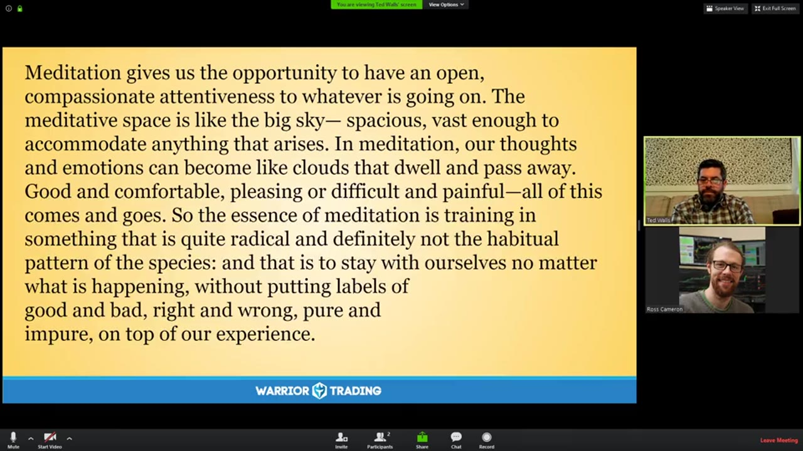

**图怎么看：**

- 这张图片展示了一段关于冥想好处的文字，强调了冥想在提高自我意识方面的作用。
- 图片中的文字提到冥想可以帮助人们培养更深层次的自我接纳和理解。
- 图片下方显示了“WARRIOR TRADING”字样，可能表明这是与冥想相关的培训课程的一部分。
- 图片中间部分展示了一条穿过竹林的小路，象征着冥想带来的宁静和平静的感觉。

### 关键内容

- 冥想是提高自我意识的最佳工具，有助于培养更深层次的自我接纳。
- 通过冥想，可以学会在情绪反应中保持冷静，从而更好地应对生活中的挑战。
- 冥想可以帮助我们更清晰地看到自己的情绪和思维，从而更好地理解自己。
- 冥想可以培养出坚定、清晰的视野、勇气和注意力等品质。
- 通过冥想，可以培养出对生活的开放态度，接受生活中的不确定性和变化。
- 冥想可以带来深刻的洞察力，但不应过分强调这些体验，以免产生骄傲和自满。
- 冥想需要持续的耐心和练习，才能逐渐培养出这种内在的平静和智慧。
- 冥想可以让我们学会放下过去的痛苦，拥抱当下的美好，但不应过于执着。
- 冥想可以让我们学会接受生活中的不确定性，从而更好地适应变化。

### 分析与执行顺序

1. 讲师首先介绍了冥想的基本概念和重要性，强调了冥想对于提高自我意识的作用。
2. 然后，讲师分享了如何进行冥想的具体步骤，包括呼吸、放松身体和心灵。
3. 接着，讲师通过引用书籍和故事，进一步阐述了冥想的益处和实践方法。
4. 最后，讲师总结了冥想的五个主要好处，并鼓励听众尝试冥想来改善生活。
5. 在整个过程中，讲师多次强调了冥想的实践性和持续性，以及它带来的深刻变化。

### 案例与细节

- 讲师提到，通过冥想可以学会在情绪反应中保持冷静，从而更好地应对生活中的挑战。
- 讲师引用了Pema Chodron的书《如何冥想》，强调了冥想对于提高自我意识的重要性。
- 讲师分享了一个关于Shemu Suzuki的故事，说明了通过冥想可以培养出内在的平静。
- 讲师提到了一个禅宗的咒语，强调了接受生活现状的重要性。
- 讲师分享了自己在冥想中的经历，说明了冥想可以带来内心的平静和清晰。

### 风险与边界

- 由于录制于2020年，当前的市场环境和心理状态可能与当时有所不同。
- 冥想的效果因人而异，有些人可能需要更长时间才能感受到明显的变化。
- 过度强调冥想带来的深刻变化可能会导致期望值过高，从而产生失望感。
- 冥想需要持续的练习和耐心，否则可能无法达到预期的效果。

### 复盘问题

- 冥想的主要好处有哪些？
- 如何通过冥想来提高自我意识和应对生活中的挑战？
- 冥想需要哪些基本步骤？
- 冥想可以带来哪些深刻的洞察力？
- 如何在日常生活中实践冥想？

---

## v0913：调频到当下体验

> 日期：2020　·　时长：00:54:42

**本场重点：** 通过冥想练习，学会调频到当下体验，培养自我接纳和慈悲心。

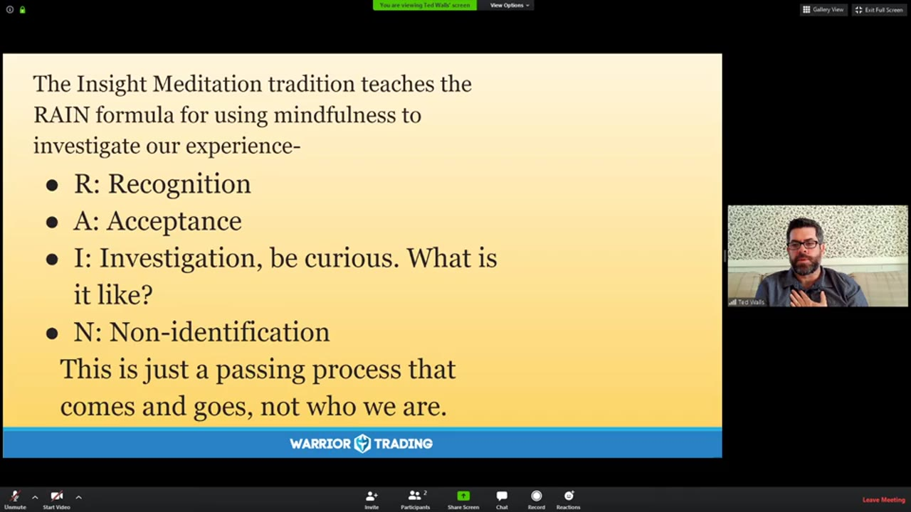

**图怎么看：**

- The Insight Meditation tradition teaches the RAIN formula for using mindfulness to investigate our experience.
- R: Recognition, A: Acceptance, I: Investigation, N: Non-identification.
- This is just a passing process that comes and goes, not who we are.

### 关键内容

- 讲师引用了Tara Brock的观点，强调无条件地爱自己是最重要的疗愈方式。
- 通过一系列问题帮助学员检查自己的思维状态，包括情绪、身体感觉和思想质量。
- 强调在冥想过程中，要以慈悲和好奇心对待自己，而不是试图关闭所有思绪。
- 通过呼吸练习，逐步引导学员进入当下体验，放松身心。
- 鼓励学员在日常生活中保持这种自我接纳和慈悲心的态度。
- 分享了Pema Chodron的书籍《如何冥想》中的指导原则，帮助学员更好地进入当下。
- 通过David White的诗歌，进一步强调了从当下开始的重要性。
- 强调了自我接纳和慈悲心的重要性，帮助学员更好地面对内心的挑战。
- 通过具体的例子，展示了如何在交易中应用这些理念，提高交易表现。
- 提醒学员在交易中保持专注，避免过度比较和自我批评，回归自我接纳。

### 分析与执行顺序

1. 讲师首先引用了Tara Brock的观点，强调无条件地爱自己是最重要的疗愈方式。
2. 然后分享了Pema Chodron的书籍《如何冥想》中的指导原则，帮助学员更好地进入当下。
3. 接着通过一系列问题引导学员检查自己的思维状态，包括情绪、身体感觉和思想质量。
4. 通过呼吸练习，逐步引导学员进入当下体验，放松身心。
5. 最后，通过David White的诗歌，进一步强调了从当下开始的重要性，鼓励学员保持自我接纳和慈悲心。

### 案例与细节

- 讲师提到，当情绪出现时，要以慈悲和好奇心对待它们，而不是试图命名或回忆历史。
- 通过呼吸练习，学员可以感受到身体的放松，以及思想的逐渐平静。
- 学员分享了在交易中应用这些理念的具体例子，如减少心率，保持冷静。
- 讲师提到，通过自我接纳和慈悲心，可以帮助学员更好地应对内心的挑战。
- 学员分享了在日常生活中保持这种自我接纳和慈悲心的态度，如在早晨冥想。

### 风险与边界

- 由于录制于2020年，部分指导原则可能需要根据当前市场环境进行调整。
- 交易市场的变化可能导致某些策略不再适用，需要持续学习新的市场动态。
- 自我接纳和慈悲心的练习需要长期坚持，短期内可能看不到明显效果。
- 在交易中保持专注，避免过度比较和自我批评，这需要高度自律。

### 复盘问题

- 在冥想前，您是如何检查自己的思维状态的？
- 在交易中，您是如何应用自我接纳和慈悲心的理念的？
- 您在日常生活中是如何保持自我接纳和慈悲心的态度的？
- 您在交易中遇到过哪些挑战，是如何克服的？
- 您认为哪些因素对您的交易表现影响最大？

---

## v0914：保持当下

> 日期：2020　·　时长：00:58:29

**本场重点：** 保持当下是减少情绪波动的关键，通过冥想和自我关怀来实现。

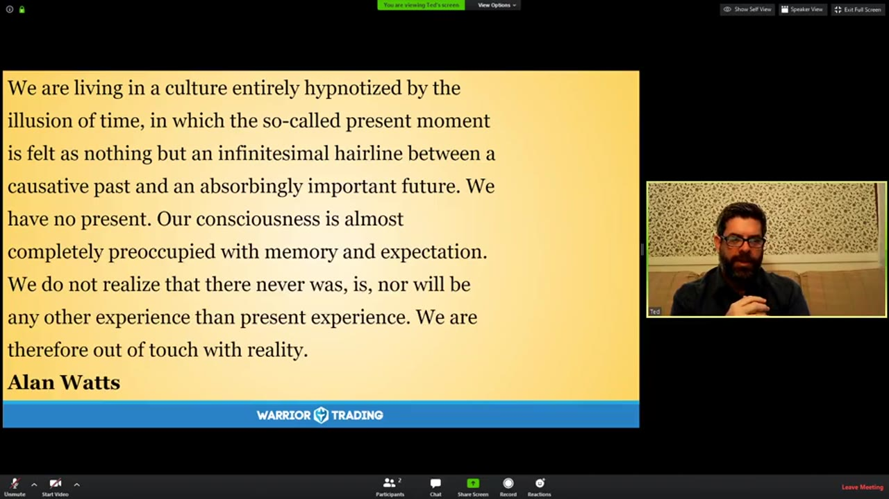

**图怎么看：**

- 这张图片展示了一位讲师在进行一场关于如何保持当下的讲座。
- 图片中的文字强调了保持当下对于减少情绪波动的重要性，并提到了冥想和自我关怀作为实现这一目标的方法。
- 背景中的风景图片可能用于增强演讲内容的视觉吸引力，帮助听众更好地理解和感受主题。
- 整体来看，这张图片符合本场的重点，提供了具体的教学信息和实践建议。

### 关键内容

- 保持当下有助于减少情绪波动，提高决策质量。
- 通过冥想和自我关怀，可以更好地应对不确定性。
- 过度关注过去和未来会导致焦虑和压力。
- 保持当下需要练习和耐心。
- 冥想可以帮助人们更好地连接到当下的体验。
- 保持当下有助于减少对未来的恐惧和对过去的遗憾。
- 通过练习非抵抗，可以更好地接受现实。
- 保持当下需要放下对完美状态的追求。
- 保持当下有助于减轻情感负担，提高生活质量

### 分析与执行顺序

1. 分享 Joko Beck 的名言，强调保持当下的重要性。
2. 通过冥想引导观众进入当下，感受呼吸和身体的细微变化。
3. 解释如何通过呼吸和自我关怀来缓解情绪紧张。
4. 分享其他名言，进一步强调保持当下的好处。
5. 回答观众的问题，解释如何在日常生活中实践保持当下

### 案例与细节

- “我们工作时，经常处于极度情绪反应的状态，通过保持当下，我们可以更好地转向自己，用爱和接纳来对待自己。”
- “比如，当我们在交易中遇到困难时，可以通过保持当下来缓解情绪紧张。”
- “通过冥想，我们可以更好地连接到当下的体验，从而更好地应对不确定性。”
- “保持当下需要练习和耐心，就像我们每天都在做的那样。”
- “通过练习非抵抗，我们可以更好地接受现实，而不是试图逃避它。”

### 风险与边界

- 保持当下的方法需要长期练习，短期内可能看不到明显效果。
- 过度依赖冥想可能会导致对现实生活中的活动产生疏离感。
- 在当前的市场环境下，保持当下的方法可能无法完全避免市场波动带来的影响。
- 录制年代限制意味着这些方法可能需要根据当前市场环境进行调整。
- 保持当下的方法可能不适合所有人，特别是那些有严重心理问题的人

### 复盘问题

- 保持当下的方法有哪些具体的练习步骤？
- 如何在日常生活中更好地实践保持当下？
- 保持当下的方法是否适用于所有类型的交易者？

---

## v0915：交易中的正念练习

> 日期：2020　·　时长：00:49:21

**本场重点：** 通过正念练习，识别并接纳内心的情绪，从而改善交易表现。

**图怎么看：**

- 通过正念练习，识别并接纳内心的情绪，从而改善交易表现。
- 在图片中，一个宁静的自然景观作为背景，可能象征着内心的平静。
- 右下角的小窗口显示了一位正在进行正念练习的人，这与本场的重点相吻合。
- 图片下方有“Warrior Trading”的标志，表明这是一个与交易相关的正念练习课程。

### 关键内容

- 讲师分享了正念练习的重要性，指出它可以帮助交易者识别并接纳内心的情绪。
- 通过正念练习，可以更好地理解自己的情绪，并将其转化为积极的行动。
- 正念练习有助于识别情绪的根源，从而采取更有效的应对策略。
- 正念练习可以减少自我批评，提高自我接纳的能力。
- 正念练习有助于识别身体内的紧张感，并通过呼吸放松来缓解。
- 正念练习可以促进内心的平静，帮助交易者更好地集中注意力。
- 正念练习可以提高自我意识，帮助交易者更好地了解自己的情绪。
- 正念练习可以促进自我接纳，帮助交易者更好地面对自己的弱点。
- 正念练习可以提高交易者的整体表现，帮助他们更好地应对市场波动。
- 正念练习可以提高交易者的心理韧性，帮助他们在压力下保持冷静

### 分析与执行顺序

1. 讲师首先介绍了正念练习的目的，即识别并接纳内心的情绪。
2. 然后，讲师引导参与者进行正念练习，包括呼吸练习和身体扫描。
3. 接着，讲师指导参与者识别并命名自己的情绪，以更好地理解它们。
4. 随后，讲师引导参与者将情绪转移到心脏区域，以促进内心的温暖和接纳。
5. 最后，讲师总结了正念练习的效果，强调其对交易者情绪管理的重要性。
6. 在整个过程中，讲师不断强调自我接纳和自我同情的重要性。
7. 讲师还分享了一些具体的正念练习方法，如呼吸练习和身体扫描

### 案例与细节

- 讲师提到，正念练习可以帮助识别情绪的根源，例如愤怒可能源于过去的创伤经历。
- 参与者分享了在正念练习中识别到的情绪，如紧张、焦虑和恐惧。
- 讲师举例说明，通过正念练习，可以识别并接受自己的弱点，如过度交易或冲动交易。
- 参与者分享了在正念练习中感受到的身体紧张感，如紧绷的肩膀和颈部。
- 讲师提到，正念练习可以帮助识别并接受自己的情绪，即使这些情绪是负面的，如愤怒和悲伤。
- 参与者分享了在正念练习中感受到的内心温暖和接纳，如将情绪转移到心脏区域

### 风险与边界

- 正念练习的效果因人而异，有些人可能难以立即感受到效果。
- 正念练习需要持续练习，否则效果可能会减弱。
- 正念练习可能不适合所有交易者，特别是那些有严重心理问题的人。
- 正念练习的效果受到录制年代的限制，现代交易环境可能与当时有所不同。
- 正念练习可能需要与其他心理疗法结合使用，才能达到最佳效果

### 复盘问题

- 正念练习的具体步骤是什么？
- 正念练习如何帮助识别情绪的根源？
- 正念练习如何促进自我接纳和自我同情？
- 正念练习对交易者的情绪管理有何具体帮助？
- 正念练习是否适用于所有类型的交易者？

---
