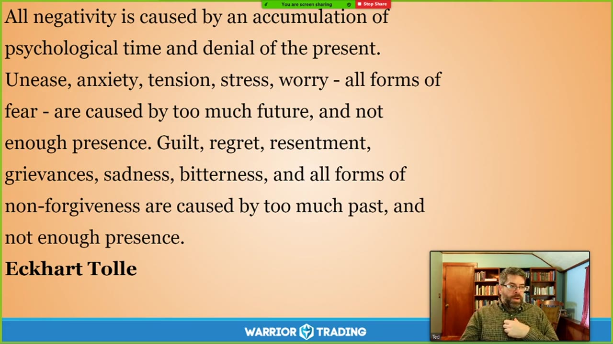
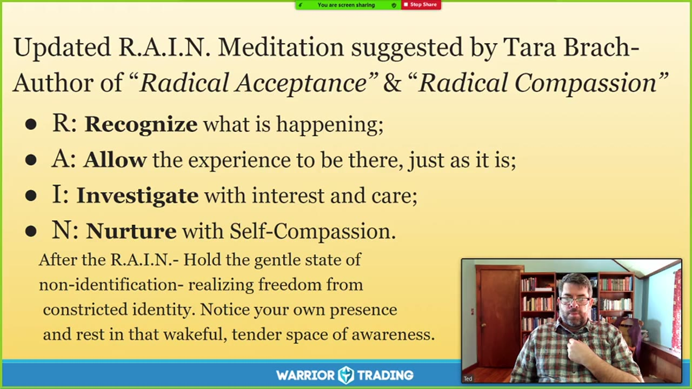

# Mindful Monday：2021

> 17 场，合计 13.5 小时。返回 [Mindful Monday 目录](../README.md)。

## v0916：Mindful Monday 开年第一课

> 日期：2021-01-04　·　时长：00:47:11

**本场重点：** 本课程强调通过冥想和正念练习来管理情绪，提高交易表现。重点在于自我接纳和慈悲对待自己。

**图怎么看：**

- Mindfulness is comprised of three key elements: Awareness, Attention, and Intention.
- Awareness: the underlying ground of consciousness that encompasses all of our thoughts, emotional states, and sensory experience.
- Attention: the mental focus that discriminates, selects, and holds information in our awareness. (What we choose to see as foreground and background).
- Intention: the guiding principles by which we aspire to move through the world (i.e., meeting ourselves and others with loving kindness, compassion, and acceptance).

### 关键内容

- 课程开始时，讲师介绍了正念的概念，强调在交易中保持当下意识的重要性。
- 通过冥想练习，可以培养对自身情绪和思维的非评判性观察。
- 正念练习有助于缓解交易中的焦虑和压力，提高交易表现。
- 课程中提到了正念的三个关键要素：意识、注意力和意图。
- 正念可以帮助交易者更好地处理内心的冲突，进入流动状态。
- 正念练习包括非评判性观察、耐心、初学者心态等七个态度基础。
- 通过练习正念，可以改善交易心理，提高决策质量。
- 课程强调了正念练习对于提高交易表现的重要性，但并非保证成功。
- 正念练习需要时间和持续的努力，才能看到明显的效果。
- 正念练习有助于交易者更好地应对市场波动和情绪波动

### 分析与执行顺序

1. 课程开始时，讲师带领大家进行了一次简短的冥想练习。
2. 通过呼吸练习，帮助大家放松身心，进入更加平静的状态。
3. 讲师引导大家观察自己的思绪和情绪，学会以慈悲的心态对待自己。
4. 通过正念练习，逐步培养出对内心世界的更深层次理解。
5. 课程中提到了正念的三个关键要素，并逐一进行了讲解。
6. 最后，讲师分享了一些正念练习的具体方法，如感恩冥想和雨滴冥想

### 案例与细节

- 课程中提到了正念练习可以帮助交易者更好地应对市场波动和情绪波动，例如，当交易者感到焦虑或愤怒时，可以通过正念练习来缓解这些情绪。
- 讲师提到，正念练习可以帮助交易者更好地处理内心的冲突，例如，当交易者感到沮丧或悲伤时，可以通过正念练习来接受这些情绪。
- 新增条目，例如，当交易者感到焦虑或愤怒时，可以通过正念练习来缓解这些情绪，通过呼吸练习和自我观察，逐步学会以慈悲的心态面对自己的情绪，从而更好地管理交易中的情绪波动。

### 风险与边界

- 正念练习需要时间和持续的努力，才能看到明显的效果，否则可能会感到失望。
- 正念练习并非适用于所有人，有些人可能难以坚持练习。
- 正念练习的效果会受到个人差异的影响，不同的人可能会有不同的体验。
- 正念练习的效果会受到市场环境的影响，市场波动可能会干扰练习效果。

### 复盘问题

- 正念练习如何帮助交易者更好地应对市场波动和情绪波动？
- 正念练习的三个关键要素是什么？
- 正念练习的七个态度基础分别是什么？

---

## v0917：交易心理与冥想

> 日期：2021-01-11　·　时长：00:51:42

**本场重点：** 通过冥想改善交易心理，提高情绪管理能力，增强自我接纳。

**图怎么看：**

- 通过冥想，我们能够培养出一种开放、慈悲且专注的态度，无论外界发生什么，都能保持内心的平静。
- 冥想中的思维和情感如同云朵般飘过，它们可以是美好的，也可以是痛苦的，但都是暂时的。
- 冥想的本质在于训练自己在任何情况下都保持无条件的接纳，不带任何标签地面对生活的变化。
- 通过冥想，我们可以学会更加开放和接受生活的起伏，从而在面对困难时保持内心的平和与放松。

### 关键内容

- 冥想有助于培养自我接纳的态度，面对情绪波动时保持冷静。
- 通过冥想可以更好地理解自己的情绪反应，从而做出更合理的决策。
- 冥想能够帮助交易者建立更强的专注力，减少冲动交易。
- 冥想有助于提高情绪调节能力，减少过度反应。
- 冥想能够帮助交易者更好地接受生活中的不确定性。
- 冥想可以提高交易者的自我意识，更好地理解自己的行为模式。
- 冥想有助于培养交易者的耐心和毅力，提高自律。
- 冥想能够帮助交易者更好地处理失败和挫折，增强心理韧性。
- 冥想可以提高交易者的整体生活质量，减少压力和焦虑。

### 分析与执行顺序

1. 讲师首先分享了Pema Chodron的观点，指出冥想的重要性。
2. 然后带领听众进行了一段简短的冥想练习，帮助大家放松。
3. 接着讲解了冥想的五个好处：坚定性、清晰视野、勇气、注意力和无大不了。
4. 最后通过实例说明如何将这些好处应用到实际交易中。
5. 在整个过程中，讲师强调了冥想对情绪管理和自我接纳的重要性。

### 案例与细节

- 在一次糟糕的交易决策后，通过冥想来处理羞愧和后悔的情绪。
- 通过冥想练习，发现自己的计划思维总是无法停止，甚至在小事上也是如此。
- 在面对情绪波动时，通过冥想练习学会更加温和地对待自己。
- 通过冥想练习，发现自己的情绪反应模式，并设法改变。
- 通过冥想练习，学会更加耐心地等待市场机会的到来。

### 风险与边界

- 冥想的效果因人而异，有些人可能难以坚持。
- 冥想需要时间和持续练习才能见效。
- 交易市场的变化可能导致冥想技巧的应用效果降低。
- 录制年代较远，当前市场环境可能有所不同。

### 复盘问题

- 冥想练习的具体步骤是什么？
- 如何将冥想的好处应用到实际交易中？
- 冥想对情绪管理有哪些具体帮助？

---

## v0918：Mindful Monday：调和情绪与专注

> 日期：2021-01-25　·　时长：00:47:26

**本场重点：** 通过冥想和自我关怀，平衡情绪波动，提高交易专注度。注意，此内容基于2021年的录制。

**图怎么看：**

- 这位讲师正在使用屏幕共享功能，可能是在进行一场关于情绪管理和专注力提升的直播课程。
- 屏幕上显示的自然风景画为观众提供了一个宁静的背景，有助于放松和集中注意力。
- 讲师似乎正在进行一段关于如何通过冥想和自我关怀来平衡情绪波动并提高交易专注度的讲解。
- 视频右下角的小窗口显示了讲师的实时反应，表明他正在与观众互动，分享个人经验或建议。

### 关键内容

- 讲师分享了Tara Brock的名言，强调无条件地爱自己。
- 介绍了Carl Rogers的“无条件积极关注”概念，强调自我接纳。
- 通过呼吸练习，引导学员进入当下，体验自我接纳。
- 强调了系统一和系统二的概念，帮助理解情绪管理的重要性。
- 介绍了雨滴冥想（Rain Meditation）的四个步骤：认识、接受、调查和培养。
- 讲解了如何通过自我关怀来缓解情绪波动，提高交易表现。
- 提醒学员在忙碌的工作中找到平衡点，避免过度劳累。
- 强调了自我接纳的重要性，鼓励学员探索内心深处的原因。
- 指出雨滴冥想可以反复练习，帮助学员更好地管理情绪。
- 讲师提到Moana电影中的角色，强调自我接纳的重要性

### 分析与执行顺序

1. 讲师分享名言，引入主题。
2. 介绍Carl Rogers的理论，强调自我接纳的重要性。
3. 指导学员进行呼吸练习，进入当下。
4. 通过提问引导学员认识自己的情绪和身体感受。
5. 介绍雨滴冥想的四个步骤：认识、接受、调查和培养。
6. 鼓励学员在日常生活中实践自我关怀，保持平衡。
7. 总结雨滴冥想的好处，强调其灵活性和实用性

### 案例与细节

- 讲师提到Tara Brock的名言：“最强大的治愈来自于简单地意图无条件地爱你自己。”
- 通过呼吸练习，学员感受到身体的放松，情绪得到缓解。
- 学员分享自己在工作中遇到的压力，通过自我关怀得到了缓解。
- 雨滴冥想的一个步骤是接受，学员表示接受了自己的一些负面情绪。
- 讲师引用Moana电影中的角色Mr. Miyagi，强调自我接纳的重要性。
- 学员提到自己在交易中遇到的情绪波动，通过自我关怀得到了控制

### 风险与边界

- 此内容基于2021年的录制，可能不适用于当前市场环境。
- 自我关怀需要持续练习，否则效果可能不佳。
- 过度依赖自我关怀可能会忽视外部因素的影响。
- 雨滴冥想虽然有效，但需要结合实际情况灵活运用

### 复盘问题

- 讲师分享的Tara Brock名言对你有何启发？
- 你如何在日常生活中实践自我关怀？
- 雨滴冥想的四个步骤如何帮助你管理情绪？

---

## v0919：Mindful Monday：保持当下

> 日期：2021-02-01　·　时长：00:44:51

**本场重点：** 保持当下可以减少情绪波动，提高决策质量。但需要持续练习。

**图怎么看：**

- 所有负面情绪都是由心理时间的积累和否认当下造成的。
- 焦虑、紧张、压力、担忧——所有形式的恐惧都源于过多的未来和不足的当下。
- 内疚、后悔、怨恨、怨言、悲伤、痛苦——所有非原谅的形式都源于过多的过去和不足的当下。
- 这些描述强调了当下意识的重要性，以及如何通过保持当下来减少负面情绪和提高决策质量。

### 关键内容

- 保持当下有助于减少情绪波动，提高决策质量。
- 过度关注过去或未来会导致情绪困扰。
- 通过练习，可以更容易地回到当下。
- 无条件正面关怀有助于自我接纳。
- 疼痛是不可避免的，但如何处理它决定了是否继续痛苦。
- 避免痛苦会让我们陷入更大的痛苦之中。
- 保持当下需要持续练习。
- 无条件正面关怀有助于减少负面情绪。
- 冥想可以帮助我们更好地面对情绪。
- 保持当下有助于减少对过去的执着和对未来的担忧

### 分析与执行顺序

1. 分享Joko Beck的禅宗格言，强调活在当下。
2. 引导听众进行冥想练习，注意呼吸。
3. 提醒听众在日常生活中保持当下的重要性。
4. 解释无条件正面关怀的概念及其实践方法。
5. 通过引用其他作家的观点，进一步强调保持当下的重要性

### 案例与细节

- “我们是生活在被时间幻觉完全催眠的文化中，在这种文化里，所谓的现在只是因果过去的微小间隔和吸收未来的微小间隔。”
- “我们没有现在。我们的意识几乎完全被记忆和期望所占据。”
- “我们都在幻想中度过生活，我们思考已经发生的事情，可能发生的事情，我们如何看待这些事情，我们应该如何改变，其他人应该如何改变，所有这些都是幻想。”
- “我们试图摆脱那些东西，但它们仍然影响着我们，即使我们没有意识到。”

### 风险与边界

- 录制年代限制，信息可能不再适用于当前市场环境。
- 无条件正面关怀的概念可能需要结合个人实际情况灵活应用。
- 保持当下的练习需要时间和持续的努力。
- 过度依赖过去的经验可能会导致决策失误。
- 情绪波动可能会影响交易决策

### 复盘问题

- 在实际交易中，如何更好地保持当下？
- 无条件正面关怀如何帮助我们在面对困难时保持冷静？
- 冥想练习如何帮助我们更好地应对情绪波动？

---

## v0920：自我友好的重要性

> 日期：2021-02-08　·　时长：00:44:28

**本场重点：** 在交易中保持冷静，通过自我友好来应对情绪波动，提高交易表现。

**图怎么看：**

- 这张图片展示了一位讲师在分享关于自我友好的重要性的信息。
- 图片中的文字强调了自我友好的行为如何影响个人对世界的体验，并且这种行为可以转化为对他人的关爱。
- 图片还提到了在交易中保持冷静的重要性，通过自我友好的方式来应对情绪波动，从而提高交易表现。
- 图片下方的“Warrior Trading”标志表明这可能是一个与交易相关的课程或讲座。

### 关键内容

- 自我友好是对待自己如同对待朋友，减少情绪波动。
- 通过自我友好可以更好地处理交易中的压力和情绪。
- 自我友好有助于减少交易中的冲动行为，如FOMO或报复性交易。
- 自我友好可以提高交易决策的质量，减少情绪驱动的错误。
- 自我友好需要练习，通过日常行为培养。
- 自我友好有助于建立更深层次的自我接纳。
- 自我友好可以减少交易中的焦虑和恐惧。
- 自我友好需要结合诚实和清晰的自我认知。
- 自我友好可以改善交易规则的遵守情况。
- 自我友好可以促进交易中的正向思维和情绪管理

### 分析与执行顺序

1. 分享Pema Chodron的名言，强调自我友好的重要性。
2. 介绍自我友好的概念，即对待自己如同对待朋友。
3. 指导参与者进行简单的冥想练习，以体验自我友好的感觉。
4. 讨论如何在交易中应用自我友好的原则，减少情绪驱动的决策。
5. 分享具体的例子，说明自我友好如何帮助交易者更好地应对市场波动。
6. 强调自我友好的持续练习和培养的重要性。
7. 鼓励参与者在日常生活中实践自我友好，以改善交易表现

### 案例与细节

- 一个交易者在交易中遇到连续亏损，通过自我友好，他能够冷静下来，分析原因，而不是立即放弃。
- 另一个交易者在面对市场波动时感到焦虑，通过自我友好，他能够保持冷静，做出更理性的决策。
- 一位交易者在交易中遇到挫折，通过自我友好，他能够接受失败，并从中学习，而不是陷入消极情绪。
- 一个交易者在交易中遇到情绪波动，通过自我友好，他能够更好地控制自己的情绪，避免冲动交易。
- 一位交易者在交易中遇到压力，通过自我友好，他能够找到放松的方法，从而更好地应对市场波动

### 风险与边界

- 自我友好的效果因人而异，需要持续练习。
- 过度依赖自我友好可能会忽视实际问题的存在。
- 自我友好不能替代专业的心理辅导。
- 录制年代限制可能影响某些策略的有效性。
- 自我友好的效果可能受到市场环境的影响

### 复盘问题

- 在交易中，你是如何应用自我友好的原则来应对情绪波动的？
- 你认为自我友好对你的交易表现有何具体影响？
- 你能否分享一个自我友好帮助你克服交易挑战的例子？

---

## v0921：自我探究与慈爱存在

> 日期：2021-02-22　·　时长：00:48:38

**本场重点：** 通过自我探究与慈爱存在，帮助交易者更好地处理情绪，提高交易决策的质量。

**图怎么看：**

- 这张图片展示了一个关于自我探索和慈悲存在的主题，强调了在交易过程中如何通过自我反省来提高决策质量。
- 图片中的文字引用了Jack Kornfield和Ron Kurtz的观点，鼓励人们观察自己的经历而不受干扰，并允许事情自然发生。
- 背景中的风景图片可能象征着内心的平静和对外部世界的洞察力，有助于交易者在复杂市场环境中保持冷静和智慧。
- 整体内容旨在通过冥想和自我反思来提升交易者的心理韧性，从而做出更明智的交易决策。

### 关键内容

- 讲师分享了David White的诗歌《够了》，强调了当下的重要性。
- 通过冥想开始课程，帮助参与者进入更深层次的自我探究。
- 自我探究与慈爱存在是处理情绪的关键方法，有助于提高交易决策质量。
- 通过自我探究，可以识别并接受内心的评判声音。
- 慈爱存在意味着以温暖和同情的态度对待自己，而不是苛责。
- 通过练习，可以培养对情绪的更深层次理解，从而做出更好的决策。
- 自我探究与慈爱存在有助于处理愤怒等负面情绪，而不是简单地压抑它们。
- 通过练习，可以建立对情绪的更深层次理解，从而做出更好的决策。
- 自我探究与慈爱存在有助于处理过去的创伤，而不是简单地逃避它们。

### 分析与执行顺序

1. 讲师首先分享了一首诗歌，引导参与者进入冥想状态。
2. 参与者被邀请闭上眼睛，开始呼吸练习，放慢内心节奏。
3. 参与者被指导观察自己的思维、情绪和身体感受，以温暖和同情的态度对待自己。
4. 参与者被指导将注意力转向呼吸，体验呼吸的细微感觉。
5. 参与者被指导观察身体中的紧张和压力，并用温暖和同情对待这些感受。
6. 参与者被指导将慈爱和善意扩展到整个世界，然后回到内心深处。

### 案例与细节

- 参与者提到了有时会对自己在冥想中的表现进行评判。
- 参与者提到了在面对焦虑时，尝试保持专注。
- 参与者提到了在面对愤怒时，尝试理解其背后的原因。
- 参与者提到了在面对过去的创伤时，尝试接受和理解。
- 参与者提到了在面对自我期望时，尝试调整目标。

### 风险与边界

- 录制于2021年，部分信息可能不再适用。
- 自我探究与慈爱存在需要长期练习，短期内效果有限。
- 情绪管理技巧的有效性因人而异，需个体化实践。
- 市场环境不断变化，情绪管理策略需灵活调整。

### 复盘问题

- 在自我探究过程中，参与者遇到了哪些主要的情绪挑战？
- 如何通过慈爱存在来缓解这些情绪挑战？
- 在实际交易中，如何将自我探究与慈爱存在的技巧应用到决策过程中？

---

## v0922：新手心态与市场适应

> 日期：2021-03-01　·　时长：00:48:06

**本场重点：** 解决新手心态带来的市场适应问题，核心结论是保持开放心态和自我反思，适用边界为交易新手。

**图怎么看：**

- 这张图片展示了一位讲师在分享关于新手心态与市场适应的内容。
- 图片中有两段引用，分别来自Shunryu Suzuki，强调了新手心态的重要性。
- 第一段引用强调了'新手心态'（Shoshin）意味着开放和准备接受一切可能性。
- 第二段引用进一步解释了新手心态在禅宗实践中的重要性，以及它如何帮助人们看到事物的本质并实现自我觉醒。

### 关键内容

- 新手心态有助于保持开放和灵活，面对市场的不确定性。观察到交易新手往往缺乏对市场变化的适应能力，而新手心态能够帮助他们更好地应对市场波动。
- 通过自我反思识别并调整错误信念，提高交易表现。新手心态鼓励交易者反思自己的交易策略和信念，从而发现并修正错误，提高交易表现。
- 新手心态强调接受不确定性，而不是试图预测未来。市场总是充满不确定性，新手心态帮助交易者接受这一点，而不是试图预测未来的走势。
- 保持开放心态可以减少过度控制和情绪反应，提高决策质量。新手心态鼓励交易者保持开放心态，避免过度控制，减少情绪反应，从而提高决策质量。
- 新手心态鼓励尝试新策略，而不是固守旧有模式。新手心态鼓励交易者不断尝试新的交易策略，而不是固守旧有的模式，从而提高交易表现。
- 新手心态促进自我接纳，减少自我批评，提高心理韧性。新手心态帮助交易者接纳自己，减少自我批评，从而提高心理韧性，更好地应对市场波动。
- 新手心态帮助交易者更好地应对市场波动，减少情绪化决策。新手心态能够帮助交易者保持冷静，减少情绪化决策，从而更好地应对市场波动。
- 新手心态强调接受损失，而不是逃避损失，提高心理承受能力。新手心态鼓励交易者接受损失，而不是逃避损失，从而提高心理承受能力。
- 新手心态鼓励交易者从失败中学习，而不是逃避失败。新手心态帮助交易者从失败中吸取教训，而不是逃避失败，从而提高交易表现。
- 新手心态促进交易者建立内在纪律，提高交易表现。新手心态鼓励交易者建立内在纪律，从而提高交易表现，更好地适应市场变化

### 分析与执行顺序

1. 讲师首先介绍新手心态的概念，强调其重要性。通过定义新手心态，帮助参与者理解其意义。
2. 然后引导参与者进行冥想练习，以体验新手心态。通过冥想练习，帮助参与者体验新手心态带来的开放和灵活。
3. 接着讲解如何通过新手心态适应市场变化，保持灵活性。通过实例说明新手心态如何帮助交易者更好地适应市场变化。
4. 最后分享实例，说明新手心态如何帮助交易者应对市场波动。通过具体案例，进一步说明新手心态的应用。
5. 讲师通过提问，引导参与者思考如何将新手心态应用到实际交易中。通过提问，帮助参与者将理论转化为实践

### 案例与细节

- 当市场出现意外波动时，新手心态可以帮助交易者保持冷静，而不是做出冲动的决策。例如，一位交易者在遇到市场突然下跌时，通过新手心态保持冷静，而不是立即卖出，从而避免了不必要的损失。
- 一位交易者在遇到连续亏损后，通过新手心态反思自己的交易策略，最终调整了策略并取得了成功。例如，这位交易者在连续亏损后，通过新手心态反思自己的交易策略，发现了一些错误，并及时调整了策略，最终取得了成功。
- 一位新手交易者在面对市场不确定性时，通过新手心态保持开放态度，从而更好地适应市场变化。例如，这位交易者在面对市场不确定性时，通过新手心态保持开放态度，从而更好地适应市场变化，减少了情绪化决策。
- 一位交易者在遇到情绪化决策时，通过新手心态反思自己的情绪反应，从而减少情绪化决策的影响。例如，这位交易者在遇到情绪化决策时，通过新手心态反思自己的情绪反应，从而减少情绪化决策的影响，提高了决策质量

### 风险与边界

- 新手心态可能会导致过度乐观，忽视市场风险。例如，在市场稳定期，新手心态可能导致交易者过于乐观，忽视潜在的风险。
- 新手心态可能导致过度依赖新手心态，忽视其他重要因素。例如，交易者可能过于依赖新手心态，而忽视了其他重要的市场因素，如宏观经济数据和政策变化。
- 新手心态可能在市场快速变化时显得不足，需要结合其他应对措施。例如，在市场快速变化时，新手心态可能不足以应对突发情况，需要结合其他应对措施，如技术分析和风险管理。
- 新手心态可能在某些特定市场环境下效果不佳，需要根据实际情况调整。例如，在某些特定市场环境下，新手心态可能效果不佳，需要根据实际情况调整，如高波动率市场和低流动性市场。
- 新手心态可能在市场稳定期效果不佳，需要结合其他策略。例如，在市场稳定期，新手心态可能效果不佳，需要结合其他策略，如技术分析和风险管理

### 复盘问题

- 新手心态如何帮助交易者更好地适应市场变化？
- 如何通过新手心态识别并调整错误信念？
- 新手心态在哪些情况下可能效果不佳？

---

## v0923：面对恐惧的心理策略

> 日期：2021-03-08　·　时长：00:47:08

**本场重点：** 本视频探讨了如何通过自我同情和正念来应对交易中的恐惧，强调了耐心和自我接纳的重要性。

**图怎么看：**

- R: Recognize what is happening;
- A: Allow the experience to be there, just as it is;
- I: Investigate with interest and care;
- N: Nurture with Self-Compassion.

### 关键内容

- 恐惧会打断交易者的流畅状态，导致冲动和犹豫。
- 通过正念和自我同情，可以更好地理解并处理恐惧情绪。
- 恐惧源于内在的脆弱和痛苦，需要温柔地对待自己。
- 通过正念练习，可以逐步缓解恐惧带来的紧张感。
- 恐惧是市场波动的一部分，需要学会与之共存。
- 交易者需要培养耐心，避免过度交易。
- 通过模拟交易，可以更好地理解并适应真实市场的变化。

### 分析与执行顺序

1. 首先，通过正念练习，识别当前的情绪状态。
2. 其次，探索恐惧的根源，了解其背后的脆弱性。
3. 然后，接受恐惧的存在，而不是试图逃避。
4. 接着，通过自我同情，温柔地对待自己。
5. 最后，通过正念练习，逐步缓解恐惧带来的紧张感

### 案例与细节

- 当交易者首次进入市场时，可能会经历一段时间的‘新手好运’，随后开始遭受损失。
- 交易者在面对恐惧时，可能会变得犹豫不决，甚至放弃整个过程。
- 交易者可以通过正念练习，如呼吸和冥想，来缓解恐惧带来的紧张感。
- 交易者在面对恐惧时，可能会出现冲动交易或过度交易的行为。
- 交易者在模拟交易中，可以更好地理解并适应真实市场的变化，从而减少恐惧的影响

### 风险与边界

- 录制年代限制，信息可能不再适用于当前市场环境。
- 交易者需要根据当前市场情况调整策略。
- 恐惧会引发一系列负面情绪，需要温和地对待自己。
- 交易者需要识别并接受自己的恐惧，而不是试图逃避

### 复盘问题

- 交易者在面对恐惧时，通常会采取哪些行动？
- 如何通过正念练习来缓解恐惧带来的紧张感？
- 交易者如何识别并接受自己的恐惧？

---

## v0924：冷静专注：交易心理修炼

> 日期：2021-03-15　·　时长：00:49:08

**本场重点：** 交易中保持冷静专注，通过冥想练习来培养耐心和自我接纳，以应对市场波动。

**图怎么看：**

- 这张幻灯片详细介绍了Shamatha冥想的定义和实践方法，强调了在交易中保持冷静专注的重要性。
- 幻灯片上引用了Pema Chödrön的话，解释了Shamatha冥想如何帮助人们稳定思维，专注于当下，从而更好地应对市场波动。
- 幻灯片还提到了R.A.I.N.冥想法，这是Tara Brach提出的，旨在帮助人们在面对生活中的挑战时保持内心的平静和自我接纳。
- 这些内容都与本场的重点——交易中保持冷静专注，通过冥想练习来培养耐心和自我接纳，以应对市场波动——密切相关。

### 关键内容

- 冥想是交易心理修炼的重要工具，帮助交易者保持冷静专注。
- 通过冥想练习，可以更好地认识自己的情绪和思维模式。
- 交易者需要学会接受当前的情绪和想法，而不是试图立即改变它们。
- 冥想有助于识别和理解内心的冲突，促进自我接纳。
- 通过练习，可以逐步培养出更加平和的心态，减少市场波动带来的影响。
- 冥想可以帮助交易者更好地处理压力和焦虑，提高决策质量。
- 交易者需要认识到自己是天空，而情绪和想法只是天气。
- 通过练习，可以逐渐培养出更加平和的心态，减少市场波动带来的影响。

### 分析与执行顺序

1. 讲师首先介绍了冥想的基本概念，强调了它在交易心理修炼中的重要性。
2. 然后，讲师分享了一段关于如何通过冥想练习来培养耐心和自我接纳的指导。
3. 接着，讲师引导参与者进行了一段简短的呼吸冥想练习。
4. 最后，讲师总结了冥想练习的关键点，并鼓励参与者继续练习。
5. 整个过程包括理论讲解、实际操作和总结，旨在帮助交易者更好地管理情绪和思维。

### 案例与细节

- 讲师提到，通过冥想练习，可以更好地认识自己的情绪和思维模式。
- 讲师举例说，当市场出现波动时，交易者可能会感到焦虑和不安，但通过冥想练习，可以更好地控制这些情绪。
- 讲师指出，通过冥想练习，可以识别和理解内心的冲突，从而更好地处理压力和焦虑。
- 讲师分享了一个具体的例子，说明如何通过冥想练习来应对市场波动，保持冷静和专注。
- 讲师还提到了一个交易者的案例，说明通过冥想练习，可以更好地处理情绪和思维模式，从而提高交易表现。

### 风险与边界

- 由于录制年代较早，部分冥想技巧可能需要结合现代心理学理论进行调整。
- 市场环境的变化可能导致某些冥想技巧的效果减弱。
- 交易者需要根据自身情况灵活运用冥想技巧，避免过度依赖。
- 冥想练习需要持续进行，否则效果可能不明显。

### 复盘问题

- 冥想练习对交易者的情绪管理有何具体帮助？
- 如何将冥想练习融入日常交易流程中？
- 交易者在进行冥想练习时需要注意哪些事项？

---

## v0925：与恐惧为友

> 日期：2021-03-22　·　时长：00:49:26

**本场重点：** 恐惧是内心的挑战，通过正念和慈悲来面对它，可以减少其威胁性。

**图怎么看：**

- 尽管我们大多数人被深深的恐惧所影响，但我们大部分时候都避免直接探索它的本质。
- 因为不了解它的运作方式，它往往成为我们生活中潜意识的驱动力。
- 当恐惧出现时，无论是对痛苦的恐惧、对某些情感的恐惧、对失去的恐惧，甚至是对死亡的恐惧，冥想中的正念爱接纳练习邀请我们去探索和理解恐惧本身。
- 从这个充满爱和接纳的基础出发，我们可以做出一些有分辨力的明智选择。有时，退一步可能更明智，有时即使害怕也要前进。我们变得愿意承担一些风险，因为我们不再那么抗拒恐惧的感觉。我们学会了恐惧是可以接受的。

### 关键内容

- 恐惧是内心的一种情绪，常常被我们忽视或逃避。
- 通过正念练习，我们可以更深入地了解恐惧的本质。
- 恐惧是一种条件反射，可以通过正念练习逐渐变得可接受。
- 面对恐惧时，保持耐心和勇气至关重要。
- 恐惧会阻碍我们前进，但通过正念练习可以克服。
- 正念练习可以帮助我们更好地理解自己的恐惧。
- 恐惧可以转化为一种觉醒的状态，帮助我们更加警觉。
- 通过正念练习，我们可以学会接受自己的恐惧。
- 恐惧可以成为自由的门户，让我们更加信任和爱自己。
- 正念练习可以帮助我们更好地理解自己的情绪和思维

### 分析与执行顺序

1. 首先，通过正念呼吸练习，让自己放松。
2. 然后，观察自己的情绪和思维，识别恐惧的具体表现。
3. 接着，用慈悲的态度对待自己的恐惧，将其视为朋友。
4. 进一步，探索恐惧背后的原因，理解其深层含义。
5. 最后，通过正念练习，逐渐接受并放下恐惧。
6. 在整个过程中，保持耐心和勇气，不断挑战自我。
7. 通过正念练习，逐步建立对恐惧的信任感

### 案例与细节

- 在一次交易中，我感到害怕，但通过正念练习，我意识到这只是恐惧。
- 当我面对失败时，我会感到恐惧，但通过正念练习，我可以接受这种感觉。
- 在一次模拟交易中，我感到害怕，但通过正念练习，我学会了如何处理这种情绪。
- 当我面对市场波动时，我会感到恐惧，但通过正念练习，我可以保持冷静。
- 在一次交易中，我感到害怕，但通过正念练习，我学会了如何接受这种感觉

### 风险与边界

- 正念练习需要时间和耐心，否则可能无法有效减轻恐惧。
- 如果过度依赖正念练习，可能会忽视实际的市场风险。
- 正念练习的效果因人而异，有些人可能需要更长时间才能看到效果。
- 录制年代限制，正念练习的方法和效果可能随着时间有所变化

### 复盘问题

- 你在交易中遇到过哪些恐惧？
- 你是如何通过正念练习来面对这些恐惧的？
- 你认为正念练习对你的情绪管理有何帮助？

---

## v0926：Bodichita 的实践与交易中的应用

> 日期：2021-04-05　·　时长：00:49:00

**本场重点：** 通过 Bodichita 实践，我们可以更好地管理情绪反应，提高交易决策的质量。

**图怎么看：**

- Bodhichitta 是一个梵文词，翻译为“觉醒的心灵”，当我们进入一个开放、专注的意识状态时，即在我们自己的爱与同情心能力的基础上，我们正在激活 Bodhichitta。
- Bodhichitta 被描述为不可摧毁的、柔软的中心，能够容纳并转变我们最困难的经历。
- 愤怒是一个很好的例子。愤怒开始于一种紧绷感，你被吸引进去，然后失去控制。意识到自己被吸引住，认识到它已经抓住了你，越早意识到这一点，就越容易处理愤怒。
- 即使你已经经历了习惯性的愤怒循环——甚至破坏了东西，对人喊叫，走出房子留下一串痛苦——你仍然有可能坐下来，与自己被固定住、被吸引住的感觉建立联系。这可能需要几天，也可能不需要。但对你自己来说，最好的事情是你能在整个灾难开始之前发展出意识到自己被吸引住的能力。

### 关键内容

- Bodichita 概念源自佛教，意为觉醒的心智。
- 通过 Bodichita，我们可以在情绪反应中保持柔软和开放。
- 在交易中，保持柔软和开放有助于避免过度反应。
- 通过冥想和呼吸练习，可以激活 Bodichita，帮助我们更好地应对情绪波动。
- 愤怒等情绪反应通常源于深层次的恐惧和脆弱感。
- 通过识别和接纳这些情绪，我们可以更有效地管理它们。
- 通过 Bodichita 实践，我们可以培养内在的慈悲和同情心。
- 在面对损失时，保持 Bodichita 可以帮助我们更好地处理情绪。
- 通过练习 Bodichita，我们可以逐渐建立内在的平静和温暖

### 分析与执行顺序

1. 首先，分享一个关于 Bodichita 的引言，强调选择的重要性。
2. 然后，进行简短的冥想和呼吸练习，引导参与者进入更加柔软和开放的状态。
3. 接着，讨论愤怒等情绪反应的根源，以及如何通过 Bodichita 实践来管理这些情绪。
4. 进一步解释 Bodichita 如何帮助我们在面对损失时保持冷静和客观。
5. 最后，鼓励参与者继续练习 Bodichita，以培养内在的慈悲和同情心

### 案例与细节

- 愤怒是很容易触发的情绪，但通过 Bodichita 实践，可以学会更温柔地对待自己。
- 在交易中，当遇到损失时，保持 Bodichita 可以帮助我们更好地处理情绪。
- 通过 Bodichita 实践，可以识别和接纳自己的情绪，从而更好地管理它们。
- 在交易中，保持冷静和客观有助于做出更好的决策。
- 通过 Bodichita 实践，可以培养内在的慈悲和同情心，帮助我们在面对困难时保持柔软和开放

### 风险与边界

- 在交易中过度依赖 Bodichita 可能会导致忽视市场信号。
- 情绪管理技巧需要持续练习才能有效。
- Bodichita 实践可能不适合所有交易者，特别是那些情绪波动较大的人。
- 录制年代限制可能导致某些策略不再适用
- 在极端市场条件下，Bodichita 可能无法完全避免情绪反应

### 复盘问题

- 在交易中，如何平衡 Bodichita 实践和市场信号？
- 如何在日常生活中继续练习 Bodichita？
- 在面对重大损失时，如何运用 Bodichita 来保持冷静和客观？

---

## v0927：成为面对不确定性的交易者

> 日期：2021-04-12　·　时长：00:45:43

**本场重点：** 通过正念练习，学会接受不确定性，从而提高交易表现。

**图怎么看：**

- 通过练习正念，我们可以学会在混乱中保持冷静，当我们的根基突然消失时，我们能够保持冷静。
- 我们每天都可以通过愿意在当下停留来让自己回到正确的道路上，无数次地重复这个过程。
- 这有助于我们在面对不确定性时保持平和的心态，而不是被惯性所驱使。
- 通过这种练习，我们可以逐渐减少对恐惧和不安的依赖，从而提高交易的表现。

### 关键内容

- 正念练习有助于缓解交易中的情绪波动。
- 通过正念练习，可以更好地应对市场不确定性。
- 正念练习强调对内心声音的友善和接纳。
- 正念练习可以帮助交易者保持冷静，减少冲动行为。
- 正念练习可以提高交易者的耐心和决策质量。
- 正念练习有助于交易者建立正确的市场观。
- 正念练习可以提高交易者的自我认知能力。
- 正念练习可以增强交易者的心理韧性。
- 正念练习可以改善交易者的交易心态。
- 正念练习可以提高交易者的整体交易表现。

### 分析与执行顺序

1. Ted介绍了正念练习的目的和重要性。
2. Ted引导参与者进行呼吸练习，以放松身心。
3. Ted解释了如何将正念练习应用于交易。
4. Ted分享了如何通过正念练习来应对市场不确定性。
5. Ted强调了正念练习在交易中的实际应用。
6. Ted鼓励参与者在交易中实践正念练习。

### 案例与细节

- Ted提到，当感到需要立即行动时，可以通过数到五并深呼吸来缓解紧张情绪。
- Ted分享了如何通过正念练习来应对市场波动，保持冷静。
- Ted举例说明，通过正念练习，可以更好地理解自己的交易模式和错误根源。
- Ted描述了一位交易者通过正念练习改善交易表现的过程。
- Ted展示了如何通过正念练习来调整交易心态，从而提高决策质量。

### 风险与边界

- 正念练习的效果可能因个人差异而异。
- 正念练习需要持续实践才能见效。
- 正念练习可能不适合所有类型的交易者。
- 正念练习的效果可能受到市场环境的影响。
- 正念练习可能需要较长时间才能显著改善交易表现。

### 复盘问题

- 正念练习如何帮助交易者应对市场不确定性？
- 如何将正念练习融入日常交易流程中？
- 正念练习对交易者的心态有何影响？

---

## v0928：情绪冲动的解脱

> 日期：2021-04-19　·　时长：00:48:55

**本场重点：** 情绪冲动是交易中的常见问题，通过自我觉察和慈悲心可以缓解。但需注意，这需要长期练习。

**图怎么看：**

- 情绪冲动是交易中的常见问题，通过自我觉察和慈悲心可以缓解。
- 需注意，这需要长期练习。
- 更新后的R.A.I.N.冥想建议由Tara Brach提出，作者为《Radical Acceptance》和《Radical Compassion》。
- R: Recognize what is happening;

### 关键内容

- 交易中情绪冲动是常见的，需要通过自我觉察来缓解。
- 系统一和系统二的区分有助于理解情绪反应的根源。
- 慈悲心和接纳是应对情绪冲动的关键。
- 通过冥想练习，可以逐步学会接受自己的情绪。
- 情绪冲动的根源在于冲动本身，需要学会抵制冲动。
- 通过自我觉察，可以识别并放松情绪紧张的时刻。
- 慈悲心和接纳可以帮助缓解情绪冲动带来的负面影响。
- 通过自我对话，可以更好地理解自己情绪冲动的原因。
- 长期练习慈悲心和接纳，可以逐步减少情绪冲动的影响

### 分析与执行顺序

1. 首先，介绍交易心理的基本概念，包括系统一和系统二的区别。
2. 然后，分享关于情绪冲动的案例，说明如何识别和应对。
3. 接着，介绍慈悲心和接纳的重要性，以及如何通过冥想练习来实现。
4. 再者，通过具体的例子，展示如何在实际交易中应用这些方法。
5. 最后，总结慈悲心和接纳在交易中的重要性，并鼓励持续练习

### 案例与细节

- 在交易中，当情绪冲动出现时，可以通过冥想练习来缓解。例如，当交易账户亏损时，可能会产生愤怒和焦虑的情绪。
- 通过慈悲心和接纳，可以更好地理解这些情绪的根源，从而采取更理性的行动。
- 另一个例子是在交易平台上看到不利的走势时，可能会产生恐惧和焦虑的情绪。
- 通过练习慈悲心和接纳，可以逐渐减少这些情绪冲动的影响，从而做出更明智的决策。
- 在实际交易中，可以通过设定止损来控制情绪冲动，避免过度交易

### 风险与边界

- 录制年代限制，这些方法适用于当前的市场环境。
- 慈悲心和接纳需要长期练习，短期内可能效果有限。
- 在实际交易中，情绪冲动仍然可能影响决策。
- 市场环境的变化可能会影响这些方法的效果

### 复盘问题

- 在实际交易中，如何识别和应对情绪冲动？
- 慈悲心和接纳的具体练习方法是什么？
- 长期练习慈悲心和接纳对交易有哪些好处？

---

## v0929：接纳不可接受的事物

> 日期：2021-04-26　·　时长：00:46:28

**本场重点：** 在交易中接纳失败和挫折，通过自我反思和正念练习来提升心理韧性。

**图怎么看：**

- 这张幻灯片提供了关于如何在交易中接纳失败和挫折的信息。
- 它强调了通过自我反思和正念练习来提升心理韧性的方法。
- 幻灯片上显示了一段关于接纳不可接受事物的引言，由Pema Chödrön撰写。
- 幻灯片还提到了Trungpa Rinpoche的观点，即开始时需要面对痛苦才能达到觉醒的心灵状态。

### 关键内容

- 正念练习有助于识别和接纳内心的负面情绪，如焦虑和恐惧。
- 通过自我对话和正念呼吸，可以缓解这些情绪带来的压力。
- 接纳失败和挫折是成长的机会，而不是逃避的理由。
- 正念练习可以帮助交易者更好地应对市场的不确定性。
- 通过正念练习，可以培养对内心情感的同情和理解。
- 正念练习有助于减少对市场结果的过度反应。
- 正念练习可以提高交易者的心理韧性，帮助他们更好地应对市场波动。
- 正念练习可以促进交易者与自己内在情感的和谐共处。
- 正念练习可以提高交易者的自我意识和自我接纳能力

### 分析与执行顺序

1. 讲师首先介绍了正念练习的目的，即帮助交易者接纳内心的负面情绪。
2. 然后指导听众进行简单的呼吸练习，以放松身心。
3. 接着，讲师引导听众识别和接纳内心的焦虑和恐惧等负面情绪。
4. 随后，讲师指导听众进行自我对话，以更友好的方式对待自己的负面情绪。
5. 最后，讲师强调了持续练习的重要性，以逐步提高心理韧性。
6. 整个过程中，讲师不断提醒听众保持开放和接纳的心态，以更好地应对市场变化

### 案例与细节

- 当市场出现大幅波动时，交易者可能会感到焦虑和恐惧，但通过正念练习，可以学会接纳这些情绪，而不是试图逃避。
- 当交易者遇到连续亏损时，可以通过正念练习来反思和调整策略，而不是陷入消极情绪。
- 当交易者面临重大决策时，可以通过正念练习来保持冷静和清晰的思维。
- 当交易者感到疲惫和压力时，可以通过正念练习来恢复精力和集中力。
- 当交易者遇到市场异常波动时，可以通过正念练习来保持冷静和理性

### 风险与边界

- 正念练习需要长期坚持才能见效，短期内可能难以显著改善心理状态。
- 如果交易者过度依赖正念练习而忽视实际操作技巧，可能导致交易表现不佳。
- 正念练习可能不适合所有交易者，特别是那些对冥想持怀疑态度的人。
- 正念练习的效果可能因个体差异而异，不同人的适应程度和效果可能不同。
- 正念练习可能无法完全消除交易者的负面情绪，仍需结合其他心理调节方法

### 复盘问题

- 正念练习的具体步骤是什么？如何确保练习的有效性？
- 在交易过程中，哪些情绪最需要通过正念练习来接纳和处理？
- 正念练习能否帮助交易者更好地应对市场波动？具体有哪些方面？

---

## v0930：交易心理：接受现实

> 日期：2021-05-03　·　时长：00:47:23

**本场重点：** 理解交易中的情绪管理，通过接受现实来提升交易表现。

**图怎么看：**

- 这张幻灯片详细阐述了在交易过程中如何通过接受现实来提升表现。
- 它强调了理解和接纳自己的情绪模式的重要性，以及如何通过这种接纳来实现个人成长。
- 幻灯片还提到了“Radical Acceptance”这一概念，即无条件地接受现实，而不是试图改变它。
- 此外，幻灯片还讨论了恐惧和羞耻感在交易中的作用，以及它们如何影响我们的行为和决策。

### 关键内容

- 接受现实是交易心理的重要工具，帮助交易者更好地处理情绪。
- 通过接受现实，可以减少对完美的追求，转向自我接纳。
- 接受现实有助于减轻交易中的负面情绪，如失望和恐惧。
- 接受现实需要时间和练习，逐步培养自我接纳的能力。
- 接受现实不仅适用于外部现实，也适用于内部情绪。
- 接受现实有助于建立更健康的关系，减少自我批评。
- 接受现实可以转化为学习机会，促进个人成长。
- 接受现实需要对内心不同部分的接纳，包括那些不被喜欢的部分。
- 接受现实有助于减轻交易中的压力和焦虑，提高交易表现

### 分析与执行顺序

1. 首先，进行冥想练习，帮助参与者放松和集中注意力。
2. 通过呼吸练习，引导参与者进入当下，感受身体的每一个部分。
3. 引导参与者识别并接纳自己的情绪，包括那些不被喜欢的情绪。
4. 鼓励参与者用慈悲的心态对待自己，接受自己的不完美。
5. 通过自我对话，帮助参与者建立积极的自我形象，减少自我批评

### 案例与细节

- 在交易中遇到挫折时，能够接受现实，而不是过度自责。
- 当市场波动时，能够冷静地接受市场现状，而不是试图控制它。
- 在交易决策前，先进行自我反省，接受自己的不足之处。
- 当交易结果不如预期时，能够以慈悲的心态看待自己，而不是感到沮丧
- 在面对交易中的失败时，能够将其视为学习的机会，而不是失败的证明

### 风险与边界

- 接受现实需要时间和练习，短期内可能不会看到明显效果。
- 过度接受现实可能导致对自身缺点的忽视，影响自我改进。
- 接受现实需要持续的努力，否则可能会再次陷入自我批评。
- 录制年代限制，当前的市场环境和心理策略可能有所变化。
- 接受现实需要个体的主动参与，否则可能难以真正实施

### 复盘问题

- 在接受现实的过程中，哪些情绪最难被接受？
- 如何在日常交易中实践接受现实的方法？
- 接受现实是否适用于所有类型的交易者？

---

## v0931：友好的自我接纳

> 日期：2021-05-10　·　时长：00:44:57

**本场重点：** 友好的自我接纳可以帮助我们更好地面对交易中的情绪波动，提升交易表现。

**图怎么看：**

- 在冥想中，我们学会对自我表现出善良、爱意和同情心。
- 通过无聊、疼痛、不适感、令人不安的记忆、紧张的能量、平静的冥想、困倦等，我们保持坚定。
- 我们与自己同在，无论发生什么，我们都不会试图摆脱任何东西——我们可以仍然悲伤、沮丧或愤怒。
- 当我们培养对自己无条件的友好时，我们也正在产生平静。

### 关键内容

- 友好的自我接纳是一种直接关系，接受自己当前的状态，无论好坏。
- 友好的自我接纳有助于将负面情绪转化为积极的盟友，而非障碍。
- 友好的自我接纳需要练习，通过冥想来培养。
- 友好的自我接纳可以带来内心的平静和清晰。
- 友好的自我接纳有助于克服内心的批评声音，减少自我压力。
- 友好的自我接纳可以促进内心的和谐与平衡。
- 友好的自我接纳需要耐心和持续的努力。
- 友好的自我接纳可以改善交易表现，减少情绪波动的影响

### 分析与执行顺序

1. 首先，介绍友好的自我接纳的概念，解释其重要性。
2. 然后，进行简短的冥想练习，引导参与者关注呼吸。
3. 接着，引导参与者转向内心，接纳当前的情绪状态。
4. 之后，邀请参与者以友好的方式对待自己，接受自己的情绪。
5. 最后，通过呼吸练习，加深内心的连接感，培养友好的自我接纳

### 案例与细节

- 友好的自我接纳，比如在交易中遇到挫折时，能够以友好的态度对待自己，而不是自我批评。
- 友好的自我接纳，比如在交易中取得成功时，能够以友好的态度庆祝自己，而不是骄傲自满。
- 友好的自我接纳，比如在交易中感到焦虑时，能够以友好的态度安慰自己，而不是放大焦虑

### 风险与边界

- 友好的自我接纳需要长期练习，短期内可能看不到明显效果。
- 友好的自我接纳可能会让一些人放松警惕，忽视实际存在的问题。
- 友好的自我接纳可能不适合那些有严重心理问题的人，需要专业指导。
- 友好的自我接纳可能会影响交易决策，需要保持理性判断

### 复盘问题

- 友好的自我接纳如何帮助你在交易中更好地应对情绪波动？
- 你如何在日常生活中实践友好的自我接纳？
- 友好的自我接纳是否适用于所有类型的交易者？

---

## v0932：Bodhi Chita 心法在交易中的应用

> 日期：2021-05-17　·　时长：00:47:22

**本场重点：** 交易中如何面对情绪波动，通过心法找到内心的柔软之处，以平衡心态应对市场不确定性。

**图怎么看：**

- Pema Chodron 提到，当我们面对生活中的孤独、不被爱和愤怒时，可以通过接受这些感受来软化自己，变得更有爱心。
- 她强调，我们总是可以选择让生活的困境使我们变得更加怨恨和害怕，或者选择让它们使我们更加善良和开放。
- Bodhichitta 训练并不承诺幸福的结局，而是教我们在生活中学会成长。
- 它教导我们如何在困难、情绪和日常生活中与之相处，而不是避免不确定性。

### 关键内容

- Bodhi Chita心法强调通过慈悲和接纳面对内心的情绪，帮助交易者保持冷静。
- 交易中常见的情绪如恐惧、贪婪等，通过心法可以更好地管理这些情绪。
- 心法训练要求交易者接受不确定性，学会在困难中寻找成长的机会。
- 通过心法训练，交易者可以更好地理解市场风险，做出更明智的决策。
- 心法强调在交易过程中保持专注，避免被情绪所左右。
- 心法训练帮助交易者建立正确的交易心态，提高决策质量。
- 心法训练要求交易者面对自己的弱点，而不是逃避它们。
- 心法训练强调在交易中保持耐心，等待最佳时机的到来。
- 心法训练帮助交易者更好地理解自己，从而更好地理解市场。
- 心法训练要求交易者在面对失败时保持勇气，继续前行。

### 分析与执行顺序

1. 讲师首先介绍Bodhi Chita心法的概念及其在交易中的重要性。
2. 然后讲解心法的具体实践方法，包括冥想和自我对话。
3. 接着分享心法在实际交易中的应用案例，如如何处理情绪波动。
4. 最后总结心法训练对交易者的好处，鼓励大家尝试。
5. 在整个过程中，讲师多次强调心法训练的核心在于面对内心的柔软之处，而不是逃避它。

### 案例与细节

- “当我在六岁的时候，我从一位坐在阳光下的老妇人那里收到了一个重要的Bodhi Chita教导。”
- “交易似乎会带来我们所有的情感，如恐惧、怨恨甚至羞愧或内疚，这些都会在交易过程中出现。”
- “有时候你可能不会遇到任何这些事情，除非你在交易过程中。”
- “我们可以通过心法训练来面对这些挑战，而不是逃避它们。”
- “通过心法训练，我们可以更好地理解市场风险，做出更明智的决策。”

### 风险与边界

- 心法训练的效果因人而异，有些人可能难以坚持下去。
- 心法训练需要时间和持续的努力，短期内可能看不到明显效果。
- 心法训练强调的是内在的成长，而不是外在的成功，这可能需要一段时间才能适应。
- 心法训练要求交易者面对自己的弱点，这可能会带来心理上的压力。
- 心法训练强调的是长期的过程，而不是短期的结果，这可能不适合那些急于求成的人。

### 复盘问题

- 心法训练如何帮助交易者更好地管理情绪波动？
- 心法训练的具体实践方法是什么？
- 心法训练对交易者的长期影响是什么？
- 心法训练如何帮助交易者在面对失败时保持勇气？

---
