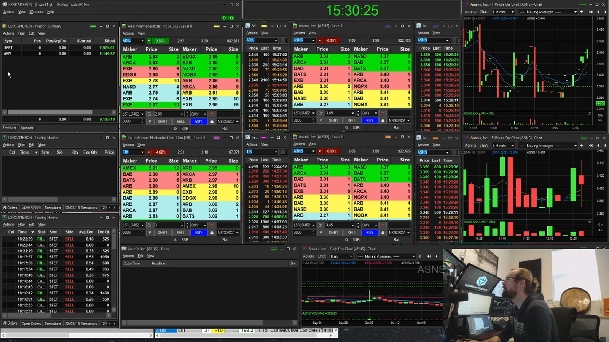
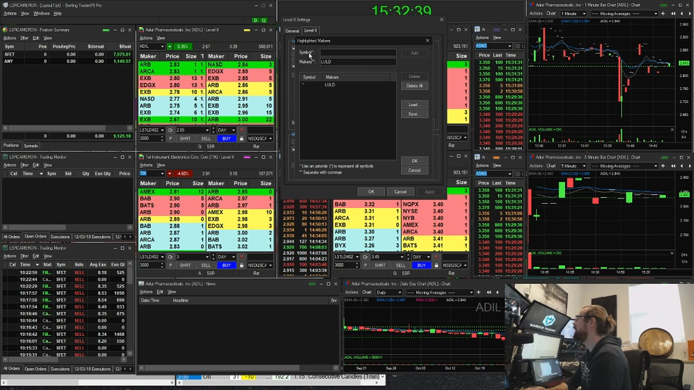
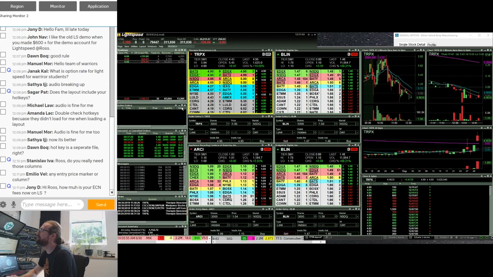
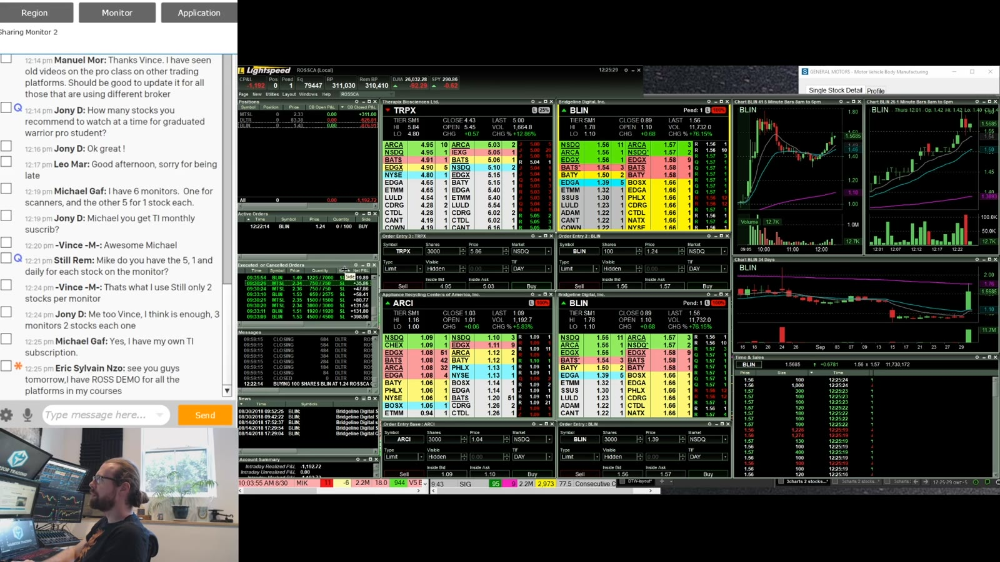
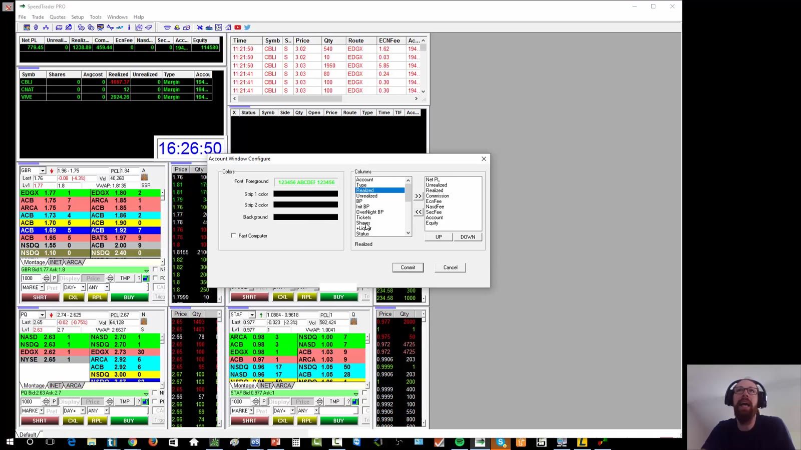
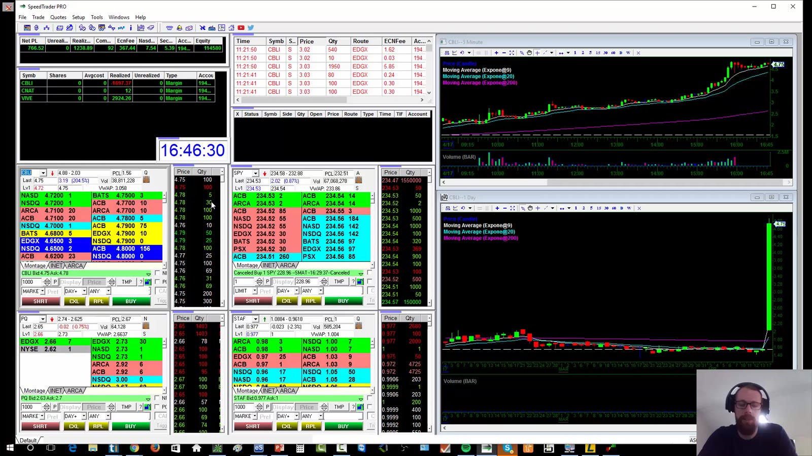
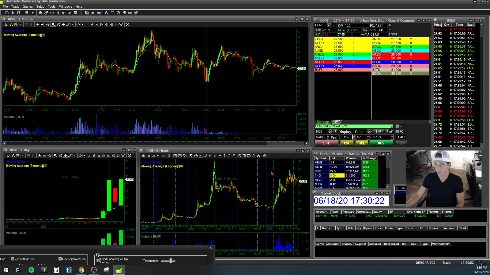
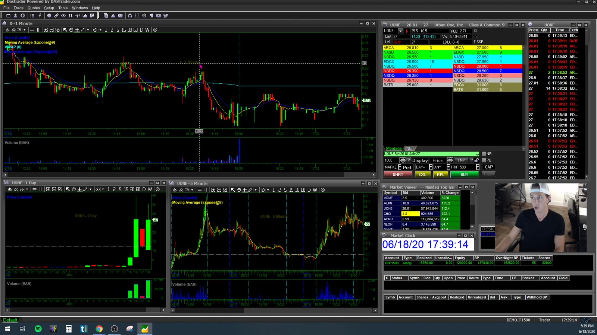

# Direct-access Platforms

> 对应视频：v0302–v0305
> 核心问题：怎样把 Level 2、Time & Sales、图表、订单和持仓窗口组合成一个不容易下错单的执行系统。

## v0302：Sterling Trader Pro

Sterling 是交易软件，不是经纪商。录制时多个经纪商使用同一套软件并换上自己的品牌；所以开户、资产保护、费用和可交易地区要看经纪商，窗口与热键能力才看平台。



**图怎么看：**

- 中央 Level 2、右侧 Time & Sales、下方订单输入和旁边图表构成一个 symbol 工作组。
- 画面上同时有 positions 和 orders；两者不能互相替代。持仓归零不代表没有遗留挂单。
- 多窗口的价值是让观察对象、准备交易对象和正在交易对象分开，避免在错误 ticker 上触发热键。

### Level 2 与停牌价格

课程把 Level 2 前几档设成固定颜色并放大字体，目的不是装饰，而是让价位层级在高速变化时仍可辨认。它还把 `*LULD` 特殊行标红，用来识别 Limit Up–Limit Down 价格带。



**图怎么看：**

- 市场参与者、price、size 是核心列；不帮助决策的列可以隐藏。
- 红色的 LULD 行是停牌价格带提示，不是买卖信号；价格逼近该带只说明停牌风险上升。
- 录制后的现行停牌规则和平台显示方式可能不同，交易前应从平台文档和交易所规则重新确认。

### 最危险的默认值

视频讲了一个真实操作错误：平台把订单数量自动改成当前持仓，讲师继续按买入键时，把原本已很大的仓位进一步放大到接近 30,000 股。防护思路是：

1. “增加仓位时的默认数量”设为固定小值，而不是当前持仓；
2. 关闭点击 Level 2 价格时自动改 order size；
3. 每个热键明确 account、route、order type、offset、time in force；
4. 先用模拟账户或交易所测试代码 `ZVZZT` 验证；
5. 每次平台更新、换经纪商或导入配置后重新测试；
6. 不照抄视频的 3,000 股，数量必须由自己的单笔风险反推。

### Orders、fills 与 positions

- `Open Orders` 只显示仍可能成交的订单，避免 live order 淹没在大量 canceled/filled 记录中。
- `Executions/Fills` 用来确认实际成交价格和数量。
- `Positions` 用来确认净仓、平均价、realized/unrealized P&L。
- 课程把全市场 open orders 单独放在第二块屏幕；核心原则是任何 live order 都应一眼可见。
- `Ctrl+X` 等快捷键只是视频中的个人配置，不是 Sterling 的通用标准，不能未经验证直接复用。

### 图表与故障预案

课程使用 premarket、9/20 EMA、200 EMA、crosshair 和 linked focus。图表链接后，切换 Level 2 ticker 会同步切图。布局文件要做备份；外接显示器断开时，窗口可能仍加载在不可见坐标，因此应另存一套 laptop layout，并保证主交易窗口能在主屏恢复。

## v0303：Lightspeed

视频从一个红日开始：连续三笔亏损后停止交易，把保护资本放在继续找机会之前。平台配置和这条纪律是一回事——都在限制一次小错误演变成大损失。



**图怎么看：**

- 扫描器位于视线顶部，三个重点 ticker 各有 Level 2；主交易对象靠近持仓和订单窗口。
- Active Orders 与 canceled/executed orders 分开，防止未撤订单被历史记录遮住。
- News 窗口跟随当前焦点 ticker；这能加快核对，但 headline 仍要回到原始公告。

### Active window 必须明显

Lightspeed 的热键作用于当前 active window。视频把 active Level 2 设成显眼颜色，因为同屏多个 ticker 时，最致命的问题不是“看不懂图”，而是在错误窗口发送正确热键。



**图怎么看：**

- Level 2、Time & Sales 和 order entry 必须成对链接；不能仅凭它们摆得很近就假定 ticker 相同。
- Order entry 预设 route、固定数量和 limit 类型，但下单前仍要读一遍 ticker、side、size、price。
- 自己的挂单使用独立颜色，便于从市场深度中快速识别。

### Positions 与 P&L

课程保留 symbol、shares、average、last、open/closed/marked P&L、trade count 以及 added/removed liquidity。画面的 P&L 是佣金前还是佣金后必须搞清；录制期的佣金示例不能用于估算今天的成本。

视频建议保存现有 layout 后再载入课程 layout。导入不是完成：显示器坐标、账户、route、热键、数量、借股字段和新闻链接都要逐项重做。

### 图表设置

- 设定 period 和 timeframe；
- 加入课程使用的 EMA；
- 横向 grid 帮助读价格；
- 缩放选择 price-only，避免时间轴和价格轴一起变形；
- Lightspeed 图表的重点是快和够用，复杂研究可放在独立 charting platform。

### 红日流程

```text
连续亏损达到个人上限
→ 取消所有挂单
→ 确认仓位归零
→ 保存 fills 和平台日志
→ 离开 live execution
→ 复盘 setup、entry、size、exit
```

停止交易不是“认输”，而是防止当天状态不佳时继续向市场暴露风险。

## v0304：DAS Trader Pro（Ross）

DAS 也是被多家经纪商采用的软件。视频里提到的经纪商、免费门槛、市场数据套餐和地区资格均属于录制期信息；当前使用前必须重新查证。



**图怎么看：**

- Account Summary 加入 net P&L、commissions 和各类 fees，避免只看 gross realized P&L。
- Positions 即使为 0 股也保留，这样能看到当日已平仓交易及 realized P&L。
- Orders 只保留 active orders；fills 和平均成本分别从 executions、positions 核对。

### Montage、Time & Sales 与 chart

DAS 把 Level 2/order-entry 组合叫 montage。Time & Sales 和图表是独立窗口，要拖动 anchor 显式链接。视频演示 1 分钟、5 分钟、日线和 9/20/200 EMA；也指出 DAS 图表缩放不如专用图表软件灵活。



**图怎么看：**

- 顶部几档用稳定颜色编码；两位或更多小数取决于交易标的，不是越多越好。
- `Don't change order size when clicked on Level 2` 用来避免点击报价时把数量改成该档显示量。
- Route 也不应因点击报价自动变化；价格可双击载入，再由 limit offset 控制可成交范围。
- 显示股数小于真实订单股数属于 reserve/display quantity 功能，涉及执行规则，不能只凭视频示例使用。

### Hotkey script 与全局设置

课程用 order script wizard 组合 symbol、side、size、price、route、time in force 和 send mode。尤其要区分：

- `Load`：只把参数载入，不发送；
- `Load and Send`：立即向市场发送；
- `All or None`：不是“允许任意成交”，错误选择会影响部分成交；
- `Set shares to position after execution`：可能让连续加仓数量指数式放大，应按自己的流程关闭或严格测试。

布局需要保存为默认 desktop；旅行和断电场景另备单屏文件。无论导入谁的 hotkey 文件，都要逐条阅读脚本，换成自己的账户和风险数值后在模拟环境测试。

## v0305：DAS Trader Pro（Jess）

第二个 DAS 演示补足了完整工作区搭建：主题、图表、交易标记、montage、scanners、positions、orders、hotkeys 和 short locate。



**图怎么看：**

- 一分钟、五分钟和日线放在同一 symbol 组；day/open/close separator 把盘前、常规时段和盘后分开。
- Crosshair 用来精确读取同一根 candle 的时间与价格。
- 图表可显示实际 entry/exit 三角标记；复盘时把成交和当时结构对齐，比只看 P&L 更有价值。

### Chart package

视频为不同 timeframe 设置不同历史长度，并加入 VWAP、9/20/200 EMA。Extended hours 要显式打开。每个 chart 可独立配置，也可保存默认模板；画线工具包括 horizontal、trend line、channel、rectangle 和 text。

### Montage 与链接



**图怎么看：**

- Anchor 把 chart、Level 2 和 Time & Sales 绑定为一组；切 ticker 后所有窗口应同步。
- Montage 可显示 LULD 参考值和 short availability，但盘前盘后没有常规时段的波动性 LULD 触发机制。
- 点击 bid/ask 会把价格载入 order entry；这不等于订单已经安全，size、side 和 send mode 仍需核对。

### Scanner 与 hotkey

演示设置 price、涨跌幅、volume 等过滤条件，并用 after-hours 数据检查扫描结果。Hotkey 配置再次强调：

- 先确定 order type 和 route；
- `Load` 与 `Load and Send` 不可混淆；
- time in force 要匹配 regular/extended session；
- 不要误选 AON；
- bailout/flatten 键必须在部分成交、反向持仓和断线场景测试。

Short Locate 只表示向经纪商询价/申请可借股，不代表该 short setup 合理，也不保证之后仍有库存。

## 可复用的最小布局

```text
scanner/watchlist
        ↓ ticker
linked chart ─ Level 2/order entry ─ Time & Sales
                         ↓
positions + active orders + fills
                         ↓
account P&L and risk controls
```

开盘前逐项确认：

- account 与 live/sim 状态；
- ticker linkage；
- active window 高亮；
- 默认 size、side、route、type、offset、TIF；
- cancel all、flatten、sell/cover partial；
- active orders 独立可见；
- positions 与 broker web/mobile 一致；
- 主线路、备用网络、备用电源和 trade-desk 联系方式。

平台越快，错误也执行得越快。真正的目标不是“像讲师一样排窗口”，而是任何时刻都能回答：我在哪个账户、哪个 ticker、持有多少、还有哪些订单可能成交、最坏风险是多少。
