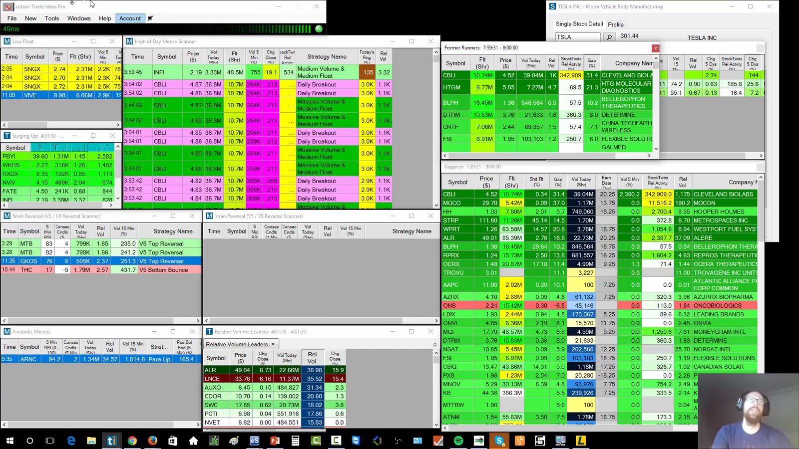
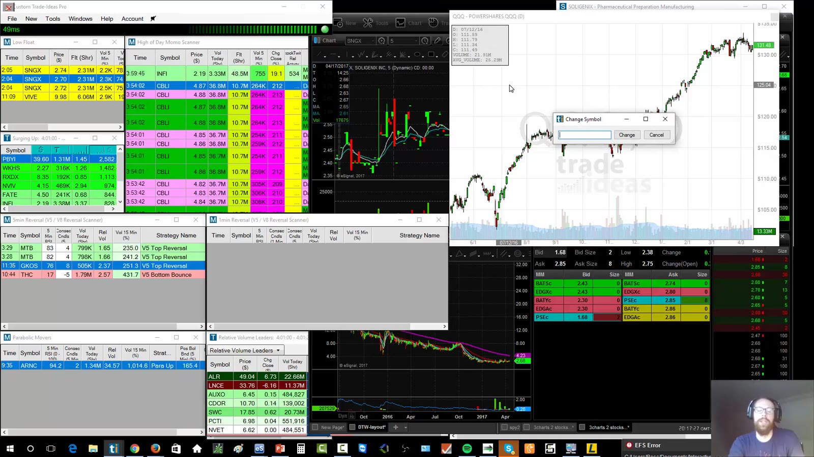
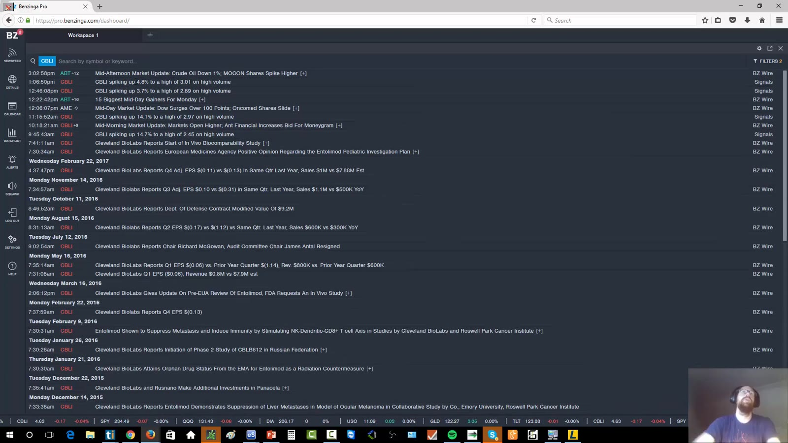
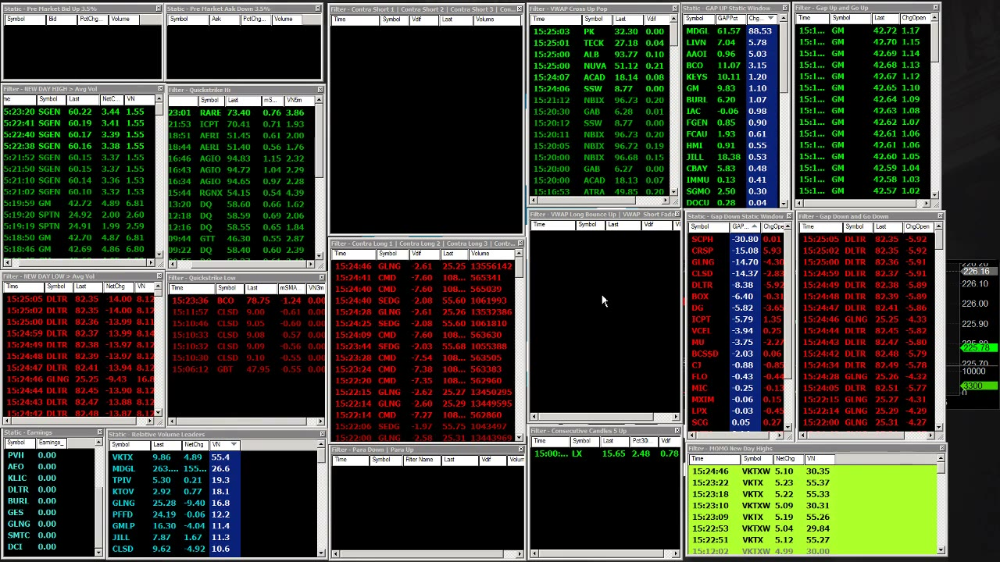

# Scanners and News

> 对应视频：v0306、v0308、v0313
> 核心问题：scanner 负责发现候选，news 负责解释催化剂；两者都不能替代 setup、risk 和 execution。

## v0306：Trade Ideas

课程把 Trade Ideas 用作每日 watchlist 的发现工具，而不是自动给出交易指令。平台有三类核心窗口：

- `Alert Window`：事件发生时逐条推送，例如 new high、volume surge；
- `Top List`：持续排序的榜单，例如 gappers、volume、range；
- `Multi-Strategy Window`：把多个策略的 alerts 合并到一个窗口。



**图怎么看：**

- 每个彩色区域对应不同逻辑；同一 ticker 同时出现在多个窗口，说明它满足多组条件，但不自动等于可买。
- 列里应保留 price、change、volume、relative volume、float 等会实际参与决策的数据。
- `Snap Windows` 只帮助排版；真正重要的是每个窗口标题和过滤条件必须可辨认。

### 复制和验证 scanner

视频演示用 `Collaborate` 复制单个 strategy，再粘贴到新 multi-strategy window。导入后必须打开配置核对：

1. universe 与交易所；
2. regular/pre-market session；
3. price 区间；
4. float；
5. 当日和最近若干分钟 volume；
6. relative volume；
7. alert event；
8. 是否存在容易造成 look-ahead 的条件。

分享链接只复制条件，不证明该条件有效。应回放不同市场环境，记录命中后最大顺向/逆向波动、spread、volume 和失败率。



**图怎么看：**

- 点击 scanner ticker 后，外部 link 可同步 eSignal/其他图表，减少手输 ticker 的错误。
- 内置图表能快速确认盘前和盘后结构；复杂分析是否需要另一套图表，要看实际缺口，不是订阅越多越好。
- 连接状态变橙/红时，scanner 可能不再可靠；不能把“没有 alert”当成“市场没有机会”。

### Channel bar 与 relative volume

课程展示 sector、volume radar 和预设 channels。它们适合回答“资金正在集中在哪里”，不适合直接回答“现在按哪个键”。Sector 强弱还要下钻到 individual stock 的流动性和结构。

## v0308：Benzinga Pro

视频主要展示 audio squawk、newsfeed、calendar 和 ticker detail。讲师明确说自己后来较少依赖它，因为 breaking-news 冲动交易曾带来较大亏损。



**图怎么看：**

- Squawk 是持续音频播报，优势是不用离开图表就能听到事件；缺点是噪声和情绪触发。
- Newsfeed 可按 ticker 搜索，但“spiking on volume”这类市场动态不是公司原始新闻。
- Calendar 用来提前标记 macro/company events，不能等价格突然跳动后才发现。

### 新闻处理顺序

```text
scanner/news alert
→ 识别是公司公告、监管文件、宏观数据还是市场异动描述
→ 打开原始 release/filing/official calendar
→ 判断内容、时间、是否已预期、是否可量化
→ 回到 chart/volume/spread
→ 定义 entry、invalidation、size
```

视频还指出 squawk 断线后可能长时间无声而不自动重连。每个外部 feed 都需要 heartbeat：声音/时间戳、最后一条消息和备用来源。

### 何时值得保留

只有当策略明确依赖 breaking news、macro release 或 halt/resumption 信息，并且测得它比现有来源更快、更完整时才值得增加成本。不能因为“专业界面”就把未经核实的 headline 当作事实。

## v0313：Primus

Primus 演示偏 large-cap scanner。课程强调它能围绕 VWAP、time-of-day normalized volume 和自定义公式做更细的过滤。


**图怎么看：**

- 左右多个静态/动态窗口分别看 earnings、relative volume、new high/new low、contra 和 parabolic movement。
- 同一 ticker 在多个独立 scanner 同时出现，是“多条证据汇合”，而不是把窗口数量当置信度。
- 画面是录制期浏览器应用；产品可用性、浏览器支持和数据定义都需重新核对。

### 课程展示的窗口

- `New Day High on Higher-than-Average Volume`：寻找强势 continuation 候选；
- `New Day Low on Higher-than-Average Volume`：相反方向；
- `Earnings`：提示当日可能有基本面催化剂，但不展示 earnings 好坏；
- `Relative Volume Leaders`：发现开盘后才出现的异常参与度；
- `Contra Short/Long`：寻找过度扩张后的 reversal 或继续加速；
- `Para Up/Down`：标记速度失控的标的；
- `QuickStrike`：围绕 Bollinger Band/短线扩张寻找 scalp 候选。



**图怎么看：**

- `VN` 在视频中解释为按时段归一化的 relative volume，避免早盘拿当前量直接和整日量比较。
- `VDIF` 是距 VWAP 的差值；离 VWAP 远只说明 extension 大，不保证立即均值回归。
- Scanner 列的简称必须从当时的数据字典确认，同名字段在不同平台可能有不同算法。

### Formula builder

视频展示从字段列表插入条件，再用 `Validate` 检查语法。语法正确不等于策略有效。每条自定义公式至少记录：

```text
hypothesis
universe and session
exact fields and units
thresholds
expected market regime
sample period
hit count
slippage/spread assumptions
failure and retirement criteria
```

### Scanner 的正确角色

课程最有价值的表达是 decision support：scanner 提高覆盖范围，把注意力引向异常标的；最终仍要看 catalyst、liquidity、structure、risk/reward 和可执行性。若一个 ticker 同时命中“弱势、低点、异常量”，它值得进一步分析，不代表必须做空。

## 实用核对表

- Alert 是否实时，最后更新时间是什么；
- 字段单位和算法是否明确；
- 盘前与常规时段条件是否混用；
- scanner 是否能回放/导出；
- 同一 ticker 多次 alert 是否去重；
- 新闻是否来自原始文件；
- 断线后是否有明显告警；
- 命中后是否仍有可接受的 spread 与 liquidity；
- 没有 edge 的工具是否应取消订阅。
