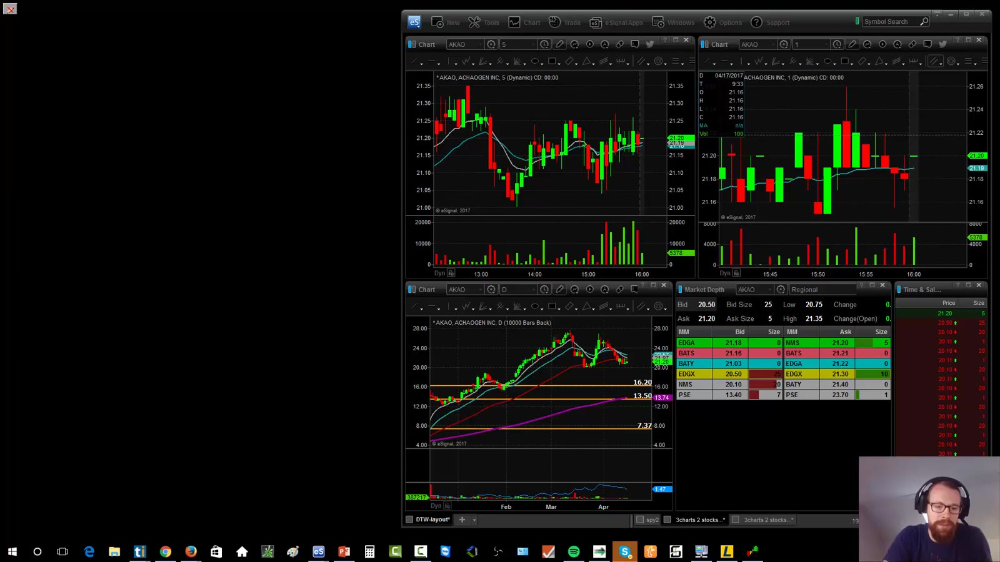
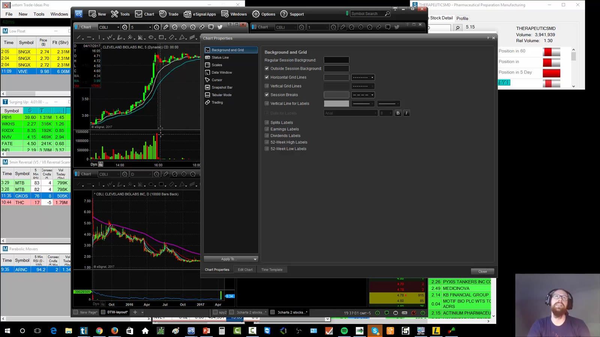
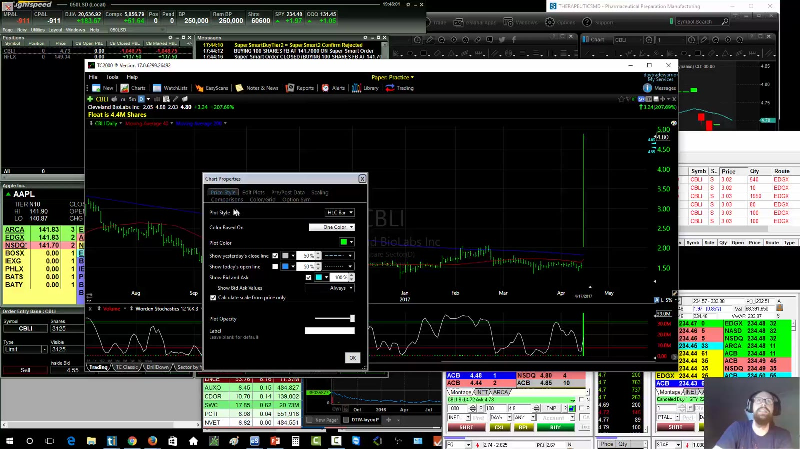
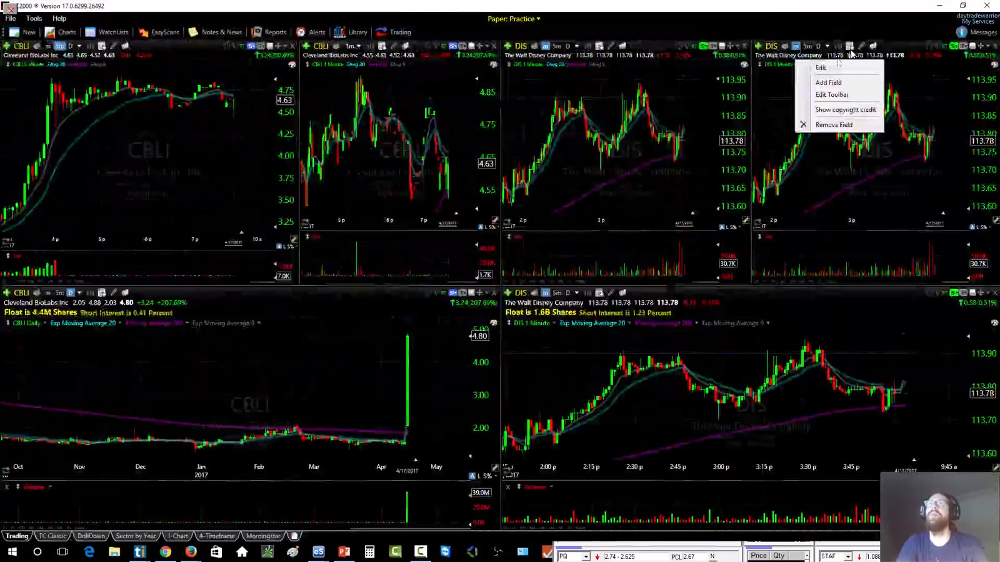

# Charting Platforms

> 对应视频：v0307、v0309
> 核心问题：图表平台要稳定呈现同一份价格数据、session 分界和多周期结构；它不需要承担所有交易功能。

## v0307：eSignal

课程使用 eSignal 的核心原因是图表成熟、session 分界清楚、缩放灵活，并能保存/分离多页工作区。录制期价格不能用于今天的采购判断。

**图怎么看：**

- 一个 ticker 同时显示 1-minute、5-minute、daily；同组颜色/link 保证切 ticker 时同步。
- Trade Ideas 放在相邻区域，形成 scanner → chart 的单向研究流。
- Level 2 虽可加入，但讲师实际主要把 eSignal 当图表工具，execution 留在 direct-access platform。

### Studies 与模板

视频展示 moving averages、自定义 VWAP、daily “windows”、data window、crosshair 和 style template。可复用操作是：

1. 先建立一张正确图表；
2. 核对 OHLC、volume、extended hours 和 adjustment；
3. 保存 style/study template；
4. duplicate 成 1m/5m/daily；
5. 设同一 link group；
6. save page，再 detach 到指定显示器；
7. 重启后检查窗口和数据是否完整恢复。

**图怎么看：**

- Vertical session break 把盘前、常规时段和盘后分隔开，避免把 9:29 与 9:30 当作普通连续 candle。
- Data window 提供光标所在 candle 的 OHLC/volume；判断 last candle high 时应读数据而不是目测。
- Crosshair 的价值是对齐时间和价位，不是制造额外指标。

### 是否值得单独订阅

视频比较的是“功能是否解决真实问题”，不是绝对排名。如果 broker chart 已能可靠显示多周期、extended hours、studies、drawing 和 export，就不必为了界面一致额外付费。若交易 stocks 之外的 futures/FX，数据授权和功能需求会不同。

## v0309：TC2000

课程把 TC2000 定位为价格较低的独立 charting platform，用来替换较弱的 broker chart，而不是取代 Level 2 execution。

**图怎么看：**

- Chart properties 切成 candlesticks，保留 volume，移除不使用的 stochastic 等指标。
- Toolbar 加入 float、short percent of float 等字段；课程现场发现字段选错会产生荒谬百分比，并用另一来源交叉检查。
- 数据字段必须核对名称和定义，不能因为平台给出数字就默认正确。

### 构建多周期布局

视频加入 9/20/200 EMA，将一张图保存后复制成 1m/5m/daily，再用不同 group color 管理两个 ticker。

**图怎么看：**

- 每组三张图只服务一个 ticker；颜色分组用于防止跨股票联动。
- Daily 给出大结构和 overhead levels，5m 看 setup，1m 看 entry timing。
- 图表缩放会改变视觉陡峭程度，pattern 必须结合绝对价格、时间和 volume，而不是只看形状。

### 视频指出的限制

- 录制版本没有用于执行的 Level 2；
- extended-hours 虽可显示，但 session 分隔不如 eSignal 清楚；
- 内置 EasyScan 的盘前与历史回放能力不满足讲师当时的需求；
- 个别新上市 ticker 的数据覆盖曾不及时；
- 因此课程选择“TC2000 做 chart、Trade Ideas 做 scan、broker platform 做 execution”。

这些是录制期观察，不应推断今天版本仍然相同。评估当前软件要重新做同一组验收测试。

## 图表验收测试

用 3–5 个包含 gap、split、halt、premarket 和高成交量的历史交易日检查：

- ticker、exchange、timezone；
- regular/extended-hours 分界；
- OHLCV 与 broker/official data 一致；
- split/dividend adjustment；
- 1m/5m/daily 聚合；
- last candle 是否完整或仍在形成；
- indicator 使用 regular 还是 extended session；
- drawings 是否跨 ticker 污染；
- link group 是否正确；
- restart 后 workspace 是否恢复；
- screenshot/export 是否保留时间和价格。

图表的首要标准是可信和可重复，不是颜色、指标数量或讲师同款。
