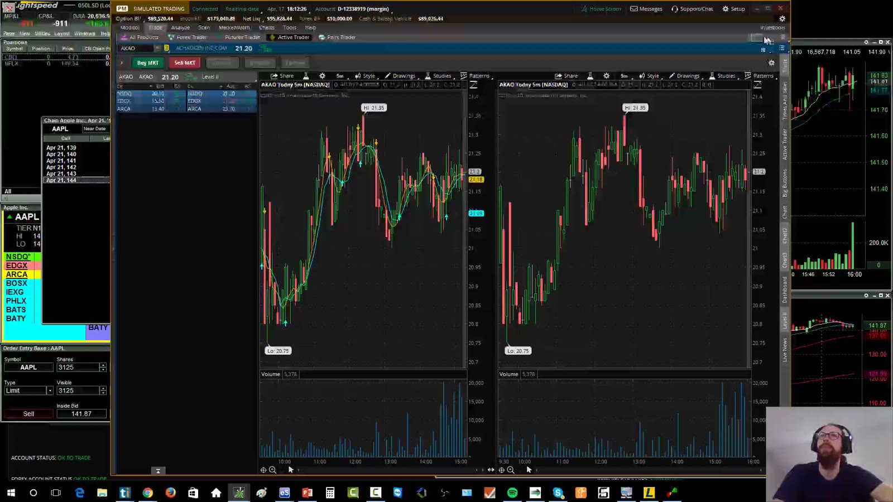
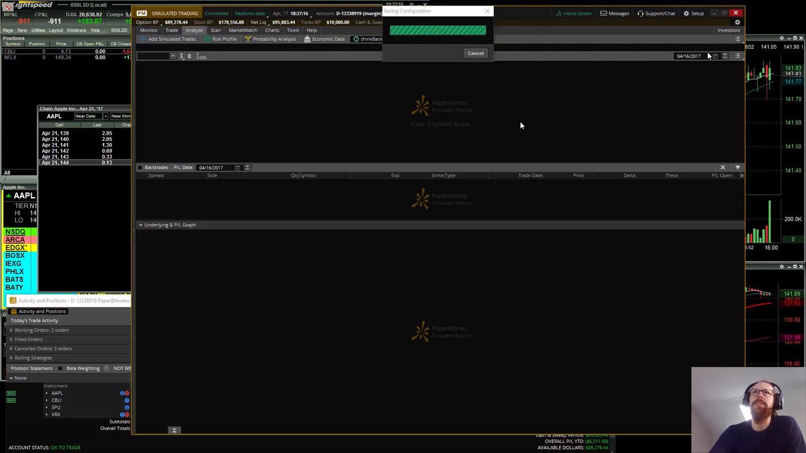
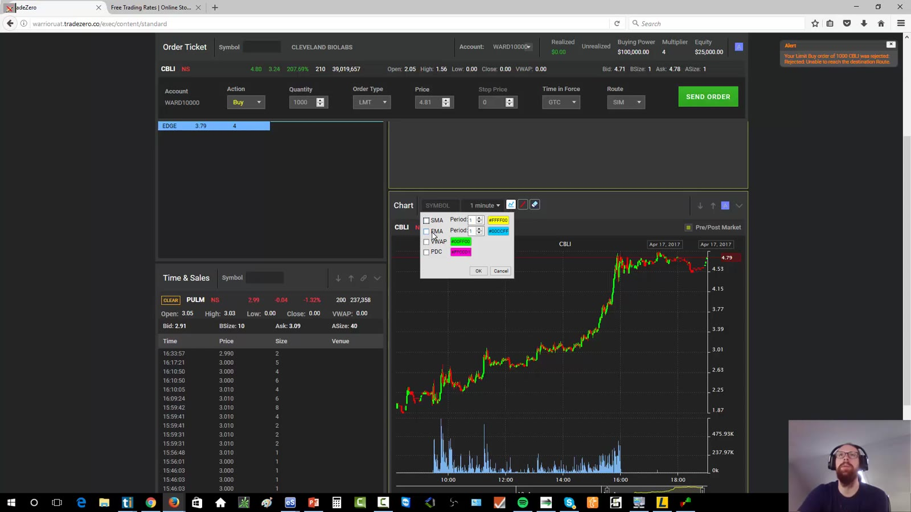
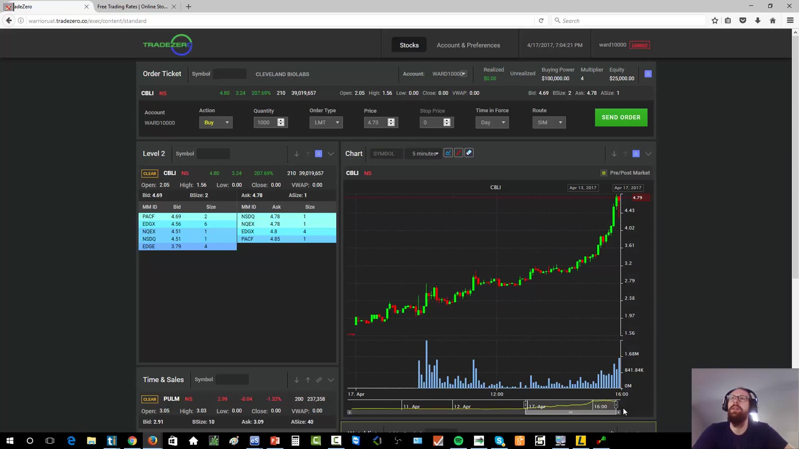
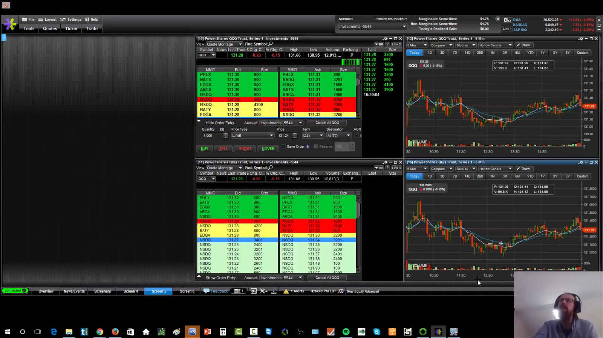
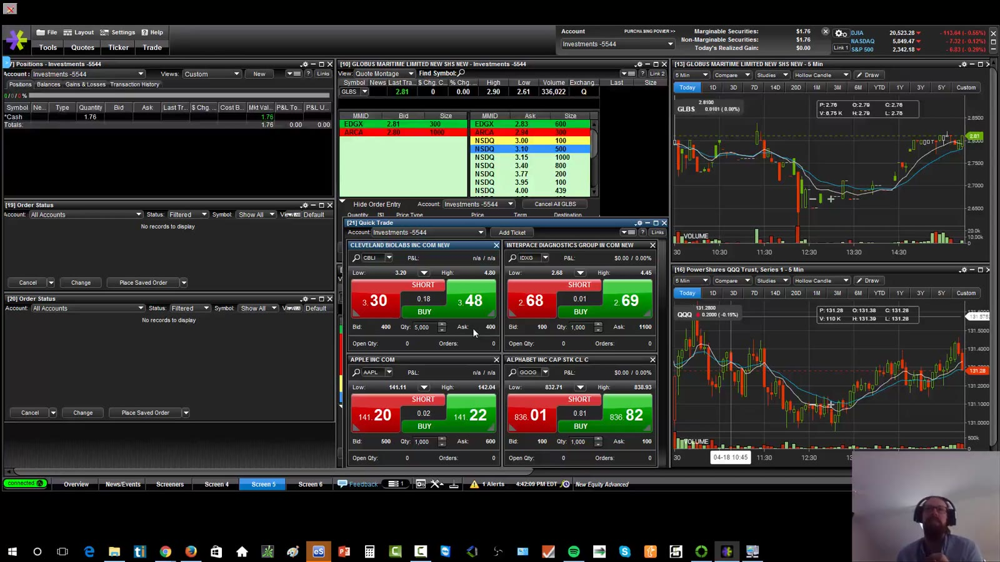

# Broker Platforms

> 对应视频：v0310–v0312
> 核心问题：综合经纪商平台适合 chart、simulator、options 或较慢执行，但是否适合高速 small-cap day trading，要单独验证订单能力和故障风险。

## v0310：thinkorswim

视频展示 live/paper 登录、charts、options chain、Level 2、Time & Sales、Active Trader、studies、link groups 和 OnDemand replay。

**图怎么看：**

- 右侧组件可切换 Level 2、Time & Sales、Active Trader；显示在同一图旁不代表它们一定链接。
- 多 chart grid 适合分析，但窗口越多越可能卡顿；视频现场就出现轻微 lag。
- 顶部 live/paper 状态是开盘前第一项核对，不能用界面颜色猜。

### Options chain

课程用 call/put、strike、expiration 和 strangle 做了短演示。重点不是该策略，而是 options chain 必须清楚显示：

- underlying；
- expiration；
- strike；
- call/put；
- bid/ask；
- multiplier；
- quantity；
- single-leg 或 multi-leg；
- estimated debit/credit。

在确认页再次核对，避免把相同 strike 的不同 expiration 混淆。

### OnDemand 的用途和限制

**图怎么看：**

- 回到历史时间后，图表和市场数据按时间推进，可练习识别 setup 和记录计划 entry/exit。
- 视频现场的模拟订单没有按预期成交，说明 replay fill 不能当真实执行质量证据。
- 正确用途是 deliberate practice：先暂停写计划，再播放观察；结果按当时可见数据评分。

视频中的 PDT 门槛、国际开户、佣金、路由和平台归属都是录制期信息。当前规则与产品名称需查经纪商和监管机构。

## v0311：TradeZero

演示的是 web-based platform，包含 watchlist、news、short list、chart、Level 2、Time & Sales、order ticket 和 hotkeys。

**图怎么看：**

- 垂直布局把行情、Level 2、成交和图表压在单屏，适合受限设备或模拟练习。
- Hotkey 配置要区分 load 与 execute，固定 1,000 股只是课堂例子。
- Web 平台的主要额外风险是浏览器、网络和 session 中断；必须另有 cancel/flatten 渠道。

课程认为模拟成交较适合练习，但 direct routing 与桌面软件相比有限。真正评估时记录：

- order acknowledgement；
- partial fills；
- limit/market/stop 行为；
- extended-hours TIF；
- locate workflow；
- browser crash/reconnect；
- mobile/web backup；
- statement/export。

**图怎么看：**

- Level 2 梯度颜色不像 direct-access desktop 那样细调，但仍能读 bid/ask depth。
- Time & Sales、chart、order ticket 并列，适合练习从 tape 到执行的完整动作。
- Real-money 环境不能因为 simulator 看起来顺畅就假定 fill 一样。

## v0312：E*TRADE Pro

这是三个演示中最细的一个。视频从空 screen 搭建 Market Depth、charts、accounts、orders、positions、news、options chain 和 strategy scanner。

**图怎么看：**

- 多个 screen/tab 分开 news、research 和 execution；每组窗口用 link number 同步 ticker。
- Market Depth 是 Level 2，Time & Sales 可独立加入；两个 5m chart/Level 2 只是课堂布局，可按需要改成 1m/5m/daily。
- Orders 应过滤为 live/open，rejected/canceled/completed 另查历史。

### 市价按钮事故

视频复盘了多次点击没有即时反馈，随后一次性收到约 56,000 股成交的事故。如果该股票整日只有约 300,000 股成交量，这个订单本身就占据巨大比例，退出更困难。

**图怎么看：**

- 快速按钮提高速度，也把重复点击、无确认和 market-order slippage 风险放大。
- “没有立即看到成交”可能是 UI lag，不代表订单没到 broker；再次点击前先查 active orders。
- 用 limit order 也不是绝对安全：过大的 aggressive limit 仍可能扫过多档。

防护：

1. 单击后等待 acknowledgement；
2. active orders 常驻；
3. 设置最大单笔 quantity/notional；
4. 不用固定大 share 按钮；
5. 明确 cancel all；
6. 平台无响应时从 web/mobile/trade desk 核对；
7. 不在未知状态反复下单。

### News、options 与 scanner

- 内置 news 便于按 ticker 查 headline，但仍需打开原始公告；
- Options chain 对 strike、expiration 和 moneyness 的展示比早期 DAS 示例更直观；
- Strategy Scanner 使用 Trade Ideas 链接，但视频发现部分字段（如 float）未按预期导入，证明任何 white-label/import 都要核对；
- 视频最终认为该平台不适合讲师自己的高速 small-cap execution，这不等于它不适合较慢策略或长期投资。

## 选择平台的决策表

| 需求 | 必查能力 |
|---|---|
| 模拟训练 | 历史/实时数据、fill 模型、回放、导出 |
| 高速股票执行 | hotkeys、direct routing、active orders、acknowledgement、kill switch |
| Options | 清晰 chain、multi-leg ticket、Greeks、exercise/assignment 信息 |
| Charting | session、adjustment、多周期、drawing、workspace |
| News | 原始来源、时间戳、筛选、断线提示 |
| Shorting | locate、费用预览、inventory、SSR/order handling |
| 故障恢复 | web/mobile/trade desk、cancel all、status page、日志 |

不要把“一个平台什么都有”误解为“每项都适合自己的策略”。先写需求，再用小规模、可回滚的模拟测试验收。
