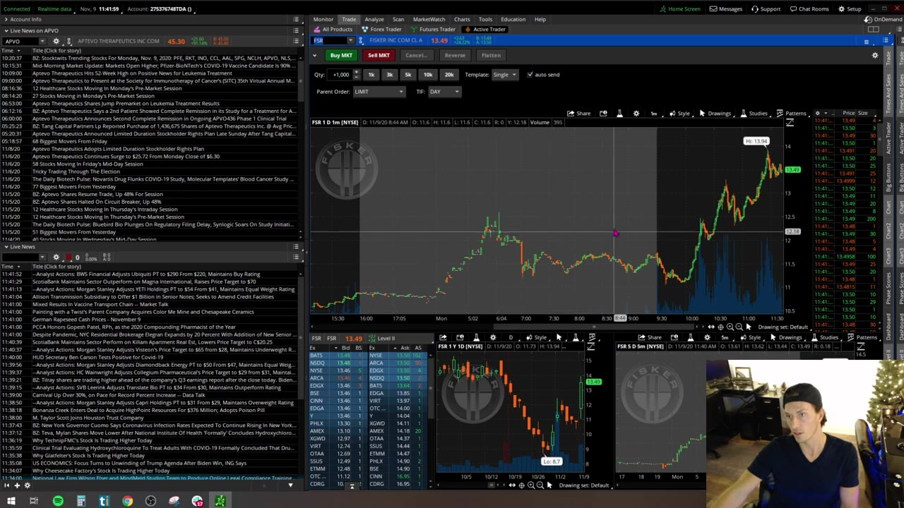
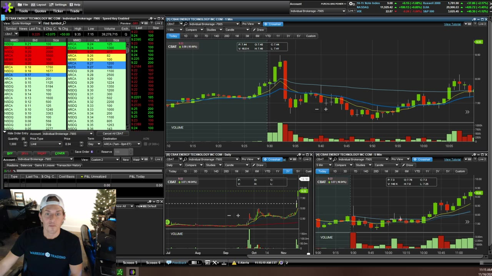
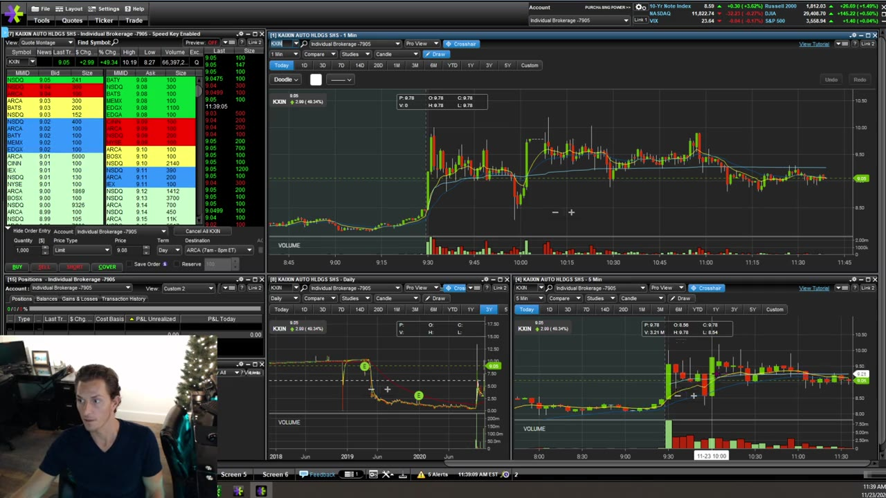
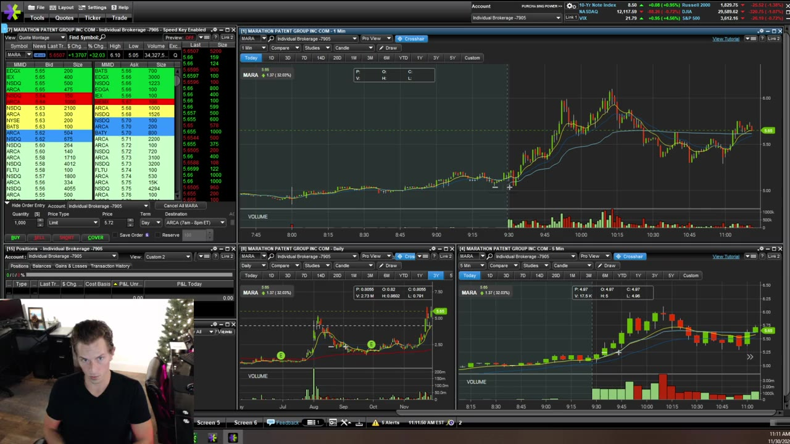

# Weekly Q&A：2020-11

## v0314：2020-11-09

**图怎么看：**

- 画面用实时/历史图表回答具体问题；先定位 timeframe 和 ticker，再看讲师画的 level。
- 口头判断必须还原成“触发、失效、目标”三件事，不能只记结论。
- 这场的主线是：setup 即使形状正确，也会因市场注意力转移而失效。

### 关键内容

- **Hidden buyer/seller：**某档显示 1,200 股，Time & Sales 持续成交而显示量不下降，可能存在 reserve/hidden liquidity；它只能作为行为线索，不能证明某个参与者身份。
- **市场注意力：**同一时间 momentum names 太多时，原本有效的次级 setup 会失去参与度；形态必须配合相对 volume 和当下 attention。
- **VWAP cross：**单独穿越 VWAP 不是 setup。向上 curl、5m breakout 和大周期方向要一致，否则不同 timeframe 会给出相反信号。
- **Stop order：**课程讨论 market stop 与 limit stop 的差异。Limit 可能被跳过，market 可能严重 slippage；无论使用哪种，都要有订单失效后的人工退出方案。
- **Flat-top breakout：**买突破也可能正好买在局部顶部。是否值得取决于下方 invalidation 与上方 room，不由形态名称决定。
- **Daily levels：**用 FSR 等案例从日线 candle bodies/lows 找 overhead resistance，再映射到盘中。
- **冻结：**交易不利时 freeze，通常说明 entry 前没有定义 exit。解决方法是降 size、写出 stop，并练习看到失效立即执行。
- **红日重置：**不要用下一笔交易“修复情绪”；先归零订单/持仓，再区分 setup loss 和 rule break。

## v0315：2020-11-16

**图怎么看：**

- 图上同时看 1m 与 5m：5m 给 setup，1m 给更精确的 trigger。
- 回踩 9 EMA 后低量整理、再放量上攻，是课程偏好的 continuation 结构。
- 不能因为案例最后大涨，就把当时未知的后续走势算进 entry 质量。

### 关键内容

- **Curl entry：**starter 在 5m candle break，接近前高先兑现；卖后继续上涨不代表卖错，评价要依据预定 target。
- **重复结构：**同一 ticker 可能连续两天出现 wedge/curl，但“历史重复”只是背景，每次都要重新确认 volume、level 和 room。
- **价格目标：**half-dollar/whole-dollar 可作心理 level，课程举例先看 0.50，再看 0.75/下一整数；它们不是保证反转的精确点。
- **触发方式：**chart 定义价格，Level 2/Time & Sales 看成交是否确认；不要只盯 tape 丢掉大结构。
- **SSR：**short sale restriction 下通常不能直接砸 bid 建立 short，课程表述为在 ask/uptick 参与；实际订单处理以当前 broker/监管规则为准。
- **大 stop：**课程承认某些异常波动交易会用到很宽的 stop，但明确不推荐新手照做。Dollar risk 应通过降低 shares 限制。
- **数据速度：**不同 chart/Level 2 feed 可能不同步；交易前用同一 ticker/time stamp 比较，而不是出现偏差后才发现。
- **适应市场：**不要担心某个 setup “以后永远失效”；持续记录不同月份的命中率，降低 size 或回 simulator 验证变化。

## v0316：2020-11-23

**图怎么看：**

- 先看 leading gapper、news、float、volume，再在 5m 找结构、1m 找触发。
- 图中的 level 不是预测，只有价格实际穿越并维持时才确认。
- Halt 前后的 candle 容易造成视觉跳跃，订单计划必须包含 resume gap。

### 关键内容

- **Morning watchlist：**“现在为什么买”来自预先筛选：leading gapper、催化剂、volume、关键价位和 clean setup，不是开盘后随便追 scanner。
- **Short locate：**DAS 上的 easy-to-borrow 标志与 locate workflow 只说明可借性；库存、借股费用和回补风险仍会变化。
- **Ask order 未成交：**要先 cancel 原挂单，再换成 bid/更激进订单，避免原单稍后成交造成超卖或反向仓。
- **Halt：**课程讨论平停、向上 halt 和 resume 行为；不要猜精确复牌价。用前高、盘前高等 level 规划，并接受 gap 穿 stop。
- **Mental stop：**讲师看到 entry 时立即定位 recent candle low 或结构 level。Mental 不等于模糊，必须能说出具体价格和最大美元风险。
- **5m/1m：**5m candle breakout 要放进 1m 上下文；若 1m 已严重 extension，同一个 5m trigger 的 risk/reward 会恶化。
- **税务回答：**视频只给了非常概括、且带不确定性的美国税务口径，不能据此报税；应使用当前 broker tax documents 和专业税务意见。
- **防止跳股：**注意力容易分散时，只跟 leading gapper，除非另一只在 momentum scanner 上出现明确异常。
- **从 sim 到 live：**在 sim 能止损，live freeze 说明情绪/size 改变了执行；应退回更小 size，而不是扩大容忍范围。

## v0317：2020-11-30

**图怎么看：**

- 讲师区分 curl 与 bear flag：是否重新站回关键 level、能否形成底部/高低点结构是关键。
- 一根异常 spike 不一定是可成交价格；要对照 Time & Sales、bid/ask 和实际 fills。
- 图表案例用来检验规则，不是重演后视镜交易。

### 关键内容

- **Add：**不能给“第一根新高后固定在哪里加”的通用答案；只有新的 consolidation/trigger 出现，且总仓风险仍可接受，才考虑 add。
- **CAAS curl failure：**缺少有效底部确认、仍在 bear-flag context，属于把反弹误读成反转。
- **Simulator realism：**高 volume 股票的小规模练习较接近真实；用 50k–100k shares 抢很小 breakout 会忽略市场冲击和部分成交。
- **Hotkeys：**不要复制讲师可一次增加 2k/4k/6k shares 的键位；新手热键的第一目标是限错，不是最快。
- **Catalyst：**offering 价格相对市价可能改变解读，earnings 常是明确催化；仍需读原始公告，而不是从涨跌反推消息。
- **Double bottom：**第二次测试前低不显著破位、随后 reclaim/volume 增加才形成候选；两个相近 low 本身不够。
- **Red day：**亏损是业务成本，但 rule break 不是。红日标签不能驱动 revenge trading。
- **Stale/odd prints：**瞬时尖刺可能来自特殊/延迟成交，未必能按图上价格成交；复盘使用 broker execution record。
- **Active management：**价格到 stop 时不能“退后等它修复”；先退出，再决定是否在新结构重新进场。
