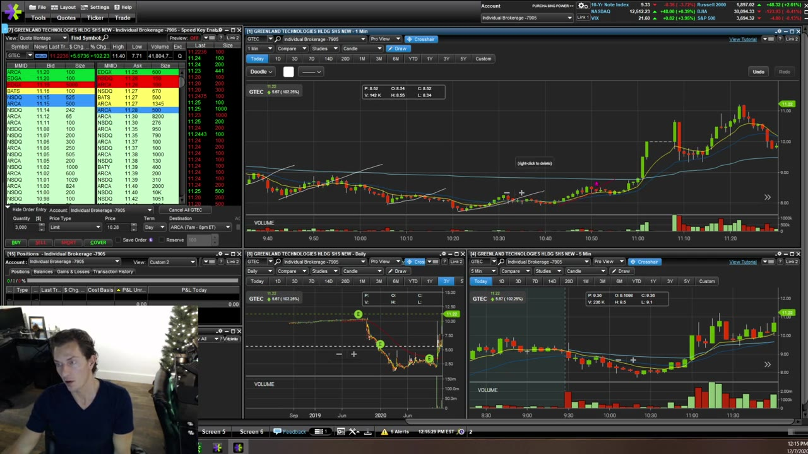
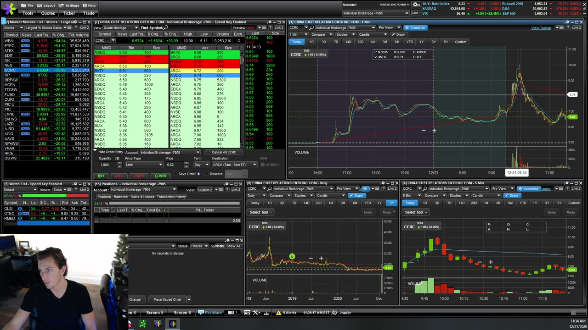
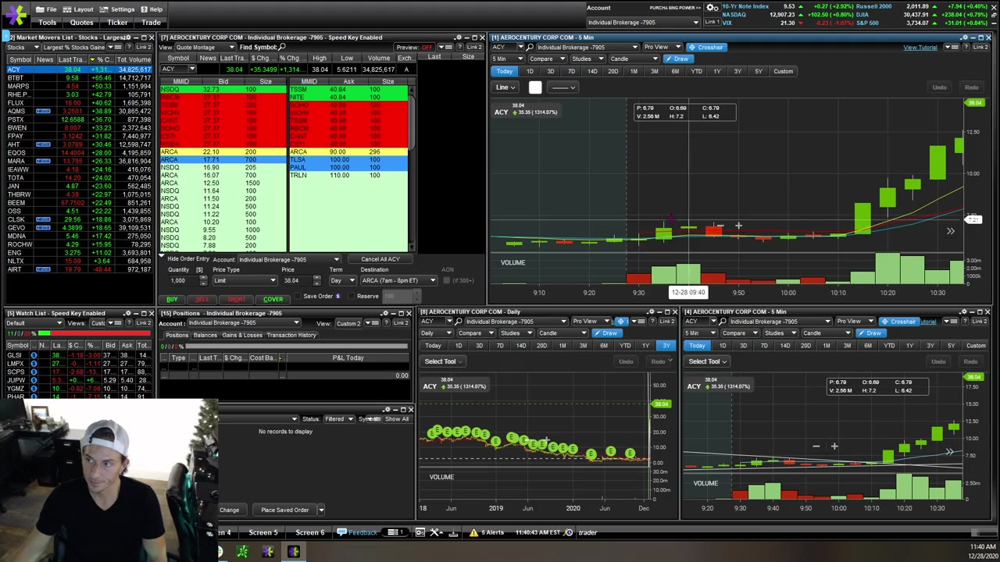

# Weekly Q&A：2020-12

## v0318：2020-12-07

**图怎么看：**

- 买 bid 更偏被动，追 ask 更偏主动；选择取决于 setup 是否正在触发和是否有足够 liquidity。
- Halt imbalance/indicative price 是动态信息，不是保证复牌成交价。
- 图表上的支撑、EMA、VWAP 要结合 reclaim/failure，而不是机械触碰就交易。

### 关键内容

- **Entry tactic：**pullback 可尝试在 bid 累积；breakout 已启动时通常需触碰 ask。为了省一两分钱错过 setup，不一定比合理 offset 更好。
- **未成交挫败：**扩大 offset 能提高成交率，也增加 slippage 上限；要预先设最大值，不能因 FOMO 临时放宽。
- **Halt imbalance：**视频解释预估 resume price 和 imbalance shares。数值会变，且复牌可能远离 stop。
- **“让 winner 跑”：**课程反对无限持有，倾向强势中 partial。剩余仓才用更宽结构 stop。
- **Daily room：**下方 200 EMA/上方 resistance 决定空间；一个 intraday dip setup 若大周期仍有很大下行 room，风险更高。
- **Scale up：**1,000 → 1,500 或 2,000 → 3,000 只是渐进示意；size 增加会同时放大 winner 和 loser，先按固定风险单位验证。
- **Live orders：**可在多个 Level 2 预置 breakout order，但每个都是潜在仓位；总风险要按“全部成交”计算。
- **Reversal vs continuation：**连续 bear flags 下破说明弱势；reclaim 关键 level、selling volume 减弱后才有反转证据。

## v0319：2020-12-21

**图怎么看：**

- 盘前 high 在 halt resume 后从 resistance 变成 support，是本场反复使用的 level 转换。
- Pivot 是区间内反复成交/承接的区域，不应画成神奇的一分钱。
- 每个 pattern 都要先问当前处于 trend、range 还是 extension。

### 关键内容

- **交易次数受限：**不要把有限 day trades 理解成必须在同一只 gapper 上全额押注；先按账户规则和风险上限选择 setup。
- **Backtest：**讲师没有给出正式方法。实际应保存当时可见 universe、trigger、spread 和 next-N-minute excursion，避免只挑成功图。
- **Bull flag/curl：**curl 若不能突破并维持，会重新变成 bear flag；越晚追入，离 invalidation 越远。
- **等待：**连续几个 breakout 都失败时，坐等明确结构比不断“试一笔”更好。
- **Halt sequence：**复牌越过盘前 high 后回踩，原 resistance 可转为 support；若直接跌回 level 下，转换失败。
- **大涨链：**多只股票连续 halt 会增强跟随情绪，但第 4/5 只并不因前面成功就低风险。
- **Bid/ask choice：**pullback 可在 bid，breakout 多在 ask；本质是对成交概率和 price improvement 的权衡。
- **Premarket：**volume 较薄、spread 较宽，reward 与 slippage 都更大。
- **Stop at EMA/candle：**应放在结构失效一侧并留出正常噪声；若 stop 太远，减 size，不是把 level 任意挪近。

## v0320：2020-12-28

**图怎么看：**

- ACY 的巨大涨幅和多次 halt 展示 extreme momentum；这种图最容易让人把后视镜上涨误当作低风险 entry。
- Daily/pre-market level 提供参照，但价格可直接 gap 越过。
- 1m 看起来机会多，可靠度通常低于有上下文的 5m setup。

### 关键内容

- **不要与 parabolic stock 争论：**“涨太多所以该 short”不是策略。Easy-to-borrow 也不会让 short 自动安全。
- **Breakeven hotkey：**课程把它视作 stop/flatten 的一种实现；任何自动单都可能被跳过，不能停止监控。
- **Unmanaged trade：**离开屏幕、随机买卖、无 stop/target，会把一个 setup 变成赌博。
- **Risk plan：**即便相信股票可能继续翻倍，也要事先确定持仓、partial、stop 和剩余 runner。
- **1m vs 5m size：**课程建议更可靠的 5m setup 可相对大，噪声更高的 1m setup 相对小；绝对数仍由 dollar risk 决定。
- **Extension：**从 6 到 7 的快速推升后第一根新高容易 false breakout；等待 pullback 或 confirmation。
- **Premarket halt：**视频区分 volatility pause 与 news halt；当前 halt 类型与 session 规则须查交易所，不能只背这段旧口径。
- **损失：**尊重 stop 的意义是保留下一次合格机会，不是保证这次退出后价格不会反弹。
