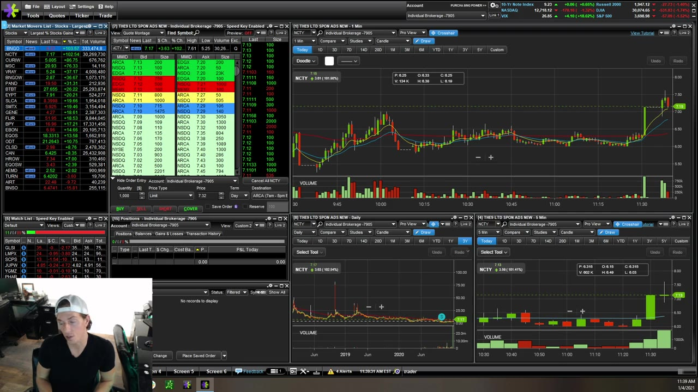
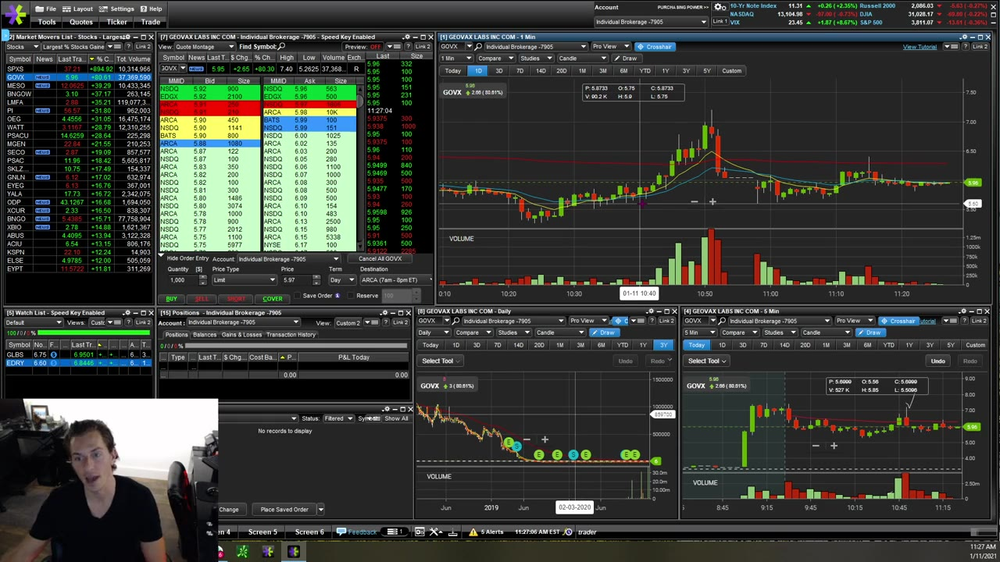
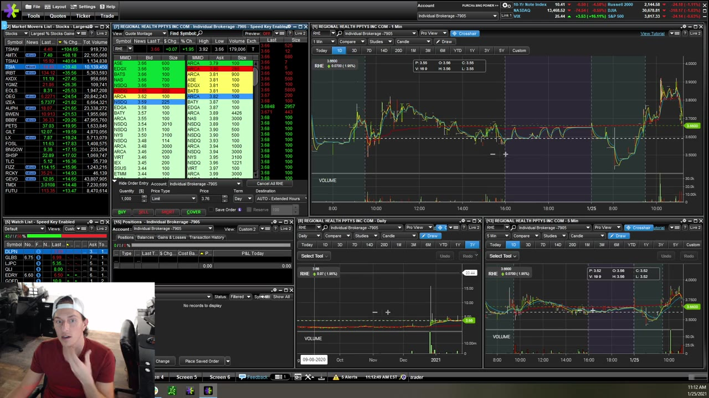

# Weekly Q&A：2021-01

## v0321：2021-01-04

**图怎么看：**

- 图表只是回答“结构在哪里”，账户大小回答“能承担多少”；不能用小账户倒逼自己交易次优形态。
- Half-dollar 等 level 只有和 previous resistance、volume 重合时更有意义。
- 多数据源可同时使用，但要防止 ticker、时间和 candle 聚合的细微差异。

### 关键内容

- **小账户：**一次失控足以造成不可恢复损失；佣金、borrow fee 和 slippage 对小本金占比更大。
- **爆仓后：**先回 simulator，找出 confirmation 和错误链，不应立即补钱重复同一流程。
- **Scale up：**若 1,000 shares 已稳定，增到 2,500 不能同时换 setup、stop 和退出方式；一次只改一个变量。
- **选择标的：**优先 leading gapper、fresh news、必要时 continuation/reverse-split context；越深挖越容易说服自己交易冷门股。
- **Pattern 失效：**若 VWAP/half-dollar 策略连续不好，先停用并回测，转向更清楚的 momentum pullback/5m setup。
- **Sim 真实性：**把 buying power 调到接近未来 live account，限制最大 size 和 trade count。
- **粗糙市场：**不要因一天/一周表现给自己贴标签；用一组交易检查 expectancy 和 rule adherence。
- **双平台：**一个 chart、一个 execution 没问题，但开盘前比较报价时间戳、extended-hours 和 corporate-action adjustment。

## v0322：2021-01-11

**图怎么看：**

- 网络断开是交易风险，不是 IT 小问题；持仓时数据冻结会让 chart、Level 2 和订单状态同时失真。
- Double bottom 不是两条水平线，第二次测试后的 reclaim/volume 才是 trigger。
- Candle wick 与 body 要按市场接受/拒绝价格来解释。

### 关键内容

- **Internet outage：**视频讲到施工导致断线并造成重大损失。必须有备用网络、电源、web/mobile 和 trade desk。
- **月初亏损：**处于 red month 会诱发“赶回来”；继续交易的前提应是 setup 合格，不是 P&L 目标。
- **Simulator buying power：**进一步下调可阻止 aggressiveness，把 rehearsal 约束成未来真实条件。
- **Double bottom：**entry 放在第二底确认后的 micro high/reclaim，而不是第一次碰前低就猜。
- **Wick/body breakout：**长 wick 表示该价位被拒绝；有时以 body/high-volume area 作 trigger 能避免把 entry 放得过高，但要结合具体结构。
- **Red streak：**一天或一周不决定是否适合交易；持续统计才能区分 variance、market regime 和系统问题。
- **Add：**只有下一段 consolidation/reclaim 提供新 invalidation 时才 add，并重算加仓后的平均价和总风险。
- **订单故障：**自动 stop 是备份，不是免责；断线时要从另一渠道确认是否触发。

## v0323：2021-01-25

**图怎么看：**

- Pivot 通过多次反应和成交密集区定位，平台不自动标出不代表不存在。
- 1m、5m、daily 逐级“退远”能识别局部 breakout 是否正撞上大周期 resistance。
- 极端获利案例必须同时标出相应 dollar risk。

### 关键内容

- **Pivot：**以 GENE 为例，从前一段 consolidation/turning area 找 8.44 附近，不追求一分钱精度。
- **一致性：**持续提问、复盘和减少无效交易，比寻找单个神奇 setup 更能改善稳定性。
- **多周期：**1m entry、5m trend、daily room 必须方向相容；其中一层冲突就减 size 或跳过。
- **极端仓位：**视频举 10,000 shares 从约 1.02 到 1.50 的巨大收益，也明确指出风险极高，不能从结果倒推合理。
- **Breakeven key：**讲师不使用预设 breakeven 键，而是主动管理；无论哪种方式，都要准确知道 average price 和 remaining shares。
- **自雇纪律：**没有外部老板时，routine、研究、记录和 stop rules 要由自己强制执行。
- **Dip reassessment：**第一次 dip entry 太早并止损后，可以等真正 strength 出现再重估；重新入场不是把原亏损仓继续平均。

## 本月共同结论

1. 把 simulator 的本金、size、交易次数和佣金假设调成真实条件；
2. 加仓不应与首次建仓使用同一理由；
3. 数据/网络故障必须有平台外退出路径；
4. 单笔结果不评价能力，rule adherence 与一组样本才评价流程；
5. 任何 level 都是区域和条件，不是自动反转的一分钱。
