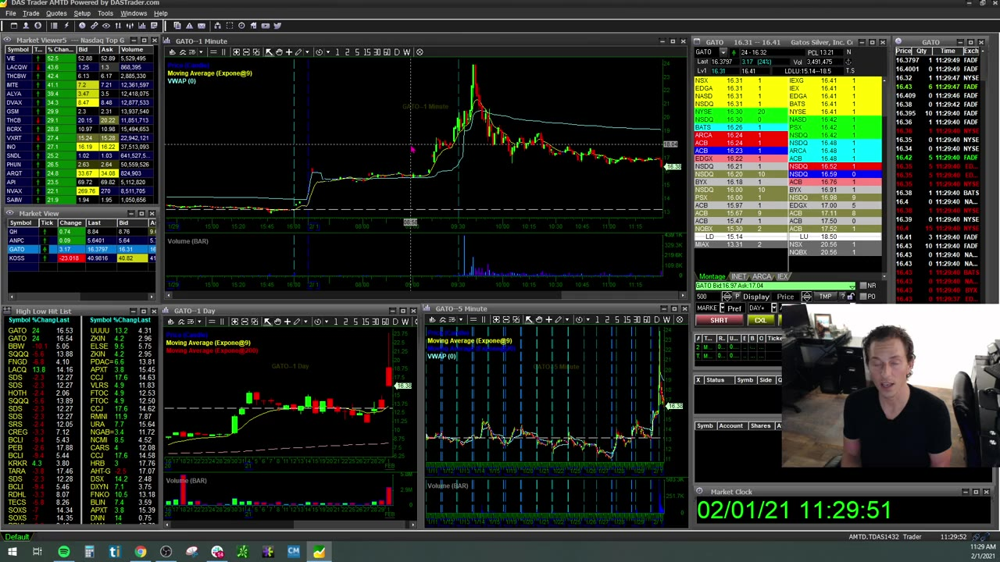
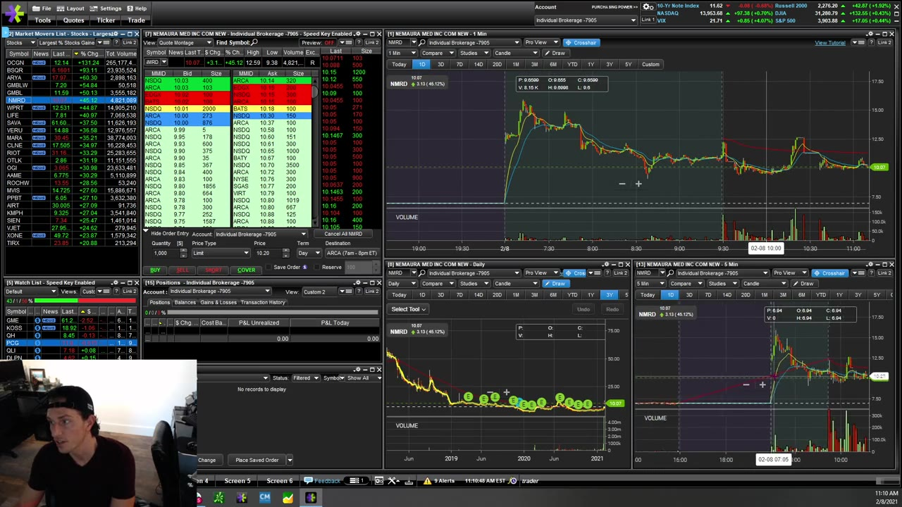
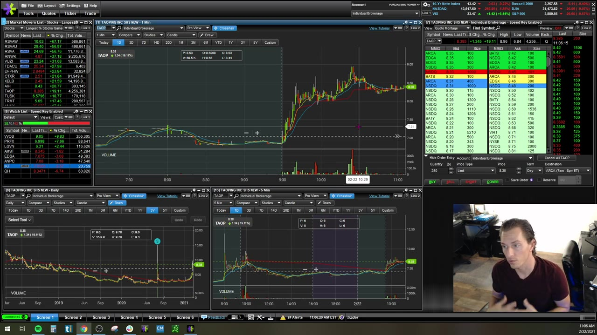

# Weekly Q&A：2021-02

## v0324：2021-02-01

**图怎么看：**

- 5m setup 若 1m 没有配合，要减 size 或等待；不能因大周期“看起来好”忽略近端失效。
- GME 类 hype stock 的图表和常态分布不同，讲师明确承认自己没有稳定 edge。
- Level 2 的大单与实际成交要一起看，不能把挂单当成交承诺。

### 关键内容

- **5m confirmation：**5m pattern 需要 1m 提供 clean pullback/trigger；直接 full size 会把 stop 放得过宽。
- **Profit cushion：**当天先盈利不自动授权增仓。讲师反而常随时间推移降低 size，因为 opportunity quality 和注意力下降。
- **Hype vs edge：**交易 GME 时的 nervousness 来自“由热度驱动、没有可重复 setup”；识别到这一点就应缩小或跳过。
- **Swing list：**课程只是在纸上发展 swing 方法，不构成完整系统；day setup 不能直接延长持有期。
- **学习周期：**“多久盈利”没有通用答案。以 simulator expectancy、最大回撤和规则一致性做门槛。
- **Level 2 balance：**低 volume 时跨价成交更危险；显示量不等于可完整成交量。
- **Runner：**partial 后留小仓捕捉 extension，但 stop 不能把已实现利润全部吐回。
- **统计：**同时检查 winners 是否拿得更久、losers 是否也被放宽；只优化获利端会产生选择偏差。

## v0325：2021-02-08

**图怎么看：**

- Curl 需要 1m 与 5m 重新站回 moving averages，第一目标是前方 resistance。
- “第一根 1m 新高”只有在 momentum、volume、level 上下文中才成立。
- 不同平台 extended-hours 起始时间不同，会让同一 ticker 的图看起来不一致。

### 关键内容

- **Gap history：**课程发现 E*TRADE 与 DAS chart 覆盖不同，必须先确认盘前数据范围再比较高低点。
- **Curl plan：**reclaim EMA/VWAP 后 entry，前一 resistance 先兑现；不是等价格“完全反转”才追。
- **Trade count：**讲师列举当天三笔交易；每笔都有不同 setup/size，重点是机会少而清楚。
- **Preset destination：**ARCA 等 route 是视频个人配置；route 的费用、可用性和行为需按当前 broker 测试。
- **5m entry 后看 1m：**1m 可帮助 partial/exit，但不能因为 1m 小波动忘掉原 5m invalidation。
- **Pullback 类型：**halt pullback、普通 1m pullback 和 5m continuation 的风险不同；“出现一根红 candle”不等于 pullback setup。
- **Liquidity：**36m shares volume 的标的和仅 80k volume 的标的，订单可执行性完全不同。
- **Direct access vs broker platform：**视频感到后者 order/fill feedback 更慢；是否仍如此应以当前小额测试和日志测量。

## v0326：2021-02-22

**图怎么看：**

- 大跌后的低价不自动是“便宜”；先区分 rejection、continued weakness 和真正 base/reclaim。
- Level 2 ask 上大单可能是卖方、short seller 或诱导流动性，身份不能从单一快照确定。
- 同一 5m candle 内 re-entry 会显著提高 churn 和 ticket count。

### 关键内容

- **Poor dip：**新手常把 violent rejection 当 bargain；优质 dip 需要支持位、selling slowdown、reclaim 和明确 stop。
- **Old news/sector sympathy：**blockchain ticker 可能因 BTC 或同板块异动而动，不能把旧 headline 当 fresh catalyst。
- **Re-entry：**第一根新高失败后应先 stop。若同一 candle regain，可等待新的 micro setup，而不是立即 revenge entry。
- **Chart data：**录制时某些免费 feed 有使用限制；当前数据套餐要从平台确认。
- **Hidden/large seller：**大 ask 被成交又刷新更有信息；大单一出现就猜“short”容易被 spoof/cancel 误导。
- **One good trade：**100 次微小交易的手续费、slippage 和 decision fatigue，可能吞掉一笔好 setup 的 edge。
- **Ticket cap：**视频建议新手用最多三笔完整交易（约六张 buy/sell tickets）训练选择性；具体上限可按 journal 调整。
- **Account blow-up：**若佣金本身造成大损失，说明 size/频率/经纪结构与策略不匹配，不能靠多交易摊薄。
