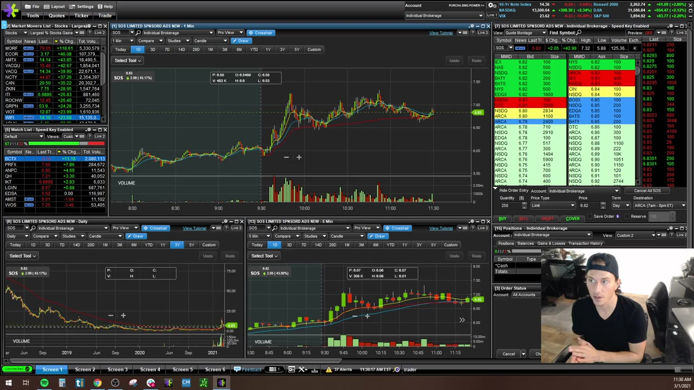
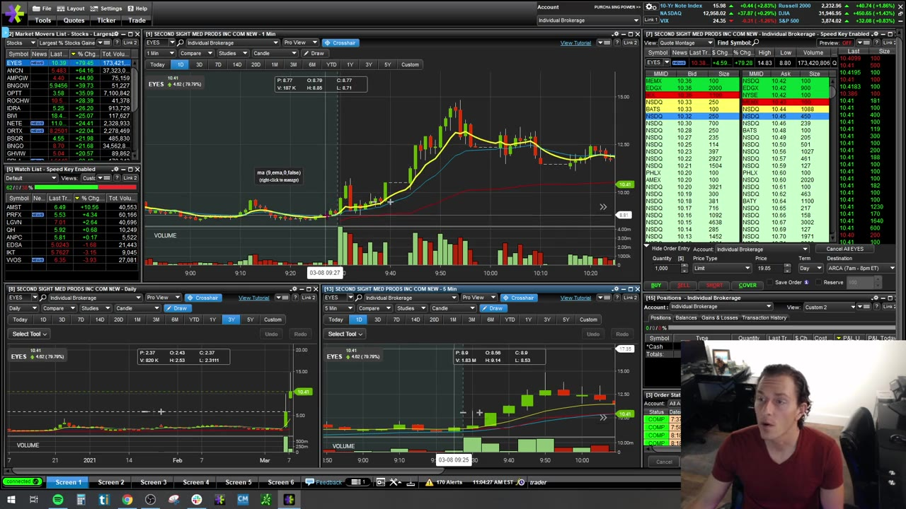
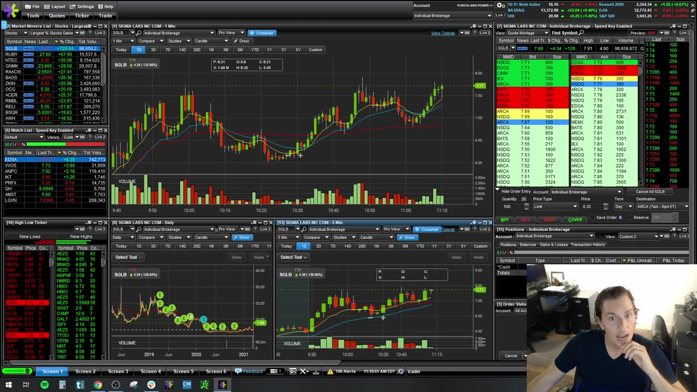
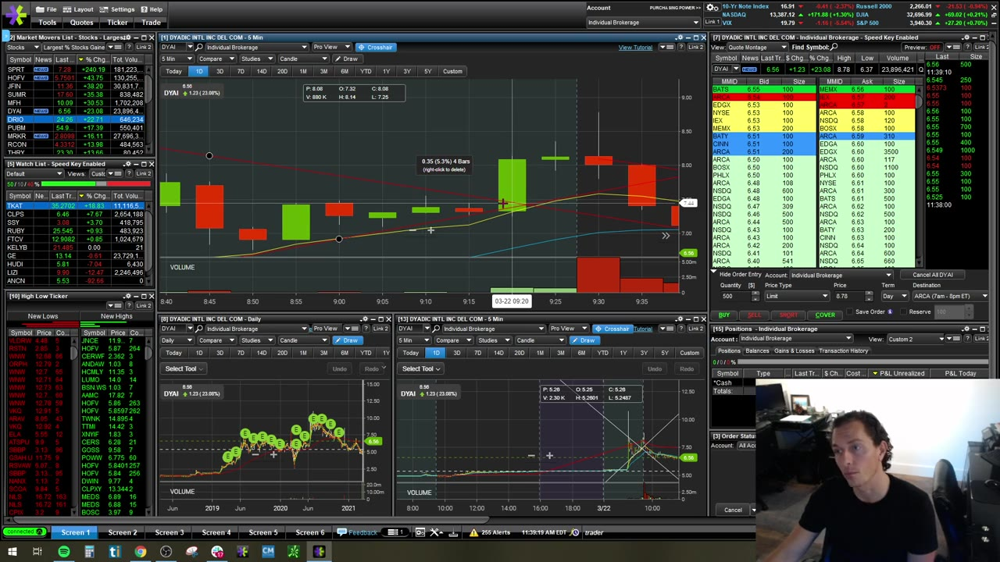
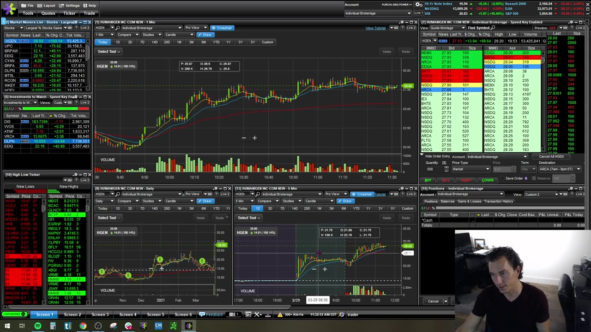

# Weekly Q&A：2021-03

## v0327：2021-03-01

**图怎么看：**

- 大 ask 反复出现、被部分成交后撤掉，是行为证据之一；不能单独判断方向。
- Wedge 必须等实际突破 trigger，anticipation 会把自己暴露在向下 snap。
- 5m setup 要有 news、volume 和市场关注，冷门横盘股上的相似形状不等价。

### 关键内容

- **无即时反应：**入场后 setup 没有按预期推进，可在 hard stop 前主动小亏退出；time stop 也是风险控制。
- **Tape psychology：**订单簿反映参与者行为，但 chart/volume/level 才提供上下文。
- **Confirmation：**等待价格至少打印到 trigger 上方，而不是在下方猜；代价是略差价格，收益是减少假设。
- **“买所有上涨股”不是策略：**clean momentum、catalyst、liquidity 和 structure 缺一不可。
- **Fast exit：**Sterling 的 bailout key 必须带受控 offset 并测试部分成交；具体键位不照抄。
- **Profit/accuracy：**高 accuracy、低 P&L 可能来自 winner 太小或 loser 太大；先从 average winner/loser 和 hold time 分解。
- **Stop automation：**讲师偏 mental/active stop，但这要求持续盯盘；无法做到时，broker stop 加独立监控更合理。

## v0328：2021-03-08

**图怎么看：**

- EYES 的 surge、halt、pullback 和巨大 volume 展示“可交易”与“易交易”不是一回事。
- 多次上下扫动会让 chart 仍 bullish，但 entry/exit 极难。
- 极端案例中的 15-point flush 说明 stop 可能完全跨越预期价位。

### 关键内容

- **Halt entry：**momentum surge 后未 fade、再向 halt 推进是课堂线索，但 resume gap 让实际风险不可线性估计。
- **巨大 loss：**讲师举 1,000 shares 瞬间跌约 15 点的经历；价格反弹减亏是幸运，不是合理风险计划。
- **Gap-and-go regime：**有时反复 gap-and-fade，有时连续 halt；策略要按近期数据调整。
- **Cut losses：**本场反复强调快速退出和绝不 average down，这是处理失控风险的最高优先级。
- **退回 sim：**表现倒退时回 simulator 看似退步，实质是用低成本重建规则。
- **Favorite setup 会变：**选择近期有 clean resolution 的结构，不应永远执着一个名称。
- **Breakeven：**讲师靠记住 average price 主动卖出；若仓位多次 partial/add，必须由平台精确显示，不可凭感觉。

## v0329：2021-03-15

**图怎么看：**

- 5m 在 9 EMA 附近并不抵消 1m 的连续 green candles/extension。
- VWAP 上方“空间”可成为磁吸目标，但必须有正在改善的结构。
- 图中 pullback、dip 和 bounce 使用不同词，核心仍是从哪个 support 触发、在哪里失效。

### 关键内容

- **Live emotion：**size 过大通常直接表现为心跳、犹豫、无法止损；先降 size，仍失控就回 sim。
- **多周期冲突：**5m setup 好但 1m extended，等待 1m reset，不因担心错过而追。
- **Conservative partial：**快速兑现不是错误；可以留 1/4 runner，但 stop 要保护已获得优势。
- **VWAP magnet：**价格与 VWAP 之间有 room 只是 target framework，不是价格必然回归。
- **Shorting dips：**课程反对在下跌末端追 short，理由与追高相同：离合理 invalidation 太远。
- **Speed keys：**E*TRADE 配置仍需从 montage 打开 order entry、核对 side/quantity/price；视频不是通用键位清单。
- **Bad loss recovery：**先定位是 setup failure 还是 rule break，再降 size；不要以当日/当周赶回为目标。
- **Journal：**使用 TraderVue 类工具记录，但需核对 imports、partial fills、fees 和 corporate actions。

## v0330：2021-03-22

**图怎么看：**

- Wedge 的 resistance/support 收敛，真正 trigger 是价格离开边界并有成交确认。
- 关键价位若画偏 0.15，tight stop 会先被噪声触发；level 应从多次反应区确认。
- High-of-day break 常伴随 shorts cover，但不能从上涨结果证明所有卖空者都在回补。

### 关键内容

- **Recovery trade：**一笔 short-squeeze/high-day trade 把当天拉回 green 后，讲师选择停手，承认部分结果有运气。
- **Scanner discovery：**SUMR 先“让自己出现”，再因 volume/structure 纳入；不是提前预测所有 mover。
- **Commission drag：**频繁小 scalp 的毛利不足以覆盖 tickets；更少、更清楚的交易提高净 expectancy。
- **Wedge confirmation：**边界内 anticipation 可能遇到向下 snap；等待 break，再以原边界作 invalidation。
- **Average down：**连续把 9 EMA、20 EMA、VWAP 都解释成新支撑，是移动 thesis；快速 stop 反而是在“创造未来利润”。
- **Sim gate：**先在 sim 证明一组交易盈利和守规，再转 live；一次好日不够。
- **教学平台：**讲师用 E*TRADE 便于展示，不代表已换主 broker；屏幕展示与真实 execution account 要区分。

## v0331：2021-03-29

**图怎么看：**

- 当天 partial fill 后没有 clean follow-through，讲师选择“throw in the towel”。
- Intraday support 与 daily 25 附近 resistance 重合时，level 的可信度来自多周期汇合。
- VWAP 只是 context，盲目在红线处下单没有 edge。

### 关键内容

- **Stop for the day：**一两笔红、机会差就停，不需要等到 max loss；小红日可以几乎不影响月度结果。
- **Higher-priced stock：**spread 和结构 stop 更宽；不适应就换低价/更流动标的，而不是强塞 tight stop。
- **Support zone：**25/24.90 是区域，回踩可能略过一分钱；size 必须容纳合理噪声。
- **VWAP curl：**需要明显 curl、low selling volume 和重新放量，不能只因价格碰 VWAP。
- **Return to live：**回 sim 半个月或一个月变绿仍不足；需要更长、跨不同状态的稳定样本。
- **Direct route：**课程反对在 direct-access broker 使用笼统 smart route，但今天 route 质量/费用要实测。
- **Easy-to-borrow：**它可能吸引新手 short，形成 squeeze fuel；可借性不是 bearish signal。
- **自动化：**small-cap 仍需要人定义当日关注标的和 context；算法不能消除数据和策略风险。
