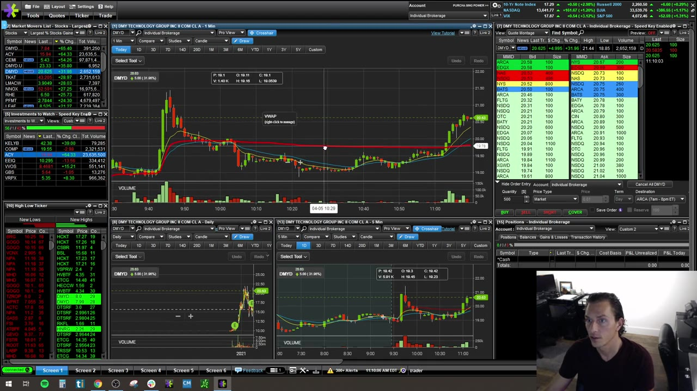
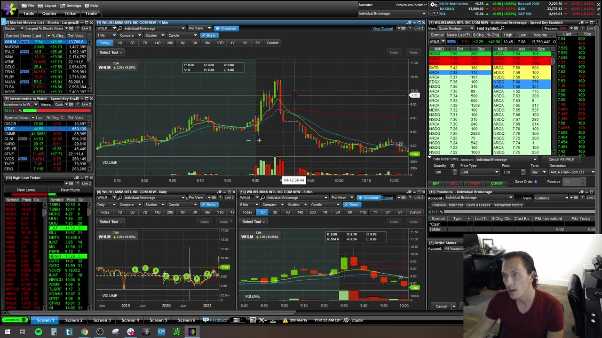
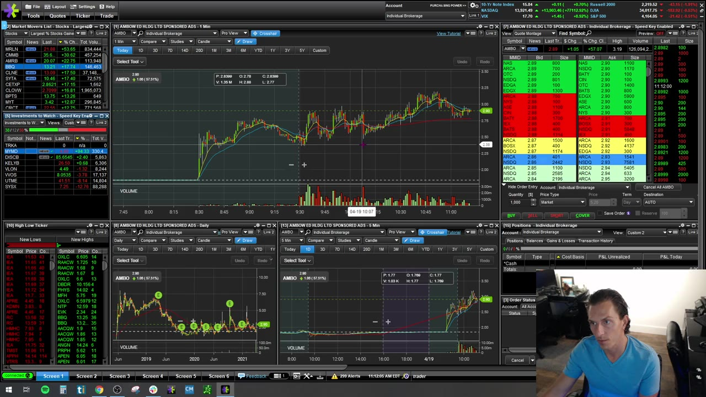
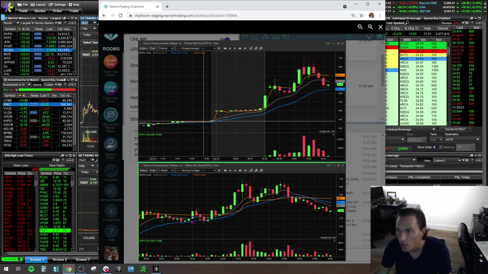

# Weekly Q&A：2021-04

## v0332：2021-04-05



**图怎么看：**

- 一笔 breakout hesitation 造成约 $500 亏损，讲师用它说明“错了就退出，之后仍可重进”。
- DYMD 的 gap、pullback、support hold 是更清楚的 5m continuation。
- ACY 等历史 parabolic area 会影响当前 shorts/longs 的心理，但不是机械支撑。

### 关键内容

- **Small loss：**setup 不按预期推进就 stop；把 $500 变成数千美元只会提高之后恢复难度。
- **Context memory：**相似股票曾从约 2 涨到 15，会吸引参与者，但不能仅凭“它以前这样走过”买入。
- **Sim-to-live：**允许自己初期犯错，但不能使用生活必需资金；size 与账户承受力成比例。
- **Key level + volume：**大量 green volume 只有发生在 premarket high/reclaim 等 trigger 附近才可操作，随机 green candle 不是理由。
- **Curl：**VWAP/20 EMA 附近、10-cent stop 等数字不能固定化；先看 candle range、spread 和 liquidity。
- **Extension：**离 5m 9 EMA 越远，rubber-band 风险越大；等待 pullback 而不是追最后一根 green bar。
- **Red volume：**1m 与 5m selling volume 都是警告，但不自动宣告整天结束；等价格重新选择方向。
- **Halt：**复牌后若不尊重关键 level、反复失败，就没有可定义风险的交易。

## v0333：2021-04-12



**图怎么看：**

- Halt-up、resume higher、pullback、再 halt 是一段完整 sequence；entry 只能依据当时已形成部分。
- 1m setup 若相对 5m 过度 extension，局部形态再漂亮也有 snap-back 风险。
- Support/resistance 在突破后转换，需要实际回踩守住确认。

### 关键内容

- **Emotion：**识图容易，持续在真实 P&L 下守规则更难；size、经验和预设流程决定能否执行。
- **Scanner-only mover：**不在 gap list 的股票，需重新核对 relative volume、float、news 和 clean structure。
- **News：**确认公告确实与公司/当前日期相关，不能用无关或旧消息解释上涨。
- **Automatic stop：**limit stop 可能不成交，market stop 可能滑点；不能认为“已挂 stop”就可离开。
- **Extended stock：**WHLM 等快速推升后，长离 9 EMA 的价格像拉伸橡皮筋；图表技术本身已足以警示。
- **Protect monthly gains：**已经有足够月度利润时，可主动减少暴露，不必在异常行情继续证明自己。
- **Unknown cause：**有时只能确认是 sympathy/flow，无法知道确切原因；不知道就降低置信度，不编故事。
- **Tape vs chart：**大跌前不一定有可读的大单预警；结构 extension 和 failed follow-through 往往更早、更可靠。

## v0334：2021-04-19



**图怎么看：**

- 画支撑阻力时，body 与多根 wick 若集中在同一区域，就按 zone 处理。
- Level 2 用来观察关键价位有没有 volume，不需要逐笔“数订单”。
- 10m+ 当日 volume 不会自动让股票失去交易价值；relative volume、spread 和 float 更有意义。

### 关键内容

- **Wick or body：**使用市场反应最明显的区域；若多根 wick 只短暂刺穿而 body 接受在另一侧，区分 rejection 与 acceptance。
- **Level 2 focus：**先从 chart 得出 level，接近后才看 order flow；反过来会被不断变化的数字牵着走。
- **Scalping 定义：**赚 5 cents 的频繁交易与课程 momentum breakout 不同，不能混用 stop/target 统计。
- **High volume：**10m shares 并非上限；高 volume 常提高进出能力，但也可能对应高 float、较小 range。
- **Long/short opportunity：**同一 range 可同时给多空机会，市场没有 500% mover 不等于自动进入 short regime。
- **Broad market：**讲师对 small-cap 更重视个股当前 price action，不机械从指数方向推多空。
- **Profit cushion：**下一笔交易最多冒已获利润的一部分，如 1/4 或 1/2；不能为了“用利润赌”放弃单笔上限。
- **Good setup losing：**符合计划仍亏损，可以继续评估下一机会；rule break 则应先停。

## v0335：2021-04-26



**图怎么看：**

- 预期 13 区域、未到目标便 sell-off，展示 target 不是承诺。
- MVIS 带 WallStreetBets/hype 背景，attention 很高但结构容易失真。
- 图上 partial 能把浮盈变成 realized P&L，剩余仓才面对后续波动。

### 关键内容

- **Student distraction：**讲课/聊天时交易会分散注意力；无法专注时不应持高速仓位。
- **Hype comparison：**“下一个 GameStop”是叙事，不是 thesis；只交易眼前 level/volume。
- **Slow regime：**连续六个红日可能来自强行交易低质量环境；减少次数比找更多股票更有效。
- **Partial：**已有合理推升时先卖一半，再让其余尝试 target；不要每次只在 full target 或 full stop 二选一。
- **Scale-out learning：**随着数据积累，才知道哪些 setup 值得把 20–30 cent winner 持有更久。
- **5m momentum：**热市场中的 5m setup resolution 更干净；慢市场反复上下，会降低 follow-through。
- **Fear response：**连续被止损后手发抖，说明 nervous system 已超载；更小 size/sim 重建，而不是强迫自己按键。
- **Stop alert：**可给 live stop 配声音，但提醒不能替代对 position/order 状态的核对。

## 月度复盘

四场反复指向同一条链：

```text
market regime
→ candidate quality
→ multi-timeframe structure
→ exact trigger and invalidation
→ size
→ partial/stop
→ journal
```

若前面一环缺失，后面的 Level 2 技巧、热键速度或心理鼓励都无法补救。
