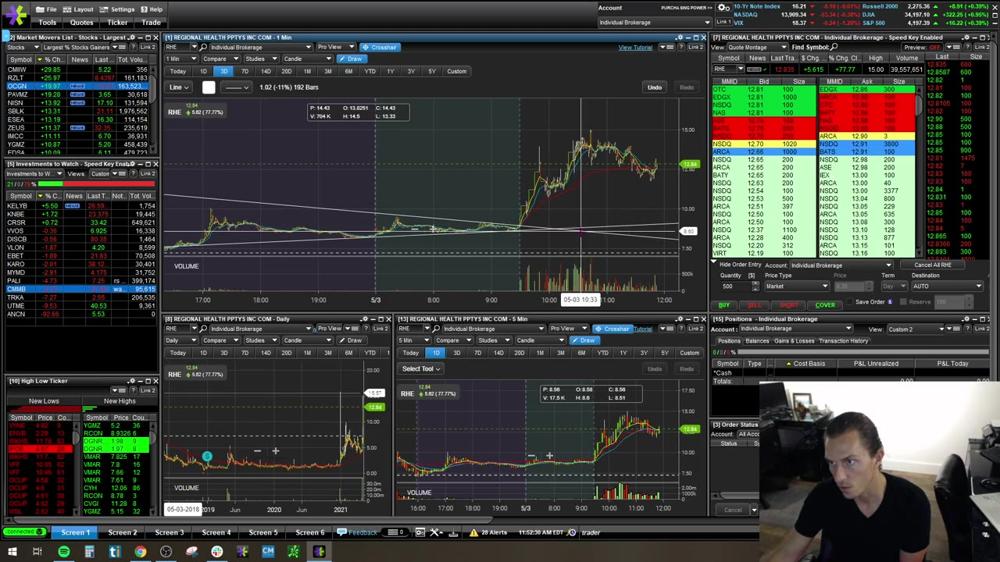
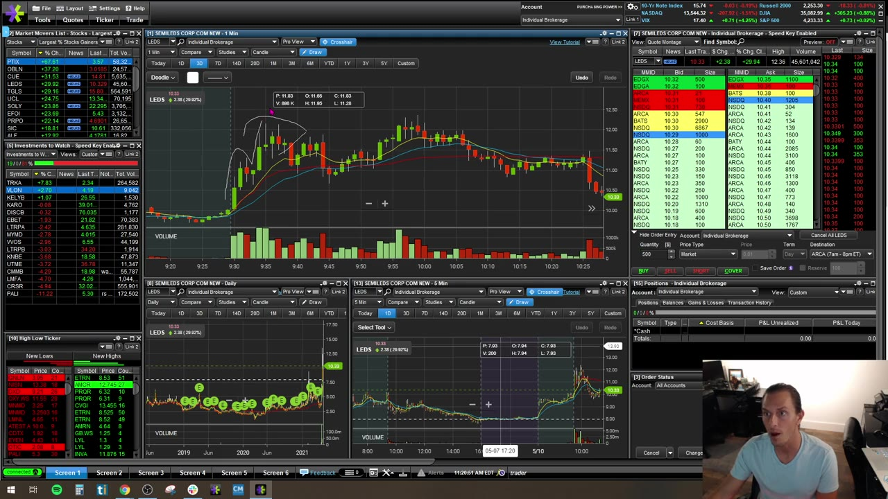

# Weekly Q&A：2021-05

## v0336：2021-05-03

**图怎么看：**

- 讲师承认用 2k–4k shares 较重仓 anticipatory trade，先把错误归因到行为而不是市场。
- Wedge 有反复 lower resistance/higher support，break 前仍可能向任一侧。
- OCGN 的高波动和 slippage 说明按 chart stop 计算的损失可能被放大。

### 关键内容

- **Anticipation + size：**同时提前进场和放大仓位，会把两个风险叠加；若要测试 anticipation，只能用最小 size。
- **Slippage：**低 liquidity/快速股票退出时“dead in the water”，通常比佣金更昂贵。
- **Scanner columns：**字段解释要回到扫描课程和数据字典；列名相同不代表算法相同。
- **单笔恐惧迁移：**上一次被相同 setup 重创，不应让下一次合格 setup 自动失效；先区分是否真的相同。
- **Small controlled loss：**学生在 first flush 只亏约 $158，虽然不舒服，但守住 stop 本身是成功执行。
- **Short bias arrogance：**“股价没理由上涨”不是 stop；当市场证明 thesis 错误就退出，不能以 manipulation 解释不止损。
- **Wedge：**边界被多次确认后，等 break/volume，再以相反边界或最近结构作 invalidation。
- **Connection notice：**数据断线提示出现时停止新单，先确认 quotes/orders/positions。

## v0337：2021-05-10

**图怎么看：**

- 两次 1m pullback 都失败，第二次 failure 是明确 warning，而不是更便宜的第三次机会。
- 5m 形态可以好看，但 1m 仍可能缺少 clean trigger；两个 timeframe 必须一起过关。
- 图表上突发推升引发 FOMO，随后 fade 展示追逐 attention 的代价。

### 关键内容

- **SSR context：**高位 holding、SSR 和市场关注可改变短线行为，但不保证继续上涨。
- **Decision fatigue：**过度交易会让判断质量下降；错误未必立刻显现在 P&L，却会累积到后段。
- **Attention switch：**在 PTIX 已有盈利时看 OBLN pop 并跳过去，容易丢掉原计划并追到 extension。
- **Failed pullbacks：**第一个失败是警报，第二个确认 weakness；不要用“它刚才很强”忽略新证据。
- **One and done：**对高波动窗口，buy all/sell all 后离开，防止连续 curl/flush 把小亏变大。
- **Profit too small：**频繁被 stop、target 总差一点，先检查 entry 是否太追、stop 是否在噪声内、环境是否缺 follow-through。
- **FOMO trigger：**无 fresh news 的突然上涨最容易吸引迟到者；若无法定义 risk，就让它走。
- **Monitor count：**讲师最多同时有约 15 个图，但这来自多屏和长期习惯；学习阶段减少关注标的更有利。

## 这 24 场 Q&A 最值得保留的规则

1. 不 average down；
2. Setup 没有即时按预期推进，可以在 hard stop 前退出；
3. 先从 chart 定义 level，再用 Level 2/Time & Sales 确认；
4. 5m 给上下文，1m 给执行，daily 给 room；
5. Share size 增加会同时放大情绪、slippage 和 loss；
6. 一两笔红时即可停止，不必等 max loss；
7. Simulator 要模拟真实 buying power、tickets 和 size；
8. News、scanner hit、easy-to-borrow、VWAP touch 都不是单独的交易理由；
9. Platform 异常时先确认 orders/positions，不重复点击；
10. 用一组交易的 expectancy 和 rule adherence 评价流程，不用单个赢家评价水平。
